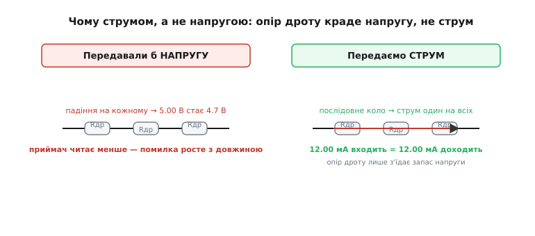
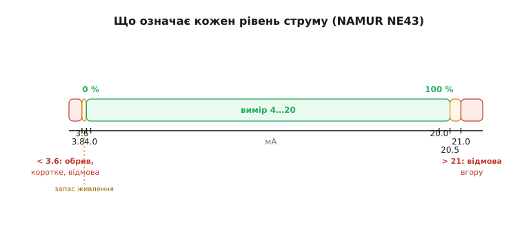
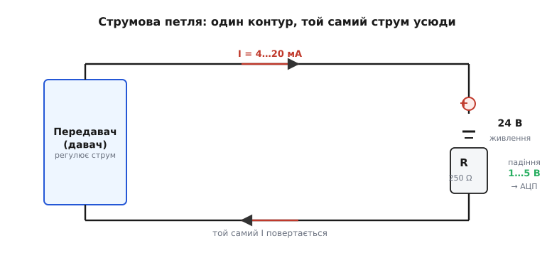

# Струмова петля 4–20 мА

Уявіть давач тиску на даху резервуара за двісті метрів від щитової. Він міряє рівень нафти й має передати число в кімнату керування. Найпростіше, здавалося б, — хай видає напругу: 0 В на дні, 5 В по вінця, а оператор просто читає вольтметр. Так роблять на столі. Так **не роблять** на заводі. Між давачем і щитовою — двісті метрів мідної пари, і ця пара має опір. Доки сигнал дійде, частина напруги осяде на дроті, і приймач прочитає менше, ніж відправили. А ще поряд гудуть силові кабелі, частотні перетворювачі, зварювання — і все це наводить на довгу пару завади, які напруговому сигналу домішуються прямо в корисний рівень.

Розв'язок, що став світовим стандартом промислової автоматики, елегантний до простоти: передавати не напругу, а **струм**. Не «скільки вольт», а «скільки міліампер тече по петлі». Нуль вимірюваної величини — це 4 мА, повна шкала — 20 мА. Звідси й назва: **струмова петля 4–20 мА** (англ. *current loop* — струмовий контур).

## Чому саме струм рятує сигнал

Щоб відчути, чому струм незрівнянно надійніший за напругу на довгій лінії, треба згадати, як струм поводиться в **послідовному колі** (англ. *series circuit* — кола в один ряд). Передавач, обидві жили пари й приймач увімкнені один за одним у єдиний замкнений контур. А в послідовному колі струм скрізь **однаковий** — це прямий наслідок збереження заряду: заряд не накопичується в дроті й не зникає, скільки електронів увійшло в перетин за секунду, стільки й вийшло. Тому 12.00 мА, які передавач «вштовхує» з одного кінця, доходять до приймача на іншому кінці незмінними — байдуже, двадцять метрів між ними чи двісті.

А куди ж дівається опір дроту? Він нікуди не дівається — але краде він **напругу**, а не струм. На кожному метрі пари осідає трохи напруги (закон Ома: спад дорівнює струму на опір ділянки), і це падіння просто з'їдає частину запасу напруги джерела. Доки запасу вистачає, щоб проштовхнути потрібний струм через увесь опір петлі, приймач отримує точну величину. Опір лінії перестав бути джерелом похибки й перетворився на просту вимогу «дай досить напруги».


*Опір дроту віднімає напругу на кожній ділянці. Напруговий сигнал від цього спотворюється, струмовий — ні: струм у послідовному колі скрізь однаковий.*

> 🔧 **Навіщо це.** Саме тому 4–20 мА живе вже понад пів століття й нікуди не зникає навіть у добу цифрових шин. Двопровідну пару можна тягти сотні метрів через цех із важкою технікою, не екрануючи її так ретельно, як знадобилося б для слабкого напругового сигналу. Дешевий кабель, проста монтаж — і число доходить точним.

Із завадами історія схожа. Завада наводиться на пару переважно як **наведена напруга**. Але струмова петля — низькоомне коло: приймач замикає її через малий вимірювальний резистор, і щоб така петля «повірила» в зайвий струм, завада мусила б проштовхнути цей струм через усю петлю, а на це в неї не вистачає ні напруги, ні джерела. Тому наведення майже не перетворюється на похибку струму. Якщо ж обидві жили скрутити в **виту пару** (англ. *twisted pair*), наведення на сусідні скрутки взаємно гаситься — і петля стає ще тихішою.

## Жива нуль: чому не 0–20, а 4–20

Найхитріша й найкорисніша риса стандарту — те, що нуль шкали відсунутий від нуля струму. Порожній резервуар — це не 0 мА, а **4 мА**. Здавалося б, марнотратство: чотири міліампери течуть, навіть коли міряти нема чого. Насправді ці чотири міліампери роблять одразу дві важливі справи.

Перша — **жива нуль** (англ. *live zero* — «живий нуль»). У справному колі струм ніколи не падає нижче 4 мА. Тому якщо приймач бачить **0 мА**, це однозначно не «порожній резервуар», а **обрив**: перебитий дріт, від'єднана клема, мертвий передавач. Якби нуль шкали був 0 мА, обрив лінії й чесний нуль вимірювання виглядали б однаково, і оператор не відрізнив би справжню небезпеку від нормальної роботи. Жива нуль робить несправність видимою сама собою, без жодного окремого датчика обриву.

Друга справа тонша. Багато передавачів — **двопровідні** (англ. *two-wire*): у них лише дві клеми, ті самі, якими тече сигнальний струм, слугують і живленням. Окремих дротів живлення нема. Тоді ці гарантовані 4 мА — мінімальний струм, з якого передавач живить власну електроніку: підсилювач, опорне джерело, аналого-цифрову частину. Якби в нулі шкали струм падав до нуля, прилад просто вимкнувся б. Тож живий нуль годує передавача навіть тоді, коли вимірювана величина на дні.

> 🔧 **Навіщо це.** Жива нуль — це безпека, вшита в саму фізику сигналу, а не дописана зверху. Обрив кабеля екскаватором, окислена клема, відмова передавача — усе це миттєво дає струм нижче робочого, і система переходить у безпечний стан (закриває клапан, б'є на сполох), не чекаючи, поки хтось помітить.

Народилася ця логіка не на електриці. До електроніки заводи керувалися **стиснутим повітрям**: вимірювання передавалося тиском у мідній трубці, 3 psi — нуль, 15 psi — повна шкала. Там «живий» нижній край (3, а не 0) теж відрізняв справну лінію від лопнутої трубки. Коли в 1950-х на зміну прийшла електроніка, інженери свідомо скопіювали саме цю логіку — лише замінили тиск струмом, зберігши співвідношення розмаху приблизно 1:5. Як пневматика 3–15 psi перетворилася на електричні 4–20 мА і чому програв ранній стандарт 10–50 мА — окрема [історія переходу](topic:hw-analog/current-loop-4-20ma/hist-pneumatic-to-electronic.md): пневматичні «живі нулі», конкуренція ранніх струмових діапазонів і те, як 4–20 мА витіснив усіх інших.

## Що означає кожен рівень струму

Робоча шкала 4–20 мА не займає весь діапазон, на який здатна петля, і це навмисне. Над і під робочою смугою лишені вузькі поля, кожне зі своїм змістом, — їх закріпив галузевий рекомендаційний документ **NAMUR NE43** (NAMUR — німецьке об'єднання користувачів автоматики в процесній промисловості; NE — *NAMUR-Empfehlung*, «рекомендація NAMUR»).


*Кожен рівень струму несе зміст. 4–20 мА — корисний вимір; вузькі поля по краях — запас і насичення; крайні зони — однозначний сигнал несправності.*

Розклад такий:

```
< 3.6 мА   обрив, коротке, відмова з сигналом «вниз»
3.6–3.8    запас: тут передавач ще живиться, але вже не вимір
3.8 мА     нижня межа достовірного виміру (легке недовантаження)
4.0 мА     0 % шкали
20.0 мА    100 % шкали
20.5 мА    верхня межа достовірного виміру (легке перевантаження)
> 21.0 мА  відмова з сигналом «вгору»
```

Сенс полів — у тому, що між «це ще точний вимір» і «це вже несправність» лишається зазор, який нічого не плутає. Розумний передавач, виявивши власну поломку (відмову давача, збій пам'яті), навмисне виставляє струм у червону зону — 3.6 мА «вниз» або 21 мА «вгору», залежно від того, який бік замовник обрав безпечним. Приймач читає це не як абсурдний вимір, а як чітке «мені погано». Невеличкий проміжок 3.6–3.8 мА лишений тому, що двопровідному передавачу й під час сигналу відмови потрібен струм на власне живлення — інакше він не зміг би повідомити навіть про власну смерть.

## Скільки напруги треба петлі: запас відповідності

Раз опір лінії краде напругу, природне питання — а скільки ж напруги має дати джерело, щоб струм точно проштовхнувся через усе коло на найбільшому струмі? Цю вимогу називають **запасом відповідності** (англ. *compliance voltage* — напруга відповідності): мінімальна напруга джерела, за якої петля ще здатна гнати потрібний струм через увесь свій опір.

Рахується вона прямим складанням за **законом напруг Кірхгофа** (англ. *Kirchhoff's voltage law* — сума спадів напруги в замкненому контурі дорівнює прикладеній): напруга джерела має покрити мінімальну напругу, потрібну самому передавачу, плюс падіння на опорі обох жил, плюс падіння на вимірювальному резисторі приймача. Усе це — на найгіршому випадку, тобто на максимальному струмі 20 мА, коли падіння найбільші.

**Умова: джерело 24 В, передавачу треба щонайменше 12 В на власну роботу, вимірювальний резистор приймача 250 Ω, опір однієї жили 0.05 Ω/м. Яку максимальну довжину пари витримає петля?**

```
Запас напруги на лінію = U_дж − U_перед − I·R_вим
                       = 24 − 12 − 0.020·250
                       = 24 − 12 − 5.0
                       = 7.0 В

Це падіння — на ОБОХ жилах (туди й назад):
R_лінії_макс = 7.0 / 0.020 = 350 Ω   (на обидві жили разом)

Опір на метр пари (дві жили) = 2 · 0.05 = 0.1 Ω/м
Довжина_макс = 350 / 0.1 = 3500 м
```

Висновок: навіть із доволі скромним джерелом і ненайтоншим дротом петля спокійно тягнеться на кілометри. Якщо ж довжина не влізає — є три важелі: підняти напругу джерела, зменшити вимірювальний резистор (тоді менший розмах напруги на ньому, але більше запасу) або взяти товщу пару. Усі три прямо випливають з тієї самої суми Кірхгофа.

> 🔧 **Навіщо це.** Перш ніж тягнути кабель, проєктант рахує саме цей баланс. Не зійдеться — на дальньому давачі струм у верхній частині шкали «впреться в стелю» й перестане рости, бо джерелу забракне напруги проштовхнути 20 мА. На щиті це виглядає як давач, що «не дотягує до 100 %», хоча резервуар повний. Баланс напруг — перша річ, яку перевіряють, коли далекий канал поводиться дивно.

## Як приймач перетворює струм назад на число

Приймачу зручніше працювати з напругою — її читає аналого-цифровий перетворювач. Тому петлю замикають через точний **вимірювальний резистор** (англ. *sense resistor* — резистор-давач струму), і за законом Ома струм перетворюється на пропорційну напругу: U = I · R. Класичний вибір — 250 Ω, бо тоді робоча смуга струму лягає в зручні рівні напруги:

```
U = I · R
4 мА  на 250 Ω  →  0.004 · 250 = 1.00 В
20 мА на 250 Ω  →  0.020 · 250 = 5.00 В
```

Виходить рівний діапазон 1–5 В — і знову з живою нижньою межею: 1 В, а не 0 В, тому обрив (0 мА → 0 В) і нуль шкали (4 мА → 1 В) лишаються розрізнюваними і після перетворення в напругу.

У прошивці приймача залишається проста лінійна арифметика — перевести виміряний струм у фізичну величину. Нехай мікроконтролер уже отримав з АЦП струм у мікроамперах (через свій вимірювальний резистор) і знає, що давач тиску показує 0…10 бар на шкалі 4…20 мА:

```c
// Перевід струму петлі у фізичну величину (тиск, бар).
// Вхід: струм у мікроамперах (uA), уже виміряний приймачем.
float loop_to_bar(int32_t i_uA)
{
    const int32_t I_LOW  = 4000;    // 4.000 мА  = 0 %  шкали
    const int32_t I_HIGH = 20000;   // 20.000 мА = 100 % шкали

    // Спершу — діагностика NAMUR: чи це взагалі вимір?
    if (i_uA < 3600) return -1.0f;  // обрив / відмова «вниз»
    if (i_uA > 21000) return -2.0f; // відмова «вгору»

    // Лінійне відображення 4…20 мА → 0…10 бар.
    float frac = (float)(i_uA - I_LOW) / (float)(I_HIGH - I_LOW);
    return frac * 10.0f;            // 0…10 бар
}
```

Уся «магія» виміру звелася до однієї прямої лінії між двома відомими точками плюс перевірки країв на несправність. У цьому й сила стандарту: фізика передачі надійна, а перерахунок — арифметика рівня шкільної пропорції.

## Дві, три, чотири жили

Передавачі розрізняють за тим, як до них заходить живлення, і це визначає монтаж.

**Двопровідний** (англ. *two-wire*, *loop-powered* — живлений від петлі) — найпоширеніший і найощадніший. Лише дві клеми; той самий струм петлі і живить прилад, і несе вимір. Електроніка передавача мусить уміститися в бюджет: навіть у нулі шкали їй дозволено спожити не більш як 4 мА (інакше струм петлі не зміг би опуститися до 4 мА). Це строге обмеження визначає весь схемотехнічний клас [двопровідного передавача 4–20 мА](topic:hw-analog/current-loop-4-20ma/comp-loop-powered-transmitter.md) — як він регулює власне споживання так, щоб сума всіх внутрішніх струмів і була вихідним сигналом: типова будова, керована заслінка струму, типові граблі бюджету.

**Трипровідний** (англ. *three-wire*) — окремий провід живлення, спільна земля, окремий провід сигналу. Електроніка живиться повноцінно, тому бюджет 4 мА вже не тисне, і прилад може бути «розкішнішим». Натомість три жили замість двох і спільна земля з її ризиками.

**Чотирипровідний** (англ. *four-wire*) — окрема пара живлення й окрема пара сигналу, повністю розділені. Найбільше дротів, зате передавач і петля живляться незалежно, а сигнал гальванічно відв'язаний від живлення. Так роблять там, де потрібна повна розв'язка або де прилад споживає надто багато, щоб живитися від петлі.

## Де петля все ж програє і де вона особливо сильна

Жодна петля не передасть більш як одне число — це один аналоговий канал на пару дротів. Хочеш десять величин з приладу — тягни десять петель або переходь на цифрову шину. Швидкість теж скромна: 4–20 мА добре передає повільні процесні величини (тиск, рівень, температуру), а не швидкі сигнали. Це не вада, а межа призначення: стандарт народжений для надійної передачі однієї повільної величини на велику відстань, і саме в цьому йому досі мало рівних.

Є й приємний бонус від низькоомної природи петлі — стійкість до **петель по землі**. Бо приймач реагує на струм у контурі, а не на потенціал землі під ним, різниця потенціалів між «землею» давача й «землею» щитової не вливається прямо в покази так, як вона вливалася б у напруговий сигнал. Повністю від земляних проблем це не рятує (на потужну [петлю по землі](topic:hw-analog/current-loop-4-20ma/proj-galvanic-isolation.md) ставлять гальванічну розв'язку — оптичну чи трансформаторну вставку в петлю, що розриває паразитний контур, не пропускаючи постійний струм), але вроджена несприйнятливість струмового сигналу до наведень — велика частина того, чому 4–20 мА так добре почувається в електрично брудному цеху.


*Уся система — єдиний послідовний контур. Передавач задає струм, джерело дає напругу, резистор приймача перетворює струм назад на напругу для АЦП.*

Зведімо нитку. Передавати число струмом, а не напругою, варто тому, що в послідовному колі струм скрізь однаковий — і опір довгого дроту краде лише напругу, не псуючи виміру, а низькоомна петля майже не вірить наведеним завадам. Зсув нуля до 4 мА дає живу нуль: обрив видно сам собою, а двопровідний передавач живиться навіть у нулі шкали. Поля NAMUR над і під робочою смугою перетворюють сам струм на канал діагностики. А приймачу досить замкнути петлю точним резистором і провести одну пряму лінію — і фізично надійний сигнал стає звичайним числом.
