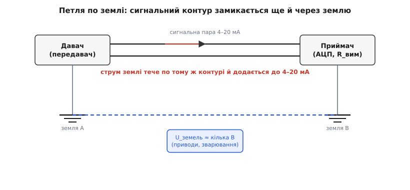

# ⚙️ Гальванічна розв'язка струмової петлі

Струмова петля 4–20 мА сама собою доволі стійка до земляних негараздів — низькоомне коло реагує на струм у контурі, а не на потенціал землі під ним. Але «доволі стійка» — не те саме, що «недоторкана». Уявіть резервуар із кислотою на одному кінці цеху й щитову на іншому, за дві сотні метрів бетону. Корпус давача притягнутий до місцевої арматури — це його земля. Корпус приймача в щитовій притягнутий до головної шини заземлення — це інша земля. Здавалося б, обидві «землі» — одне й те саме, бо обидві зрештою йдуть у ґрунт. Насправді між ними майже завжди стоїть напруга: кілька вольтів, іноді десятки, а під час замикання чи розряду — і сотні. Бетон не надпровідник, ґрунт не еквіпотенціальний, а по тілу заводу течуть струми зварювання, частотних приводів, потужних насосів — і кожен лишає на заземленні свій спад напруги.

І ось у чому халепа. Якщо давач заземлений з одного боку, а приймач — з іншого, то сигнальна пара вже не єдиний контур: вона стає одним боком **другої, паразитної петлі**, що замикається через землю. Цей зайвий контур зветься **петлею по землі** (англ. *ground loop* — контур по землі), і різниця потенціалів двох заземлень жене по ньому власний струм. А цей струм тече тими ж дротами, що й корисні 4–20 мА, і додається до них. Приймач уже не може відрізнити, де закінчуються чесні міліампери давача й починається паразитна добавка з тіла заводу. Вимір попливе, а в найгіршому разі — стрибне на десятки відсотків щоразу, коли поряд увімкнеться важка машина.


*Дві землі ніколи не на одному потенціалі. Якщо обидва кінці петлі заземлені, сигнальна пара стає боком другого, паразитного контуру через землю — і струм цього контуру домішується в покази.*

Класична порада — заземлювати петлю **лише в одній точці**, тоді другого контуру немає й паразитному струму нікуди текти. Так і роблять, коли можуть. Та на справжньому заводі «можуть» не завжди: давач за конструкцією заземлений на корпус (мокре, вибухонебезпечне середовище вимагає міцного заземлення), приймач теж мусить бути заземлений з міркувань безпеки, а між ними — кілометри й чужі землі. Розірвати один із заземлень не дозволяють правила. І тоді лишається єдиний чесний вихід: вставити в саму петлю **гальванічний бар'єр** — пристрій, що пропускає сигнал, але фізично не має суцільного дроту крізь себе, тож постійному струмові землі просто нема куди текти.

Розберімося, **чому** одного заземлення не завжди досить, як збудувати бар'єр, що пропускає число й не пропускає струм землі, як написати прошивку приймача, яка лінеаризує й калібрує такий бар'єр, і де чатують пастки — бо наївна розв'язка легко зіпсує сигнал гірше, ніж та петля по землі, яку вона мала вилікувати.

## Задача: розірвати контур, не розірвавши сигнал

Сформулюймо точно, чого ми хочемо, бо ціль на перший погляд суперечлива. Нам треба, щоб **сигнал пройшов** з боку давача на бік приймача — інакше навіщо взагалі лінія. І водночас треба, щоб **постійний струм не пройшов** — інакше петля по землі лишиться. Як пропустити одне й не пропустити інше через те саме місце?

Ключ у тому, що петля по землі — це насамперед **постійний або повільний** струм: різниця потенціалів заземлень тримається секундами й хвилинами, повзе з навантаженням заводу. А корисна інформація в 4–20 мА — це **значення** струму, яке теж змінюється повільно, але яке ми можемо перенести через бар'єр не самим дротом, а **посередником**: світлом, магнітним полем, ємнісним зв'язком. Посередник переносить інформацію про величину, не переносячи самих електронів. Дроту крізь бар'єр немає — значить, немає й суцільного контуру, значить, петля по землі розірвана. А число якимось хитрим чином усе одно перестрибує прірву.

> 🔧 **Навіщо це.** Гальванічна розв'язка — не «покращення сигналу», а **розрив фізичного контуру**. Доти, доки крізь пристрій іде хоч один суцільний провідник від землі A до землі B, петля по землі живе, хоч скільки фільтрів повісь. Бар'єр виграє саме тим, що суцільного провідника в ньому **немає взагалі** — є прірва, яку інформація долає без дроту. Тому розв'язку міряють не в децибелах послаблення завади, а в кіловольтах, які бар'єр витримує, не пробившись.

Що нам дасть розв'язка, окрім розриву петлі? Одразу й **захист**: якщо на боці давача станеться кидок напруги — удар блискавки в кабель, пробій на силовий — бар'єр не пустить його в щитову до дорогої електроніки приймача. Бар'єр, розрахований на 2.5 чи 5 кВ ізоляції, стає й запобіжником від високовольтних кидків. Це приємний бонус, але головна задача лишається та сама: **розірвати постійний контур, провівши крізь нього змінне число**.

## Ідея перша: оптична вставка зі сервопетлею

Найприродніший посередник — **світло**. Поставмо на боці давача світлодіод, яскравість якого залежить від струму петлі, а на боці приймача — фотоприймач, що ловить це світло й відновлює струм. Між ними — прозорий проміжок (повітря, скло, прозорий компаунд), крізь який летять фотони, але не йде жоден провідник. Пара «світлодіод + фотоприймач» в одному корпусі зветься **оптопарою** (англ. *optocoupler*, *optoisolator* — оптичний ізолятор), і вона — робоча конячка гальванічної розв'язки в усій електроніці.

Біда в тому, що звичайна цифрова оптопара годиться лише для двох станів — світить або ні, увімкнено або вимкнено. Для **аналогового** 4–20 мА вона не підходить, і причина в самій фізиці світлодіода. Скільки світла дає світлодіод на даний струм — описує **коефіцієнт передачі за струмом** (англ. *current transfer ratio*, CTR): відношення фотоструму на виході до струму світлодіода на вході. І цей CTR — величина паскудна. Він різний у різних екземплярів (розкид у рази), він **пливе з температурою**, і — найгірше — він **старіє**: світлодіод за роки роботи тьмяніє, його CTR повільно падає. Якщо ми наївно поставимо струм світлодіода пропорційним 4–20 мА й повіримо фотострумові на виході, то наш «вимір» гулятиме разом із температурою корпусу й повзтиме роками вниз із тьмянінням світлодіода. Для сигналу, де помилка в один відсоток уже забагато, це катастрофа.

Як же приборкати примхливий світлодіод? Тим самим прийомом, яким приборкують будь-яку примхливу ланку — **зворотним зв'язком**. Ідея геніальна у своїй простоті: поставмо **два однакові фотодіоди**, освітлені тим самим світлодіодом. Один — на боці приймача, він дає корисний вихід. Другий — **на боці передавача, поряд зі світлодіодом**, він стежить за тим, скільки світла насправді випромінює світлодіод. Тепер замкнімо петлю: вхідний підсилювач женеться не за струмом світлодіода, а за фотострумом **сторожового** (сервісного, англ. *servo* — слідкувальний) фотодіода, підганяючи струм світлодіода доти, доки сторожовий фотострум не зрівняється із завданням. Хай світлодіод тьмяніє, хай гріється — підсилювач просто додасть йому струму, щоб сторожовий фотодіод бачив рівно стільки світла, скільки треба.

А тепер ключова думка. Обидва фотодіоди **однакові** й бачать **те саме світло**. Тож якщо петля тримає фотострум сторожового фотодіода рівним завданню, то й фотострум вихідного фотодіода дорівнює тому самому завданню (помножений на відношення двох фотодіодів). Уся примхливість світлодіода — його CTR, дрейф, старіння — потрапляє **в обидва фотодіоди однаково** й тому **скорочується**. Лишається тільки відношення двох фотодіодів між собою, а їх роблять із одного кристала поряд, тож вони майже ідентичні й дрейфують разом. Світлодіод випав з рівняння. Це і є **лінійна оптопара зі сервопетлею** (англ. *linear optocoupler with servo feedback*).


*Сервопетля прибирає головну ваду оптопари. Вхідний підсилювач женеться за фотострумом сторожового фотодіода PD1, тримаючи його рівним завданню, тож яскравість світлодіода підлаштовується сама. Вихідний фотодіод PD2 бачить те саме світло — і його струм повторює завдання, не залежачи від дрейфу й старіння світлодіода. Лишається стале відношення двох фотодіодів.*

Класична деталь цього класу — **IL300** (родом із Siemens Semiconductor, нині випускає Vishay): високоефективний світлодіод на AlGaAs і **два незалежні PIN-фотодіоди** в одному корпусі. Виробник вводить три коефіцієнти: **K1** — передача «світлодіод → сторожовий фотодіод», **K2** — передача «світлодіод → вихідний фотодіод», і головний **K3 = K2 / K1** — відношення двох передач, тобто та сама стала, що лишається після скорочення світлодіода. K3 близький до одиниці, і — найважливіше — деталі **сортують за K3** на бінах ±5 % (вимірюючи при струмі світлодіода 10 мА), тож у конкретного екземпляра ви знаєте K3 із точністю до п'яти відсотків. PIN-фотодіоди мають мізерний темновий струм (одиниці пікоампер), тому коло чисте навіть на малих сигналах. На такій парі будують ізолятор 4–20 мА з лінійністю краще за 0.01 % по всій шкалі — на два порядки тихіший за наївну одно-фотодіодну схему. *(Параметри — за даташитом Vishay IL300 та її прикладними нотатками; усталено.)*

> 🔧 **Навіщо це.** Сервопетля — це урок, ширший за оптопару. Коли в сигнальний тракт лізе примхлива, нелінійна, дрейфлива ланка (світлодіод, нагрівач, механічний привод), не бийтеся за те, щоб зробити **її** ідеальною — це майже неможливо. Натомість **поставте поряд таку саму ланку-двійника й замкніть зворотний зв'язок**: нехай петля жене першу ланку доти, доки двійник не покаже потрібне. Тоді спільні вади двох ланок скорочуються, а вам лишається тільки їхнє стале відношення. Так працює і лінійна оптопара, і прецизійні джерела струму, і термостати.

## Ідея друга: трансформаторна вставка з модуляцією

Світло — не єдиний посередник. Магнітне поле теж переносить інформацію через прірву без жодного провідника крізь неї — на цьому стоїть **трансформатор** (англ. *transformer*): дві котушки на спільному осерді, перша наводить магнітний потік, друга знімає з нього напругу, але міді з одної в другу немає. Трансформатор — природний гальванічний бар'єр, і витримати він може хоч кіловольти, залежно від ізоляції між обмотками.

Та є фундаментальна перешкода: **трансформатор не передає постійний струм**. Він наводить напругу лише тоді, коли потік **змінюється**; стале поле наводить нуль. Це фізичний закон (наведення пропорційне швидкості зміни потоку), і саме він робить трансформатор ідеальним розривачем петлі по землі — постійний струм землі він блокує **за своєю природою**. Але та сама природа блокує й наш повільний, майже постійний сигнал 4–20 мА. Як передати повільне число тим, що проводить лише швидку зміну?

Відповідь — **модуляція** (англ. *modulation* — перетворення повільного сигналу на швидкий несівний). Спершу перетворимо повільне число на **швидкий змінний** сигнал, який трансформатор охоче пропустить, переженемо його через бар'єр, а на тому боці перетворимо назад. Найпоширеніший спосіб у прецизійних ізоляторах — **широтно-імпульсна модуляція робочого циклу** (англ. *duty-cycle modulation*): на вході сигнал керує **відношенням тривалостей** прямокутних імпульсів швидкої несівної (скажімо, 500 кГц). Менше число — вужчі імпульси, більше — ширші; сама несівна летить через трансформатор (чи через ємнісний бар'єр) на повній швидкості, а корисне число сховане в її шпаруватості. На приймальному боці демодулятор міряє цю шпаруватість і відновлює напругу, а простий фільтр прибирає несівну.

Саме так влаштований класичний **ізолювальний підсилювач** (англ. *isolation amplifier*) на кшталт **ISO124**: він переносить сигнал через ємнісний бар'єр 2 пФ як модульовану за шпаруватістю несівну ~500 кГц, дає нелінійність до 0.01 % і не потребує жодних зовнішніх деталей для роботи. На вихід ставлять фільтр, що згладжує залишок несівної. *(Параметри — за даташитом Texas Instruments ISO124; усталено.)*

Ось дві школи розв'язки в одному реченні: **оптична** ховає число в яскравість світла й бореться з дрейфом світлодіода сервопетлею; **трансформаторно-ємнісна** ховає число в шпаруватість швидкої несівної й бореться з блокуванням постійного струму модуляцією. Обидві ведуть до спільної мети — бар'єра без суцільного дроту.


*Бар'єр у петлі. Вхід ізолятора читає струм на боці давача й кодує його в посередника (світло або модульоване поле); посередник переносить значення через прірву; вихід відновлює струм у власну петлю приймача. Кожен бік має свою землю й своє живлення — суцільного провідника крізь бар'єр немає, тож постійний контур струму землі розірвано.*

## Робочий C/C++: лінеаризація й калібрування зсуву ізолятора

Хоч би який бар'єр ви взяли — оптичний чи трансформаторний — на виході він дає **напругу або струм, лише приблизно пропорційні** входу. Між ними завжди стоять дві похибки, які мусить прибрати приймач, і тут на сцену виходить мікроконтролер. Перша похибка — **зсув** (англ. *offset*): навіть коли на вході рівно 4 мА, на виході ізолятора з'являється не точно очікуване значення, а зсунуте на якусь сталу — через темновий струм фотодіода, через зсув підсилювачів, через несиметрію модулятора. Друга — **підсилення** (англ. *gain*): нахил «вихід на одиницю входу» не точно одиниця, а K3·(щось), і це «щось» теж відоме лише приблизно. Обидві лікуються **двоточковим калібруванням**: подаємо на вхід ізолятора рівно 4 мА, записуємо, що бачить АЦП; подаємо рівно 20 мА, записуємо знову; і будуємо пряму через ці дві точки. Усе, що ізолятор спотворив сталим зсувом і сталим нахилом, ця пряма прибирає.

Ось структура калібрування й перерахунку для прошивки приймача. Код реальний — такий стоятиме в мікроконтролері приймального боку, що читає вихід ізолятора через свій АЦП.

:::tabs
```cpp
#include <cstdint>

/* Калібрувальні точки ізолятора: що показав АЦП приймача,
   коли на вхід ізолятора подали рівно 4 мА і рівно 20 мА.
   Заповнюються один раз під час калібрування й лежать в EEPROM/Flash. */
struct iso_cal_t {
    int32_t adc_at_4mA;    /* код АЦП при 4.000 мА на вході ізолятора  */
    int32_t adc_at_20mA;   /* код АЦП при 20.000 мА на вході ізолятора */
};

/*
 * Відновити струм петлі (мкА) з коду АЦП, прибравши зсув і нахил ізолятора.
 * Двоточкова пряма: 4 мА ↔ adc_at_4mA, 20 мА ↔ adc_at_20mA.
 * Повертає струм у мікроамперах від ВХОДУ ізолятора (тобто реальний струм давача).
 */
int32_t iso_adc_to_uA(const iso_cal_t &c, int32_t adc)
{
    constexpr int32_t I_LOW  = 4000;     /* 4.000 мА  у мкА */
    constexpr int32_t I_HIGH = 20000;    /* 20.000 мА у мкА */

    int32_t span_adc = c.adc_at_20mA - c.adc_at_4mA;     /* розмах коду АЦП    */
    int32_t span_uA  = I_HIGH - I_LOW;                   /* розмах струму, мкА */

    /* Захист від невідкаліброваного приладу: розмах не може бути нулем. */
    if (span_adc == 0) return -1;

    /* Лінійне відображення коду АЦП назад у струм входу ізолятора.
       64-біт у проміжку, щоб (adc-...)·span_uA не переповнилось. */
    int64_t num = static_cast<int64_t>(adc - c.adc_at_4mA) * span_uA;
    return I_LOW + static_cast<int32_t>(num / span_adc);
}
```
```python
from dataclasses import dataclass

# Калібрувальні точки ізолятора: що показав АЦП приймача,
# коли на вхід ізолятора подали рівно 4 мА і рівно 20 мА.
# Заповнюються один раз під час калібрування й лежать в EEPROM/Flash.
@dataclass
class IsoCal:
    adc_at_4mA: int    # код АЦП при 4.000 мА на вході ізолятора
    adc_at_20mA: int   # код АЦП при 20.000 мА на вході ізолятора


def iso_adc_to_uA(c: IsoCal, adc: int) -> int:
    """
    Відновити струм петлі (мкА) з коду АЦП, прибравши зсув і нахил ізолятора.
    Двоточкова пряма: 4 мА ↔ adc_at_4mA, 20 мА ↔ adc_at_20mA.
    Повертає струм у мікроамперах від ВХОДУ ізолятора (реальний струм давача).
    """
    I_LOW  = 4000     # 4.000 мА  у мкА
    I_HIGH = 20000    # 20.000 мА у мкА

    span_adc = c.adc_at_20mA - c.adc_at_4mA   # розмах коду АЦП
    span_uA  = I_HIGH - I_LOW                  # розмах струму, мкА

    # Захист від невідкаліброваного приладу: розмах не може бути нулем.
    if span_adc == 0:
        return -1

    # Лінійне відображення коду АЦП назад у струм входу ізолятора.
    # Ціла арифметика Python не переповнюється — окремий 64-біт не потрібен.
    return I_LOW + (adc - c.adc_at_4mA) * span_uA // span_adc
```
```go
package isolator

// IsoCal — калібрувальні точки ізолятора: що показав АЦП приймача,
// коли на вхід ізолятора подали рівно 4 мА і рівно 20 мА.
// Заповнюються один раз під час калібрування й лежать в EEPROM/Flash.
type IsoCal struct {
	ADCAt4mA  int32 // код АЦП при 4.000 мА на вході ізолятора
	ADCAt20mA int32 // код АЦП при 20.000 мА на вході ізолятора
}

// IsoADCToUA відновлює струм петлі (мкА) з коду АЦП, прибравши зсув і нахил.
// Двоточкова пряма: 4 мА ↔ ADCAt4mA, 20 мА ↔ ADCAt20mA.
// Повертає струм у мікроамперах від ВХОДУ ізолятора (реальний струм давача).
func IsoADCToUA(c IsoCal, adc int32) int32 {
	const (
		iLow  int32 = 4000  // 4.000 мА  у мкА
		iHigh int32 = 20000 // 20.000 мА у мкА
	)

	spanADC := c.ADCAt20mA - c.ADCAt4mA // розмах коду АЦП
	spanUA := iHigh - iLow              // розмах струму, мкА

	// Захист від невідкаліброваного приладу: розмах не може бути нулем.
	if spanADC == 0 {
		return -1
	}

	// Лінійне відображення коду АЦП назад у струм входу ізолятора.
	// 64-біт у проміжку, щоб (adc-...)·spanUA не переповнилось.
	num := int64(adc-c.ADCAt4mA) * int64(spanUA)
	return iLow + int32(num/int64(spanADC))
}
```
:::

Простежмо на числі.

**Дано: під час калібрування при 4 мА на вході ізолятора АЦП показав код 812, а при 20 мА — код 3998. У роботі АЦП показав 2405. Який струм давача?**

```
розмах коду  = 3998 − 812 = 3186
розмах струму = 20000 − 4000 = 16000 мкА

струм = 4000 + (2405 − 812)·16000 / 3186
      = 4000 + 1593·16000 / 3186
      = 4000 + 25 488 000 / 3186
      = 4000 + 8000
      = 12 000 мкА  = 12.00 мА
```

Зверніть увагу: код 812 при 4 мА — це і є **зсув ізолятора в одиницях АЦП**; якби ізолятор був ідеальний і АЦП теж, ми чекали б певного «правильного» коду, а 812 — те, що вийшло насправді. Пряма через дві виміряні точки автоматично бере цей зсув за свій нижній кінець, тож у відновленому струмі його вже немає. Так само вона вбирає й неточність нахилу: чи був K3 рівно 0.95, чи 0.98 — байдуже, бо розмах коду виміряний на реальному ізоляторі, а не взятий із даташита.

А далі — звичайна діагностика NAMUR, та сама, що й без ізолятора: відновили струм давача, перевіряємо краї на обрив і відмову, переводимо в фізичну величину. Логіку полів NE43 розкладено в самій темі [струмової петлі](root:hw-analog/current-loop-4-20ma) — тут вона працює над уже **відновленим** струмом, ніби бар'єра й не було.

:::tabs
```cpp
/* Повний тракт приймача З ІЗОЛЯТОРОМ: код АЦП → струм давача → тиск (бар).
   Калібрування ізолятора вже прибрало його зсув і нахил. */
float iso_to_bar(const iso_cal_t &c, int32_t adc)
{
    int32_t i_uA = iso_adc_to_uA(c, adc);    /* реальний струм давача, мкА */

    if (i_uA < 0)     return -3.0f;          /* прилад не відкалібровано   */
    if (i_uA < 3600)  return -1.0f;          /* обрив / відмова «вниз»     */
    if (i_uA > 21000) return -2.0f;          /* відмова «вгору»            */

    /* Лінійне відображення 4…20 мА → 0…10 бар (шкала давача). */
    float frac = static_cast<float>(i_uA - 4000) / (20000 - 4000);
    return frac * 10.0f;
}
```
```python
def iso_to_bar(c: IsoCal, adc: int) -> float:
    """Повний тракт приймача З ІЗОЛЯТОРОМ: код АЦП → струм давача → тиск (бар).
    Калібрування ізолятора вже прибрало його зсув і нахил."""
    i_uA = iso_adc_to_uA(c, adc)             # реальний струм давача, мкА

    if i_uA < 0:     return -3.0             # прилад не відкалібровано
    if i_uA < 3600:  return -1.0             # обрив / відмова «вниз»
    if i_uA > 21000: return -2.0             # відмова «вгору»

    # Лінійне відображення 4…20 мА → 0…10 бар (шкала давача).
    frac = (i_uA - 4000) / (20000 - 4000)
    return frac * 10.0
```
```go
// IsoToBar — повний тракт приймача З ІЗОЛЯТОРОМ: код АЦП → струм давача → тиск (бар).
// Калібрування ізолятора вже прибрало його зсув і нахил.
func IsoToBar(c IsoCal, adc int32) float32 {
	iUA := IsoADCToUA(c, adc) // реальний струм давача, мкА

	switch {
	case iUA < 0:
		return -3.0 // прилад не відкалібровано
	case iUA < 3600:
		return -1.0 // обрив / відмова «вниз»
	case iUA > 21000:
		return -2.0 // відмова «вгору»
	}

	// Лінійне відображення 4…20 мА → 0…10 бар (шкала давача).
	frac := float32(iUA-4000) / float32(20000-4000)
	return frac * 10.0
}
```
:::

Тепер найважливіша частина — **сама процедура калібрування**, бо без неї дві попередні функції не мають чисел. Її роблять один раз під час налаштування каналу: подають на вхід ізолятора еталонні 4 мА (точним джерелом струму), наказують мікроконтролеру запам'ятати код АЦП, потім подають 20 мА — і знову запам'ятати. Щоб не схопити шум однієї вибірки, кожну точку **усереднюють** по багатьох читаннях.

:::tabs
```cpp
/*
 * Захопити одну калібрувальну точку: усереднити N читань АЦП ізолятора.
 * adc_read — апаратне читання коду АЦП приймача.
 * Викликають двічі: подавши 4 мА, потім 20 мА на вхід ізолятора.
 */
int32_t iso_capture_point(int32_t (*adc_read)(), int n)
{
    int64_t acc = 0;
    for (int k = 0; k < n; k++)
        acc += adc_read();
    return static_cast<int32_t>(acc / n);   /* усереднений код точки */
}

/* Повне двоточкове калібрування ізолятора. */
void iso_calibrate(iso_cal_t &c, int32_t (*adc_read)())
{
    /* Оператор подав на вхід ізолятора рівно 4.000 мА (еталонне джерело). */
    c.adc_at_4mA  = iso_capture_point(adc_read, 256);

    /* Оператор подав рівно 20.000 мА. */
    c.adc_at_20mA = iso_capture_point(adc_read, 256);

    /* Далі c зберігають у незалежну пам'ять (EEPROM/Flash) —
       щоб калібрування пережило вимкнення живлення. */
}
```
```python
from typing import Callable

def iso_capture_point(adc_read: Callable[[], int], n: int) -> int:
    """
    Захопити одну калібрувальну точку: усереднити N читань АЦП ізолятора.
    adc_read — апаратне читання коду АЦП приймача.
    Викликають двічі: подавши 4 мА, потім 20 мА на вхід ізолятора.
    """
    acc = sum(adc_read() for _ in range(n))
    return acc // n                          # усереднений код точки


def iso_calibrate(c: IsoCal, adc_read: Callable[[], int]) -> None:
    """Повне двоточкове калібрування ізолятора."""
    # Оператор подав на вхід ізолятора рівно 4.000 мА (еталонне джерело).
    c.adc_at_4mA = iso_capture_point(adc_read, 256)

    # Оператор подав рівно 20.000 мА.
    c.adc_at_20mA = iso_capture_point(adc_read, 256)

    # Далі c зберігають у незалежну пам'ять (EEPROM/Flash) —
    # щоб калібрування пережило вимкнення живлення.
```
```go
// IsoCapturePoint захоплює одну калібрувальну точку: усереднює N читань АЦП.
// adcRead — апаратне читання коду АЦП приймача.
// Викликають двічі: подавши 4 мА, потім 20 мА на вхід ізолятора.
func IsoCapturePoint(adcRead func() int32, n int) int32 {
	var acc int64
	for k := 0; k < n; k++ {
		acc += int64(adcRead())
	}
	return int32(acc / int64(n)) // усереднений код точки
}

// IsoCalibrate — повне двоточкове калібрування ізолятора.
func IsoCalibrate(c *IsoCal, adcRead func() int32) {
	// Оператор подав на вхід ізолятора рівно 4.000 мА (еталонне джерело).
	c.ADCAt4mA = IsoCapturePoint(adcRead, 256)

	// Оператор подав рівно 20.000 мА.
	c.ADCAt20mA = IsoCapturePoint(adcRead, 256)

	// Далі c зберігають у незалежну пам'ять (EEPROM/Flash) —
	// щоб калібрування пережило вимкнення живлення.
}
```
:::

Уся «математика розв'язки» звелася до однієї прямої через дві виміряні точки плюс усереднення шуму. Це навмисне: фізику бар'єра — світло чи поле — взяла на себе деталь-ізолятор, а прошивці лишилася арифметика рівня шкільної пропорції, та сама, що й у петлі без розв'язки. Складність розв'язки не в коді — вона в залозі й у бюджеті, до якого ми зараз і переходимо.

> 🔧 **Навіщо це.** Двоточкове калібрування — універсальний ключ до будь-якої «майже лінійної» ланки, не лише до ізолятора. Не довіряйте коефіцієнтам із даташита (K3, підсилення, зсув) — **виміряйте власну пряму** на двох еталонних точках, і вона автоматично вбере всі сталі похибки конкретного екземпляра. Що ширше рознесені калібрувальні точки (а 4 і 20 мА — майже краї шкали), то точніший нахил. Зберігайте калібрування в незалежну пам'ять — інакше воно загине з кожним вимкненням, і прилад «попливе» після першого ж перезавантаження.

## Складність і пастки

Гальванічна розв'язка виглядає як чиста перемога — розірвали петлю по землі, ще й захист від кидків даром. Але кожен бар'єр коштує, і ціну треба знати наперед, бо саме тут наївна вставка перетворює одну проблему на три нові.

**Пастка перша — дрейф і нелінійність оптопари, якщо зекономити на сервопетлі.** Це найспокусливіша помилка: взяти дешеву одно-фотодіодну (або транзисторну) оптопару й погнати через неї струм світлодіода пропорційно сигналу. Працювати на столі воно буде — і обманеться той, хто на столі й зупиниться. У роботі CTR світлодіода попливе з температурою (на десятки відсотків у промисловому діапазоні), а за рік-два світлодіод **зістариться** й потьмяніє, і весь канал тихо з'їде вниз, без жодної ознаки поломки. Жодне калібрування при налаштуванні цього не врятує, бо калібрування зафіксувало вчорашній CTR, а біда — у тому, що CTR **завтрашній**. Єдиний чесний захист — **сервопетля з двома фотодіодами** (IL300 чи рівня), де примхи світлодіода скорочуються фізично, а не математично. Економія на лінійній оптопарі — це борг, який канал віддасть дрейфом через півроку.

**Пастка друга — додаткове падіння напруги в бюджеті відповідності.** Бар'єр не безкоштовний по живленню: вставлений у петлю, він **сам спадає на собі напругу**, і ця напруга з'їдається з того самого запасу відповідності, що його ми рахували для петлі без розв'язки. Петлевий ізолятор (живлений від петлі) типово додає **до 3 В** падіння; ізолятор зі своїм живленням — менше, але теж не нуль. Уявіть, що джерело 24 В ледь-ледь покривало кілометрову лінію — вставте бар'єр на 3 В, і петля **перестане дотягувати 20 мА** на дальньому кінці: давач упреться в стелю, і повний резервуар покаже «не 100 %». Тому, ставлячи розв'язку, бюджет відповідності перераховують **наново**, додавши падіння ізолятора як ще один доданок у суму Кірхгофа.

**Умова: джерело 24 В, передавачу треба ≥ 12 В, вимірювальний резистор приймача 250 Ω, опір пари 0.1 Ω/м (обидві жили). Скільки лінії лишиться після вставки ізолятора на 3 В?**

```
Без ізолятора (як рахували для петлі):
   запас на лінію = 24 − 12 − 0.020·250 = 24 − 12 − 5 = 7.0 В
   довжина_макс   = 7.0 / 0.020 / 0.1 = 3500 м

З ізолятором (−3 В падіння на бар'єрі):
   запас на лінію = 24 − 12 − 5 − 3 = 4.0 В
   довжина_макс   = 4.0 / 0.020 / 0.1 = 2000 м
```

Вставка бар'єра вкоротила петлю з 3500 до 2000 метрів — на ті самі гроші напруги, що з'їв ізолятор. Це не вада ізолятора, а **плата за розрив контуру**: за неї треба або підняти напругу джерела, або поставити ізолятор зі своїм живленням, який не бере падіння з петлі. Хто перерахує бюджет — закладе запас; хто забуде — отримає дальній канал, що дивно «не дотягує».

> 🔧 **Навіщо це.** Перш ніж тулити розв'язку в готову петлю, спитайте: чи влізе ще 3 В у бюджет відповідності? Якщо джерело й так на межі — ізолятор «з'їсть» дальній кінець шкали. Виходів три: підняти напругу джерела; зменшити вимірювальний резистор приймача (звільнити вольти); або взяти **чотирипровідну** схему, де давач і петля живляться окремо, а сигнал розв'язаний без падіння в сигнальному колі. Розв'язка завжди торгує безпеку контуру на запас напруги — порахуйте курс наперед.

**Пастка третя — живлення ізольованого боку.** Ось де ховається головна підступність розв'язки, і саме вона відрізняє новачка від інженера. Бар'єр **за визначенням** має два боки, що **не зв'язані гальванічно** — у тому вся суть. Але кожному боку потрібне живлення: вхідному підсилювачу, виходу, модулятору. І якщо ми живимо обидва боки від одного блока живлення спільними дротами — ми **щойно знову з'єднали землі** через коло живлення й **відновили петлю по землі**, яку бар'єр мав розірвати. Бар'єр на сигналі є, а контур по землі живий — через живлення. Розв'язка зведена нанівець, і найприкріше, що зовні все «зібрано правильно».

Отже, **ізольований бік мусить мати ізольоване живлення** — інакше розв'язка фіктивна. Способів три. Перший — **живити ізольований бік від самої петлі** (як двопровідний передавач живиться від своїх 4 мА): тоді окремого блока живлення немає, а отже немає й спільних дротів, що зшивають землі. Гарно, але тисне бюджет — ізольованій електроніці треба вкластися в той самий мінімальний струм. Другий — поставити маленький **ізольований DC-DC-перетворювач**, що сам має трансформаторний бар'єр і дає ізольованому боку свою «чисту» напругу без гальванічного зв'язку із землею іншого боку. Це найчастіше рішення в готових ізоляторах. Третій — взяти живлення з **вихідної** петлі (з боку приймача), якщо вихід ізолятора теж петлевий. У будь-якому разі правило залізне: **скільки боків розв'язки, стільки й незалежних джерел живлення** — інакше спільне живлення проб'є дірку в бар'єрі, і петля по землі повернеться чорним ходом.

Зведімо нитку. Петля по землі народжується тоді, коли давач і приймач заземлені в різних точках, а їхні «землі» стоять на різних потенціалах — і сигнальна пара стає боком паразитного контуру, по якому тече струм тіла заводу. Одного заземлення вистачає не завжди: безпека й конструкція часто змушують заземлити обидва боки. Тоді в петлю вставляють гальванічний бар'єр — пристрій без суцільного дроту крізь себе: оптичний, де число ховається в яскравість світла, а дрейф світлодіода скорочує сервопетля з двома фотодіодами; або трансформаторно-ємнісний, де число ховається в шпаруватість швидкої несівної, бо постійний струм землі бар'єр блокує своєю природою. Прошивка приймача прибирає зсув і нахил ізолятора двоточковим калібруванням і відновлює струм давача, ніби бар'єра й не було. А ціну розв'язки треба знати наперед: дешева оптопара попливе дрейфом, бар'єр з'їсть вольти з бюджету відповідності, а спільне живлення двох боків потай відновить ту саму петлю по землі — тож кожному боку дай своє ізольоване живлення, і лише тоді контур справді розірвано.
