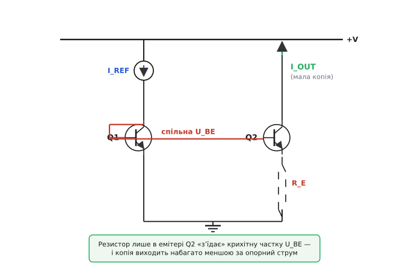
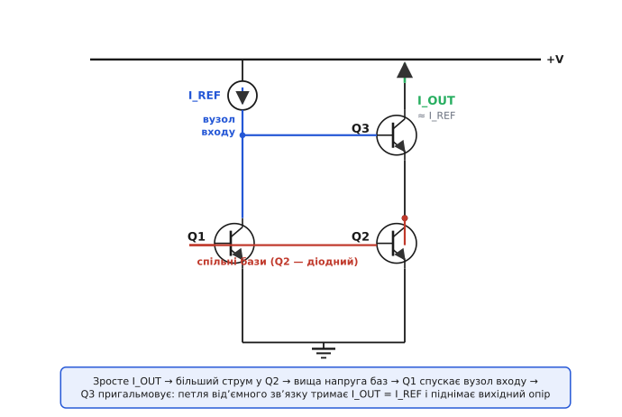
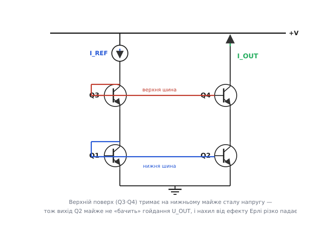

# 🔌 Кращі дзеркала струму: Відлар, Вілсон, каскод

Просте дзеркало на двох транзисторах — чесний робочий кінь, але в нього дві вроджені слабкості. По-перше, копія занижена на струм бази (десь на 2/β). По-друге, копія не строго стала — вона ледь росте з напругою на виході через [ефект Ерлі](topic:hw-analog/early-effect), тож «полиця» характеристики не горизонтальна, а похила. Для багатьох задач це байдуже. Але там, де треба **дуже маленький** стабільний струм, або де вихід має поводитися як **майже ідеальне** джерело струму, дві зайві деталі рятують справу.

Цей розбір — про три класи вдосконалень, які ви впізнаєте в будь-якій аналоговій мікросхемі: **джерело Відлара** (один резистор), **дзеркало Вілсона** (третій транзистор у петлі зворотного зв'язку) і **каскодне дзеркало** (другий поверх транзисторів). Усі три — узагальнені схеми-класи; жодних партномерів, бо це принципи, а не продукти. Для кожного: яка схема, чому вона працює, де ховаються граблі та коли саме її обирати.

> 🔧 **Навіщо це.** Коли ви бачите в чужій схемі чи в datasheet-розрізі мікросхеми три транзистори там, де «мало б бути два», — це майже завжди один із цих варіантів. Уміти впізнати Відлара, Вілсона чи каскод і знати, що кожен дає й чим платить, — це різниця між «схема працює як магія» і «я розумію, чому інженер поставив сюди саме це». А якщо ви самі проєктуєте зміщення на дискретних транзисторах чи в інтегральному процесі — це ваш безпосередній інструментарій.

## Спільний відлік: чого бракує простому дзеркалу

Щоб оцінити вдосконалення, треба чітко тримати в голові, що саме лагодимо. Просте дзеркало — лівий транзистор діодно ввімкнений, правий повторює напругу база-емітер — дає копію з двома похибками.

**Похибка струму бази.** Обидві бази живляться з опорної гілки, відбираючи звідти струм. У підсумку копія занижена приблизно на 2/β: при β = 200 це близько 1%. Дрібниця, поки β великий і стабільний; біда, коли β малий (потужні транзистори) або гуляє з температурою.

**Похибка від виходу — нахил полиці.** Ідеальне джерело струму тримало б струм незалежно від напруги на собі: горизонтальна лінія. Реальний транзистор так не вміє — зі зростанням колекторної напруги ефективна база тоншає, і струм потроху росте. Кількісно це описують **вихідним опором** r_o: що він більший, то ближча полиця до горизонталі. У простого дзеркала r_o — це просто r_o одного вихідного транзистора, типово десятки-сотні кілоом. Часто цього мало.

```
проста копія:   r_out ≈ r_o            (вихідний опір одного транзистора)
ідеал:          r_out → ∞              (струм геть не залежить від напруги)
```

Усі три варіанти нижче б'ють або першу похибку (Відлар — навмисно робить копію іншою, але точно передбачуваною), або другу (Вілсон і каскод — піднімають вихідний опір у багато разів), а Вілсон заразом притискає й похибку струму бази.

## Джерело Відлара: маленький резистор — маленький струм

Почнімо з найхитрішої на вигляд дрібниці. Уявіть, що вам треба джерело зміщення на **кілька мікроампер**. Опорний струм у вас, скажімо, 1 мА (бо менший незручно й невигідно робити резистором від живлення — резистор виходив би в мегаоми, а це багато площі на кристалі). Як із 1 мА опорного зробити копію в 10 мкА — у сто разів меншу — і щоб вона була стабільна?

Просте масштабування площами тут не зарадить: щоб дістати ×1/100, вихідний транзистор довелося б зробити мізерним, а опорний — велетенським; нереально. Розв'язок Роберта Відлара (Robert Widlar) елегантний: лишити транзистори однаковими, але **поставити невеликий резистор в емітер тільки вихідного** транзистора.


*Джерело Відлара. Q1 діодно ввімкнений під опорний струм, як у звичайному дзеркалі, його емітер — прямо на землю. Q2 повторює, але між його емітером і землею стоїть резистор R_E. Цей резистор зміщує емітер Q2 трохи вгору, тож на самому переході база-емітер Q2 лишається менша напруга, ніж на Q1 — а різниця в десятки мілівольтів за експонентою означає в рази менший струм. Копія I_OUT виходить набагато меншою за I_REF, але точно передбачуваною.*

### Чому крихітна різниця напруги дає велику різницю струму

Уся суть тримається на крутизні експоненти. Колекторний струм біполярного транзистора залежить від напруги база-емітер експоненційно:

```
I_C ≈ I_S · exp(U_BE / V_T)
```

де V_T — **термічний потенціал** (англ. *thermal voltage*), величина kT/q, що при кімнатній температурі дорівнює приблизно 26 мВ. Це той самий масштаб напруги, на якому струм змінюється «в e разів»: додав V_T до U_BE — струм зріс у 2.718 раза; додав 60 мВ — у десять разів.

Тепер дивимось на схему Відлара. Бази Q1 і Q2 спільні, отже напруга від спільної бази до **землі** в обох однакова. Але в Q1 уся ця напруга падає на переході (емітер прямо на землі), а в Q2 частину «з'їдає» резистор: на переході Q2 лишається менше якраз на спадок на резисторі, I_OUT · R_E. Ось ця різниця напруг переходів і задає, у скільки разів струми відрізняються:

```
U_BE(Q1) − U_BE(Q2) = I_OUT · R_E
```

А ліворуч стоїть різниця двох логарифмів — бо кожна U_BE логарифмічно зв'язана зі своїм струмом (це обернення експоненти). Розкривши логарифми, дістаємо ключове рівняння Відлара:

```
I_OUT · R_E = V_T · ln(I_REF / I_OUT)
```

Прочитаймо його як інженер, а не як математик. Праворуч — добуток крихітного V_T (26 мВ) на логарифм відношення струмів. Логарифм росте дуже мляво: щоб I_OUT був у сто разів менший за I_REF, логарифм дорівнює ln(100) ≈ 4.6, тобто різниця напруг переходів — лише 4.6 × 26 мВ ≈ 120 мВ. Цих ста з гаком мілівольтів і вистачає, щоб придушити струм у сто разів. Резистор має лише створити цей невеликий спадок на вихідному струмі — а вихідний струм малий, тож і резистор виходить **скромний**, не мегаомний.

> 🔧 **Навіщо це.** Саме так усередині мікросхем роблять опорні струми зміщення в одиниці мікроампер, не витрачаючи кремній на гігантські резистори. Замість резистора на мегаоми (велика площа, кепська точність) — однакова пара транзисторів плюс маленький резистор у сотні ом чи одиниці кілоом. Менше площі, краща відтворюваність, та сама стабільність.

### Worked-приклад: підбір резистора Відлара

**Маємо опорний струм I_REF = 1 мА, хочемо копію I_OUT = 10 мкА. Який потрібен R_E?**

Рівняння Відлара розв'язуємо прямо — обидва струми вже відомі, шукаємо лише резистор:

```
I_OUT · R_E = V_T · ln(I_REF / I_OUT)
R_E = V_T · ln(I_REF / I_OUT) / I_OUT
R_E = 0.026 · ln(1000 мкА / 10 мкА) / 0.00001
R_E = 0.026 · ln(100) / 0.00001
R_E = 0.026 · 4.605 / 0.00001
R_E ≈ 12 000 Ом   →   беремо 12 кОм
```

Висновок: 12 кОм в емітері вихідного транзистора перетворюють опорний 1 мА на стабільні 10 мкА. Порівняйте: щоб дістати ті самі 10 мкА **простим** резистором від 5-вольтової шини, знадобився б резистор близько (5 − 0.65)/10 мкА ≈ 435 кОм — у 36 разів більший і набагато гірший за точністю й температурною стабільністю. Ось чому Відлар — стандартний прийом для малих струмів.

У коді цей підбір — звичайна арифметика проєктування, яку зручно тримати поряд зі схемою:

:::tabs
```cpp
#include <cmath>

// Підбір емітерного резистора джерела Відлара під заданий малий вихідний струм.
// Усе у вольтах і амперах; повертає опір в омах.
double widlar_emitter_resistor(double i_ref, double i_out)
{
    const double V_T = 0.026;                     // термічний потенціал при ~27 °C
    return (V_T * std::log(i_ref / i_out)) / i_out; // R_E = V_T·ln(I_REF/I_OUT)/I_OUT
}
// widlar_emitter_resistor(1.0e-3, 10.0e-6) -> ~12 кОм
```
```python
import math

# Підбір емітерного резистора джерела Відлара під заданий малий вихідний струм.
# Усе у вольтах і амперах; повертає опір в омах.
def widlar_emitter_resistor(i_ref, i_out):
    V_T = 0.026                                  # термічний потенціал при ~27 °C
    return V_T * math.log(i_ref / i_out) / i_out  # R_E = V_T·ln(I_REF/I_OUT)/I_OUT

# widlar_emitter_resistor(1.0e-3, 10.0e-6) -> ~12 кОм
```
```js
// Підбір емітерного резистора джерела Відлара під заданий малий вихідний струм.
// Усе у вольтах і амперах; повертає опір в омах.
function widlarEmitterResistor(iRef, iOut) {
    const V_T = 0.026;                            // термічний потенціал при ~27 °C
    return (V_T * Math.log(iRef / iOut)) / iOut;  // R_E = V_T·ln(I_REF/I_OUT)/I_OUT
}
// widlarEmitterResistor(1.0e-3, 10.0e-6) -> ~12 кОм
```
```go
package main

import "math"

// Підбір емітерного резистора джерела Відлара під заданий малий вихідний струм.
// Усе у вольтах і амперах; повертає опір в омах.
func widlarEmitterResistor(iRef, iOut float64) float64 {
    const V_T = 0.026                              // термічний потенціал при ~27 °C
    return (V_T * math.Log(iRef/iOut)) / iOut      // R_E = V_T·ln(I_REF/I_OUT)/I_OUT
}
// widlarEmitterResistor(1.0e-3, 10.0e-6) -> ~12 кОм
```
:::

Зверніть увагу: рівняння **трансцендентне**, якщо невідомий саме струм. Коли ви фіксуєте R_E й питаєте «який буде I_OUT?» — I_OUT стоїть і ліворуч (множником), і праворуч (під логарифмом), і аналітично не виражається. Тоді його шукають ітерацією: вгадали I_OUT, підставили праворуч, дістали ліворуч новий I_OUT, повторили — збігається за кілька кроків. У задачі проєктування ж простіше: задаєш обидва струми й рахуєш резистор однією дією, як вище.

### Граблі Відлара

**Температурний дрейф через V_T.** Термічний потенціал пропорційний абсолютній температурі: V_T = kT/q. Отже, різниця напруг переходів — а з нею й відношення струмів — теж пливе з температурою. Це не завжди вада: інколи саме цього й хочуть, бо так народжується **PTAT-струм** (пропорційний абсолютній температурі), потрібний у температурних давачах і опорах напруги. Але якщо ви хотіли «просто стабільні 10 мкА», пам'ятайте: вони стабільні щодо живлення й навантаження, але злегка дрейфують із температурою.

**Чутливість до точності резистора.** Бо вихідний струм майже лінійно залежить від R_E (при заданому опорному), розкид резистора прямо переноситься в розкид копії. На дискретних деталях беріть резистор із доброю точністю; в інтегральному процесі — узгоджений із рештою.

**Менший, але не нульовий вихідний опір — навіть кращий, ніж у простого.** Приємний побічний ефект: емітерний резистор створює локальну **від'ємну зворотну дегенерацію**, яка трохи піднімає вихідний опір порівняно з простим дзеркалом. Тобто Відлар не лише задає малий струм, а й робить його дещо «жорсткішим» до напруги на виході. Це бонус, а не головна мета — для серйозного підняття вихідного опору є Вілсон і каскод.

## Дзеркало Вілсона: петля, що сама вирівнює струми

Тепер інша задача. Струм вас влаштовує, але вам потрібен **дуже високий вихідний опір** — щоб копія була по-справжньому стала, навіть коли напруга на виході гойдається на вольти. І заразом хочеться позбутися похибки струму бази. Обидві проблеми одним махом розв'язує схема, яку Джордж Вілсон (George R. Wilson) із Tektronix вигадав 1967 року — за легендою, за одну ніч, виборовши парі в Баррі Гілберта зробити краще дзеркало рівно на трьох транзисторах. Він виграв.

Ідея: додати третій транзистор так, щоб він **порівнював** вихідний струм з опорним і сам **підправляв** зміщення, якщо вони розійшлися. Тобто замкнути [від'ємний зворотний зв'язок](topic:hw-analog/negative-feedback), що силою тримає рівність струмів.


*Дзеркало Вілсона. Нижня пара Q1—Q2 — звичайна спарена основа зі спільними базами; Q2 діодно замкнений на цю спільну базу. Опорний струм входить у вузол «колектор Q1 = база Q3». Зверху сидить Q3: його емітер живить вузол Q2, а колектор — це вихід. Якщо вихідний струм спробує зрости, ланцюжок реакцій крізь петлю пригальмує Q3 і поверне струм назад. Вихід виходить куди ближчим до ідеального джерела струму, ніж у простого дзеркала.*

### Як працює петля — крок за кроком

Простежмо саму петлю, бо в ній уся краса. Припустимо, вихідний струм I_OUT з якоїсь причини **спробував зрости** (наприклад, піднялася напруга на виході й Ерлі підштовхнув струм Q3).

Більший струм Q3 тече крізь його емітер у вузол Q2 — а отже, крізь Q2 проходить більший струм. Q2 діодний, тож зайвий струм трохи **піднімає напругу на спільній базі** Q1—Q2. Вища напруга баз змушує **Q1 проводити дужче**. Але колектор Q1 — це і є вузол входу, куди вганяють фіксований опорний струм. Якщо Q1 раптом хоче забрати більше, ніж дає опорне джерело, напруга цього вузла **просідає вниз**. А цей вузол — база Q3. Спустили базу Q3 — зменшили його зміщення — **і I_OUT падає назад**. Коло замкнулося: спроба струму зрости сама себе погасила.

Це класична від'ємна петля: відхилення виходу повертається на вхід зі знаком, що його **гасить**. І як завжди з від'ємним зв'язком, чим більше підсилення в петлі, тим жорсткіше тримається рівність — а підсилення тут велике, бо його дає транзистор Q3. Результат — вихідний опір зростає приблизно в β разів проти простого дзеркала:

```
просте дзеркало:   r_out ≈ r_o
дзеркало Вілсона:  r_out ≈ β · r_o / 2     (у ~β/2 раза вище)
```

При β = 150 це майже два порядки виграшу. Полиця характеристики стає майже горизонтальною — нахил від ефекту Ерлі практично зникає.

### Бонус: похибка струму бази падає до другого порядку

Петля Вілсона лагодить і другу болячку — занижену копію. У простому дзеркалі похибка від струму бази була першого порядку, ~2/β. У Вілсона симетрія схеми влаштована так, що струми баз майже компенсуються, і залишкова похибка стає **другого** порядку:

```
проста копія:    I_OUT ≈ I_REF · (1 − 2/β)      (похибка ~2/β)
копія Вілсона:   I_OUT ≈ I_REF · (1 − 2/β²)     (похибка ~2/β²)
```

Числа вражають. При β = 100 проста копія занижена на ~2%, а Вілсонова — на ~0.02%, у сто разів точніше. Ось чому Вілсон так люблять там, де водночас потрібні і точна копія, і твердий вихідний опір.

> 🔧 **Навіщо це.** Дзеркало Вілсона — типовий вибір для **активного навантаження** й прецизійних струмових джерел усередині операційних підсилювачів і компараторів. Коли datasheet хвалиться високим коефіцієнтом підсилення каскаду чи малою залежністю струму зміщення від напруги живлення — під капотом часто стоїть саме Вілсон. Трьох транзисторів і жодного зайвого резистора, а виграш — два порядки і за точністю, і за вихідним опором.

### Граблі Вілсона

**Потрібен більший запас напруги на виході.** За високий вихідний опір платять «стелею»: між виходом і землею тепер стоять два переходи база-емітер послідовно (Q3 поверх вузла Q2), тож мінімальна напруга, нижче за яку дзеркало «провалюється», виходить більшою, ніж у простого. Грубо — близько двох U_BE замість одного запасу. У схемах із низьким живленням цей з'їдений «вольт із гаком» буває критичним.

**Гірша поведінка на високих частотах.** Петля зворотного зв'язку має скінченну швидкість і свій фазовий запас. На високих частотах підсилення петлі падає, а сама петля може схилятися до підзвону чи навіть нестійкості, якщо навантаження ємнісне. Просте дзеркало петлі не має й цим не страждає. Тому в широкосмугових вузлах Вілсон застосовують обачно, а інколи додають невелику корекцію.

**Класична versus покращена версія.** Базова трьохтранзисторна схема має дрібну асиметрію: напруги колектор-емітер у Q1 і Q2 не зовсім однакові, що лишає крихітну залишкову похибку від Ерлі в самій нижній парі. Її прибирають **четвертим** транзистором (діодом у плечі Q1), що вирівнює напруги обох плеч. Це вже «покращене дзеркало Вілсона»; принцип той самий, просто симетрія доведена до кінця.

## Каскодне дзеркало: другий поверх ховає вихід від напруги

Третій підхід б'є ту саму ціль — високий вихідний опір — але іншим прийомом, без петлі зворотного зв'язку. Замість того щоб **виправляти** вплив вихідної напруги петлею, каскод просто **не дає** вихідній напрузі дістатися до вихідного транзистора. Якщо транзистор не «бачить» гойдання напруги на виході, то й струм його не пливе — ось і весь фокус.

Слово «каскод» (англ. *cascode*, стягнене з «cascade to cathode» — спадок ще від лампової схеми) означає транзистор, увімкнений зі спільною базою поверх іншого. Він пропускає крізь себе той самий струм, але **екранує** нижній транзистор від напруги: майже все гойдання вихідної напруги падає на верхньому каскодному транзисторі, а на нижньому колектор-емітерна напруга лишається майже сталою.


*Каскодне дзеркало. Нижній поверх Q1—Q2 — звичайне дзеркало (Q1 діодний). Зверху — другий поверх Q3—Q4 зі своєю спільною базою (Q3 діодний), увімкнений каскодом. Опорний струм проходить лівим стовпчиком крізь обидва поверхи. Вихід знімається з колектора Q4. Каскодні Q3—Q4 тримають на колекторах Q1—Q2 майже сталу напругу, тож вихідний Q2 майже не відчуває, як гойдається U_OUT, — і нахил від ефекту Ерлі різко падає.*

### Чому екранування множить вихідний опір

Механізм геть інший, ніж у Вілсона, хоч результат схожий. Розгляньмо вихідний стовпчик: знизу Q2 (вихідний транзистор простого дзеркала), зверху Q4 (каскод). Уся напруга з виходу прикладена до верху стовпчика. Коли вона гойднулася, скажімо, вгору, майже все це гойдання дістається Q4 — бо Q4 увімкнений зі спільною базою й має низький вхідний опір по емітеру: він «поглинає» зміну напруги, лишаючи на своєму емітері (тобто на колекторі Q2) майже сталий потенціал.

А Q2, не відчуваючи зміни своєї колекторної напруги, тримає струм незмінним — Ерлі його просто не чіпає. У підсумку зміна вихідного струму на зміну вихідної напруги виходить мізерна, тобто вихідний опір — величезний. Кількісно каскод множить вихідний опір нижнього транзистора на власний коефіцієнт підсилення верхнього (добуток крутизни на власний опір, g_m·r_o):

```
просте дзеркало:    r_out ≈ r_o
каскодне дзеркало:  r_out ≈ g_m · r_o · r_o   (помножено на власне підсилення каскоду)
```

Множник g_m·r_o — це «власне підсилення» транзистора, типово сотні. Тобто каскод піднімає вихідний опір на два-три порядки, не вдаючись до жодної петлі. Кожен доданий поверх множить опір ще раз на g_m·r_o — звідси «подвійні каскоди» для геть екстремальних вимог (але вже з усе вищою з'їденою напругою й усе слабшою справедливістю простої моделі).

> 🔧 **Навіщо це.** Каскодні дзеркала — наріжний камінь сучасної аналогової мікросхемотехніки, особливо в КМОН (де власний опір транзистора нижчий і його ой як треба піднімати). Високий коефіцієнт підсилення операційних підсилювачів, точні джерела опорної напруги, стабільні струмові ЦАП — усе це стоїть на каскодах. Якщо бачите в розрізі чипа «два поверхи» однакових транзисторів зі спільними базами — це каскод, і його робота — зробити вихід майже ідеальним джерелом струму.

### Граблі каскоду

**Найбільший з'їдений запас напруги.** Простий каскод платить найдорожче «стелею»: над виходом тепер два транзистори, і щоб **обидва** лишилися в активному режимі, на вихідний стовпчик треба помітна мінімальна напруга — десь два U_BE плюс невеликий запас насичення (у біполярному варіанті орієнтовно понад вольт). За живлення 3.3 В чи нижче це боляче.

**Лік — каскод із широким розмахом (wide-swing).** Щоб не марнувати запас, придумали хитро змістити базу каскодного транзистора так, щоб нижній сидів **на самій межі** активного режиму, а не глибоко в ньому. Тоді мінімальна вихідна напруга падає майже до однієї границі насичення замість двох переходів. Це і є «каскод із широким розмахом» — стандарт у низьковольтних КМОН-схемах; принцип екранування той самий, просто зміщення баз оптимізоване під мінімальну стелю.

**Точне налаштування зміщення каскодних баз.** Розмаховий каскод вимагає акуратно виставленої напруги на базах верхнього поверху — її задають окремою маленькою схемою зміщення. Помилишся — або з'їси запас намарно, або заженеш нижній транзистор у насичення. У простому (не розмаховому) каскоді цього клопоту менше, бо база каскоду береться від діодного стовпчика автоматично, як на фігурі.

## Як обрати: коротка карта рішень

Усі три варіанти лагодять різні болячки простого дзеркала, тож вибір диктує **те, чого вам бракує**.

```
Треба МАЛИЙ стабільний струм          → Відлар
  (одиниці-десятки мкА з міліамперного опорного,
   без мегаомних резисторів)

Треба ВИСОКИЙ вихідний опір + ТОЧНІСТЬ → Вілсон
  (майже ідеальне джерело струму, заразом
   прибрана похибка струму бази; ціна — запас напруги
   й обачність на ВЧ через петлю ЗЗ)

Треба ВИСОКИЙ вихідний опір без петлі  → Каскод
  (множить опір екрануванням; ціна — найбільша
   з'їдена напруга, лікується розмаховим каскодом;
   улюбленець КМОН-схем)
```

Кілька практичних орієнтирів понад цю карту:

**Запас живлення вирішує половину справи.** Якщо живлення низьке (3.3 В і нижче) і кожен вольт на рахунку — простий каскод відпадає першим, бо з'їдає найбільше; тут обирають або розмаховий каскод, або, якщо точність важливіша за опір, лишаються на простому дзеркалі з резисторною дегенерацією. Вілсон посередині: він теж бере два переходи запасу, але дає взамін і точність.

**Біполяр чи КМОН.** У біполярних схемах власний опір транзистора r_o й так пристойний, тож часто досить Вілсона. У КМОН r_o менший і ефект «модуляції каналу» (аналог Ерлі) дошкульніший, тому каскоди там майже неминучі, а розмаховий каскод — фактично галузевий стандарт.

**Частота.** Для широкосмугових вузлів каскод спокійніший за Вілсона: він без петлі, тож не має ризику підзвону й простіший до стабілізації. Якщо вузол швидкий і ємнісно навантажений — це аргумент за каскод.

**Можна й комбінувати.** Ніщо не заважає скласти, наприклад, каскод над дзеркалом Відлара (малий струм **і** високий опір) чи каскодувати плечі Вілсона. У серйозних мікросхемах саме такі гібриди й трапляються — кожен поверх додає свій множник до опору, а резистор Відлара задає сам струм. Принципи з цього розбору складаються, як цеглинки.

Суть же лишається однією на всі три. Просте дзеркало дає «дуже хорошу» копію, обмежену струмом бази й ефектом Ерлі. Відлар свідомо робить копію **іншою**, але точно передбачуваною й маленькою. Вілсон і каскод роблять копію **жорсткішою** до напруги — петлею зворотного зв'язку чи екрануванням, — наближаючи вихід до ідеального джерела струму. Знаючи, що кожен дає й чим платить, ви читаєте чужі схеми як відкриту книгу й добираєте своє рішення не навмання, а під конкретну потребу.
