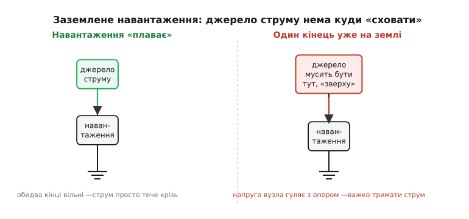
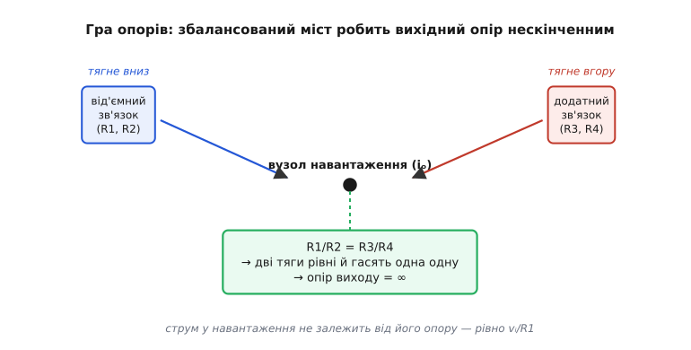

# 📜 Помпа Хауленда: як один операційний підсилювач навчили качати струм у землю

Є задачі, де схема ніби сама проситься, а зробити її чомусь складно. Ось одна така. Треба джерело струму — але кероване **напругою**: подав на вхід якісь вольти, а з виходу потік пропорційний їм струм, і байдуже, що там за навантаження. Просто? Поки навантаження «висить у повітрі» обома кінцями — справді просто: транзистор в активному режимі сам тримає струм, і навантаження можна ввімкнути послідовно з ним, як ланку в ланцюжку. Морока починається тієї миті, коли один кінець навантаження мусить сидіти **на землі** — а в реальних приладах він майже завжди там і сидить.

Саме цю морочливу задачу й розв'язала схема, що тепер зветься **помпою Хауленда** (англ. *Howland current pump*). Вона бере вхідну напругу `vᵢ`, перетворює її на струм `iₒ`, пропорційний цій напрузі, і **накачує** цей струм у навантаження — звідки й «помпа» — незалежно від того, яку напругу те навантаження на собі розвине. Її серце — один-єдиний операційний підсилювач і чотири резистори, підібрані в особливій пропорції. І щойно ця пропорція виконана, відбувається мала магія: вихідний опір схеми стає **нескінченним**, а струм виходить рівно `vᵢ/R1`, хоч би яким був опір навантаження. Ця історія — про те, звідки взялася та пропорція, хто її помітив, чому схема живе вже понад шістдесят років і де її досі нема чим замінити.

## Чому заземлене навантаження — це справді складно

Перш ніж захоплюватися розв'язком, варто чесно відчути задачу — інакше елегантність помпи проходить повз. Уявімо найпростіше джерело струму: транзистор, що тримає крізь себе сталий струм. Якщо навантаження можна ввімкнути **послідовно** з транзистором — один його кінець до транзистора, другий вільний, — усе чудово: струм, який тримає транзистор, тече просто крізь навантаження, і ми керуємо ним досхочу. Кажуть, що навантаження «плаває» (англ. *floating*) — жоден його кінець не прибитий до фіксованого потенціалу, тож джерело струму вільно ставить на ньому ту напругу, яка йому потрібна.

А тепер зажадаймо, щоб один кінець навантаження сидів на землі. Це не примха — так влаштовано пів-електроніки: спільний провід приладу заземлений, давачі однією ногою на землі, електроди вимірювача імпедансу теж. І раптом легкий випадок ламається. Джерело струму більше не можна поставити «під» навантаженням — там уже земля. Його доводиться чіпляти **зверху**, між шиною живлення й верхнім вузлом навантаження, і саме на цьому верхньому вузлі напруга тепер **гуляє разом з опором навантаження**: більший опір — вища напруга, менший — нижча. А джерело мусить тримати струм незмінним попри те, що напруга під ним стрибає. Транзистор сам цього не вміє: його струм керується напругою база-емітер, а вона відлічується від емітера, чий потенціал теж поплив.


*Дві ситуації поруч. Ліворуч навантаження «плаває» — обидва кінці вільні, тож джерело струму просто стоїть послідовно й жене струм крізь нього: легко. Праворуч один кінець навантаження вже прибито до землі, і джерело змушене сидіти «зверху», а напруга на спільному вузлі гуляє разом з опором — тримати струм незмінним стає по-справжньому важко. Саме цю праву ситуацію й розв'язує помпа Хауленда.*

> 🔧 **Навіщо це.** Якщо колись здаватиметься, що помпа Хауленда — переускладнення (мовляв, чотири точні резистори заради якогось струму), згадайте цю картинку. Уся її хитрість існує **тільки** заради правої панелі. Для лівої, з плавним навантаженням, ніяка помпа не потрібна — вистачить транзистора чи джерела на JFET. Помпа заслуговує своїх резисторів рівно тоді, коли навантаження одним кінцем на землі, а керувати струмом треба напругою. Не та задача — не та схема.

Отже, потрібен прилад, який, сидячи зверху над заземленим навантаженням, тримав би крізь нього струм, заданий лише вхідною напругою, і не зважав на те, як стрибає напруга на самому навантаженні. Звучить майже як вимога «нескінченного вихідного опору, але керованого ззовні». І саме таку схему й знайшли на початку 1960-х.

## Бредфорд Хауленд і лабораторія в Будинку 20

Людину, чиїм ім'ям названо схему, звали **Бредфорд Хауленд** (англ. Bradford Howland). Це усталений факт: він народився 8 жовтня 1927 року в Гартфорді, штат Коннектикут, у США, і прожив майже сто років — помер 5 травня 2025-го в Медісоні, штат Вісконсин. Американський інженер; жодного імперського чи національного міфу навколо цього імені немає, і вигадувати тут нічого — це проста, добре задокументована біографія людини XX століття.

Дорога Хауленда до схеми була незвичною вже початком. Університет Пердью він закінчив 1945 року, маючи всього **сімнадцять років** — рідкісне раннє обдарування. Далі — магістратура в Гарварді й докторат у Массачусетському технологічному інституті (MIT). І саме в MIT він понад тридцять років пропрацював у **Дослідній лабораторії електроніки** (Research Laboratory of Electronics, RLE) — у легендарному Будинку 20 (Building 20), тимчасовій фанерній споруді воєнних часів, що дивовижним чином стала однією з найплідніших дослідницьких будівель в історії техніки. Хауленд займався там нейрофізіологією — вимірюванням сигналів живої тканини, — а пізніше перейшов в оптику; згодом він навіть видав збірку оповідань про життя в тій лабораторії під назвою «Building 20 Stories».

Контекст важливий, бо він пояснює, **чому** Хауленду взагалі знадобилося качати точний струм у заземлене навантаження. Нейрофізіолог раз у раз стикається саме з цією задачею: пропустити крізь тканину чи крізь електрод відомий струм — а тканина одним кінцем неминуче «на землі» приладу. Схема народилася не з абстрактної гри в резистори, а з конкретної лабораторної потреби людини, що міряла живе.

І ось найхарактерніша деталь усієї цієї історії. Хауленд був плідним винахідником — за життя він тримав близько двадцяти патентів в оптиці, електроніці й механіці. Але **найвідоміша його ідея — та сама помпа — не була ним ані запатентована, ані опублікована**. Він її просто **придумав** і **показав** колегам. Те, що сьогодні цитують у кожному довіднику з операційних підсилювачів і що носить його ім'я, він пустив у світ без жодного формального паперу. Це не легенда — це прямо зафіксовано і в його некролозі, і в технічній літературі. Рідкісний випадок, коли інженерну славу принесла не та робота, на яку взято патент, а та, яку віддали задарма.

> Сама помпа стоїть на [операційному підсилювачі](topic:hw-analog/opamp) — мікросхемі-підсилювачі з двома входами, що в робочій схемі тримає між ними майже нульову різницю напруг (це зветься «віртуальним коротким замиканням»). Уся гра опорів нижче спирається саме на цю властивість: підсилювач підкручує свій вихід доти, доки його входи не зрівняються. Не знаючи цього правила, механізм помпи зрозуміти годі.

## Як ідея стала публічною: Філбрик і «Lightning Empiricist»

Тут історію треба вести точно, бо легко з'їхати в неточність «Хауленд опублікував схему 1962-го». Не опублікував. Розрізнімо три речі, які так часто злипають в одну: **ідею**, її **першу публікацію** і **назву**.

**Ідея** належить Хауленду й датується початком 1960-х — за переказами, близько 1962 року. Це найслабша ланка за доказовістю: точну дату «1962» наводять вторинні джерела й технічні нотатки виробників, без першоджерела-документа, тож чесно її статус — **правдоподібно, але документально не закріплено до року**. Що тверде — авторство Хауленда й проміжок «початок 1960-х».

**Першу публікацію** зробив не Хауленд, а інша людина. Хауленд показав свою схему **Джорджу Філбрику** (англ. George A. Philbrick) — піонерові аналогових обчислювачів, що очолював фірму Philbrick Researches у Бостоні, одну з колисок комерційного операційного підсилювача. А вже інженер тієї фірми, **Деніел Шейнголд** (англ. Daniel R. Sheingold), описав схему у фірмовому журналі «The Lightning Empiricist» — у статті «Impedance & Admittance Transformations using Operational Amplifiers» («Перетворення опору й провідності операційними підсилювачами»). Випуск — **том 12, число 1, січень 1964 року**; схема стоїть там як Figure 5A. Пізніше, 1965-го, її включили й до фірмового збірника застосувань Philbrick. Ці бібліографічні дані — том, число, рік, автор, назва статті — добре узгоджені між незалежними джерелами, тож їхній статус **усталений**.

> 🔧 **Навіщо це.** Ця розв'язка авторства — маленький, але показовий урок історії техніки. «Хто придумав» і «хто опублікував» — різні ролі, і слава нерідко чіпляється не за того, хто написав папір. Схему **назвали** на честь Хауленда (ідея його), а світ дізнався про неї словами Шейнголда у виданні Філбрика. Якби ми сказали «Шейнголд винайшов помпу» чи «Хауленд опублікував її 1962-го» — обидва твердження були б неправдою, хоч і звучали б правдоподібно. Розрізняти ідею, реалізацію й публікацію — звичка, що рятує від десятків таких дрібних, але живучих неточностей.

Журнал «The Lightning Empiricist» («Емпірик-блискавка») — сам по собі прикмета епохи: фірмовий бюлетень Philbrick Researches, де перемішувалися реклама, інженерні нотатки й цілком серйозні схемні ідеї. У ту пору операційний підсилювач щойно перетворювався з громіздкого лампового вузла аналогових обчислювачів на масову річ, і такі бюлетені були головним каналом, яким нові схемні трюки розходилися між інженерами. Помпа Хауленда — одна з тих ідей, що випливли саме звідти й пережили і свій журнал, і свою фірму, і саму епоху лампових «оп-ампів».

## Серце схеми: збалансований міст, що робить опір нескінченним

Тепер — найцікавіше. Чому ця схема взагалі працює? Звідки в неї береться той нескінченний вихідний опір? Розберімо це не як готову формулу, а як механізм, що його видно очима.

Помпа складається з операційного підсилювача й чотирьох резисторів — назвімо їх `R1, R2, R3, R4`. Зовні вона дуже схожа на звичайний різницевий підсилювач, але з однією вирішальною відмінністю: **вихід знімають не там, де зазвичай**. Точку навантаження беруть з боку **неінвертувального** входу — і саме через це до звичайного від'ємного зворотного зв'язку домішується **додатний**. Ось де ключ. У помпі **дві петлі зворотного зв'язку працюють водночас**: одна — від'ємна, через інвертувальний вхід (резистори `R1, R2`), друга — додатна, через неінвертувальний (резистори `R3, R4`). Кожна окремо була б або нудною, або небезпечною. Але разом, у точній рівновазі, вони творять диво.

Уявімо вузол навантаження як канат, який тягнуть у різні боки дві команди. **Від'ємна петля** тягне напругу цього вузла **вниз** — намагається її стабілізувати, придушити будь-яку зміну. **Додатна петля** тягне **вгору** — намагається будь-яку зміну підхопити й роздути. Якщо обидві тяги зрівняти **з точністю до волосини**, вони повністю гасять одна одну в усьому, що стосується **зміни** напруги на навантаженні. А «реакція виходу на зміну напруги на ньому» — це і є вихідний опір. Звели її до нуля — і вихідний опір став **нескінченним**. Струм перестав залежати від того, яку напругу розвиває навантаження. Саме цього ми й домагалися від схеми зверху над заземленим навантаженням.


*Механізм помпи. Від'ємний зворотний зв'язок (через `R1, R2`) тягне напругу вузла навантаження вниз, додатний (через `R3, R4`) — угору. Поки міст збалансований точно — `R1/R2 = R3/R4` — обидві тяги на будь-яку зміну напруги рівні й гасять одна одну, тож струм у навантаження не залежить від його опору й дорівнює рівно `vᵢ/R1`. Найменший розбаланс псує цю рівновагу — і нескінченний опір осідає до скінченного.*

Тепер запишімо ту саму думку точно. Умова рівноваги — **рівність відношень опорів** у двох плечах моста:

```
Умова нескінченного вихідного опору:
  R1 / R2 = R3 / R4
```

Це і є та «гра опорів», заради якої все затівалося. Доки відношення рівні — додатна тяга точно компенсує від'ємну на кожну зміну вихідної напруги, і вузол навантаження «не відчуває» свого власного опору. А вихідний струм у цьому разі набуває напрочуд простого вигляду. Якщо взяти найчастіший варіант — усі чотири резистори рівні між собою (`R1 = R2 = R3 = R4 = R`), — то струм у навантаження виходить просто:

```
Вихідний струм помпи (при рівних резисторах R):
  iₒ = vᵢ / R
```

Подайте на вхід один вольт через резистор у один кілоом — і в навантаження потече один міліампер, хоч би яким був опір цього навантаження (доки вистачає напруги живлення). Подвойте вхідну напругу — подвоїться струм. Перетворювач «напруга → струм» у чистому вигляді, з коефіцієнтом, заданим єдиним резистором. Ось чому схему й звуть помпою: вона **накачує** в навантаження струм, точно відмірений вхідною напругою, і не цікавиться опором того, що накачує.

Тут варто чесно назвати й слабке місце, бо саме воно — зворотний бік усієї елегантності. Нескінченний опір тримається **лише доти, доки відношення опорів рівні точно**. Найменший розбаланс — скажімо, `R3/R4` трохи відхилилося від `R1/R2` через звичайний допуск резистора — і дві тяги перестають точно гаситися. Додатна петля або недотягує (тоді вихідний опір просто стає скінченним, великим, але не безмежним), або **перетягує** — і тоді схема з джерела струму перетворюється на нестійку, готову задзвеніти. Тому помпу будують на **точно дібраних** резисторах (зазвичай з допуском 0.1 % і кращим), а нерідко й лишають один підлаштовуваний, щоб виставити рівновагу руками. Те, що дарує нескінченний опір, водночас робить схему вимогливою до точності — за все треба платити.

> Як саме нахил вольт-амперної полиці перекладається в число вихідного опору й чому будь-яке реальне джерело струму — це [еквівалент Нортона](topic:hw-analog/norton) з великим, але скінченним паралельним опором, докладно розписано в [розборі вихідного опору джерела струму](topic:hw-analog/current-source/math-output-resistance.md). Тут досить розуміти головне: «нескінченний вихідний опір» означає горизонтальну полицю — струм не залежить від напруги на навантаженні; а будь-який розбаланс цю полицю нахиляє.

## Модифікована топологія: коли потрібен запас по напрузі

Базова помпа має одну незручність, яка швидко дається взнаки на практиці. У ній резистор `R1`, через який задається струм, водночас визначає і **коефіцієнт перетворення** (`iₒ = vᵢ/R1`), і те, **скільки струму марно стікає** всередині схеми. Хочеш більший струм у навантаження — мусиш зменшувати резистори, а малі резистори означають великі марні струми всередині й завеликі вимоги до виходу підсилювача. Хочеш економніший режим — резистори ростуть, але разом з ними росте і чутливість до розбалансу. Базова топологія тримає ці бажання в одній жмені, і вони заважають одне одному.

Тому на практиці майже завжди беруть **модифіковану помпу Хауленда** (англ. *improved Howland current pump*). Зміна на вигляд дрібна: резистор у плечі зворотного зв'язку **розщеплюють надвоє** — додають іще один резистор (його часто позначають `R5` або як `R4b`, другу половинку розрізаного `R4`). Через цей маленький додатковий резистор тепер тече весь вихідний струм, а отже, на ньому можна струм **виміряти** як спад напруги — і це розв'язує цілий вузол проблем одразу.

Що дає це розщеплення:

- **Коефіцієнт струму відв'язується від великих резисторів.** Тепер величину струму задає переважно той маленький розщеплений резистор, а не все плече одразу. Можна тримати решту опорів великими (мала марна витрата, легша рівновага), а потрібний струм виставляти окремо — два колись зчеплені бажання нарешті розчепили.
- **Менше навантаження на вихід підсилювача.** Більшу частину «робочої» напруги тепер тримає навантаження разом з тим малим резистором, а не вся резисторна решітка, тож операційний підсилювач віддає менший струм і глибше входить у свій робочий діапазон — ширшає вікно піддатливості джерела.
- **З'являється точка, де струм видно.** Спад напруги на розщепленому резисторі прямо пропорційний вихідному струму — є де його зміряти чи замкнути ще одну петлю керування.

Умова балансу при цьому нікуди не зникає — вона лише трохи ускладнюється формою (тепер у грі п'ять резисторів, і рівність відношень треба витримати з урахуванням розщеплення), але суть та сама: точно дібрані відношення → нескінченний вихідний опір. Модифікована топологія не скасовує принципу базової помпи, а робить його практично придатним там, де базова впиралася в межі виходу підсилювача й марні втрати.

## Де помпа Хауленда досі незамінна

Схемі понад шістдесят років, операційні підсилювачі відтоді змінилися до невпізнання, а помпа Хауленда жива й широко вживана. Причина проста: вона робить те, що мало хто вміє так дешево, — точно качає **керований напругою** струм у **заземлене** навантаження. Там, де ця пара вимог сходиться, у неї майже нема суперників. Розгляньмо три головні поля, де вона тримається донині, — і де чітко видно, чому саме її властивості там критичні.

**Вимірювання імпедансу живої тканини (біоімпеданс).** Це задача, з якої схема, по суті, і виросла, — недарма її автор працював у нейрофізіології. Щоб виміряти, як тканина проводить струм (а звідси судять про склад тіла, про дихання, про роботу серця), крізь неї пропускають точно відомий **змінний** струм і міряють напругу, що на ній виникає. Тканина — складне навантаження: її опір невідомий заздалегідь і ще й змінюється під час вимірювання. Потрібне саме джерело струму з дуже високим вихідним опором, щоб струм крізь тканину лишався точно заданим попри ці примхи, — і кероване сигналом-синусоїдою, щоб задати потрібну частоту. Помпа Хауленда лягає сюди ідеально: на вхід — синус потрібної частоти, з виходу — точний змінний струм у заземлений електрод.

**Вимірювання опору (і взагалі вимірювання струмовим методом).** Щоб дізнатися невідомий опір, найчистіший шлях — прогнати крізь нього **точно відомий струм** і виміряти спад напруги: за законом Ома `R = U/I`, і якщо `I` ми знаємо точно, то весь результат залежить лише від того, як добре зміряно `U`. Чим стабільніший струм (чим вищий вихідний опір джерела), тим точніший вимір. А вимірюваний опір майже завжди одним кінцем на землі приладу — отже, знову та сама вимога «струм у заземлене навантаження, заданий точно». Помпа Хауленда дає такий струм простими засобами, і тому вона — частий гість у вимірювальних схемах і давачах, де щось визначають через струм.

**Керування струмом світлодіода.** Яскравість і саме життя світлодіода визначає **струм** крізь нього, а не напруга на ньому: вольт-амперна крива діода така крута, що мізерна зміна напруги стрибком міняє струм, та ще й пливе з нагріванням. Тому світлодіодом правильно керувати струмом — а часто хочеться задавати цей струм **напругою** (наприклад, з виходу цифро-аналогового перетворювача мікроконтролера, щоб плавно регулювати яскравість програмою). Помпа Хауленда якраз і перетворює керівну напругу на пропорційний струм у діод, не зважаючи на те, як падіння на діоді гуляє від температури чи від екземпляра до екземпляра. Катод діода при цьому спокійно сидить на землі — те саме заземлене навантаження.

> 🔧 **Навіщо це.** В усіх трьох випадках спільне ядро одне: природна величина задачі — **струм**, навантаження одним кінцем **на землі**, а керувати треба **напругою**. Це той самий триплет вимог, що ламає прості рішення, — і той самий, що його помпа Хауленда розв'язує одним підсилювачем і жменею точних резисторів. Якщо колись опинитеся перед задачею з цим триплетом — біоімпеданс, омметр, драйвер світлодіода від ЦАП, — згадайте схему шістдесятих: вона, найпевніше, досі найдешевший чесний розв'язок.

І остання думка, що зв'язує все докупи. Помпа Хауленда — гарний приклад того, як в електроніці народжується довговічна ідея. Не з великої теорії, а з конкретної мороки нейрофізіолога, якому треба було пропустити точний струм крізь живу тканину. Не з патенту — автор його не брав. Не з гучної публікації під своїм іменем — про схему написав інший, у фірмовому бюлетені. А лишилася вона тому, що **точно влучила в стійку, повторювану потребу**: керований напругою струм у заземлене навантаження. Поки ця потреба існує — а вона нікуди не дінеться, доки існують давачі, вимірювачі й світлодіоди, — житиме й проста схема з чотирьох резисторів, що носить ім'я людини, яка просто придумала її й показала колегам.
