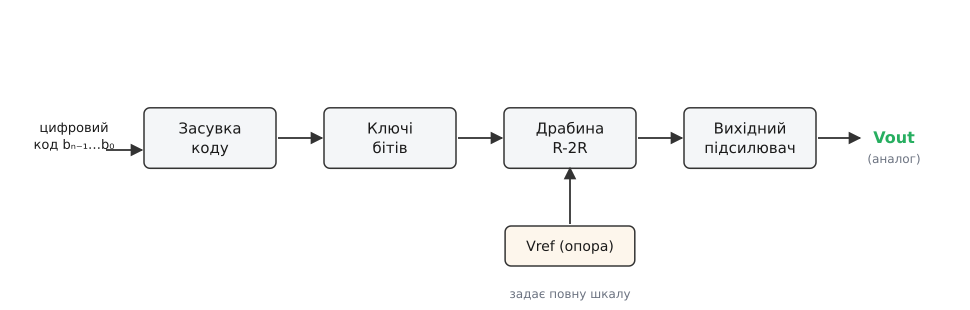
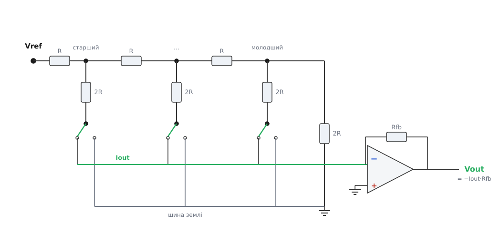
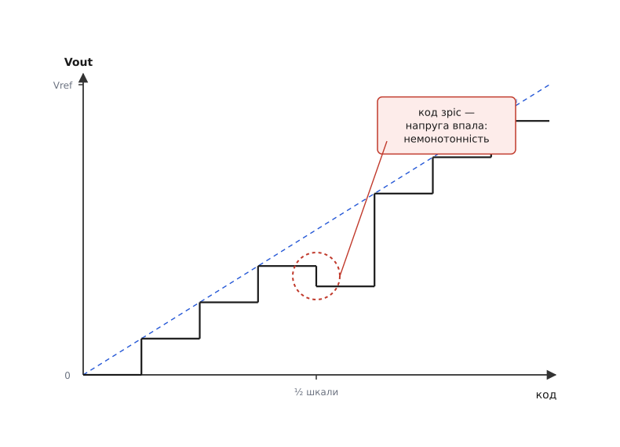

# Драбинковий ЦАП R-2R

<preknowlist>
- [Закон Ома](root:hw-analog/ohms-law) — струм = напруга / опір; базовий зв'язок трьох величин, без нього не порахувати жодного плеча драбини.
- [Дільник напруги](root:hw-analog/voltage-divider) — як два послідовні опори ділять прикладену напругу у відношенні своїх номіналів.
- [Паралельне з'єднання](root:hw-analog/parallel-connection) — два однакові опори поряд дають половину; на цьому тримається вся драбина.
- [Суперпозиція](root:hw-analog/superposition) — у лінійному колі реакція на кілька джерел дорівнює сумі реакцій на кожне окремо.
- [Ідеальний ОП](root:hw-analog/ideal-opamp) — правила «входи не беруть струму, напруги на входах рівні»; ними працює вихідний каскад ЦАП.
- [Чому двійкова](root:math-number-theory/why-binary) — число в двійковому коді є сумою розрядів, де кожен важить свою степінь двійки 2ᵏ.
</preknowlist>

Контролер порахував число — бажані оберти двигуна, відсоток відкриття клапана, зміщення для драйвера струму. Число живе в регістрі як набір бітів. А виконавчий механізм по той бік дроту не вміє читати біти: йому потрібен **аналоговий рівень** — плавна напруга чи струм, пропорційні тому числу. Хтось мусить стати перекладачем між цифровим світом коду й аналоговим світом приводу. Цей перекладач — **цифро-аналоговий перетворювач (ЦАП; англ. *digital-to-analog converter*, DAC)**, а найпоширеніша його схема на точних резисторах — **драбинкова, R-2R**.

Завдання звучить оманливо просто. Восьмибітний код `00000000` має дати нуль вольтів, `11111111` — повну шкалу, `10000000` — рівно половину. Тобто кожен біт мусить додати до виходу свою **вагу**, і ваги ці — двійкові: старший розряд важить удвічі більше за наступний, той — удвічі більше за наступний, і так до молодшого. Питання лише в одному, але вирішальному: **як фізично** зробити так, щоб резистори підсумовували двійкові ваги — і робили це точно, дешево й однаково за будь-якої температури.

## Чому не «кожному біту свій резистор»

Перша, найочевидніша відповідь: дамо кожному біту власний резистор, обернено пропорційний його вазі. Старшому — найменший опір (найбільший струм), молодшому — найбільший. Скинемо всі струми в один вузол, і сума буде пропорційна коду. Схему так і називають — [ЦАП на зважених резисторах](root:hw-analog/dac-weighted-resistors): проста ідея, де вага біта закладена в номінал його резистора.

Вона працює на папері й розвалюється в кремнії. Для восьми бітів опори мусять відрізнятися в **128 разів** — від R до R/128; для дванадцяти — у дві тисячі разів. А тепер згадаймо, що вага молодшого біта — це крихітна поправка до великого числа, і щоб її було видно, найбільший і найменший резистори мусять зберігати своє відношення з точністю до частки відсотка — та ще й повзти від нагрівання **однаково**. Витримати таку точність на номіналах, що різняться в сотні разів, технологія не вміє: різні за розміром резистори труять по-різному, гріються по-різному, старіють по-різному. Молодший біт просто тоне в похибці старшого. Потрібен спосіб збудувати ті самі двійкові ваги, **не вимагаючи** розкиду номіналів.

## Драбина з двох номіналів

R-2R (**англ. *ladder* — драбина**) розв'язує цю біду одним ходом: вона будує всі двійкові ваги, маючи лише **два** номінали резисторів — R і 2R, у відношенні рівно 1:2. Жодного розкиду. Секрет — у самій формі, яка повторює саму себе.

Драбина — це горизонтальна шина з резисторів R, увімкнених послідовно, а від кожного вузла між ними вниз «звисає» вертикальний резистор 2R. Низ кожного 2R приєднаний до **ключа** свого біта: одиниця кидає його на опорну напругу Vref, нуль — на землю. Вихід знімають з крайнього вузла, а протилежний кінець шини замикає ще один 2R на землю. Чому саме така форма дає двійкові ваги, видно з двох спостережень.

Перше: **вихідний опір драбини завжди дорівнює R**, скільки б не було бітів. Погляньмо на найдальший кінець. Там у вузлі сходяться два резистори по 2R — кінцевий і вертикальний найдальшого біта (для опору байдуже, куди веде низ 2R: і Vref, і земля — джерела з нульовим внутрішнім опором, обидва «земля»). Два по 2R [паралельно](root:hw-analog/parallel-connection) дають рівно R. Цей R послідовно з наступним горизонтальним R дає 2R, який знову зустрічає вертикальний 2R сусіда — і знову `2R ∥ 2R = R`. Картина повторюється буква в букву на кожному щаблі. Драбина **самоподібна**: з будь-якого вузла вглиб вона виглядає однаково, тож збоку виходу теж бачимо R — і це **не залежить від коду**, бо ключі лише вибирають, куди приєднати низ кожного 2R, а обидва варіанти для опору однакові.

Друге: **внесок кожного біта вдвічі менший за сусідів**. Скористаймося тим, що коло лінійне, і подумки ввімкнемо лише один біт ([суперпозиція](root:hw-analog/superposition): повний вихід — сума внесків окремих бітів). Щоб дійти від щабля свого біта до виходу, сигнал щоразу проходить черговий вузол, а кожен вузол ділить його тим самим відношенням R до 2R — навпіл. Старший біт не проходить жодного зайвого щабля і важить найбільше, Vref/2; наступний проходить один вузол — Vref/4; далі Vref/8, і так до молодшого, що проходить усі щаблі й важить 2⁻ᴺ. Спокуса оголосити верхній щабель звичайним [дільником напруги](root:hw-analog/voltage-divider) оманлива — до вихідного вузла водночас підвішені й 2R інших бітів, тож він навантажений не одним опором, і чесний інструмент тут — суперпозиція на всій мережі, а не формула дільника. Повне покрокове виведення через [еквівалент Тевеніна](root:hw-analog/thevenin) для n щаблів винесене в окрему статтю про [резисторну драбину R-2R](root:hw-analog/r2r-ladder); тут досить інтуїції — структура згортається сама в себе, тому кожен щабель ділить навпіл.

Склавши ваги ввімкнених бітів, дістаємо весь вихід одним рядком:

```
Vout = Vref · ( b_{N-1}/2 + b_{N-2}/4 + ... + b_0/2ᴺ )
Vout = Vref · код / 2ᴺ
```

Драбина буквально обчислює `Vref · код / 2ᴺ` — двійкове зважування зроблене фізикою кола, без жодного суматора. І, що вирішально, у формулі **немає абсолютного R** — воно скоротилося. Вихід залежить лише від відношення 2R до R (яке має дорівнювати двом) і від Vref.

## Від мережі до перетворювача

Резисторна мережа — це серце, але не весь організм. Драбина сама собою не знає ні про який код: вона лише пасивно ділить напруги. Щоб із неї вийшов **перетворювач**, довкола потрібні ще три частини, і кожна додає свій шар поведінки — та свій шар похибок.


*Драбинковий ЦАП як система. Цифровий код фіксується в засувці, її біти керують ключами, які кидають щаблі драбини між Vref і землею; драбина складає двійкові ваги в аналоговий рівень, а вихідний підсилювач віддає його навантаженню з низьким опором. Точність усього ланцюга задає опора Vref — вона визначає, чому дорівнює «повна шкала».*

**Засувка (англ. *latch*)** тримає код нерухомим, поки перетворення триває. Без неї біти, що приходять із шини не всі одночасно, смикали б вихід на кожній проміжній комбінації. **Ключі** втілюють біти у фізичні перемикання щаблів. **Драбина** складає ваги. **Вихідний підсилювач** знімає результат, не навантажуючи драбину. А над усім стоїть **Vref**: оскільки вихід — це `Vref · код / 2ᴺ`, будь-яка похибка чи дрейф опори переносяться на вихід один в один. Драбина відповідає за те, щоб ваги були рівно двійковими; опора — за те, чому дорівнює сама шкала. Тому в точному ЦАП [джерело опорної напруги](root:hw-analog/voltage-reference-sources) — не другорядна деталь, а компонент такого ж класу точності, як і сама мережа.

## Ключі: де насправді ховається похибка

Ключ, що кидає низ 2R між Vref і землею, у житті не ідеальний: замкнений, він має власний **опір у відкритому стані Ron**. І цей Ron додається просто в тіло того самого плеча 2R. Плече вже не 2R, а 2R + Ron — відношення 1:2 порушене, а з ним і вага біта. Прикрість у тому, що Ron транзисторного ключа залежить від напруги на ньому й від температури, тож похибка ще й «гуляє». Для восьми бітів, де плече 2R може бути десятки кілоом, зайві сотні ом ще терпимі; для дванадцяти й вище — вже ні.

Звідси перша інженерна вимога до ключів у ЦАП: їхній Ron має бути малим і, головне, **однаковим** для всіх щаблів (тоді він хоч частково входить у спільний масштаб, а не ламає ваги нарізно). Тому ключі роблять не механічними, а напівпровідниковими — на польових транзисторах, зазвичай у комплементарній парі, щоб опір тримався сталим у всьому діапазоні напруг; загальна механіка й пастки такого [аналогового ключа](root:hw-analog/analog-switches-mux) (і те, як [MOSFET працює ключем](root:hw-components/mosfet-switch) з опором Ron) — окрема тема. Але навіть ідеально малий Ron не рятує від другої біди — **інжекції заряду**: у мить перемикання затвор транзистора скидає крихітний заряд у сигнальний вузол, і вихід смикається. Ці два ефекти — змінний Ron і стрибок заряду — і є головна причина, чому наївна воль­това схема драбини поступається місцем хитрішій.

## Струмовий режим і множильний ЦАП

Наївний спосіб увімкнути драбину — **вольтовий (англ. *voltage-mode*)**: ключі кидають щаблі між Vref і землею, а вихід знімають з крайнього вузла. Просто й наочно, але має ваду: вхідний опір драбини з боку Vref **залежить від коду**, тож опора мусить бути дуже «жорсткою», інакше просідатиме по-різному й псуватиме лінійність. А ще саме тут повною мірою кусають змінний Ron та інжекція заряду, бо ключі перемикають реальні напруги на вузлах.

Тому в більшості мікросхем-ЦАП драбину вмикають навпаки — у **струмовому режимі (*current-mode*)**. Vref подають сталою напругою на вхід драбини, а низ усіх 2R сидить не на «живій» землі, а на **віртуальній землі** підсумовувального вузла. Ключі перемикають **струм** кожного щабля — або в цей підсумовувальний вузол, або повз нього в справжню землю, — але напруги в драбині при цьому **не змінюються**. Це відразу прибирає обидві біди ключа: вузли завжди під тим самим потенціалом, тож змінний Ron майже не важить, а інжекція заряду мінімальна. Струм, зібраний у вузлі, перетворює на напругу [трансімпедансний підсилювач](root:hw-analog/transimpedance-amplifier) — операційний підсилювач із резистором зворотного зв'язку Rfb, що дає `Vout = −Iout · Rfb`.


*Струмовий (множильний) режим драбини. Vref задає повний струм, що розтікається щаблями; кожен ключ спрямовує струм свого щабля або в підсумовувальну шину (віртуальна земля на інвертувальному вході ОП), або в землю — не змінюючи напруг у драбині. Операційний підсилювач тримає вузол при нулі й перетворює зібраний струм у напругу через Rfb. Оскільки Rfb роблять на тому самому кристалі, що й драбину, його відношення до R витримане так само точно, як і всередині драбини.*

У цього режиму є наслідок, заради якого його часто обирають навмисно. Оскільки вихід пропорційний **добутку** коду на Vref, а Vref нічим не зобов'язана бути сталою, — подайте на Vref не постійну напругу, а сигнал, і ЦАП **помножить** його на код. Виходить цифрово керований підсилювач-атенюатор. Саме такий ЦАП у даташитах звуть **множильним (англ. *multiplying DAC*)**; узагальнений клас таких мікросхем — з виводами струмових виходів, вбудованим Rfb і типовою обв'язкою зовнішнього підсилювача — розібрано окремо в описі [множильного ЦАП як компонента](root:hw-analog/dac-r-2r/comp-multiplying-dac.md).

> 🔧 **Навіщо це.** Множильний ЦАП — це готовий цифровий регулятор рівня без жодного механічного потенціометра. У приводах ним задають опорний рівень драйверу — керовану напругу «бажаного струму» чи «бажаних обертів», яку контролер може плавно міняти в реальному часі. Подавши на Vref власне живлення драйвера, дістають рівень, що сам масштабується разом із живленням (рейтіометричність), — це стабілізує керування, коли шина живлення просідає.

## Вихідний каскад і глітч

Драбину не можна навантажувати напряму: щойно до виходу приєднати приймач із помітним струмом, він порушить ті самі відношення, на яких усе тримається. Тому у вольтовій схемі вихід буферизують [повторювачем](root:hw-analog/voltage-follower), а в струмовій — трансімпедансним підсилювачем; в обох випадках операційний підсилювач бере на себе струм навантаження, показуючи драбині майже нескінченний опір. Разом із цим приходить і **час установлення (англ. *settling time*)** — доки підсилювач докрутить вихід до нового значення з потрібною точністю. Для приводу це і є та затримка, з якою аналоговий рівень наздоганяє новий код; вона визначає, як швидко можна «малювати» керувальний сигнал, не спотворюючи його форму.

Але найпідступніша динамічна вада драбинкового ЦАП — **глітч (англ. *glitch* — короткий збій)**. Уявіть перехід через середину шкали: код іде з `0111_1111` на `1000_0000`. Логічно вихід має піднятися рівно на один молодший крок. Фізично ж у цю мить **вимикається** сім молодших щаблів і **вмикається** один старший — а ключі не перемикаються ідеально одночасно. Якщо старший встиг увімкнутися на мить раніше, ніж молодші згасли, вихід стрибне майже до повної шкали; якщо навпаки — просяде майже до нуля. На виході з'являється гострий викид, якого в коді немає взагалі, — і триває він, поки розкид перемикань не вирівняється. Величину цього викиду міряють не амплітудою, а **площею** (напруга на час, «енергія глітча»), бо саме площа проходить крізь наступні фільтри й приводи.

Для приводу глітч на переході через середину — це паразитний імпульс на опорному рівні драйвера: смикнутий момент двигуна, тремтіння клапана. Тому вихід точних ЦАП часто пропускають крізь **схему стеження-зберігання (англ. *deglitcher*)**, що замикається на час перемикання й відпускає вихід уже після того, як код устоявся, — вона обмінює трохи швидкості на чистий, без викидів, сигнал.

## Скільки можна довіряти виходу: статичні похибки

Навіть коли все встоялося і глітчі позаду, вихід не збігається з ідеалом точно. Домовмося про мову похибок — це та сама мова, якою говорить даташит.

Найменша сходинка виходу — **молодший значущий розряд (англ. *least significant bit*, LSB)** — дорівнює Vref/2ᴺ: тонше за неї ЦАП виставити не може, між сусідніми кодами рівнів просто немає. Ця дискретність сама собою вже вносить [шум квантування](root:hw-analog/quantization-noise) — неусувну різницю між гладкою величиною, яку ми хотіли, і драбинкою рівнів, яку дістали. Далі йдуть **зсув (offset)** — весь вихід зміщений на сталу (код 0 дає не рівно нуль) — і **похибка підсилення (gain)** — нахил характеристики не рівно такий, щоб повний код дав повну шкалу. Ці дві прощаються найлегше: зсув і нахил — це калібрування, їх віднімають і множать у прошивці раз і назавжди.

Небезпечніші дві інші. **Інтегральна нелінійність (INL)** — наскільки реальна характеристика відхиляється від прямої після усунення зсуву й підсилення; вона каже, чи можна вірити абсолютному значенню між точками калібрування. **Диференціальна нелінійність (DNL)** — наскільки нерівні сусідні сходинки: в ідеалі кожен наступний код більший рівно на 1 LSB, а насправді то на 0.8, то на 1.3. І ось коли якась сходинка виходить **від'ємною** — код зріс, а напруга впала, — ЦАП втрачає **монотонність**. Для замкненого контуру керування приводом це отрута: регулятор просить «трохи більше», дістає «трохи менше» й може піти в розгойдування.


*Вихід ЦАП як функція коду. В ідеалі сходинки однакові й лягають на пряму «Vref · код / 2ᴺ». Найкритичніший — перехід через середину шкали, де проти одного старшого щабля перемикається вся молодша половина: якщо старший розряд відхилений більше, ніж важать усі молодші разом, сходинка стає від'ємною (пунктирне коло) — характеристика немонотонна.*

Чому саме середина шкали найкритичніша, видно з того, що там відбувається: увесь внесок старшого біта, Vref/2, вмикається **проти** суми всіх молодших. Якщо старший щабель відхилений від ідеалу більше, ніж один LSB, у цій точці стрибок піде назад. Ось чому в драбинковому ЦАП **відповідність старшого розряду** тримають найретельніше, аж до лазерного підстроювання при виробництві. Кількісне виведення — як мисмач резистора перетворюється на DNL і який критерій гарантує монотонність — винесено в [розрахунок похибок драбини](root:hw-analog/dac-r-2r/math-inl-dnl-mismatch.md).

> 🔧 **Навіщо це.** Головна практична чеснота R-2R схована у формулі `Vout = Vref · код / 2ᴺ`: у ній немає абсолютного R. Вихід залежить від **відношення** 2R до R, а не від їхніх значень. Абсолютний опір на кристалі може «плисти» від партії й температури на десятки відсотків — драбині байдуже, поки всі резистори пливуть **разом** і відношення тримається. А витримати відношення 1:2 напівпровідникова технологія вміє блискуче: 2R роблять двома R послідовно, тими самими, з того самого шару, поряд. Ставка зроблена не на абсолютну точність, якої немає, а на **відповідність** сусідніх елементів — найсильнішу сторону інтегральної технології. У цьому вся причина, чому драбина живе в точних ЦАП дотепер.

## Worked-приклад: бюджет монотонности

**Умова.** Восьмибітний драбинковий ЦАП, Vref = 3.3 В. Наскільки точно має бути витриманий опір плеча старшого розряду, щоб перетворювач лишався монотонним у найгіршій точці — переході `0111_1111 → 1000_0000`?

У цій точці вмикається вага старшого біта Vref/2, а очікуваний чистий приріст виходу — лише один LSB. Щоб сходинка не пішла назад, похибка ваги старшого розряду має бути меншою за цей LSB:

```
LSB               = Vref / 2⁸  = 3.3 / 256        = 0.0129 В  (12.9 мВ)
вага старшого     = Vref / 2   = 3.3 / 2          = 1.650 В
гранична відносна похибка ваги (щоб приріст лишився додатним):
ε_max = LSB / (Vref/2) = (Vref/256) / (Vref/2) = 2 / 256 = 0.0078 = 0.78 %
```

**Висновок.** Плече старшого біта мусить тримати відношення з точністю краще за 0.78 %, інакше восьмибітний ЦАП стане немонотонним уже посередині шкали. Для дванадцяти бітів вимога стискається до 2/4096 ≈ 0.05 %, для шістнадцяти — до частки тисячної. Ось чому додати драбині розрядів легко на папері й важко в кремнії: кожен зайвий біт удвічі жорсткіше затягує гайку на відповідності старших плечей — саме тому їх підстроюють лазером, а молодші лишають як є.

## Серед інших способів зробити аналог із коду

Драбину корисно бачити поряд із суперниками. Найдешевший спосіб дістати аналог із коду — **[широтно-імпульсна модуляція з фільтром](root:hw-analog/pwm-dac-filter)**: один цифровий вивід смикає меандр зі змінною шпаруватістю, а RC-фільтр згладжує його в середню напругу. Дешево, але поволі: фільтр мусить давити пульсації, а це затримка, тож для швидкого керувального сигналу приводу ШІМ-ЦАП млявий. Драбина, навпаки, виставляє нове значення **відразу** — рівно за час установлення підсилювача, без фільтрувальної інерції, — і саме тому її ставлять там, де опорний рівень драйвера треба міняти швидко й точно. На протилежному полюсі — сигма-дельта-ЦАП: віддає дуже високу роздільність, але ще повільніший за ШІМ і не любить різких змін коду. Драбина посідає золоту середину: чесні 8–16 бітів, миттєвий відгук, і за це — вимога до відповідності резисторів.

Найнаочніший спосіб відчути драбину — зібрати її руками з кількох однакових резисторів на ніжках мікроконтролера: N виводів порту, драбинка R-2R, буфер — і ось вам N-бітний ЦАП майже задарма. Драйвер такого саморобного перетворювача, з генерацією керувальної хвилі через таблицю та накопичувач фази, і з реальними пастками (несиметрія рівнів «0» і «1» на виводах, розкид струму виводів, потреба в буфері) розібраний у [проєкті «ЦАП із ніжок GPIO»](root:hw-analog/dac-r-2r/proj-gpio-r2r.md).

Драбинковий [ЦАП](root:hw-analog/dac) — це резисторна мережа, доведена до стану придатного інструмента. Мережа дає двійкові ваги з єдиного відношення 1:2, тому їй байдуже до абсолютних номіналів і температури; але справжній характер перетворювача живе не в резисторах, а довкола них — у ключах, що вносять Ron та інжекцію заряду, в опорі, що задає абсолют шкали, у вихідному підсилювачі з його часом установлення й глітчем на середині шкали. Зрозумівши, як ці частини змовляються перетворити число на чесний аналоговий рівень, ви розумієте серце більшості точних ЦАП — і те, чому саме драбина досі стоїть між кодом контролера й опорним входом приводу.
