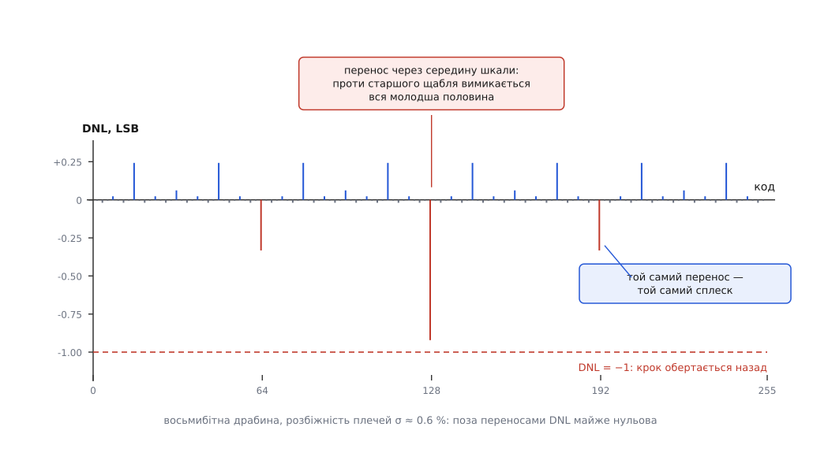
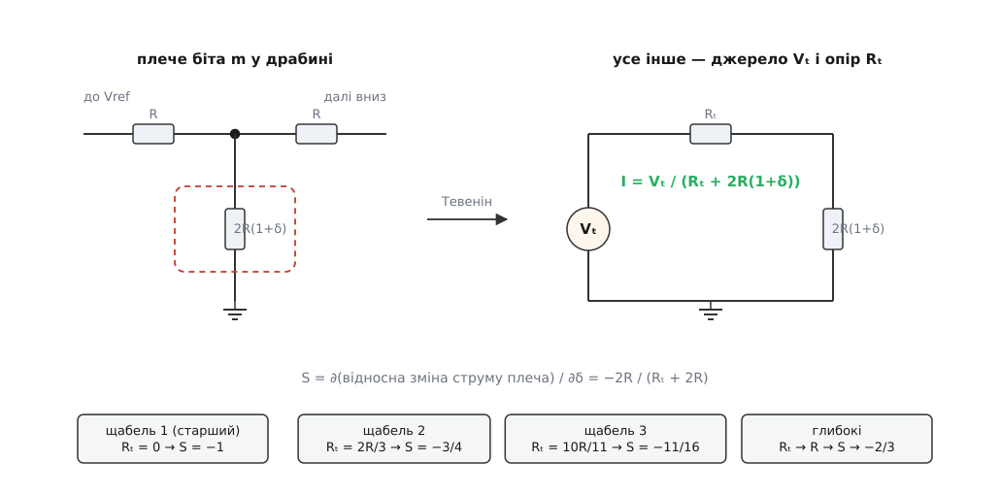
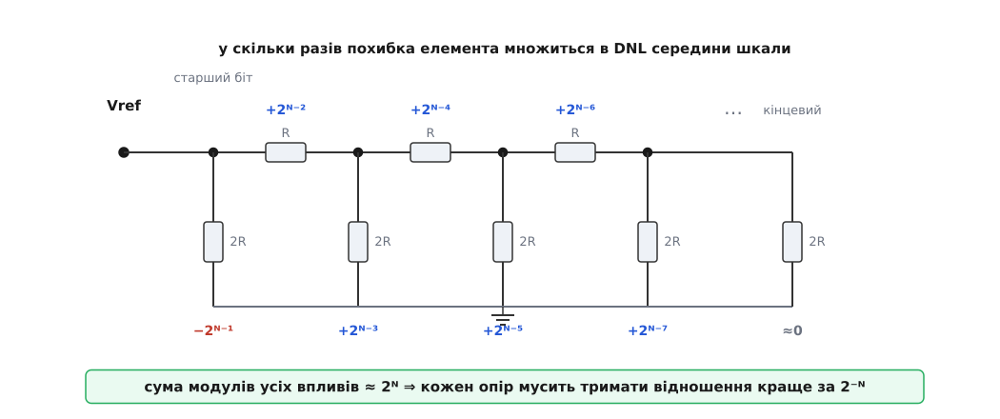

# 🧮 Розбіжність плечей → DNL: рахунок монотонності драбини

Драбина R-2R лишається монотонною доти, доки жоден її резистор не збився зі свого відношення більше ніж на 2⁻ᴺ — і цю межу треба вивести, бо саме з неї беруться і вимога до відповідності старших плечей, і відповідь на питання, скільки щаблів має сенс підстроювати лазером, а скільки можна лишити як є.

## Модель: N чисел описують усю статику

Візьмімо драбину в струмовому режимі: жорстка Vref у верхньому вузлі, низи всіх плечей 2R сидять або на землі, або на віртуальній землі підсумовувального вузла — тобто **завжди під нульовим потенціалом**. Ключі вважаємо ідеальними, підсилювач теж.

З цього випливає більше, ніж здається на перший погляд. Оскільки обидва положення ключа однакові для кола, напруги у вузлах драбини **не залежать від коду**. А отже, не залежить від коду і струм кожного плеча: він сталий, і ключ лише вирішує, потрапить цей струм у суму чи пройде повз. Вихід — точно лінійна комбінація бітів:

```
Vout(D) = Σ bₖ·Wₖ ,    k = 0…N−1 ,    D = Σ bₖ·2ᵏ
Wₖ = LSB·2ᵏ·(1 + εₖ) ,   LSB = Vref / 2ᴺ
```

Ваги Wₖ — не абстракція: це струми плечей, помножені на Rfb. Ідеал відповідає εₖ = 0 для всіх бітів. Ось перший висновок, який економить половину роботи: **уся статична крива перетворювача сидить у N числах εₖ**. Не в 2ᴺ значеннях виходу — у N відносних похибках ваг. Усе інше — арифметика.

Зручно міряти похибку в одиницях молодшого розряду. Відніміть від фактичного виходу ідеальний код:

```
e(D) = Vout(D)/LSB − D = Σ bₖ·2ᵏ·εₖ
```

Функція e(D) — це вся неідеальність разом: і зсув, і нахил, і нелінійність. Розділяє їх домовленість про те, що вважати ідеальною прямою.

## INL і DNL — та сама сума, поглянута двічі

Зсув тут нульовий (при D = 0 усі біти вимкнені, e = 0), а нахил прибирають, провівши пряму через кінці шкали. Що лишилося після цього — і є інтегральна нелінійність:

```
INL(D) = e(D) − D·g ,     g = e(2ᴺ−1) / (2ᴺ−1)
DNL(D) = INL(D+1) − INL(D) = e(D+1) − e(D) − g
```

Друге рівняння варте того, щоб на ньому спинитись: DNL — це просто **приріст INL за один крок коду**, а INL — накопичена сума всіх DNL до цього коду. Дві величини даташита виявляються однією кривою, поглянутою в лоб і в похідну. Величина g — це похибка підсилення в перерахунку на крок; вона порядку самих εₖ, тобто тисячні частки LSB, і на тлі DNL порядку одиниці її можна опустити.

Тепер головне: порахувати e(D+1) − e(D). Різниця залежить від того, **скільки бітів перекидається** на цьому кроці. Якщо код закінчується нулем, вмикається лише молодший біт, і різниця — це ε₀, тобто мізер. Цікаве починається на **переносі**: коли молодші m бітів гасять, а біт m вмикається.

```
D   = … 0 1 1 … 1        (біт m — нуль, біти m−1…0 — одиниці)
D+1 = … 1 0 0 … 0

DNL = 2ᵐ·εₘ − (2ᵐ⁻¹·εₘ₋₁ + … + 2¹·ε₁ + 2⁰·ε₀)
```

Старші за m біти в різницю не входять зовсім — вони не змінюють стану. Тому **DNL залежить тільки від глибини переносу**, а не від того, де саме по шкалі цей перенос трапився. Звідси характерна форма кривої: сплески сидять рівно на переносах, і однакові переноси дають однакові сплески. У восьмибітному ЦАП код 63→64 і код 191→192 матимуть **однакову** DNL до останньої цифри, бо в обох випадках перекидаються ті самі шість молодших бітів проти сьомого.


*Гребінка DNL. Поза переносами крива практично нульова: там вмикається один молодший біт, і його похибка непомітна. На переносі глибини m проти одного щабля перекидається вся молодша піраміда — і DNL підскакує; найбільший сплеск — на середині шкали, де перенос найглибший; що мілкіший перенос, то менший сплеск. Однакові переноси дають тотожні значення, тому гребінка самоподібна.*

Перепишімо той самий рядок для найглибшого переносу, m = N−1 — переходу через середину шкали:

```
DNL(½) = 2ᴺ⁻¹·ε_ст − Σ 2ᵏ·εₖ  (k = 0…N−2)
       ≈ 2ᴺ⁻¹·(ε_ст − ε_сер)
```

де ε_сер — середня похибка молодших ваг, зважена їхніми ж вагами. У цій формі видно те, що в драбині є найважливішим: **DNL живиться різницею**, а не абсолютними значеннями. Якби всі εₖ виявились однаковими, різниця стала б нулем, і жодної нелінійності не було б — була б чиста похибка підсилення, яку прибирає калібрування. Ось точний вигляд твердження «абсолютний опір драбині байдужий»: спільна складова похибки скорочується, лишається тільки розбіжність. І вона множиться на 2ᴺ⁻¹.

## Критерій монотонності

Монотонність означає, що вихід ніколи не йде назад: приріст на кожному кроці додатний. Приріст у LSB дорівнює 1 + DNL, тож умова одна:

```
DNL(D) > −1   для всіх D
```

Далі все залежить від того, що ми готові припустити про εₖ.

**Випадок перший — винен лише старший розряд.** Якщо решта ваг ідеальна, з формули лишається 2ᴺ⁻¹·ε_ст > −1:

```
|ε_ст| < 2⁻⁽ᴺ⁻¹⁾ = 2 / 2ᴺ
```

**Випадок другий — усі ваги збиті, і найгіршим чином.** Природа не зобов'язана бути ласкавою: старша вага може виявитись заниженою рівно тоді, коли всі молодші завищені. Підставмо ε_ст = −ε, а всі решта +ε:

```
DNL(½) = −2ᴺ⁻¹·ε − (2ᴺ⁻¹ − 1)·ε = −(2ᴺ − 1)·ε
|ε| < 1 / (2ᴺ − 1) ≈ 2⁻ᴺ
```

Різниця між двома випадками — рівно вдвічі, і вона не косметична. Перший рядок — це те, що зазвичай кажуть про старший розряд; другий — те, що доводиться закладати в технічні умови, бо гарантувати монотонність можна лише за найгіршим збігом. Обидві межі мають однакову природу: **відносна похибка ваги мусить бути меншою за вагу молодшого розряду в частках повної шкали**, тобто за 2⁻ᴺ. Кожен доданий біт затягує гайку вдвічі.

## Звідки береться εₖ: одне плече очима Тевеніна

Досі εₖ були просто числами. Тепер зв'яжімо їх із фізичною розбіжністю (англ. *mismatch*) — відхиленням резистора від свого номіналу відносно решти мережі. Нехай плече якогось біта дорівнює 2R(1+δ) замість 2R.

Прямий шлях — перерахувати всю драбину — довгий і непотрібний. Достатньо зауважити, що плече бачить решту кола як одне джерело: замініть усе, крім самого плеча, [еквівалентом Тевеніна](root:hw-analog/thevenin) — джерелом Vₜ послідовно з опором Rₜ (обидва рахують при **знятому** плечі, тому від δ вони не залежать зовсім). Струм плеча тоді точний, без жодних наближень:

```
I = Vₜ / (Rₜ + 2R(1+δ))

S = (відносна зміна I) / δ = −2R / (Rₜ + 2R)
```


*Плече, вийняте з драбини. Уся решта мережі — щаблі, послідовні R, кінцевий резистор і джерело — згортається в пару Vₜ, Rₜ, які не залежать від самого плеча. Тому струм плеча дається одним діленням, а чутливість до розбіжності виявляється звичайним відношенням опорів: чим більший Rₜ порівняно з плечем, тим більша частка похибки «розчиняється» в решті кола.*

Лишилося знайти Rₜ. Праворуч від будь-якого вузла драбина завжди виглядає як 2R — на цьому тримається сама [резисторна драбина R-2R](root:hw-analog/r2r-ladder), де кожен щабель ділить сигнал навпіл саме тому, що структура повторює саму себе. Ліворуч самоподібності немає: там ланцюг упирається в джерело, яке для розрахунку опору є коротким замиканням. Опір ліворуч будується рекурсією, у якій кожен щабель додає свій R і своє плече:

```
A₁ = 0                       (вузол старшого біта сидить просто на Vref)
Aⱼ₊₁ = R + (2R ∥ Aⱼ)          →  A₂ = R, A₃ = 5R/3, A₄ = 21R/11, … → 2R
Rₜ(j) = Aⱼ ∥ 2R
```

Підставмо це в S і зберімо в стовпчик:

```
щабель          Rₜ         S = −2R/(Rₜ+2R)
1 (старший)     0          −1
2               2R/3       −3/4    = −0.750
3               10R/11     −11/16  = −0.6875
глибокі         → R        → −2/3  = −0.667
```

Отже, **плече старшого біта — єдине, чия розбіжність переходить у похибку ваги один в один**; для всіх інших щаблів частина похибки розчиняється в решті мережі, і коефіцієнт швидко сходиться до ⅔. Різниця між 1 і ⅔ невелика, і це навіть корисно: хоч би як була влаштована конкретна драбина (з послідовним R на вході чи без), чутливість не вийде за вилку від 0.67 до 1. Груба оцінка «похибка ваги ≈ розбіжність плеча» помиляється щонайбільше в півтора раза.

Але картина ще не повна. Змінивши плече, ми зачепили й напругу свого вузла, а разом із нею — **усі молодші щаблі**, бо вони живляться саме з нього. Той самий контур Тевеніна дає й цей зсув:

```
h = Rₜ / (Rₜ + 2R) = 1 + S      (0 для старшого щабля, → ⅓ для глибоких)
```

тобто всі ваги, молодші за зачеплену, дружно зсуваються на +h·δ. Підставмо тепер обидва ефекти у формулу DNL на переносі глибини m: сама вага дістає εₘ = −δ(1−h), а кожна молодша — εₖ = +δ·h:

```
DNL = 2ᵐ·(−δ(1−h)) − (2ᵐ − 1)·(+δ·h) = −δ·(2ᵐ − h) ≈ −2ᵐ·δ
```

Глибина щабля скоротилася. Хоч би де в драбині сидів збитий резистор, **на своєму переносі він дає сплеск −2ᵐ·δ**: чутливість самої ваги менша для глибоких щаблів рівно настільки, наскільки більший спільний зсув молодших. Це скорочення і робить драбину такою передбачуваною: похибка плеча множиться просто на вагу свого біта.

Послідовні R поводяться інакше, і це варто знати. Резистор R між двома вузлами не чіпає ваг вище себе, зате зсуває **всі** нижчі на −δ/2 разом. У формулі DNL це дає +(2ᵐ−1)·δ/2 ≈ +2ᵐ⁻¹·δ — удвічі слабше за плече і **протилежного знаку**. Завищений послідовний R робить крок на середині шкали завеликим, завищене плече старшого біта — замалим. Для монотонності небезпечний лише другий.

## Бюджет: скільки має тримати кожен опір

Тепер можна скласти повний кошторис. Порахуймо, у скільки разів похибка кожного окремого елемента множиться в DNL середини шкали. Ряд виходить напрочуд правильний:

```
елемент (від Vref углиб)     вплив на DNL(½)      для N = 8
плече старшого біта            −2ᴺ⁻¹               −127.5
послідовний R за ним           +2ᴺ⁻²                +63.7
плече наступного біта          +2ᴺ⁻³                +32.4
наступний послідовний R        +2ᴺ⁻⁴                +15.7
…                              …                     …
кінцевий 2R                    менше за одиницю      −0.7

сума модулів  Σ|вплив| ≈ 2ᴺ        (для N = 8 точно 257.7)
```


*Вага кожного елемента в бюджеті DNL. Рахуючи від опорного входу вглиб, вплив падає вдвічі на кожному кроці й чергується: плече, послідовний резистор, плече, резистор. Плече старшого біта входить зі знаком мінус, усе інше — з плюсом. Сума модулів усього ряду дорівнює 2ᴺ, і саме вона перетворює вимогу DNL > −1 на допуск на кожен окремий опір.*

Вплив падає вдвічі на кожному кроці вглиб, тож геометрична сума збігається до 2ᴺ — а це рівно та величина, що стоїть у критерії монотонності. Вимога DNL > −1 при найгіршому збігу знаків перетворюється на один рядок:

```
δ < 1 / Σ|вплив| ≈ 2⁻ᴺ

N = 8     δ < 0.39 %      (точно 0.388 %)
N = 12    δ < 0.024 %     (точно 0.0244 %)
N = 16    δ < 0.0015 %    (точно 0.00153 %)
```

Ці числа збігаються з тим, що пишуть у практичних настановах для дванадцятибітних перетворювачів: потрібну відповідність там називають на рівні 0.01–0.02 %, а розкид близько 0.025 % — уже небезпечним для лінійності. Це не збіг, а той самий рахунок з іншого боку.

Варто наголосити, про яку саме точність ідеться. Це **не** абсолютний допуск: сам номінал може плисти хоч на десятки відсотків, аби всі резистори пливли разом. Ідеться про [відповідність](root:hw-components/resistor-tolerance) — те, наскільки резистори одного кристала чи однієї збірки відрізняються **один від одного** й наскільки однаково вони реагують на нагрів. Абсолютний допуск і відповідність — різні параметри й різні числа в даташиті; у драбину входить друге. До речі, звична практика робити 2R із двох послідовних R працює саме на це: вона прибирає систематичну похибку відношення, а випадкову зменшує в √2 разів, бо усереднює дві незалежні похибки.

> 🔧 **Навіщо це.** Рядок δ < 2⁻ᴺ одразу відповідає на питання, яке виникає щоразу, коли драбину збирають із дискретних резисторів на платі: скільки бітів має сенс закладати. З резисторами допуску 1 % гарантована монотонність тримається до 2ᴺ < 100, тобто до шести бітів; з 0.1 % — до дев'яти; далі жодна кількість ніжок мікроконтролера не допоможе, бо межу ставить не схема, а розкид номіналів. Десять і більше вимагають або готової резисторної збірки з нормованою відповідністю, або добору старших плечей вимірюванням.

## Приклад: 0.3 % на старшому плечі

**Умова.** Плече старшого біта завищене на 0.3 % (δ = +0.003), решта драбини ідеальна. Що це дає у восьмибітному ЦАП і що — у дванадцятибітному?

Оскільки збите саме перше плече, вузол якого сидить просто на Vref, воно нічого не зсуває в решті мережі: S = −1, h = 0, і всі інші ваги лишаються точними.

```
ε_ст   = −δ/(1+δ) = −0.00299
DNL(½) = −2ᴺ⁻¹·δ

N = 8:   DNL = −128·0.003 = −0.384 LSB   → крок замість 1 LSB дає 0.62 LSB
N = 12:  DNL = −2048·0.003 = −6.14 LSB   → крок дає −5.13 LSB
```

**Висновок.** Той самий резистор, та сама розбіжність — і два зовсім різні присуди. У восьмибітному перетворювачі сходинка на середині шкали лише стискається до двох третин: перетворювач лишається монотонним із запасом. У дванадцятибітному вихід на цьому переході **йде назад на п'ять LSB**: код зростає, напруга падає. Для замкненого контуру керування це готове розгойдування.

Інтегральна нелінійність при цьому вдвічі менша за сплеск DNL і симетрична відносно середини: пряма, проведена через кінці шкали, ділить сходинку навпіл, тож INL проходить від +0.19 LSB перед серединою до −0.19 LSB після неї (у дванадцятибітному — від +3.07 до −3.07). Загальне правило для драбини, де домінує похибка старшого плеча: |INL|max = |DNL|max / 2.

**Обернена задача.** Дванадцятибітна драбина з R = 10 кОм має лишатися монотонною за будь-якого збігу похибок. Який допуск на плече?

```
δ < 2⁻¹² = 0.0244 %
2R = 20 кОм  →  Δ = 20000 · 0.000244 = 4.9 Ом
```

**Висновок.** Плече з двадцяти кілоомів мусить триматися своїх п'яти ом. Саме тому старші плечі підстроюють лазером на пластині, а не сподіваються на технологічний розкид.

## Статистика: чому підстроюють тільки верхівку

Найгірший збіг знаків — річ обов'язкова для гарантії, але не для розуміння того, що станеться з типовим кристалом. Якщо розбіжності незалежні й мають однакове σ, похибки складаються не арифметично, а [квадратично](root:math-probability/error-propagation) — кожна вносить свою дисперсію, і сумарне середньоквадратичне відхилення дорівнює кореню із суми квадратів:

```
σ(DNL на переносі m) = σ_ε·√(4ᵐ + 4ᵐ⁻¹ + … + 1) = σ_ε·√(4ᵐ + (4ᵐ−1)/3)
                     ≈ σ_ε·2ᵐ·√(4/3) = 1.155·2ᵐ·σ_ε
```

Множник √(4/3) ≈ 1.155 малий не випадково: майже все, що є під коренем, приносить один-єдиний доданок. Розкладімо дисперсію по внесках:

```
внесок у дисперсію DNL на переносі глибини m
плече біта m        4ᵐ / ((4/3)·4ᵐ)      = 75 %
плече біта m−1      4ᵐ⁻¹ / ((4/3)·4ᵐ)    = 18.75 %
плече біта m−2                           = 4.7 %
усе, що нижче, разом                     = 1.5 %
```

**Три чверті всієї дисперсії DNL сидять в одному резисторі**, а два верхні щаблі разом дають 94 %. Усе, що нижче за них, додає до дисперсії шість відсотків. Ось точна причина, чому в драбинкових ЦАП лазером підстроюють старші плечі, а молодші лишають як є: підстроювання четвертого щабля згори вже майже нічого не змінює, бо його внесок тоне в тому, що лишилося від першого.

Скільки саме щаблів треба чіпати, теж рахується. Візьмімо звичний трисигмовий запас: у [нормальному розподілі](root:math-probability/normal-distribution) практично вся маса лежить у межах ±3σ, тож вимога «3σ сплеску не досягає одного LSB» рівносильна «монотонність витримає майже кожен кристал»:

```
3 · 1.155 · 2ᵐ · σ_ε < 1
2ᵐ < 0.289 / σ_ε
```

```
σ_ε = 0.1 %    →  2ᵐ < 289   →  безпечні переноси до m = 8
σ_ε = 0.03 %   →                 до m = 9
σ_ε = 0.01 %   →                 до m = 11
```

**Висновок.** Драбина з непідстроюваною відповідністю 0.1 % проходить без жодного втручання приблизно до дев'яти бітів — найглибший її перенос має m = 8. Дванадцятибітній тими самими резисторами бракує трьох порогів: переноси m = 9, 10, 11 виходять за межу, тож підстроювати доводиться три-чотири верхні елементи, рахуючи від опорного входу: старше плече, послідовний резистор за ним і ще один-два за ними. Далі знову працює правило «вплив падає вдвічі»: щойно верхівку доведено до потрібної відповідності, наступний елемент уже вдвічі менш важливий за той, що ви щойно виправили.
