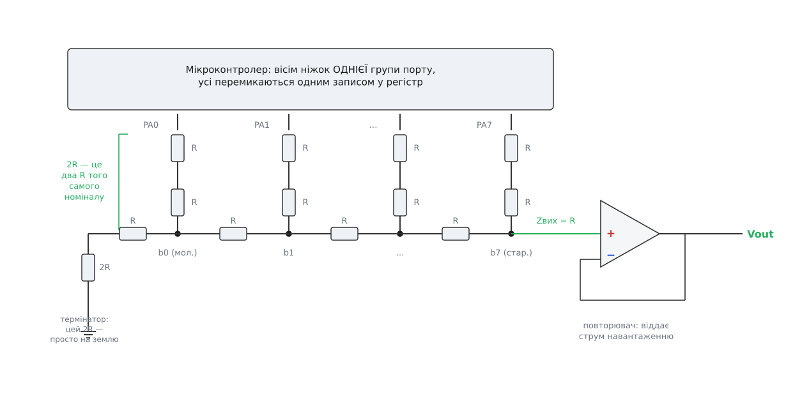
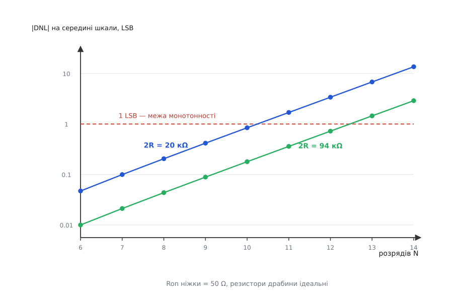
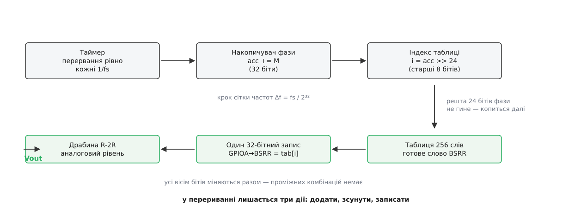

# ⚙️ ЦАП із ніжок GPIO: драбина, таблиця й накопичувач фази

Мікроконтролер без вбудованого ЦАП уміє видавати аналоговий рівень довільної форми — ціною восьми вільних виводів порту й жменьки однакових резисторів; тут зібрано таку саморобку цілком: схема, робочий драйвер із таблицею й накопичувачем фази, і числа, які показують, де саме ця конструкція впирається в стелю.

## Задача

Приводу потрібен опорний рівень, який доводиться **малювати**, а не просто виставляти. Плавний розгін за профілем, синусоїда 20–2000 Гц для перевірки, як механізм відгукується на частоту, огинальна для драйвера струму — усе це не «одне число раз на секунду», а форма в часі, з десятками тисяч точок за секунду.

У контролера, що вже стоїть на платі, вбудованого ЦАП немає. Купити окрему мікросхему-ЦАП — це ще одна шина, ще один корпус, ще один рядок у переліку деталей і кілька мікросекунд на передачу коду перед кожним відліком. [ШІМ із RC-фільтром](root:hw-analog/pwm-dac-filter) — найдешевший вихід, але фільтр, який давить пульсації достатньо, водночас з'їдає ту саму швидкість, заради якої все затівалося: щоб пульсації впали нижче молодшого розряду, стала часу мусить бути в десятки разів більша за період ШІМ, і форма розмазується.

Лишається третій шлях. У порту є вісім вільних виводів, кожен уміє видавати «0» або «1». Це вже вісім бітів — треба тільки зважити їх двійково. Драбина R-2R і робить рівно це, причому з резисторів **одного** номіналу.

## Схема: шістнадцять резисторів одного номіналу

Вісім виводів порту — вісім щаблів. Від кожного виводу вниз іде плече 2R, низи плечей сходяться на горизонтальну шину з резисторів R, а біля молодшого кінця шини висить ще одне плече 2R, приєднане просто до землі — термінатор. Вихід знімають із протилежного кінця, від вузла старшого розряду.


*Уся апаратна частина. Вісім виводів однієї групи порту, шістнадцять резисторів одного номіналу (кожне плече 2R — це два R послідовно), один термінатор на землю й повторювач на виході. Вивід у стані «1» підтягує своє плече до живлення, у стані «0» — до землі: [GPIO](root:hw-digital/gpio) тут працює не як лінія даних, а як силовий ключ щабля.*

Плече 2R складають **із двох резисторів R послідовно**, а не беруть окремий номінал 20 кΩ. Причина не в економії на складі. Вихід драбини залежить лише від **відношення** плеча до перекладини, тож будь-яке спільне відхилення обох — від партії, від температури — скорочується й на результат не впливає. Резистори з однієї стрічки відхилені майже однаково: у них спільна заготовка, спільне підганяння, спільний температурний коефіцієнт. Узявши два номінали з різних стрічок, ви ставите під удар саме те, чим драбина живе, — узгодженість; узявши один, лишаєте на відношення тільки розкид **усередині** партії.

Наскільки це важить, показує статистична проба: триста випадкових складань восьмибітної драбини за моделлю, де кожен резистор дістає своє відхилення (нормальний розкид, ±1 % узято як 3σ, резистори незалежні — це свідомо песимістичніше за одну стрічку).

```
2R = два R по 1 % послідовно :  6 немонотонних складань із 300  (2.0 %)
2R = окремий номінал 1 %     : 20 немонотонних складань із 300  (6.7 %)
```

Утричі менше браку — і жодної додаткової деталі, лише інший спосіб укласти ті самі резистори. [Допуск і розкид резисторів](root:hw-components/resistor-tolerance) тут — головна витратна стаття точності, і одна ця перестановка віддає третину її задарма.

Виводи мусять належати **одній групі порту** й краще йти підряд: усі вісім бітів мають перемкнутися одним записом, а один запис лягає в один регістр однієї групи. Виводи з приклеєними функціями — лінії налагоджувача, входи з вбудованою підтяжкою — під драбину не годяться.

## Вивід — це ключ, і в нього є свій опір

Ось де саморобка розходиться з мікросхемою. У промисловому ЦАП ключ біта роблять навмисно під цю роботу; тут ключем працює звичайний [двотактний вихідний каскад](root:hw-digital/push-pull-output) виводу порту — пара транзисторів, що по черзі тягне плече до живлення чи до землі. Опір цієї пари у відкритому стані сідає **просто в тіло плеча**: замість 2R виходить 2R + Ron, відношення до перекладини порушене, вага щабля попливла.

Даташит не називає Ron прямо — він обіцяє рівні під навантаженням, а це те саме, сказане інакше. Для STM32F103 таблиця вихідних рівнів гарантує VOL не гірше 0.4 В при струмі 8 мА і VOH не гірше VDD − 0.4 В за тих самих умов; при 20 мА обидві межі розтягуються до 1.3 В. Поділивши напругу на струм, дістаємо стелю еквівалентного опору:

```
Ron_max = 0.4 В / 8 мА = 50 Ω
```

Типове значення менше, але воно не нормоване — рахувати треба зі стелі. Далі — просте питання: скільки розрядів витримає драбина, у якої в кожному плечі сидять зайві 50 Ω? Міряти будемо тією мовою, якою похибки [ЦАП](root:hw-analog/dac) описують у даташитах, — різницею сусідніх сходинок, диференціальною нелінійністю: щойно вона провалюється нижче −1 LSB, код росте, а напруга падає. Розрахунок моделі з перебором усіх кодів (резистори ідеальні, псує лише Ron) дає криву з дуже чіткою поведінкою.


*Розрахунок за моделлю драбини з Ron = 50 Ω у кожному плечі, резистори ідеальні. По вертикалі — глибина провалу на переході через середину шкали, у молодших розрядах; шкала логарифмічна. Кожен доданий біт подвоює провал у LSB, бо сам LSB меншає вдвічі, а абсолютна похибка ваги лишається та сама. Перетин штрихової лінії — той розряд, на якому перетворювач перестає бути монотонним.*

Числа з кривої лягають на просту залежність:

```
|DNL| на середині шкали ≈ (Ron / 2R) · 2ᴺ / 3      [LSB]

перевірка, Ron = 50 Ω, 2R = 20 кΩ:
   N = 8  : (50/20000)·256/3  = 0.213   (модель дає 0.205)
   N = 12 : (50/20000)·4096/3 = 3.413   (модель дає 3.399)
```

Звідси критерій монотонності — умова, щоб провал не дійшов до одного LSB:

```
2ᴺ  <  3 · 2R / Ron

2R = 20 кΩ, Ron = 50 Ω  →  2ᴺ < 1200  →  N ≤ 10
2R = 94 кΩ, Ron = 50 Ω  →  2ᴺ < 5640  →  N ≤ 12
```

Прикметно, чого в цьому критерії **немає**: абсолютного падіння напруги на ключі. Крізь плече тече від сили VDD/2R ≈ 165 мкА, і на 50 Ω це якісь вісім мікровольтів — мізер проти LSB у 12.9 мВ. Псує не падіння, а зміщене відношення: зайві 50 Ω до 20 кΩ — це 0.25 % ваги щабля, а вага старшого щабля дорівнює половині шкали, тож 0.25 % від 1.65 В дають 4 мВ — уже третину LSB. Ron важить **відносно 2R**, а не сам собою.

Звідси й вибір номіналу. Меншати не можна: при R = 1 кΩ ті самі 50 Ω дають провал −2.0 LSB, і восьмибітна драбина вже немонотонна. Рости теж не безмежно: вихідний опір драбини дорівнює R, і разом із паразитною ємністю монтажу він стає фільтром, який гальмує вихід. Десять кілоом — та середина, де Ron уже не заважає (провал 0.2 LSB), а вихідний опір ще піддається буферизації.

> 🔧 **Навіщо це.** Критерій `2ᴺ < 3·2R/Ron` перетворює даташит на рішення про закупівлю. Хочете десять бітів замість восьми — або беріть контролер із удвічі меншим Ron, або вчетверо піднімайте номінали й миріться з учетверо повільнішим виходом. Хочете дванадцять — на виводах порту цього вже не буде: 2R довелося б підняти під сотню кілоом, і тоді ємність монтажу з'їсть швидкість, заради якої драбину й брали замість ШІМ.

## Рівні «0» і «1» — не рейки

Вивід у стані «1» видає не VDD, а VOH; у стані «0» — не нуль, а VOL. Повна шкала драбини дорівнює не живленню, а різниці:

```
розмах = VOH − VOL
нуль шкали = VOL
```

Половина новин тут добра. Якщо всі вісім виводів однакові — а вони таки майже однакові, це сусідні комірки одного порту на одному кристалі, — то однаковий зсув усіх рівнів дає рівно **зсув і похибку підсилення**, а вони калібруються раз і назавжди: відняти сталу, помножити на сталу. Форма характеристики не страждає.

Друга половина гірша. По-перше, VOL і VOH прив'язані не до однієї точки: «одиниця» відлічується від шини живлення, «нуль» — від землі кристала, і несиметрія між верхнім та нижнім транзисторами каскаду робить ці два відхилення різними. По-друге — і це головне — **опорою вашого ЦАП стає шина живлення контролера**. Вихід дорівнює `(VOH − VOL) · код / 2ᴺ`, тобто вся шкала їде слідом за VDD. А VDD у мікроконтролера — це не прецизійне джерело, а рейка, яку сіпає власна цифрова робота: кожне перемикання ядра, кожен старт периферії. Просідання живлення на 1 % — це похибка виходу на 2.5 LSB для восьми бітів.

Найгірша мить збігається з найгіршим кодом. Перехід через середину шкали перемикає всі вісім виводів разом і в протилежні боки — саме тоді через виводи проходить найбільший кидок струму й [стрибок землі](root:hw-pcb/ground-bounce) досягає максимуму. Тобто похибка живлення додається до глітча в тій самій точці, де перетворювач і без неї найвразливіший. Практичний висновок: конденсатор на живленні контролера ставлять не «щоб було», а як частину саме цього ЦАП, і землю драбини заводять окремим провідником до земляного виводу контролера, а не до спільної шини десь на середині плати.

Виводи всередині однієї групи схожі, але це не гарантія. У багатьох контролерів частина виводів має інакший каскад — п'ятивольтну сумісність, підвищений струм — і його Ron відрізняється. Змішувати такі виводи в одній драбині не можна: різні плечі дістануть різні добавки. З тієї ж причини всім восьми виводам треба виставити **однакові** налаштування [сили виходу](root:hw-digital/drive-strength) й швидкості фронтів: ці налаштування прямо міняють Ron, і різні значення на різних щаблях розведуть ваги врізнобіч.

## Драйвер: одне перетворення — один запис у порт

Аналогова частина не має ні регістрів, ні шини, ні протоколу — уся вона керується напругами на восьми виводах. Отже, **перетворення коду в напругу — це рівно одна команда запису в порт**: після неї драбина вже віддає потрібний рівень, чекати нічого не треба. Усе, що робить драйвер, зводиться до двох питань: коли писати й що.

І тут одразу пастка, яка вбиває більшість перших спроб. Вивести число «по біту» — вісім викликів бібліотечної функції на кшталт `write_pin(PA0, b0); write_pin(PA1, b1); …` — не просто повільно. Кожен виклик міняє **один** вивід, а між викликами на драбині стоїть реальна напруга, що відповідає проміжній комбінації. Перехід від `0111_1111` до `1000_0000`, поданий по одному біту, пройде через сім проміжних кодів, і кожен із них вихід чесно відпрацює: замість сходинки в один LSB вийде черга сплесків мало не на всю шкалу. Тому весь код мусить лягти на виводи **одним записом**.

У сімействі STM32 для цього є регістр BSRR: молодша половина його тридцяти двох бітів ставить виводи в одиницю, старша — скидає в нуль, і все це — один запис, за один такт шини. Заздалегідь склавши слово так, щоб потрібні виводи опинилися в «поставити», а решта — у «скинути», ви міняєте всю вісімку одночасно й нічого не читаєте перед записом:

```
код 0x5A = 0101_1010
слово BSRR = 0x00A5_005A
             ^^^^  ^^^^
             скинути (0xA5)  поставити (0x5A)
```

Це важливо ще й тому, що звичний прийом «прочитати регістр виходу, змінити біти, записати назад» тут узагалі непридатний: між читанням і записом може втрутитися переривання чи інший потік, який теж чіпає цей порт, — і ви або загубите його зміну, або він загубить вашу. Запис у BSRR неподільний за побудовою: він не читає нічого. Поточний стан виводів групи тримає окремий регістр виходу, а BSRR — це вхід «постав ці, скинь ті», який діє на нього без читання; решта [регістрів GPIO](root:sf-devices/gpio-registers) — режим, сила, швидкість фронтів — налаштовується раз при старті. Тут від них потрібна одна властивість: один запис, усі біти разом.

## Коли й що писати: таблиця з накопичувачем фази

Момент запису визначає форму так само сильно, як і саме число. Відліки мусять лягати на **рівномірну** сітку часу: сигнал відновлюється з відліків тільки за припущення, що між ними однакові проміжки. Плаваючий момент запису — це [апертурна невизначеність](root:hw-analog/aperture-jitter): відлік правильний за значенням, але взятий не тоді, коли треба, і на крутих ділянках сигналу похибка часу стає похибкою напруги. Тому джерелом ритму мусить бути [таймер](root:hw-arch/timer-counter) з апаратним перериванням, а не затримка в циклі й не системний тік.

Що писати — задає **накопичувач фази**. Спокуса зробити просто (`i = (i + 1) % LEN`) розбивається об арифметику: такий лічильник дає лише частоти `fs/LEN`, `2·fs/LEN`, … — для LEN = 256 і fs = 40 кГц це сітка з кроком 156 Гц, а між вузлами нічого. Накопичувач знімає це обмеження: тримаємо фазу в цілому 32-бітному лічильнику, який переповнюється рівно на періоді сигналу, і на кожному відліку додаємо до неї сталий крок.

```
крок (настроювальне слово):    M = round( f · 2³² / fs )
фактична частота:              f_факт = M · fs / 2³²
крок сітки частот:             Δf = fs / 2³²
індекс у таблиці на 256 точок: i = acc >> 24
```

Числа для fs = 40 кГц:

```
Δf = 40000 / 4294967296 = 9.31 · 10⁻⁶ Гц

f = 440 Гц  →  M = round(440 · 2³² / 40000) = 47244640
               f_факт = 47244640 · 40000 / 2³² = 439.999998 Гц
               похибка −2.4 · 10⁻⁶ Гц
```

Сітка з кроком у десять мікрогерц — це вже не сітка, а неперервна настройка. Секрет у тому, що індекс бере лише **старші** вісім бітів накопичувача, а решта двадцять чотири не пропадають: залишок фази копиться далі й час від часу «підштовхує» індекс на крок раніше або пізніше. Ціна цього прийому — усічення фази: індекс завжди трохи відстає від справжньої фази, і це відставання пиляє форму, додаючи до спектра дискретні паразитні складові. Механіка ефекту й способи його розмазати — у [прямій цифровій синтезі](root:hw-analog/dds-synthesis); для керувального сигналу приводу вісім бітів індексу на 256-точкову таблицю дають цілком чистий результат.

Лишається хід, який робить переривання по-справжньому коротким. У таблиці зазвичай тримають **значення** сигналу — байт 0…255. Але ж драйвер усе одно мусить перетворити байт на слово BSRR, і робить це в перериванні, щоразу однаково, для тих самих 256 варіантів. Отже, зберігати треба не значення, а **готові слова BSRR**. Таблиця розростається з 256 байтів до 1 кілобайта, і за цей кілобайт флеша ви дістаєте дві речі: переривання коротшає до трьох дій, а виводи можуть лежати в порту **як завгодно** — розсипані по PA0, PA1, PA4…PA9, — бо розкладання бітів по своїх місцях уже зроблене на етапі генерації таблиці й ніяк не коштує в часі виконання.


*Шлях одного відліку. Таймер відмірює рівні проміжки; накопичувач додає до фази стале настроювальне слово; старші вісім бітів фази стають індексом; таблиця віддає вже зібране слово BSRR, яке одним записом перемикає всю вісімку виводів. Молодші двадцять чотири біти фази нікуди не діваються — вони й дають тонку настройку частоти.*

## Код

Таблицю треба десь узяти. Перший спосіб — порахувати її окремим сценарієм і покласти в проєкт готовим заголовком; другий — примусити компілятор порахувати її самому під час складання, і тоді таблиця ніколи не розійдеться з розкладкою виводів, хоч би як ту правили.

:::tabs
```python
# gen_table.py — генератор таблиці слів BSRR (запускається один раз при складанні)
import math

LEN     = 256                       # точок на період
PINMAP  = [0, 1, 4, 5, 6, 7, 8, 9]  # b0…b7 → номери виводів у групі порту
ALL     = sum(1 << p for p in PINMAP)

def bsrr(value: int) -> int:
    """Слово BSRR: молодша половина ставить одиниці, старша скидає решту наших виводів."""
    set_mask = sum(1 << p for b, p in enumerate(PINMAP) if value & (1 << b))
    return set_mask | ((ALL & ~set_mask) << 16)

words = []
for i in range(LEN):
    s = math.sin(2 * math.pi * (i + 0.5) / LEN)     # +0.5 — відлік у середині кроку
    words.append(bsrr(round(127.5 + 127.5 * s)))    # 0…255 на всю шкалу

with open("sine_bsrr.h", "w", encoding="utf-8") as f:
    f.write("/* Згенеровано gen_table.py — не правити руками. */\n")
    f.write("#include <stdint.h>\n")
    f.write(f"const uint32_t sine_bsrr[{LEN}] = {{\n")
    for i in range(0, LEN, 4):
        f.write("    " + " ".join(f"0x{w:08X}," for w in words[i:i + 4]) + "\n")
    f.write("};\n")
```
```cpp
// sine_bsrr.hpp — та сама таблиця, але її будує компілятор (C++17 і новіший).
// std::sin не constexpr, тому чверть періоду рахуємо рядом Тейлора:
// на [0, π/2] шести членів вистачає з запасом (похибка < 1e-9 проти 1/256 у LSB).
#include <array>
#include <cstdint>

inline constexpr int      LEN    = 256;
inline constexpr double   TWO_PI = 6.283185307179586;
inline constexpr uint8_t  PINMAP[8] = {0, 1, 4, 5, 6, 7, 8, 9};   // b0…b7 → виводи

constexpr double sin_quarter(double x) {          // x у [0, π/2]
    double x2 = x * x, term = x, sum = x;
    for (int k = 1; k <= 6; ++k) { term *= -x2 / ((2 * k) * (2 * k + 1)); sum += term; }
    return sum;
}

constexpr double sine(double t) {                 // t — доля періоду, [0, 1)
    if (t < 0.25) return  sin_quarter(TWO_PI * t);
    if (t < 0.50) return  sin_quarter(TWO_PI * (0.5 - t));
    if (t < 0.75) return -sin_quarter(TWO_PI * (t - 0.5));
    return                -sin_quarter(TWO_PI * (1.0 - t));
}

constexpr uint32_t bsrr(unsigned value) {
    uint32_t set_mask = 0, all_mask = 0;
    for (int b = 0; b < 8; ++b) {
        all_mask |= 1u << PINMAP[b];
        if (value & (1u << b)) set_mask |= 1u << PINMAP[b];
    }
    return set_mask | ((all_mask & ~set_mask) << 16);
}

inline constexpr std::array<uint32_t, LEN> sine_bsrr = [] {
    std::array<uint32_t, LEN> t{};
    for (int i = 0; i < LEN; ++i)
        t[i] = bsrr(static_cast<unsigned>(127.5 + 127.5 * sine((i + 0.5) / LEN) + 0.5));
    return t;
}();
```
:::

Драйвер у прошивці працює з готовою таблицею. Тут регістри й переривання, тож мова одна — C:

```c
#include <stdint.h>

#define GPIOA_BSRR   (*(volatile uint32_t *)(0x40010800u + 0x10u))
#define TIM2_SR      (*(volatile uint32_t *)(0x40000000u + 0x10u))

extern const uint32_t sine_bsrr[256];   /* згенерована таблиця слів BSRR */

static uint32_t          phase;         /* накопичувач фази: чіпає лише переривання */
static volatile uint32_t step;          /* настроювальне слово: пише головний цикл  */

/* Перерахувати частоту в настроювальне слово.
   f подається в мілігерцах, щоб не тягти в прошивку дробову арифметику.  */
static uint32_t tuning_word(uint32_t f_millihz, uint32_t fs_hz)
{
    uint64_t denom = (uint64_t)fs_hz * 1000u;
    return (uint32_t)((((uint64_t)f_millihz << 32) + denom / 2u) / denom);
}

void dac_set_freq(uint32_t f_millihz, uint32_t fs_hz)
{
    step = tuning_word(f_millihz, fs_hz);   /* 32-бітний запис неподільний — без критичної секції */
}

void TIM2_IRQHandler(void)
{
    TIM2_SR = ~1u;                          /* зняти прапорець оновлення */
    phase += step;                          /* крок фази                 */
    GPIOA_BSRR = sine_bsrr[phase >> 24];    /* усе перетворення — оцей рядок */
}
```

Три дії в перериванні: додати, зсунути, записати. `phase` навмисно не `volatile` — його чіпає тільки обробник, а кваліфікатор змусив би компілятор після запису ще раз читати змінну з пам'яті заради `phase >> 24` замість того, щоб узяти щойно пораховане значення. `step`, навпаки, `volatile` обов'язково: його пише головний цикл, а читає переривання, і без кваліфікатора компілятор має право вважати, що всередині обробника змінна не міняється, і винести читання за межі коду.

Налаштування, які лишаються за дужками: усі вісім виводів — на вихід у двотактному режимі, з однаковою силою й швидкістю фронтів; таймер — на період `f_такту/fs` з дозволеним перериванням оновлення; перериванню таймера варто дати високий пріоритет, бо його запізнення прямо стає тією самою апертурною невизначеністю.

## Скільки це коштує в тактах

Один відлік — це вхід у переривання, три дії, вихід. На Cortex-M3 вхід у виняток забирає 12 тактів при нульовому очікуванні пам'яті, вихід — стільки ж (а якщо наступне переривання вже висить, перехід між ними коштує лише 6). Тіло обробника з читанням таблиці — ще з десяток. Разом ≈ 45 тактів на відлік:

```
частка процесора = такти_на_відлік · fs / f_такту

72 МГц, 45 тактів:   fs =  44.1 кГц →  2.8 %
                     fs = 100   кГц →  6.2 %
                     fs = 500   кГц → 31.2 %
                     fs =   1   МГц → 62.5 %
```

До сотні кілогерц ЦАП практично безплатний, а далі процесор починає працювати на нього. Але тікати від цієї стелі не обов'язково: якщо форма періодична й лежить у таблиці, її можна віддавати **зовсім без процесора**. Таймер уміє на кожній події оновлення запитувати передачу, а [контролер прямого доступу до пам'яті](root:hw-arch/dma-controller) (DMA) — переливати 32-бітні слова з таблиці просто в регістр BSRR по колу. Ядро при цьому не прокидається взагалі; ціною є втрата накопичувача фази — частота знову стає `fs/LEN` і настроюється лише періодом таймера. Змішаний варіант — DMA крутить готовий буфер, а процесор перераховує другу половину буфера тоді, коли DMA дійшла до середини, — повертає довільну частоту й лишає ядро вільним майже весь час.

## Буфер: чому без нього не працює

Вихідний опір драбини дорівнює R — у нашому випадку 10 кΩ, і він не залежить від коду. З цього виходить наслідок, що спантеличує: **стале лінійне навантаження драбину не спотворює**. Модель це підтверджує: резистор 10 кΩ від виходу на землю рівно вдвічі зменшує і шкалу, і LSB, а нелінійність лишається нульовою. Похибка підсилення — і тільки.

Тому буфер потрібен не заради «щоб навантаження не псувало лінійність». Він потрібен із трьох інших причин, і кожна сама собою достатня.

**Реальні приймачі не є сталим лінійним опором.** Вхід порівнювача, вхід АЦП зі своїм конденсатором вибірки, опорний вхід драйвера з вхідним струмом — усі вони беруть струм, що залежить від напруги, а часом і від внутрішнього стану. Цей струм тече крізь 10 кΩ і перетворюється на похибку, різну для різних кодів, — а це вже нелінійність.

**Десять кілоом плюс ємність монтажу — це фільтр.** Сотня пікофарад плати, дротів і щупа дає сталу часу 10 кΩ · 100 пФ = 1 мкс, а сходинка мусить встояти з точністю до половини LSB — це приблизно шість сталих часу, тобто 6 мкс. Швидше за 150 кГц така драбина без буфера просто не встигає, і замість сходинок ви бачите заокруглені горбки.

**Струм треба комусь віддавати.** Драбина може дати від сили десяті частки міліампера; будь-яке навантаження важче за вимірювальний вхід її просто посадить.

Ліки — [повторювач](root:hw-analog/voltage-follower) на операційному підсилювачі, увімкнений на одиничне підсилення: вхід не бере струму, вихід має опір у частки ома. Але й до нього є вимоги, і кожна з них — із [реальних обмежень ОП](root:hw-analog/real-opamp-limits). Живлення однополярне, тож підсилювач мусить бути rail-to-rail і на вході, і на виході — інакше кінці шкали, де сигнал підходить до нуля й до живлення, зімнуться. Вхідний струм зсуву тече крізь ті самі 10 кΩ і стає зсувом виходу: для входу на польових транзисторах це пікоампери й нуль наслідків, для біполярного входу зі струмом 100 нА — уже мілівольт, тобто десята частина LSB. І швидкість наростання мусить перекривати найкрутіший стрибок сигналу:

**Умова.** fs = 100 кГц, розмах 3.3 В, найгірший перехід — стрибок на всю шкалу за один період відліку, і встояти він мусить не пізніше ніж за половину періоду.

```
період відліку       = 1 / 100 кГц   = 10 мкс
відведено на стрибок = 10 мкс / 2    =  5 мкс
потрібна швидкість   = 3.3 В / 5 мкс = 0.66 В/мкс
```

**Висновок.** Підсилювач зі швидкістю наростання 1 В/мкс — той мінімум, нижче якого вихід перестає встигати за таблицею; беручи запас утричі, дивляться на 2–3 В/мкс. Це скромна вимога, під неї підходить майже будь-який сучасний rail-to-rail ОП, — але ставити «якийсь підсилювач із шухляди» не варто: старі моделі з 0.5 В/мкс на 100 кГц уже ріжуть форму.

Після повторювача вихід лишається **сходинковим**: між відліками рівень стоїть нерухомо. Якщо приймачеві потрібна гладка крива, за буфером ставлять м'який [RC-фільтр](root:hw-analog/pwm-filter-sizing) із частотою зрізу приблизно `fs/10` — він з'їдає сходинки, майже не чіпаючи корисної смуги. Ставити фільтр **до** буфера не можна: його резистор додасться до вихідного опору драбини й зіпсує все, що щойно налагоджено.

## Де стеля цієї саморобки

Дві межі накладаються одна на одну, і нижча з них не та, про яку думають першою. Ron виводів при 2R = 20 кΩ дозволяє до десяти розрядів. Розкид резисторів ріже раніше:

```
статистична проба, 300 складань, 8 біт, 2R = два R послідовно, Ron = 50 Ω:
  резистори ±1.0 %  : INL у середньому 0.21 LSB, немонотонних  2 % складань
  резистори ±0.5 %  : INL у середньому 0.13 LSB, немонотонних  0 %
  резистори ±0.1 %  : INL у середньому 0.10 LSB, немонотонних  0 %

те саме на 10 бітах, резистори ±1 %  : немонотонних 60 % складань
```

Вісім бітів на звичайних однопроцентних резисторах — робоча конструкція, з якої два складання зі ста вийдуть із провалом на середині шкали; півпроцентні резистори прибирають і це. Десять бітів на однопроцентних — уже лотерея, у якій програють більшість. Далі ніякі резистори не допоможуть: на дванадцяти бітах у гру вступає Ron, і його не обійти вибором точніших деталей, лише підняттям номіналів, яке коштує швидкості.

Вісім чесних монотонних бітів, свіже значення на виході за одиниці мікросекунд після запису, довільна частота з мікрогерцовою сіткою — за шістнадцять резисторів, один операційний підсилювач і вісім виводів порту. Цього досить, щоб задавати опорний рівень драйверу, малювати профіль розгону чи гнати перевірну синусоїду. Цього не досить там, де рівень треба знати **абсолютно**: шкала прив'язана до шини живлення контролера з усім її цифровим шумом, і жодне калібрування не зробить із цієї рейки [опорне джерело](root:hw-analog/voltage-reference-sources). Тому драбину з виводів порту ставлять там, де важить **відносний** рівень і швидкість реакції на нову команду, — і не ставлять там, де число з виходу піде в протокол вимірювання.
