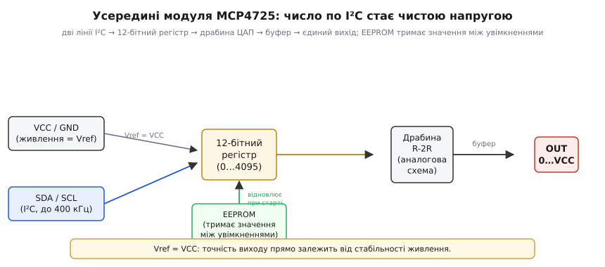

# 🔌 Зовнішній ЦАП MCP4725-класу (I²C): коли вбудованого бракує

Вбудований [ЦАП](topic:hw-analog/dac) мікроконтролера ESP32 дає лише 8 біт роздільності (256 рівнів), має два канали і слабкий вихідний струм, а на чипах S3, C3 і C6 його взагалі нема — там аналогову напругу доводиться робити тільки через ШІМ. Коли цих можливостей бракує, беруть окремий чип-ЦАП, що слухається по шині I²C і віддає один чистий аналоговий вихід Vout. Найвідоміший представник класу — **MCP4725**: одноканальний 12-бітний ЦАП по I²C із вбудованою EEPROM. Розберімо, чим він кращий за вбудований, як до нього під'єднатися, як виставити напругу одним обміном по шині й де на цьому шляху чекають граблі.

## Що це за деталь

Головна перевага видно вже в числах. 12 біт проти 8 — це **4096** рівнів замість 256, тобто крок у 16 разів дрібніший. За опорної напруги (Vref) = VCC = 3.3 В крок дорівнює:

:::tabs
```cpp
const double Vref = 3.3;                // В — опорна напруга = VCC
double lsb = Vref / ((1 << 12) - 1);   // = 3.3 / 4095 ≈ 0.8 мВ (крок)
```
```python
Vref = 3.3                       # В — опорна напруга = VCC
lsb = Vref / (2**12 - 1)         # = 3.3 / 4095 ≈ 0.8 мВ (крок)
```
:::

проти ≈ 13 мВ у [вбудованого ЦАП](topic:hw-analog/dac). На практиці це різниця між «сходинку видно» і «сходинку не видно»: там, де 8-бітний перетворювач малює напругу грубими уступами по 13 мВ, MCP4725 веде її майже гладко.

Друга прикметна риса класу — вбудована **EEPROM** (*electrically erasable programmable read-only memory*, електрично перезаписувана незалежна пам'ять). Чип запам'ятовує задане значення і виставляє його на виході **одразу при подачі живлення**, ще до першого слова від мікроконтролера. Якщо пристрій повинен уже на старті знати, яку напругу подавати — наприклад, виставити безпечну робочу точку, поки прошивка ще вантажиться, — MCP4725 забезпечить це без жодного коду ініціалізації.



*Шлях числа крізь чип: I²C → 12-бітний регістр → драбина R-2R → буфер → єдиний вивід OUT (0…VCC). Окрема комірка EEPROM відновлює збережене значення при старті, ще до першого слова від мікроконтролера. Оскільки Vref дорівнює VCC, чистота виходу прямо залежить від чистоти живлення.*

Усередині все знайоме: ті самі **драбина R-2R** і вихідний буфер, що й у будь-якого ЦАП, лише з 12-бітним регістром на вході та логікою I²C, яка приймає число по двох ніжках замість паралельної шини. Тобто MCP4725 — це той самий принцип «код → зважена сума → напруга», винесений в окремий корпус і керований по двопровідній шині.

## Розпіновка й підключення

Назовні — звична картина I²C плюс єдиний аналоговий вивід (той самий набір ніжок, що й в інших I²C-модулів, — для впізнаваності):

```
VCC, GND   — живлення (воно ж Vref: вихід масштабується від 0 до VCC)
SDA, SCL   — шина I²C (спільна, з підтяжками)
A0         — молодший біт адреси: 0x60 (A0=GND) або 0x61 (A0=VCC)
OUT (Vout) — аналоговий вихід ЦАП, 0…VCC
```

Лінії SDA і SCL спільні з рештою пристроїв на шині, тож підтяжки 4.7 кОм вішають **один раз** на всю шину, а не на кожен чип. Живлення водночас слугує опорною напругою — і це принципово: стабільність VCC прямо визначає точність виходу. Брудні 3.3 В дадуть брудний аналог на OUT, скільки б біт не було в регістрі.


*Підключення до класичного ESP32: дві лінії I²C, живлення-Vref і єдиний вихід. Вихід дає чисту напругу одразу — на відміну від [RC-згладжування ШІМ](topic:hw-analog/pwm-filter-sizing), де імпульси доводиться інтегрувати конденсатором. Те саме коло працює й на чипах S3/C3/C6, де вбудованого ЦАП нема зовсім.*

Вивід OUT дає справжню напругу прямо на вхід — без RC-фільтра, на відміну від «ЦАП для бідних», де імпульси ШІМ треба згладжувати [RC-колом](topic:hw-analog/pwm-filter-sizing). Варто лиш пам'ятати про тісноту адрес: адресу задає **тільки** молодший біт A0, тож на одній шині вміщується **щонайбільше два** чипи MCP4725 — 0x60 (A0 на землі) та 0x61 (A0 на живленні). Багато інших I²C-мікросхем мають по три адресні біти й допускають вісім екземплярів на шині; у MCP4725 адресний простір помітно тісніший. Потрібні одразу чотири аналогові канали — є вихід: MCP4728 (про нього нижче).

## Перший байт

Найважливіше — як заговорити з чипом. MCP4725 підтримує **швидкий запис** (*fast write*) — найкоротшу транзакцію, що оновлює вихід за один обмін по I²C. Чип отримує адресу, а за нею два байти, де упаковані всі 12 біт нового значення. Старші 4 біти йдуть у молодший піврядок (*nibble*, чотири біти) першого байта; чотири верхні біти цього байта — нулі, і саме вони кодують режим швидкого запису (два біти команди = 00 і два біти стану живлення = 00). Решта 8 біт значення цілком лягають у другий байт:

```
старт → адреса 0x60 + W
байт1:  0 0 0 0 D11 D10 D9 D8   (верхні 4 нулі → швидкий запис)
байт2:  D7 D6 D5 D4 D3 D2 D1 D0
стоп
```

Реальний C/C++ для ESP32 (бібліотека Arduino `Wire`):

:::tabs
```cpp
#include <Wire.h>
const uint8_t DAC = 0x60;         // MCP4725, A0 на землі

void dacSet(uint16_t v) {         // v: 0..4095 (12 біт)
    v &= 0x0FFF;                  // лишаємо тільки 12 значущих біт
    Wire.beginTransmission(DAC);
    Wire.write(v >> 8);           // верхні 4 біти (старший нібл = 0 → швидкий запис)
    Wire.write(v & 0xFF);        // молодші 8 біт
    Wire.endTransmission();
}

void setup() {
    Wire.begin();                 // SDA=21, SCL=22 на класичному ESP32
    dacSet(2048);                 // ≈ половина шкали ≈ 1.65 В
}
void loop() {}
```
```micropython
from machine import I2C, Pin

DAC = 0x60                        # MCP4725, A0 на землі
i2c = I2C(0, scl=Pin(22), sda=Pin(21))   # SDA=21, SCL=22 на класичному ESP32

def dac_set(v):                   # v: 0..4095 (12 біт)
    v &= 0x0FFF                   # лишаємо тільки 12 значущих біт
    i2c.writeto(DAC, bytes([v >> 8,      # верхні 4 біти (старший нібл = 0 → швидкий запис)
                            v & 0xFF]))  # молодші 8 біт

dac_set(2048)                     # ≈ половина шкали ≈ 1.65 В
```
:::

Одна транзакція — нове значення: мікроконтролер пише два байти, і чип негайно переводить вихід на нову напругу. Зверни увагу: `v &= 0x0FFF` тут не косметика, а захист — якщо у `v` випадково потраплять біти вище дванадцятого, вони зіпсували б нулі режиму у старшому ніблі, і чип витлумачив би байт як іншу команду. Це оновлення регістра в оперативній пам'яті чипа. Щоб значення збереглося після вимкнення й виставилося самостійно при наступному старті, є довша команда запису в EEPROM з іншим кодом у керівному байті — вона існує, але для «живого» сигналу не потрібна, і чому саме — у граблях нижче.

> 🔧 **Навіщо це.** Швидкий запис — це найдешевший спосіб ворушити аналоговий вихід у реальному часі: дві ніжки шини, два байти на оновлення, жодного очікування. Запам'ятай два режими — *швидкий запис у регістр* (миттєвий, скільки завгодно разів) і *запис у EEPROM* (повільний, обмежений ресурсом) — і свідомо обирай перший для всього, що змінюється під час роботи.

## Типові граблі

- **Vref = VCC, тож шум живлення = шум на виході.** На відміну від ЦАП із окремим точним опорним джерелом, MCP4725 масштабує вихід прямо від VCC; брудні 3.3 В — брудний аналог. Хочеш точності — стабілізуй живлення й клади розв'язувальний конденсатор 100 нФ просто біля ніжки VCC чипа.

- **Слабкий вихід — та сама межа, що й у [вбудованого ЦАП](topic:hw-analog/dac).** OUT буферований, але кволий на струм: високоомний вхід (наприклад, вхід АЦП чи затвор транзистора) тягне без проблем, а реальне навантаження — світлодіод, навушник — просадить напругу. Між виходом і таким навантаженням ставлять буфер-повторювач на операційному підсилювачі. 12 біт точності марні, якщо вихід просів під навантаженням.

- **Знос EEPROM.** Запис у EEPROM має скінченний ресурс — близько **мільйона** циклів і саму операцію в десятки мілісекунд. Класична помилка — писати в EEPROM у швидкому циклі замість швидкого запису в регістр: за хвилини активної роботи ресурс вичерпається, і чип «осліпне». Для сигналу, що змінюється постійно, — виключно швидкий запис у регістр; EEPROM чіпай лише тоді, коли справді треба зберегти стартове значення.

- **Тіснота й конфлікт адрес.** Лише два MCP4725 (0x60/0x61) на шині, а адреса 0x60 часто збігається з адресами інших I²C-пристроїв. Перевір карту адрес своєї шини **до** монтажу, інакше два пристрої заговорять водночас і шина «попливе».

- **Темп шини — стеля частоти сигналу.** Кожне нове значення — це повна транзакція I²C (десятки мікросекунд навіть на 400 кГц). Для звукової хвилі з тисячами відліків на секунду шина стає вузьким місцем: чип просто не встигає приймати числа достатньо швидко. MCP4725 чудово підходить для повільних і опорних напруг, але не для аудіопотоку — там потрібен зовсім інший інтерфейс, що ллє відліки суцільним потоком.

## Варіації класу

**MCP4725** — еталон класу: 12 біт, один канал, I²C, EEPROM, опорна напруга дорівнює живленню. **MCP4726** — той самий 12-бітний одноканальний ЦАП, але з **окремим входом опорної напруги** та програмованим підсиленням вихідного підсилювача: Vout більше не прив'язаний жорстко до VCC, а діапазон можна масштабувати. (Молодші за роздільністю родичі того ж сімейства — 10-бітний MCP4716 і 8-бітний MCP4706, якщо 12 біт надміру.) **MCP4728** — чотири 12-бітні канали в одному корпусі плюс внутрішнє опорне джерело 2.048 В: кілька незалежних аналогових виходів і Vref, що не залежить від VCC, — усе в одному чипі. **MCP4921/4922-клас** — ті самі 12 біт, але по шині SPI: швидше (ціною окремої лінії вибору кристала), коли темпу I²C замало.

Критерій вибору простий: скільки потрібно каналів, чи треба стабільне власне Vref і яка шина зручніша — I²C (менше ніжок) чи SPI (вища швидкість). У будь-якому разі зовнішній ЦАП по шині розширює правий стовпець вибору «справжня напруга проти ШІМ»: він дає чисту аналогову напругу там, де вбудованого перетворювача замало або де його нема зовсім.
