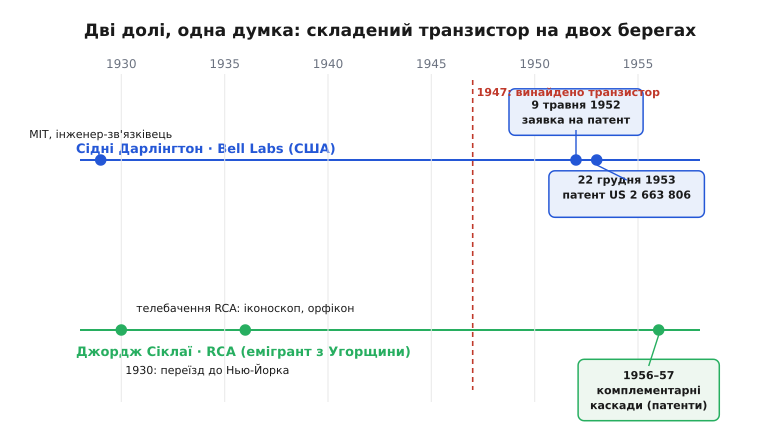

# 📜 Як два транзистори стали одним

Складений транзистор не з'явився з теорії. Він з'явився з прикрості: перші транзистори були ганебно слабкі, і двоє інженерів — кожен на своєму боці, незалежно один від одного — придумали той самий хитрий хід, щоб обійти цю слабкість. Один зробив це у вихідний, граючись із купкою зразків дорогою додому. Другий ішов до тієї ж думки з іншого предмета — телебачення — і з іншого континенту. Назви двох схем, які щодня вимовляють електронники, — це їхні прізвища: **Дарлінгтон** і **Сіклаї**. Варто знати, чиї це прізвища й чому історія склалася саме так.

## Чому взагалі знадобилося складати транзистори

Щоб відчути народження ідеї, треба згадати, яким був транзистор на старті. Його винайшли наприкінці 1947 року в [Bell Labs](root:hw-components/transistor-idea) — Джон Бардін, Волтер Браттейн і Вільям Шоклі (це усталений факт, за нього 1956 року дали Нобелівську премію з фізики). Та перші прилади були не тими акуратними кремнієвими крихтами, які ми знаємо тепер. Це були вередливі германієві зразки з мізерним, непевним підсиленням і великим розкидом від штуки до штуки.

Тут і криється корінь усієї історії. Транзистор корисний, бо множить струм бази: подаєш крихту в базу — з колектора тече в β разів більше. У сучасного приладу β — це сотні. А в тих перших? Подеколи **п'ять. Десять.** Іноді менше. З таким підсиленням транзистор майже не виправдовував себе як підсилювач: щоб розгойдати бодай помітне навантаження, у базу довелося б гнати майже стільки ж струму, скільки хотілося дістати на виході. Слабке джерело такого струму не давало — і вся ідея «керувати великим за допомогою малого» провисала.

Інженери опинилися перед задачею, що дратує своєю простотою: підсилення є, але його **замало**, а зробити окремий транзистор кращим — то роки металургії й технології. Чи можна було витиснути більше з того, що вже є на столі? Виявилося — можна. І відповідь у обох винахідників була по суті однакова: не чекати кращого приладу, а **поставити два наявні поспіль**, щоб їхні підсилення перемножилися. Один помножить на своє мале β, віддасть результат другому, той помножить ще раз — і добуток двох малих чисел дасть велике. П'ять на п'ять — уже двадцять п'ять. Десять на десять — сотня там, де поодинці не було й десятка.

> 🔧 **Навіщо це знати.** Це не музейна дрібниця, а взірець інженерного ходу, який лишився живим назавжди. Коли якогось ресурсу (підсилення, точності, чутливості) бракує, а покращити саму деталь дорого або неможливо — каскадуй. Постав однотипні ланки одна за одною й дай їхнім коефіцієнтам перемножитися. Дарлінгтон зробив це з транзисторами 1952 року; та сама думка працює в багатокаскадних підсилювачах, у множенні напруги, у ланцюжках обробки сигналу. Складений транзистор — наочний, майже дотиковий приклад цього принципу.


*Дві долі обабіч одного винаходу. Угорі — Сідні Дарлінгтон у Bell Labs: заявка на патент 9 травня 1952 року, виданий патент — 22 грудня 1953-го. Унизу — Джордж Сіклаї, що 1930 року приїхав до Нью-Йорка, роками будував телевізійні передавальні трубки в RCA й оформив свої комплементарні каскади на транзисторах у 1956–1957 роках. Спільний відлік для обох — винайдення транзистора 1947 року (червона пунктирна лінія).*

## Сідні Дарлінгтон: інженер-теоретик, що зібрав схему за вихідні

**Сідні Дарлінгтон** (англ. Sidney Darlington; народився 18 липня 1906 року в Піттсбурзі, помер 31 жовтня 1997-го) був не схемотехніком-практиком за фахом, а радше математиком електричних мереж. Освіта це підтверджує: фізика в Гарварді (1928, з відзнакою), електротехніка в MIT (1929), згодом докторат із фізики в Колумбійському університеті (1940). Усе життя він пропрацював у Bell Labs і прославився передусім **теорією синтезу фільтрів** — як із котушок, конденсаторів і опорів побудувати мережу із заданою частотною поведінкою. Його ім'я в цьому контексті — «синтез Дарлінгтона» — для радіоінженерів вагоміше за транзисторну пару. Під час війни він працював над системами наведення й радіолокацією; за це 1945 року отримав Президентську медаль Свободи, а пізніше — медаль Едісона IEEE (1975) і Почесну медаль IEEE (1981, за роботи, що привели до «цвірінькального» радару, англ. *chirp radar*). Це людина рівня перших імен інженерної науки XX століття, і транзисторна пара — лише один епізод довгої кар'єри.

Тим цікавіша історія самої пари, бо вона геть не схожа на сувору теорему. За широко переказуваною оповіддю (її розповідають історики техніки з посиланням на спогади самого Дарлінгтона; це **правдоподібний переказ**, а не дослівно засвідчений документ), усе сталося буденно. Дарлінгтонові до рук потрапило кілька свіжих транзисторів, і він **узяв їх із собою додому погратися**. Транзистори, як уже сказано, мали жалюгідне підсилення, і це його зачепило. За вихідні він перепробував на макеті різні з'єднання — і наткнувся на те, де емітер одного транзистора живить базу другого, а колектори обох з'єднані разом.

Найвимовніша деталь оповіді — у тому, **що саме його здивувало**. Дарлінгтон, кажуть, очікував, що від двох транзисторів підсилення **подвоїться**. А воно не подвоїлося — воно **перемножилося**. Два прилади з підсиленням близько п'яти кожен дали зв'язку з підсиленням близько **двадцяти п'яти**, а не десяти. Це і є вся суть складеного транзистора, схоплена за одну мить здивування: каскадування множить, а не додає. (Те, чому добуток β₁·β₂ виходить саме таким і як до нього домішуються менші доданки, докладно розібрано в самій статті про схему — тут важить історична суть, а не виведення формули.)

```
очікував:   β1 + β2  ≈ 5 + 5  = 10
вийшло:     β1 · β2  ≈ 5 · 5  = 25
```

Заявку на патент Дарлінгтон подав **9 травня 1952 року**, а **22 грудня 1953-го** дістав **патент США № 2 663 806** під назвою «Semiconductor Signal Translating Device» (англ. «напівпровідниковий пристрій для перетворення сигналу»); власник — Bell Telephone Laboratories, винахідник єдиний — Дарлінгтон. Це усталені, документально засвідчені дати й номер. Цікаво, що в самому патенті підсилення описано через **α** (коефіцієнт передачі струму емітера, близький до одиниці), а не через звичне нам β: у тексті прямо показано, що коли в кожної ланки α = 0.9, то в складеного приладу α = 0.99. Мова часу була трохи інша, та ідея — точнісінько та сама.

## Патент, що мало не став патентом на всі мікросхеми

У патенті Дарлінгтона ховається друга історія, ще цікавіша за саму пару. Він описав свою зв'язку не просто як два окремі транзистори, з'єднані дротом, а як **дві транзисторні структури на одному шматку напівпровідника зі спільною колекторною областю** посередині. Тобто два прилади, вирощені в одному тілі кристала.

Спинімося й оцінімо це. Ішов 1952 рік. До «офіційного» винайдення інтегральної схеми — Джек Кілбі в Texas Instruments, Роберт Нойс у Fairchild — лишалося ще **шість-сім років** (це усталені факти: Кілбі — 1958, Нойс — 1959). А в патенті Дарлінгтона вже стоїть чорним по білому думка, що кілька активних приладів можна виготовити **разом, в одному тілі напівпровідника**. Історики техніки називають це одним із найперших задокументованих натяків на монолітну інтеграцію — на те, що складні схеми можна будувати цілісно на одній підкладці.

І тут — найгостріший поворот усієї історії, що його теж переказують зі слів Дарлінгтона (статус: **широко цитований переказ-анекдот**, не первинний документ). Кажуть, патентний повірений Bell Labs наполіг, щоб на ілюстрації було показано **лише два транзистори** — не більше. Дарлінгтон згодом нарікав: якби повірений не обмежив малюнок двома приладами, то **кожна інтегральна схема у світі мусила б платити роялті Bell Labs**. Тобто формулювання, ширше за два транзистори, могло б накрити патентом саму ідею інтеграції — і змінити економіку всієї майбутньої електроніки. Через обережність юриста цього не сталося, і патент лишився патентом на скромну пару, а не на цілу епоху.

Чи справді це юридично спрацювало б так — питання спірне, і серйозні дослідники патентного права радше сумніваються. Але як **історичний анекдот про іронію винахідництва** ця оповідь безцінна: людина випадково записала в патент ідею величезної ваги — і та проминула повз неї через рядок обережності.

## Джордж Сіклаї: телевізійник з Будапешта, що прийшов до тієї ж думки з іншого боку

Поки Дарлінгтон у Bell Labs гойдав слабкі транзистори, інший інженер ішов до спорідненої ідеї зовсім іншою стежкою. **Джордж Кліффорд Сіклаї** (угор. George Clifford Sziklai; народився 9 липня 1909 року в Будапешті, помер 9 вересня 1998-го в Лос-Альтос-Гіллз, Каліфорнія) був угорцем за походженням і місцем народження, що став американським інженером. Тут варто бути точним із його ідентичністю: він **угорсько-американський** інженер — народжений і освічений у Європі, але вся його зріла кар'єра й винаходи припали на США.

Невеличке мовне зауваження, бо прізвище раз у раз вимовляють хибно. Угорське «sz» читається як простий звук **с** (а не «ш», як спокушає слов'янське око): тому правильніше **Сіклаї**, а не «Шиклаї». Корінь промовистий — угорське *szikla* означає **скелю**; буквально прізвище — щось на кшталт «скельний». Запам'ятати легко: інженер на ім'я «Скеля», що дав електроніці одну з найтриваліших схем.

Освіту Сіклаї здобув в Європі — Будапештський університет і Мюнхенська технічна вища школа, — а **1930 року емігрував до Нью-Йорка**. Далі — десятиліття в осерді американської високої техніки: робота в RCA (Radio Corporation of America), згодом у Westinghouse, а від 1967-го — у дослідній лабораторії Lockheed у Пало-Альто. За життя він набрав близько **160 патентів**. Та головна його царина — не транзистори, а **телебачення**. Сіклаї — один із піонерів передавальних телевізійних трубок: його ім'я пов'язують зі створенням перших камер на трубці-«орфіконі» (англ. *image orthicon*) і з ранніми роботами з кольорового телебачення. Тобто, як і Дарлінгтон, у транзисторну схемотехніку він прийшов збоку, маючи за плечима зовсім інший фах.

Саме цей телевізійний досвід, схоже, і підвів його до власної версії складеного транзистора. У підсилювачах для телевізійної техніки гостро стояла потреба в **лінійних, симетричних вихідних каскадах**. Складаючи транзистори задля підсилення, Сіклаї пішов не Дарлінгтоновим шляхом (два однакові транзистори), а взяв **різнотипну пару** — один npn, другий pnp — і з'єднав їх так, що вхідний транзистор своїм колекторним струмом керує базою вихідного. Підсилення виходить так само добутком β₁·β₂, але на вході — **лише один перехід база–емітер**, тобто звичні ≈0.7 В замість Дарлінгтонових ≈1.4 В. Цю зв'язку звуть **парою Сіклаї**, а ще — **комплементарною** (лат. *complementum* — доповнення), **комплементарним Дарлінгтоном** або **комплементарною парою зі зворотним зв'язком** (англ. *complementary feedback pair*). Свої комплементарні каскади на транзисторах Сіклаї оформив патентами в **1956–1957 роках** (наприклад, US 2 762 870 і US 2 791 644 на двотактні підсилювачі з транзисторами протилежного типу) — кількома роками пізніше за Дарлінгтонів патент. Дати патентів — усталені; точну ж дату першого задуму, як це часто буває, документи не фіксують.

## Дарлінгтон проти Сіклаї: що саме розрізняти

Дві схеми так часто згадують поруч, що їх плутають. Розрізнити їх просто, якщо триматися суті — а суть історична: **це два різні розв'язки однієї задачі, від двох різних людей**.

**Дарлінгтон** бере **два однотипні** транзистори (обидва npn або обидва pnp). Сигнал на вході долає **два** переходи база–емітер поспіль, тож щоб відкрити зв'язку, треба близько **1.4 В**. Винахідник — Сідні Дарлінгтон, Bell Labs, патент 1953 року.

**Сіклаї** бере **різнотипну** пару (npn + pnp). На вході — **один** перехід, тож відкривається вона звичними **≈0.7 В**. Внутрішня поведінка інша: завдяки зворотному зв'язку всередині пара тримає вхідну напругу стабільніше й лінійніше — саме те, що цінне у вихідних каскадах звуку. Винахідник — Джордж Сіклаї, патенти середини 1950-х.

```
Дарлінгтон:  npn + npn   →  2 переходи на вході  →  ≈1.4 В
Сіклаї:      npn + pnp   →  1 перехід на вході   →  ≈0.7 В
обидві:      підсилення  ≈  β1 · β2  (каскад множить)
```

Спільне в них — головне: ідея **каскадувати два прилади, щоб підсилення перемножилося**. Різне — спосіб з'єднання й ціна на вході. І ще одне варто сказати чесно про атрибуцію. Сама думка «з'єднати два транзистори задля більшого підсилення» носилася в повітрі тих років — транзистор був новим, слабким і всім муляв однаково; різні інженери в різних лабораторіях мацали схожі ходи. Тому коректно говорити не про «єдиного винахідника складеного транзистора», а про **дві конкретні, задокументовані патентами схеми**: Дарлінгтонову однотипну (1952–53) і Сіклаєву комплементарну (середина 1950-х). Імена закріпилися за схемами не тому, що ці двоє були єдиними, хто думав у цей бік, а тому, що саме вони **оформили й зафіксували** свої варіанти — а в техніці, як і деінде, лишається той, хто довів ідею до завершеного, перевіреного, записаного вигляду.

Сьогодні обидві схеми досі живуть пліч-о-пліч, і подеколи їх навіть **поєднують** в одному пристрої: у вихідному каскаді підсилювача потужності верхнє плече роблять на класичному Дарлінгтоні, а нижнє — на парі Сіклаї, щоб обидва поводилися симетрично. Два інженери, дві країни народження, два патенти — і дотепер дві назви, які вимовляють разом, навіть не згадуючи, що то були живі люди: математик мереж із Піттсбурга, який зібрав схему за вихідні, і телевізійник із Будапешта, який прийшов до неї з боку кольорового зображення.
