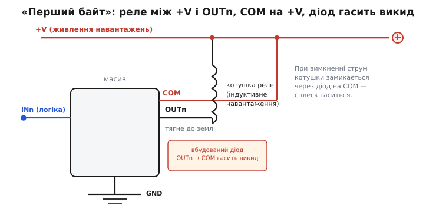

# ⚙️ Драйвер реле на масиві пар Дарлінгтона: схема, код, розрахунок

Ніжка мікроконтролера не ввімкне реле напряму: котушці треба сотні міліампер, а ніжка чесно віддає одиниці. Класичний розв'язок — **масив пар Дарлінгтона**: вісім складених ключів ([пар Дарлінгтона](topic:hw-analog/darlington-pair)) в одному корпусі, кожним із яких порядкує одна логічна ніжка. Тут ми пройдемо весь шлях на найтиповішому застосуванні — драйвері реле: як завести котушку, який код ворушить каналами і як числом переконатися, що звичайної логічної ніжки справді вистачить, а мікросхема лишиться холодною. Розпіновку, внутрішню будову каналу й службові ноги GND/COM винесено в окрему [довідку з підключення](topic:hw-analog/darlington-pair/api-darlington-array.md) — тут беремо їх як відоме й збираємо живий драйвер.

## Перший байт

Найкраще все вкладається в голові на найтиповішому застосуванні — **керуванні реле**. Це класичний «перший байт» масиву: те, з чого варто почати, щоб відчути всі три його особливі вузли воднораз.


*Найтиповіше підключення каналу — драйвер реле. Котушку вмикають між плюсом живлення й виходом OUTn; масив, відкриваючись, притягує нижній кінець котушки до землі, і реле спрацьовує. COM заведено на той самий плюс, тож вбудований діод стоїть напоготові. Коли канал закривається, струм котушки, що не може урватися миттєво, замикається через цей діод на COM — небезпечний сплеск напруги гаситься, транзистор цілий.*

Простежмо весь шлях думки.

**Котушку реле вішаємо між плюсом і виходом.** Верхній кінець котушки — на плюс живлення (скажімо, +12 В), нижній — на ногу OUTn масиву. Поки канал закритий, його вихід «висить у повітрі» — струму нема, реле відпущене.

**Подаємо одиницю на вхід.** Ніжка контролера видає високий рівень на INn. Канал відкривається, його вихід притягується до землі. Тепер котушка опинилася під повною напругою живлення (плюс зверху, земля знизу через відкритий канал), крізь неї пішов струм — реле **спрацювало**.

**COM уже на плюсі — діод напоготові.** Ми завчасно з'єднали COM із тим самим плюсом +12 В. Поки канал відкритий, гасильний діод закритий зворотним зміщенням і ніяк не заважає — анод діода (на виході, близько до землі) нижчий за катод (на COM, +12 В).

**Знімаємо одиницю — і ось де працює діод.** Контролер прибирає сигнал, канал закривається, його вихід силкується «відпустити» струм котушки. Але котушка так просто струм не віддає: за мить до того крізь неї текли, скажімо, 50 мА, і вона жене їх далі, заганяючи напругу на виході вгору. Без діода ця напруга підскочила б на сотні вольтів і пробила б транзистор. Та діод дає струмові вихід: він замикає коло **котушка → діод → COM → назад у котушку**, струм спадає плавно, а напруга на виході не перевищує плюс живлення більш ніж на падіння на діоді (≈0.7 В). Транзистор цілий, реле спокійно відпускає.

> 🔧 **Навіщо це.** Цей цикл — увімкнув, потримав, вимкнув, погасив викид — і є вся робота масиву. Опанувавши його на одному реле, ти керуєш будь-якою кількістю: вісім реле — вісім таких самих кіл, по одному на канал, зі спільними GND і COM. Та сама логіка тримає й рядки світлодіодної матриці, і фази крокового двигуна — змінюється лише навантаження на виходах, а спосіб підключення лишається тим самим.

## Керуємо каналами з коду

З боку контролера вся ця силова машинерія зводиться до однієї простої дії: **виставити на виводі логічну одиницю**, щоб канал відкрився, і нуль, щоб закрився. Ніякої аналогової тонкощі — масив узяв її на себе. Тож фірмвар драйвера реле — це керування вісьмома звичайними виводами GPIO, кожен із яких веде до свого входу INk. Оскільки масив стіковий, полярність пряма: одиниця на вході вмикає реле, нуль — відпускає.

Спільне для будь-якого контролера тут таке: список із восьми виводів, налаштування їх на вихід із початковим нулем і дві операції — виставити рівень і зняти. Різняться лише імена: `pinMode`/`digitalWrite` у скетчі Arduino, `gpio_config`/`gpio_set_level` в ESP-IDF, `HAL_GPIO_Init`/`HAL_GPIO_WritePin` у STM32 HAL.

:::tabs
```arduino
// Вісім входів масиву (IN1..IN8) на восьми виводах контролера.
// Масив — стік: логічна 1 на INk відкриває канал і притягує OUTk до землі,
// тож реле k спрацьовує. Логічний 0 — канал закритий, реле відпущене.
const uint8_t IN_PIN[8] = {2, 3, 4, 5, 6, 7, 8, 9};

void setup() {
  for (uint8_t ch = 0; ch < 8; ch++) {
    pinMode(IN_PIN[ch], OUTPUT);
    digitalWrite(IN_PIN[ch], LOW);      // старт: усі канали закриті, реле відпущені
  }
}

void relayOn(uint8_t ch)  { digitalWrite(IN_PIN[ch], HIGH); }  // увімкнути реле ch
void relayOff(uint8_t ch) { digitalWrite(IN_PIN[ch], LOW);  }  // відпустити реле ch

// Виставити одразу весь банк за бітовою маскою: біт k = 1 → реле k увімкнено.
// Один байт задає стан восьми реле воднораз.
void relayBank(uint8_t mask) {
  for (uint8_t ch = 0; ch < 8; ch++)
    digitalWrite(IN_PIN[ch], (mask >> ch) & 1 ? HIGH : LOW);
}

void loop() {
  relayOn(0);              // клацнули перше реле
  delay(500);
  relayOff(0);
  delay(500);
  relayBank(0b10101010);   // увімкнули реле 1, 3, 5, 7 воднораз
  delay(500);
  relayBank(0x00);         // усі відпустили
  delay(500);
}
```
```esp-idf
#include "driver/gpio.h"
#include "freertos/FreeRTOS.h"
#include "freertos/task.h"

// Вісім входів масиву (IN1..IN8) на восьми виводах контролера.
// Масив — стік: логічна 1 на INk відкриває канал і притягує OUTk до землі.
static const gpio_num_t IN_PIN[8] = {
    GPIO_NUM_4,  GPIO_NUM_5,  GPIO_NUM_16, GPIO_NUM_17,
    GPIO_NUM_18, GPIO_NUM_19, GPIO_NUM_21, GPIO_NUM_22,
};

static void relays_init(void) {
    uint64_t mask = 0;
    for (int ch = 0; ch < 8; ch++) mask |= 1ULL << IN_PIN[ch];

    gpio_config_t cfg = {
        .pin_bit_mask = mask,
        .mode         = GPIO_MODE_OUTPUT,
        .pull_up_en   = GPIO_PULLUP_DISABLE,
        .pull_down_en = GPIO_PULLDOWN_DISABLE,
        .intr_type    = GPIO_INTR_DISABLE,
    };
    ESP_ERROR_CHECK(gpio_config(&cfg));

    for (int ch = 0; ch < 8; ch++)
        gpio_set_level(IN_PIN[ch], 0);      // старт: усі канали закриті, реле відпущені
}

static void relay_set(int ch, int on) { gpio_set_level(IN_PIN[ch], on ? 1 : 0); }

// Виставити одразу весь банк за бітовою маскою: біт k = 1 → реле k увімкнено.
static void relay_bank(uint8_t mask) {
    for (int ch = 0; ch < 8; ch++)
        gpio_set_level(IN_PIN[ch], (mask >> ch) & 1);
}

void app_main(void) {
    relays_init();
    for (;;) {
        relay_set(0, 1);                    // клацнули перше реле
        vTaskDelay(pdMS_TO_TICKS(500));
        relay_set(0, 0);
        vTaskDelay(pdMS_TO_TICKS(500));
        relay_bank(0b10101010);             // увімкнули реле 1, 3, 5, 7 воднораз
        vTaskDelay(pdMS_TO_TICKS(500));
        relay_bank(0x00);                   // усі відпустили
        vTaskDelay(pdMS_TO_TICKS(500));
    }
}
```
```stm32
#include "stm32f4xx_hal.h"

// Вісім входів масиву (IN1..IN8) на одному порту: PB0..PB7.
// Масив — стік: логічна 1 на INk відкриває канал і притягує OUTk до землі.
#define IN_PORT GPIOB
static const uint16_t IN_PIN[8] = {
    GPIO_PIN_0, GPIO_PIN_1, GPIO_PIN_2, GPIO_PIN_3,
    GPIO_PIN_4, GPIO_PIN_5, GPIO_PIN_6, GPIO_PIN_7,
};

static void Relays_Init(void) {
    __HAL_RCC_GPIOB_CLK_ENABLE();

    GPIO_InitTypeDef gpio = {0};
    gpio.Mode  = GPIO_MODE_OUTPUT_PP;       // двотактний вихід: сам жене й 0, і 1
    gpio.Pull  = GPIO_NOPULL;
    gpio.Speed = GPIO_SPEED_FREQ_LOW;       // реле — повільне навантаження
    for (uint8_t ch = 0; ch < 8; ch++) {
        gpio.Pin = IN_PIN[ch];
        HAL_GPIO_Init(IN_PORT, &gpio);
        HAL_GPIO_WritePin(IN_PORT, IN_PIN[ch], GPIO_PIN_RESET);  // старт: усі закриті
    }
}

static void Relay_Set(uint8_t ch, uint8_t on) {
    HAL_GPIO_WritePin(IN_PORT, IN_PIN[ch], on ? GPIO_PIN_SET : GPIO_PIN_RESET);
}

// Виставити одразу весь банк за бітовою маскою: біт k = 1 → реле k увімкнено.
static void Relay_Bank(uint8_t mask) {
    for (uint8_t ch = 0; ch < 8; ch++)
        Relay_Set(ch, (mask >> ch) & 1);
}

int main(void) {
    HAL_Init();
    SystemClock_Config();
    Relays_Init();
    for (;;) {
        Relay_Set(0, 1);            // клацнули перше реле
        HAL_Delay(500);
        Relay_Set(0, 0);
        HAL_Delay(500);
        Relay_Bank(0b10101010);     // увімкнули реле 1, 3, 5, 7 воднораз
        HAL_Delay(500);
        Relay_Bank(0x00);           // усі відпустили
        HAL_Delay(500);
    }
}
```
:::

Уся розумна частина — не в коді, а в тому, що вже зроблено руками: котушки заведено між плюсом і виходами, а COM — на плюс живлення. Код лише клацає виводами; масив із його вбудованими резисторами й діодами перетворює це клацання на впевнене керування вісьмома потужними навантаженнями.

## Worked-приклад: чи вмикається реле від ніжки контролера

**Маємо реле з котушкою на 12 В і опором 240 Ω; керуємо каналом масиву від ніжки контролера з рівнем 5 В. Питання: чи дає ніжка досить, щоб канал упевнено провів струм котушки, і яка напруга лишається на самому каналі?**

Спершу — який струм треба провести:
```
Iкот = Uживл / Rкот = 12 / 240 = 50 мА
```

Тепер — чи дасть ніжка достатній струм у базу. Вхід заходить крізь вбудований резистор ≈2.7 кΩ, на двох переходах падає ≈1.4 В:
```
Ib = (5 − 1.4) / 2700 ≈ 1.33 мА
```
Складений транзистор множить це на своє β (тисячі). Навіть якщо взяти скромне β ≈ 1000, потенційно канал міг би провести 1.33 А — а нам треба лише 50 мА. Запас **двадцятикратний**: канал відкриється глибоко в насичення, ніжці контролера це під силу залюбки.

Рівень 5 В тут не обов'язковий: із поширенішою сьогодні логікою 3.3 В (STM32, ESP32) той самий вхід дає Ib = (3.3 − 1.4)/2700 ≈ 0.70 мА, тобто потенційні 0.7 А проти потрібних 50 мА — запас усе ще чотирнадцятикратний.

Лишилося оцінити **залишкову напругу** на відкритому каналі — вона визначить нагрів. Для складеного транзистора при 50 мА вона невелика, близько 0.9 В (точне число беруть із характеристики «напруга насичення проти струму» в довіднику). Звідси потужність, що гріє цей канал:
```
Pканал = Uост · Iкот = 0.9 · 0.050 = 0.045 Вт = 45 мВт
```
Сорок п'ять міліват на канал — дрібниця, корпус навіть не теплий. Реле вмикається з величезним запасом, нагрів незначний. Саме тому масив — природний вибір для драйвера реле: одна ніжка логіки, жодної зовнішньої обв'язки, надійне спрацювання.

## Типові граблі

Масив прощає багато, але має кілька пасток, на яких спотикаються чи не всі новачки. Кожна випливає прямо з його будови.

**COM забули завести на плюс — реле «вбивають» масив.** Найпоширеніша й найприкріша помилка. Гасильні діоди вже всередині, та вони **марні, поки COM висить у повітрі**: катодам нема куди віддати струм викиду. Людина чіпляє реле, усе працює… кілька днів, а тоді канал пробиває накопиченими сплесками. Лікування одне: **завжди** ведіть COM на плюс живлення навантажень, щойно серед них є бодай одне індуктивне. Це безкоштовно (нога вже є) і рятує мікросхему.

**Плутають стік із джерелом — вішають навантаження не туди.** Масив **притягує до землі**, а не подає плюс. Хто за звичкою чіпляє навантаження між виходом і землею (мовляв, «вихід подасть плюс»), не отримує нічого: відкритий канал лише замикає вихід на землю, обидва кінці навантаження опиняються на нулі, струму нема. Навантаження мусить висіти **між плюсом і виходом**. Якщо за схемою треба саме подавати плюс (спільний мінус у навантажень, високе плече) — звичайний стіковий масив не годиться, потрібен його дзеркальний родич, **драйвер-джерело** (про нього — у [розділі про різновиди класу](topic:hw-analog/darlington-pair/api-darlington-array.md)).

**Залишкова напруга й нагрів — стеля сильнішого струму.** Складений транзистор у насиченні тримає на собі помітну напругу — типово до **1.1–1.6 В** при струмах близько половини ампера (значно більше, ніж 0.2 В одиночного ключа чи майже нуль у польового). На цій напрузі виділяється тепло. Один канал на повних 0.5 А розсіює:
```
P = 1.3 · 0.5 ≈ 0.65 Вт
```
Це вже відчутно, а корпус мікросхеми може віддати лише обмежену потужність. Тому **не можна гнати всі канали на максимумі воднораз**: вісім каналів по 0.5 А дали б близько 5 Вт у крихітному корпусі — він перегріється й вимкнеться (або згорить). Реальна стеля **сумарного** струму нижча за «8 × максимум одного каналу», і вона **спадає з нагріванням** (англ. *derating*): що гарячіше довкола, то менше дозволено. Це пряма ціна того, що канали — біполярні складені транзистори з їхньою залишковою напругою.

> 🔧 **Навіщо це.** Перш ніж навантажити всі канали, прикинь сумарну потужність: склади добутки «залишкова напруга × струм» по всіх увімкнених воднораз каналах і звір зі стелею розсіювання корпусу при твоїй температурі. Як виходить за межу — або зменши струми, або розкидай навантаження в часі (не вмикай усе разом), або візьми потужніший корпус чи польову збірку. Цей розрахунок — різниця між пристроєм, що працює роками, і таким, що вимикається від перегріву в спеку.

**Немає захисту від короткого замикання.** Канал — простий складений транзистор без жодної логіки самозбереження. Замкне вихід на плюс або перевантаж навантаженням понад межу — канал просто згорить, без попередження. Масив розрахований на **відоме, обмежене** навантаження (реле, двигун, матриця з порахованим струмом), а не на роботу в умовах можливого короткого. Де таке можливе (виходи на роз'єм, до якого має доступ користувач), потрібен зовнішній запобіжник чи розумніший драйвер із вбудованим обмеженням струму.

**Повільний і не для високих частот.** Складений транзистор [млявий на закриванні](topic:hw-analog/darlington-pair) — Q1 неохоче витягає заряд із бази Q2. Для реле, ламп, повільного керування двигуном це байдуже. Але **широтно-імпульсну модуляцію** (англ. *PWM*) на десятки кілогерц — наприклад, плавне яскравлення світлодіодів або керування швидкістю двигуна — масив тягне погано: фронти розмиваються, на перемиканнях росте нагрів. Для швидкого ключування беруть польові збірки, а не дарлінгтонові.
