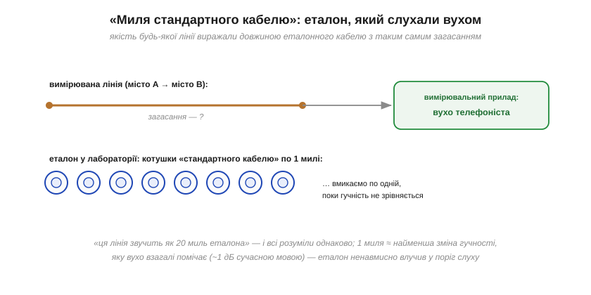
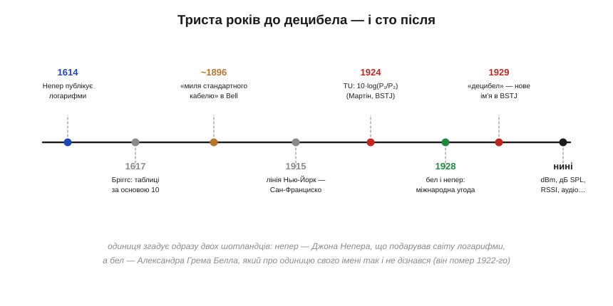

# 📜 Бел і «миля стандартного кабелю»: як телефоністи подарували світу децибел

Звідки в найуживанішої одиниці електроніки така дивна біографія? Це історія про еталон, яким була **котушка дроту в шафі**, про вимірювальний прилад, яким працювало **людське вухо**, про одиницю, що з'явилася на світ безіменною, — і про те, як вона дістала ім'я людини, котра про це вже ніколи не дізналася. А почати доведеться, як не дивно, за триста років до телефону.

## Передісторія: шотландець, що перетворив множення на додавання

У 1614 році шотландський лерд Джон Непер (*John Napier*) опублікував працю з пишною назвою «Опис дивовижного канону логарифмів» — підсумок двадцяти років обчислень, зроблених заради однієї мети: позбавити астрономів і мореплавців найpowільнішої частини їхньої роботи, перемноження багатоцифрових чисел. Ідея — та сама, що працює в самому децибелі й у [вставці про логарифми](topic:math-analysis/logarithms): кожному числу поставити у відповідність його «порядок», і тоді добуток чисел шукається **додаванням** порядків. Уже за три роки Генрі Бріггс переробив таблиці під зручну основу 10, а ще за десятиліття з'явилася логарифмічна лінійка — дві шкали, що додають відрізки і тим самим множать числа. Триста наступних років уся інженерія рахувала саме так; але **одиниці вимірювання**, всередині якої жив би логарифм, ще не існувало. Її створить не математика, а мідний дріт.

## 1890-ті: лінія, яку міряли вухом

Телефонія кінця XIX століття мала проблему, з якою не стикалася жодна техніка до неї: її «продуктом» була **розбірливість людської мови**, а головним ворогом — загасання сигналу в довгих мідних парах (енергія дорогою [грілася на опорі дроту](topic:ph-condensed/resistance) й до співрозмовника не доходила). Інженерам потрібно було якось виражати числом, *наскільки* лінія глушить розмову — а вимірювальних приладів для слабких змінних струмів майже не було. Вихід знайшли геніально простий і дуже вікторіанський: **порівнювати з еталоном на слух**.

Невдовзі після 1896 року в Bell System узвичаїлася одиниця з чудовою назвою — **«миля стандартного кабелю»** (*mile of standard cable*, MSC). «Стандартним кабелем» була цілком конкретна конструкція — мідна пара визначеного перерізу й ємності, типова для міських ліній того часу; її намотували на котушки відомої довжини й тримали в лабораторії як гирі на терезах:


*Процедура вимірювання: слухач перемикається між досліджуваною лінією та еталонним кабелем, додаючи котушку за котушкою, поки гучність не зрівняється. Результат — «ця лінія загашує, як N миль стандартного кабелю». Прилад — вухо; еталон — дріт.*

Скільки б скепсису не викликав «прилад-вухо», система працювала десятиліттями: вона була відтворюваною (стандартний кабель у Бостоні й Чикаго звучав однаково), наочною (кожен телефоніст розумів, що таке «двадцять миль кабелю») — і мала одну приховану чесноту, яку гідно оцінили вже заднім числом. Одна миля стандартного кабелю на опорній частоті розмови послаблювала сигнал **приблизно на найменшу величину, яку людське вухо взагалі здатне помітити** — близько одного сучасного децибела. Еталон ненавмисно влучив у поріг розрізнення слуху: «одна миля» була не лише одиницею довжини дроту, а й природним «квантом гучності».

Наука, до речі, уже знала, чому так виходить. Ще 1834 року фізіолог Ернст Вебер виміряв, що людина помічає не абсолютний приріст стимулу, а **відносний**: щоб відчути різницю, до важкого тягаря треба докласти більше, ніж до легкого, — але та сама *частка*. А 1860 року Густав Фехнер оформив це в закон: відчуття росте приблизно як **логарифм** стимулу. Телефоністи навряд чи гортали трактати з психофізики — вони просто щодня слухали лінії і дійшли того самого висновку власними вухами: рівні кроки гучності — це рівні множники потужності. Одиниця, народжена практикою, сама собою вийшла логарифмічною — та сама спадковість, що пов'язує готовий децибел із влаштуванням слуху, тільки побачена з боку її витоків.

Варто сказати і про слово «стандартний» в назві еталона — за ним стояла окрема дисципліна. Котушки еталонного кабелю мусили мати визначені опір та ємність на милю; їх перевіряли, тримали в лабораторних умовах і відтворювали на обох узбережжях. По суті, Bell System утримувала **метрологічну службу гучності** — як національні палати мір тримають еталонний кілограм. Різниця лише в тому, що останньою ланкою вимірювального тракту була не стрілка, а слухач, тож процедуру будували на порівнянні «голосніше/тихіше» — судження, у якому вухо напрочуд стабільне, на відміну від оцінки «наскільки голосніше».

## Тріщини в еталоні

Та що далі росла мережа, то більше «миля» муляла. По-перше, вона була **частотно-залежною**: реальний кабель — це розподілений [RC-фільтр](topic:hw-analog/rc-low-pass), тож одна миля глушила 300 Гц інакше, ніж 3 кГц; одиниця мала сенс лише на обумовленій опорній частоті близько 800 Гц. По-друге, техніка переросла еталон: з'явилися пупінізовані лінії, нові типи кабелів і — головне — лампові **підсилювачі** ([історія Боде](topic:hw-analog/frequency-response/hist-bode.md) розповідає, як 1915 року вони простягнули розмову від Нью-Йорка до Сан-Франциско). Підсилювач *додає* «від'ємні милі»; коефіцієнти трактів треба було перемножувати, порівнювати, передавати між лабораторіями різних країн — а одиниця досі тягла за собою шматок конкретного американського дроту з конкретною частотою. Інженерія виросла з еталона, як дитина зі взуття.

## 1924: одиниця без дроту

Розв'язку оформив інженер Bell System Вільям Г. Мартін (*W. H. Martin*) у статті «The Transmission Unit and Telephone Transmission Reference Systems» у липневому числі Bell System Technical Journal 1924 року — тому самому журналі, де згодом вийде і праця Боде. Нову одиницю назвали підкреслено скромно: **TU**, *transmission unit*, «одиниця передачі». Її означення вже не згадувало ні дроту, ні частоти — лише відношення потужностей і логарифм:

```
N [TU] = 10 · log₁₀(P₁/P₂)
```

— рівно та формула децибела, якою користуються й досі. Зверніть увагу, що саме змінилося: одиниця відв'язалася і від дроту, і від частоти, і — не менш важливо — від вуха. Загасання тепер міряли електричні прилади, а слухач лишився тим, ким і мав бути, — споживачем результату. Друга половина назви статті Мартіна, «...and Telephone Transmission Reference Systems», довершувала реформу: разом з одиницею Bell System упорядкувала й **опорні системи** — еталонні тракти, відносно яких рахували якість ліній. Одиниця-відношення плюс домовлена опора — упізнаєте конструкцію dBm? Вона народилася саме тут.

А тепер найкрасивіша деталь, у якій видно інженерну культуру Bell Labs. Множник «10» підібрали не з математичних міркувань, а з **сумісності**: нова TU майже точно збігалася зі старою милею (1 MSC ≈ 1.06 TU на опорній частоті). Тисячі записаних у журналах і паспортах ліній чисел лишилися практично чинними; ніхто не мусив перевчати інтуїцію «одна одиниця ≈ ледь чутна зміна». Стара одиниця вийшла з ужитку так м'яко, що мережа цього майже не помітила — підміна еталона без зупинки виробництва.

## 1928–1929: ім'я для одиниці

Лишалося охрестити. Наприкінці 1920-х телефонні мережі вже зшивали континенти, і питання одиниць вийшло на міжнародний рівень — ним займався європейський консультативний комітет з телефонії (CCIF, попередник нинішнього ITU-T), куди Bell System запросили як гостей. У 1928 році дійшли згоди: базовій логарифмічній одиниці (десять TU — десятковий логарифм відношення потужностей) дати ім'я **бел** — на честь Александра Грема Белла, народженого в Единбурзі вчителя глухих, чиє ім'я носила й сама телефонна компанія. Сам Белл про це вже не дізнався: він помер 1922 року, за шість років до хрестин одиниці. Бел виявився завеликим для щоденної роботи — і робочою одиницею стала його десята частина, **децибел**, який збігся зі старою TU один в один. У січні 1929 року Мартін поставив крапку статтею в BSTJ із промовистою назвою «Decibel — The Name for the Transmission Unit», і слово, яке ви бачите в кожному даташиті, офіційно народилося:


*Від таблиць Непера до сучасних dBm — три століття розгону і п'ять років оформлення: миля кабелю (~1896) → TU (1924) → бел і непер (1928) → децибел (1929). Далі одиниця вже не змінювалася — лише розповзалася по всіх галузях техніки.*

## Чому саме десята частина

На перший погляд дивно: навіщо вводити «бел», щоб одразу користуватися його десятою часткою? Але подивіться на числа. Весь робочий діапазон телефонії тих років — від найгучнішого допустимого сигналу до найтихішого розбірливого — умістився б у якихось 3–4 бели: одиниця-велетень, якою довелося б писати «загасання 2.3 бела», втрачаючи дробами всю зручність усної лічби. Децибел же має розмір **людського кванта**: одна одиниця ≈ ледь помітна зміна гучності, цілі числа без дробів покривають усе, з чим стикається інженер. Це загальний закон вдалих одиниць: вони співмірні з найменшою *значущою* зміною вимірюваного — як цент у грошах чи міліметр у столярці. Тож «деци-» тут не математична примха, а ергономіка: бел — для означення, децибел — для роботи.

Є в цій історії і застереження, яке чесно згадати. Формально означений через потужності, децибел майже одразу почали застосовувати до напруг (звідки й коефіцієнт 20·log замість 10·log), до звукових тисків, до чого завгодно — і подеколи з плутаниною між 10·log і 20·log, яка дожила до наших днів. Метрологи досі бурчать, що децибел — «не зовсім одиниця» в строгому сенсі СІ: він безрозмірний, контекстозалежний і вимагає вказувати опору. Усе так. І попри це він пережив усіх своїх критиків — бо щоденна зручність у техніці важить більше за формальну бездоганність.

## Європейський близнюк: непер

Та сама міжнародна угода 1928 року вузаконила і **другу** логарифмічну одиницю — бо континентальна Європа рахувала інакше. Її інженерна школа виражала загасання через **натуральний** логарифм відношення *амплітуд* (напруг чи струмів), а не десятковий логарифм потужностей — у теорії довгих ліній так природніше, бо сигнал у кабелі гасне за експонентою з основою e ([вставка про логарифми](topic:math-analysis/logarithms): процеси заряду-розряду — теж парафія ln). Одиницю назвали **непер** (Np) — на честь того самого Джона Непера, з якого ми починали. Переводяться вони одна в одну постійним множником: 1 Np = 20·log₁₀(e) ≈ **8.686 дБ**. Вийшла гарна історична симетрія: обидві логарифмічні одиниці світу носять імена шотландців — математика XVII століття і викладача глухих століття XIX. Децибел переміг у щоденному вжитку (його арифметика «3–6–20» зручніша для усної лічби), але непер не зник: він і досі офіційно дозволений поруч із децибелом у міжнародних стандартах і живе в теоретичних розрахунках ліній та хвилеводів.

## Спадок: від телефонної шафи до Wi-Fi у кишені

Далі почалася експансія. Радіоінженери взяли децибел і додали йому **опорну точку** — так з'явився dBm: нуль на одному міліваті. Деталь, що видає походження: міливат той історично рахували на навантаженні **600 Ом** — стандартному імпедансі телефонної лінії; аудіотехніка дотепер міряє рівні «на 600 Ом», навіть якщо жодного телефонного дроту поруч давно нема. Наприкінці 1930-х телефоністи разом із радіомовниками подарували світу ще одного нащадка — **VU-метр** (*volume unit*), той самий стрілочний індикатор рівня з дБ-шкалою, що досі прикрашає мікшерні пульти і обкладинки музичних застосунків: спроба дати децибелу офіційне «обличчя» для сигналу, який весь час змінюється, — людського голосу й музики.

А найповніше спадок розкрився там, де відстані найбільші, — у радіозв'язку. **Бюджет радіолінії** — головний розрахунок будь-якого каналу від супутника до Bluetooth-навушника — це просто довгий стовпчик децибелів: потужність передавача в dBm, плюс підсилення антен у дБ, мінус втрати траси (сотні дБ для космосу), мінус запаси на дощ і завмирання — і відповідь порівнюється з чутливістю приймача в тих самих dBm. Перемноження дванадцяти порядків величини, яке в «разах» не вмістилося б у голову, у децибелах робиться олівцем на полях — рівно та суперсила «добуток → сума», заради якої одиницю і створили. Акустики тим часом означили дБ SPL від порога чутності — і шкала гучності, з якою ви зустрічаєтеся в кожній суперечці про шумних сусідів, теж виявилася внучкою телефонної шафи з котушками. Ваш ноутбук показує рівень Wi-Fi у дБм, аудіоредактор малює доріжки в дБ, даташит підсилювача задає [смугу точкою −3 дБ](topic:hw-analog/bandwidth-3db) — сто років по тому весь вимірювальний світ розмовляє мовою, яку телефоністи зібрали з логарифмів Непера, мідного дроту і власних вух.

Наостанок — думка, заради якої цю історію варто було розповідати. Децибел ніхто не «винаходив» за письмовим столом: одиницю **виростили** з виробничої практики, а потім лише акуратно формалізували. Вухо, що порівнює гучності відношеннями; еталонна котушка, що випадково збіглася з порогом слуху; множник 10, дібраний заради сумісності зі старими записами, — кожен крок диктувала практика, і саме тому результат вийшов таким живучим. Це той самий урок, що й в [історії Боде](topic:hw-analog/frequency-response/hist-bode.md): найдовше живуть не найвитонченіші ідеї, а найзручніші у щоденній роботі. Інструменти переживають теорії — а інколи, як бачимо, і власних хрещених батьків.
