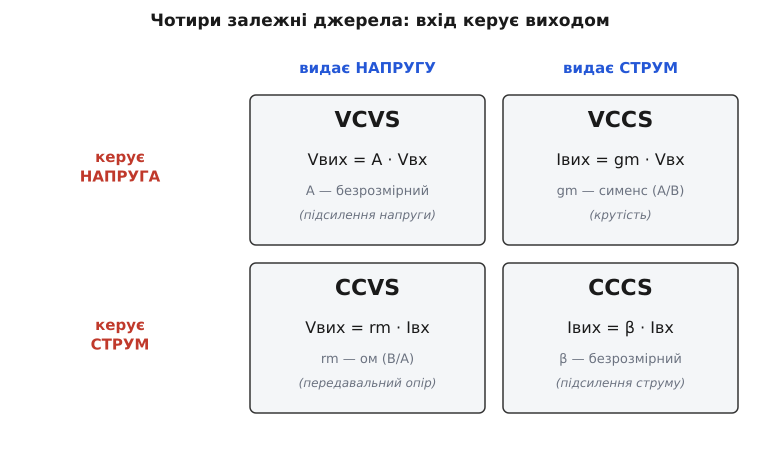
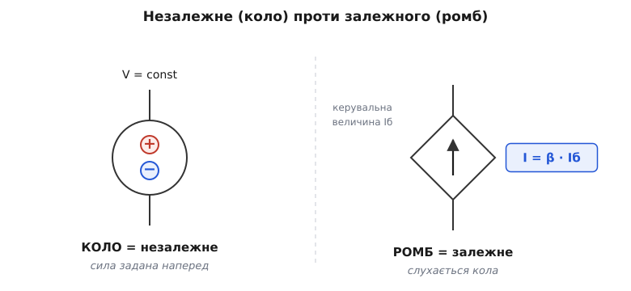
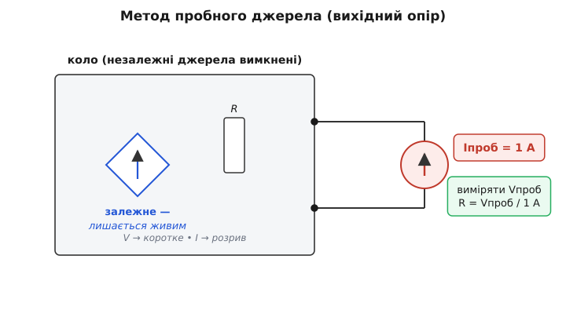

# Залежні джерела: коли джерело слухається кола

Звичайне джерело живлення нічого не питає в кола. Батарейка тримає свої 1.5 В незалежно від того, що до неї під'єднано; ідеальне джерело струму жене свій ампер крізь будь-яке навантаження. Їхня сила задана **наперед** і ні від чого в схемі не залежить. Тому їх і звуть **незалежними джерелами** (лат. *in-* — не, *pendere* — звисати, залежати).

А тепер уявіть джерело, чия сила **не задана наперед**, а щомиті дорівнює якійсь напрузі чи струмові деінде в тому самому колі. Підняли сигнал на вході — джерело миттю піднялось услід; опустили — і воно опустилось. Воно ніби «підслуховує» одну точку схеми й копіює побачене (помноживши на сталий множник) в іншій точці. Таке джерело й зветься **залежним**, або **керованим** (англ. *controlled source*): його значення **залежить** від величини в колі, воно нею **кероване**.

Навіщо вигадувати таку дивну річ? Бо без неї годі описати найважливіше, що вміє електроніка, — **підсилення**. Уся пасивна електроніка (резистори, конденсатори, котушки) лише послаблює: на виході завжди менше, ніж на вході. Підсилювати — робити на виході **більший** образ входу — вміє лише активний прилад: [транзистор](topic:hw-components/transistor-idea), [операційний підсилювач](topic:hw-analog/ideal-opamp). А суть будь-якого підсилювача можна переказати одним реченням: «**вихід повторює вхід, тільки сильніше**». Це і є означення керованого джерела. Залежне джерело — це той цеглинка, з якої будують модель кожного активного прилада.

> 🔧 **Навіщо це.** Залежне джерело — не екзотика з підручника, а робочий елемент, без якого не намалюєш жодної моделі підсилювача. Коли ви ставите транзистор у схему й хочете порахувати підсилення олівцем, ви подумки замінюєте його саме на кероване джерело. SPICE-симулятори всередині роблять те саме: будь-який активний прилад вони зводять до набору залежних джерел. Зрозуміти їх — це зрозуміти, як узагалі описують активну електроніку.

### Чотири різновиди: що чим керує

Джерело буває двох видів — **напруги** або **струму** (одне тримає сталу напругу, друге жене сталий струм). Керувати ним теж можна двома речами — або **напругою**, або **струмом** деінде в колі. Перемножте «що видає» на «чим керується» — і дістанете рівно **чотири** можливі залежні джерела. Це не довільний список, а проста таблиця 2×2.


*Залежне джерело видає або напругу, або струм, і керується або напругою, або струмом. Дві осі дають рівно чотири комбінації; у кожній клітинці — множник зі своєю розмірністю.*

Розберімо кожну, бо за сухими абревіатурами стоять прості думки.

**Джерело напруги, кероване напругою (VCVS).** Вихідна напруга дорівнює вхідній, помноженій на сталий множник: `Vвих = A · Vвх`. Множник A — **безрозмірний** (вольти ділимо на вольти), це чистий коефіцієнт підсилення. Саме так описують [ідеальний операційний підсилювач](topic:hw-analog/ideal-opamp): крихітна різниця напруг на входах, помножена на величезне число, дає вихідну напругу. VCVS — це «ідеальний підсилювач напруги» у найчистішому вигляді.

**Джерело струму, кероване напругою (VCCS).** Вихідний струм заданий вхідною напругою: `Iвих = gm · Vвх`. Тут множник gm має розмірність «ампер на вольт» — це **провідність** (сименс), і зветься вона [крутість](topic:hw-analog/transconductance) (англ. *transconductance* — «передавальна провідність»). Префікс *trans-* (лат. — крізь, через) означає, що провідність зв'язує вхід і вихід, які стоять у **різних** місцях прилада. Саме так моделюють [польовий транзистор](topic:hw-components/field-control) і малосигнальну поведінку будь-якого транзистора: напруга на керувальному виводі задає вихідний струм.

**Джерело напруги, кероване струмом (CCVS).** Вихідна напруга задана вхідним струмом: `Vвих = rm · Iвх`. Множник rm має розмірність «вольт на ампер», тобто **опір** (ом), і зветься **передавальний опір** (англ. *transresistance*). Знову той самий *trans-*: опір, що зв'язує струм в одному місці з напругою в іншому. Так описують, наприклад, перетворювач «струм→напруга» — те, що роблять на виході світлодавача чи фотодіода.

**Джерело струму, кероване струмом (CCCS).** Вихідний струм дорівнює вхідному, помноженому на безрозмірний множник: `Iвих = β · Iвх`. Це найприродніша модель [біполярного транзистора](topic:hw-components/bjt-operation): малий струм бази породжує у [β разів](topic:hw-components/bjt-gain) більший струм колектора. CCCS — це «ідеальний підсилювач струму».

Зведімо чотири в одну табличку, бо її варто знати напам'ять:

```
тип    керує  →  видає    множник            розмірність множника
VCVS   напруга   напругу  A  (підсилення)      безрозмірний
VCCS   напруга   струм    gm (крутість)        А/В = сименс (S)
CCVS   струм     напругу  rm (передавч. опір)  В/А = ом (Ω)
CCCS   струм     струм    β  (підсилення)      безрозмірний
```

Зверніть увагу на красиву симетрію. Коли вхід і вихід **однакові** (напруга→напруга або струм→струм), множник безрозмірний — це чисте підсилення. Коли вхід і вихід **різні** (напруга→струм або навпаки), множник має розмірність провідності чи опору — бо ним ми перекладаємо вольти в ампери або навпаки. Назва кожного типу читається справа наліво: «джерело **напруги** (це вихід), **кероване струмом** (це вхід)» — CCVS. Розклавши абревіатуру отак, ви ніколи їх не сплутаєте.

### Як це малюють: ромб проти кола

На схемі залежне джерело малюють **ромбом** — щоб відразу відрізнити від незалежного, яке малюють **колом**. Це усталена домовленість: побачив ромб — знай, що ця напруга чи струм не стала, а слухається чогось у схемі. Поряд із ромбом пишуть формулу залежності (наприклад, `gm·Vвх` чи `β·Iб`), а десь у колі стрілкою або парою затискачів показують ту саму керувальну величину, від якої джерело залежить.


*Коло — незалежне джерело (його сила задана наперед). Ромб — залежне: біля нього пишуть формулу, а керувальну величину беруть в іншому місці кола. Знак усередині (+/− чи стрілка) каже, напруга це чи струм.*

Це не просто косметика. Ромб — це сигнал «обережно, тут зв'язок»: значення цього джерела не можна прочитати, доки не знайдеш керувальну величину десь-інде. Дві частини схеми — місце керування й сам ромб — пов'язані невидимою ниткою, і саме ця нитка робить прилад **активним**.

### Звідки береться енергія

Тут постає чесне питання, яке мусить ворухнутись у голові уважного читача. Якщо вихід «у сто разів сильніший» за вхід — звідки взялась додаткова потужність? Хіба це не вічний двигун?

Ні, і ось чому. Залежне джерело — це **модель**, а не справжнє джерело енергії. Воно описує поведінку активного прилада (транзистора, ОП), а той бере потужність **не з керувального сигналу**, а з [джерела живлення](topic:hw-pcb/ground-power-rails). Згадайте образ крана: слабкий рух руки керує потужним потоком, але воду жене **тиск у трубі**, а не рука. Так само керувальна напруга лише «каже, скільки», а потужність на вихід дає шина живлення. Тому в моделі залежне джерело малюють без живлення — воно мається на увазі. Коли ви бачите ромб `β·Iб`, що качає в навантаження сильний струм, пам'ятайте: енергію цьому струмові дає Vcc схеми, а ромб лише задає його **форму й величину** за слабким керувальним зразком.

Це і є суть слова «активний». Пасивний елемент не може віддати більше, ніж дістав. Активний — може, але не з нічого: він **модулює** чужу велику потужність слабким сигналом. Залежне джерело — математичний запис саме цієї дії.

### Чим це міняє аналіз кола

Незалежні джерела не плутаються одне з одним: кожне жене своє, і відгуки можна рахувати нарізно, а тоді скласти — це [принцип суперпозиції](topic:hw-analog/superposition). Залежне джерело ламає цю простоту, бо воно **зав'язане** на коло: змінилось щось у схемі — змінилось і воно, а від його зміни знову щось зміниться в схемі. Виходить петля взаємного впливу, і її треба розв'язувати разом, а не вроздріб.

На щастя, самі **інструменти** лишаються ті самі. [Закони Кірхгофа](topic:hw-analog/kcl) працюють як завжди: у вузлах сума струмів нуль, по контурах сума напруг нуль. [Закон Ома](topic:hw-analog/ohms-law) працює. Просто тепер серед доданків з'являється член на кшталт `gm·Vвх`, де `Vвх` — це теж якась невідома напруга в колі. Ключове правило: **керувальну величину треба виразити через ті самі невідомі, що й усе коло**, і тоді система рівнянь замикається.

**Приклад. Транзистор у малосигнальній моделі — це джерело струму `gm·vbe`, що качає в резистор Rc. Знайти підсилення Vвих/vbe, якщо gm = 38 мА/В, Rc = 4.7 кОм.**

Тут увесь транзистор для сигналу — одне залежне джерело (VCCS). Струм, який воно жене в колектор, тече крізь Rc і створює на ньому напругу. Вихід знімаємо з колектора, тож:

:::tabs
```c
// малосигнальна модель: ic = gm·vbe тече крізь Rc
float gm  = 0.038f;   // А/В (38 мА/В при Ic = 1 мА)
float Rc  = 4700.0f;  // Ом
float Av  = -gm * Rc; // вихід читаємо «згори» Rc → мінус
// Av = -0.038 * 4700 ≈ -179
```
```python
# малосигнальна модель: ic = gm·vbe тече крізь Rc
gm = 0.038      # А/В (38 мА/В при Ic = 1 мА)
Rc = 4700.0     # Ом
Av = -gm * Rc   # вихід читаємо «згори» Rc → мінус
# Av = -0.038 * 4700 ≈ -179
```
:::

Підсилення вийшло ≈ −179: сигнал перевернеться і виросте майже у 180 разів. Уся «магія» транзистора тут — це одне кероване джерело струму; решта — звичайна арифметика кола. Докладніше цей хід розібрано в [малосигнальній моделі BJT](topic:hw-analog/bjt-small-signal).

### Пастка з «вимиканням джерел»

Є один момент, на якому спотикаються всі, хто вперше зустрічає залежні джерела разом із теоремами [Тевеніна](topic:hw-analog/thevenin) й [Нортона](topic:hw-analog/norton).

Щоб знайти внутрішній (вихідний) опір кола за Тевеніном, незалежні джерела «вимикають»: джерело напруги замінюють коротким замиканням, джерело струму — розривом. Здавалося б, із залежними зробити так само? **Ні.** Залежне джерело **вимикати не можна** — і це принципово.

Причина проста, якщо повернутись до суті. Незалежне джерело несе зовнішню силу, і, шукаючи **внутрішній** опір, ми цю зовнішню силу прибираємо. А залежне джерело — це не зовнішня сила, це **сам прилад**, частина внутрішнього механізму кола. Вимкнути транзистор, шукаючи опір транзисторного каскаду, — безглуздя: ви прибрали саме те, що шукаєте.

То як же тоді знайти опір кола з залежними джерелами? Методом **пробного джерела**. Усі **незалежні** джерела вимикають як звичайно, а до затискачів **прикладають своє** пробне джерело — скажімо, струм рівно 1 А — і дивляться, яка напруга на них установиться. Опір — це відношення напруги до струму:

:::tabs
```c
// метод пробного джерела для виходу з залежними джерелами:
// 1) усі НЕЗАЛЕЖНІ джерела вимкнути (V→КЗ, I→розрив)
// 2) залежні лишити активними!
// 3) подати пробний Itest = 1 A, виміряти Vtest
float Itest = 1.0f;                  // А, пробний струм
float Vtest = /* розв'язок кола */;  // В
float Rout  = Vtest / Itest;         // Ом (при 1 А просто Rout = Vtest)
```
```python
# метод пробного джерела для виходу з залежними джерелами:
# 1) усі НЕЗАЛЕЖНІ джерела вимкнути (V→КЗ, I→розрив)
# 2) залежні лишити активними!
# 3) подати пробний Itest = 1 A, виміряти Vtest
Itest = 1.0                 # А, пробний струм
Vtest = solve_circuit()     # В
Rout  = Vtest / Itest       # Ом (при 1 А просто Rout = Vtest)
```
:::

Зручність вибору саме 1 А очевидна: тоді опір чисельно дорівнює виміряній напрузі. Залежні джерела весь цей час лишаються «живими» й реагують на пробний сигнал — бо вони і є внутрішній механізм, опір якого ми міряємо.


*Шукаючи вихідний опір кола з керованим джерелом, незалежні джерела вимикають (напругу — в КЗ, струм — у розрив), а залежне лишають активним. До затискачів подають пробний струм 1 А; виміряна напруга чисельно й дає опір.*

> 🔧 **Навіщо це.** Це не теоретична тонкість, а щоденна практика. Будь-який підсилювач має вихідний опір, і саме він каже, чи «просяде» вихід під навантаженням. Порахувати його можна лише методом пробного джерела, бо в підсилювачі завжди є залежне джерело (сам активний прилад). Сплутаєте — вимкнете кероване джерело «за звичкою» — і дістанете геть неправильний опір, а з ним і хибне передбачення поведінки схеми.

### Чому без них не обійтися

Можна спитати: чому б не описувати транзистор просто його реальною нелінійною кривою, без усіх цих абстрактних ромбів? Бо з кривою не порахуєш олівцем, а із залежним джерелом — порахуєш за хвилину. Залежне джерело — це найпростіший можливий спосіб записати думку «вхід керує виходом»: один множник, одна формула, і прилад стає елементом, з яким працюють ті самі [закони Кірхгофа](topic:hw-analog/kvl).

Глибша вигода — **єдина мова** для всієї активної електроніки. Транзистор, операційний підсилювач, фотодавач, гучномовний підсилювач — усі вони зводяться до тих самих чотирьох цеглинок. Інженер, що мислить залежними джерелами, бачить за різними приладами один спільний кістяк: «що чим керує і з яким множником». Тому-то ця абстракція й живе в кожному підручнику й у нутрі кожного симулятора: вона перекладає неозоре розмаїття активних приладів на чотири прості, точні, рахівні елементи.

Отже, залежне джерело — це джерело, чия сила щомиті дорівнює напрузі чи струмові деінде в колі, помноженому на сталий множник. Чотири різновиди (VCVS, VCCS, CCVS, CCCS) покривають усі способи «вхід керує виходом»; малюють їх ромбом; енергію вони беруть із прихованого живлення, а не з керувального сигналу; у рівняннях кола вони лишаються повноправним членом, який не вимикають. З цього одного будівельного блоку складено модель кожного підсилювача — і саме тому він вартий того, щоб бачити його за будь-яким активним приладом.
