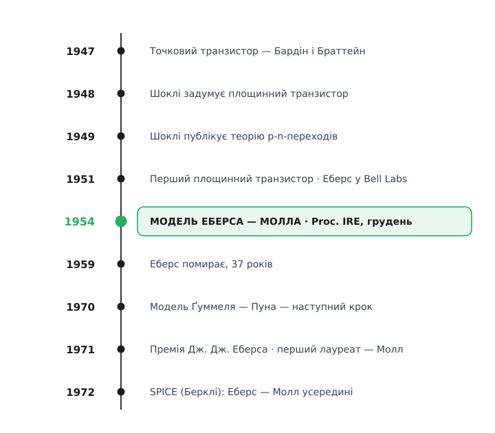

# 📜 1954, Мюррей-Гілл: транзистор, який треба порахувати як ключ

На початку 1950-х у Bell Labs був прилад, якого ще ніхто до пуття не вмів рахувати. [Транзистор](root:hw-components/transistor-idea) уже існував — точковий винайшли 1947-го Джон Бардін і Волтер Браттейн (John Bardeen, Walter Brattain), а площинний, з двома p-n-переходами, Вільям Шоклі (William Shockley) задумав у січні 1948-го й описав його теорію 1949 року в Bell System Technical Journal. Перший робочий площинний транзистор зробили 1951-го. Тобто прилад був, теорія переходів була — а зручного способу порахувати схему з транзистором **у будь-якому режимі** ще не було. І найбільше це боліло там, де транзистор працює не підсилювачем, а **ключем**.

Ключ — це не мале коливання коло робочої точки. Це прилад, що ганяє між двома крайнощами: «повністю замкнено» (великий опір, крізь ключ майже нічого не тече) і «повністю відкрито» (малий опір, спад напруги — десяті частки вольта). Уся мала-сигнальна наука тих років — чотириполюсники, h-параметри, крутість — описувала лише **дотичну** в одній точці характеристики. Для ключа це безпорадно: він не сидить у точці, він летить через увесь діапазон і назад. Інженерові, який будував логіку, лічильники, тригери перших обчислювальних машин, треба було знати геть інше: який залишковий струм тече крізь **замкнений** ключ, яка залишкова напруга падає на **відкритому**, і — головне — **скільки часу** займає переліт між станами. Мала-сигнальна модель на ці питання навіть не бралася відповідати.

## Двоє інженерів з Університету штату Огайо

Систему, що відповіла на всі три питання одразу, вивели двоє молодих інженерів, чиї шляхи дивовижно збіглися. Обидва народилися 1921 року, обидва здобули докторський ступінь в Університеті штату Огайо, обидва опинилися в одній лабораторії в Мюррей-Гілл, Нью-Джерзі.

**Джуелл Джеймс Еберс** (Jewell James Ebers) народився 25 листопада 1921 року в Гранд-Рапідс, штат Мічиган. Три роки відслужив в армії США, потім здобув ступінь бакалавра в Антіохському коледжі (1946), а далі — магістра (1947) і доктора філософії з електротехніки (1950) в Університеті штату Огайо. Кілька років викладав там же — від наукового співробітника до асистента професора, — а у вересні 1951-го прийшов у Bell Labs. Американець; статус усталений за біографічними джерелами.

**Джон Луїс Молл** (John Louis Moll) народився 21 грудня 1921 року у Вазеоні, штат Огайо, у родині менонітських фермерів Семюела й Естер Моллів — одним із сімох дітей. Ступінь бакалавра з фізики здобув 1943 року, доктора з електротехніки — 1952-го, теж в Університеті штату Огайо; між ними попрацював у лабораторіях RCA у Ланкастері. У Bell Labs прийшов 1952 року й зайнявся тим, що згодом виявиться визначальним для всієї галузі: приладами на **кремнії** (тоді панував германій) і моделюванням твердотільних ключів. Теж американець.

Двоє людей з майже однаковим стартом — одна лабораторія, спільна задача про ключ — і одне рівняння, яке переживе їх обох.

## Що вже було — і чого бракувало

Помилково думати, ніби до Еберса й Молла транзистор рахувати не вміли зовсім. Уміли — але кожен спосіб мав свою сліпу зону.

Був **фізичний** опис Шоклі: рівняння дифузії носіїв крізь переходи, з якого виходив струм. Строго, глибоко — але щоб порахувати конкретну схему, доводилося щоразу занурюватися в фізику приладу, а це не інженерна арифметика для щоденної роботи.

Був **чорноскринний** опис — транзистор як [чотириполюсник](root:hw-analog/two-port-network) (two-port), закрита коробка з чотирма параметрами на краях. Зручно вимірювати, зручно друкувати в паспорті. Але ці числа описові: вони кажуть, *як* поводиться прилад коло однієї точки, і мовчать про те, *чому* й що буде за кілометр від тієї точки. А ключ якраз і живе за кілометр від будь-якої однієї точки.

Бракувало третього — моделі **велико-сигнальної** (large-signal): чесної одразу в **усіх** режимах, від глибокої відсічки до глибокого насичення, вираженої через параметри, які легко **виміряти**, і достатньо простої, щоб нею рахувати ключ. Саме цю порожнечу й заповнила стаття 1954 року.

## Стаття

Праця називалася «Large-Signal Behavior of Junction Transistors» («Велико-сигнальна поведінка площинних транзисторів») і вийшла в Proceedings of the IRE, том 42, номер 12, сторінки 1761–1772, у **грудні 1954 року**. Рукопис редакція отримала влітку того ж року.

Її кістяк — одна проста думка про будову. Раз транзистор — це два p-n-переходи спина до спини, а кожен перехід корюється експоненті Шоклі, то опишімо його як **два зчеплені діоди**: власний струм кожного переходу плюс те, що «перехоплює» протилежний. Три рядки рівнянь — і вся статична поведінка приладу в них сидить, а чотири режими не вписані окремими правилами, а **випадають** самі, щойно спитати про знак напруги на кожному з двох переходів.

Але серце статті — саме **ключ**, і формулювали автори його мовою ключа. Замкнений стан (відсічка) — це «розімкнений» ключ із великим опором: обидва переходи зворотні, крізь прилад течуть лише крихітні струми насичення. Відкритий стан (насичення) — це «замкнений» ключ із малим опором: обидва переходи прямі, і колекторний струм задає вже не транзистор, а зовнішнє коло. Модель давала **і те, і те** — залишкові струми та напруги обох станів — через ті самі вимірні параметри, а тоді ще й час переходу між станами. Уся ця арифметика ключа виводилася з однієї системи, справедливої в усіх чотирьох режимах воднораз. Ось чому модель називають велико-сигнальною: вона тримає повну характеристику, а не дотичну в точці.

*Сім десятиліть одним поглядом. Прилад і його фізика прийшли раніше (1947–1951); модель 1954 року стала ланкою між ними й усім, що виросло далі — строгою моделлю Ґуммеля — Пуна та чисельним рушієм SPICE. Гірка симетрія коди: Еберс помер 1959-го, а першу премію його імені 1971 року дістав Молл.*

## Чому це лишилося на сімдесят років

Модель Еберса — Молла мала одну технічну чесноту, ваги якої 1954 року ще ніхто не міг оцінити: вона дає струми як **гладкі функції напруг**. А гладку функцію можна диференціювати, лінеаризувати й підставляти в чисельний розв'язувач. Коли на зламі 1960–70-х у Берклі Лоренс Нейгел (Laurence Nagel) під орудою Дональда Педерсона (Donald Pederson) писав **SPICE** — програму, що й досі стоїть у корені кожного симулятора кіл, — біполярний транзистор у ній рахували саме за Еберсом і Моллом. Дві напруги на входах, три струми на виходах, гладкі експоненти всередині — рівно те, що треба чисельному методу, щоб знайти робочу точку схеми й перехідний процес.

Модель, звісно, доточили. Вона не знала про ефект [Ерлі](root:hw-analog/early-effect), про опір бази, про залежність підсилення від струму, про накопичений заряд. Ці уточнення 1970 року звели в інтегральну зарядову модель Герман Ґуммель і Пун (Hermann Gummel, H. C. Poon), і вже вона стала «промисловою» моделлю в симуляторах. Але кістяк усередині лишився той самий — два зчеплені діоди. Ґуммель — Пун не викинула Еберса — Молла, а вбудувала її як ядро й обросла поправками.

Отак проста думка про тонку базу й два переходи пережила зміну поколінь приладів, матеріалів і машин. Її придумали, щоб порахувати ключ у ламповому ще світі, — а вона й досі рахує транзистори в мікросхемах на мільярди елементів.

## Премія імені співавтора

У цієї історії є тиха й гірка кода. Джуелл Еберс помер **30 березня 1959 року**, у 37 років, після нетривалої хвороби, про яку джерела не уточнюють. За вісім років у Bell Labs він устиг вирости від інженера до керівника — супервайзера, начальника відділу, зрештою директора лабораторії в Аллентауні. Некролог і теплі слова про нього лишив колега Джеймс Ерлі (James M. Early) — той самий, чиїм ім'ям названо ефект Ерлі, поправку, якої базовій моделі Еберса — Молла якраз і бракує.

1971 року Товариство електронних приладів IEEE заснувало щорічну **Премію Дж. Дж. Еберса** (J. J. Ebers Award) — в пам'ять про нього, за визначний внесок в електронні прилади. І першим лауреатом премії, названої на честь Еберса, став **Джон Молл** — його власний співавтор, саме за ту роботу, яку вони зробили разом. Молл прожив довге життя: після Bell Labs був професором Стенфорда, працював у Fairchild і Hewlett-Packard, зібрав медаль Едісона IEEE та багато інших відзнак, і помер 19 липня 2011 року. За даними IEEE, рівно того ж дня — 19 липня — п'ятдесят сім років перед тим редакція отримала їхній рукопис; збіг випадковий, але промовистий.

## Дисципліна атрибуції

Тут немає жодної суперечки про «хто перший» і жодного національного переписування першості — обидва автори американці, і слава між ними поділена чесно, аж до премії, яку один дістав за спільну з другим працю. Але корисно розрізнити ролі, бо винахід тут, як завжди, **колективний**. Фізику переходів дав Шоклі; сам транзистор — Бардін, Браттейн і Шоклі; **велико-сигнальну модель** як зручний інженерний закон для всіх режимів — Еберс і Молл 1954 року; строгу промислову модель на її ґрунті — Ґуммель і Пун 1970-го; а чисельний рушій, що зробив цю модель щоденним інструментом, — команда SPICE у Берклі. Еберс і Молл не «відкрили транзистор» і не єдині його рахували — вони знайшли ту саму форму запису, чесну одразу всюди й достатньо просту, щоб її прийняли всі. Іноді цього досить, щоб рівняння пережило своїх авторів.

*Статус доказовості: біографії, дати, назва й вихідні дані статті, історія Премії Дж. Дж. Еберса та її перший лауреат — усталені за біографічними й інституційними джерелами (IEEE, довідкові біографії); походження SPICE і моделі Ґуммеля — Пуна — усталене; збіг дати рукопису й дати смерті Молла (19 липня) поданий як випадковий, за даними IEEE про надходження рукопису.*
