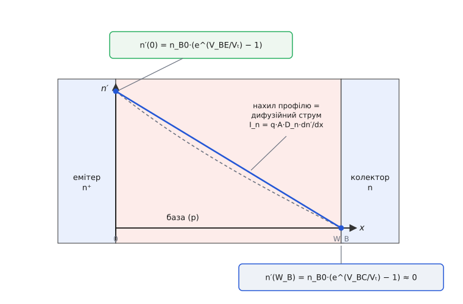
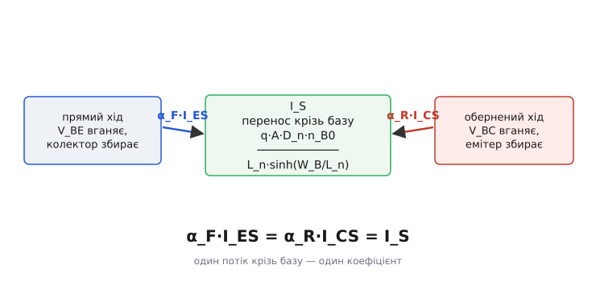
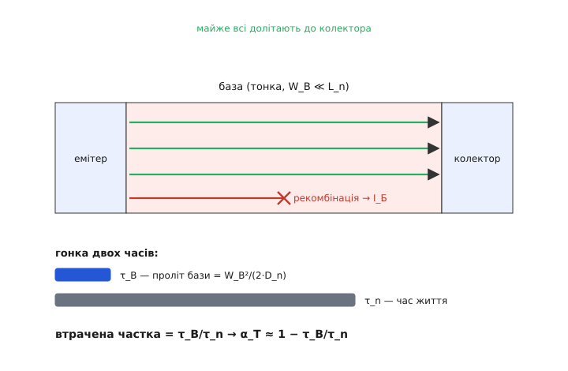

# 🧮 Виведення Еберса — Молла: від дифузії крізь базу до реципрокності

> Модель дає три струми як гладкі функції двох напруг, а між чотирма її параметрами тримається дивний зв'язок: α_F·I_ES = α_R·I_CS. Звідки він? Тут ми не постулюємо рівняння, а **виводимо** їх із фізики переносу носіїв крізь тонку базу — і побачимо, що реципрокність не збіг, а неминучий наслідок того, що крізь базу тече **один** потік, симетричний з обох боків. Заразом стане видно, звідки беруться самі α, I_ES, I_CS, чому інженери переписують модель у «транспортну» форму для симуляторів і як народжується β_F = α_F/(1 − α_F).

### Що саме треба вивести

Модель задає струми виводів через два «внутрішні» діодні струми I_F = I_ES·(e^(V_BE/Vₜ) − 1) та I_R = I_CS·(e^(V_BC/Vₜ) − 1):

```
I_К = α_F·I_F − I_R
I_Е = α_R·I_R − I_F
```

Чотири параметри — α_F, α_R, I_ES, I_CS — виглядають незалежними. Але з фізики випадає жорсткий зв'язок:

```
α_F·I_ES = α_R·I_CS ≡ I_S
```

Мета — показати, **звідки** беруться ці параметри й **чому** справджується остання рівність. Усе тримається на трьох цеглинах: на граничній умові переходу, на дифузії носіїв у базі й на тому, що база **тонка**.

Візьмемо для означеності транзистор n-p-n. База — тонкий шар p-типу завширшки W_B; неосновні носії в ній — **електрони**. Їхня рівноважна концентрація в базі n_B0 = n_i²/N_A (n_i — власна концентрація напівпровідника, N_A — легування бази акцепторами). Поставимо вісь x упоперек бази: x = 0 на краю з боку емітера, x = W_B на краю з боку колектора.

### Крок 1. Гранична умова — закон переходу

Що робить напруга на переході? Вона піднімає (або опускає) концентрацію неосновних носіїв на межі бази. Це наслідок больцманівської статистики: скільки електронів здатні перескочити знижений напругою бар'єр, стільки їх і опиниться на краю бази понад рівновагу. Кількісно — **закон переходу** (той самий множник, що дає експоненту у [ВАХ діода](topic:hw-components/diode-iv-curve/math-shockley-equation.md)):

```
n(0)   = n_B0·e^(V_BE/Vₜ)          на краю з боку емітера
n(W_B) = n_B0·e^(V_BC/Vₜ)          на краю з боку колектора
```

Нас цікавить не повна концентрація, а **надлишок** над рівновагою n′ = n − n_B0 — бо саме градієнт надлишку жене дифузійний струм. Віднявши n_B0, дістаємо два граничні значення:

```
n′(0)   = n_B0·(e^(V_BE/Vₜ) − 1)
n′(W_B) = n_B0·(e^(V_BC/Vₜ) − 1)
```

Ось звідки в моделі всюди сидить множник (e^(V/Vₜ) − 1): це не діодна формула, вписана «за аналогією», а буквально надлишкова концентрація носіїв на краю бази. Прямо зміщений перехід (V > 0) роздуває експоненту й накачує в базу електрони — це і є [ін'єкція неосновних носіїв](topic:ph-condensed/minority-carrier-injection). Зворотно зміщений (V < 0) гасить експоненту до нуля, і n′ падає до −n_B0: край бази знеструмлюється, носіїв там майже не лишається.

### Крок 2. Що робиться в базі — рівняння дифузії

Тепер треба з'єднати два краї. Усередині бази електрична сила на неосновні носії майже не діє (нейтральна область), тож єдиний рушій — **дифузія**: носії течуть туди, де їх менше. У стаціонарі, коли скільки втекло, стільки й притекло, концентрація підкоряється рівнянню неперервності з рекомбінацією:

```
D_n·(d²n′/dx²) = n′/τ_n
```

Ліворуч — розтікання дифузією (D_n — коефіцієнт дифузії електронів), праворуч — витрата на рекомбінацію (τ_n — час життя неосновного носія). Уся суть — у характерній довжині, на якій ці два процеси зрівнюються, — [дифузійній довжині](topic:ph-condensed/diffusion-length-limits-and-measurement) L_n = √(D_n·τ_n): за цю відстань носій у середньому встигає рекомбінувати. Рівняння перепишеться як d²n′/dx² = n′/L_n², і його загальний розв'язок — комбінація гіпербол:

```
           n′(0)·sinh((W_B − x)/L_n) + n′(W_B)·sinh(x/L_n)
n′(x) = ─────────────────────────────────────────────────
                       sinh(W_B/L_n)
```

Ця формула сама підганяється під обидві межі: підставте x = 0 — лишиться n′(0), підставте x = W_B — лишиться n′(W_B). Форма профілю між ними — це вигнута лінія, що злегка провисає під рекомбінацією.

А тепер головна спрощувальна здогадка, і саме вона робить транзистор транзистором: база **тонка**, W_B ≪ L_n. Носій пролітає базу набагато швидше, ніж встигає рекомбінувати. Математично sinh(W_B/L_n) ≈ W_B/L_n, гіперболи випрямляються, і профіль стає майже **прямою лінією** від n′(0) до n′(W_B):

```
n′(x) ≈ n′(0)·(1 − x/W_B) + n′(W_B)·(x/W_B)
```



*Надлишок неосновних носіїв упоперек тонкої бази. Ліва межа задана напругою V_BE, права — V_BC (через закон переходу). Бо база тонка, профіль майже прямий; точний розв'язок трохи провисає під рекомбінацією (тут прогин перебільшено). В активному режимі права межа притиснута до нуля — виходить трикутник, і нахил його гіпотенузи є дифузійний струм.*

Чому пряма лінія — це так важливо? Бо дифузійний струм тримається на **градієнті** концентрації, а в прямої лінії градієнт **сталий** по всій базі. Струм електронів (за Фіком; знак такий, що електрони течуть униз по концентрації, а звичайний струм — угору):

```
I_n = q·A·D_n·(dn′/dx)
```

де A — площа переходу, q — заряд електрона. Сталий градієнт означає: скільки електронів увійшло в базу з боку емітера, стільки майже точно й вийшло з боку колектора. Це і є та наскрізна передача, якої два окремі діоди дати не можуть.

### Крок 3. Струми на краях — і поява реципрокності

Порахуймо градієнт точно, з гіперболічного розв'язку, на обох краях. Продиференціювавши n′(x) і підставивши x = 0 та x = W_B:

```
dn′/dx │₀   = [ −n′(0)·cosh(W_B/L_n) + n′(W_B) ] / (L_n·sinh(W_B/L_n))
dn′/dx │_W  = [ −n′(0) + n′(W_B)·cosh(W_B/L_n) ] / (L_n·sinh(W_B/L_n))
```

Помножимо на q·A·D_n й уведемо одне позначення для множника, що повторюється:

```
        q·A·D_n·n_B0
I_S = ───────────────────       ← коефіцієнт переносу крізь базу
      L_n·sinh(W_B/L_n)
```

Тоді, підставивши граничні значення n′(0) і n′(W_B) з кроку 1, обидва струми набирають на диво симетричного вигляду:

```
I_n(0)   = −I_S·cosh(W_B/L_n)·(e^(V_BE/Vₜ) − 1) + I_S·(e^(V_BC/Vₜ) − 1)
I_n(W_B) = −I_S·(e^(V_BE/Vₜ) − 1) + I_S·cosh(W_B/L_n)·(e^(V_BC/Vₜ) − 1)
```

Придивіться до **перехресних** членів — тих, де струм на одному краю відгукується на напругу **іншого** переходу. Коефіцієнт у них однаковий: I_S. І в струмі на емітерному краю відгук на V_BC, і в струмі на колекторному краю відгук на V_BE керуються тим самим числом. Це не збіг обчислення — це симетрія: крізь базу тече **один** потік електронів, і байдуже, з якого боку ти його «штовхаєш» напругою — провідність цього містка одна. Функція sinh, що стоїть у знаменнику I_S, симетрична щодо перестановки двох країв, тому й перехресний коефіцієнт спільний.



*Прямий хід: напруга V_BE вганяє електрони в базу, колектор їх збирає — передача α_F·I_ES. Обернений хід: V_BC вганяє, емітер збирає — передача α_R·I_CS. Обидва канали — той самий фізичний перенос крізь базу, тому коефіцієнт у них спільний: α_F·I_ES = α_R·I_CS = I_S.*

### Крок 4. Звідки α, I_ES, I_CS

Струми I_n — це поки що лише **електронна** частина, перенос крізь базу. Повний струм переходу має ще одну складову: біля прямо зміщеного переходу дірки з бази вприскуються назад в емітер (і, для другого переходу, у колектор). Ці діркові струми залежать кожен лише від **своєї** напруги — вони не переносяться крізь базу, тож додаються тільки до «власних» членів. Позначмо їх діркові струми насичення I_pE0 (в емітер) та I_pC0 (у колектор).

Зберемо повні струми насичення переходів — власний член у кожному є «cosh»-частина переносу плюс дірковий доважок:

```
I_ES = I_S·cosh(W_B/L_n) + I_pE0        струм насичення переходу емітер–база
I_CS = I_S·cosh(W_B/L_n) + I_pC0        струм насичення переходу колектор–база
```

Тепер зіставимо це з рівняннями моделі. У виразі для I_К коефіцієнт при (e^(V_BE/Vₜ) − 1) — це передача з емітера в колектор, тобто перехресний член I_S; модель називає його α_F·I_ES. А коефіцієнт при (e^(V_BC/Vₜ) − 1) — власний колекторний, тобто I_CS. Так само в I_Е передача з колектора в емітер — знову I_S, а модель зве його α_R·I_CS. Звідси одразу:

```
α_F·I_ES = I_S        →   α_F = I_S / I_ES
α_R·I_CS = I_S        →   α_R = I_S / I_CS
```

Обидва добутки дорівнюють **одному й тому самому** I_S — тому й

```
α_F·I_ES = α_R·I_CS = I_S
```

Реципрокність доведено, і доведено не як окремий постулат, а як тотожність: I_S — то просто спільний коефіцієнт переносу крізь базу, записаний двічі. Ось чому незалежних параметрів у моделі не чотири, а **три**: задавши будь-які три з четвірки {α_F, α_R, I_ES, I_CS}, четвертий дістаєш із реципрокності безкоштовно.

Тепер видно й **природу самих α**. Розкладімо α_F на дві частки. Спершу відкинемо діркову ін'єкцію (I_pE0 → 0) — лишиться суто перенос крізь базу, **коефіцієнт переносу бази** α_T:

```
α_T = I_S / (I_S·cosh(W_B/L_n)) = 1 / cosh(W_B/L_n)
```

Для тонкої бази cosh(u) ≈ 1 + u²/2, тому

```
α_T ≈ 1 − W_B²/(2·L_n²) = 1 − W_B²/(2·D_n·τ_n) = 1 − τ_B/τ_n
```

де τ_B = W_B²/(2·D_n) — **час прольоту** бази. Ось напрочуд наочний результат: електрон, що влетів у базу, біжить наввипередки з власною загибеллю. Устигне перетнути базу за час τ_B — долетить до колектора; загається довше за час життя τ_n — рекомбінує й пропаде в струм бази. Частка тих, що пропали, — рівно відношення двох часів τ_B/τ_n. Тонка база (малий W_B) робить τ_B крихітним проти τ_n — і майже всі електрони добігають.



*Електрон у базі — між двома годинниками. Транзитний τ_B малий (база тонка), час життя τ_n великий (база чиста), тому майже всі долітають до колектора; втрачена частка τ_B/τ_n перетворюється на струм бази. Це фізичний зміст α_T = 1/cosh(W_B/L_n) ≈ 1 − τ_B/τ_n.*

Друга частка — **ефективність емітера** γ: яка частка повного струму переходу є корисними електронами в базу, а не марними дірками назад в емітер:

```
γ = I_S·cosh(W_B/L_n) / (I_S·cosh(W_B/L_n) + I_pE0) = 1 / (1 + I_pE0/(I_S·cosh(W_B/L_n)))
```

Розкривши струми насичення для тонкої бази, дістаємо промовисту умову:

```
        1                              D_pE   N_A    W_B
γ ≈ ─────────── ,   де λ = ──── · ──── · ────
      1 + λ                              D_n    N_DE   L_pE
```

Ключ тут — відношення легувань N_A/N_DE (база до емітера). Щоб λ був малий і γ → 1, емітер треба легувати **набагато сильніше** за базу, N_DE ≫ N_A. Ось справжня причина, чому емітер у транзисторі роблять n⁺ («жирний» плюс) — щоб зустрічна діркова ін'єкція не крала струм. (Про рухливість, що ховається в D = μ·Vₜ, — у [рухливості носіїв](topic:ph-condensed/carrier-mobility); про самý дифузію меншин — у [дифузії неосновних носіїв](topic:ph-condensed/minority-carrier-diffusion-transport).)

Повний коефіцієнт передачі — добуток двох часток:

```
α_F = γ·α_T
```

Обидві трохи менші за одиницю, тому й добуток менший за одиницю — але лише трохи. А втрату 1 − α_F видно як суму двох причин: частина носіїв рекомбінувала в базі (1 − α_T ≈ τ_B/τ_n), частина зайшла назад в емітер дірками (1 − γ ≈ λ). Обидві течуть у базу — і саме вони складають той крихітний струм бази, яким керують транзистором.

**Оцінка на пальцях.** Кремнієва база W_B = 0.5 мкм, L_n = 20 мкм, D_n ≈ 25 см²/с, час життя τ_n ≈ 1 мкс.

```
τ_B = W_B²/(2·D_n) = (0.5·10⁻⁴ см)² / (2·25) ≈ 5·10⁻¹¹ с = 50 пс
1 − α_T ≈ τ_B/τ_n = 5·10⁻¹¹ / 10⁻⁶ = 5·10⁻⁵          ← рекомбінація в базі
```

Рекомбінаційна втрата — сота частки відсотка. У реальному транзисторі 1 − α_F зазвичай визначає не вона, а ефективність емітера λ: при N_DE/N_A ≈ 100 виходить λ ≈ 10⁻³, і саме це дає β порядку сотень. Обидві втрати малі — і тому α так близький до одиниці.

### Крок 5. Дві форми — інжекційна й транспортна

Те, що ми вивели, — це **інжекційна** форма (саме її 1954 року записали Джуелл Джеймс Еберс і Джон Молл у праці «Large-Signal Behavior of Junction Transistors», Proc. IRE 42, 1761–1772). Її змінні — струми **власних діодів переходів** I_F, I_R, а коефіцієнти α кажуть, яка їхня частка долітає наскрізь:

```
I_К = α_F·I_ES·(e^(V_BE/Vₜ) − 1) − I_CS·(e^(V_BC/Vₜ) − 1)
I_Е = α_R·I_CS·(e^(V_BC/Vₜ) − 1) − I_ES·(e^(V_BE/Vₜ) − 1)
```

Симулятори кіл переписують те саме інакше — у **транспортну** форму. Ідея: винести наперед єдиний спільний струм I_S (той самий, що з реципрокності), бо через нього все й так виражається. Скористаймося α_F·I_ES = I_S та I_CS = I_S/α_R і згадаймо, що 1/α_R = 1 + (1 − α_R)/α_R = 1 + 1/β_R. Підставмо в I_К:

```
I_К = I_S·(e^(V_BE/Vₜ) − 1) − (I_S/α_R)·(e^(V_BC/Vₜ) − 1)
    = I_S·[(e^(V_BE/Vₜ) − 1) − (e^(V_BC/Vₜ) − 1)] − (I_S/β_R)·(e^(V_BC/Vₜ) − 1)
```

Великий член у квадратних дужках — це **транспортний струм** I_CT, чистий потік електронів крізь базу (додатний до колектора, від'ємний назад). Струм бази так само згортається у два малі «протікання»:

```
I_CT = I_S·[(e^(V_BE/Vₜ) − 1) − (e^(V_BC/Vₜ) − 1)]

I_К = I_CT − (I_S/β_R)·(e^(V_BC/Vₜ) − 1)
I_Б = (I_S/β_F)·(e^(V_BE/Vₜ) − 1) + (I_S/β_R)·(e^(V_BC/Vₜ) − 1)
I_Е = −I_CT − (I_S/β_F)·(e^(V_BE/Vₜ) − 1)
```

Тут вигулькнув **β**, і саме в тій формі, що в довідниках. Струм бази — це частка (1 − α) від переходу; поділивши струм колектора на струм бази в активному режимі (V_BC зворотний, другий член мовчить), дістаємо:

```
β_F = I_К/I_Б = α_F/(1 − α_F)          (і дзеркально β_R = α_R/(1 − α_R))
```

Ось чому за підсилення так тримаються за кожну соту частку α: коли α_F → 1, знаменник 1 − α_F тане, і β злітає. Перевести можна й назад: α_F = β_F/(1 + β_F).

Чому симулятор віддає перевагу транспортній формі? Три причини, і всі з фізики, яку ми щойно вивели. Перша: у ній рівно три незалежні параметри — **I_S, β_F, β_R**, і це буквально рядки IS, BF, BR у картці моделі [SPICE](topic:hw-pcb/spice-simulation). Реципрокність гарантує, що єдиний опорний струм I_S існує й визначений однозначно, — інакше довелося б тягати чотири числа з прихованою залежністю. Друга: головний транспортний член I_CT записаний **один раз** і спільний для I_К та I_Е, а дрібні струми бази лише відщеплюються від нього частками 1/β — це і чисельно стійкіше, і ближче до правди (струм бази справді малий доважок до наскрізного потоку). Третя: така форма прямо узагальнюється до пізнішої моделі Ґуммеля — Пуна, де I_S роблять уже не сталою, а функцією накопиченого в базі заряду.

### Що ця математика дала

Ми почали з єдиного фізичного факту — тонка база, крізь яку дифундують уприснуті електрони, — і дійшли до всіх параметрів моделі, не постулюючи жодного:

- множник (e^(V/Vₜ) − 1) усюди — це надлишкова концентрація носіїв на краю бази, накачана напругою за законом переходу;
- I_ES, I_CS — струми насичення переходів, кожен з переносу крізь базу плюс зустрічна діркова ін'єкція;
- α_F = γ·α_T — добуток ефективності емітера й переносу бази, обидва трохи менші за одиницю;
- I_S — спільний коефіцієнт переносу, той самий з обох боків, звідки й реципрокність α_F·I_ES = α_R·I_CS;
- β_F = α_F/(1 − α_F) — прямий наслідок того, що в базу тече лише втрачена частка потоку.

Глибше за все — сама реципрокність. Вона не інженерне спрощення й не щаслива симетрія формул: це прояв загального закону взаємності Онсагера (Ларс Онсаґер, 1931), за яким у лінійних коло-рівноважних системах перехресні коефіцієнти переносу завжди рівні. Крізь базу тече один потік — і його провідність не залежить від того, з якого краю прикладено напругу. Уся модель Еберса — Молла, по суті, розкручена з цього одного вузла.
