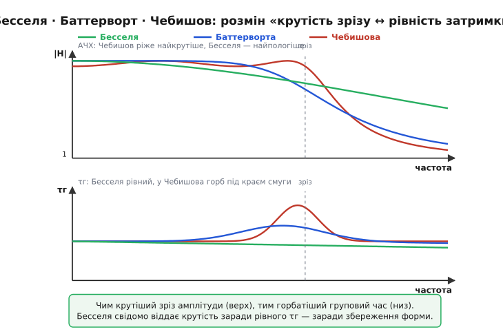

# 🔌 Фільтр Бесселя–Томсона: коли важлива не різкість зрізу, а ціла форма сигналу

Більшість фільтрів проєктують, дивлячись на одну криву — амплітудно-частотну характеристику. Питання ставлять так: наскільки різко коло відрізає непотрібні частоти? І за цією міркою найкращі ті, що ріжуть найкрутіше: Чебишова, еліптичний. Але є цілий клас задач, де ця мірка не просто другорядна, а оманлива — там, де крізь фільтр проходить не одна частота, а **форма**: фронт імпульсу, обвідна пакета, картинка кадру. Для них існує фільтр, спроєктований за **іншою** кривою — не за амплітудою, а за [груповим часом затримки](root:hw-analog/filter-group-delay). Його так і будують: підбирають коефіцієнти так, щоб груповий час вийшов **максимально рівним** у смузі, а амплітуда — як вийде. Це **фільтр Бесселя–Томсона** (часто просто «фільтр Бесселя»).

> 🔧 **Навіщо це.** Поставте крутий фільтр Чебишова перед осцилографом — і прямокутний імпульс на екрані обросте дзвоном і перекосом, хоч ви ще нічого не виміряли: фільтр спотворив саму форму, яку ви прийшли дивитися. Поставте на те саме місце Бесселя — і прямокутник лишиться прямокутником, лише трохи згладженим і зсунутим у часі. Весь сенс цього класу — у єдиній обіцянці: **що ввійшло за формою, те й вийде**, тільки пізніше. За цю обіцянку платять найгіршою в класі вибірністю, і вся інженерія фільтра Бесселя — це усвідомлений розмін «форма проти різкості».

## Що це за клас і навіщо він узагалі є

Згадаймо одне твердження з теорії кіл, бо на ньому стоїть увесь клас: сигнал зберігає форму, тільки якщо коло спізнює **всі** його частотні складові на **однаковий** час. Це і означає рівний груповий час — або, що те саме, **лінійну фазу** (фаза, пропорційна частоті: φ = −k·ω, тоді її нахил всюди той самий, k). Зсунь усі складові на однакове k — горб обвідної прийде цілий, просто на k пізніше. Зроби затримку нерівною — складові розповзуться в часі, фазова збірка, що тримала форму, розсиплеться, і гострий імпульс розіллється в розмазаний з хвостами.

Тепер біда: жоден фізичний фільтр не має ідеально лінійної фази. Полюси передавальної функції неминуче гнуть фазу, і груповий час десь та й здіймається горбом — найдужче під краєм смуги пропускання, бо саме там амплітуда круто завертає вниз, а круте завертання амплітуди тягне за собою круте завертання фази. Звичайні фільтри з цим горбом мовчки миряться, бо їх проєктували під амплітуду. Фільтр Бесселя робить навпаки: він жертвує крутістю амплітудного зрізу заради того, щоб **відсунути** цей фазовий горб якомога далі за смугу й лишити груповий час усередині смуги якомога рівнішим. Звідси одне-єдине речення, що описує весь клас:

> Фільтр Бесселя — це фільтр, чию передавальну функцію підібрано під **максимально рівний груповий час** (максимально лінійну фазу), а не під максимально рівну чи максимально круту амплітуду.

«Максимально рівний» — термін точний, не рекламний: він означає, що в розкладі групового часу за частотою біля нуля **обнулено якомога більше перших похідних**, тож крива виходить настільки плоскою, наскільки дозволяє порядок фільтра. Так само «максимально рівною» роблять амплітуду в Баттерворта — той самий математичний прийом, але прикладений до іншої кривої. Звідси й споріднення, і протиставлення цих двох класів: одна ідея, два різні предмети оптимізації.

## Звідки береться характеристика: реверсивні поліноми Бесселя

Найцікавіше — **чому** саме функції Бесселя дали цю рівну затримку, адже сам Фрідріх Бессель ніколи фільтрів не бачив. Підемо від мети, як її ставив проєктувальник, а формули з'являться самі.

Хочемо коло з ідеально сталою затримкою T на всіх частотах. Стала затримка в часі — це множник e⁻ˢᵀ у передавальній функції (зсув у часі на T відповідає множенню зображення на e⁻ˢᵀ). Отже, ідеал — H(s) = e⁻ˢᵀ. Але чисту експоненту жодним скінченним колом із резисторів, котушок і конденсаторів не збудуєш: коло дає лише **відношення многочленів** від s. Тож завдання звужується: знайти многочлен, який **найкраще наближає** e⁻ˢᵀ так, щоб затримка лишалась рівною.

Розпишемо ідеал як неперервний дріб (так його зручно обривати скінченним числом ланок). Гіперболічний котангенс, що сидить усередині цього розкладу, розгортається в неперервний дріб саме з **тими** коефіцієнтами, що дають **реверсивні поліноми Бесселя** (англ. *reverse Bessel polynomials*) — ті самі многочлени, які Бессель колись вивів зовсім для іншої задачі (рух у центральному полі, коливання мембран). Обірвавши дріб на n-й ланці, дістаємо фільтр n-го порядку, чий знаменник — реверсивний поліном Бесселя θₙ(s):

```
H(s) = θₙ(0) / θₙ(s)        — нормуємо чисельником θₙ(0), щоб на ω=0 було підсилення 1

θ₁(s) = s + 1
θ₂(s) = s² + 3s + 3
θ₃(s) = s³ + 6s² + 15s + 15
θ₄(s) = s⁴ + 10s³ + 45s² + 105s + 105
```

Коефіцієнти не вгадані — їх дає замкнена формула (a₀ при найвищому степені опускаємо, бо він одиниця):

```
aₖ = (2n − k)! / ( 2^(n−k) · k! · (n−k)! )      k = 0…n
```

Підставте n=2: a₀=1, a₁=3, a₂=3 — рівно θ₂. Уся «магія Бесселя» в фільтрі — це те, що многочлен із саме такими коефіцієнтами наближає e⁻ˢᵀ так, що перші похідні групового часу по частоті біля нуля занулюються одна за одною. Тому затримка біля нуля плоска до високого порядку, а далі від нуля повільно сповзає — звідси й уся форма характеристики, до якої переходимо.

> 🔧 **Навіщо це.** На практиці ці многочлени вам розписувати руками не доведеться — їх беруть готовою таблицею (полюси, або значення R, L, C, або коефіцієнти ланок другого порядку) і просто розставляють у схему. Але знати, **звідки** вони, варто з однієї причини: це пояснює, чому затримка фільтра Бесселя плоска **лише поблизу нуля** і повільно завертає до краю смуги. Наближення e⁻ˢᵀ точне на низьких частотах і дедалі гірше на високих — тому й рівність затримки тримається в смузі, а на самому краю та за ним розпадається. Жодного партномера тут немає: те саме θₙ(s) лежить в основі будь-якої реалізації будь-якого виробника.

## Типова форма: АЧХ і груповий час проти Баттерворта й Чебишова

Тепер подивімось, що ця характеристика дає у двох кривих одразу — амплітуді й затримці — поряд із двома сусідами по класу фільтрів. Усі три беремо одного порядку, з однаковою частотою зрізу, щоб порівняння було чесним.


*Угорі амплітуда: Чебишов ріже найкрутіше (ціною брижів у смузі), Баттерворт рівний і середній за крутістю, Бесселя — найпологіший зріз, амплітуда «обвисає» ще в смузі. Унизу груповий час: у Бесселя він майже пласкою лінією проходить усю смугу, у Баттерворта вже з підйомом до краю, у Чебишова — з гострим горбом під самою межею. Те, чим Бесселя програє вгорі (крутість), він виграє внизу (рівність затримки).*

Прочитаймо обидві панелі як одну історію. **Амплітуда**: Бесселя має найпологіший зі спадів — він починає «обвисати» ще всередині смуги пропускання й переходить у стопсмугу мляво, без різкого коліна. Баттерворт тримає смугу пласкою аж до зрізу, тоді спадає помірно круто. Чебишов ріже найкрутіше з трьох, але платить за це **брижами** в смузі (рівномірними коливаннями амплітуди). **Груповий час**: тут усе навпаки. Бесселя проводить майже горизонтальну лінію через усю смугу — це і є його єдина мета. Баттерворт уже піднімає затримку до краю. Чебишов, найкрутіший угорі, унизу дає найбільший горб затримки під самим краєм смуги — і що крутіший спад (більший рівень брижів), то вищий цей горб.

Зведімо це в орієнтовну табличку відчуттів (числа залежать від порядку, тут — щоб запам'ятати ранг, а не точну величину):

```
                крутість спаду    рівність τг у смузі    брижі в смузі    дзвін на сходинці
Бесселя         найгірша          найкраща               нема             майже нема
Баттерворта     середня           середня                нема             помірний
Чебишова        найкраща          найгірша               є                сильний
```

Ключ до всієї таблиці — у тому, що це **не три набори незалежних плюсів і мінусів, а один розмін, повернутий різними боками**. Крутість амплітудного зрізу й рівність групового часу — антагоністи: не можна мати водночас і найкрутіший зріз, і найрівнішу затримку, бо обидві властивості керуються однією й тією ж фазою. Хочеш різкіше різати — мусиш круто гнути фазу під краєм — а це горб затримки. Хочеш рівну затримку — мусиш гнути фазу полого — а це млявий зріз. Бесселя й Чебишов — два кінці цієї єдиної осі, Баттерворт сидить посередині.

## Блок-схема й «розпіновка»: де стоїть фільтр і що в нього входить

Фільтр Бесселя — це не окрема мікросхема з фіксованими ніжками, а **спосіб обрати значення деталей** у звичайній фільтрувальній схемі. «Розпіновку» тут варто читати як **набір портів і вузлів**, спільний для будь-якої реалізації — пасивної на котушках чи активної на оппідсилювачі.

Як блок фільтр Бесселя живе на тому самому місці тракту, що й будь-який інший фільтр:

```
   сигнал ──►┌──────────────┐──► згладжений сигнал
             │  фільтр       │     (та сама форма, зсунута на τг)
             │  Бесселя      │
             │  n-го порядку │
   опорна ──►└──────────────┘──► опорна (земля)
   земля
```

Чотири «виводи», що є завжди, незалежно від реалізації:

- **Вхід сигналу** — сюди подають форму, яку треба зберегти: відеорядок, телеметричний потік, аналог перед оцифруванням.
- **Вихід сигналу** — та сама форма, згладжена за амплітудою вище смуги й зсунута в часі на груповий час τ₀ (затримку на постійному струмі).
- **Земля / опорна точка** — спільна для входу й виходу; саме відносно неї відлічують і амплітуду, і фазу.
- **Живлення** — лише в **активному** варіанті (на оппідсилювачі): пасивний LC-фільтр Бесселя живлення не потребує взагалі, енергію бере із самого сигналу.

Внутрішня будова — каскад **ланок другого порядку** (плюс одна першого порядку, якщо порядок непарний). Кожну ланку реалізують стандартною схемою — наприклад, [активним фільтром на оппідсилювачі](root:hw-analog/active-filters) (топологія Саллена–Кі чи багатопетльова) або пасивною LC-сходинкою. «Бесселевість» не в топології ланок, а **в числах**: добротності й частоти ланок беруть із таблиці полюсів Бесселя, а не Баттерворта. Поставите ті самі ланки з іншими Q — дістанете інший клас фільтра з тих самих деталей.

> 🔧 **Навіщо це.** Звідси висновок, що рятує від типової помилки: **тип фільтра живе в номіналах деталей, а не в схемі.** Дві плати з ідентичною топологією — однакові оппідсилювачі, однакові місця під R і C — можуть бути одна Бесселя, друга Чебишова, якщо в них різні номінали. Тому, дивлячись на схему, не можна сказати «це Бесселя» з вигляду — треба порахувати добротності ланок. І навпаки: переробити Чебишова на Бесселя часто означає лише **перерахувати й перепаяти кілька резисторів**, не чіпаючи розводки.

## «Перший байт»: як перевірити, що це справді Бесселя

Перше, що варто зробити з готовим фільтром Бесселя, — переконатися, що він **поводиться** як Бесселя, а не лише називається. Тут є дві швидкі проби, кожна перевіряє ту саму суть із різного боку.

**Проба формою — сходинка.** Подайте на вхід прямокутну сходинку (перепад напруги) і дивіться вихід на осцилографі. Справжній Бесселя дасть плавний, монотонний підйом **майже без викиду** (англ. *overshoot*) — вершина підкрадається до рівня знизу й не вистрілює над ним. Для порівняння: Баттерворт того ж порядку викине відсотків на 10 над рівнем і дзвякне, Чебишов — ще дужче. Малий викид — це прямий доказ рівної затримки: усі складові сходинки прийшли синхронно й не утворили дзвону.

```c
// Орієнтовний викид на сходинці (overshoot) — груба пам'ятка для фільтрів 4-го порядку.
// Це НЕ формула, а типові значення, щоб упізнати клас на осцилографі.
//   Бесселя:     ~0.4 %   (практично немає — вершина не вистрілює)
//   Баттерворта: ~11  %   (помітний викид + загасний дзвін)
//   Чебишова 1дБ:~22  %   (сильний викид, довгий дзвін)
// Якщо ваш «фільтр Бесселя» дзвонить на 10+ % — це не Бесселя, переплутані номінали ланок.
```

**Проба затримкою — груповий час.** Якщо є аналізатор (чи код, що рахує груповий час як похідну фази), знімайте τг через смугу. У Бесселя крива має бути **майже горизонтальна** до самого краю смуги й лише там повільно сповзати; жодного горба під краєм. Побачили горб усередині смуги — переплутаний клас. Корисний наперед відомий орієнтир — затримка на постійному струмі: для нормованого фільтра Бесселя (зріз на ω=1) груповий час на нулі частоти приблизно дорівнює одиниці часу, а далі лише трохи зменшується. Це дає очікувану величину, з якою звіряють виміряну.

Третя дрібниця «першого байта», про яку часто забувають: **частота зрізу Бесселя не там, де ви її задали інтуїтивно**. Через пологий спад точка −3 дБ у Бесселя лежить помітно вище, ніж точка, де починає рівнятися затримка. Тому фільтр Бесселя нормують **двояко** — або за −3 дБ амплітуди, або за затримкою (щоб τ₀ дорівнювало рівно одиниці). Дві таблиці тих самих полюсів, по-різному відмасштабовані, дають фільтри, що відрізняються частотою зрізу разів у півтора. Беручи готову таблицю, **спершу подивіться, за чим вона нормована**, інакше ваш зріз поїде.

## Типові граблі класу

Кожен граблі тут — пряме породження головного розміну, тож і запам'ятовуються вони як його наслідки.

**Чекати від Бесселя різкого зрізу.** Найчастіша пастка. Інженер бере «фільтр четвертого порядку», подумки уявляє круте коліно — а Бесселя дає мляве сповзання, і сусідній сигнал, який мав відрізатися, лізе крізь смугу. Якщо потрібна і рівна затримка, і різкий зріз водночас — **одного фільтра Бесселя замало**: або підвищують порядок (дорого, і навіть тоді зріз пологіший за Чебишова), або ставлять крутий фільтр і **окремо вирівнюють** його затримку всепропускними ланками.

**Думати, що вищий порядок виправить пологість безкарно.** Порядок у Бесселя справді робить зріз крутішим — але затримка від цього **росте**: фільтр вищого порядку спізнює сигнал дужче (більше τ₀). Для тракту, де затримка критична сама по собі (наприклад, петля керування з фільтром у колі зворотного зв'язку), задертий порядок Бесселя додає таку затримку, що петля може втратити запас стійкості. Тут три величини тягнуть у різні боки: **порядок ↔ крутість зрізу ↔ рівність і величина затримки** — і не можна крутити одну, не зрушивши решти.

**Плутати рівність затримки з малістю затримки.** Бесселя дає затримку **рівну**, а не **малу** — і часто навпаки, його затримка більша за Баттерворта того ж порядку (бо полюси розташовані далі по осі). Якщо у вас критична абсолютна затримка (низька латентність), Бесселя сам по собі її не зменшує — він лише гарантує, що яка є, та однакова на всіх частотах.

**Брати таблицю, не глянувши на нормування.** Уже згадані дві традиції нормування (за −3 дБ чи за затримкою) ріжуть слух новачкам: той самий «фільтр Бесселя 1 кГц» з двох різних довідників матиме різну реальну смугу. Завжди звіряйте, від чого відлічено частоту в таблиці.

**Покладатися на ідеальну рівність затримки за межами смуги.** Рівний груповий час Бесселя — обіцянка **в смузі пропускання**. За краєм смуги, де амплітуда вже впала, затримка завертає, і там форма все одно псувалася б — але туди вже й сигналу майже не пропускають. Не намагайтеся «використати» рівність затримки на частотах, які фільтр і так душить: її там немає.

## Варіації класу

Один принцип «рівна затримка через поліноми Бесселя» дає кілька споріднених форм — корисно бачити поле цілком, без жодного партномера.

**ФНЧ, ФВЧ, смуговий, режекторний.** Базовий Бесселя — це фільтр нижніх частот; його стандартними частотними перетвореннями (заміною змінної s) переганяють у верхні частоти, смуговий чи режекторний. Але тут є тонкість, що випливає з самої суті класу: властивість «рівний груповий час» **зберігається чисто лише в ФНЧ-формі**. Перетворення у ФВЧ чи смуговий спотворює фазову характеристику, тож «фільтр Бесселя верхніх частот» уже не має тієї ідеальної рівності затримки — назву носить, а обіцянку тримає лише частково. Тому Бесселя застосовують передусім там, де треба саме ФНЧ: згладити, обмежити смугу зверху, прибрати високочастотний шум — зберігши форму.

**Пасивний LC проти активного на оппідсилювачі.** Та сама характеристика Бесселя реалізується двома світами деталей. **Пасивний** LC-сходинковий фільтр (котушки й конденсатори) живлення не потребує, працює на будь-якій потужності й частоті аж до радіодіапазону — саме його синтез на сходинці зі сталою затримкою й описав Сторч 1954-го. **Активний** на оппідсилювачі (ланки Саллена–Кі чи багатопетльові) не потребує котушок — зручно на низьких частотах, де котушки були б завеликі, — але обмежений смугою й шумом самого оппідсилювача. Вибір між ними — звичайний вибір пасив/актив, не специфічний для Бесселя.

**Цифровий Бесселя й «гаусів» родич.** Ту саму ідею переносять і в цифрову обробку: проєктують цифровий фільтр із тими ж полюсами Бесселя, щоб згладжувати потік даних, не спотворюючи форму. Близький за духом — **гаусів фільтр**, чия імпульсна характеристика має форму дзвону Гаусса; він дає ще менший викид на сходинці, але трохи гіршу рівність затримки. Бесселя й гаусів — дві сусідні точки на одному й тому ж компромісі «гладкість у часі проти рівності затримки», і в задачах збереження форми їх часто розглядають разом.

## Де його ставлять насправді

Зведімо застосування в одну логіку: фільтр Бесселя беруть **скрізь, де ціна спотворення форми вища за ціну млявого зрізу**.

- **Антиаліасинговий фільтр перед АЦП, що оцифровує форму.** Осцилограф, аналізатор перехідних процесів, реєстратор імпульсів — пристрої, чия мета виміряти саму **форму** сигналу. Крутий [антиаліасинговий фільтр](root:hw-analog/anti-aliasing-filter) на вході спотворив би цю форму ще до оцифрування — додав би дзвін і перекіс, яких у сигналі не було. Бесселя на цьому місці згладжує лише те, що вище смуги (звідки й береться аліасинг), а форму корисного сигналу лишає цілою. Класичний випадок «форма дорожча за різкість».
- **Відео й композитні сигнали.** Картинка кадру — це швидкі фронти яскравості; нерівна затримка зсуває кольороріжницю й розмиває контури. Бесселя зберігає взаємне розташування фронтів у часі — зображення лишається чітким.
- **Телеметрія й передавання форми імпульсу.** Де по каналу йде не «біт або не біт», а сам **профіль** імпульсу (амплітуда, ширина, фронт несуть зміст), нерівна затримка спотворила б вимірювану величину. Бесселя доправляє пакет цілим.
- **Згладжування з мінімальним викидом.** Будь-де, де треба прибрати високочастотний шум чи різкі викиди з повільного сигналу (давач, керувальний рівень), не породивши натомість дзвону й перерегулювання, — Бесселя дає найчистіше згладжування з усіх класичних фільтрів.

А де його **не** беруть, теж випливає з тієї ж логіки: у приймачі, де поряд лежить потужний сусідній канал і його треба різко відрізати, ставлять Чебишова чи еліптичний — і, якщо їхній горб затримки муляє, [вирівнюють груповий час окремою всепропускною ланкою](root:hw-analog/filter-group-delay/math-allpass-equalize.md), яка править лише фазу, не чіпаючи амплітуди. Розподіл праці чіткий: різкість — Чебишову, форму — Бесселю, а зведення обох — окремому вирівнювачу.

## Звідки взялася назва: Бессель, Томсон, Сторч

Назва «Бесселя–Томсона» чесно ділить заслугу між математиком, який дав апарат, і інженером, який приклав його до фільтрів — корисний приклад того, як ім'я на класі пристроїв майже ніколи не належить одній людині.

**Фрідріх Вільгельм Бессель** (нім. *Friedrich Wilhelm Bessel*, 22 липня 1784, Мінден, Вестфалія — 17 березня 1846, Кенігсберг) — німецький астроном, математик і геодезист. Походження німецьке однозначне; народився в Міндені (тоді прусська адміністративна область Мінден-Равенсберг), із 1810 року керував новозаснованою Кенігсберзькою обсерваторією. Він першим виміряв відстань до зорі методом паралакса (61 Лебедя, 1838). До фільтрів він стосунку не мав і мати не міг — помер за сто років до них. Його ім'я на класі тому, що **функції й поліноми, названі на його честь** (він вивів їх, працюючи над рухом у центральному полі та коливаннями), згодом виявилися саме тим апаратом, що дає рівну затримку. Це типова доля математики: інструмент кують для однієї задачі, а спрацьовує він зовсім в іншій. *(Статус: усталено — біографія й авторство функцій добре задокументовані.)*

**В. Е. Томсон** (англ. *W. E. Thomson*) — британський інженер, який **застосував** функції Бесселя до синтезу фільтрів. Його праця «Delay networks having maximally flat frequency characteristics» («Лінії затримки з максимально рівною частотною характеристикою») вийшла в листопаді 1949 року в *Proceedings of the IEE, Part III* (т. 96, № 44, с. 487–490); згодом — «Networks with maximally flat delay» у *Wireless Engineer* (т. 29, жовтень 1952). Саме Томсон показав, що многочлени Бесселя в знаменнику передавальної функції дають максимально рівний груповий час — звідси й друге ім'я класу. *(Статус: усталено — публікації існують і цитуються в фаховій літературі.)*

**Л. Сторч** (англ. *L. Storch*) — інженер, який 1954 року дав **синтез сходингових кіл сталої затримки** на поліномах Бесселя: «Synthesis of Constant-Time-Delay Ladder Networks Using Bessel Polynomials» у *Proceedings of the IRE* (т. 42, 1954, с. 1666–1675). Сторч побудував реалізовну мінімально-фазову передавальну функцію з максимально рівною затримкою й показав, як втілити її LC-сходинкою з низькодобротних елементів, причому її імпульсна характеристика близька до зсунутого гаусового дзвону. Це переклало теорію Томсона мовою конкретних котушок і конденсаторів. *(Статус: усталено; ім'я в джерелах подають як L. Storch — у деяких посиланнях ініціал відрізняється, тож саме ініціал лишаю обережно, авторство й рік сумніву не викликають.)*

Варто згадати й передісторію: ще 1943 року японський інженер **Z. Kiyasu** (З. Кіясу) у своїх роботах над лініями затримки підійшов до тієї самої ідеї застосування поліномів Бесселя для лінійної фази, передбачивши пізніше формулювання Томсона. Тож «винахід» цього класу, як майже завжди в інженерії, — не спалах однієї голови, а ланцюг: математичний апарат Бесселя (XIX ст.) → передбачення Кіясу (1943) → формулювання Томсона (1949–52) → сходинковий синтез Сторча (1954). *(Статус передісторії Кіясу: правдоподібно, згадується в оглядах історії фільтра; деталі його праці менш доступні, тож подаю обережно, як ранній паралельний внесок, а не як одноосібний пріоритет.)*
