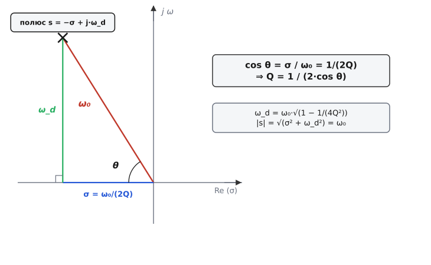
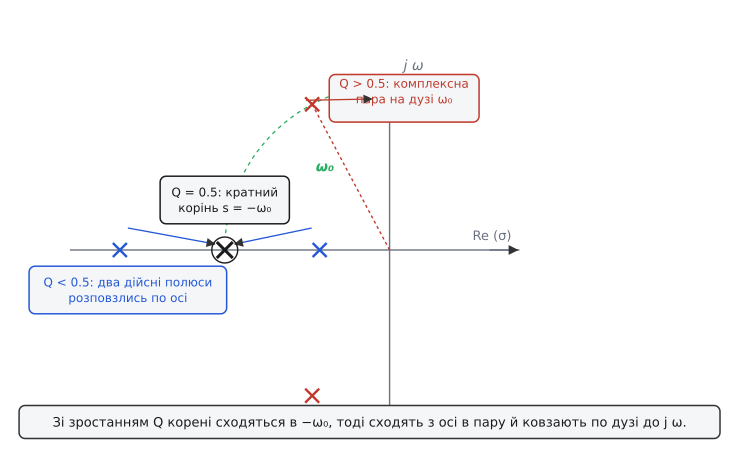

# 🧮 Звідки беруться полюси: точне місце пари на s-площині та чому пік сидить нижче ω₀

Геометрію пари полюсів легко показати на пальцях: дві точки в лівій півплощині, кут від осі задає добротність, відстань від нуля — частоту. Та малюнок — це обіцянка, яку треба виконати числами. Звідки **точно** береться знаменник s² + (ω₀/Q)·s + ω₀²? Чому полюс сидить саме на σ = ω₀/(2Q) ліворуч і ω_d = ω₀·√(1−1/(4Q²)) угору? Чому горб на частотній характеристиці виростає не на ω₀, а трохи **нижче** — на ω₀·√(1−1/(2Q²))? І чому висота того горба за великих Q дорівнює майже самій Q?

Усе це виводиться з кількох рядків алгебри, і кожен рядок має фізичний сенс, який варто бачити, а не лише вірити формулі. Розберімо весь ланцюг від першого кореня квадратного рівняння до точної висоти піка — так, щоб наприкінці число σ = ω₀/(2Q) не було магією, а очевидним наслідком того, де лежить корінь.

## Звідки канонічний знаменник: будь-яка ланка 2-го порядку — це той самий многочлен

Почнімо з кореня справи: чому знаменник **взагалі** має вигляд s² + (ω₀/Q)·s + ω₀², хоч би з чого фільтр зібрано? Бо це найзагальніший многочлен 2-го степеня, у якого корені лежать ліворуч (коло стійке), записаний через дві фізичні величини замість двох безликих коефіцієнтів.

Візьмімо найпростішу пару полюсів — послідовний RLC-контур, де вихід знімають із конденсатора. Закон Кірхгофа для напруг дає рівняння кола, а перехід до комплексної змінної s (операторний запис, у якому похідна за часом стає множенням на s) перетворює його на алгебру. Напруга на конденсаторі ділиться від входу так:

```
H(s) = (1/sC) / ( sL + R + 1/sC )
```

Це лише дільник напруги: знизу — повний опір кола (котушка sL, резистор R, конденсатор 1/sC послідовно), зверху — опір конденсатора, з якого знімаємо вихід. Помножмо чисельник і знаменник на sC, щоб прибрати дроби всередині:

```
H(s) = 1 / ( s²·LC + s·RC + 1 )
```

Ось уже видно квадратний многочлен у знаменнику. Лишилося причесати його до канону. Поділимо весь знаменник на LC, щоб коефіцієнт при s² став одиницею (так корені видно найясніше):

```
H(s) = (1/LC) / ( s² + (R/L)·s + 1/LC )
```

Тепер порівняймо з тим, що хочемо отримати, — s² + (ω₀/Q)·s + ω₀². Два коефіцієнти мусять збігтися, і це **визначає** ω₀ та Q через номінали:

```
ω₀² = 1/LC          →   ω₀ = 1/√(LC)
ω₀/Q = R/L          →   Q  = ω₀·L/R = (1/R)·√(L/C)
```

Перше — стара як світ формула резонансної частоти LC. Друге каже, що добротність — це відношення реактивного опору котушки на резонансі (ω₀·L) до активного опору R, який краде енергію. Чим менший R (менше втрат), тим вища Q. Усе сходиться з фізикою: Q **є** мірою того, наскільки слабко коло втрачає енергію за цикл.

Головне тут не сам RLC, а висновок: **канонічний знаменник — не вигадка для зручності, а природна форма**. Будь-яка ланка 2-го порядку — на RLC, на двох RC з підсилювачем ([топологія Саллена–Кі](root:hw-analog/active-filters)), на гіраторі — дає квадратний многочлен у знаменнику, і ми завжди можемо назвати його два коефіцієнти через ω₀ і Q. Конкретне коло лише по-своєму виражає ці два числа через свої деталі; математика полюсів далі та сама для всіх.

> 🔧 **Навіщо це.** Цей перехід — це те, що ви робите щоразу, проєктуючи фільтр: дивитеся на схему, виписуєте її H(s), зводите знаменник до канону й **читаєте** ω₀ та Q просто з коефіцієнтів. Не треба пам'ятати окрему формулу Q для кожної топології — досить уміти звести знаменник до s² + (ω₀/Q)·s + ω₀² і прирівняти члени. Для RLC вийшло Q = (1/R)·√(L/C); для Саллена–Кі вийде відношення ємностей; механіка та сама.

## Корені квадратного рівняння: точні координати полюсів

Маємо знаменник. Полюси — це його корені, точки, де він обертається в нуль:

```
s² + (ω₀/Q)·s + ω₀² = 0
```

Це звичайне квадратне рівняння; пустимо в дію формулу коренів s = (−b ± √(b²−4ac))/(2a), де a = 1, b = ω₀/Q, c = ω₀²:

```
s = −ω₀/(2Q) ± ½·√( (ω₀/Q)² − 4ω₀² )
```

Винесімо ω₀² з-під кореня, щоб побачити структуру:

```
s = −ω₀/(2Q) ± (ω₀/2)·√( 1/Q² − 4 )
```

Тепер усе залежить від знака підкореневого виразу 1/Q² − 4, тобто від того, більша Q за ½ чи менша. Це і є **розвилка трьох режимів**, і кожен має свою фізику. Розгляньмо найцікавіший — комплексні полюси, бо саме вони дають резонанс.

**Комплексні полюси (Q > ½).** Коли Q > ½, маємо 1/Q² < 4, підкореневий вираз від'ємний, корінь стає уявним. Витягнімо з-під нього мінус явно, як √(−1) = j (уявна одиниця; інженери пишуть j, а не i, щоб не плутати зі струмом):

```
s = −ω₀/(2Q) ± j·(ω₀/2)·√( 4 − 1/Q² )
```

Розкладімо на дійсну й уявну частини й дамо їм імена. Дійсна частина — це σ (відстань полюса ліворуч від уявної осі, швидкість згасання), уявна — ω_d (висота полюса, частота згасних коливань):

```
σ   = ω₀/(2Q)                         ← дійсна частина (згасання)
ω_d = (ω₀/2)·√( 4 − 1/Q² )            ← уявна частина (частота гойдання)
```

Перша формула — те саме σ = ω₀/(2Q), що́ обіцяв малюнок. Вона тепер не постульована, а **впала** прямо з формули коренів: половина середнього коефіцієнта, узята зі знаком мінус. Друга формула трохи громіздка; причешімо її, винісши ω₀ за корінь (бо 4 − 1/Q² = 4·(1 − 1/(4Q²))):

```
ω_d = ω₀·√( 1 − 1/(4Q²) )
```

Ось пара формул, заради яких усе й затівалося:

```
σ   = ω₀/(2Q)
ω_d = ω₀·√( 1 − 1/(4Q²) )
```

Перевірмо, що геометрія сходиться. Відстань полюса від початку координат має дорівнювати ω₀ (так його означили на малюнку). Знайдімо її за теоремою Піфагора з σ і ω_d:

```
|s|² = σ² + ω_d²
     = ω₀²/(4Q²) + ω₀²·(1 − 1/(4Q²))
     = ω₀²/(4Q²) + ω₀² − ω₀²/(4Q²)
     = ω₀²
```

Доданки з 1/(4Q²) знищуються, лишається рівно ω₀². Отже |s| = ω₀ — **точно** як обіцяв малюнок: відстань полюса від нуля є власна частота, хоч би яка Q. Полюс рухається по колу радіуса ω₀; змінюючи Q, ми лише ковзаємо ним по дузі, не змінюючи відстані від центра. Це не випадковість, а прямий наслідок того, що добуток коренів квадратного многочлена дорівнює вільному члену c = ω₀² (за теоремою Вієта), а для спряженої пари добуток коренів — це квадрат модуля.

## Кут полюса: звідки Q = 1/(2cosθ)

Тепер найкрасивіша частина — звідки береться Q = 1/(2cosθ). Кут θ ми міряємо від негативної дійсної осі (від напрямку «ліворуч») до променя, що йде з нуля в полюс. Косинус цього кута — це проєкція на горизонталь, поділена на довжину променя, тобто σ поділена на |s|:

```
cos θ = σ / |s| = (ω₀/(2Q)) / ω₀ = 1/(2Q)
```

Ω₀ скоротилася, лишилося cos θ = 1/(2Q). Переверніть — і маєте формулу з малюнка:

```
Q = 1 / (2·cos θ)
```

Уся таємниця цього співвідношення — у тому, що σ = ω₀/(2Q), а гіпотенуза = ω₀. Косинус — відношення прилеглого катета (σ) до гіпотенузи (|s| = ω₀), і ω₀ просто скорочується, лишаючи 1/(2Q). Жодної магії: формула кута — це означення косинуса, застосоване до прямокутного трикутника, який утворюють полюс, його проєкція на дійсну вісь і початок координат.

> 🔧 **Навіщо це.** Кут полюса — найшвидший спосіб прикинути Q очима, дивлячись на карту полюсів у симуляторі чи в даташиті фільтра. Полюс під 45° → cos 45° = 0.707 → Q = 1/(2·0.707) = 0.707 (Баттерворт). Полюс під 60° → cos 60° = 0.5 → Q = 1. Полюс, що майже ліг на уявну вісь (θ → 90°) → cos → 0 → Q → ∞ (на межі самозбудження). Не рахуючи нічого, ви читаєте добротність із нахилу променя — і відразу бачите, чи не підпустив автор фільтра полюс небезпечно близько до осі.


*Координати одного полюса спряженої пари. Промінь із нуля має довжину ω₀ (модуль полюса). Його горизонтальна проєкція — σ = ω₀/(2Q), вертикальна — ω_d = ω₀·√(1−1/(4Q²)). Косинус кута θ між променем і негативною дійсною віссю — це σ/ω₀ = 1/(2Q), звідки Q = 1/(2·cosθ). Уся формула добротності — це означення косинуса в цьому трикутнику.*

## Три режими: дійсні полюси, кратний корінь, комплексна пара

Тепер повернімося до розвилки. Знак підкореневого виразу 1/Q² − 4 розділяє фільтри 2-го порядку на три якісно різні світи, і межа між ними — рівно Q = ½. Зручно говорити мовою **коефіцієнта згасання** ζ (грец. *zēta*; читають «дзета»), оберненого до подвоєної Q:

```
ζ = 1/(2Q)        ⇄        Q = 1/(2ζ)
```

Тоді знаменник можна переписати в ще одній канонічній формі, яку любить теорія керування, — s² + 2ζω₀·s + ω₀². Три режими — це три діапазони ζ навколо одиниці.

**ζ > 1, тобто Q < ½ — два дійсні полюси (передемпфований).** Підкореневий вираз додатний, корінь дійсний, обидва полюси сідають на негативну дійсну вісь у різних точках:

```
s₁, s₂ = −ω₀·( ζ ∓ √(ζ²−1) )
```

Жодної уявної частини — отже жодного коливання. Коло поводиться як дві послідовні RC-ланки: вихід підповзає до рівня плавно, монотонно, без сліду гойдання. Кажуть «полюси розпались»: спряжена пара розчепилася на два окремі дійсні корені, що розповзлися по осі. Що менша Q, то далі один від одного. Резонансу немає, бо немає уявної частини, якій гойдатися.

**ζ = 1, тобто Q = ½ — кратний корінь (критично демпфований).** Підкореневий вираз рівно нуль, обидва корені зливаються в один подвійний:

```
s₁ = s₂ = −ω₀
```

Це межа двох світів — найшвидший вихід на рівень **без** жодного перестрибу. Ще трохи менша Q — і відгук стане ледь повільнішим (передемпфування); ще трохи більша — і з'явиться викид. Q = ½ — точка, де коло встигає на рівень якнайшвидше, але вже не перестрибує його. Звідси й назва «критичне» згасання: критична межа між монотонним підходом і коливальним.

**ζ < 1, тобто Q > ½ — комплексна спряжена пара (недодемпфований).** Це той випадок, що ми розібрали вище: полюси сходять з осі вгору й униз, з'являється уявна частина ω_d, з'являється резонанс. Тільки тут є горб на частотній характеристиці й дзвін у часі. Що ближче Q до ∞ (ζ до 0), то ближче полюси до уявної осі, то довше коло дзвенить.

Зведімо три режими в одну картину, бо межі тут варто тримати в голові:

```
Q < 0.5   (ζ > 1)   два дійсні полюси     підхід плавний, без викиду
Q = 0.5   (ζ = 1)   кратний корінь −ω₀     найшвидший підхід без перестрибу
Q > 0.5   (ζ < 1)   комплексна пара         резонанс: горб і дзвін
```

Зверніть увагу: Q = ½ — це **не** межа піка на частотній характеристиці. Пік стартує пізніше, з Q = 1/√2 ≈ 0.707. Між 0.5 і 0.707 полюси вже комплексні (коло формально коливальне, у часі є мікроскопічний викид), але горба на частотній характеристиці ще немає. Чому пороги різні — з'ясуймо точно, бо саме тут більшість плутається.


*Як рухаються корені знаменника зі зростанням Q. За Q < 0.5 два дійсні полюси сидять на осі (один близько до нуля, другий далеко); вони сходяться. За Q = 0.5 зливаються в подвійний корінь у точці −ω₀. За Q > 0.5 розходяться з осі в комплексну пару й ковзають по дузі радіуса ω₀ до уявної осі. Дуга — стале ω₀; рух по ній — зміна Q.*

## Чому пік сидить нижче ω₀: точна формула частоти горба

Тепер серцевина вставки. Поширена помилка — думати, що горб на частотній характеристиці стоїть на ω₀. Насправді він трохи **нижче**, і відстань залежить від Q. З'ясуймо це строго, бо тут видно тонку, але важливу різницю між «власною частотою полюса» і «частотою, де характеристика найвища».

Модуль передавальної функції на реальній частоті ω дістаємо, підставивши s = jω (рухаємося по уявній осі — там живуть фізичні синусоїди). Для канонічної ланки:

```
|H(jω)|² = ω₀⁴ / [ (ω₀² − ω²)² + (ω₀·ω/Q)² ]
```

Чисельник сталий, тож |H| найбільший там, де знаменник найменший. Шукати максимум |H| — те саме, що шукати **мінімум** знаменника. Введімо для чистоти заміну x = ω² (працювати з квадратом частоти зручніше — зникнуть корені) і позначмо знаменник D(x):

```
D(x) = (ω₀² − x)² + (ω₀²/Q²)·x
```

Мінімум — там, де похідна dD/dx дорівнює нулю. Продиференціюймо. Перший доданок — це (ω₀² − x)², його похідна за x дорівнює 2·(ω₀² − x)·(−1) = −2·(ω₀² − x). Другий доданок лінійний за x, його похідна — просто коефіцієнт ω₀²/Q²:

```
dD/dx = −2·(ω₀² − x) + ω₀²/Q² = 0
```

Розв'яжімо щодо x:

```
2·(ω₀² − x) = ω₀²/Q²
ω₀² − x     = ω₀²/(2Q²)
x           = ω₀² − ω₀²/(2Q²) = ω₀²·( 1 − 1/(2Q²) )
```

А оскільки x = ω², частота піка — це корінь:

```
ω_пік = ω₀·√( 1 − 1/(2Q²) )
```

Ось точна формула. Подивімося, **що** вона каже:

Частота піка завжди **менша** за ω₀ (бо під коренем число, менше за одиницю), і чим менша Q, тим нижче сповзає пік. Це наслідок згасання: затухле коло резонує трохи нижче, ніж незатухле — згасання «тягне» резонанс униз по частоті. Зверніть увагу на тонкість: під коренем 1/(2Q²), а не 1/(4Q²), як у формулі ω_d. Тобто частота піка характеристики ω_пік і частота згасних коливань ω_d — це **три різні** частоти разом з ω₀, і їх легко переплутати:

```
ω₀     = √(LC)⁻¹                 ← власна (недемпфована) частота; модуль полюса
ω_d    = ω₀·√(1 − 1/(4Q²))       ← частота згасних коливань у часі; уявна частина полюса
ω_пік  = ω₀·√(1 − 1/(2Q²))       ← частота, де АЧХ найвища (горб)
```

Три частоти збігаються лише в одній уявній межі — за Q → ∞, коли всі корені прямують до одиниці. За скінченної Q порядок завжди такий: ω_пік < ω_d < ω₀. Демпфування зсуває «частоту максимуму характеристики» найнижче, «частоту дзвону в часі» — посередині, а «номінальна власна частота» лишається найвищою.

І ось де ховається поріг піка. Горб **існує** лише доти, доки підкореневий вираз ω_пік додатний — тобто доки 1 − 1/(2Q²) > 0:

```
1 − 1/(2Q²) > 0
1 > 1/(2Q²)
2Q² > 1
Q² > 1/2
Q  > 1/√2 ≈ 0.707
```

Ось воно — точне народження порога 0.707. За Q ≤ 1/√2 вираз під коренем стає нулем або від'ємним: максимум характеристики «сповзає» на нульову частоту (або взагалі зникає з додатних частот), горба немає, характеристика монотонно западає від самого початку. За Q > 1/√2 пік виринає на додатну частоту й росте. Тепер видно, чому пороги різні: **полюси** стають комплексними вже за Q > 0.5 (умова σ², ω_d — поведінка в часі), а **горб** на характеристиці виникає лише за Q > 0.707 (умова на максимум |H| — поведінка в частоті). Між 0.5 і 0.707 коло формально коливальне в часі, але в частоті ще пласке.

> 🔧 **Навіщо це.** Ця різниця між ω₀ і ω_пік — пастка під час налаштування. Ви проєктуєте антиаліасинговий фільтр на зріз, скажімо, 20 кГц і ставите ω₀ = 2π·20 кГц. Якщо Q висока, реальний пік характеристики виявиться помітно нижче 20 кГц — а вам, можливо, треба було, щоб максимально пласка ділянка тяглася рівно до 20 кГц. Знаючи ω_пік = ω₀·√(1−1/(2Q²)), ви наперед бачите, куди насправді поповзе горб, і коригуєте ω₀, щоб зріз ліг куди треба. Без цієї поправки фільтр «промахується» повз цільову частоту тим сильніше, чим вища Q.

## Висота піка: чому за великих Q вона дорівнює майже Q

Лишилося порахувати, **наскільки** високий горб. Підставмо знайдену частоту піка x = ω₀²·(1 − 1/(2Q²)) назад у |H|² і подивимося, що вийде. Спершу знайдімо, чому дорівнює знаменник D у точці мінімуму.

Згадаймо, що в точці піка ω₀² − x = ω₀²/(2Q²) (це ми вивели, шукаючи похідну). Підставмо цей зручний шматок у D(x):

```
D_min = (ω₀² − x)² + (ω₀²/Q²)·x
      = ( ω₀²/(2Q²) )² + (ω₀²/Q²)·ω₀²·(1 − 1/(2Q²))
```

Розкрийте дужки крок за кроком. Перший доданок — ω₀⁴/(4Q⁴). Другий — ω₀⁴/Q² · (1 − 1/(2Q²)) = ω₀⁴/Q² − ω₀⁴/(2Q⁴):

```
D_min = ω₀⁴/(4Q⁴) + ω₀⁴/Q² − ω₀⁴/(2Q⁴)
```

Зберіть доданки з Q⁴: 1/(4Q⁴) − 1/(2Q⁴) = −1/(4Q⁴). Лишається:

```
D_min = ω₀⁴/Q² − ω₀⁴/(4Q⁴) = (ω₀⁴/Q²)·( 1 − 1/(4Q²) )
```

Тепер сама висота піка — це |H| у цій точці, тобто √(ω₀⁴/D_min):

```
|H|_пік = √( ω₀⁴ / D_min ) = √( ω₀⁴ / [ (ω₀⁴/Q²)·(1 − 1/(4Q²)) ] )
```

Ω₀⁴ скорочується повністю, лишається напрочуд чиста формула:

```
|H|_пік = Q / √( 1 − 1/(4Q²) )
```

Це **точна** висота горба (для ланки з одиничним підсиленням на постійному струмі). Прочитаймо її. За великих Q дріб 1/(4Q²) під коренем стає мізерним, корінь прямує до одиниці, і вся формула спрощується до простого й гарного:

```
|H|_пік ≈ Q        (за Q ≫ 1)
```

Ось чому Q зустрічають як «коефіцієнт підсилення на резонансі»: за високих добротностей висота горба чисельно **дорівнює** самій Q (у разах за напругою). Ланка з Q = 10 підніме сигнал на резонансі приблизно вдесятеро — на +20 дБ. Поправковий множник 1/√(1−1/(4Q²)) важить лише поблизу порога: за Q = 0.707 він помітний (точна висота піка там, до речі, дорівнює рівно одиниці — горб іще не виринув над лінію), а за Q = 5 поправка вже менша за 1 %. Тому інженерне «висота піка ≈ Q» — не груба прикидка, а майже точна рівність скрізь, де горб справді гострий.

Зведімо три головні числа піка в одне місце, бо разом вони дають повну картину горба:

```
ω_пік   = ω₀·√(1 − 1/(2Q²))        ← ДЕ стоїть горб (трохи нижче ω₀)
|H|_пік = Q/√(1 − 1/(4Q²)) ≈ Q     ← ЯКИЙ він заввишки (≈ Q за великих Q)
поріг   = Q > 1/√2 ≈ 0.707         ← КОЛИ він узагалі є
```

**Перевірмо на Q = 5, щоб число стало відчутним.** Висока, але реальна добротність ланки — скажімо, гострий смуговий фільтр.

:::tabs
```cpp
#include <cmath>

// Точні параметри горба ланки 2-го порядку (одиничне підсилення на DC).
// w0 — власна частота (рад/с), Q — добротність.
// Повертає частоту піка, висоту піка (рази) та висоту в дБ.
struct PeakParams { float wpk, gain, gain_db; };

PeakParams peak_params(float w0, float Q)
{
    float wpk     = w0 * std::sqrt(1.0f - 1.0f / (2.0f * Q * Q));   // ω_пік
    float gain    = Q  / std::sqrt(1.0f - 1.0f / (4.0f * Q * Q));   // |H|_пік
    float gain_db = 20.0f * std::log10(gain);                        // у децибелах
    return { wpk, gain, gain_db };
}

// Для w0 = 1 (нормуємо), Q = 5:
//   ω_пік / ω₀ = √(1 − 1/(2·25)) = √(1 − 0.02) = √0.98 = 0.98995
//                → пік на 0.990·ω₀ — лише на 1 % нижче власної частоти.
//   |H|_пік     = 5 / √(1 − 1/(4·25)) = 5 / √(1 − 0.01) = 5 / 0.99499 = 5.0252
//                → горб у 5.03 раза, тобто +14.02 дБ.
//   Наївне «≈ Q» дало б рівно 5 (+13.98 дБ) — похибка 0.5 %.
```
```python
import math

# Точні параметри горба ланки 2-го порядку (одиничне підсилення на DC).
# w0 — власна частота (рад/с), Q — добротність.
# Повертає частоту піка, висоту піка (рази) та висоту в дБ.
def peak_params(w0, Q):
    wpk     = w0 * math.sqrt(1.0 - 1.0 / (2.0 * Q * Q))   # ω_пік
    gain    = Q  / math.sqrt(1.0 - 1.0 / (4.0 * Q * Q))   # |H|_пік
    gain_db = 20.0 * math.log10(gain)                     # у децибелах
    return wpk, gain, gain_db

# Для w0 = 1 (нормуємо), Q = 5:
#   ω_пік / ω₀ = √(1 − 1/(2·25)) = √(1 − 0.02) = √0.98 = 0.98995
#                → пік на 0.990·ω₀ — лише на 1 % нижче власної частоти.
#   |H|_пік     = 5 / √(1 − 1/(4·25)) = 5 / √(1 − 0.01) = 5 / 0.99499 = 5.0252
#                → горб у 5.03 раза, тобто +14.02 дБ.
#   Наївне «≈ Q» дало б рівно 5 (+13.98 дБ) — похибка 0.5 %.
```
```js
// Точні параметри горба ланки 2-го порядку (одиничне підсилення на DC).
// w0 — власна частота (рад/с), Q — добротність.
// Повертає частоту піка, висоту піка (рази) та висоту в дБ.
function peakParams(w0, Q) {
  const wpk    = w0 * Math.sqrt(1 - 1 / (2 * Q * Q));   // ω_пік
  const gain   = Q  / Math.sqrt(1 - 1 / (4 * Q * Q));   // |H|_пік
  const gainDb = 20 * Math.log10(gain);                 // у децибелах
  return { wpk, gain, gainDb };
}

// Для w0 = 1 (нормуємо), Q = 5:
//   ω_пік / ω₀ = √(1 − 1/(2·25)) = √(1 − 0.02) = √0.98 = 0.98995
//                → пік на 0.990·ω₀ — лише на 1 % нижче власної частоти.
//   |H|_пік     = 5 / √(1 − 1/(4·25)) = 5 / √(1 − 0.01) = 5 / 0.99499 = 5.0252
//                → горб у 5.03 раза, тобто +14.02 дБ.
//   Наївне «≈ Q» дало б рівно 5 (+13.98 дБ) — похибка 0.5 %.
```
```go
package filter

import "math"

// Точні параметри горба ланки 2-го порядку (одиничне підсилення на DC).
// w0 — власна частота (рад/с), Q — добротність.
// Повертає частоту піка, висоту піка (рази) та висоту в дБ.
func PeakParams(w0, Q float64) (wpk, gain, gainDB float64) {
	wpk = w0 * math.Sqrt(1.0-1.0/(2.0*Q*Q))   // ω_пік
	gain = Q / math.Sqrt(1.0-1.0/(4.0*Q*Q))   // |H|_пік
	gainDB = 20.0 * math.Log10(gain)          // у децибелах
	return
}

// Для w0 = 1 (нормуємо), Q = 5:
//   ω_пік / ω₀ = √(1 − 1/(2·25)) = √(1 − 0.02) = √0.98 = 0.98995
//                → пік на 0.990·ω₀ — лише на 1 % нижче власної частоти.
//   |H|_пік     = 5 / √(1 − 1/(4·25)) = 5 / √(1 − 0.01) = 5 / 0.99499 = 5.0252
//                → горб у 5.03 раза, тобто +14.02 дБ.
//   Наївне «≈ Q» дало б рівно 5 (+13.98 дБ) — похибка 0.5 %.
```
:::

За Q = 5 пік стоїть на 0.990·ω₀ (майже на власній частоті — близькість до ω₀ зростає з Q), а заввишки він рівно 5.03 раза проти грубої прикидки 5. Похибка наближення «≈ Q» — півпроцента. За Q = 0.707 картина протилежна: ω_пік виходить у нуль (горб щойно зник), а точна висота — рівно одиниця, тобто характеристика ніде не піднімається над лінію. Дві крайнощі одного й того ж точного виразу.

> 🔧 **Навіщо це.** Точна висота піка — це запас, який ви закладаєте в схему живлення чи зворотний зв'язок. LC-фільтр на виході перетворювача має свою пару полюсів; коли навантаження легшає, його R-демпфування слабшає, Q підскакує — і горб у Q разів **підсилює** пульсації на своїй частоті замість гасити. Формула |H|_пік ≈ Q наперед каже, на скільки децибел підскочить перешкода в найгіршому разі (легке навантаження → висока Q), і скільки демпфування (резистор-snubber) треба додати, щоб збити Q до безпечного. Інженер, що бачить це число, не випускає в поле фільтр, який за певного навантаження сам стане підсилювачем шуму.

## Звідки беруться Q родин фільтрів: де на дузі сидять полюси

Тепер зберімо все докупи й подивімося, навіщо взагалі ця бухгалтерія полюсів. Крутий фільтр високого порядку складають із ланок 2-го порядку — біквадів, кожен зі своєю парою полюсів (своїми ω₀ і Q). А **тип** фільтра — Баттерворта, Бесселя, Чебишова — це рецепт того, де саме на s-площині розсадити ці полюси. Геометрія полюса, яку ми вивели, дає мову, якою ці рецепти записані.

Найчистіший приклад — фільтр **Баттерворта**. Його полюси лежать на колі радіуса ω₀ через **рівні кутові проміжки** — наче розставлені циркулем по дузі лівої півплощини. Британський інженер Стівен Баттерворт (Stephen Butterworth, 1885–1958) описав цю характеристику 1930 року в статті «On the Theory of Filter Amplifiers»; його ім'я закріпилося за «максимально пласкою» характеристикою (усталений факт). Для фільтра 4-го порядку чотири полюси (дві спряжені пари) стоять під кутами, симетрично навколо негативної дійсної осі. Порахуймо Q цих двох пар прямо з кутів — це найкраща перевірка того, що формула Q = 1/(2cosθ) працює.

Полюси Баттерворта 4-го порядку лежать під кутами 22.5° і 67.5° до уявної осі — або, що те саме, 67.5° і 22.5° до негативної дійсної осі (ми міряємо θ від неї). Підставмо:

```
Пара 1:  θ = 67.5°   →   Q = 1/(2·cos 67.5°) = 1/(2·0.3827) = 1.307
Пара 2:  θ = 22.5°   →   Q = 1/(2·cos 22.5°) = 1/(2·0.9239) = 0.541
```

Ось звідки беруться «загадкові» табличні числа 0.54 і 1.31 для Баттерворта 4-го порядку — вони не з неба, а прямо з кутів рівномірно розставлених по дузі полюсів. Одна пара тиха (Q = 0.54, полюс ближче до осі), друга дзвінка (Q = 1.31, полюс ближче до уявної осі); коли їхні характеристики перемножуються, горб дзвінкої пари рівно компенсує ранній спад тихої, і сумарна характеристика виходить максимально пласкою з різким краєм.

Інші родини рухають ці самі полюси по-своєму:

**Чебишова** — полюси сходять із кола Баттерворта на **еліпс**, притиснутий до уявної осі. Кути більші, Q вищі (до 3.5 і вище для 4-го порядку), зріз крутіший — ціною брижів і горба на характеристиці та дзвону в часі. Названо за поліномами Чебишова, що задають форму брижів; їх увів Пафнутій Чебишов (1821–1894), російський математик (усталено — він народився в Окатовому, Калузька губернія, і працював у Петербурзі; математик світового рівня, тут без імперської приписки — авторство справді його).

**Бесселя** — полюси відсунуті від уявної осі далі за Баттерворта, Q найнижчі (0.52 і 0.81 для 4-го порядку). Зріз найпологіший, зате затримка рівна, фронт чистий, викиду майже немає. Названо за поліномами Бесселя (через них задається умова рівної затримки); самі поліноми пов'язані з ім'ям Фрідріха Бесселя (Friedrich Bessel, 1784–1846), німецького математика й астронома (усталено). Сам Бессель фільтрів не проєктував — ім'я перейшло з математики, як і в Чебишова.

Спільна нитка: **усі ці родини сидять на парах полюсів, і вся різниця між ними — у тому, під якими кутами (тобто з якими Q) ці полюси стоять**. Геометрія, яку ми вивели — σ = ω₀/(2Q), кут θ із cos θ = 1/(2Q), пік на ω₀·√(1−1/(2Q²)) заввишки ≈ Q — це універсальна мова, якою записаний кожен рецепт фільтра. Знаючи координати однієї пари, ви читаєте її поведінку без жодного симулятора; знаючи координати всіх пар, ви читаєте весь фільтр. Перекласти ці пари полюсів у робочі коефіцієнти цифрового біквада — окрема практична задача, [розписана покроково в коді на C](root:hw-analog/filter-pole-q/proj-biquad-coeffs.md); її фундамент — рівно ті формули, що ми вивели тут.

## Що лишається в руках

Уся геометрія пари полюсів виводиться з кількох рядків алгебри, і кожне число має фізичний сенс. Знаменник s² + (ω₀/Q)·s + ω₀² — це природна канонічна форма будь-якої ланки 2-го порядку: зведіть до неї H(s) свого кола й прочитайте ω₀ та Q просто з коефіцієнтів. Корені цього многочлена дають точні координати полюсів:

```
σ   = ω₀/(2Q)                 ← дійсна частина (згасання)
ω_d = ω₀·√(1 − 1/(4Q²))       ← уявна частина (частота дзвону)
|s| = ω₀                       ← модуль: полюс завжди на колі радіуса ω₀
```

Кут полюса від негативної дійсної осі підкоряється cos θ = σ/ω₀ = 1/(2Q), звідки Q = 1/(2·cosθ) — це просто означення косинуса в трикутнику полюса. Знак підкореневого виразу 1/Q² − 4 ділить світ на три режими навколо Q = ½: дійсні полюси (Q < 0.5, без коливань), кратний корінь −ω₀ (Q = 0.5, найшвидший підхід без викиду) і комплексна пара (Q > 0.5, резонанс), де зручно говорити мовою ζ = 1/(2Q).

Горб на частотній характеристиці виникає **не** на ω₀, а нижче — на ω_пік = ω₀·√(1−1/(2Q²)), і існує лише за Q > 1/√2 ≈ 0.707 (саме звідси точний поріг піка, відмінний від порога 0.5 для комплексності полюсів). Його точна висота — Q/√(1−1/(4Q²)), що за великих Q переходить у просте |H|_пік ≈ Q: ланка з Q = 10 підсилює свою частоту вдесятеро. Цими формулами записаний кожен рецепт фільтра — Баттерворта (полюси рівномірно по дузі, Q = 0.54 і 1.31 для 4-го порядку), Чебишова (полюси на еліпсі, висока Q, крутий зріз), Бесселя (полюси оддалік, низька Q, чистий фронт). Маючи координати пари полюсів, ви читаєте її поведінку без симулятора — і саме це робить Q не абстракцією, а робочою ручкою проєктувальника.
