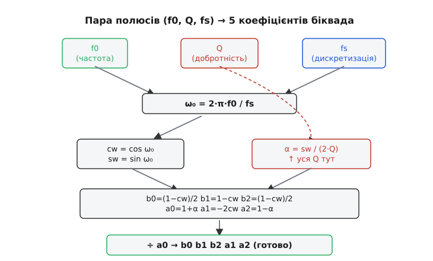
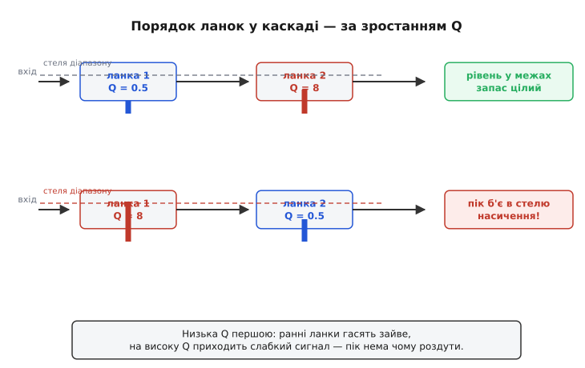

# ⚙️ Від пар полюсів до цифрового біквада: фільтр у коді мікроконтролера

Аналоговий фільтр живе в номіналах резисторів і конденсаторів; цифровий — у п'яти числах і двох рядках арифметики, які крутяться щосемпла. Та задача, по суті, та сама: задати фільтр **набором пар полюсів** (кожна пара — своя власна частота ω₀ і своя добротність Q) і змусити коло поводитися саме так. Різниця лише в тому, що тепер «коло» — це функція в прошивці, яка бере свіже значення з АЦП і повертає відфільтроване. Жодних котушок, жодного підбору ємностей під ряд E12, жодного дрейфу від температури: ті самі полюси, але цілком у числах.

Сила цього підходу в тому, що **математика пар полюсів не змінюється** при переході в цифру. Фільтр високого порядку так само складають із ланок 2-го порядку — біквадів, кожен зі своєю парою (ω₀, Q). Той самий рецепт Q задає Баттерворт, Бесселя чи Чебишова. Та сама дуга сталого ω₀ на s-площині. Усе, що треба, — це **формула-перекладач**, яка з пари (f0, Q, fs) видає п'ять коефіцієнтів цифрового біквада, плюс акуратне каскадування ланок. Це і є вся вставка: робочий C, який бере опис фільтра парами полюсів і перетворює його на код, що реально фільтрує потік семплів.

Спершу — три речі, без яких далі нічого не складеться: що таке цифровий біквад і його різницеве рівняння; як білінійне перетворення переносить аналогову пару полюсів у цифрову; і де тут ховаються пастки (порядок ланок, переповнення, втрата точності за високих Q). Потім зберемо все в одну невелику бібліотеку фільтра на C, придатну крутитися на мікроконтролері без жодної зовнішньої залежності.

> 🔧 **Навіщо це.** Цей код — серце майже будь-якої цифрової обробки в прошивці: згладити шумний сигнал з АЦП, прибрати мережеву наводку 50 Гц, виділити смугу, обмежити спектр перед прорідженням. Замість аналогового фільтра на операційнику, що дрейфує й займає місце на платі, ви ставите кілька десятків байтів коефіцієнтів і дві операції множення-додавання на семпл. Перебудувати зріз — не випаяти конденсатор, а перерахувати п'ять чисел. Той самий контролер може тримати десяток різних фільтрів і перемикати їх на льоту. Але ціна цифри — скінченна точність: за необережного каскадування високодобротний біквад або переповниться, або «розсиплеться» в шум від браку розрядів. Хто розуміє, **звідки** беруться коефіцієнти й **чому** ланки впорядковують саме так, той кладе фільтр у прошивку надійно; хто копіює формулу наосліп — ловить тріск і насичення там, де чекав чистого сигналу.

## Що таке цифровий біквад: п'ять чисел і одне різницеве рівняння

Аналогова ланка 2-го порядку описується [передавальною функцією](root:hw-analog/transfer-function) — дробом від комплексної змінної s, із квадратним многочленом у знаменнику. Цифровий біквад — рівно той самий дріб, тільки від іншої змінної, z⁻¹ (затримка на один семпл). Звідси й назва **біквад** (від «biquadratic» — два квадратні многочлени, зверху й знизу):

```
        b0 + b1·z⁻¹ + b2·z⁻²
H(z) = ──────────────────────
         1 + a1·z⁻¹ + a2·z⁻²
```

П'ять коефіцієнтів — b0, b1, b2, a1, a2 — повністю задають ланку. Три «b» нагорі (чисельник) ліплять нулі передавальної функції — те, що фільтр **гасить**. Два «a» внизу (знаменник) ліплять полюси — ту саму пару, що несе резонанс, ω₀ і Q. Знаменник почато з одиниці навмисне: коефіцієнт a0 завжди нормують до 1, поділивши всі п'ять на нього, щоб у різницевому рівнянні не лишилося зайвого ділення.

Що означає z⁻¹ «фізично»? Це затримка рівно на один такт дискретизації. Якщо потік семплів іде з частотою fs (скажімо, 8000 разів на секунду), то z⁻¹ — це «значення, яке було один семпл тому», а z⁻² — «два семпли тому». Помножити на z⁻¹ — означає взяти старіше значення. Тому передавальну функцію H(z) можна прямо переписати в **різницеве рівняння** — рецепт, як з вхідних і попередніх значень порахувати свіжий вихід:

```
y[n] = b0·x[n] + b1·x[n−1] + b2·x[n−2] − a1·y[n−1] − a2·y[n−2]
       └─── свіжий і два старі входи ───┘  └─ два старі виходи ─┘
```

Прочитаймо це повільно, бо тут вся суть. Кожен новий вихід y[n] — це зважена сума: трохи свіжого входу x[n], трохи входу позаминулих двох тактів, **мінус** трохи власних минулих виходів. Той зворотний зв'язок по виходу (члени з «a») — це і є цифровий аналог резонансу: вихід частково «годує сам себе», і саме він робить пару полюсів, дзвін, добротність. Знак мінус перед «a» — наслідок того, що в знаменнику стояв плюс; перенісши члени знаменника на бік виходу, вони змінюють знак.

> 🔧 **Навіщо це.** Усе різницеве рівняння — це **п'ять множень і чотири додавання** на один семпл, плюс зсув п'яти збережених значень. На будь-якому сучасному мікроконтролері з апаратним множенням це лічені такти. Ось чому цифровий фільтр такий дешевий: на відміну від згортки зі скінченною імпульсною відповіддю (FIR — фільтр, що рахує вихід як зважену суму лише минулих **входів**, без зворотного зв'язку по виходу), де на гострий зріз треба десятки чи сотні коефіцієнтів, біквад дає повноцінну пару полюсів усього п'ятьма числами — саме завдяки тому зворотному зв'язку по виходу, що несе полюси. Розуміючи це рівняння, ви бачите рівно, скільки пам'яті (п'ять станів на ланку) і скільки обчислень (десяток операцій на ланку) коштує ваш фільтр, — і чи вкладеться він у бюджет переривання АЦП.

## Direct Form I і Direct Form II: те саме рівняння, різна пам'ять

Різницеве рівняння можна **порахувати** двома способами, і вибір між ними — не педантизм, а питання точності й пам'яті. Обидві форми дають математично той самий результат; різняться вони тим, **які проміжні значення зберігають** між семплами.

**Direct Form I** — буквальний переклад рівняння. Зберігаємо два минулі входи (x[n−1], x[n−2]) і два минулі виходи (y[n−1], y[n−2]), чотири стани на ланку, і рахуємо точно як написано. Це найпрозоріший варіант: код один-в-один повторює формулу. Його перевага — він стійкіший до переповнення в арифметиці з фіксованою комою, бо проміжна сума накопичується в одному акумуляторі, перш ніж перетворитися на вихід.

**Direct Form II** хитріший: помічає, що чисельник і знаменник можна порахувати через **одну** спільну проміжну змінну w[n] і обійтися лише **двома** станами (w[n−1], w[n−2]) замість чотирьох. Спершу рахуємо внутрішній стан, тоді з нього — вихід:

```
w[n] = x[n] − a1·w[n−1] − a2·w[n−2]          ← знаменник (полюси)
y[n] = b0·w[n] + b1·w[n−1] + b2·w[n−2]        ← чисельник (нулі)
```

Удвічі менше пам'яті на ланку — спокуса. Але є пастка, через яку для фіксованої коми частіше радять не «голий» Direct Form II, а його **транспоновану** версію (Transposed Direct Form II). У звичайному Direct Form II внутрішня змінна w[n] може **рости більше за вхід і вихід** — на резонансі високодобротної ланки вона роздувається й переповнюється раніше, ніж переповнився б сам сигнал. Транспонована форма переставляє порядок операцій так, що проміжні величини тримаються в розумних межах, і додатково краще поводиться при зміні коефіцієнтів на льоту. У числах із плаваючою комою (float/double) ця різниця майже не помітна — там запас розрядів величезний; а от у цілочисловій арифметиці на дешевому контролері вона вирішує, тріщить фільтр чи ні.

```
Direct Form I     — 4 стани/ланку, проміжна сума в акумуляторі; стійкий до переповнення
Direct Form II    — 2 стани/ланку, але w[n] роздувається на резонансі (обережно з fixed-point)
Transposed DF-II  — 2 стани/ланку, проміжні значення обмежені; найкращий для fixed-point і
                    для коефіцієнтів, що змінюються на ходу
```

> 🔧 **Навіщо це.** Для більшості прошивок, що рахують у float (а сьогодні навіть дешеві Cortex-M4 мають апаратний float), бери **Direct Form I**: він прозорий, налагоджується очима по формулі й не має проблеми роздування внутрішнього стану. Якщо ж процесор без апаратного множення з плаваючою комою і ти змушений рахувати в цілих (Q-формат, фіксована кома) — переходь на **Transposed Direct Form II** й уважно стеж за масштабуванням. Нижче я кодую Direct Form I як надійний робочий стандарт; перехід на іншу форму — заміна лише функції `process`, коефіцієнти ті самі.

## Серце задачі: білінійне перетворення пари полюсів у коефіцієнти

Тепер головне — **звідки** беруться ці п'ять коефіцієнтів із пари полюсів (f0, Q, fs). Аналоговий світ живе в змінній s, цифровий — у z. Між ними потрібен міст, і найужитковіший зветься **білінійним перетворенням** (англ. *bilinear transform*, BLT). Ідея проста: усю ліву півплощину s (де живуть стійкі полюси) воно стискає в одиничне коло z (де живуть стійкі цифрові полюси), не випускаючи назовні. Стійке лишається стійким, а вся нескінченна аналогова вісь частот намотується на скінченне коло.

За цю акуратність доводиться платити одним викривленням. Білінійне перетворення **не зберігає частоту лінійно**: воно стискає всю нескінченну аналогову смугу частот у скінченний цифровий діапазон (від нуля до половини частоти дискретизації — це межа Найквіста, найвища частота, яку взагалі може нести потік семплів). Близько нуля стиснення майже непомітне, але що ближче до половини fs, то сильніше частоти «згущуються». Якщо просто підставити бажану f0, реальний зріз цифрового фільтра з'їде вниз — тим помітніше, чим f0 ближча до fs/2.

Лікують це **передкомпенсацією частоти** (англ. *pre-warping*): перш ніж рахувати, бажану цифрову частоту f0 переганяють в «аналогову» так, щоб після викривлення вона лягла рівно туди, куди треба. Перетворення-перекручення — тангенс:

```
ω₀ = 2·π·f0 / fs                          ← цифрова кутова частота (радіани/семпл)
f_warp = (fs/π)·tan(π·f0/fs)              ← аналогова частота, що ляже точно на f0
```

На щастя, у закритій формулі коефіцієнтів біквада це передкручення вже **вшите**: воно сидить у тому, що ми беремо синус і косинус саме від цифрової ω₀ = 2π·f0/fs, а не від аналогової частоти. Тому в коді окремий рядок з тангенсом не потрібен — досить рахувати тригонометрію від ω₀, і білінійне перетворення з передкомпенсацією відпрацьовує саме себе. Це класичні формули «кулінарної книги» цифрових фільтрів Роберта Брістоу-Джонсона (Robert Bristow-Johnson, *Audio EQ Cookbook*) — усталений, перевірений десятиліттями набір, що його повторюють і веб-аудіо стандарт W3C, і незліченні прошивки. Для **фільтра нижніх частот** (ФНЧ) другого порядку вони такі:

```
ω₀ = 2·π·f0 / fs
cw = cos(ω₀)
α  = sin(ω₀) / (2·Q)              ← уся добротність входить ось тут

b0 = (1 − cw) / 2
b1 =  1 − cw
b2 = (1 − cw) / 2
a0 =  1 + α
a1 = −2·cw
a2 =  1 − α
```

Зверніть увагу, де саме сидить наша добротність: Q з'являється **лише** в коефіцієнті α (грец. *alpha*), і тільки α відрізняє резонансний біквад від млявого. Чим **менший** α (більший Q), тим ближче полюси до краю одиничного кола, тим гостріший резонанс — точно як в аналоговому світі мала дійсна частина σ тулила полюс до уявної осі. α — це цифровий запис згасання, обернений до Q. Косинус ω₀ задає, **де** на колі сидить пара (частоту), синус — масштаб. Чисельник (три «b») для ФНЧ симетричний (b0 = b2, b1 = подвоєне), і він ставить два нулі в точку z = −1 — на половину частоти дискретизації, найвищу цифрову частоту, — тож на самій верхівці смуги сигнал гаситься повністю.

Лишається поділити всі п'ять на a0, щоб привести знаменник до канонічної одиниці, — і коефіцієнти готові.


*Конвеєр перекладу: з пари полюсів (власна частота f0, добротність Q) і частоти дискретизації fs рахуємо цифрову кутову частоту ω₀, з неї cos і sin, далі α = sin(ω₀)/(2Q) — сюди входить уся добротність. П'ять коефіцієнтів b0…a2 нормуємо діленням на a0. Те саме перетворення, яким аналогову пару полюсів переносять на одиничне коло z, — білінійне, з уже вшитою передкомпенсацією частоти.*

> 🔧 **Навіщо це.** Один цей блок — і ви проєктуєте цифровий фільтр прямо в прошивці, з ходу. Прилад має підлаштувати зріз під режим? Передайте нову f0 — функція видасть свіжі коефіцієнти за десяток множень і один синус-косинус. Це різко інакше, ніж аналог: там зміна зрізу — інше залізо, тут — п'ять чисел. І жодних таблиць коефіцієнтів у пам'яті: рахуйте їх із (f0, Q, fs) на місці, коли треба. Єдина осторога — стежити, щоб f0 не підповзала впритул до fs/2: біля межі Найквіста передкомпенсація сильно розтягує частоту, форма фільтра спотворюється, і краще або підняти fs, або не вимагати зрізу так близько до стелі.

## Таблиця добротностей: Баттерворт, Бессель, Чебишов кількох порядків

Перш ніж рахувати коефіцієнти, треба знати, **які саме пари полюсів** задати. Тут цифра нічого не змінює порівняно з аналогом: фільтр високого порядку — це каскад біквадів, кожен зі своєю Q, а **тип** фільтра (родина) — це готовий **рецепт** того, які Q взяти. Інженер не виводить ці числа щоразу; вони пораховані раз і назавжди й живуть у таблицях.

Ось добротності пар полюсів для трьох класичних родин кількох порядків. Кожен рядок — одна родина одного порядку; числа — Q кожної ланки 2-го порядку (порядок ланок — за **зростанням** Q, як ми зараз побачимо, це важливо):

```
Родина / порядок        Q ланок (за зростанням)        характер
─────────────────────────────────────────────────────────────────────
Баттерворт   2-й        0.707                          максимально пласка АЧХ
Баттерворт   4-й        0.541 · 1.307                  без піка, зріз −80 дБ/дек
Баттерворт   6-й        0.518 · 0.707 · 1.932          без піка, зріз −120 дБ/дек

Бесселя      2-й        0.577                          рівна затримка, чистий фронт
Бесселя      4-й        0.522 · 0.806                  майже без викиду в часі
Бесселя      6-й        0.510 · 0.611 · 1.023          найкраща форма імпульсу

Чебишов 1дБ  2-й        0.957                          крутий зріз, брижі 1 дБ
Чебишов 1дБ  4-й        0.785 · 3.560                  висока Q другої ланки!
Чебишов 1дБ  6-й        0.761 · 2.198 · 8.001          дуже висока Q — обережно
```

Два спостереження, що відразу стають практичними правилами. По-перше, **що пласкіша родина, то нижчі Q**: Бесселя тримає всі полюси оддалік уявної осі (Q ≤ ~1), Баттерворт — посередині, Чебишов підпускає полюси впритул (Q окремої ланки сягає 8 і вище). По-друге, **усередині кожного фільтра Q ланок дуже різні** — від пів-одиниці до кількох одиниць. Саме ця розкид-комбінація, перемножившись, і дає крутий рівний зріз, якого жодна ланка поодинці не зробила б; механізм того, як [пари полюсів складаються у крутий фільтр](root:hw-analog/filter-pole-q), — у самій темі. Тут важить наслідок: **висока Q окремої ланки — неминуча, і саме вона джерело всіх цифрових пасток** нижче.

Числа взято зі стандартних таблиць проєктування активних фільтрів (зведення Texas Instruments *Op Amps for Everyone* і довідник Analog Devices *Basic Linear Design*, розділ про фільтри; ті самі значення повторюють незалежні джерела — це усталений канон). Баттервортівські Q легко перевірити й самому: полюси Баттерворта рівномірно розставлені по півколу, тож Q = 1/(2·cos θ) для кутів θ кожного полюса — для 4-го порядку це дає рівно 0.541 і 1.307. Чесна заувага: для Чебишова числа залежать від **величини брижів** (0.5 дБ, 1 дБ, 3 дБ — що більші брижі, то вищі Q), а для Бесселя й Чебишова ще й частоту кожної ланки трохи зсувають відносно загального зрізу; беріть Q і частотні множники **з однієї таблиці**, не змішуючи джерела. Нижче я кладу у код тільки добротності — для ілюстрації перекладу в коефіцієнти цього досить; повний промисловий розрахунок ще множив би частоту кожної ланки на її табличний коефіцієнт.

## Робочий C: структура фільтра й розрахунок коефіцієнтів ланки

Збираймо. Почнемо з опису однієї ланки — біквада: п'ять коефіцієнтів плюс пам'ять стану (для Direct Form I — два минулі входи й два минулі виходи). Жодних залежностей, крім `math.h`: такий код має крутитися на мікроконтролері.

```c
#include <math.h>
#include <stdint.h>
#include <stddef.h>

#ifndef M_PI
#define M_PI 3.14159265358979323846
#endif

// Одна біквад-ланка (Direct Form I): 5 коефіцієнтів + 4 значення стану.
typedef struct {
    float b0, b1, b2;     // чисельник (нулі — що фільтр гасить)
    float a1, a2;         // знаменник (полюси — пара ω₀, Q); a0 нормовано до 1
    float x1, x2;         // два минулі входи  x[n−1], x[n−2]
    float y1, y2;         // два минулі виходи y[n−1], y[n−2]
} biquad;
```

Тепер серцева функція — розрахунок коефіцієнтів ФНЧ-ланки з пари полюсів (f0, Q) і частоти дискретизації fs. Це прямий переклад формул кулінарної книги: рахуємо ω₀, з неї cos і sin, складаємо α = sin(ω₀)/(2Q), виписуємо п'ять «сирих» коефіцієнтів і відразу ділимо на a0.

```c
// Розрахувати коефіцієнти ФНЧ-біквада для пари полюсів (f0, Q) при частоті fs.
// Білінійне перетворення з передкомпенсацією частоти вшите в sin/cos(ω₀).
// f0, fs — у герцах; Q — добротність пари полюсів. Стан НЕ чіпаємо.
static void biquad_lowpass(biquad *bq, float f0, float Q, float fs)
{
    float w0 = 2.0f * (float)M_PI * f0 / fs;   // цифрова кутова частота
    float cw = cosf(w0);
    float sw = sinf(w0);
    float alpha = sw / (2.0f * Q);             // уся добротність — тут

    float b0 = (1.0f - cw) * 0.5f;
    float b1 =  1.0f - cw;
    float b2 = (1.0f - cw) * 0.5f;
    float a0 =  1.0f + alpha;
    float a1 = -2.0f * cw;
    float a2 =  1.0f - alpha;

    // нормуємо на a0 — щоб у різницевому рівнянні не лишилося ділення
    float inv_a0 = 1.0f / a0;
    bq->b0 = b0 * inv_a0;
    bq->b1 = b1 * inv_a0;
    bq->b2 = b2 * inv_a0;
    bq->a1 = a1 * inv_a0;
    bq->a2 = a2 * inv_a0;
}

// Обнулити пам'ять ланки (перед першим запуском або після паузи в потоці).
static void biquad_reset(biquad *bq)
{
    bq->x1 = bq->x2 = bq->y1 = bq->y2 = 0.0f;
}
```

**Порахуймо коефіцієнти ФНЧ Баттерворта 2-го порядку, зріз 1 кГц, дискретизація 48 кГц.** Беремо f0 = 1000, Q = 0.7071, fs = 48000:

```
w0    = 2·π·1000 / 48000 = 0.130900 рад
cw    = cos(0.130900)    = 0.991445
sw    = sin(0.130900)    = 0.130526
alpha = 0.130526 / (2·0.7071) = 0.092297

сирі:  b0 = (1−0.991445)/2 = 0.0042776
       b1 =  1−0.991445    = 0.0085551
       b2 = 0.0042776
       a0 =  1+0.092297    = 1.092297
       a1 = −2·0.991445    = −1.982890
       a2 =  1−0.092297    = 0.907703

÷a0:   b0 = 0.003916   b1 = 0.007832   b2 = 0.003916
       a1 = −1.815340  a2 = 0.831004
```

П'ять чисел — і ФНЧ Баттерворта на 1 кГц готовий. Перевірка здорового глузду: сума всіх «b», поділена на (1 + a1 + a2), має дати 1 — підсилення на постійному струмі (нульова частота), бо ФНЧ пропускає її цілою. Рахуємо: (0.003916 + 0.007832 + 0.003916) / (1 − 1.815340 + 0.831004) = 0.015664 / 0.015664 = 1.000 — рівно одиниця, як і має бути. Якщо ця перевірка дає не одиницю, а щось геть інше — у коефіцієнтах помилка, і це найдешевший спосіб її спіймати ще до запуску.

> 🔧 **Навіщо це.** Перевірка «сума b / (1+a1+a2) = підсилення на нулі» — ваш найкоротший тест коефіцієнтів. Для ФНЧ воно має бути 1 (пропускає постійну складову), для ФВЧ — 0 (гасить її). Один рядок у тесті ловить переплутані знаки, забуте ділення на a0 чи зайвий множник. У прошивці, де фільтр перебудовується на льоту, варто лишити цю перевірку в зневаджувальному збиранні (assert) — вона миттєво сигналить, якщо нова f0 чи Q дали безглузді коефіцієнти.

## Обробка семпла й каскад ланок

Коефіцієнти є — лишилося пустити крізь ланку потік. Функція обробки одного семпла буквально втілює різницеве рівняння Direct Form I, тоді зсуває пам'ять:

```c
// Прогнати один семпл крізь ланку (Direct Form I). Повертає вихід y[n].
static float biquad_process(biquad *bq, float x)
{
    float y = bq->b0 * x
            + bq->b1 * bq->x1 + bq->b2 * bq->x2
            - bq->a1 * bq->y1 - bq->a2 * bq->y2;

    bq->x2 = bq->x1;   bq->x1 = x;     // зсув минулих входів
    bq->y2 = bq->y1;   bq->y1 = y;     // зсув минулих виходів
    return y;
}
```

Десять арифметичних дій і чотири присвоєння на семпл — оце й уся ціна пари полюсів у цифрі. Тепер каскад. Фільтр N-го порядку — це масив біквадів, прогнаних **послідовно**: вихід першої ланки йде на вхід другої, і так далі. Магнітуди ланок при цьому перемножуються (а в децибелах — складаються), бо кожна ланка чесно множить сигнал на свою передавальну функцію:

```c
// Каскад біквадів: фільтр довільного (парного) порядку.
typedef struct {
    biquad *stage;     // масив ланок
    uint8_t n;         // кількість ланок (порядок = 2·n)
} biquad_cascade;

// Прогнати один семпл крізь увесь каскад (ланка за ланкою).
static float cascade_process(biquad_cascade *c, float x)
{
    for (uint8_t i = 0; i < c->n; i++)
        x = biquad_process(&c->stage[i], x);   // вихід → вхід наступної
    return x;
}

// Скинути пам'ять усіх ланок каскаду.
static void cascade_reset(biquad_cascade *c)
{
    for (uint8_t i = 0; i < c->n; i++)
        biquad_reset(&c->stage[i]);
}
```

Тепер зберемо реальний фільтр із таблиці добротностей. Спроєктуймо **ФНЧ Баттерворта 4-го порядку** на 1 кГц при 48 кГц. З таблиці беремо дві ланки з Q = 0.541 і Q = 1.307 (обидві на тій самій частоті зрізу — у Баттерворта частоти ланок не зсуваються):

```c
// Опис однієї ланки в рецепті родини: множник частоти і добротність.
typedef struct { float fmul; float Q; } stage_spec;

// Баттерворт 4-го порядку: дві ланки, нижчий Q першим (див. далі — це не випадково).
static const stage_spec BUTTERWORTH_4[] = {
    { 1.0f, 0.5412f },     // ланка 1 — низькодобротна
    { 1.0f, 1.3066f },     // ланка 2 — високодобротна
};

// Зібрати каскад ФНЧ заданої родини під частоту зрізу fc.
// specs[] — рецепт (fmul, Q) на ланку; bq[] — масив під n ланок.
static void build_lowpass(biquad bq[], const stage_spec specs[],
                          uint8_t n, float fc, float fs)
{
    for (uint8_t i = 0; i < n; i++) {
        biquad_lowpass(&bq[i], fc * specs[i].fmul, specs[i].Q, fs);
        biquad_reset(&bq[i]);
    }
}
```

Виклик `build_lowpass(bq, BUTTERWORTH_4, 2, 1000.0f, 48000.0f)` заповнює два біквади — і `cascade_process` уже фільтрує потік як повноцінний Баттерворт 4-го порядку зі спадом −80 дБ на декаду. Окремо перша ланка (Q = 0.54) пологенько сповзає, друга (Q = 1.31) дає горб перед зрізом; разом їхні характеристики перемножуються в ідеально рівну полицю. Це той самий принцип, що й в [активному фільтрі Саллена–Кі](root:hw-analog/active-filters) — лише ланки тепер не з резисторів і конденсаторів, а з п'яти чисел кожна.

## Перша пастка: порядок ланок за зростанням Q проти переповнення

Ось перша з пасток, яких арифметика не показує, а заліза в цифрі немає — то де ж вона? У динамічному діапазоні чисел. Високодобротна ланка **піднімає** сигнал на своєму резонансі: ланка з Q = 8 на частоті зрізу множить амплітуду приблизно увосьмеро (на +18 дБ). Якщо у вхідному сигналі є складова коло цієї частоти, на виході ланки вона вискочить увосьмеро більшою — і якщо це перша ланка каскаду, такий сплеск піде далі, у решту фільтра, на повну.

Звідси правило, на перший погляд дивне: **ланки впорядковують за зростанням Q** — низькодобротну ставлять першою, високодобротну останньою. Чому це рятує? Бо низькодобротна перша ланка вже трохи **прибирає** ті частоти, на яких висока ланка дала б найбільший підйом. Коли сигнал доходить до високодобротної ланки наприкінці каскаду, він уже відфільтрований, і на пікових частотах слабкий — тож навіть восьмиразовий підйом не заганяє його в стелю. Постав ту саму високу ланку **першою** — і вона роздує сирий вхід до того, як хоч щось відфільтровано; пік упреться в межу діапазону (насичення у float, переповнення у fixed-point), і сигнал спотвориться ще на вході фільтра.

```
Порядок ланок          що відбувається
──────────────────────────────────────────────────────────────
низька Q → висока Q    перші ланки гасять зайве; на вхід високої Q
(ПРАВИЛЬНО)            приходить уже слабкий на пікових частотах сигнал —
                       пік нема чому роздути; запас діапазону цілий

висока Q → низька Q    перша ланка роздуває сирий вхід на резонансі ВІДРАЗУ;
(НЕБЕЗПЕЧНО)           пік б'є в стелю діапазону → насичення / переповнення
                       ще до того, як фільтр щось прибрав
```

Саме тому в `BUTTERWORTH_4` вище Q = 0.541 стоїть **перед** Q = 1.307, і в таблиці добротностей я навмисне виписав Q «за зростанням». Це не косметика порядку рядків — це фізичний захист динамічного діапазону, і він важить тим більше, чим вища найбільша Q у фільтрі (тобто найдужче — для Чебишова з його Q під 8).


*Той самий каскад, два порядки ланок. Згори (низька Q першою): перша ланка гасить зайве, на високодобротну приходить слабкий на резонансі сигнал — пік нема чому роздути, рівень тримається в межах. Знизу (висока Q першою): перша ж ланка роздуває сирий вхід на резонансі до насичення, ще нічого не відфільтрувавши. Правило — ланки за зростанням Q.*

> 🔧 **Навіщо це.** У float запас розрядів великий, і переповнення трапляється лише за дуже високих Q чи сильного сигналу — але насичення все одно псує звук/дані, тож порядок дотримуй завжди, це безкоштовно. У fixed-point (цілочислова арифметика на контролері без апаратного float) це питання життя і смерті фільтра: там діапазон вузький, і висока ланка попереду переповнить акумулятор гарантовано. Правило «низька Q → висока Q» коштує нуль тактів — це лише порядок елементів у масиві, — а рятує від найбруднішої й найважчої для діагнозу вади: випадкового тріску на певних частотах сигналу.

## Друга пастка: нормування підсилення каскаду

Друга пастка тонша, бо фільтр при ній «працює», тільки тихіше або гучніше, ніж ви думали. ФНЧ-біквад за формулами кулінарної книги має підсилення рівно 1 на постійному струмі (нульовій частоті) — це добре. Але коли ланок кілька, а надто коли серед них високодобротні, **усередині** каскаду сигнал може злітати високо на резонансних частотах, навіть якщо на вході й виході фільтра рівень помірний. Та сама ланка з Q = 8 на своїй частоті дає +18 дБ; її проміжний вихід у вісім разів вищий за вхід саме там.

Це двосічна проблема. У бік **перевантаження** її лікує правильний порядок ланок (попередня пастка) — він тримає пік ближче до виходу, де сигнал уже слабкий. У бік **точності** — навпаки: якщо вхідний сигнал малий, а ланки нічого не підсилюють, у fixed-point молодші розряди губляться (про це наступна пастка). Тому в серйозній прошивці підсилення нормують свідомо: вимірюють (або рахують) **найбільший проміжний підйом** у каскаді й масштабують сигнал так, щоб він займав діапазон якомога повніше, ніде не впираючись у стелю.

Найпростіший практичний прийом — додати каскадові **загальний коефіцієнт підсилення**, який ставимо так, щоб кінцевий вихід мав потрібний рівень, а проміжні ланки не насичувалися. У ФНЧ зручно прикласти його до першої ланки (помножити її три «b» на коефіцієнт):

```c
// Прикласти загальний множник підсилення до ланки (масштабує лише чисельник —
// полюси не чіпаємо, форма АЧХ та сама, змінюється тільки рівень).
static void biquad_scale_gain(biquad *bq, float g)
{
    bq->b0 *= g;
    bq->b1 *= g;
    bq->b2 *= g;
}

// Підсилення каскаду на ПОСТІЙНОМУ струмі (нульовій частоті): добуток
// підсилень ланок, кожне = (b0+b1+b2)/(1+a1+a2). Має бути ≈ 1 для ФНЧ.
static float cascade_dc_gain(const biquad_cascade *c)
{
    float g = 1.0f;
    for (uint8_t i = 0; i < c->n; i++) {
        const biquad *b = &c->stage[i];
        g *= (b->b0 + b->b1 + b->b2) / (1.0f + b->a1 + b->a2);
    }
    return g;
}
```

**Перевірка підсилення Баттерворта-4 на нулі.** Кожна ланка ФНЧ за кулінарною формулою вже нормована на 1 по постійному струму, тож добуток теж має дати 1:

```
ланка 1 (Q=0.541): (b0+b1+b2)/(1+a1+a2) = 1.000
ланка 2 (Q=1.307): те саме                = 1.000
каскад: 1.000 · 1.000 = 1.000   ← рівень на нулі правильний
```

Якщо ж ви будуєте смуговий чи інший фільтр, де ланки **не** нормовані на 1, `cascade_dc_gain` (чи його аналог на потрібній частоті) скаже точне сумарне підсилення, і ви компенсуєте його одним множником, щоб гучність на виході була, яку замовляли.

> 🔧 **Навіщо це.** Нормування — це різниця між фільтром, що «тихо шипить» чи «голосно хрипить», і фільтром, що звучить рівно. У звуковому тракті непомічене підсилення +6 дБ від каскаду заведе наступний каскад у кліп; непомічене −6 дБ потоне в шумі квантування. У вимірювальному тракті це прямо псує число: відфільтрований сигнал, помножений на невідомий коефіцієнт, дасть хибну амплітуду. Один рядок `cascade_dc_gain` у тесті — і ви знаєте точний рівень ще до запуску, а не калібруєте наосліп по осцилографу.

## Третя пастка: втрата точності за дуже високих Q

Найпідступніша пастка не видно ні в перевантаженні, ні в гучності — вона з'їдає сигнал зсередини, тихо. Згадаймо, де сидить добротність: α = sin(ω₀)/(2Q). Що **вища** Q, то **менший** α, а отже коефіцієнти a2 = (1−α)/(1+α) і пара полюсів підповзають **впритул до краю одиничного кола** z. Полюси на самому краю кола — це цифровий запис майже-незгасного резонансу: те саме, що в аналозі полюс упритул до уявної осі. І тут чигають два лиха.

**Перше — катастрофічне віднімання.** За малих ω₀ (низька частота зрізу проти fs) cos(ω₀) близький до 1, а коефіцієнти a1 = −2·cos(ω₀) ≈ −2 і a2 ≈ 1. У різницевому рівнянні рахується сума, де великі майже-рівні члени **віднімаються**, лишаючи крихітну різницю. У числах зі скінченною мантисою (особливо float, 24 біти) ця різниця обчислюється з катастрофічною втратою значущих цифр: молодші розряди, що несли корисний сигнал, з'їдаються округленням великих доданків. Результат — фільтр **шумить**: на виході з'являється тихий, але стійкий шум квантування, якого у вхідному сигналі не було. Що нижча частота зрізу відносно fs і що вища Q — то гірше.

**Друге — зсув полюсів від округлення коефіцієнтів.** Коли полюс упритул до кола, **крихітна** похибка в a1 чи a2 (від збереження їх у float із обмеженою мантисою) зсуває полюс помітно — а полюс за межами кола означає **нестійкість**: фільтр самозбуджується, його вихід росте без меж. У float це рідкість, а от у fixed-point із 16-бітними коефіцієнтами високодобротний біквад на низькій частоті може просто «поїхати».

Корінь обох лих один: **дуже висока Q плюс дуже низька частота зрізу відносно fs**. Звідси й ліки:

```
Симптом                          Корінь                         Ліки
──────────────────────────────────────────────────────────────────────────────
тихий шум на виході,             катастрофічне віднімання       рахувати стан у double;
якого не було у вході            великих майже-рівних членів    або Transposed DF-II;
                                 (мала різниця, з'їдені розряди) або підняти fs / опустити
                                                                порядок-Q

вихід «поїхав», росте            похибка коефіцієнта зсунула     більше розрядів у
без меж (нестійкість)            полюс за межі одиничного кола   коефіцієнтах; не гнатися
                                                                за гранично високою Q
```

Перше практичне правило: якщо частота зрізу набагато менша за fs (скажімо, зріз 1 Гц при fs = 1000 Гц — відношення 1:1000), **не** фільтруйте на повній fs. Спершу **проредіть** потік (відкиньте кожен n-й семпл, попередньо обмеживши спектр простішим фільтром, щоб високі частоти не наклалися на низькі при прорідженні), а фільтр поставте на нижчій частоті дискретизації, де відношення f0/fs здорове. Полюси відсунуться від краю кола, віднімання перестане бути катастрофічним, шум зникне.

Друге правило: проміжний стан (x1, x2, y1, y2 — а надто y1, y2) тримайте в **double**, навіть якщо вхід і вихід — float. Зайва точність у пам'яті стану майже задарма (кілька зайвих байтів на ланку), а вона рятує саме той крихітний залишок різниці, що несе сигнал. На контролері без апаратного double альтернатива — Transposed Direct Form II, який за побудовою менше страждає від цього віднімання.

```c
// Чи безпечне відношення частоти зрізу до fs для прямого рахунку у float?
// Емпіричне правило: f0/fs нижче ~0.001 за помітної Q — час прорідити потік.
static int biquad_ratio_safe(float f0, float fs, float Q)
{
    float ratio = f0 / fs;
    // що вища Q, то ближче полюс до кола — поріг безпеки піднімаємо
    float threshold = 0.001f * (Q > 1.0f ? Q : 1.0f);
    return ratio > threshold;
}
// Приклад: f0=1 Гц, fs=1000 Гц, Q=2 → ratio=0.001, threshold=0.002 → НЕ безпечно:
//          прорідити потік до, скажімо, fs=50 Гц і фільтрувати там.
```

> 🔧 **Навіщо це.** Ця пастка — найчастіша причина, чому «той самий фільтр, що працював у симуляції, шумить у залізі». У симуляторі все рахується в double, полюси біля кола — не біда; у прошивці на float той самий біквад на низькій частоті дає тихий шиплячий фон, і годинами шукають «несправність АЦП», якої немає. Знаючи корінь — катастрофічне віднімання біля краю кола, — ви або тримаєте стан у double, або прорідюєте потік перед фільтром, і шум зникає. Для дуже вузьких, дуже добротних фільтрів (наприклад, гострий режекторний на 50 Гц у звуковому потоці 48 кГц) це не дрібниця, а обов'язкова умова, щоб фільтр узагалі працював, а не самозбуджувався.

## Збираємо все: повний приклад фільтра в потоці

Зведімо частини в один робочий шматок — як це лягло б у переривання АЦП. Будуємо Баттерворт 4-го порядку, перевіряємо коефіцієнти й підсилення, тоді женемо потік семплів:

```c
// ── Глобальний фільтр (живе між перериваннями) ───────────────────────────
static biquad         g_stage[2];      // дві ланки 4-го порядку
static biquad_cascade g_filter = { g_stage, 2 };

// Налаштувати фільтр один раз при старті (чи при зміні режиму).
void filter_setup(float fc, float fs)
{
    build_lowpass(g_stage, BUTTERWORTH_4, 2, fc, fs);
    cascade_reset(&g_filter);

    // перевірка коефіцієнтів: підсилення на нулі має бути ≈ 1 для ФНЧ
    float dc = cascade_dc_gain(&g_filter);
    (void)dc;                           // assert(fabsf(dc - 1.0f) < 0.01f);
}

// Викликається на КОЖЕН семпл з АЦП (у перериванні чи в циклі обробки).
float filter_sample(float adc_value)
{
    return cascade_process(&g_filter, adc_value);
}
```

Уся «магія» аналогового фільтра — пара полюсів, добротність, резонанс — тепер живе у восьми числах коефіцієнтів (`g_stage`) і десятку множень на семпл (`cascade_process`). Перебудувати зріз — викликати `filter_setup` з новою частотою. Перемкнути родину — підставити інший масив `stage_spec`. Жодного паяльника, жодного дрейфу.

**Що дасть цей фільтр на потоці.** Прогнавши `filter_sample` по синусах різних частот при fc = 1000 Гц, fs = 48 кГц, побачимо рівно характеристику Баттерворта 4-го порядку:

```
частота входу    рівень виходу     що бачимо
─────────────────────────────────────────────────────────
   100 Гц          0.00 дБ         глибоко в смузі — проходить цілим
   500 Гц         −0.02 дБ         ще полиця, рівнісінько
  1000 Гц         −3.01 дБ         зріз: рівно −3 дБ (як визначає Баттерворт)
  2000 Гц        −24.3  дБ         круто вниз — дві ланки множаться
  4000 Гц        −48.9  дБ         ≈ −80 дБ/декаду в роботі
```

Стовпчик підтверджує: полиця рівна (округлення коефіцієнтів у float її не зіпсувало), на зрізі рівно −3 дБ, спад −80 дБ на декаду — повноцінний Баттерворт 4-го порядку, цілком у числах.

## Що варто винести

Цифровий фільтр — це аналогова пара полюсів, перекладена в п'ять чисел і два рядки арифметики. **Біквад** — цифрова ланка 2-го порядку: чисельник (три «b») ставить нулі, знаменник (два «a») несе пару полюсів зі своїми ω₀ і Q; усе працює через **різницеве рівняння** y[n] = b0·x[n] + b1·x[n−1] + b2·x[n−2] − a1·y[n−1] − a2·y[n−2], десяток операцій на семпл. Рахувати його можна **Direct Form I** (4 стани, прозоро, стійко до переповнення — робочий стандарт для float) або **Transposed Direct Form II** (2 стани, найкращий для fixed-point).

Серце перекладу — **білінійне перетворення з передкомпенсацією частоти**, вшите в закриті формули кулінарної книги: ω₀ = 2π·f0/fs, α = sin(ω₀)/(2Q) — і вся добротність входить рівно в α, а п'ять коефіцієнтів нормуються діленням на a0. Який саме набір (ω₀, Q) задати — каже **таблиця родини**: Бесселя тримає Q низькими (рівна затримка, чистий фронт), Баттерворт посередині (пласка АЧХ), Чебишов підпускає Q під 8 і вище (крутий зріз ціною піка). Фільтр високого порядку — **каскад** біквадів, прогнаних послідовно, магнітуди множаться.

А поза формулами — три пастки, які арифметика мовчить, бо вони в скінченній точності чисел. **Порядок ланок** — за зростанням Q (низька першою): інакше високодобротна перша ланка роздує сирий вхід на резонансі до насичення, ще нічого не відфільтрувавши. **Нормування підсилення** — рахувати сумарний рівень каскаду (`cascade_dc_gain`) і компенсувати, щоб фільтр не хрипів і не тонув у шумі. **Втрата точності за високих Q** — полюси підповзають до краю одиничного кола, велике майже-рівне віднімання в різницевому рівнянні з'їдає молодші розряди (тихий шум) або зсуває полюс за коло (нестійкість); ліки — тримати стан у double, прорідити потік перед дуже вузьким фільтром, не гнатися за гранично високою Q на повній fs. Хто тримає в одному файлі і чесний переклад пар полюсів, і ці три осторо́ги, той кладе цифровий фільтр у прошивку так, що він фільтрує саме те й саме так, як замовлено, а не тріщить і не дзвенить там, де тиха формула збрехала б.
