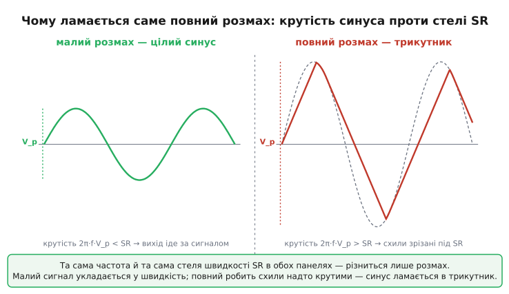
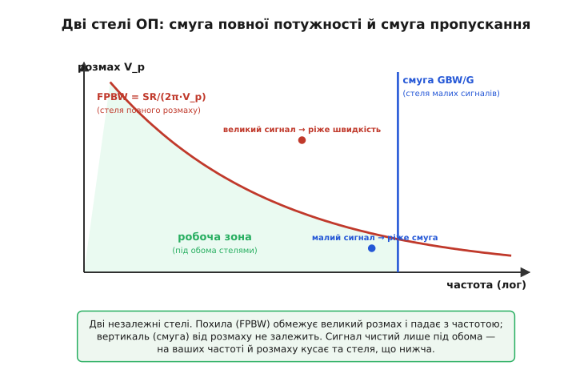

# Смуга повної потужності ОП

Візьміть операційний підсилювач, чий даташит обіцяє смугу в цілий мегагерц, зберіть на ньому підсилювач і подайте на вихід синусоїду на повний розмах живлення — від краю до краю. Підніміть частоту до якихось 20–30 кілогерц, тобто в десятки разів нижче за обіцяний мегагерц. І раптом замість гарної синусоїди на екрані осцилографа постане скособочений трикутник. Жодної несправності: підсилювач робочий, частота далеко в межах «смуги». Просто ви натрапили на іншу, окрему стелю — на ту найвищу частоту, де вихід ще встигає **розгойдатися на повну**. Це і є **смуга повної потужності** *(англ. full-power bandwidth, FPBW; інколи power bandwidth)*.

Назва каже саме те, що в ній написано: смуга, у межах якої підсилювач тримає **повний** розмах сигналу. Нижче за неї повна синусоїда виходить чистою; вище — повний розмах уже не вкладається, і вихід вироджується. Це число живе окремо від звичної смуги пропускання й часто в десятки разів менше за неї. Хто плутає ці дві стелі, той ловить найпідступніші баги аналогових схем; хто тримає їх нарізно, той наперед знає, що його підсилювач витягне, а що ні.

### Звідки взагалі береться ця окрема стеля

Корінь усього — **швидкість наростання** *(slew rate, SR)*: найбільша швидкість, з якою вихід підсилювача фізично здатен **змінювати** напругу, виміряна у вольтах за мікросекунду. Це не та сама річ, що смуга. Смуга обмежує, наскільки добре відтворюється **форма** малесенького сигналу. А швидкість наростання — це жорстка стеля на саму **крутість** виходу: хоч би яким широкосмуговим був підсилювач, його вихід не може дертися вгору швидше за певну межу вольтів за мікросекунду, і крапка.

Чому така межа взагалі існує? Усередині підсилювача є конденсатор корекції — той самий, що навмисне зрізає підсилення на високих частотах заради стійкості зворотного зв'язку. Щоб вихід зрушив напругу, цей конденсатор треба **перезарядити**. А заряджає його вхідний каскад — [диференційна пара](root:hw-analog/opamp-input-stage) — і віддати в конденсатор більше струму, ніж дозволяє її сталий «хвостовий» струм, він не може. Маємо конденсатор C, у який тече найбільший фіксований струм I_max; швидкість зміни напруги на ньому впирається в стелю:

```
SR = I_max / C
```

Ось чому швидкість наростання — стала приладу, така сама паспортна, як смуга. Це не «сигнал зам'явся», а буквально межа: «більше струму на перезарядку немає, тому швидше не вийде». Звідки саме береться це число і чому воно інколи рятує, а інколи руйнує схему, докладніше — у [📜 короткому нарисі про походження швидкості наростання](root:hw-analog/full-power-bandwidth/hist-slew-rate.md).

> 🔧 **Навіщо це.** Перш ніж рахувати, вкладіть у голову саму причину: вихід підсилювача — це конденсатор, який треба перезаряджати скінченним струмом. Звідси й уся тема. Хто бачить за виходом цей конденсатор, той розуміє, чому велике гойдання на високій частоті фізично неможливе, — а не списує спотворення на містику.

### Чому синусоїда на повний розмах ламається першою

Тепер головна ланка міркування. Синусоїда — це не лінія сталої крутості; вона десь полога (на вершинах), а десь крута (на переході через нуль). Найкрутіше вона йде якраз посередині, перетинаючи нуль. І ця максимальна крутість тим більша, чим вищі **і** частота, **і** розмах сигналу.

Подивімося на це формулою. Синусоїда виходу — це v(t) = V_p · sin(2π·f·t), де V_p — пікова амплітуда (від нуля до вершини), f — частота. Її швидкість зміни — це похідна, а похідна синуса — косинус тієї самої частоти, помножений на 2π·f·V_p. Найбільший косинус дорівнює одиниці (це і є момент переходу через нуль), тож найбільша крутість сигналу:

```
макс. крутість = 2π · f · V_p
```

Прочитайте це уважно — тут уся суть. Найкрутіше місце синусоїди росте **прямо пропорційно** і частоті, і амплітуді. Подвоїли частоту — крутість удвічі більша. Подвоїли розмах — знову вдвічі. А вихід підсилювача може йти не крутіше за свою стелю SR. Поки виконано

```
2π · f · V_p ≤ SR
```

вихід слухняно вимальовує синусоїду. Та щойно ліва частина переростає SR — вихід **не встигає** за крутим схилом сигналу й починає підніматися (й опускатися) **прямими лініями** зі своєю граничною швидкістю. Округлі схили синусоїди спрямлюються, і вона вироджується у **трикутник**. Це називають спотворенням від обмеження швидкості *(slew-induced distortion)* — і воно тим помітніше, чим далі за стелю ви залізли.


*Чому ламається саме повний розмах. Зліва крутість сигналу менша за швидкість наростання — вихід цілий. Справа та сама частота, але повний розмах робить схили надто крутими, вихід наростає прямими зі швидкістю SR — синусоїда стає трикутником.*

Звідси прямо видно, чому **повний** розмах ламається раніше за дрібний сигнал тієї ж частоти. Великий V_p робить крутість більшою — тож великий сигнал упирається в стелю SR на нижчій частоті, ніж малий. Маленьке гойдання тієї самої форми крутить вихід полого, легко вкладається у швидкість і проходить бездоганно навіть там, де повний розмах уже давно скособочений.

### Сама формула смуги повної потужності

Тепер лишилося назвати ту найвищу частоту, де повний розмах ще щойно вкладається у швидкість. Це межовий випадок — коли крутість сигналу рівно дорівнює стелі: 2π·f·V_p = SR. Розв'язавши відносно частоти, дістаємо

```
FPBW = SR / (2π · V_p)
```

Це і є смуга повної потужності. Вище за цю частоту повний розмах V_p уже не пройде без спотворення; нижче — пройде чисто. Зверніть увагу на дві речі. По-перше, **V_p тут — пікова амплітуда, від нуля до вершини**, а не розмах від краю до краю. Якщо вихід гойдається на ±10 В (тобто 20 В розмаху від низу до верху), у формулу йде V_p = 10 В. По-друге, FPBW **залежить від амплітуди**: для того самого підсилювача менший розмах дає вищу смугу повної потужності. Тому коректно завжди уточнювати, для якого розмаху названо число; за умовчанням мають на увазі найбільший можливий, близький до напруги живлення.

**Класичний µA741 на повний розмах.** Візьмімо найвідоміший операційний підсилювач µA741 *(Fairchild, 1968)*: швидкість наростання SR = 0.5 В/мкс, а живлення дозволяє розмах близько ±10 В. На якій найвищій частоті він ще тягне повну синусоїду 10 В піка?

```c
// Смуга повної потужності: найвища частота для ПОВНОГО розмаху.
// SR — у вольтах за секунду; V_p — пікова амплітуда (від нуля до вершини).
float sr   = 0.5e6f;    // 0.5 В/мкс = 0.5·10⁶ В/с
float vp   = 10.0f;     // піковий розмах ±10 В → V_p = 10 В
float fpbw = sr / (2.0f * 3.14159f * vp);
// fpbw = 0.5e6 / (6.2832 · 10) = 0.5e6 / 62.83 ≈ 7 958 Гц ≈ 8 кГц
```

Лише близько **8 кГц**! Той самий µA741, чия паспортна смуга — цілий мегагерц, повну 10-вольтову синусоїду тримає аж до 8 кілогерц, тобто **в сто з гаком разів нижче**. Спробуйте прогнати крізь нього повний звуковий діапазон до 20 кГц на гучності «на повну» — і верхні ноти підуть трикутником. Не тому, що бракує смуги, а тому, що великий розмах на цій частоті крутіший, ніж вихід здатен подужати.

> 🔧 **Навіщо це.** Це число вирішує, чи годиться ОП для **гучного**, повноамплітудного сигналу. Дешевий ОП із чудовою смугою може мати жалюгідну смугу повної потужності — і на гучному звуці чи відеосигналі завалить високі частоти, хоча тихий тестовий сигнал проходив ідеально. Перевіряйте FPBW саме під той розмах, який буде в реальній роботі.

### Дві стелі, що кусають різні сигнали

Найважливіше — побачити, що смуга повної потужності й звична смуга пропускання — це **дві окремі стелі**, і вони кусають **різні** сигнали. Сплутати їх — найпоширеніша пастка.

Звична [смуга пропускання](root:hw-analog/bandwidth-3db) випливає з [добутку підсилення на смугу](root:hw-analog/gain-bandwidth-product): на заданому підсиленні G доступна смуга дорівнює GBW/G. Це стеля для **малих** сигналів — про те, наскільки добре відтворюється форма кволого сигналу, що ледь гойдає вихід. Тут амплітуда не важить: хоч мікровольт, хоч міцроампер — однаково.

Смуга повної потужності випливає зі швидкості наростання й залежить від **амплітуди**. Це стеля для **великого** розмаху — для сигналу, що гойдає вихід від краю до краю. Тут підсилення схеми ні до чого; важить лише, які вольти та як швидко мусить видати вихід.

Через це буває, що кволий високочастотний сигнал проходить ідеально, а той самий за формою сигнал, підсилений до кількох вольтів, на тій самій частоті вже «пливе». Котра стеля спрацює першою — залежить від того, чи сигнал малий чи великий. Порахуймо на тому самому µA741 (GBW = 1 МГц, SR = 0.5 В/мкс), щоб побачити обидві.

**Котра стіна ближча — великий і малий сигнал поряд.** Беремо два сигнали тієї самої частоти, але різного розмаху, і дивимося, що їх обмежує.

```c
float gbw = 1.0e6f;     // добуток підсилення на смугу, Гц
float sr  = 0.5e6f;     // швидкість наростання, В/с
float G   = 1.0f;       // повторювач, підсилення 1

// Великий сигнал: повний розмах V_p = 5 В
float vp_big   = 5.0f;
float fpbw_big = sr / (2.0f * 3.14159f * vp_big);   // ≈ 15 915 Гц ≈ 16 кГц
float bw_gbw   = gbw / G;                            // 1 000 000 Гц = 1 МГц

// Великий сигнал упирається в МЕНШУ з двох: 16 кГц (швидкість), не 1 МГц (смуга).

// Малий сигнал: V_p = 50 мВ
float vp_small   = 0.05f;
float fpbw_small = sr / (2.0f * 3.14159f * vp_small); // ≈ 1.59 МГц
// Тут смуга 1 МГц ріже РАНІШЕ за швидкість 1.59 МГц → стіна вже GBW.
```

Великий 5-вольтовий сигнал упирається у швидкість наростання вже на 16 кГц — задовго до мегагерцової смуги. А дрібний 50-мілівольтовий тієї ж форми крутить вихід так полого, що швидкість дозволила б аж 1.6 МГц, — і тут раніше спрацьовує звичайна смуга GBW на 1 МГц. Висновок незмінний: **великі сигнали кусає смуга повної потужності, малі — смуга пропускання**. Одне число ніколи не розповідає всієї історії, тому в реальній схемі дивляться **обидва**.


*Дві незалежні стелі. Похила лінія — смуга повної потужності: що більший розмах, то нижча гранична частота. Горизонталь — звична смуга пропускання, від амплітуди незалежна. Сигнал проходить чисто, лише якщо він під обома лініями водночас; яка з них нижча на ваших частоті й розмаху — та й кусає.*

### Як цим користуватися: одна перевірка перед вибором

Уся практична користь — в одній перевірці. Маєте сигнал розмаху V_p і частоти f? Перевірте **обидві** умови нараз:

```
1) f ≤ GBW / G          (смуга — чи відтвориться форма)
2) f ≤ SR / (2π · V_p)   (повна потужність — чи влізе розмах)
```

Пройшли обидві — підсилювач витягне. Завалили хоч одну — беріть швидший прилад (із більшим GBW і/або більшим SR), зменшуйте розмах, або діліть роботу між каскадами. Найчастіше для гучних, повноамплітудних сигналів критичною виявляється саме друга умова.

**Чи витягне відеопідсилювач композитне відео.** Композитний відеосигнал має розмах близько 1 В піка й несе складові аж до 6 МГц. Який підсилювач треба, щоб не «розмазати» дрібні деталі картинки?

```c
// Потрібна швидкість наростання під заданий розмах і верхню частоту.
float vp     = 1.0f;       // 1 В піка, композитне відео
float f_top  = 6.0e6f;     // верхня частота, 6 МГц
float sr_min = 2.0f * 3.14159f * f_top * vp;   // мінімально потрібний SR
// sr_min = 6.2832 · 6e6 · 1 = 37.7·10⁶ В/с = 37.7 В/мкс
```

Виходить, що навіть для скромного 1-вольтового відео потрібна швидкість наростання близько **38 В/мкс** — у майже сто разів більша за µA741. Ось чому для відео беруть спеціальні швидкісні підсилювачі: справа не в підсиленні, а в тому, щоб вихід устигав за крутими перепадами яскравості. Та сама арифметика, прочитана навпаки: знаючи розмах і верхню частоту, ви одразу бачите, який мінімальний SR шукати в даташиті.

> 🔧 **Навіщо це.** Рядок sr_min = 2π·f·V_p — найшвидший фільтр при доборі підсилювача під гучний або швидкий сигнал. Перемножте верхню частоту на потрібний розмах, помножте на 2π — і ви знаєте мінімальний slew rate. Якщо в даташита SR менший, ця мікросхема трикутитиме повний сигнал; навіть не паяйте.

### Чому менший розмах рятує — і коли це доречно

З формули FPBW = SR / (2π·V_p) випливає несподівано корисний важіль: смуга повної потужності **обернено пропорційна розмаху**. Зменшіть розмах удвічі — і гранична частота повного сигналу подвоїться, без зміни підсилювача. Це не фокус, а пряма арифметика: менший розмах робить кожен схил синусоїди полого, тож той самий вихід устигає за вищою частотою.

Звідси практичне правило. Якщо сигнал упирається у швидкість, а швидший підсилювач узяти не можна, інколи дешевше **зменшити робочий розмах** — а потрібну гучність добрати пізніше, окремим каскадом, який уже не мусить бути таким швидким (бо там сигнал низькочастотніший), або взагалі поза смугою проблеми. Ту саму ідею використовують, обираючи робочу точку: не женуть розмах до краю живлення без потреби, лишаючи запас і за швидкістю.

Є й зворотний бік. Спотворення від обмеження швидкості — підступне тим, що з'являється **раптово** і саме на гучних, високочастотних місцях, які найдужче псують звук чи картинку. Тихий тестовий сигнал крізь підсилювач проходить чисто, інженер ставить галочку — а на реальному гучному матеріалі високі частоти раптом бруднішають. Тому смугу повної потужності перевіряють саме під найбільший очікуваний розмах, не під зручний тихий тест. Те, як саме спрямлені схили трикутника наповнюють сигнал зайвими [гармоніками](root:hw-analog/harmonic-distortion), і чому це чути як різкий, «пісочний» призвук, — окрема й варта уваги історія.

### Що з цього винести

Уся тема стоїть на одному ланцюжку. Вихід підсилювача — це конденсатор, який перезаряджає скінченний струм, тому крутість виходу має жорстку стелю — швидкість наростання SR. Синусоїда найкрутіша на переході через нуль, і ця крутість дорівнює 2π·f·V_p — росте і з частотою, і з розмахом. Прирівнявши крутість до стелі, дістаємо смугу повної потужності FPBW = SR / (2π·V_p): найвищу частоту, де **повний** розмах ще проходить чисто. Вище — синусоїда вироджується в трикутник. Це число окреме від звичайної смуги пропускання й часто в десятки разів менше: смуга пропускання кусає малі сигнали (бо випливає з GBW), смуга повної потужності — великі (бо випливає зі швидкості). Перед вибором підсилювача під гучний сигнал перевіряйте обидві стелі, а для повного розмаху — насамперед другу. Запам'ятавши образ конденсатора, який не встигає зарядитися, ви наперед, ще до паяння, знаєте, чи витягне ваш підсилювач повну синусоїду на потрібній частоті.
