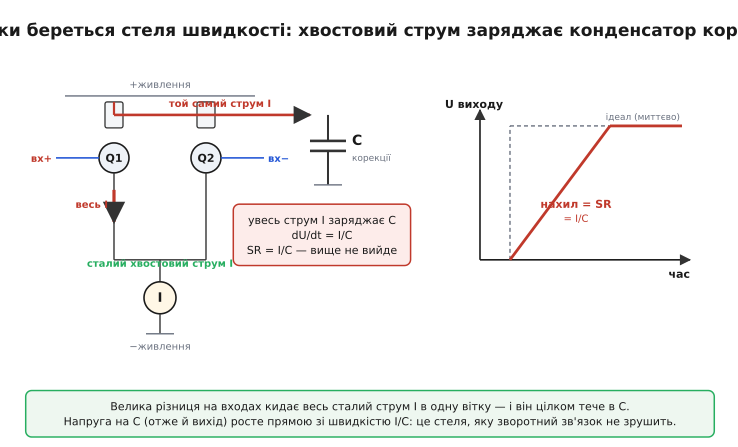

# 📜 Як швидкість наростання стала окремою стелею

Спершу її просто не існувало — не як явища, а як **поняття**. Інженери 1950-х, що складали підсилювачі на лампах і дискретних транзисторах, чудово бачили, як на високій частоті й великому розмаху синусоїда на екрані псується. Але пояснювали це звичним: «не вистачає смуги», «завал на верхах», «каскад не тягне». Окремого числа, окремого рядка в паспорті, який сказав би «ось ця стеля — не про смугу, а про те, як швидко вихід узагалі здатен повзти», ще не було. Він з'явився тоді, коли операційний підсилювач зліз із монтажної плати на кристал кремнію — і виявилося, що сама фізика того кристала створює стелю, якої доти ніхто не вмів назвати.

Ця історія цікава тим, що тут поняття народилося **не з відкриття нового явища, а з усвідомлення старого**. Швидкість наростання обмежувала підсилювачі завжди. Просто доти її ховали інші, грубіші обмеження, а коли ті відступили — вона лишилася стояти голою посеред даташита, вимагаючи окремого імені. Розберімо, як це сталося і чому.

## Що бачили, але не вміли назвати

Уявіть інженера 1960 року з осцилографом. Він подає на свій підсилювач прямокутний імпульс — різкий перепад напруги — і дивиться, як вихід на нього відповідає. Ідеальний підсилювач повторив би перепад миттєво, прямовисною стінкою. Реальний — ні: вихід піднімається **похилою прямою**, з певним нахилом, ніби йому фізично важко дертися вгору швидше. Що крутіший потрібен стрибок, то довше вихід повзе до нової напруги.

Сьогодні ми знаємо: цей нахил і є швидкість наростання, виміряна прямо на екрані у вольтах за мікросекунду. Але інженер 1960 року дивився на ту саму картинку іншими очима. Для нього похилий фронт був проявом **скінченної смуги**: чим вужча смуга, тим повільніша реакція на перепад — це випливало з теорії, яку всі знали. Він і не думав розділяти «повільну реакцію через смугу» і «повільну реакцію через стелю струму». Для малих сигналів ці дві причини й справді дають схожу картинку, тож їх не було потреби розрізняти.

Підступ ховався в одному слові — **великий**. Поки сигнал малий, нахил фронту справді диктує смуга, і одного числа смуги досить, щоб усе передбачити. Але варто розгойдати вихід на повний розмах — і вмикається зовсім інший механізм, який зі смугою не пов'язаний ніяк. Ось ця **залежність від розмаху** і є вододіл. Її й треба було колись помітити, назвати й винести в окремий рядок паспорта.

## Кремній створює стелю, якої не уникнути

Щоб зрозуміти, **чому** ця стеля існує саме як окрема, треба зазирнути всередину операційного підсилювача на кристалі. Там, на вході, сидить [диференційна пара](topic:hw-analog/opamp-input-stage) — два узгоджені транзистори, що ділять між собою спільний струм. Цей спільний струм називають **хвостовим** *(англ. tail current)*, бо в схемі він тече знизу, з-під пари, ніби хвіст. І ось ключове: цей струм **сталий**. Його задає окреме джерело струму, і він не міняється — хоч би яку напругу ви подали на входи. Уся пара може лише **перерозподіляти** цей фіксований струм між двома своїми вітками, але збільшити його сумарно — ніколи.

Тепер друга деталь. У підсилювачі є конденсатор корекції *(англ. compensation capacitor)* — той, що навмисне зрізає підсилення на високих частотах, щоб зворотний зв'язок не пішов у самозбудження. Щоб вихід зрушив напругу, цей конденсатор треба **перезарядити**. А заряджає його якраз вхідна пара — тим самим хвостовим струмом.

З'єднаймо дві деталі — і стеля проступає сама. Уявіть, що на входи раптом подали велику різницю напруг: пара миттєво перекидає **весь** свій хвостовий струм в одну вітку — більше нікуди, це фізична межа. Весь цей струм, найбільший можливий, тече тепер у конденсатор корекції. А швидкість зміни напруги на конденсаторі — це чиста фізика, формула, яку знає кожен:

```
I = C · (dU/dt)   →   dU/dt = I / C
```

Підставте сюди найбільший струм, який пара здатна віддати, — і дістанете найбільшу швидкість, з якою вихід узагалі може повзти:

```
SR = I_max / C
```

де I_max — увесь хвостовий струм пари, C — ємність конденсатора корекції. Ось і вся таємниця. Швидкість наростання — це **не недосконалість і не «завал»**, а строга межа: «весь струм, який є, уже тече в конденсатор; більшого струму на перезарядку взяти нізвідки, тому швидше — фізично неможливо». Хоч обвішай схему зворотними зв'язками, хоч задери підсилення до неба — ця стеля не зрушить, бо вона стоїть **до** будь-якого зворотного зв'язку, на рівні голого струму й голої ємності.


*Звідки фізично береться стеля. Сталий хвостовий струм пари (I) повністю перекидається в одну вітку, коли різниця на входах велика, і цілком тече в конденсатор корекції (C). Напруга на конденсаторі — отже й на виході — може рости не швидше за I/C. Ані підсилення, ані зворотний зв'язок цю межу не зрушать: струму більше нема.*

> 🔧 **Навіщо це.** Запам'ятавши SR = I_max/C, ви відразу читаєте даташит інакше. Малий хвостовий струм заради економії живлення — повільний підсилювач. Велика ємність корекції заради надійної стійкості — теж повільний. Швидкісні підсилювачі женуть струм пари вгору й тримають ємність малою; за це платять струмом споживання. Стеля швидкості — не випадковість, а прямий наслідок цих двох конструкторських рішень, які видно прямо в паспорті.

## Чому стелю не помічали: ера дискретних схем

Чому ж до кінця 1960-х це число не виносили в окремий рядок? Бо в дискретних підсилювачах — зібраних із окремих транзисторів, резисторів і конденсаторів на платі — стелю струму було легко **обійти**, навіть не усвідомлюючи її як окрему. Конденсатори корекції там ставив сам інженер, ззовні; струми каскадів він теж задавав сам, під свою задачу. Треба швидше — підняв струм у потрібному вузлі, зменшив ємність, додав каскад. Стеля існувала, але була **рухома** і губилася серед десятків інших рішень схеми. Ніхто не виносив її окремо, бо вона не була ні сталою приладу, ні чимось, що не можна підкрутити.

Усе змінив перехід до **монолітних** операційних підсилювачів — цілого підсилювача на одному кристалі кремнію. Тут струми каскадів і ємності закладено **в кристал назавжди**, виробником. Інженер-користувач уже не може підняти хвостовий струм пари — пара захована всередині. Стеля з рухомої стала **намертво фіксованою** — сталою приладу, такою самою паспортною, як підсилення чи зсув. І щойно вона затвердла в кремнії, її довелося назвати й виміряти, бо тепер це була властивість **товару**, яку покупець мусив знати наперед.

Перший такий прилад, що дійсно пішов у широкий ужиток, — **µA709** конструкції Боба Відлара *(Bob Widlar)* у Fairchild Semiconductor, 1965 рік *(усталений факт; Widlar — американський інженер, один із батьків аналогових мікросхем)*. Це була справжня віха: повноцінний операційний підсилювач на кристалі, з високим підсиленням. Та корекцію 709-й мав ще **зовнішню** — користувач сам чіпляв конденсатори до спеціальних виводів. А отже й стелю швидкості ще можна було якоюсь мірою припасувати знадвору. 709-й уславився норовом: він легко йшов у самозбудження, страждав на «защіпку» *(latch-up)*, його було непросто стабілізувати. Саме ці болячки штовхнули до наступного кроку — і той крок несподівано зробив швидкість наростання остаточно окремою стелею.

## µA741: внутрішня корекція — і ціна за неї

У 1968 році молодий інженер Fairchild на ім'я **Дейв Фуллаґар** *(Dave Fullagar)* зробив хід, що визначив аналогову електроніку на десятиліття. Він **переніс конденсатор корекції на сам кристал** — усередину мікросхеми. Так народився **µA741** *(усталений факт; перший масовий операційний підсилювач із вбудованою корекцією)*.

Фуллаґар розповідав про це згодом своїми словами: «709-й був не надто зручний у роботі — страждав на защіпку, важко стабілізувався, мав інші примхи». І далі: «Я придумав внутрішню корекцію, щоб усунути нестійкість 709-го». Ідея була в простоті: «Я хотів чогось, що було б набагато простіше у використанні, — і ця ідея стала 741-м». Результат справді перевернув галузь. Тепер інженерові не треба було підбирати зовнішні кола, щоб не дати підсилювачу самозбудитися: можна було **кинути 741-й у схему, замкнути зворотний зв'язок — і він просто працював**. Це й зробило 741-й легендою, стандартом, якого досі вчать у підручниках.

Але — і тут серце нашої історії — за цю зручність заплатили саме **швидкістю наростання**. Щоб 741-й був стійкий **за будь-якого** застосування, навіть найважчого (повторювач із підсиленням 1, де зворотний зв'язок максимальний), вбудований конденсатор довелося взяти з **запасом** — великим, близько 30 пФ. А велике C у формулі SR = I_max/C стоїть **у знаменнику**. Що більший конденсатор — то нижча стеля швидкості. Хвостовий струм вхідної пари 741-го — близько 20 мікроампер; поділіть на 30 пікофарад:

```
SR = I_max / C = 20·10⁻⁶ А / 30·10⁻¹² Ф ≈ 0.67·10⁶ В/с ≈ 0.5 В/мкс
```

Звідси й знаменита цифра **0.5 В/мкс** — паспортна швидкість наростання 741-го *(усталений факт)*. Внутрішня корекція, що подарувала зручність, **накинула** мікросхемі дуже скромну стелю швидкості. І ось тут, на цьому конкретному приладі, поняття нарешті відкристалізувалося остаточно: ось число (мегагерци смуги), а ось зовсім інше число (пів-вольта за мікросекунду), і друге **не випливає** з першого — це окрема, незалежна стеля, що сидить у тому самому корпусі. 741-й розійшовся мільйонами; разом із ним розійшовся й сам термін **slew rate** як обов'язковий рядок паспорта.

Майже водночас Відлар, перейшовши в National Semiconductor, випустив споріднену пару — **LM101** (1967) та її масовий варіант **LM301** *(усталений факт)*. Він пішов протилежним шляхом: лишив корекцію **зовнішньою**, вивівши її на окремі виводи. Це повертало інженерові важіль: під легкі режими можна було поставити менший конденсатор — і дістати помітно вищу швидкість. На відповідному вмиканні LM301 розганявся до **близько 10 В/мкс** — у двадцять разів швидше за 741-й *(усталений факт)*. Два прилади тих самих років наочно показали обидва боки тієї самої медалі: 741-й — зручність ціною швидкості; 101/301 — швидкість ціною мороки з корекцією. А сама **відмінність** між ними — суто у швидкості наростання — кричала, що це окрема, варта власного імені характеристика.

> 🔧 **Навіщо це.** Ця історія — готовий шаблон вибору й сьогодні. Внутрішньо скоригований підсилювач (як 741) зручний, але його стеля швидкості зашита й часто скромна. Підсилювач із зовнішньою корекцією дає швидкість в обмін на ваш клопіт із підбором кола. Беручи мікросхему, дивіться не лише на смугу, а й на швидкість наростання — і пам'ятайте, що нерідко це наслідок саме того, внутрішня в неї корекція чи зовнішня.

## Коли інженери таки усвідомили: справа не у смузі

Лишалося останнє — щоб галузь масово **усвідомила** різницю не на словах, а на болючому досвіді. Поштовх прийшов із несподіваного боку: з **аудіо високої вірності** *(hi-fi)*, від спору, що кипів усі 1970-ті.

Контекст такий. Інженери-аудіофіли тих років молилися на один показник — **коефіцієнт гармонійних спотворень** *(THD)*. Щоб його зменшити, в підсилювачі заводили **глибокий** зворотний зв'язок: чим глибший, тим нижчий THD на повільному тестовому синусі. Усе наче сходилося — на вимірах підсилювачі були дедалі «чистіші». Але слухачі вперто скаржилися, що багато транзисторних підсилювачів звучать **різко, з піщаним призвуком на гучних місцях**, — а прилади ж бо за вимірами бездоганні. Парадокс не складався.

Розв'язав його фінський інженер **Матті Отала** *(Matti Otala)*. У вересні 1970-го він опублікував працю «Перехідні спотворення в транзисторних підсилювачах потужності» *(Transient distortion in transistorized audio power amplifiers, IEEE Transactions on Audio and Electroacoustics, том AU-18, с. 234–239; рукопис надійшов 3 грудня 1969)* — усталений факт. Отала показав механізм, який доти проґавлювали. Глибокий зворотний зв'язок вимагає **великого** конденсатора корекції для стійкості — а великий конденсатор, як ми вже бачили, **душить швидкість наростання**. Виходив порочний цикл: ганяючись за низьким THD на повільному синусі, конструктори накидали підсилювачу таку велику корекцію, що той **не встигав** за швидкими музичними перепадами. На гучному різкому звуці вихід упирався у стелю швидкості, схили сигналу спрямлювалися — і народжувалося потворне спотворення, яке Отала назвав **перехідним інтермодуляційним** *(transient intermodulation distortion, TIM)*; згодом його ж стали звати **спотворенням від обмеження швидкості** *(slew-induced distortion, SID)*.

Найпідступніше було ось що: **звичайний тест його не ловив**. Тиху повільну синусоїду підсилювач відтворював бездоганно — THD мізерний, галочка стоїть. А на реальній гучній музиці зі швидкими атаками той самий підсилювач бруднів, бо там сигнал крутіший за його стелю швидкості. Саме ця **невидимість для стандартного виміру** й була ключем до парадоксу: міряли одне (форму повільного синуса), а вухо чуло інше (зрив на швидких перепадах). Спір розпалився не на жарт — статтю Отали роками обговорювали, заперечували, перевіряли. Та головне для нас не вирок у тому спорі, а його наслідок: галузь **затямила**, що смуга й швидкість наростання — **дві різні стелі**, і що велике гойдання на високій частоті ламається об другу, хоч би якою щедрою була перша. Швидкість наростання остаточно посіла власний, ні з чим не злитий рядок у паспорті підсилювача — і власне місце в голові кожного, хто проєктує аналогову схему.

## Як це закріпили в теорії

Поки аудіофіли сперечалися на слух, теоретики підвели під явище строгий фундамент. Канонічною стала праця **Джеймса Соломона** *(James E. Solomon)* «Монолітний операційний підсилювач: навчальний нарис» *(The monolithic op amp: a tutorial study, IEEE Journal of Solid-State Circuits, том 9, с. 314–332, грудень 1974; DOI 10.1109/JSSC.1974.1050524)* — усталений факт. Соломон акуратно вивів для двокаскадного підсилювача і смугу, і саме співвідношення швидкості наростання через хвостовий струм та ємність корекції, показавши їх як **дві незалежні** межі однієї схеми. Цей нарис майже три десятиліття тримався серед найцитованіших праць зі схемотехніки й розійшовся університетськими курсами. Після нього SR = I_max/C перестало бути інженерним фольклором і стало **підручниковою** формулою.

Відтоді коло замкнулося. Те, що інженер 1960 року бачив на осцилографі як невиразний «похилий фронт» і списував на брак смуги, дістало точне ім'я, точну формулу й точне місце в паспорті: окрема стеля, що випливає зі сталого струму й скінченної ємності, кусає **великі** сигнали незалежно від смуги і яку конструктор приладу зашиває в кремній разом із рішенням про корекцію. Поняття народилося не тому, що відкрили нове явище, — а тому, що старе явище **затверділо в кристалі**, перестало піддаватися підкрутці знадвору й зажадало, щоб його нарешті назвали на ім'я.

## Що з цієї історії варто винести

Швидкість наростання — повчальний приклад того, як інженерне поняття **визріває з практики**, а не падає з неба готовим. Її три уроки прості. По-перше, межа існувала завжди, але стала **видимою** лише тоді, коли затверділа в кремнії й перестала ховатися серед інших, рухомих обмежень дискретної схеми. По-друге, вона **окрема** від смуги не за домовленістю, а за фізикою: смуга — про відтворення форми, швидкість наростання — про голу крутість виходу, і випливають вони з різних причин (підсилення проти струму й ємності). По-третє, ціна за зручність реальна: внутрішня корекція 741-го, що зробила його стандартом, тим самим рухом **придушила** його швидкість — і це досі типовий компроміс, який видно в кожному даташиті. Хто тримає в голові цю історію, той, дивлячись на дві цифри в паспорті, відразу розуміє, **звідки** взялася кожна і **який** сигнал об яку розіб'ється.
