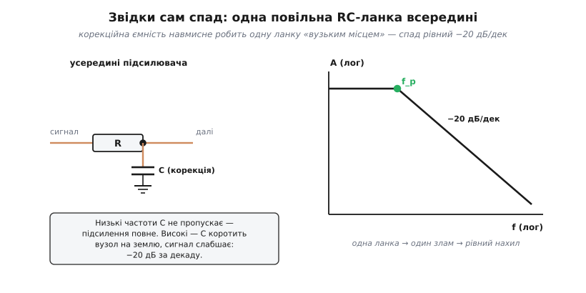
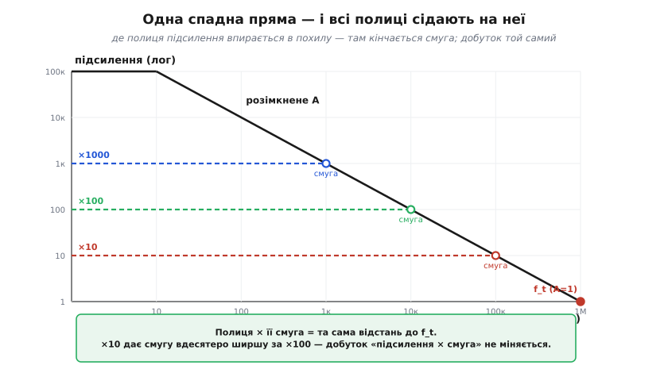
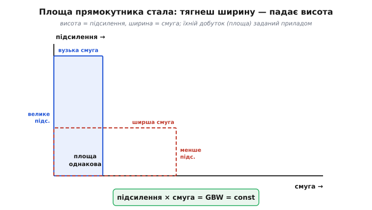
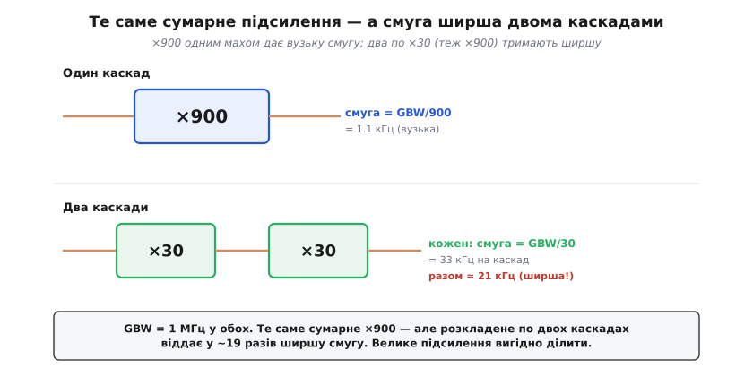

# Добуток підсилення на смугу

Попросіть в операційного підсилювача велике підсилення — і він тихо відбере у вас швидкість. Попросіть швидкість — доведеться вдовольнитися скромним підсиленням. Це не вада конкретної мікросхеми й не примха виробника, а жорсткий закон збереження, вшитий у саму будову підсилювача: добуток підсилення на смугу частот у нього майже сталий. Скільки б ви не крутили схему, ця площа не росте. Зрозуміти цей добуток — означає наперед знати, чи встигне ваш підсилювач за сигналом, ще до того, як ви вперше ввімкнете живлення.

Назва описує саме те, що в ній написано: **добуток підсилення на смугу** *(англ. gain-bandwidth product, GBW або GBP)* — це підсилення, помножене на ширину смуги частот, у якій воно тримається. І головне відкриття полягає в тому, що цей добуток для даного підсилювача — **стала**.

### Чому підсилення взагалі спадає з частотою

Почнімо з факту, який спершу дивує: підсилення операційного підсилювача залежить від частоти. На постійному струмі й на низьких частотах воно велетенське — сотні тисяч, ба мільйон разів. Але що вища частота сигналу, то слабше підсилювач його тягне. На якійсь частоті підсилення спадає до жалюгідної одиниці (тобто вихід дорівнює входу — підсилення нема зовсім), а далі й зовсім менше.

Чому так? Усередині підсилювача навмисне зроблено одне **повільне місце** — ланку з резистора й конденсатора (точніше, конденсатор корекції, помножений ефектом Міллера). На низьких частотах конденсатор сигналові не заважає, і підсилення повне. А на високих той самий конденсатор устигає за період підзарядитися й розрядитися, він наче «коротить» внутрішній вузол, частина сигналу стікає крізь нього — і до виходу доходить менше. Що вища частота, то сильніше це коротке замикання, то менше підсилення. Той самий механізм, що в звичайному [конденсаторному фільтрі низьких частот](topic:hw-analog/rc-low-pass): за частотою зламу сигнал котиться вниз.


*Звідки сам спад. Корекційна ємність робить одну внутрішню ланку «вузьким місцем»: низькі частоти вона пропускає (підсилення повне), високі — стікають крізь неї на землю. Одна ланка дає один злам і рівний нахил спаду.*

Найважливіша властивість цього спаду — він **рівний**. Підсилення падає рівно вдесятеро щоразу, коли частота зростає вдесятеро. Інженери кажуть про це мовою [децибелів](topic:hw-analog/decibels): спад **−20 дБ на декаду** (декада — то якраз зростання частоти вдесятеро). Чому таке рівне падіння — бо повільне місце в підсилювачі зроблено **одне**: один-єдиний домінантний злам керує всією поведінкою, тому й спад один і той самий по всьому діапазону. (Чому навмисне роблять саме одне таке місце, а не лишають кілька, — окрема й цікава історія, від якої залежить стійкість: [📜 домінантний полюс і µA741](topic:hw-analog/gain-bandwidth-product/hist-dominant-pole.md).)

> 🔧 **Навіщо це.** Перш ніж рахувати, варто вкласти в голову саму картину: у даташиті операційного підсилювача графік «підсилення проти частоти» — це похила пряма, що неухильно котиться вниз. Усе подальше — лише наслідки цього одного факту. Хто бачить цю пряму, той наперед знає, чого від підсилювача чекати.

### Звідки береться стала

Тепер найголовніше. Спад рівний −20 дБ на декаду означає просту річ: **підсилення падає рівно настільки ж, наскільки росте частота**. Удесятеро вища частота — вдесятеро менше підсилення. А коли одне множиться рівно настільки ж, наскільки інше ділиться, їхній **добуток не міняється**. Це і є стала.

Покладімо це на координати. Якщо відкласти і підсилення, і частоту в логарифмічному масштабі (де рівні множники дають рівні кроки), спад розімкненого підсилення стає звичайною спадною прямою. А тепер уявімо, що ми замкнули підсилювач зворотним зв'язком на якесь конкретне підсилення — скажімо, рівно ×100. Доти, доки розімкненого підсилення вистачає з запасом, замкнене тримається **пласким**: рівно ×100, незалежно від частоти. Та з ростом частоти розімкнене підсилення спадає й зрештою падає до тих самих ×100 — і ось тут замкнене підсилення вже не може триматися, воно впирається в похилу й починає котитися вниз разом із нею. Та частота, де полиця впирається в похилу, і є **смуга** цієї схеми.


*Одна спадна пряма для всіх. Замкнеш ×10 — полиця низька й довга, упреться в похилу пізно (широка смуга). Замкнеш ×1000 — полиця висока й коротка, упреться рано (вузька смуга). Висота полиці, помножена на її довжину до похилої, скрізь однакова.*

Подивіться на полиці на різній висоті. Полиця ×1000 висока — і впирається в похилу рано, на низькій частоті: вузька смуга. Полиця ×10 низька — і тягнеться аж до високої частоти: широка смуга. Висота полиці (підсилення) помножена на її довжину до похилої (смугу) дає скрізь **ту саму відстань** — бо похила одна-єдина. Це геометрія сталого добутку.

Звідси й проста формула. Позначмо підсилення G, смугу f. Тоді:

```
G · f = GBW = const
```

а доступна смуга при бажаному підсиленні:

```
f = GBW / G
```

Є ще один зручний спосіб подивитися на ту саму сталу. Простягніть похилу праворуч аж до самого низу, де підсилення спадає до **одиниці**. Частоту, на якій це стається, звуть **частотою одиничного підсилення** *(unity-gain frequency, f_t)*. Оскільки там G = 1, добуток G·f дорівнює просто цій частоті. Тобто для підсилювача з однією спадною прямою **GBW і є частота одиничного підсилення** — одне й те саме число. Тому в даташиті ви побачите або «gain-bandwidth product», або «unity-gain bandwidth» — це синоніми.

### Прямокутник сталої площі

Зручно тримати в голові образ. Підсилення — це висота, смуга — ширина, а їхній добуток — площа прямокутника. Прилад дає вам прямокутник **заданої площі** (свій GBW), а ви вільні розпорядитися його формою: витягнути вгору (велике підсилення, вузька смуга) або розплющити вшир (мала підсилення, широка смуга). Чого не можна — це збільшити саму площу. Хочете більшу площу — беріть інший, «швидший» підсилювач із більшим GBW.


*Прямокутник сталої площі. Форму ви обираєте — високий і вузький чи низький і широкий, — а площу задає сам підсилювач. Це й означає, що підсилення та смугу не можна мати водночас великими.*

Ця картина одразу пояснює, чому GBW взагалі живе у зворотному зв'язку. Сам по собі підсилювач має величезне розімкнене підсилення на низьких частотах і смішну смугу. Накинувши [від'ємний зворотний зв'язок](topic:hw-analog/negative-feedback), ми **віддаємо** частину того велетенського підсилення — і в обмін **дістаємо** ширшу смугу. Це не безкоштовний дарунок: ми лише по-іншому ділимо ту саму площу. Зворотний зв'язок — це ручка, якою ми переливаємо «зайве» підсилення у потрібну нам смугу.

### Як цим користуватися: порахуймо

Уся практична користь GBW в одному русі: дізнайтеся GBW з даташита, поділіть на потрібне підсилення — дістанете смугу. Або навпаки: знаючи потрібну смугу, дізнаєтесь, яке найбільше підсилення ще влізе.

**Звуковий каскад на ×20, чи вистачить смуги.** Беремо ОП із GBW = 1 МГц (як класичний µA741) і робимо підсилювач на ×20. Чи покриє він увесь звуковий діапазон до 20 кГц?

```c
// Перевірка смуги одного каскаду під задане підсилення.
// GBW і частоти — в герцах; підсилення — безрозмірне.
float gbw   = 1.0e6f;   // 1 МГц з даташита
float gain  = 20.0f;    // потрібне підсилення каскаду
float bw    = gbw / gain;          // доступна смуга
// bw = 1.0e6 / 20 = 50 000 Гц = 50 кГц

float audio_top = 20.0e3f;         // верх звукового діапазону
if (bw >= audio_top) {
    // 50 кГц >= 20 кГц → запас є, увесь звук пройде рівно
}
```

Смуга 50 кГц спокійно перекриває 20 кГц звуку — запас понад удвічі. Каскад годиться. А якби нам закортіло ×100 з того самого підсилювача, смуга впала б до 1 МГц/100 = 10 кГц — і верхні ноти вже почали б тихнути. Той самий прилад: змінили лише підсилення — і смуга змінилася разом із ним.

**Скільки підсилення влізе під задану смугу.** Інша, частіша на практиці задача: треба надійно тягнути сигнал до 100 кГц. Яке найбільше підсилення дозволить один каскад на тому самому µA741?

```c
float gbw    = 1.0e6f;    // 1 МГц
float f_need = 100.0e3f;  // потрібна смуга 100 кГц
float gain_max = gbw / f_need;     // найбільше підсилення під цю смугу
// gain_max = 1.0e6 / 100e3 = 10
```

Виходить лише ×10. Хочете більше підсилення на 100 кГц — або беріть швидший ОП, або робіть кілька каскадів. До цього й переходимо.

> 🔧 **Навіщо це.** Це найшвидша перевірка при доборі підсилювача. Ще на стадії вибору мікросхеми, маючи лише потрібне підсилення й потрібну смугу, ви множите їх — і якщо добуток перевищує GBW приладу, ця мікросхема не впорається, навіть не паяйте. Один рядок арифметики економить день марного налагодження.

### Чому велике підсилення вигідно ділити

Звідси випливає правило, що рятувало не одну схему. Якщо потрібне велике сумарне підсилення, **не беріть його одним каскадом** — розкладіть на кілька помірних. Площа в кожного каскаду своя, тож кілька каскадів дають кращу сумарну смугу, ніж один жадібний.

Порахуймо на тому самому приладі. Хай GBW = 1 МГц, а сумарно потрібно ×900.

```c
// Один каскад ×900 проти двох каскадів по ×30 (30·30 = 900).
float gbw = 1.0e6f;

// Варіант А: один каскад
float bw_one = gbw / 900.0f;       // = 1 111 Гц ≈ 1.1 кГц

// Варіант Б: два каскади по ×30
float bw_stage = gbw / 30.0f;      // = 33 333 Гц на кожен каскад
// два однакові каскади звужують смугу множником ≈ 0.64 (√(2^(1/2) − 1)):
float bw_two = bw_stage * 0.643f;  // ≈ 21 433 Гц ≈ 21 кГц
```

Один каскад ×900 ледь дотягує до 1.1 кГц. Два каскади по ×30, що в добутку дають ті самі ×900, тримають смугу близько 21 кГц — у багато разів ширше. (Чому не рівно 33 кГц, а трохи менше: два спади, накладаючись, дещо звужують сумарну смугу — звідси множник ≈0.64; точне число неважливе, важливий разючий виграш.)


*Один каскад проти двох. ×900 одним махом упирається в стелю смуги майже одразу. Розкладене на два помірні каскади (×30 × ×30) те саме підсилення тримає набагато ширшу смугу — бо кожен каскад тратить лише частину спільного запасу.*

Логіка прозора: кожен каскад віддає лише частину спільної «площі», тож жоден не змушений жертвувати смугою аж так сильно. Платня — більше деталей і трохи більше шуму від додаткового каскаду; виграш у смузі того зазвичай вартий.

### Чого GBW не охоплює: швидкість наростання

Тут чигає поширена пастка. Легко подумати, що GBW описує всю «швидкість» підсилювача. Це не так. GBW — про **малі** сигнали: на якій частоті ще тримається підсилення кволого, ледь помітного сигналу. Велике гойдання виходу від краю до краю обмежує **інша**, окрема стеля — **швидкість наростання** *(slew rate)*: скільки вольтів за мікросекунду вихід узагалі здатен подужати.

Чому це різні речі? Смуга стосується **форми** малого сигналу — чи встигає підсилення відтворити його обриси. Швидкість наростання стосується **розмаху** — вихід фізично не може стрибати швидше за певну межу, хоч би яким широкосмуговим був підсилювач. Тому буває, що кволий сигнал на високій частоті проходить ідеально, а той самий сигнал, підсилений до кількох вольтів на тій самій частоті, вже «пливе» й вироджується з гарної синусоїди у скособочений трикутник — бо вперся не в смугу, а у швидкість наростання.

Висновок практичний: GBW перевіряють для **малих** сигналів, швидкість наростання — для **великих**. У реальній схемі дивляться **обидва** числа. Детально, з формулами обох стель і прикладом, котра з них ближча для вашого сигналу, — у статті про [межі реального операційного підсилювача](topic:hw-analog/real-opamp-limits).

> 🔧 **Навіщо це.** Найпідступніші баги аналогових схем родяться саме зі сплутаних стель. Сигнал начебто в межах смуги, а на виході спотворення — бо насправді кусає швидкість наростання, не смуга. Тримайте їх нарізно: мала й швидка форма — це GBW, великий розмах — це slew rate.

### Що з цього винести

Уся тема стоїть на одному факті: підсилення операційного підсилювача спадає з частотою однією рівною прямою, тому добуток підсилення на смугу — стала, паспортне число приладу. З нього прямо випливає все потрібне. Доступна смуга — це GBW поділити на ваше підсилення. Велике підсилення вигідно ділити на каскади, бо так сумарна смуга ширша. А цифру GBW не варто плутати зі швидкістю наростання: перша обмежує малі сигнали, друга — великі. Запам'ятавши образ прямокутника сталої площі, ви наперед, ще до паяння, знаєте, чи впорається обраний підсилювач із вашим сигналом.
