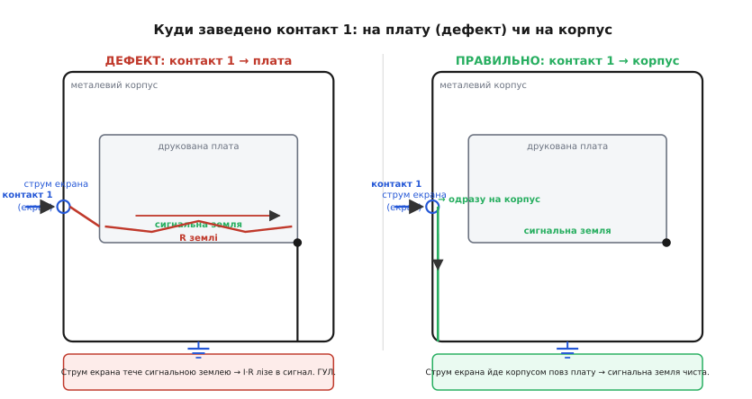

# 📜 Проблема контакту 1: як студійний гул дістав ім'я й винуватця

Десятиліттями професійний студійний звук жив із прикрим парадоксом. Два прилади-вершини інженерії — мікрофонний підсилювач за кілька тисяч доларів і пульт, зібраний із добірних деталей, — з'єднували грубим балансним кабелем зі сталевими роз'ємами XLR і отримували… гул. Рівний фон 60 Гц (у Північній Америці; у нас 50), що проступав у тихих місцях запису й не зникав, скільки б ти не перевіряв кожен прилад окремо. Кожна коробка на лабораторному столі мовчала бездоганно. Заварювалося все саме від **системи** — від того, що коробки з'єднали.

Найдивовижніше: цю проблему **роками не вміли назвати**. Її латали наосліп — то перепаювали кабель, то «піднімали землю» висмикуванням третього штиря з вилки (небезпечний фокус), то ставили розв'язувальні трансформатори там, де їх можна було б і не ставити. Кожен інженер мав власну легенду про те, «звідки лізе гул», і власний набір замовлянь. Бракувало одного — чіткого діагнозу: **де саме** в ланцюжку дорогої техніки сидить дефект, спільний для половини приладів на ринку. Цей діагноз поставив один чоловік, і поставив так точно, що його формулювання стало стандартним терміном галузі. Звали його Ніл Мансі (Neil Muncy), а дефект він назвав **проблемою контакту 1** (англ. *the pin 1 problem*).

> 🔧 **Навіщо це.** Історія тут — не прикраса. Проблема контакту 1 — це навчальний приклад того, як ціла індустрія може **десятиліттями** боротися з симптомом, не бачачи причини, бо причина — у місці, яке всі звикли вважати неважливим: у тому, **куди заведено екран** і чи має зворотний провід опір. Той самий спільноімпедансний зв'язок, що псує вашу плату збору даних, псував і студії за мільйони доларів. Назвати ворога точно — половина перемоги.

### Чому контакт саме номер один

Щоб зрозуміти діагноз, треба знати анатомію роз'єму. Балансний аудіокабель закінчується триконтактним роз'ємом XLR. Два контакти, **2** і **3**, несуть власне сигнал — два проводи витої пари, на яких корисне сидить як **різниця** напруг (це і є [балансна, диференційна передача](root:hw-analog/differential-signaling): приймач дивиться не на «провід відносно землі», а на різницю двох проводів, тож однакова домішка на обох гаситься). А контакт **1** — це **екран** (англ. *shield*): обплетення чи фольга, що огортає сигнальну пару й має ловити зовнішні наводки, відводячи їх на землю.

> 🔧 **Навіщо це.** Розподіл ролей між контактами — це і є вся суть. Контакти 2 і 3 — священні: на них живе сигнал, і будь-який бруд на них псує запис напряму. Контакт 1 — «брудний» за призначенням: його робота саме в тому, щоб **прийняти на себе** струми завад і провести їх повз сигнал. Питання лише одне — **куди** він їх проведе. І весь дефект Мансі — у відповіді на це «куди».

Тепер ключове. Екран кабелю — провідник, і по ньому **тече струм**. Не повинен би, та тече: між «землями» двох приладів майже завжди є різниця потенціалів (ту саму [петлю по землі](root:hw-analog/ground-loop) ми вже розбирали — різні розетки, різні шляхи заземлення), і ця різниця жене струм усім, що замикає кільце, зокрема й екраном. Сам по собі цей струм екрана нешкідливий — **якщо** йому дати чисту дорогу повз сигнал. Чиста дорога одна: з контакту 1 одразу на **металевий корпус** приладу, а з корпусу — на захисне заземлення. Тоді струм екрана тече корпусом, ніде не торкаючись сигнальної землі, і про нього можна забути.

А тепер дефект. У безлічі приладів контакт 1 роз'єму XLR заводили **не на корпус, а на друковану плату** — на ту саму сигнальну землю, від якої відлічуються слабкі сигнали. Зробіть подумки крок за струмом екрана: він заходить через контакт 1, потрапляє на доріжку-землю плати, **проходить нею** (а доріжка має опір!) аж до тієї точки, де врешті з'єднана з корпусом, — і вже потім іде на заземлення. Доки він біжить цією доріжкою, на ній за законом Ома сидить спад U = I·R, і цей спад **додається** до кожного сигналу, що відлічується від цієї землі.

```
Струм екрана I тече сигнальною землею плати з опором R
       ↓
На спільній ділянці: Uзавади = I · R
       ↓
Цей спад додається до корисного сигналу → гул на виході
```

Ось і весь дефект — повністю той самий [спільноімпедансний зв'язок](root:hw-analog/ground-loop/math-common-impedance.md), тільки в дорогому корпусі. Струм, якому місце на корпусі, пустили крізь сигнальну землю. Мансі вловив, що це не випадковість окремої моделі, а **системна** хиба розкладки, повторена в сотнях приладів різних виробників. Один невдалий вибір — «контакт 1 → плата» замість «контакт 1 → корпус» — і прилад стає чутливим до будь-якого струму на екрані. З'єднай два таких прилади — і обидва годують один одного гулом.


*Той самий прилад, два варіанти розкладки. Ліворуч (дефект): екран із контакту 1 заведено на сигнальну землю плати — струм екрана тече доріжкою з опором R і лишає на ній спад I·R прямо в сигналі. Праворуч (правильно): контакт 1 одразу на металевий корпус — струм екрана йде корпусом повз плату, сигнальна земля чиста.*

### Хто такий Ніл Мансі

Ніл Мансі (Neil Muncy, 1938–2012) — американський звукоінженер, з тих практиків, що знають техніку не з підручника, а з паяльника й осцилографа. Електротехніку він студіював у Вашингтоні (George Washington University та Capitol Radio Engineering Institute), а 1959-го почав фахову роботу в Лабораторії прикладної фізики Університету Джонса Гопкінса. Згодом заснував власну фірму (SSI, Inc.) і одним із перших застосував операційні підсилювачі в багатоканальних пультах і швидкісних системах копіювання стрічки — тобто був на вістрі тодішньої аналогової техніки. Пізніше багато працював у Канаді: очолював секції AES і у Вашингтоні, і в **Торонто**, а 1997-го його обрали віцепрезидентом AES.

> 🔧 **Навіщо це.** Важлива не посада, а **школа**. Мансі прийшов до проблеми контакту 1 не від теорії полів, а від багаторічної практики боротьби з гулом і завадами в реальних студіях. Він просто **виміряв** те, що інші відмахували як «погану землю», — і виявив за туманом закономірність. Це фейнманівський хід: не вірити загальникам («земля шумить»), а поставити дослід і подивитися, **що саме** і **скільки**.

Найбільше Мансі знаний саме невтомною війною з гулом та електромагнітними завадами (англ. *hum and EMI*) в аудіосистемах. Він не лише дав дефектові назву — він став заступником голови робочої групи AES зі стандартів **SC-05-05**, що опікувалася практиками заземлення й електромагнітної сумісності. Тобто діагноз із його статті пішов далі особистого спостереження й ліг в основу **галузевих рекомендацій**: як саме виробникам заводити контакт 1, щоб прилади не отруювали один одного.

### Дослід, із якого народився акронім SCIN

Тепер найцікавіше — як саме Мансі перетворив туманне «лізе гул» на цифру. Він зробив рівно те, чого бракувало всім скаргам: **поставив дослід** і поміряв.

Логіка була така. Якщо проблема в тому, що струм екрана якось потрапляє в сигнал, то спершу треба зрозуміти **сам кабель** — що відбувається, коли екраном тече струм. Мансі взяв підсилювач потужності з вихідним трансформатором і **пустив екраном аудіокабелю струм** — синус і прямокутник амплітудою близько 100 мА на частотах 60 Гц, 600 Гц і 6 кГц. А на сигнальній парі того ж кабелю міряв, яка напруга на ній **наведеться** від цього струму екрана.

І напруга наводилася. Мансі назвав її **шумом, наведеним струмом екрана** — англ. *shield-current-induced noise*, скорочено **SCIN** (вимовляється як «скін»). Він помітив дві речі, що багато пояснюють:

```
1. Амплітуда SCIN ∝ частоті — росте з частотою струму екрана.
2. Причина — несиметрія магнітного зв'язку: екран
   по-різному «зчеплений» із двома проводами пари.
```

Чому це важливо? Тут спрацьовує точна аналогія з трансформатором (як і в самій петлі по землі). Струм екрана — це «первинна обмотка», два сигнальні проводи — два можливі «вторинні витки». Якби екран був ідеально симетричний щодо обох проводів, він наводив би на них **однакову** напругу — а спільна, однакова на обох проводах напруга для балансного приймача невидима (її гасить різницеве вмикання). Уся біда — в **несиметрії**: екран зчеплений з одним проводом трохи тісніше, ніж із другим, тож наводить на них **різну** напругу. А різниця — це вже не спільний сигнал, це справжня завада, яку приймач прийме за корисне.

> 🔧 **Навіщо це.** SCIN показав крамольну річ: навіть **бездоганно** заведений екран (одразу на корпус, як належить) може домішувати шум — якщо сама **конструкція кабелю** несиметрична. Мансі поміряв кабелі з різним плетивом екрана й побачив, що одні дають набагато більше SCIN, ніж інші. Зокрема — дренажний провід (англ. *drain wire*, окрема жилка вздовж фольгового екрана) псує симетрію розподілу струму в екрані й погіршує SCIN. Звідси практичний висновок для аудіо: для балансних ліній кабель із **симетричним обплетеним** екраном кращий за дешевий фольговий із дренажем. Це вже про сам [екранований кабель](root:hw-pcb/shielded-cable), а не лише про роз'єм.

Отже з одного досліду Мансі вийшли **два** різні явища, які доти змішували в один туман «гулу»:

- **Проблема контакту 1** — дефект **приладу** (екран заведено на плату, а не на корпус). Лікується розкладкою всередині коробки.
- **SCIN** — властивість **кабелю** (несиметрія магнітного зв'язку екрана й пари). Лікується вибором кабелю.

Розділити їх — велика заслуга. Доти інженер, що ловив гул, не знав, куди дивитися: у прилад чи в кабель. Мансі дав два чіткі діагнози замість одного розмитого.

### Червень 1995-го: число AES, що стало легендою

Свої досліди Мансі показав на конференції AES (Audio Engineering Society) ще **1994 року**, а повну статтю надрукували в **червневому випуску Journal of the Audio Engineering Society за 1995 рік** — том 43, число 6. Стаття звалася «Noise Susceptibility in Analog and Digital Signal Processing Systems» («Сприйнятливість до шуму в аналогових і цифрових системах обробки сигналу»), сторінки 435–453.

Та цей випуск став легендарним не лише через Мансі. Це було **спеціальне число**, ціле присвячене заземленню, екрануванню й сполученню в аудіо, і поряд зі статтею Мансі в ньому вийшла друга наріжна праця — **Білла Вітлока** (Bill Whitlock) під назвою «Balanced Lines in Audio Systems: Fact, Fiction, and Transformers» («Балансні лінії в аудіосистемах: факти, вигадки й трансформатори»).

Чому ці дві статті так лягли одна до одної? Бо вони покрили **обидва боки** одного й того самого механізму:

- Мансі пояснив, **як завада потрапляє** в прилад: струм екрана крізь сигнальну землю (проблема контакту 1) і несиметрія кабелю (SCIN). Це бік **джерела** завади.
- Вітлок розібрав, **як приймач має її відбивати**: чому балансний вхід давить спільну заваду й від чого залежить якість цього придушення. Це бік **захисту** від завади.

Разом вони склали повну картину. Балансна лінія працює не магією, а тим, що корисне несе **різниця** двох проводів, а будь-яка спільна на обох проводах домішка (зокрема й напруга петлі) гаситься при відніманні. Наскільки добре гаситься — каже [коефіцієнт придушення синфазного сигналу (CMRR)](root:hw-analog/cmrr). Вітлок показав важливу й контрінтуїтивну річ: реальний CMRR балансного входу залежить не так від точності резисторів у самому вході, як від **симетрії повних опорів** з боку джерела — тобто від того, наскільки однаково «навантажені» обидва проводи. Дрібна несиметрія опорів перетворює частину спільної завади на різницеву, і вона лізе в сигнал.

> 🔧 **Навіщо це.** Тут і змикаються дві статті в одне правило. Проблема контакту 1 (Мансі) **створює** на сигнальній землі заваду; а несиметрія входу (Вітлок) визначає, чи **просочиться** ця завада в корисний сигнал. Атакувати треба з обох боків: правильно завести екран (контакт 1 → корпус), **і** тримати балансний вхід симетричним заради високого CMRR. Те саме, що ми бачили в самій петлі по землі: одна родина прийомів прибирає джерело, друга вчить приймач не «бачити» завади. Тут вони просто отримали імена авторів.

Спеціальне число розійшлося так, що його називають найпопулярнішим за всю історію журналу AES. Воно не відкрило нової фізики — спільноімпедансний зв'язок і закон Фарадея були відомі давно. Воно зробило інше, дуже фейнманівське: **назвало й виміряло** те, з чим індустрія боролася наосліп, і дало інженерам спільну мову. Тепер замість «у мене десь лізе гул» можна було сказати точно: «у цього приладу проблема контакту 1» — і всі розуміли, **що** перевіряти й **як** лагодити.

### «Гудець» Джона Віндта: як перевірити прилад за хвилину

Діагноз без простого тесту лишився б теорією. Тут на сцену вийшов ще один інженер — **Джон Віндт** (John Windt), який на тій самій хвилі 1994 року запропонував прилад-перевірник, охрещений «**Гудцем**» (англ. *the Hummer* — «той, що гуде»).

Ідея «Гудця» — сама простота, і вона прямо випливає з діагнозу Мансі. Якщо дефект у тім, що струм екрана тече сигнальною землею, то перевіримо це **навмисне**: пустимо відомий струм туди, де його тече дефектна петля, і подивимося, чи з'явиться гул на виході.

```
«Гудець»: між контактом 1 роз'єму (екран) і корпусом приладу
пускають струм ~60 Гц, близько 50–100 мА (від маленького
мережевого трансформатора-«бородавки»).

Дивляться на вихід приладу:
  • гул на виході ПІДСКОЧИВ  → струм екрана лізе в сигнал
                              → проблема контакту 1 Є.
  • вихід не змінився         → контакт 1 заведено правильно.
```

Краса в тому, що тест **не лізе всередину** приладу й не вимагає його розбирати. Ти подаєш струм між «брудним» контактом 1 і корпусом — рівно туди, де в дефектному приладі цей струм проходить через плату, — і слухаєш вихід. Якщо розкладка правильна (контакт 1 одразу на корпус), твій випробувальний струм піде корпусом повз сигнал, і на виході нічого не зміниться. Якщо ж контакт 1 заведено на плату, струм пройде сигнальною землею, лишить на ній свій I·R — і ти **почуєш** дефект як стрибок гулу. За хвилину, без паяльника, без здогадів.

> 🔧 **Навіщо це.** «Гудець» — це матеріалізований діагноз. Він показує, що добра теорія завжди дає простий **дослід-перевірку**: якщо механізм саме такий, то ось такий вплив дасть ось такий відгук. Той самий принцип годиться будь-де у вашій техніці — підозрюєте спільноімпедансний зв'язок, пустіть навмисний струм по підозрілому зворотному проводу й гляньте, чи з'явиться завада там, де її бути не повинно. Параметри «Гудця» (близько 60 Гц, десятки міліампер) не священні — священна логіка: збуди підозрюваний шлях відомим струмом і поміряй наслідок.

### Що з цього лишилося

Спостереження Мансі давно перестало бути новиною й перетворилося на **правило ремесла**. Сьогодні «проблема контакту 1» (англ. *pin 1 problem*) — усталений термін: інженери кажуть «цей прилад має pin 1 problem» так само буденно, як «коротке замикання», і всі розуміють, **що** мається на увазі й **де** шукати. Виробники навчилися заводити контакт 1 одразу на корпус; AES виробила рекомендації; «Гудець» та його нащадки стоять на лабах для вхідного контролю техніки.

Статус усього викладеного — **усталений**: і авторство Мансі та Вітлока, і дати (доповіді на AES 1994-го, спеціальне число журналу AES за червень 1995-го, том 43 число 6), і назви статей, і акронім SCIN, і «Гудець» Джона Віндта — усе зафіксовано в самому журналі AES та в технічних нотатках виробників (Rane, Jensen Transformers). Це не легенда галузі, а її задокументована історія.

А головний урок — позачасовий, і він рівно той самий, що тримає всю тему петлі по землі. Найдорожча техніка спотикається не на хитрій фізиці, а на **опорі мізерного проводу** — на тих частках ома сигнальної доріжки, які за звичкою називають нулем. Десятиліттями ціла індустрія програвала цьому опору, бо не там шукала: дивилася в схему, у деталі, у магію «поганої землі», а дефект сидів у **топології міді** — у тому, **куди** заведено один-єдиний контакт. Варто було поставити дослід, поміряти I·R і назвати ворога на ім'я — і проблема з невловимої стала рутинною. У цьому й сила точного діагнозу: він не додає нової фізики, він **прибирає туман**.
