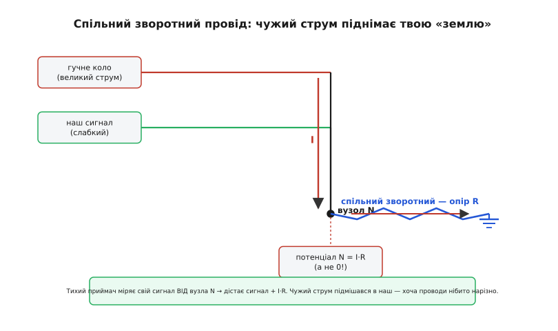
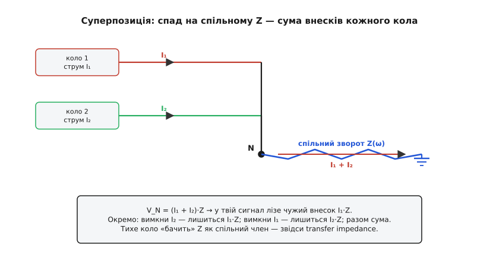
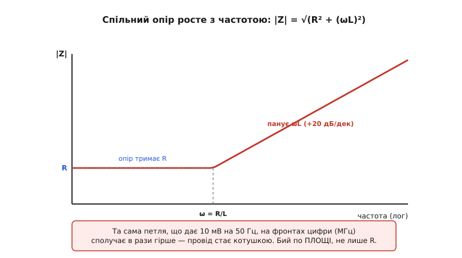
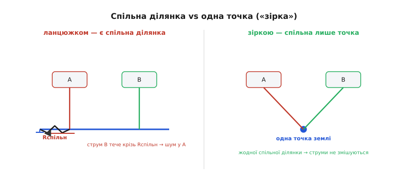

# 🧮 Спільноімпедансний зв'язок: вивід через теорію кіл

Назву явища варто прочитати буквально. **Спільноімпедансний зв'язок** (англ. *common-impedance coupling*) — це передавання завади з кола в коло не крізь повітря й не витоком, а **через спільний шматок провідника**, який у двох кіл один на двох і має ненульовий опір. «Зв'язок» тут — у тому самому сенсі, що й між обмотками трансформатора: зміна в одному колі породжує напругу в іншому. Тільки переносником служить не магнітне поле, а звичайнісінький спад напруги на спільному опорі за законом Ома.

Стаття-власник показує суть на одній формулі: чужий струм I тече крізь спільний зворотний опір R і лишає на ньому спад I·R, що сідає прямо у твій сигнал. Це правда, але це лише верхівка. Тут ми збудуємо явище **строго з теорії кіл** — так, щоб стало видно три речі, яких одна формула не дає. Перше: чому внески різних кіл **додаються** і як їх розділити (суперпозиція). Друге: чому опір R треба замінити на **частотозалежний** Z(ω), і звідки береться те, що на високих частотах зв'язок різко гіршає. Третє: чому **жодне усереднення в коді** не прибирає цю заваду — і чому топологія «зіркою» обнуляє її точно, до нуля, а не «послаблює».

## Модель: два кола з одним спільним зворотом

Зведімо реальність до найменшої схеми, що ще містить суть. Беремо **два незалежні кола**. Перше — «гучне»: цифрова мікросхема, мотор, реле — будь-що, що жене відчутний струм. Друге — «тихе»: вхід АЦП, опорна напруга, мікрофонний підсилювач — щось, що міряє слабкий сигнал. Кожне коло має свій прямий провід (по ньому струм іде «туди») і повертає струм назад до спільної точки відліку — землі.

Уся халепа в одному: **частина зворотного шляху в них спільна**. Десь біля роз'єму живлення, біля спільного штиря, біля місця, де земляна доріжка плати звужується в один поясок, обидва зворотні струми течуть **одним і тим самим** провідником. Назвемо цей спільний шматок **спільним опором** і позначимо його Z (поки що думаймо про нього як про резистор R; частотну залежність додамо згодом). Точку, де обидва кола чіпляють цей спільний опір, назвемо **вузлом N** — це «земля», від якої тихе коло відлічує свій сигнал.


*Гучне коло жене струм I крізь спільний зворотний опір. Спад на ньому піднімає потенціал вузла N з нуля до I·R. Тихий приймач міряє свій сигнал саме від N — тож дістає сигнал плюс чужий I·R.*

Тепер ключове спостереження, без якого вся подальша математика не має сенсу. Ми звикли малювати землю символом і подумки приписувати кожній його появі потенціал рівно 0 В. Але [«земля» — це не нуль за визначенням, а лише спільна точка відліку](root:hw-pcb/ground-power-rails): домовленість, від чого міряємо напруги. Нуль вона тільки **в одній** точці — там, де ми поставили щуп вольтметра чи де реально сходяться всі струми. Будь-яка інша точка, відділена від неї провідником з опором, по якому тече струм, має потенціал **не нуль**, а спад на цьому провіднику. Уся теорія спільноімпедансного зв'язку — це акуратний підрахунок, наскільки саме «земля» в одному місці відрізняється від «землі» в іншому.

> 🔧 **Навіщо це.** На схемі ви бачите десяток значків землі й несвідомо вважаєте їх однією еквіпотенціальною точкою. Фізично це **різні точки одного провідника**, і між ними є напруга, щойно тече струм. Більшість «нез'ясовних» завад у змішаних аналого-цифрових платах — це той самий прорахунок: інженер з'єднав дві землі лінією на схемі, забувши, що в міді ця лінія має опір та індуктивність, а отже між її кінцями стоїть напруга. Математика нижче дає інструмент порахувати цю напругу заздалегідь — і не потрапити в пастку.

## Закон Кірхгофа для напруг: звідки береться похибка

Підемо строго. [Закон Кірхгофа для напруг (КЗН)](root:hw-analog/kvl) каже: сума всіх спадів напруги по будь-якому **замкненому контуру** дорівнює нулю. Це не що інше, як закон збереження енергії для заряду: обійшовши контур і повернувшись у вихідну точку, заряд має той самий потенціал, з якого вийшов — інакше енергія бралася б з нічого.

Застосуймо КЗН до контуру **тихого** кола. Обходимо: джерело корисного сигналу (е.р.с. Vс) → прямий провід тихого кола → вхід приймача (на ньому напруга Vвх, яку приймач і виміряє) → зворотний провід тихого кола до вузла N → спільний опір Z від N до «істинної» землі → назад до джерела. Запишемо суму напруг по цьому контуру. Власні опори проводів тихого кола малі (по них тече лише мізерний сигнальний струм), тож знехтуймо ними й зосередьмося на суті:

```
Vс − Vвх − V(N) = 0
```

де V(N) — потенціал вузла N відносно істинної землі. Звідси те, що насправді бачить вхід приймача:

```
Vвх = Vс − V(N)
```

Поки V(N) = 0, приймач чесно бачить Vс — усе ідеально. Уся завада сидить у члені V(N). Тепер порахуймо його — і ось де в гру входить **гучне** коло.

Потенціал вузла N — це спад напруги на спільному опорі Z, а спад залежить від того, **який повний струм** тече крізь Z. По спільному опору повертаються струми **обох** кіл: гучного (I₁) і тихого (I₂). За [законом струмів Кірхгофа](root:hw-analog/kcl) у вузлі N вони складаються, і крізь Z тече їхня сума:

```
V(N) = (I₁ + I₂) · Z
```

Підставмо назад:

```
Vвх = Vс − (I₁ + I₂)·Z
```

Розкриймо суму — і завада сама розпадається на два внески різної природи:

```
Vвх = Vс − I₂·Z  −  I₁·Z
       └──┬───┘     └─┬─┘
      «своя» частина  ЧУЖА частина
```

Член **I₂·Z** — це спад від **власного** зворотного струму тихого кола на спільному опорі. Він неприємний (трохи спотворює власний сигнал), але принаймні корельований із самим сигналом і зазвичай малий, бо I₂ мізерний. А ось член **I₁·Z** — це і є **спільноімпедансний зв'язок** у чистому вигляді: у твій сигнал залазить напруга, пропорційна струму **зовсім іншого** кола. Сигнальні проводи двох кіл фізично нарізно, джерела незалежні — а завада однаково проходить, бо обидва кола змушені ділити один зворотний опір.

Знак мінуса тут — лише наслідок того, в який бік ми обходили контур і як домовилися про полярність; завада могла б увійти й зі знаком плюс, якби струм гучного кола тік у протилежний бік чи відлік брався з іншого кінця. Важить не знак, а **модуль** доданка |I₁·Z|: саме стільки чужої напруги домішується до твого сигналу. Далі ми так і називаємо I₁·Z «завадою», не чіпляючись до знака.

Зверни увагу на тонкість, яку легко проґавити: завада **I₁·Z не залежить від твого сигналу взагалі**. Можеш подати на вхід нуль, можеш подати повну шкалу — доданок I₁·Z той самий, він живе своїм життям за ритмом гучного кола. Саме ця незалежність згодом і доведе, що від нього не врятуєшся усередненням.

## Суперпозиція: чому внески розкладаються й складаються

Те, що завада розпалася рівно на два доданки — I₂·Z і I₁·Z, — не випадковість запису, а наслідок фундаментальної властивості: коло **лінійне**. У [лінійному колі](root:hw-analog/superposition) діє **принцип суперпозиції**: відгук на кілька джерел дорівнює сумі відгуків на кожне джерело окремо, коли решту «вимкнено» (джерела напруги закорочено, джерела струму розірвано). Це прямий наслідок того, що рівняння кола — лінійні: якщо подвоїти всі джерела, подвояться всі струми й напруги, а сума двох розв'язків теж є розв'язком.

Застосуймо суперпозицію до нашого вузла N — і отримаємо ту саму формулу, але вже з ясним фізичним сенсом кожного кроку.

**Внесок гучного кола (вимикаємо тихе).** Джерело тихого сигналу закорочуємо, тобто гасимо I₂. Лишається тільки I₁, він тече крізь спільний Z, і потенціал вузла стає:

```
V(N)|₁ = I₁ · Z
```

**Внесок тихого кола (вимикаємо гучне).** Тепер гасимо I₁, лишаємо I₂:

```
V(N)|₂ = I₂ · Z
```

**Складаємо** (бо коло лінійне):

```
V(N) = V(N)|₁ + V(N)|₂ = I₁·Z + I₂·Z = (I₁ + I₂)·Z
```

Той самий результат — але тепер видно механіку. Кожне коло **окремо** піднімає вузол N на свою величину «струм × спільний опір», і ці підняття просто додаються.


*Струми обох кіл сходяться у вузлі N і течуть крізь спільний Z. Спад на Z — сума внесків; вимкнувши одне коло, дістаємо внесок другого. Тихе коло «бачить» Z як спільний член — це і є transfer impedance між колами.*

Тут варто назвати річ її точним інженерним іменем. Відношення напруги-завади, що з'явилася в тихому колі, до струму, що її породив у гучному, — це **передавальний опір** (англ. *transfer impedance*), позначають Zₜ:

```
Zₜ = Vзавади (у тихому колі) / I₁ (у гучному колі)
```

У нашій елементарній моделі, де кола ділять єдиний спільний опір, передавальний опір дорівнює просто цьому спільному опору: Zₜ = Z. Це і є кількісна міра зв'язку між двома колами — скільки мілівольтів завади дістанеш на кожен ампер чужого струму. Поняття передавального опору не наша вигадка для цієї статті: його ввів 1934 року **Сергій Щелкунов** (Sergei A. Schelkunoff, 1897–1992) — математик і інженер фірми Bell Labs, який народився в Самарі в Російській імперії, у 1921-му через Сибір, Маньчжурію та Японію емігрував до США й там здобув освіту з математики та докторат у Колумбійському університеті. Щелкунов увів Zₜ як зручний параметр, щоб передбачати проникнення завад крізь екран коаксіального кабелю; відтоді передавальний опір став стандартною мірою екранувальної здатності кабелів (його взяли за основу в робочих групах IEC). *(Статус: усталений факт; авторство й дата підтверджені біографічними та профільними джерелами. Атрибуція: народжений у Російській імперії, натуралізований американський учений Bell Labs — не плутати з «радянським» внеском, бо весь науковий доробок зроблено в США.)*

Те, що зв'язок двох кіл описується **одним числом Zₜ**, — глибока річ. Вона означає, що систему «гучне коло → спільний провід → тихе коло» можна розглядати як **чотириполюсник**: вхід — струм гучного кола, вихід — напруга-завада в тихому, а Zₜ — коефіцієнт передачі між ними. І тоді весь арсенал теорії кіл лягає на боротьбу із завадою: хочеш менше завади — зменшуй Zₜ, тобто або спільний опір, або (як побачимо) саму спільність шляху.

## Узагальнення R → Z(ω): чому на високих частотах гірше

Дотепер ми писали R, мовчки вважаючи спільний провід чистим резистором. Для постійного струму й низьких частот це майже правда. Але реальний провід чи доріжка — це не лише опір. Будь-який провідник, по якому тече струм, має навколо себе магнітне поле, а отже **власну індуктивність** L. На постійному струмі індуктивність ніяк себе не виявляє (поле стале, нічого не змінюється), та щойно струм починає **змінюватися**, індуктивність створює спад напруги, пропорційний швидкості зміни струму. Це закон самоіндукції:

```
V_L = L · dI/dt
```

Отже повний спад на спільному шматку — це сума резистивного й індуктивного:

```
V(N) = R·I + L·dI/dt
```

Для гармонічного струму частоти ω зручно перейти до [комплексного опору — імпедансу](root:ph-electromagnetism/impedance), де похідна за часом перетворюється на множник jω. Спільний опір стає **спільним імпедансом**:

```
Z(ω) = R + jωL
```

а його модуль (саме він визначає величину завади) дорівнює:

```
|Z(ω)| = √(R² + (ωL)²)
```

Прочитаймо цю формулу як інженер. На **низьких** частотах, поки ωL ≪ R, другий доданок під коренем мізерний, і |Z| ≈ R — провід поводиться як резистор, завада визначається опором. Але ωL росте **лінійно з частотою**, і на якійсь частоті він зрівняється з R. Ця гранична частота — там, де реактивна частина наздогнала резистивну:

```
ω = R / L      (зламна частота)
```

Вище за неї панує вже **ωL**, і модуль імпедансу росте **прямо пропорційно частоті** — кожне десятикратне зростання частоти збільшує спільний імпеданс удесятеро (нахил +20 дБ на декаду).


*До зламу ω = R/L спільний імпеданс тримається на рівні R; вище — росте як ωL, +20 дБ на декаду. Та сама петля, нешкідлива на 50 Гц, на швидких фронтах цифри сполучає кола в рази гірше.*

Ось чому **частотна залежність — це не дрібне уточнення, а серце проблеми на сучасних платах**. Підставмо числа, щоб відчути масштаб. Типова коротка доріжка-зворот має опір порядку десятків міліом і паразитну індуктивність порядку одиниць наногенрі. Візьмемо для прикладу R = 50 мОм і L = 10 нГн.

**Спільний зворот: R = 50 мОм, L = 10 нГн. Порівняти його імпеданс для мережевого гулу (50 Гц) і для фронту цифрового сигналу з характерною частотою 30 МГц.**

```
На 50 Гц:
  ωL = 2π · 50 · 10e-9 = 3.1e-6 Ω = 0.0000031 Ω  (нікчемно мало)
  |Z| ≈ R = 0.050 Ω

Зламна частота:
  f_break = R/(2πL) = 0.05 / (2π · 10e-9) ≈ 800 000 Гц ≈ 0.8 МГц

На 30 МГц:
  ωL = 2π · 30e6 · 10e-9 = 1.88 Ω
  |Z| = √(0.05² + 1.88²) ≈ 1.88 Ω
```

Той самий клаптик міді, що на мережевих 50 Гц має імпеданс 0.05 ома, на 30 МГц має вже **майже 2 оми** — у ~38 разів більше. Якщо гучне коло смикає крізь нього імпульс струму 0.2 А з такими швидкими фронтами, спад на спільному звороті підскакує з 10 мВ (на низькій частоті) до:

```
V ≈ I · |Z| = 0.2 А · 1.88 Ω ≈ 0.38 В
```

майже **чотириста мілівольтів** наведеться у вашу «землю» на час фронту. Звідси і той характерний гострий «брудний» викид у аналоговому сигналі, синхронний із тактами цифри: він живиться не опором доріжки, а її **індуктивністю**, помноженою на круту dI/dt імпульсу. Резистивна складова дає повільне зміщення; індуктивна — ось ці голчасті стрибки на кожному фронті.

> 🔧 **Навіщо це.** Звідси випливає правило, що рятує плати зі швидкою логікою: на високих частотах боротися треба **не з опором, а з індуктивністю** спільного шляху, тобто з його **геометрією**. Товщати доріжку, щоб збити опір, на 30 МГц майже марно — імпеданс там тримає ωL, а індуктивність залежить від довжини й від площі контуру «прямий-зворот», а не від перерізу міді. Тому й рятують суцільний шар землі (мінімальна індуктивність зворотного шляху), близьке ведення прямого й зворотного провідників та короткі шляхи повернення струму. Це та сама причина, чому даташити вимагають ставити блокувальний конденсатор **впритул** до ніжки живлення мікросхеми: кожен зайвий міліметр доріжки додає наногенрі, а вони на швидких фронтах коштують дорого.

Зробімо ще один концептуальний крок. Передавальний опір тепер теж стає частотозалежним:

```
Zₜ(ω) = Vзавади(ω) / I₁(ω) = R + jωL
```

Те, що Zₜ росте з частотою, точно віддзеркалює фізику Щелкунова в його початковій задачі про екран кабелю: на низьких частотах завада крізь спільний опір екрана визначається його опором, а на високих — індуктивністю крізь щілини обплетення. Наша «земляна» задача й задача про екран кабелю — це **одна й та сама математика спільного імпедансу**, лише в різних декораціях. Тому й виміряний у лабораторії Zₜ(ω) кабелю — це готовий передбачник того, скільки завади просочиться в його жилу: помнож на струм, що тече по екрану, і дістанеш напругу-заваду на іншому кінці.

## Чому усереднення в коді не прибирає цю заваду

Тепер найважливіше для того, хто пише прошивку й читає АЦП. Дуже спокусливо думати так: «нехай у відліку сидить завада — я наберу багато відліків і усередню, шум і вилізе». Для **випадкового** шуму це працює: усереднивши N незалежних відліків, зменшуєш випадкову складову в √N разів. Але спільноімпедансна завада **не випадкова** — і тут усереднення безсиле. Розберімо чому, строго.

Корисний сигнал нехай сталий: Vс. Завада — це I₁(t)·Z, де I₁(t) — струм гучного кола. Відлік номер k, узятий у момент tₖ:

```
Vвх[k] = Vс − I₁(tₖ)·Z
```

Усереднимо N відліків:

```
⟨Vвх⟩ = (1/N) · Σ Vвх[k] = Vс − Z · (1/N) · Σ I₁(tₖ)
                                       └────────┬────────┘
                                       середній струм гучного кола ⟨I₁⟩
```

Результат:

```
⟨Vвх⟩ = Vс − Z · ⟨I₁⟩
```

Усереднення **не прибрало заваду** — воно лишило член Z·⟨I₁⟩, де ⟨I₁⟩ — **середнє значення струму гучного кола** за час набору. А середній струм цифрової мікросхеми чи мотора — **не нуль**: логіка стабільно споживає, мотор стабільно крутить. Тож після усереднення лишається стале систематичне зміщення Z·⟨I₁⟩ — похибка перетворилася зі «стрибучої» на «постійну», але **нікуди не зникла**. Гірше: вона тепер виглядає як чесний рівень сигналу, і ви її навіть не запідозрите.

Чому з випадковим шумом інакше? Бо для нього ⟨шум⟩ → 0 при великому N (на те він і випадковий, з нульовим середнім), а сам розкид зменшується як 1/√N. А струм гучного кола **корелює сам із собою**: він має ненульове середнє й часто ще й періодичний (такти, комутації, ШІМ). Якщо ваша частота вибірки до того ж кратна частоті завади — а так буває напрочуд легко, коли і АЦП, і завада тактуються від однієї кварцової частоти, — то ви раз за разом ловите заваду **в одній і тій самій фазі**, і вона не усереднюється навіть як «стрибки»: щоразу однакова, входить у середнє повністю.

> 🔧 **Навіщо це.** Це межа, об яку розбивається ілюзія «полагоджу програмно». Цифровий фільтр, медіана, ковзне середнє — усе це інструменти проти **некорельованого** шуму. Спільноімпедансна завада корельована з роботою сусіднього вузла, тому жоден із цих інструментів її не бере: у кращому разі перетворить голчасті викиди на стале зміщення, у гіршому — лишить як є (коли вибірка синхронна із завадою). Єдиний справжній лік — **апаратний**: не дати чужому струму текти вашим зворотом, тобто прибрати сам член Z з рівняння. Код безсилий проти похибки, яка фізично сидить у відліку ще до того, як АЦП його сформував.

## Як топологія «зіркою» обнуляє спільний член

Тепер бачимо, де саме встромити важіль. Завада — це член I₁·Z. У ньому два множники: I₁ (струм гучного кола, його ми зазвичай не владні зменшити — мікросхемі треба живлення) і Z (**спільний** імпеданс). Б'ємо по тому, що в наших руках: робимо так, щоб **спільного імпедансу не було взагалі**. Тоді Z = 0 у формулі завади, і весь член I₁·Z обнуляється — не «послаблюється», а стає тотожним нулем.

Як прибрати спільність шляху, не прибравши самих зворотних проводів? Топологією **«зіркою»** (англ. *single-point ground*, одноточкове заземлення). Замість того щоб нанизувати землі кіл **ланцюжком** (зворот тихого кола чіпляється до землі **через** ділянку, по якій уже тече зворот гучного), ведемо **кожне** коло **власним окремим** проводом у **одну спільну точку** — у «центр зірки».


*Ланцюжком (ліворуч) між колами лишається спільна ділянка зворотного проводу — і струм одного падає на неї як завада для іншого. Зіркою (праворуч) кожне коло має власний зворот до однієї точки; спільна лише сама точка, опору в ній нема, тож спільного члена I·Z не існує.*

Покажемо математично, чому це **точне** обнулення, а не приблизне. Запишемо потенціал землі тихого кола (вузла N₂) у двох топологіях.

**Ланцюжком.** Зворотний струм гучного кола I₁ тече ділянкою спільного опору Z_сп, **спільною** зі шляхом тихого кола, перш ніж обидва дістануться істинної землі. Потенціал землі тихого кола:

```
V(N₂) = (I₁ + I₂) · Z_сп          (є спільна ділянка → є член з I₁)
```

Завада від чужого струму: I₁·Z_сп — ненульова.

**Зіркою.** Тепер у тихого кола **власний** провід Z₂ від його землі до центру зірки, а в гучного — **свій** провід Z₁. Струм гучного кола I₁ тече **тільки своїм** проводом Z₁; по проводу Z₂ тихого кола він **не тече взагалі** — там нема для нього шляху. Потенціал землі тихого кола відносно центру зірки:

```
V(N₂) = I₂ · Z₂ + 0·Z₁ = I₂ · Z₂        (член з I₁ зник — спільної ділянки нема)
```

Член **I₁·Z₁ просто відсутній** у рівнянні для тихого кола, бо струм I₁ фізично не протікає по проводу, від якого тихе коло відлічує свій сигнал. Лишився тільки власний внесок I₂·Z₂ — а він малий (I₂ мізерний) і, головне, корельований із власним сигналом, а не з чужим колом. Спільноімпедансний зв'язок **зник тотожно**: Zₜ між колами впав до нуля.

Ось чому «зірка» — не один із способів «зменшити» заваду, а спосіб її **усунути в принципі**. Вона атакує не симптом (величину I₁·Z), а саму **причину** — спільність шляху, тобто множник Z у члені завади. Прибрав спільний шлях — і добуток обнулився незалежно від того, який там струм у гучному колі й на якій частоті: немає чому текти твоїм зворотом, немає й спаду.

> 🔧 **Навіщо це.** Звідси практичне правило розкладки, яке тепер не догма, а наслідок формули. Аналогову й цифрову землю плати ведуть **окремими** мідними областями й зводять у **одну** точку — зазвичай під аналого-цифровим перетворювачем або біля входу живлення. Тоді цифрові зворотні струми течуть власним шляхом до цієї точки й **не проходять** під аналоговим входом. Якщо ж землю розлити одним суцільним полем і нанизати на нього все підряд ланцюжком, найчутливіший вузол (вхід АЦП, опорна напруга) ловитиме член I₁·Z від кожного цифрового перемикання — і жодна заміна деталей не зарадить, бо завада сидить у **топології міді**, а не в компонентах. Та сама ідея масштабується вгору: між окремими приладами на відстані «зірку» по землі вже не простягнеш, тож там переходять до [диференційної передачі](root:hw-analog/differential-signaling) (приймач дивиться на різницю проводів, а спільна завада гасне) або до гальванічної розв'язки (прямого спільного шляху взагалі немає).

## Що тут найважливіше

Спільноімпедансний зв'язок здається загадковим лише доти, доки тримаєшся ілюзії, що земля — це нуль. Щойно визнаєш, що спільний провід має імпеданс Z, усе стає прямою теорією кіл. КЗН по контуру тихого кола дає Vвх = Vс − V(N); потенціал спільного вузла V(N) = (I₁+I₂)·Z; суперпозиція розкладає його на власний внесок I₂·Z і **чужий** I₁·Z — і цей чужий доданок є завада. Відношення завади до струму, що її породив, — передавальний опір Zₜ; у простій моделі він дорівнює спільному імпедансу.

Три висновки, які варто винести. Перший: завада **частотозалежна** — Z(ω) = R + jωL, тож на швидких фронтах цифри панує індуктивний член ωL, і той самий провід сполучає кола в рази гірше, ніж на мережевих 50 Гц; боротися треба з геометрією й площею контуру, не лише з опором. Другий: завада **корельована**, тому усереднення в коді її не прибирає — у кращому разі перетворює стрибки на стале зміщення Z·⟨I₁⟩, у гіршому лишає як є; це похибка, яку **не лагодять програмно**. Третій, найважливіший: завада — це **добуток** I₁·Z, і топологія «зіркою» обнуляє його точно, прибравши множник Z, тобто саму спільність шляху. Усі правила розкладки змішаних плат — лише наслідки цього однорядкового добутку: не дай чужому струму текти твоїм зворотом, і множитися не буде нічому.
