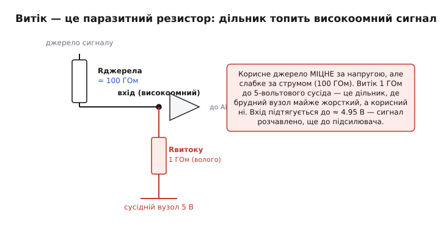
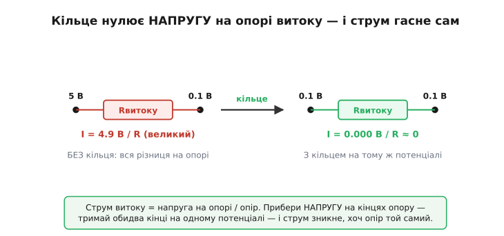
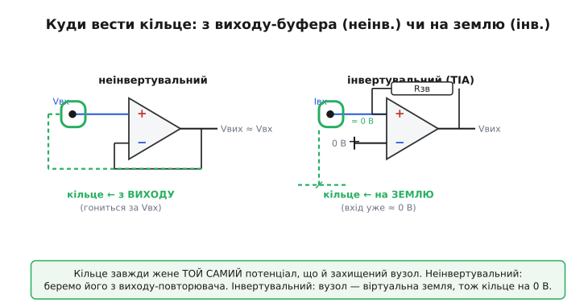
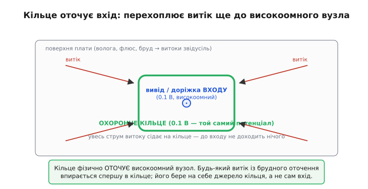

# Guard ring і захист від витоків: як убити паразитний струм, не чіпаючи опору, по якому він тече

Уявіть давач, що віддає крихітний струм — піко-, фемтоампери: фотодіод у темряві, pH-електрод із опором у сотні мегаом, іонізаційна камера. Корисний сигнал такий слабкий, що будь-яка дрібниця поруч його перекриває. І перекриває не наводка, не тепловий шум підсилювача, а щось буденне до образливого: тонка плівка вологи з флюсу на платі, через яку від сусідньої доріжки живлення поволі **підтікає** струм просто по поверхні склотекстоліту. Цей струм — мізерний, нанобери, — але корисний ще менший, і він тоне. Ось де народжується охоронне кільце (англ. *guard ring*): прийом, що гасить паразитний струм витоку не тим, що ставить кращу ізоляцію, а тим, що **прибирає напругу, яка цей струм жене**. І робить це так дешево й елегантно, що став обов'язковим у будь-якому високоомному вході.

> 🔧 **Навіщо це.** Хто працює зі слабким струмом або високим опором джерела, рано чи пізно впирається в стіну: усе пораховано правильно, підсилювач малошумний, екран на місці — а покази повзуть, залежать від вологості, від того, чи мили плату, від відбитка пальця біля входу. Це майже завжди витік по поверхні. Guard ring — перший і найдешевший інструмент проти нього: смужка міді навколо входу, заведена на правильний потенціал, прибирає на порядки те, чого жодна «краща ізоляція» не прибере. Без нього вхід із опором понад мегаом — це лотерея.

## Витік — це паразитний резистор, а не «погана ізоляція»

Щоб побороти витік, його спершу треба побачити правильно. Звична картинка «ізоляція погана, треба краще ізолювати» тут хибна й заводить у глухий кут. Корисніше думати інакше: **між будь-якими двома точками схеми завжди є якийсь опір**, навіть якщо між ними нібито нічого немає — лише поверхня плати, повітря, корпус роз'єму. Цей опір величезний — гігаоми, тераоми, — але **скінченний**. А раз він скінченний, через нього під дією напруги тече струм. Маленький. Та коли корисний струм сам мікроскопічний, «маленький» паразит виявляється співмірним або більшим.

Тепер ключове спостереження. Високоомне джерело — це джерело, **міцне за напругою, але слабке за струмом**. PH-електрод чесно тримає свої, скажімо, 0.1 вольта, але віддати може лише крихти струму, бо його власний ([внутрішній](root:hw-analog/internal-resistance)) опір — сотні мегаом. Поставте поряд паразитний шлях витоку до сусіднього вузла, що сидить на 5 вольтах живлення. Виходить класичний [дільник напруги](root:hw-analog/voltage-divider): зверху наше слабке джерело через свій гігантський опір, знизу — паразитний опір витоку до твердих 5 вольтів. І ось халепа: твердий 5-вольтовий вузол перетягує високоомний вхід **на себе**, бо за струмом він сильніший. Вхід, що мав показувати 0.1 В, підтягується кудись до 4.9 — сигнал розчавлено вщент, ще до підсилювача.


*Корисне джерело міцне за напругою, але слабке за струмом (100 ГОм). Витік 1 ГОм до 5-вольтового сусіда — це дільник, у якому брудний вузол майже жорсткий, а корисний ні. Вхід підтягується до напруги сусіда, і сигнал зникає ще до підсилювача.*

Звідси дві речі стають очевидні. По-перше, **проблема не в самій присутності опору**, а в тому, що на його кінцях є **різниця потенціалів**, яка жене струм. По-друге, з абсолютними значеннями битися важко: опір поверхні склотекстоліту падає від чистих ~1000 ГОм до ~1 ГОм за вологи й бруду — на три порядки, і вгадати його наперед неможливо. А ось напругу на кінцях паразитного шляху ми контролюємо повністю. Саме сюди і б'є охоронне кільце.

## Серце прийому: нулюємо напругу, а не опір

Згадаймо найпростіший закон, [закон Ома](root:hw-analog/ohms-law): струм дорівнює напрузі, поділеній на опір.

```
I = U / R
```

Щоб струм витоку зробити нульовим, є два шляхи. Перший — нескінченно збільшити R: ідеальна ізоляція. Це боротьба з природою — поверхня завжди трохи проводить, волога завжди трохи сідає, і R ніколи не стане нескінченним. Другий шлях — **обнулити U на кінцях цього R**. Якщо обидва кінці паразитного опору тримати на **однаковому потенціалі**, то напруга на ньому нуль, і струм нуль — **хоч би яким поганим був сам опір**. Тераом там чи один-єдиний кілоом — байдуже: помножене на нуль вольтів дає нуль струму.

Це й робить guard ring. Біля високоомного вузла (вивід підсилювача, доріжка, контакт роз'єму) розташовують провідник — кільце — і **силоміць тримають його на тому самому потенціалі, що й сам вузол**. Не на землі, не на живленні — саме на потенціалі захищеного входу, гонячи його туди активно, від низькоомного джерела. Тоді між входом і кільцем напруга нульова, і витік між ними не тече, попри будь-який опір поверхні між ними.


*Струм витоку дорівнює напрузі на опорі, поділеній на опір. Прибери напругу на кінцях — тримай обидва кінці на одному потенціалі — і струм зникне, хоча сам опір лишився той самий поганий.*

> 🔧 **Навіщо це.** Тут ховається зміна мислення, що вартує всієї статті. Початківець, побачивши витік, кидається «покращувати ізоляцію»: тефлонові стійки, очищення, лак — і б'ється з тим, чого не виграти до кінця. Інженер, що зрозумів guard, не чіпає опір узагалі: він робить так, щоб на цьому опорі **не було напруги**. Дешева смужка міді перемагає там, де дорога ізоляція лише відсуває поразку. Той самий хід — «не борися з паразитом, познач його напругу нулем» — вертається в бутстрепі, у схемах вибірки-зберігання, у мостах опору; засвоївши його раз, бачиш скрізь.

Але звідки взяти провідник, що **точно** повторює потенціал входу, та ще й уміє віддавати струм у кільце? Сам високоомний вузол цього не може — він слабкий. Тут і вступає підсилювач.

## Звідки беремо потенціал кільця

Високоомний вхід майже завжди веде в підсилювач — зазвичай із польовим входом, бо лише такий бере мізерний струм бази/затвора (про сам цей паразитний струм самого підсилювача — нижче). А підсилювач **уже має** на своєму виході майже точну копію вхідної напруги — низькоомну, здатну гнати струм. Лишається взяти її і подати на кільце. Куди саме під'єднати — залежить від того, як увімкнено підсилювач, і тут два канонічні випадки.

**Неінвертувальний вхід (повторювач, давач напруги).** Сигнал заходить на «+», вихід повторює його: Vвих ≈ Vвх. Кільце ведемо **прямо з виходу**. Вихід — це і є наш потенціал входу, тільки міцний за струмом. Він жене кільце за входом, куди б той не рухався: вхід піднявся до 0.12 В — вихід і кільце слідом, напруга між кільцем і входом лишається нуль. Залишкова різниця — лише власна [напруга зсуву](root:hw-analog/cmrr) підсилювача, типово одиниці мілівольтів, тож замість повних вольтів на опорі витоку маємо мілівольти: струм падає в сотні-тисячі разів.

**Інвертувальний вхід (трансімпедансний, давач струму).** Тут хитріше й водночас простіше. У такій схемі вхідний вузол — це [віртуальна земля](root:hw-analog/virtual-ground): підсилювач своїм зворотним зв'язком тримає інвертувальний вхід практично на потенціалі неінвертувального, а той сидить на нулі. Тобто захищений вузол **сам по собі вже близько до 0 В**. Отже, кільце не треба нікуди «гнати» активно — його просто садять **на землю**. Вхід ≈ 0 В, кільце = 0 В, напруга між ними ≈ 0, витік не тече.


*Кільце завжди жене той самий потенціал, що й захищений вузол. У неінвертувальній схемі беремо його з виходу-повторювача; в інвертувальній вузол — віртуальна земля, тож кільце просто садимо на 0 В.*

Обидва випадки — одна й та сама ідея під різними кутами: **знайти, де поруч уже є низькоомна копія потрібного потенціалу, і подати її на кільце**. У повторювача це вихід; у трансімпедансного — земля, бо сам вхід уже на нулі.

## Як це виглядає на платі

Тепер від схеми — до міді. На платі високоомний вузол — це не абстракція, а конкретна доріжка й вивід підсилювача, відкриті назустріч усій бруднющій поверхні склотекстоліту: волозі, флюсу, пилу, відбиткам пальців. Витік може приповзти **звідусіль** — від будь-якої сусідньої доріжки під напругою. Тож кільце і роблять **кільцем** у буквальному сенсі: суцільну мідну фігуру, що **повністю оточує** високоомний вузол з усіх боків, перехоплюючи будь-який шлях витоку до нього.

Логіка проста й геометрична. Щоб паразитний струм дістався до входу, він мусить **перетнути кільце**. Але кільце сидить на потенціалі входу — отже, ділянка поверхні між кільцем і входом має нульову напругу на собі, і струм її не долає. Увесь витік із брудного оточення впирається в **зовнішній** край кільця, там і сідає — а живить його не слабкий вхід, а міцне джерело кільця (вихід підсилювача чи земля), якому ці наноампери як слону дробина. Вхід лишається в чистій, нульовій по напрузі «канавці», куди витоку просто немає звідки взятися.


*Кільце фізично оточує високоомний вузол. Будь-який витік із брудного оточення впирається спершу в кільце; його бере на себе джерело кільця, а не сам вхід. До входу не доходить нічого.*

Кілька практичних дрібниць, що відрізняють робоче кільце від декоративного. Кільце ведуть **з обох боків плати** і навколо самого виводу мікросхеми — витік повзе по обох поверхнях. Для зовсім малих струмів високоомний вузол узагалі піднімають над платою на тефлонову стійку («повітряний монтаж»), щоб між ним і склотекстолітом не було контакту, — а кільце все одно лишають навколо опори. І ще: кільце не має бути просто намальоване — воно мусить бути **підключене до правильного потенціалу**; мідне кільце, посаджене «на землю» біля неінвертувального входу, що гойдається разом із сигналом, не лише не допоможе, а ще й нашкодить, бо тепер уже **саме кільце** жене витік у вхід.

Усе, що стосується саме топологічних тонкощів — ширина зазору, обидва шари, поводження біля роз'ємів і конекторів, охоронні кільця навколо груп компонентів — це окрема прикладна тема: [охоронне кільце на платі](root:hw-pcb/guard-ring-pcb) розбирає лейаут детально. Тут нам важливий **принцип**: кільце оточує вузол і тримається на його потенціалі.

## Бонус, якого не чекали: швидкість і ємність

Здавалося б, кільце воює лише з повільним постійним витоком. Але та сама мідь під тим самим потенціалом дарує другий виграш, уже на змінному струмі, — і він часто навіть важливіший.

Високоомний вузол має паразитну **ємність** на все навколо: на землю, на сусідні доріжки, а надто — на екран кабелю, якщо давач під'єднано коаксіалом. Метр коаксіалу — це сотні пікофарад між центральною жилою й оплеткою. Слабке високоомне джерело мусить цю ємність заряджати й розряджати щоразу, як сигнал змінюється, — а струму на це в нього катма. Через величезний опір джерела та ємність дає повільну [сталу часу](root:hw-analog/rc-time-constant) τ = R·C: вхід реагує мляво, сигнал «розмазується», вимір тоне в перехідних процесах. Фактично паразитна ємність **скорочує смугу** високоомного входу до жалюгідних герців.

І ось диво. Якщо екран кабелю (чи доріжку-кільце) тримати на **тому самому потенціалі**, що й центральна жила, то напруга на цій ємності завжди нульова — а раз так, її **не треба заряджати**. Заряд на конденсаторі Q = C·U; коли U між обкладками постійно нуль, заряд не змінюється, струму на перезаряд не потрібно, і ємність ніби **зникає**. Цей трюк — годувати екран копією сигналу, щоб занулити ефект його ємності, — називають [бутстрепом](root:hw-analog/charge-amplifier) (англ. *bootstrap*, «за власні шнурки»). Guard робить його **задарма**: те саме кільце, що вбиває витік на постійному струмі, заразом обнуляє паразитну ємність на змінному — бо обидві біди живе **різниця потенціалів** між вузлом і оточенням, а кільце цю різницю тримає на нулі.

> 🔧 **Навіщо це.** Без бутстрепа екраном високоомний давач на довгому кабелі стає некорисно повільним: смуга падає до одиниць герц, і швидкий сигнал не побачити. Заведений на екран guard «розчиняє» ємність кабелю — вхід ніби бачить джерело напряму, без сотень пікофарад на собі. Тому в pH-метрах, електрометрах, ємнісних давачах екран кабелю **ведуть від guard-виходу приладу**, а не садять на землю: інакше вся точність на постійному струмі лишиться, а швидкодія помре. Один провідник лікує дві хвороби.

Той самий механізм — активне ведення екрана за сигналом — у його повному вигляді (як guard стає **веденим екраном**, що захищає весь тракт, не лише точку входу) розгорнуто в темі [guard як ведений екран](root:hw-analog/driven-shield-and-triax). Тут ми бачимо її корінь: кільце на потенціалі вузла прибирає і витік, і ємність однією дією.

## Чому це працює: рахунок на пальцях

Слова «струм падає в сотні разів» варто підкріпити числом. Порахуймо, наскільки guard покращує справу в конкретному прикладі.

**Витік до й після кільця.** Високоомний вхід тримає 0.1 В. Поряд — доріжка живлення на 5 В, опір витоку по вологій поверхні R = 1 ГОм. Власна напруга зсуву підсилювача (вона лишається на опорі витоку навіть із кільцем) — 2 мВ. Який струм витоку без кільця і з ним?

```
без кільця:  на опорі витоку повна різниця 5 − 0.1 = 4.9 В
   Iвит = 4.9 В / 1×10⁹ Ом = 4.9×10⁻⁹ А = 4.9 нА

з кільцем:   кільце жене 0.1 В (копію входу), на опорі лишається
             тільки зсув підсилювача 2 мВ
   Iвит = 0.002 В / 1×10⁹ Ом = 2×10⁻¹² А = 2 пА

виграш:      4.9 нА / 2 пА = 2450 разів
```

Майже в дві з половиною тисячі разів менше — і це **без жодної зміни ізоляції**, той самий поганий гігаом. Витік упав з небезпечних наноампер до невинних пікоампер просто тому, що ми зняли з опору майже всю напругу, лишивши на ньому крихітний зсув. Ось чому в практичних джерелах guard називають способом «помножити ізоляцію на тисячу» — не покращивши саму ізоляцію ні на йоту.

У коді ту саму оцінку зручно мати під рукою — наприклад, прикинути, чи guard взагалі потрібен для заданого опору джерела й допуску на похибку:

```c
// Оцінка струму витоку до і після guard. Якщо корисний струм давача
// співмірний з I_no_guard — guard обовʼязковий; з I_guard — можна жити без нього.
float leak_no_guard(float v_dirty, float v_node, float r_leak) {
    return (v_dirty - v_node) / r_leak;          // повна різниця на опорі
}
float leak_with_guard(float v_offset, float r_leak) {
    return v_offset / r_leak;                     // лишається тільки зсув ОП
}

// приклад: брудний вузол 5 В, вхід 0.1 В, R витоку 1 ГОм, зсув 2 мВ
float Ing = leak_no_guard(5.0f, 0.1f, 1.0e9f);   // 4.9e-9  А  = 4.9 нА
float Ig  = leak_with_guard(0.002f, 1.0e9f);     // 2.0e-12 А  = 2 пА
float gain = Ing / Ig;                            // ≈ 2450
```

Звідки беруться оці фактори «1000×», як точно порахувати залишковий витік через зсув і через скінченне підсилення повторювача, і чому guard ніколи не дає геть нуль, а лише пригнічення на кілька порядків — у вставці [скільки guard виграє: рахунок пригнічення витоку](root:hw-analog/guard-ring-input-leakage/math-guard-attenuation.md). Тут досить порядку: одиниці тисяч разів — і витік із проблеми стає дрібницею.

## Проти чого guard безсилий

Чесний інструмент треба знати і з боку меж. Guard ring — не панацея, і кілька речей він **не** лікує, бо вони не про напругу на поверхневому опорі.

По-перше, **власний вхідний струм підсилювача**. Будь-який реальний підсилювач сам забирає крихітний струм зі свого входу — [вхідний струм зсуву](root:hw-analog/input-bias-current) (англ. *input bias current*), у польових входів це піко- чи навіть фемтоампери. Цей струм тече **в сам кристал**, не по поверхні плати, і кільце на нього не діє ніяк. Тому під високоомний вхід беруть підсилювач із малим власним струмом (польовий, електрометричний) — guard прибирає **зовнішній** витік, а внутрішній лишається на совісті самої мікросхеми.

По-друге, **витік крізь товщу матеріалу**, а не по поверхні. Якщо струм іде не плівкою на поверхні, а наскрізь через об'єм діелектрика (поганий конденсатор у тракті, вологий склотекстоліт наскрізь), кільце на поверхні його не перехопить — воно стереже саме поверхню. На щастя, поверхневий витік зазвичай на порядки більший за об'ємний, тож guard б'є по головному ворогу; але пам'ятати про різницю варто.

По-третє, guard **не замінює екран від наводок**. Кільце на потенціалі входу гасить витік і паразитну ємність, але від зовнішнього електричного поля, що наводить заваду, захищає [екран на землі](root:hw-analog/input-protection-analog) — інша роль, інше підключення. У складних входах ставлять і те, і те: guard зсередини, екран зовні.

І найтиповіша пастка: **кільце, заведене не на той потенціал**. Guard, посаджений на землю там, де треба гнати його з виходу (неінвертувальна схема), не просто не допомагає — він **створює** витік, бо тепер між гойдливим входом і нерухомим кільцем є повна напруга сигналу. Правило одне й непорушне: кільце мусить сидіти **рівно на потенціалі того вузла, який стереже**, — і брати цей потенціал від низькоомного джерела (виходу чи землі), а не від самого слабкого вузла.

## Що варто винести

Guard ring — це прийом проти струму витоку, що працює **не з опором, а з напругою**. Витік не лікують кращою ізоляцією, бо поверхню до кінця не висушити й опір її не зробити нескінченним; натомість беруть провідник-кільце, оточують ним високоомний вузол і тримають кільце на **тому самому потенціалі**, що й вузол. Тоді на паразитному опорі між ними напруга нульова — і за законом Ома струм нульовий, хоч би яким поганим був той опір. Потенціал для кільця беруть від низькоомної копії: у неінвертувальній схемі — з виходу-повторювача, в інвертувальній — із землі, бо вхід там і так віртуальна земля. На платі кільце фізично оточує вузол, перехоплюючи витік звідусіль, і ведеться з обох боків. Бонусом та сама мідь обнулює паразитну ємність вузла (бутстреп), повертаючи високоомному входу швидкодію, яку з'їдав довгий кабель. Пригнічення — порядку тисячі разів: наноампери витоку стають пікоамперами, без жодної зміни ізоляції. А межі чесні: guard не чіпає власний струм підсилювача, не ловить об'ємний витік і не замінює екран від наводок — і геть мертвий, якщо заведений не на той потенціал. Хто бачить витік як паразитний резистор під напругою, той знає, що бити треба по напрузі, — і дешева смужка міді робить те, чого не зробить дорога ізоляція.
