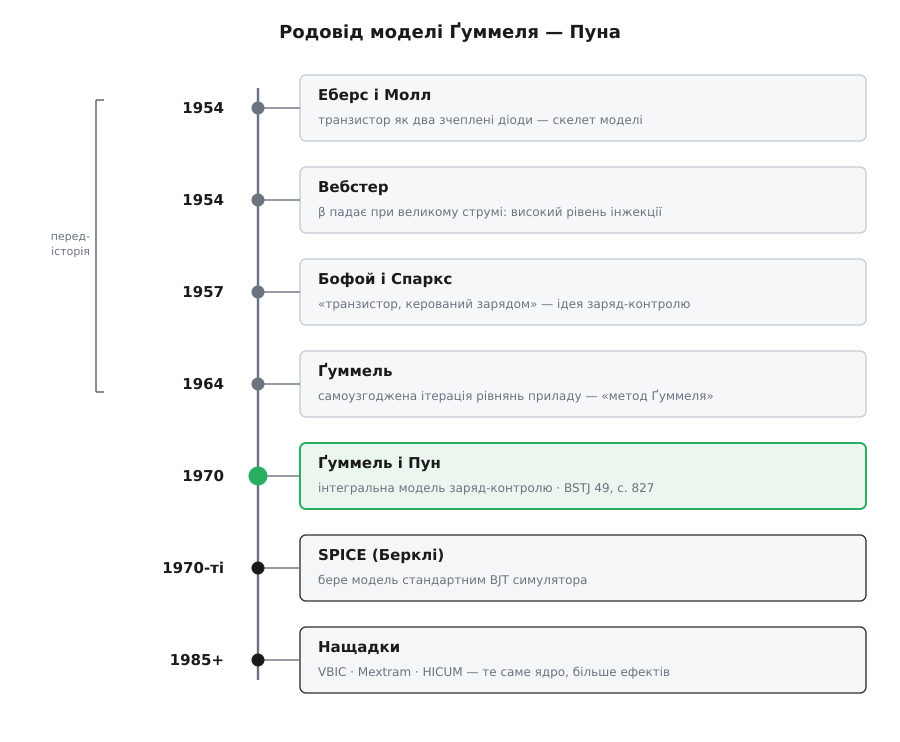

# 📜 Як народжувалася чесна модель транзистора

До 1970 року інженер, що рахував транзисторне коло, жив із дивним компромісом. У нього вже був надійний кістяк — [модель Еберса — Молла](root:hw-analog/ebers-moll), два зчеплені діоди, опублікована 1954 року (J. J. Ebers, J. L. Moll, *Large-signal behavior of junction transistors*, Proc. IRE, т. 42, с. 1761–1772). Вона правильно ловила головне. Але щойно струм відходив від «зручної середини», модель починала брехати, і кожну брехню доводилося латати окремо: тут дописати спад підсилення на великому струмі, там — витік на малому, ще деінде — нахил вихідних характеристик. Пластир на пластирі. Кістяк був, а живого, суцільного тіла — ні.

Найдивовижніше, що всі потрібні шматки фізики на той час уже були відкриті — просто лежали в різних статтях і не трималися купи. Історія моделі Ґуммеля — Пуна — це не історія відкриття нового ефекту. Це історія про те, як розрізнені правки звели в один короткий, обчислюваний закон, який можна закласти в машину. І про двох людей із Bell Labs, чиї сліди в цій історії дуже нерівні: одного видно до дрібниць, другого — майже ні.

## Латки, що не трималися купи

Перша тріщина в ідеальній картині відкрилася того ж 1954 року, що й сама модель Еберса — Молла. Вільям Вебстер (William M. Webster) у статті *On the variation of junction-transistor current-amplification factor with emitter current* (Proc. IRE, т. 42, с. 914–920) показав річ, яку сьогодні знає кожен, хто ганяв транзистор на межі: коли струм емітера великий, коефіцієнт підсилення падає. Причина — режим, який назвали високим рівнем інжекції (англ. *high-level injection*): вприснутих у базу носіїв стає стільки ж, скільки там власних, база мусить підтягти зайвий заряд заради нейтральності, і перенос гальмується. Вебстер описав правий схил того дзвону підсилення за шістнадцять років до того, як його вбудували в струнку модель.

На протилежному кінці струму сидів інший ефект — витік у переході база–емітер, що з'їдав підсилення на малих струмах. Посередині плато вихідних характеристик виявлялося не пласким, а трохи нахиленим: зворотна напруга на колекторі підтискала базу й підіймала струм. Кожне з цих явищ мало своє пояснення й свою формулу. Чого бракувало — це спільної рами, у якій вони поставали б не як три різні поправки, а як три обличчя однієї величини.

## Заряд замість напруги: Бофой і Спаркс, 1957

Раму дала зміна погляду, і сталася вона не в Америці, а в Британії. 1957 року Річард Бофой і Джон Спаркс (R. Beaufoy, J. J. Sparkes) з дослідницької лабораторії телефонної компанії надрукували статтю з назвою, що сама по собі була програмою: *The junction transistor as a charge-controlled device* — «Транзистор як прилад, керований зарядом» (ATE Journal, т. 13, с. 310–327).

Їхня думка проста й глибока. Здається, що струмом транзистора керує напруга на переході. Але напруга — величина другорядна, майже випадкова: вона лише наслідок того, скільки заряду носіїв накопичено в базі. Керує ж струмом сам цей заряд (англ. *charge control*). Скільки заряду треба закачати, щоб база провела, як швидко він розсмоктується, як його вимести, щоб транзистор замкнувся, — усе це прямо про заряд, а через напругу лише переказане манівцями.

Погляд заряд-контролю виявився надзвичайно плідним. Він природно єднав статику з динамікою: той самий накопичений заряд, що задає струм, визначає й швидкість перемикання. Джон Лінвілл (John Linvill) розвинув споріднений підхід зі зосередженими «нагромаджувачами» заряду, а вже 1967 року Ганс Келер (H. K. Koehler) у Bell System Technical Journal показав, що заряд-контрольний еквівалентний ланцюг є містком між класичними велико-сигнальними моделями діода й транзистора. Ідея дозріла. Бракувало людини, яка перетворила б цей спосіб думати на короткий закон, придатний не для рук, а для машини.



*Жодної нової фізики 1970 року не відкрили — усі складники (два діоди, високий рівень інжекції, ідея заряд-контролю) уже лежали в статтях 1954–1957 років. Ґуммель і Пун звели їх в один обчислюваний закон, і саме він за кілька років став стандартним транзистором усередині SPICE.*

## Герман Ґуммель

Тією людиною став Герман Карл Ґуммель (Hermann Karl Gummel) — і його шлях до транзисторних рівнянь важко вигадати химернішим.

Народився він 5 липня 1923 року в Ганновері, у Німеччині; був середньою з трьох дитиною в родині. Дорослішання випало на найтемніші німецькі роки. Скінчивши школу вже за нацизму, Ґуммель потрапив на війну — радистом до німецької армії. Під час висадки в Нормандії його поранило осколком і взяли в полон; шотландські медики виходжували ногу так дбайливо, що вдалося обійтися без ампутації, хоч біль лишився з ним на все життя. Ця біографічна деталь важлива для точності: Ґуммель — німець за походженням і громадянством первісно, а не якийсь абстрактний «західний учений»; американцем він став уже потім, через науку.

Після війни був фах фізика: диплом Марбурзького університету (Philipps-Universität) 1952 року. Того ж року Ґуммель перебрався до США, у Сиракузький університет, де здобув магістерський, а 1957-го — докторський ступінь з теоретичної фізики напівпровідників. Науковим керівником був Мелвін Лакс (Melvin Lax). Коли Лакс перейшов до Bell Laboratories, Ґуммель рушив слідом — до легендарної лабораторії він прийшов 1956 року, ще завершуючи дисертацію.

У Bell Labs і розкрився його справжній дар — не стільки до фізики приладу, скільки до того, щоб змусити рівняння приладу рахуватися на обчислювальній машині. Ще 1964 року, задовго до транзисторної моделі свого імені, Ґуммель дав статтю *A self-consistent iterative scheme for one-dimensional steady state transistor calculations* (IEEE Trans. Electron Devices, т. 11, с. 455–465). У ній він показав, як самоузгоджено, ітерацією, розв'язати зчеплені рівняння приладу — електростатику й перенос носіїв — крок за кроком. Цей спосіб розв'язання досі звуть **методом Ґуммеля** (англ. *Gummel iteration*), і він лежить в основі числового моделювання напівпровідників дотепер. Тоді ж народився й **графік Ґуммеля** — логарифмічний спосіб знімати з транзистора обидва струми одразу, стандартний інструмент характеризації.

> 🔧 **Навіщо це.** Не випадково саме Ґуммель дав компактну модель. Людина, що роками вчила великі машини розв'язувати повні рівняння транзистора «в лоб», краще за будь-кого бачила, чого коштує кожен зайвий доданок, коли ту саму модель треба порахувати мільйони разів у симуляції великого кола. Компактна модель — це стиснення дорогого точного розрахунку до кількох рядків, які не жаль повторювати. Хто знає ціну повного, той уміє стискати з розумом.

## Х. К. Пун — тінь поруч із іменем

А тепер про другу людину в назві — і про чесність історика. У заголовку статті стоїть **H. C. Poon**, і на цьому певне знання майже вичерпується. Х. К. Пун був колегою Ґуммеля по Bell Labs і співавтором моделі 1970 року — це задокументовано твердо. Але за ініціалами «H. C.» доступні джерела не дають надійно ні повного імені, ні місця народження, ні дальшої кар'єри. Прізвище Poon — романізоване китайське (潘), що вказує на китайське походження, проте самé по собі прізвище — заслабка підстава, щоб упевнено дописувати людині національність чи біографію. Тож чесний статус тут такий: внесок Пуна в модель — факт; ширша його ідентичність — прогалина в загальнодоступному записі, а не встановлене знання.

Ця нерівність слідів повчальна сама по собі. Історія техніки любить зводити відкриття до одного-двох імен, та за кожним таким іменем стоїть колектив і ланцюг попередників. Варто розрізняти рівні внеску навіть усередині самої пари Ґуммель — Пун. У тому ж томі Bell System Technical Journal за 1970 рік Ґуммель надрукував і **окрему, одноосібну** статтю — *A Charge Control Relation for Bipolar Transistors*, де вивів саме́ співвідношення заряд-контролю. Спільна ж із Пуном праця перетворила це співвідношення на завершену, придатну до вжитку модель із повним набором параметрів. Ідея закону й доведення його до робочого інструмента — різні кроки, і другий крок робили вже вдвох.

## Стаття травня 1970 року

Сама праця вийшла в Bell System Technical Journal, т. 49, за травень–червень 1970 року, на сторінках 827–852, під назвою *An Integral Charge Control Model of Bipolar Transistors*. Кожне слово в назві навантажене.

**Charge control** — успадкований від Бофоя й Спаркса погляд: керує струмом заряд у базі. **Integral** — ключове уточнення Ґуммеля й Пуна: керує не просто заряд, а заряд, **проінтегрований по всій товщині бази**. Ця проінтегрована величина — заряд основних носіїв у базі — і є те, що згодом назвуть числом Ґуммеля. Запишімо серце моделі одним рядком, щоб побачити, звідки береться «інтеграл»:

```
              q · A · ∫ n(x) dx           (заряд бази, проінтегрований
Q_B  =  ─────────────────────────         по товщині — «число Ґуммеля»)

I_К  =  (I_S / q_b) · (e^(V_BE/Vₜ) − e^(V_BC/Vₜ)),   q_b = Q_B / Q_B0
```

Уся хитрість — у безрозмірному `q_b`, нормованому заряді бази: скільки насправді заряду в базі проти ідеального випадку. Коли база звужується зворотним колектором — заряду меншає, `q_b` падає нижче одиниці, струм росте (це нахил плато). Коли великий струм накопичує в базі надлишок носіїв — заряду більшає, `q_b` росте понад одиницю, підсилення валиться (це високий рівень інжекції Вебстера). **Обидва ефекти, які раніше латали окремо, тепер випадають з одного знаменника.** Ось у чому переворот: не «додай поправку на Ерлі, додай поправку на інжекцію», а «поділи звичну експоненту на чесний заряд бази — і поправки з'являться самі».

І остання, недооцінена властивість, без якої модель нікуди б не пішла: при малому зміщенні, коли `q_b → 1`, вона **точно** зводиться до Еберса — Молла. Ґуммель і Пун не викинули надійний кістяк 1954 року — вони обгорнули його одним множником. Стара модель лишилася окремим випадком нової. Саме тому інженерам не довелося нічого переучувати: у знайомій зоні все рахувалося як раніше, а на краях діапазону — тепер чесно.

## Чому вона стала стандартом і чому лишилася

Хороша модель ще не робиться стандартом сама. Моделі Ґуммеля — Пуна поталанило народитися саме тоді, коли з'явилося, куди її класти.

1975 року Лоуренс Нейгел (Laurence Nagel) у Каліфорнійському університеті в Берклі випустив [SPICE](root:hw-pcb/spice-simulation) 2 — симулятор кіл, що став галузевим стандартом. За модель біполярного транзистора в ньому взяли саме інтегральну модель заряд-контролю Ґуммеля й Пуна, трохи розширену. Вибір був не випадковий, і причини його — рівно ті, що робили модель доброю:

- **Компактність.** Кілька десятків параметрів замість повного числового розрахунку приладу — таке не жаль рахувати мільйони разів у великій симуляції. Тут знадобилося саме чуття Ґуммеля до ціни обчислення.
- **Параметри знімаються з вимірювань.** Виробникові не треба знати внутрішню фізику зразка — досить прогнати графік Ґуммеля й вихідні характеристики та витягти з них числа. Модель ніби спеціально скроєна під те, що можна виміряти на столі.
- **М'яке спрощення.** Якщо частину параметрів не задати, модель сама осідає до Еберса — Молла й не ламається. Успадкована сумісність зі старим кістяком стала практичною зручністю.
- **Фізична основа.** Модель трималася реальних процесів, а не підгінних кривих, тож її можна було нарощувати далі.

Останню властивість перевірив час. Для надшвидких і надточних приладів, яких 1970 року ще не мусили ловити, — НВЧ-транзисторів, кремній-германієвих гетеропереходів — модель розширили в наступників: VBIC, Mextram (Philips), HICUM (Райн). Але всі вони — доробки того самого ядра, а не заміна йому. Для переважної більшості звичайних кіл дотепер, понад пів століття по тому, стандартним транзистором усередині симулятора лишається саме модель Ґуммеля — Пуна.

Герман Ґуммель дожив до цього визнання сповна. 1983 року він отримав премію Девіда Сарнова від IEEE, 1985-го його обрали до Національної інженерної академії США, а 1994-го він став **першим** лауреатом премії Філа Кауфмана — головної нагороди в галузі систем автоматизованого проєктування електроніки. Помер він 5 вересня 2022 року в Нью-Джерсі, у віці 99 років. Життя, що почалося радистом розбитої армії й полоненим на нормандському узбережжі, скінчилося тим, що ім'я цієї людини щодня мовчки рахується всередині кожного симулятора кіл на планеті.

---

**Статус доказовості.** Дати, назви й вихідні дані статей (Еберс — Молл 1954, Вебстер 1954, Бофой — Спаркс 1957, метод Ґуммеля 1964, модель Ґуммеля — Пуна: BSTJ, т. 49, с. 827–852, 1970; SPICE 2 — Берклі, 1975) звірені за первинними покажчиками журналів і сходяться — це усталений факт. Біографія Германа Ґуммеля (Ганновер, 1923; служба радистом і полон; диплом Марбурга 1952; докторат Сиракуз 1957 у Мелвіна Лакса; Bell Labs з 1956; премії Сарнова 1983, Кауфмана 1994; смерть 2022) підтверджена кількома незалежними джерелами, включно з некрологами й Національною інженерною академією, — надійно. Натомість повне ім'я, походження й дальша доля **H. C. Пуна** в загальнодоступних джерелах не встановлені; будь-яке твердження понад «колега Ґуммеля по Bell Labs і співавтор моделі 1970 року» слід вважати непідтвердженим.
