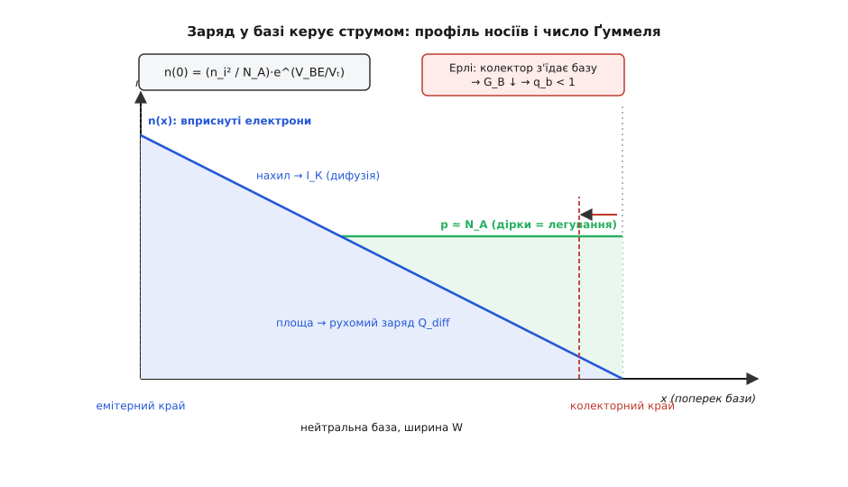
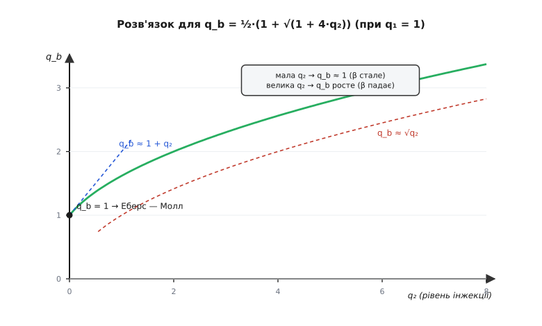

# 🧮 Заряд бази й число Ґуммеля: повний апарат

Уся модель тримається на одному твердженні, яке варто сформулювати гостро: **колекторний струм обернено пропорційний до заряду, що сидить у базі**. Не до напруги — до заряду. Напруга лише задає, скільки носіїв уприскується в базу; а от наскільки легко вони крізь неї проходять, вирішує те, скільки заряду там уже накопичено. Чим більше заряду в базі, тим повільніша дифузія крізь неї, тим менший струм при тій самій напрузі.

Ця думка називається **інтегральним співвідношенням заряд-контролю** (англ. *integral charge-control relation*, ICCR); її 1970 року в Bell Labs сформулював Герман Ґуммель, а того ж року розгорнув у повну модель разом із Пуном. Далі — увесь апарат: як записати струм через інтеграл заряду, звідки береться безрозмірний множник q_b, як він розпадається на два впливи й чому саме в такій комбінації, і як усе це в границі стискається назад у [модель Еберса — Молла](topic:hw-analog/ebers-moll) — дві зчеплені експоненти без жодного дихання.

## Одна ідея: струм обернений до заряду

Погляньмо, звідки взагалі береться обернена пропорційність. Носії (для npn — електрони) заходять з емітера в базу й мусять дістатися колектора. Вони роблять це **дифузією**: рухаються туди, де їх менше. Швидкість дифузійного потоку задає закон Фіка — струм пропорційний **градієнту** концентрації, тобто тому, наскільки круто концентрація спадає від емітерного краю бази до колекторного.

А чим задано самі концентрації на краях? Законом переходу (тим самим, що дає [експоненту Шоклі й тепловий потенціал Vₜ ≈ 25.85 мВ при 300 K](topic:hw-components/diode-iv-curve)): скільки неосновних носіїв стоїть біля переходу — визначає напруга на ньому.

```
на емітерному краї бази:  n(0) = (n_i² / N_A)·e^(V_BE/Vₜ)
на колекторному краї:      n(W) = (n_i² / N_A)·e^(V_BC/Vₜ)
```

Тут n_i — власна концентрація носіїв, N_A — [легування бази](topic:ph-condensed/doping) (концентрація акцепторів), W — ширина нейтральної бази. У тонкій базі рекомбінацією [неосновних носіїв на прольоті](topic:ph-condensed/minority-carrier-diffusion-transport) можна знехтувати, тож потік однаковий у кожній точці — а це означає, що n(x) спадає **лінійно**. Прямий профіль, трикутник від n(0) до майже нуля на колекторі.

Градієнт лінійного профілю — це просто перепад, поділений на ширину: [n(0) − n(W)]/W. Помножимо на q·D_n (заряд і коефіцієнт дифузії) — і маємо густину струму:

```
J_К = q·D_n·[n(0) − n(W)] / W
    = q·D_n·(n_i²/N_A)·(e^(V_BE/Vₜ) − e^(V_BC/Vₜ)) / W
```

А тепер фокус. Домножмо чисельник і знаменник на N_A. У знаменнику виникне N_A·W — **інтеграл легування по товщині бази**. Саме він і є ключем:

```
J_К = q·D_n·n_i²·(e^(V_BE/Vₜ) − e^(V_BC/Vₜ)) / (N_A·W)
```

Струм обернений до N_A·W — до кількості заряду в базі на одиницю площі. Помножили базу вдвічі товщу чи вдвічі густішу — і струм удвічі менший. Ось звідки «струм обернений до заряду»: заряд стоїть просто в знаменнику.



*Нейтральна база між двома краями. Синій трикутник — вприснуті електрони n(x); його **нахил** задає колекторний струм (дифузія), а його **площа** — рухомий заряд у базі. Зелена смуга — рівнозначні дірки легування p ≈ N_A; площа під нею і є число Ґуммеля G_B. Коли збіднений шар колектора з'їдає базу справа (пунктир), G_B меншає — це ефект Ерлі.*

## Число Ґуммеля: інтеграл легування

Величину N_A·W — а в загальному разі, коли легування нерівномірне, інтеграл — назвали **числом Ґуммеля** (англ. *Gummel number*):

```
G_B = ∫₀ᵂ N_A(x) dx          [см⁻²]
```

Це кількість домішкових атомів у базі під одиницею площі емітера. Або, що те саме за нейтральності, кількість основних носіїв (дірок для npn), які там сидять: заряд бази Q_B = q·G_B. Число суто геометрично-технологічне: його закладають, коли легують і роблять базу тонкою. Товща й густіша база — більше число Ґуммеля; тонша й слабше легована — менше.

Через нього струм насичення виражається одним рядком:

```
I_S = q·A·D_n·n_i² / G_B
```

де A — площа переходу. Ось чому I_S так шалено залежить від температури: у чисельнику стоїть n_i², а власна концентрація носіїв росте з температурою як T³·e^(−E_g/kT). І ось чому I_S у транзистора крихітний — порядку 10⁻¹⁴…10⁻¹⁶ А: число Ґуммеля велике, воно в знаменнику. Ціла фізика виготовлення транзистора — легування, товщина бази — стискається в одне це число, а воно задає I_S.

Загальніше, коли й D_n, і n_i змінюються вздовж бази (нерівномірне легування створює вбудоване поле, що додає до дифузії ще й дрейф), Ґуммелеве співвідношення пише струм через зважений інтеграл:

```
I_К = q·A·n_i₀²·(e^(V_BE/Vₜ) − e^(V_BC/Vₜ)) / ∫₀ᵂ [p(x) / (D_n(x)·n_i²(x))] dx
```

але суть та сама: у знаменнику — проінтегрований по базі заряд, лише зважений на рухливість і на локальну n_i². Для розуміння тримаймо просту картину N_A·W; коефіцієнти лиш уточнюють число.

> 🔧 **Навіщо це.** Коли ви бачите в даташиті I_S = 3·10⁻¹⁵ А, ви фактично читаєте число Ґуммеля цього транзистора — згорнуту в одне число товщину й легування його бази. А що I_S ∝ n_i²: саме звідси всі температурні напасті BJT — і чому струм подвоюється щось на кожні 10 °C при сталій V_BE, і чому струмове дзеркало пливе з нагрівом. Не «транзистор капризний» — просто в чисельнику стоїть n_i², яка стрімко росте.

## Нормований заряд q_b

Дотепер число Ґуммеля G_B було стале — суто те, що заклали при виготовленні. Але справжній заряд у базі **не сталий**: він змінюється зі зміщенням. І Ґуммелеве співвідношення каже дуже сильну річ — у знаменнику стоїть **повний** заряд дірок у базі, включно з тими рухомими дірками, які набігають при роботі. Не лише легування — увесь заряд.

Тож замість того, щоб дописувати до моделі окремі поправки «на те» й «на се», роблять один хід: беруть рівноважне число Ґуммеля G_B0 (при нульовому зміщенні) за одиницю виміру й вимірюють у ньому справжній заряд бази. Це відношення й називають **нормованим зарядом бази**:

```
q_b = Q_B / Q_B0 = G_B / G_B0
```

Безрозмірне число, рівне одиниці в ідеалі. Струм насичення I_S лишається «паспортним» — рахованим від рівноважного G_B0, — а вся зміна заряду зі зміщенням переходить у q_b. Транспортний струм тоді пишеться точнісінько як інтегральне співвідношення, лише з нормуванням:

```
I_К = (I_S / q_b)·(e^(V_BE/Vₜ) − e^(V_BC/Vₜ))
```

І ось у чому краса. Дві геть різні фізичні речі, які псують ідеальну картину, — **звуження бази** збідненим шаром і **набивання бази** рухомими носіями — обидві є не що інше, як «заряд у базі змінився». Обидві живуть в одному q_b. Модель не заводить окремих правил; вона лишає ту саму експоненту й лише ділить її на чесний, дихаючий заряд бази.

Тепер треба з'ясувати, як саме q_b відхиляється від одиниці. Він складається з двох внесків, і кожен я випишу окремо, перш ніж поєднати їх в одну формулу.

## q₁: деплеція звужує базу (ефект Ерлі)

Перший внесок — від **збіднених шарів** на переходах. Кожен p-n-перехід має область, звідки рухомі носії пішли; що сильніше перехід зворотно зміщений, то ширша ця область. А розширюється вона **за рахунок нейтральної бази**. Метал бази нікуди не дівається, але та його частина, що потрапила в збіднений шар, більше не тримає рухомих дірок — тобто випадає з заряду Q_B, який рахує число Ґуммеля.

Отже, зворотне зміщення колектора з'їдає базу справа, зменшує G_B, зменшує q_b — і струм росте. Це і є [ефект Ерлі](topic:hw-analog/early-effect): плато вихідних характеристик не пласке, а трохи задерте вгору, бо з ростом V_CE база тоншає й струм повзе вгору.

Як записати цю залежність? Виявляється, лінійною виходить не сам q_b, а його **обернена величина**. Причина проста: струм ∝ 1/q_b, а Ерлі-нахил струму від напруги — прямий, отже 1/q_b лінійне за напругою. Коефіцієнти цієї лінійності і є **напруги Ерлі**:

```
1 / q₁ = 1 − V_BC/VAF − V_BE/VAR
```

де q₁ — це q_b у режимі малих струмів (лише деплеція, без інжекції). Розберімо два члени:

- **VAF** (*forward Early voltage*, пряма напруга Ерлі) стоїть при V_BC — модуляція бази з боку колектора. У прямому активному режимі V_BC < 0 (колектор зворотно зміщений), тож −V_BC/VAF > 0: знаменник більшає, q₁ = 1/(…) меншає під одиницю, струм росте. Це головний, «робочий» Ерлі.
- **VAR** (*reverse Early voltage*, зворотна напруга Ерлі) стоїть при V_BE — модуляція бази з боку емітера. Помітна в інверсному режимі; у звичайній роботі V_BE малий і цей член слабкий (часто VAR узагалі велике й член нехтується).

> 🔧 **Навіщо це.** VAF — це той параметр, що визначає **вихідний опір** транзистора r_o ≈ VAF/I_К, а отже й максимальне підсилення каскаду з спільним емітером. Хочете точно порахувати підсилення підсилювача чи вихідний опір струмового дзеркала — без члена V_BC/VAF модель дасть ідеально пласке плато й нескінченний r_o, якого в залізі нема. Продовжені вліво, усі лінії вихідних характеристик сходяться в точці V_CE = −VAF — так VAF і витягають із виміряного графіка.

Знак у SPICE-угоді: напруги переходів — це V_BE = V_база − V_емітер і V_BC = V_база − V_колектор. У прямому активному V_BE ≈ +0.7 В, а V_BC глибоко від'ємне (колектор набагато вище бази). Тому −V_BC/VAF додатне й велике — саме воно й тягне q₁ під одиницю.

## q₂: інжекція набиває базу

Другий внесок — від **самих рухомих носіїв**. Поки вприснутих у базу електронів мало проти рідних дірок легування, картина лінійна. Але коли струм такий, що інжектованих електронів у базі стає стільки ж, скільки там акцепторних дірок, база мусить, щоб лишитися електрично нейтральною, підтягти **додаткові дірки** — по одній на кожен зайвий електрон. Цей надлишковий рухомий заряд додається до Q_B, роздуває число Ґуммеля, штовхає q_b **понад** одиницю — і струм гальмується. Це **високий рівень інжекції**.

Скільки цього надлишкового заряду? Він пропорційний **струму**, що тече крізь базу, — а той пропорційний ідеальній експоненті. Зручно виміряти його **струмами колін** IKF і IKR — тими струмами, при яких надлишковий рухомий заряд зрівнюється з рівноважним зарядом бази (і q_b помітно відходить від одиниці). Позначмо через q₂ нормований рухомий заряд, який був би при q_b = 1:

```
q₂ = (I_S/IKF)·(e^(V_BE/(NF·Vₜ)) − 1)  +  (I_S/IKR)·(e^(V_BC/(NR·Vₜ)) − 1)
```

- **IKF** (*forward knee current*, струм коліна прямий) керує прямим членом: коли I_К підбирається до IKF, інжекція починає гнути експоненту. Типово IKF — десятки-сотні міліампер.
- **IKR** (*reverse knee current*, зворотний) — те саме для інверсного режиму, через V_BC.
- **NF**, **NR** — коефіцієнти неідеальності прямої й зворотної експонент (типово ≈ 1); вони ж стоять у самому транспортному струмі.

У прямому активному режимі V_BC < 0, друга експонента ≈ 0, і q₂ зводиться до першого члена — рівно того, що дає правий схил дзвону β.

## Квадратне рівняння: як q₁ і q₂ дають q_b

Тепер поєднаймо обидва внески — і тут криється найтонше місце всього апарату. Наївно хотілося б написати q_b = q₁ + q₂: до деплеційного заряду додаємо інжекційний. Але так не вийде, і причина глибока й гарна.

Рухомий заряд пропорційний **струму**. А струм сам дорівнює I_S/q_b·(…) — тобто **зворотно** залежить від того самого q_b, який ми шукаємо. Коли q_b росте, струм падає, а отже й рухомий заряд, який його роздуває, теж стає меншим. Заряд визначає струм, струм визначає заряд — коло замикається саме на себе. Це не рівняння, яке розв'язується підстановкою; це **самоузгоджена** умова.

Запишімо її чисто. Виміряймо повний заряд в одиницях деплеційного, тобто введімо відношення r = q_b / q₁. Тоді baseline — це r = 1 (лише деплеція, інжекції нема). Інжекція накидає зверху рухомий заряд; але, оскільки він ∝ струму ∝ 1/q_b ∝ 1/r у цих одиницях, надлишок дорівнює не q₂, а q₂/r. Виходить:

```
r = 1 + q₂/r
```

Одне невідоме, одне рівняння — але воно кусає себе за хвіст. Домножмо на r:

```
r² − r − q₂ = 0
```

Звичайна квадратна. Додатний корінь:

```
r = ½·(1 + √(1 + 4·q₂))
```

А q_b = q₁·r повертає нас до повної формули:

```
q_b = (q₁/2)·(1 + √(1 + 4·q₂))
```

Ось звідки той дивний корінь, що завжди спантеличує при першій зустрічі: він не з примхи, а прямий наслідок того, що заряд і струм визначають одне одного. Квадратне рівняння — підпис самоузгодженості.



*Головна крива q_b(q₂) при q₁ = 1. При малій q₂ вона йде дотичною q_b ≈ 1 + q₂ (майже одиниця — модель фактично Еберс — Молл, β стале). При великій q₂ виходить на q_b ≈ √q₂ — заряд росте як корінь зі струму, і саме тут β валиться. Множник q₁ (ефект Ерлі) масштабує всю криву вниз.*

Перевірмо дві границі, бо в них уся суть:

- **Мала інжекція** (q₂ → 0): √(1 + 4q₂) ≈ 1 + 2q₂, тож q_b ≈ q₁·(1 + q₂). Заряд майже деплеційний, чуть роздутий інжекцією. При q₂ = 0 маємо рівно q_b = q₁.
- **Велика інжекція** (q₂ ≫ 1): √(1 + 4q₂) ≈ 2√q₂, тож q_b ≈ q₁·√q₂. Заряд росте як **корінь** зі струму. Звідси й знамените «показник ніби вдвічі слабший»: I_К ∝ e^(V/Vₜ)/q_b ∝ e^(V/Vₜ)/√(e^(V/Vₜ)) = e^(V/(2Vₜ)). Колекторна експонента на графіку Ґуммеля гнеться вдвічі положе — рівно те, що видно на живому транзисторі.

## Повний набір рівнянь SGP

Тепер, маючи q_b, випишімо повну модель — те, що всередині SPICE зветься **SGP** (*SPICE Gummel-Poon*). Транспортний струм крізь базу вже маємо:

```
I_КТ = (I_S / q_b)·(e^(V_BE/(NF·Vₜ)) − e^(V_BC/(NR·Vₜ)))
```

Струм бази — це втрати, і Ґуммель із Пуном розписали його **чотирма** доданками: двома «ідеальними» (з номінальними β) і двома «витоками» (рекомбінація в переходах, зі своїми пологими експонентами):

```
I_Б = (I_S/BF)·(e^(V_BE/(NF·Vₜ)) − 1)     ← ідеальний прямий, дає β = BF
    + ISE·(e^(V_BE/(NE·Vₜ)) − 1)          ← витік Б–Е (рекомбінація), нахил NE
    + (I_S/BR)·(e^(V_BC/(NR·Vₜ)) − 1)     ← ідеальний зворотний, дає β = BR
    + ISC·(e^(V_BC/(NC·Vₜ)) − 1)          ← витік Б–К, нахил NC
```

Термінальні струми зшиваються з цих частин (закон Кірхгофа: рухомий заряд крізь базу мінус те, що ре­комбінує на кожному переході):

```
I_К = I_КТ − (I_S/BR)·(e^(V_BC/(NR·Vₜ)) − 1) − ISC·(e^(V_BC/(NC·Vₜ)) − 1)
I_Е = I_КТ + (I_S/BF)·(e^(V_BE/(NF·Vₜ)) − 1) + ISE·(e^(V_BE/(NE·Vₜ)) − 1)
```

і, як і має бути, I_Е = I_К + I_Б. Зберімо всі параметри сталого струму — рівно тринадцять, і кожен уже з'явився вище:

```
I_S             струм насичення (= q·A·D_n·n_i² / G_B — число Ґуммеля)
BF, BR          прямий і зворотний коефіцієнти передавання струму (β)
NF, NR          коефіцієнти неідеальності транспортних експонент (≈ 1)
VAF, VAR        прямий і зворотний напруги Ерлі (модуляція бази) — у q₁
IKF, IKR        струми колін високої інжекції — у q₂
ISE, NE         струм і нахил витоку Б–Е (лівий схил дзвону β)
ISC, NC         струм і нахил витоку Б–К (те саме в інверсному режимі)
```

Витоки ISE/ISC із нахилами NE/NC ≈ 1.5…2 керують **лівим** схилом дзвону β (мале β на малих струмах); VAF/VAR через q₁ дають **нахил плато** (Ерлі); IKF/IKR через q₂ рубають **правий** схил (спад β на великих струмах). Весь дзвін підсилення закодовано цими числами.

## Границя q_b → 1: назад до Еберса — Молла

Тепер найкрасивіша перевірка — показати, що вся ця машинерія в границі стискається в три рядки [Еберса — Молла](topic:hw-analog/ebers-moll). Треба лише повимикати всю нову фізику:

- **Нема інжекції:** IKF, IKR → ∞. Тоді q₂ = 0.
- **Нема модуляції бази:** VAF, VAR → ∞. Тоді 1/q₁ = 1, тобто q₁ = 1.
- Разом: q_b = (1/2)·(1 + √(1 + 0)) = (1/2)·(1 + 1) = **1**.

Заряд бази застигає на рівноважному, дихання зникає. Транспортний струм стає точно транспортним струмом Еберса — Молла:

```
I_КТ = I_S·(e^(V_BE/(NF·Vₜ)) − e^(V_BC/(NR·Vₜ)))
```

- **Нема витоків:** ISE, ISC → 0. Струм бази лишається двома ідеальними діодними доданками, β виходить точно BF (і BR інверсно) — стале на всьому діапазоні.
- Поклавши ще NF = NR = 1, маємо буквальні експоненти Шоклі.

Три рядки Еберса — Молла, β стале, жодного дзвону. Отже, модель Ґуммеля — Пуна — це **не інша** модель, а Еберс — Молл із одним доданим у знаменник дихаючим множником q_b. Приберіть дихання — і вона тотожно повертається до попередниці. Саме це Ґуммель і Пун зазначили в статті 1970 року: за низького зміщення й певної ідеалізації модель зводиться до звичайного Еберса — Молла.

## Порахуймо

Візьмімо конкретний транзистор і проженімо через увесь апарат одну робочу точку — так, щоб **обидва** множники, q₁ і q₂, працювали одночасно.

**Транзистор і зміщення.** I_S = 10⁻¹⁴ А, BF = 200, NF = 1, VAF = 80 В (VAR велике — нехтуємо), IKF = 50 мА, ISE = 10⁻¹³ А, NE = 1.6. Робоча точка: V_BE = 0.75 В, V_BC = −5 В (тобто V_CE ≈ 5.75 В), T = 300 K, Vₜ = 25.85 мВ.

```
Головна експонента:
  V_BE/Vₜ = 0.75 / 0.02585 = 29.01
  e^29.01 = 3.98·10¹²

q₁ — ефект Ерлі (модуляція з боку колектора):
  1/q₁ = 1 − V_BC/VAF = 1 − (−5)/80 = 1 + 0.0625 = 1.0625
  q₁   = 1 / 1.0625 = 0.941           ← база звужена → q_b тягне вниз

q₂ — високий рівень інжекції:
  q₂ = (I_S/IKF)·e = (1e-14 / 0.05)·3.98e12 = 2e-13 · 3.98e12 = 0.796

q_b — розв'язок квадратного:
  q_b = (q₁/2)·(1 + √(1 + 4·q₂))
      = (0.941/2)·(1 + √(1 + 3.18))
      = 0.4706·(1 + 2.046) = 0.4706 · 3.046 = 1.43

Колекторний струм:
  I_К = (I_S / q_b)·e = (1e-14 / 1.43)·3.98e12 = 6.98e-15 · 3.98e12 = 27.8 мА

Струм бази:
  ідеальний:  (I_S/BF)·e = (1e-14/200)·3.98e12 = 199 мкА
  витік Б–Е:  ISE·e^(V_BE/(NE·Vₜ)) = 1e-13·e^(0.75/0.04136)
            = 1e-13·e^18.13 = 1e-13 · 7.48e7 = 7.5 мкА
  I_Б ≈ 199 + 7.5 = 207 мкА

Підсилення:
  β = I_К / I_Б = 27.8 мА / 0.207 мА ≈ 134
```

**Висновок.** Той самий транзистор, чиє паспортне BF = 200, у цій точці дає β ≈ 134 — і видно, чому. Множник q_b = 1.43 роздутий інжекцією (q₂ = 0.8), він у знаменнику I_К і рубає струм на 30 %; ефект Ерлі (q₁ = 0.94) трохи тягне назад угору, але слабше. Витік у базі тут уже позаду (7.5 мкА проти 199 мкА ідеального), тож лівий схил дзвону не заважає. Три числа — q₁, q₂, q_b — і повний струм виходять з тих самих тринадцяти параметрів, які виробник зняв з реального графіка Ґуммеля. У моделі Еберса — Молла всі ці тонкощі просто зникли б: вона на будь-якому струмі вперто повернула б β = 200.

Отут і вся сила апарату: одне безрозмірне число q_b, вимірюване в одиницях числа Ґуммеля, несе водночас звуження бази й її перенасичення — і крива підсилення в моделі нарешті лягає на ту, яку тестер знімає з живого транзистора.
