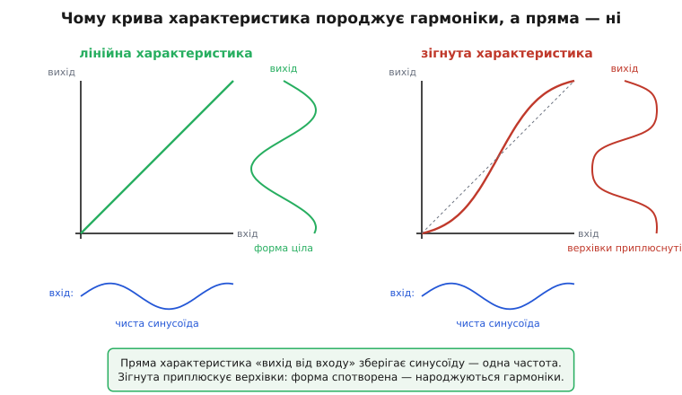
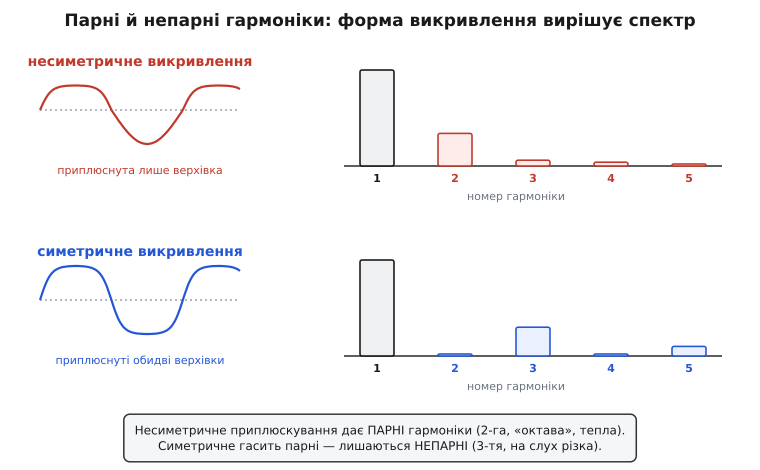

# Гармонічні спотворення: коли підсилювач домішує до сигналу частоти, яких на вході не було

Подайте на вхід підсилювача чистий тон — рівно одну синусоїду, скажімо 1 кГц. Якби підсилювач був ідеальний, на виході ви побачили б ту саму синусоїду, лише вищу: форма та сама, частота та сама, нічого зайвого. Та підключіть осцилограф до реального підсилювача, поданого «на повну», і помітите, що верхівки синусоїди трохи приплюснуті, а коли подивитеся на той самий сигнал аналізатором спектра, побачите дивне: окрім вашого 1 кГц там стоять і 2 кГц, і 3 кГц, і 4 кГц — частоти, яких на вході **не було**. Звідки вони взялися? Їх породив сам підсилювач. Це й є гармонічні спотворення: підсилювач не просто збільшив сигнал, а ще й **домішав до нього нові частоти, кратні вхідній**.

**Гармонічні спотворення** (англ. *harmonic distortion*) — це поява на виході нелінійного кола частот, кратних частоті вхідного сигналу (її другої, третьої, четвертої гармоніки), яких у вхідному сигналі не було. Слово «гармоніка» (гр. *harmonikós* — суголосний) прийшло з музики: коливання вдвічі вищої частоти — це октава, тон, що звучить «у згоді» з основним. Підсилювач, спотворюючи синусоїду, мовби сам дописує до неї цей музичний ряд обертонів. І хоч звучить це майже невинно, саме гармонічні спотворення відрізняють брязкітливий дешевий підсилювач від чистого, а паспортна цифра «THD 0.01%» коштує грошей.

> 🔧 **Навіщо це.** Гармонічні спотворення — головна цифра чистоти будь-якого тракту, що має **відтворювати** сигнал: підсилювача звуку, буфера перед АЦП, вихідного каскаду драйвера. Вони кажуть, наскільки те, що вийшло, схоже на те, що зайшло. Менший рівень спотворень означає чистіший звук, точніший вимір, менше паразитних тонів у радіоканалі. Інженер тримає цю цифру в голові, бо саме вона ловить найпідступнішу ваду: підсилення може бути правильним, смуга — широкою, шум — низьким, а звук однаково «брудний». Винні — гармоніки, яких у сигналі бути не мало.

### Чому пряма лінія не дає нових частот, а крива — дає

Щоб зрозуміти, звідки беруться зайві частоти, треба спершу побачити, **коли їх немає**. Уявімо ідеальний підсилювач: він просто множить вхід на сталий коефіцієнт. Подаєш удвічі більший сигнал — отримуєш удвічі більший вихід, завжди, на будь-якому рівні. Якщо намалювати залежність «вихід від входу», вийде **пряма лінія** через початок координат. Це й називають лінійністю: вихід — стала, прямо пропорційна копія входу.

А тепер ключове спостереження. Пропустіть синусоїду крізь таку пряму залежність — і на виході буде синусоїда. Множення на сталу не міняє форми: розтягує по висоті, але кожна точка лишається на своєму місці за фазою. Синус як був синусом, так і лишився — а значить, лишилася й **одна-єдина частота**. Пряма лінія частот не породжує: що зайшло, те й вийшло, тільки вище.

Уся біда починається там, де залежність «вихід від входу» **перестає бути прямою**. Жоден реальний підсилювач не множить на сталий коефіцієнт нескінченно: на малих сигналах він майже лінійний, але що вищий розмах, то більше характеристика **загинається**. Транзистор ближче до меж живлення віддає менший приріст; верхівка синусоїди впирається в стелю й приплюскується. І щойно крива загнулася, синусоїда на виході вже **не синусоїда** — у неї приплюснуті верхівки, спотворена форма. А спотворена форма, як показав ще Фур'є, — це вже **сума кількох синусоїд різних частот**.


*Ліворуч лінійна характеристика «вихід від входу»: синусоїда проходить, не міняючи форми, — одна частота. Праворуч характеристика загнута біля стелі: верхівки синусоїди приплюснуті, форма спотворена. Саме викривлення передавальної характеристики й породжує гармоніки.*

### Чому спотворена форма — це обов'язково нові частоти

Тут варто зупинитися, бо це найважливіша й найменш очевидна ланка. Чому приплюснута синусоїда — це конче **кілька частот**, а не просто «трохи інша одна»? Відповідь дав на початку XIX століття [Жозеф Фур'є](topic:hw-analog/harmonic-distortion/hist-fourier-harmonics.md), і вона лежить в основі всієї цієї теми.

Фур'є довів річ, що спершу здається неймовірною: **будь-яку періодичну форму** — хоч приплюснуту синусоїду, хоч пилку, хоч прямокутник — можна точно скласти з простих синусоїд, частоти яких кратні основній. Тобто приплюснута синусоїда 1 кГц **тотожна** сумі: чиста синусоїда 1 кГц (основна) плюс трохи синусоїди 2 кГц плюс ще менше 3 кГц і так далі. Це не наближення — це той самий сигнал, записаний інакше. Коли ви приплюснули верхівки, ви тим самим **додали** в суму ці кратні складники. Аналізатор спектра, що розкладає сигнал назад на синусоїди, чесно їх і показує окремими піками.

Звідси й назва. Складник на частоті, що дорівнює основній, — **перша гармоніка** (вона ж основна). Удвічі вища — **друга гармоніка**, утричі — **третя**, і так далі. Чистий, неспотворений сигнал має лише першу гармоніку. Кожна зайва гармоніка на виході — це слід того, що передавальна характеристика десь загнулася. Тому виміряти гармоніки — значить виміряти нелінійність, навіть не зазираючи всередину схеми.

> Чому будь-яка періодична форма точно розкладається на синусоїди кратних частот, як виглядає цей ряд і чому саме викривлена характеристика додає в нього гармоніки — апарат розкладу Фур'є для нелінійного кола, з виведенням, у вставці [розклад сигналу на гармоніки](topic:hw-analog/harmonic-distortion/math-fourier-harmonics.md). Тут ми беремо головний висновок: крива характеристика = нові частоти, кратні вхідній.

### Як це міряють: THD — одне число чистоти

Гармонік багато — друга, третя, четверта, кожна своєї висоти. Щоб не носити з собою весь список, чистоту зводять до однієї цифри — **коефіцієнта гармонічних спотворень** (англ. *total harmonic distortion*, скорочено THD). Думка проста: зберімо **всі** зайві гармоніки разом і порівняймо їхню сукупну величину з величиною корисної основної. Чим менше зайвого проти корисного — тим чистіший сигнал.

Складають гармоніки тією самою чесною міркою, що й усі змінні сигнали, — за середньоквадратичним (RMS) значенням, бо саме воно відбиває енергетичний внесок кожної. Кілька некорельованих гармонік складаються коренем із суми квадратів, тож означення таке:

```
THD = √(U₂² + U₃² + U₄² + …) / U₁
```

де U₁ — амплітуда (RMS) основної гармоніки, а U₂, U₃, … — амплітуди другої, третьої й далі. У чисельнику — «скільки всього бруду», у знаменнику — «скільки корисного»; THD каже, **яку частку** корисного складає брудний додаток. Це **усталене означення**, однакове для підсилювачів, давачів, перетворювачів. Подають його або часткою (0.001), або, найчастіше, у відсотках (0.1%): THD 0.1% означає, що сукупна величина всіх паразитних гармонік становить тисячну частку основного тону.

Орієнтири варто закарбувати. **1% і вище** — спотворення вже чутно як хрипкуватість; так звучить перевантажений або дешевий підсилювач. **0.1%** — добрий побутовий звук, спотворень практично не чути. **0.01% і нижче** — техніка високої якості, прецизійні вимірювальні тракти. Кожен десятковий порядок униз дається дедалі важче й дорожче, бо вимагає дедалі прямішої характеристики.

**THD підсилювача за виміряним спектром.** Подали чистий тон 1 кГц, на виході аналізатор показав основну 1.000 В і дві помітні гармоніки: другу 12 мВ і третю 5 мВ, вищі майже зникли. Який THD?

```c
// THD = корінь(сума квадратів гармонік) / основна
float U1 = 1.000f;     // основна гармоніка, В rms
float U2 = 0.012f;     // друга гармоніка
float U3 = 0.005f;     // третя гармоніка

float harm_rms = sqrtf(U2*U2 + U3*U3);   // √(1.44e-4 + 2.5e-5) = √1.69e-4 = 0.013 В
float thd      = harm_rms / U1;          // 0.013 / 1.000 = 0.013
float thd_pct  = thd * 100.0f;           // ≈ 1.3 %
```

Один і три десятих відсотка — на межі, де спотворення вже чутно. Зверніть увагу: друга гармоніка (12 мВ) внесла в корінь майже все, третя (5 мВ) — значно менше, бо в суму входять **квадрати**. Тому за THD здебільшого «відповідають» одна-дві найнижчі гармоніки: вони найбільші, а квадрат робить різницю ще різкішою.

### Парні й непарні гармоніки звучать по-різному

Не всі гармоніки рівноцінні, і це не дрібниця, а ключ до того, чому одні підсилювачі звучать «тепло», а інші «різко». Річ у **формі** викривлення характеристики.

Якщо характеристика загинається **несиметрично** — верхівку синусоїди приплюскує сильніше, ніж западину (так поводиться один транзистор, наприклад у простому каскаді класу A), — у спектрі переважають **парні** гармоніки: друга, четверта. Друга гармоніка — це рівно октава над основним тоном, музично «згідна» з ним, тому невеликі парні спотворення вухо часто сприймає як приємну повноту, «лампове» тепло.

Якщо ж характеристика загинається **симетрично** — приплюскує верхівку й западину однаково (так робить двотактний, push-pull, каскад, а надто коли біля нуля між двома транзисторами є злам), — парні складники взаємно гасяться, і лишаються **непарні**: третя, п'ята. Непарні гармоніки музично «незгідні» з основним тоном, тому навіть малий їхній рівень вухо чує як різкість, металевий призвук. Через це підступний саме той дрібний злам біля нуля у двотактному виході — він народжує непарні гармоніки, найнеприємніші на слух.


*Ліворуч несиметричне приплюскування (одна верхівка) — у спектрі друга гармоніка, парна, «октава». Праворуч симетричне приплюскування обох верхівок — друга гасне, лишається третя, непарна. Форма викривлення вирішує, який ряд гармонік народиться й як це звучить.*

Звідси практичний висновок: міряти самий лише THD замало — два підсилювачі з однаковим THD 0.1% можуть звучати геть по-різному, якщо в одного це парні гармоніки, а в другого непарні. Тому в серйозних паспортах поряд із одним числом дають **спектр гармонік** — який саме брудний тон і наскільки великий.

### Чому зворотний зв'язок так різко чистить спотворення

Найпотужніший спосіб приборкати гармоніки — це не шукати ідеально прямий транзистор (таких немає), а **охопити підсилювач від'ємним зворотним зв'язком**. Ідея, що лежить в основі майже кожного якісного підсилювача, тут діє особливо наочно, тож варто побачити її саме під кутом спотворень.

Згадаймо, що робить [від'ємний зворотний зв'язок](topic:hw-analog/negative-feedback): частину виходу повертають на вхід у протифазі, і підсилювач підправляє себе так, щоб вихід точно стежив за входом. Тепер головне: гармоніки, які народжує сам підсилювач, — це теж частина його виходу, **відхилення** виходу від правильної форми. Зворотний зв'язок бачить це відхилення нарівні з усім іншим і так само його **притлумлює**. Підсилювач немовби порівнює свій брудний вихід із чистим входом, помічає домішані гармоніки як похибку й віднімає їх.

Наскільки сильно? Рівно настільки, наскільки великий запас підсилення, який ви «віддали» у зворотний зв'язок. Якщо петльове [підсилення в контурі](topic:hw-analog/loop-gain) дорівнює, скажімо, 1000, то спотворення зменшуються приблизно в стільки ж разів:

```
THD(із ЗЗ) ≈ THD(без ЗЗ) / (1 + петльове підсилення)
```

Це той самий механізм, яким зворотний зв'язок стабілізує підсилення й розширює смугу, — лише прикладений до похибки форми. Підсилювач без зворотного зв'язку міг мати THD 5%; охопили його петлею з запасом ×500 — і на виході лишилось 0.01%. Саме тому реальні якісні підсилювачі будують не з ідеальних деталей, а з посередніх, але **охоплених глибоким зворотним зв'язком**, що з'їдає їхню нелінійність.

> 🔧 **Навіщо це.** Це пояснює, чому в підсилювачі звуку так бережуть запас підсилення: кожен зайвий його децибел, відданий у зворотний зв'язок, — це децибел, на який чистіший звук. І чому перевантаження таке згубне: коли сигнал упирається в стелю живлення, підсилювачу вже немає куди тягтися вгору, запас підсилення вичерпується, зворотний зв'язок перестає виправляти — і THD підстрибує з тисячних відсотка до одиниць. Звідси й чутна «брудність» гучного, перевантаженого тракту.

**Як зворотний зв'язок збиває THD.** Підсилювач сам по собі (без петлі) дає THD 4%. Охопили його від'ємним зворотним зв'язком із петльовим підсиленням 400. Який THD очікувати на виході?

```c
// Від'ємний ЗЗ ділить спотворення на (1 + петльове підсилення)
float thd_open = 0.04f;     // THD без зворотного зв'язку, 4%
float loop_gain = 400.0f;   // петльове підсилення

float thd_closed = thd_open / (1.0f + loop_gain);   // 0.04 / 401 ≈ 9.98e-5
float thd_pct    = thd_closed * 100.0f;             // ≈ 0.01 %
```

Чотири відсотки перетворилися на соту відсотка — у чотириста разів чистіше, без жодної заміни транзистора, самим лише зворотним зв'язком. У цьому й сила: лінійність не вимолюють у деталей, її **роблять** зі зворотного зв'язку.

### Спотворення й шум — це різні вади

Гармонічні спотворення легко сплутати з [шумом](topic:hw-analog/signal-noise-ratio), бо обидва псують сигнал і обидва міряють у частці чи децибелах. Але природа в них протилежна, і плутати їх — значить шукати причину не там.

Шум — **випадковий** і **не залежить від сигналу**: травичка на екрані тремтить навіть тоді, коли сигналу немає взагалі. Гармонічні спотворення — навпаки, **строго прив'язані** до сигналу: немає сигналу — немає й спотворень, а коли сигнал є, гармоніки стоять на чітко визначених частотах, кратних його частоті. Шум — це що підсилювач **додає від себе** незалежно; спотворення — це як він **перекручує** те, що йому дали. Тому й борються з ними по-різному: шум давлять тихим входом і вузькою смугою, спотворення — лінійністю та зворотним зв'язком.

Через цю різницю в паспортах часто стоїть об'єднана цифра — **SINAD** (англ. *signal-to-noise-and-distortion*), що міряє корисний сигнал проти **всього зайвого разом**: і шуму, і гармонік. Вона чесніша як підсумкова оцінка тракту (бо вухо й АЦП однаково страждають від будь-якого бруду), але менш діагностична: висока SINAD не каже, що саме винне — шум чи спотворення. Тому інженер дивиться і на загальну SINAD, і окремо на THD: перша каже «наскільки брудно взагалі», друга — «скільки з того бруду від нелінійності».

### Що варто винести

Гармонічні спотворення — це нові частоти, кратні вхідній (друга, третя, четверта гармоніки), які реальне коло домішує до сигналу через те, що його передавальна характеристика «вихід від входу» не зовсім пряма. Пряма характеристика синусоїду зберігає — одна частота; зігнута приплюскує її, а спотворена форма, за теоремою Фур'є, тотожна сумі синусоїд кратних частот — ось і гармоніки. Усю чистоту зводять до одного числа THD = √(сума квадратів гармонік) / основна, у відсотках: 1% уже чутно, 0.01% — висока якість. Парні гармоніки (від несиметричного викривлення) звучать «тепло», непарні (від симетричного, від зламу у двотактному виході) — різко, тож поряд із THD дивляться на спектр. Найсильніша зброя проти спотворень — від'ємний зворотний зв'язок: він бачить домішані гармоніки як похибку виходу й ділить їх на запас петльового підсилення, тому якісний підсилювач роблять із глибокого зворотного зв'язку, а не з ідеальних деталей. І не плутати спотворення з шумом: шум випадковий і живе без сигналу, спотворення строго прив'язані до сигналу й зникають разом із ним. Хто чує за словом «THD» викривлену характеристику й дописаний нею ряд обертонів, той знає, де шукати причину брудного звуку й чим її лікувати.

---
