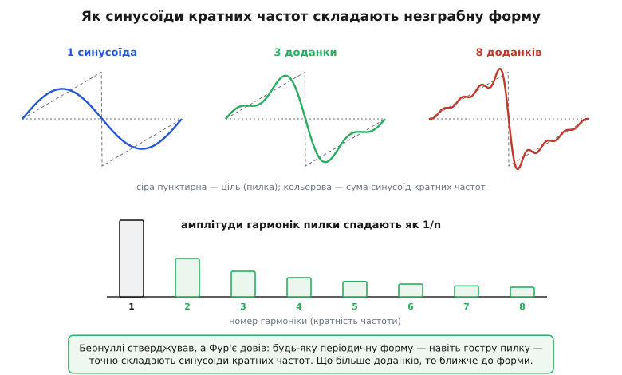

# 📜 Звідки в електроніці взялися «гармоніки»: тепло, недовіра й музика

Коли інженер каже «друга гармоніка», «непарні гармоніки», «гармонічний спектр», він користується словом, у якого довгий і несподіваний родовід. Гармоніки прийшли в електроніку не з електрики. Вони прийшли спершу з **теорії теплопровідності** — з намагання порахувати, як остигає нагрітий шматок металу, — а тоді, гаком через музику, оселилися в підсилювачах і генераторах. Між цими двома кінцями лежить чудова історія про сміливе твердження, у яке найбільші математики Парижа відмовлялися вірити, і про те, як суто теплова математика раптом виявилася ключем до того, чому скрипка й флейта, граючи одну ноту, звучать по-різному.

Розкрутімо цю нитку від самого початку — від питання, яке бентежило ще до Фур'є.

## Загадка, з якої все почалося: струна, що не хотіла коритися

Задовго до теплопровідності математиків мучила куди простіша на вигляд річ — **тремтлива струна**. Защемлена з обох кінців струна, яку смикнули, починає коливатися, і питання стояло так: яким законом описати її рух у кожній точці й кожну мить?

Француз Жан Лерон д'Аламбер (Jean le Rond d'Alembert) **1747 року** записав рівняння, що керує цим рухом, — те саме, що ми тепер звемо **хвильовим рівнянням**. Це усталений факт. Леонард Ойлер (Leonhard Euler — швейцарець за народженням, що працював у Берліні й Петербурзі) майже одразу, **1748–1749 років**, показав, як будувати розв'язок із початкової форми струни. І тут почалася суперечка, що тривала десятиліттями й виявилася прямим предком усього, про що ця стаття.

Бо третій учасник, теж із роду Бернуллі — **Даниїл Бернуллі** (Daniel Bernoulli, швейцарський математик і фізик) — **1753 року** запропонував зовсім інший погляд. Він сказав річ, що звучить майже зухвало: загальний рух струни — це **накладання простих коливань**, основного тону й кратних йому обертонів. Інакше кажучи, будь-яку форму, яку прийме струна, можна скласти із синусоїд, частоти яких — цілі кратні до однієї найнижчої:

```
форма струни = a₁·sin(основна) + a₂·sin(2× основна) + a₃·sin(3× основна) + …
```

Бернуллі підказувала сама музика: струна й справді звучить не однією частотою, а основним тоном разом із обертонами, і вухо це чує. Він був певен, що так має бути завжди. Але була засада, і вона виявилася фатальною для тогочасного сприйняття: Бернуллі **не вмів знайти ці коефіцієнти** a₁, a₂, a₃ для наперед заданої форми. Він стверджував, що розклад існує, — а як його обчислити, не показав.

> 🔧 **Навіщо це.** Те, що Бернуллі побачив у струні, — рівно той самий хід думки, яким сьогодні описують спотворення в підсилювачі: сигнал розкладають на основну частоту й кратні їй гармоніки. Різниця тільки в тому, що Бернуллі не мав інструмента, щоб числами підтвердити свою здогадку. Ця прогалина — «розклад існує, але як його знайти?» — і є дірка, яку через сімдесят років залатає Фур'є, давши формулу для коефіцієнтів. Без цієї формули вся теорія спектра лишилася б гарною, але порожньою думкою.

Ойлер і д'Аламбер не повірили Бернуллі — і їхнє заперечення було серйозним, не з упертості. Вони міркували так: сума синусоїд, кожна з яких гладенька й періодична, сама гладенька й періодична. А струну можна смикнути **в гострий кут** — защемити пальцем посередині й відпустити, давши їй форму трикутника з вістрям. Як гладенька сума синусоїд може відтворити гострий злам? Це здавалося неможливим: гладеньке не складеться в гостре. Тому Ойлер уважав ряд Бернуллі замало загальним — придатним хіба для окремих випадків, а не для будь-якої форми.

Ось вузол суперечки, який варто запам'ятати, бо саме його розрубає вся подальша історія: **чи можна довільну форму — навіть із гострими зламами — точно скласти із самих лише синусоїд кратних частот?** Бернуллі казав «так, але не знаю як». Ойлер казав «ні, гладеньке не дасть гострого». Спір застряг.

## Фур'є приходить не з музики, а з гарячого заліза

Тепер найнесподіваніше. Людина, що розрубала цей вузол, узагалі не думала про струни чи музику. Вона рахувала **тепло**.

**Жан-Батіст Жозеф Фур'є** (Jean-Baptiste Joseph Fourier, 1768–1830) — француз, син кравця з містечка Осер (Auxerre) у Бургундії. Доля його була бурхлива: математик, який ходив із Наполеоном у єгипетський похід 1798 року, був там секретарем заснованого французами Єгипетського інституту, а повернувшись, став префектом департаменту Ізер зі столицею в Греноблі. Усе це — задокументовані факти. І саме в Греноблі, поміж осушенням боліт і впорядкуванням доріг, префект Фур'є на дозвіллі бився над фізичною задачею: **як тепло розходиться твердим тілом і як воно остигає**.

Задача суто практична. Нагрійте один кінець залізного стрижня — як зміняться температури вздовж нього з часом? Як остигає нагріта пластина чи куля? Фур'є вивів рівняння, що цим керує (рівняння теплопровідності), і взявся його розв'язувати. І тут, розв'язуючи геть нелюдську з вигляду теплову задачу, він наткнувся на ту саму ідею, що й Бернуллі зі струною, — але прийшов до неї з іншого боку й, головне, **довів те, чого Бернуллі довести не зумів**.

Логіка Фур'є була така. Початковий розподіл температури вздовж тіла — це якась функція: десь гарячіше, десь холодніше, і профіль може бути будь-який, хоч із різким стрибком (приклали гарячий брусок до холодного — на стику стрибок температури). Фур'є показав, що **цей довільний початковий профіль можна розкласти на синусоїдальні складові кратних частот** — і кожна така складова остигає за простим, окремим законом. А тоді повну картину остигання збираєш назад, як суму цих простих доданків. Розклад на синусоїди був не самоціллю — він був **способом розв'язати теплове рівняння**: складну задачу розбиваєш на купу простих, кожну розв'язуєш окремо, результати додаєш.

Але щоб цей метод працював, Фур'є мусив зробити саме те, на чому застрягли його попередники, — і він це зробив. Він **знайшов формулу для коефіцієнтів**. Те, чого бракувало Бернуллі сімдесят років. Виявилося, що кожен коефіцієнт обчислюється інтегруванням самої функції, помноженої на відповідну синусоїду по періоду:

```
aₙ = (2/T) · ∫ f(t)·sin(2π·n·t/T) dt   (інтеграл по одному періоду T)
```

У цьому інтегралі — уся розв'язка. Він каже: щоб дізнатися, скільки в сигналі n-ї гармоніки, треба «помножити» сигнал на синусоїду цієї частоти й усереднити за період. Синусоїди різних кратних частот при такому усередненні взаємно гасяться (їхній добуток за період дає нуль) — лишається тільки внесок «своєї» частоти. Це наче камертон, що відгукується лише на свою ноту: інтеграл «настроєний» на n-ту гармоніку й вицідплює саме її величину, глухий до решти. Бернуллі казав «розклад є»; Фур'є додав «і ось чим я добуду кожен його коефіцієнт». Теорія з порожньої стала робочою.

А найзухваліше — Фур'є наполягав, що так можна вчинити з **будь-якою** періодичною функцією, не лише з гладенькою. Навіть із розривною, навіть із гострим зламом. Те саме твердження, у яке Ойлер відмовлявся вірити, — тільки тепер підкріплене робочим способом рахувати.

> Сама теза — що будь-який періодичний сигнал точно складають синусоїди кратних частот — і є фундамент усього поняття гармонічного спектра. У статті [гармонічні спотворення](root:hw-analog/harmonic-distortion) вона працює щодня: нелінійний каскад спотворює синусоїду, а спотворена форма за цією теоремою розкладається на основну частоту та її гармоніки, які й вимірюють як спотворення.

## «Незграбна форма зі самих синусоїд» — як таке взагалі можливе

Спинімося й подивімося на саме серце суперечки очима, а не формулами, бо тут ховається найкрасивіше місце історії. Заперечення Ойлера здавалося залізним: гладеньке плюс гладеньке = гладеньке, то звідки візьметься гострий кут? Відповідь Фур'є парадоксальна й чудова: **гострий кут постає з нескінченної суми гладеньких хвиль**, де кожна наступна додає дрібнішу деталь.

Уявіть, що складаєте пилку — форму з різким спадом — самими синусоїдами. Перша, основна, дає лише грубий горб. Додаєте другу, удвічі частішу, меншу амплітудою, — обриси трохи ближчають до пилки. Третя, ще частіша й дрібніша, підправляє далі. Кожна нова гармоніка кратної частоти підрівнює форму на дедалі тоншому масштабі, і що більше їх береш, то ближче сума підповзає до гострої пилки.



*Одна синусоїда дає лише грубий горб; три доданки вже вгадують пилку; вісім тиснуться до неї щораз ближче. Амплітуди гармонік пилки спадають як 1/n — саме цей набір «висот» і є її спектр.*

Ось у чім розв'язка Ойлерового заперечення: жодна **скінченна** сума синусоїд справді не дасть ідеально гострого кута — Ойлер мав рацію для будь-якого скінченного числа доданків. Але **нескінченна** сума підбирається до гострої форми як завгодно близько. Гострота — це не властивість окремої хвилі, а наслідок того, що високих гармонік нескінченно багато й вони дрібнесенькими порціями домальовують злам. Ойлер дивився на скінченні суми й бачив, що гострого не вийде; Фур'є дозволив сумі бути нескінченною — і гостре з'явилося. Обидва міркували правильно про своє; Фур'є просто питав ширше.

> 🔧 **Навіщо це.** Ця сама картина прямо пояснює, чому різке спотворення сигналу породжує **багато** гармонік, і то високих. Коли підсилювач приплюскує верхівку синусоїди чи, гірше, обрізає її гострим зламом (кліп), форма стає «незграбною» — а незграбну форму, за Фур'є, складають саме високі гармоніки. Чим гостріший злам у формі, то вище тягнеться її спектр. Тому м'яке заокруглення на слух «тепліше» (мало високих гармонік), а жорсткий кліп — різкий і «брудний» (повно високих). Інженер, що це бачить, читає форму сигналу як партитуру його спектра.

## Холодний прийом у Парижі: коли Лагранж і Лаплас сказали «ні»

Свої перші результати Фур'є подав на розгляд Паризькому інститутові **1807 року** — рукопис «Mémoire sur la propagation de la chaleur dans les corps solides» («Записка про поширення тепла у твердих тілах»). І ось тут історія робиться по-людськи драматичною, бо зустріли його не оплесками, а недовірою найповажніших математиків Європи.

Серед тих, хто оцінював роботу, були два титани: **Жозеф-Луї Лагранж** (Joseph-Louis Lagrange) і **П'єр-Симон Лаплас** (Pierre-Simon Laplace). Імена, перед якими тоді схилявся весь учений світ. І саме вони стали головними скептиками. Заперечення стосувалося не фізики тепла — з нею більш-менш погоджувалися — а тієї зухвалої тези про розклад **будь-якої** функції в тригонометричний ряд. Лаплас закидав, що методи Фур'є **недостатньо строгі математично**. Лагранж — той самий Лагранж, що замолоду сам бився над тремтливою струною й стояв на боці Ойлерового сумніву, — узагалі не вірив, що довільну функцію, надто з розривом, можна так подати. Для нього це лишалося надто вільним поводженням із математикою.

Прикметно: заперечення були не дріб'язком і не заздрістю. Фур'є справді **не довів** збіжності своїх рядів із тодішньою строгістю — він користувався тезою, у правдивості якої був певен фізично й перевіряв на прикладах, але повного математичного доведення, що ряд завжди сходиться до потрібної функції, у нього не було. Скептики вимагали саме цієї строгості. У певному сенсі вони мали рацію за буквою — і водночас гальмували велике відкриття.

Інститут не відкинув роботу зовсім. Навпаки — **1811 року** він оголосив поширення тепла темою великого математичного конкурсу, і Фур'є подав розширений рукопис. Комісія — у складі **Лагранжа, Лапласа, Етьєна Малюса (Étienne Malus), Рене-Жюста Аюї (René-Just Haüy) і Адрієна-Марі Лежандра (Adrien-Marie Legendre)** — **присудила Фур'є премію**. Але присудила з прохолодою, лишивши в звіті осторогу, що ввійшла в історію: спосіб, яким автор приходить до своїх рівнянь, *«не вільний від труднощів»*, а аналіз для їх інтегрування *«лишає бажати кращого щодо загальності й навіть строгості»*. Премію дали — а сумнів зафіксували письмово.

Через цю прохолоду роботу **не поспішали друкувати**. Вона пролежала роки. І лише **1822 року** Фур'є нарешті видав її повністю — окремою книгою **«Théorie analytique de la chaleur»** («Аналітична теорія тепла»). Це й стало тією класичною працею, з якої світ дізнався про ряди Фур'є. П'ятнадцять років минуло від першого подання 1807-го до друку 1822-го — п'ятнадцять років недовіри, поки ідея пробивала собі дорогу.

> 🔧 **Навіщо це.** Варто запам'ятати, що скептики не були дурнями, а Фур'є не був бездоганний. Він мав глибоку фізичну рацію, але справді бракувало строгого доведення — і чесна історія визнає обидва боки. Остаточно правоту Фур'є закріпив уже **1829 року** німець Петер Густав Лежен Діріхле (Peter Gustav Lejeune Dirichlet), що дав строгі умови, за яких ряд Фур'є справді сходиться до своєї функції, — і саме він поставив крапку в тій давній суперечці про струну, яка тяглася від Бернуллі. Тобто наукова істина народилася не з одного осяяння, а з поєднання сміливої фізичної здогадки Фур'є й пізнішої математичної строгості Діріхле. Колективно, як майже завжди.

## Міст від тепла до музики: чому розклад назвали «гармоніками»

Тепер найголовніше для нашого слова. Звідки **«гармоніки»**? Адже Фур'є рахував тепло, а в теплі немає ні звуку, ні музики, ні «гармонії». Назва прийшла з іншого боку — з того, що математичний апарат Фур'є виявився рівно тим, що описує **музичний звук**, і саме музиканти-фізики дали кратним складовим ім'я.

Згадаймо, що тремтлива струна, з якої все почалося, — це й є джерело музичного тону. І Бернуллі недарма казав, що струна звучить основним тоном та обертонами: вухо справді чує не чисту синусоїду, а основну частоту разом із цілою низкою кратних їй. Ці кратні складові музиканти здавна звали **обертонами** (нім. *Oberton* — «верхній тон»), а в науці прижилося грецьке коріння **harmonía** (гр. ἁρμονία — лад, співзвуччя, злагода). Складові, частоти яких — цілі кратні до основної (×2, ×3, ×4…), стали **гармоніками**, бо саме такі співвідношення дають консонанс, приємне для вуха співзвуччя — октаву, квінту, кварту. Гармоніка — це складова, що звучить «у злагоді» з основним тоном.

Залишалося поєднати дві речі: фізичну тезу «складний тон = сума простих кратних тонів» з математичним апаратом Фур'є, що цю суму строго описував. І це зробили двоє німецьких фізиків, чиї імена тут варто назвати точно.

Перший — **Георг Симон Ом** (Georg Simon Ohm), той самий, чиїм ім'ям названо закон про опір. **1843 року** він опублікував працю «Über die Definition des Tones» («Про визначення тону») і висунув тезу, що ввійшла в науку як **акустичний закон Ома**: людське вухо розкладає складний звук на прості синусоїдальні складові — по суті, **робить власний аналіз Фур'є**. Складний музичний тон, казав Ом, вухо чує як накладання чистих тонів, частоти яких — цілі кратні основної. Це й був прямий міст: апарат, який Фур'є вивів для тепла, Ом приклав до слуху й звуку.

Другий, хто розгорнув цей міст у повну теорію, — **Герман фон Гельмгольц** (Hermann von Helmholtz). У своїй знаменитій книзі **«Die Lehre von den Tonempfindungen»** («Учення про слухові відчуття», **1863 року**) він узяв побіжну Омову думку про роль вуха й зробив із неї струнку фізіологічну теорію. Гельмгольц припустив, що **саме внутрішнє вухо працює аналізатором Фур'є**: завитка (cochlea) з її основною перетинкою — наче набір крихітних настроєних резонаторів, кожен відгукується на свою частоту, як ряд камертонів дедалі вищого тону. Звук заходить — і кожен резонатор «ловить» свою гармоніку, розкладаючи складний тон на спектр чистих складових просто механічно, у вусі.

І тут Гельмгольц дав відповідь на стару загадку, яка прямо стосується нашого слова. **Чому скрипка й флейта, граючи одну й ту саму ноту тієї самої висоти, звучать по-різному?** Бо висота визначається основною частотою — і вона в них однакова. А ось **тембр** — те, чим звуки різняться на слух — визначається тим, **які гармоніки присутні й якої вони сили**. Флейта дає майже чисту синусоїду, бідну на гармоніки, — звук «круглий», м'який. Скрипка чи труба багаті на високі гармоніки — звук яскравий, гострий. Той самий набір амплітуд гармонік, що Фур'є вивів як коефіцієнти ряду, виявився **звуковим обличчям** інструмента. Спектр — це тембр.

> 🔧 **Навіщо це.** Ось де коло замкнулося рівно на тому, чим займається електроніка. «Тембр = набір гармонік» Гельмгольца — це слово в слово те, що сьогодні називають **гармонічним спектром сигналу**. Коли інженер дивиться на спектр на екрані аналізатора й читає висоти стовпчиків на частотах ×2, ×3, ×4 від основної, він робить точно те, що Гельмгольц приписав вуху: розкладає сигнал на гармоніки й по їх силі судить про його «характер». Через це й гітарний підсилювач із лампами цінують за «теплі парні гармоніки», і спотворення в аудіотракті міряють як набір гармонік. Слово «гармоніка» прийшло в наші схеми просто з музики — через Ома й Гельмгольца, які приклали Фур'євий тепловий апарат до звуку.

## Що з цієї історії лишилося в кожній схемі

Підіб'ємо нитку, бо вона напрочуд струнка. Поняття, без якого не обходиться жодна розмова про спотворення, генерацію чи фільтри, склалося з трьох цеглин, покладених різними людьми в різні століття.

Перша цеглина — **сміливе твердження**. Даниїл Бернуллі ще 1753-го побачив у тремтливій струні, що складний рух — це сума простих коливань кратних частот, і вгадав саму ідею спектра. Та довести й порахувати її не зумів, і йому не повірили.

Друга цеглина — **доведення й спосіб рахувати**, прийшли несподівано з теплофізики. Жозеф Фур'є, розв'язуючи задачу про остигання тіл, у праці 1822 року не просто повторив здогадку Бернуллі, а дав **формулу для коефіцієнтів** і наполіг, що розкласти можна будь-яку періодичну форму, навіть із гострими зламами. За це його сімнадцять років не хотіли слухати: Лагранж і Лаплас вимагали строгості, якої бракувало, і строгість потім додав Діріхле. Та головне було зроблено — апарат запрацював.

Третя цеглина — **ім'я й застосування до звуку**. Ом 1843-го показав, що вухо розкладає звук по Фур'є, а Гельмгольц 1863-го пояснив через це тембр і поселив у науці слово «гармоніки» — кратні складові, що звучать у злагоді з основним тоном. Саме звідси, з музичної акустики, термін перейшов в електроніку, де сигнали так само розкладають на основну частоту та її гармоніки.

Тому, коли наступного разу побачите на екрані спектр із піками на ×2, ×3, ×4 від основної частоти, згадайте весь цей шлях. Ці піки — прямі нащадки обертонів скрипки, яку слухав Гельмгольц; математика, що їх рахує, — та сама, якою Фур'є остуджував залізо; а сама думка, що складне є сумою простих кратних коливань, уперше блиснула у Бернуллі, коли він дивився на дрижання натягнутої струни. Тепло, недовіра й музика — три витоки одного слова, яким ми тепер користуємося, навіть не думаючи, звідки воно.
