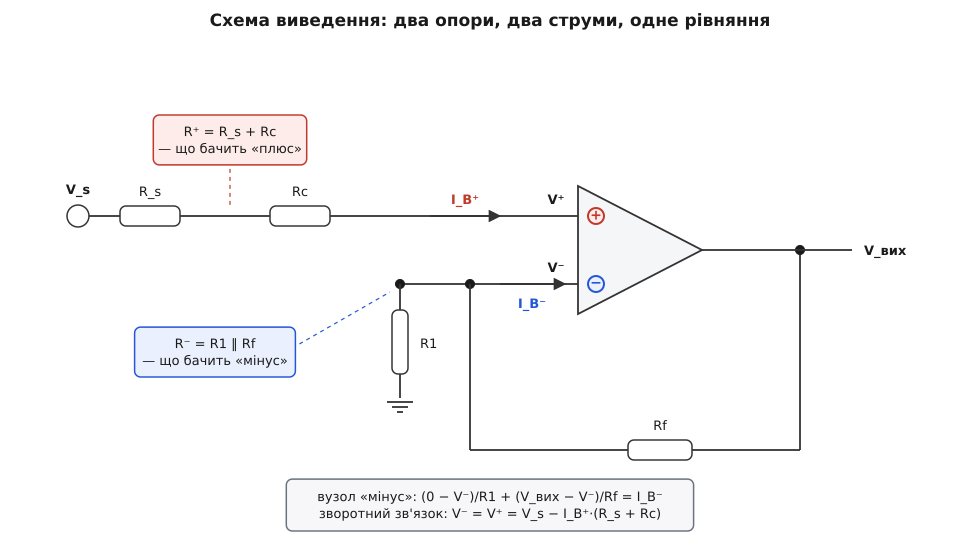
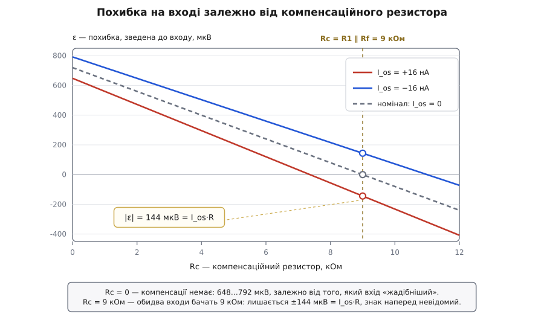

# 🧮 Компенсаційний резистор: виведення від вузлового рівняння до `I_os·R`

<preknowlist>
- [Закони Кірхгофа](root:hw-analog/kirchhoff-laws) — сума струмів, що втікають у вузол, дорівнює сумі тих, що з нього витікають. Усе виведення нижче — одне-єдине рівняння цього закону, записане для вузла «мінус».
- [Від'ємний зворотний зв'язок](root:hw-analog/negative-feedback) — петля рухає вихід доти, доки напруги на входах не зрівняються. Для ідеального ОП із замкненою петлею це дає жорстку умову `V⁻ = V⁺`, і саме вона замикає систему рівнянь.
- [Суперпозиція](root:hw-analog/superposition) — у лінійному колі внесок кожного джерела рахують окремо, а тоді додають. Тому струми зсуву можна взяти як два незалежні джерела струму й рахувати їхню похибку окремо від корисного сигналу.
- [Теорема Тевеніна](root:hw-analog/thevenin) — будь-яку лінійну частину кола видно з пари виводів як одне джерело з одним послідовним опором. Цей опір і є те, «що бачить вхід».
</preknowlist>

Правило «постав на «плюсі» резистор `R1 ‖ Rf` — і похибка від струму зсуву впаде з `I_B·R` до `I_os·R`» доводиться приймати на віру доти, доки не побачиш, звідки береться кожен його шматок: чому саме паралельне з'єднання, а не сума й не сам `Rf`; чому лишається саме `I_os·R`, а не половина цього й не подвоєне. Тут ми виводимо правило з одного вузлового рівняння: паралельне з'єднання виникне саме собою як алгебрична тотожність, умова компенсації випаде з вимоги «щоб не залежало від примірника», а лишок вийде рівно `I_os·R` — без наближень, з точним скороченням двійок.

## Що входить у рівняння

Операційний підсилювач ідеальний в усьому, крім двох речей: у вивід «плюс» втікає постійний струм `I_B⁺`, у вивід «мінус» — `I_B⁻`. Це два незалежні джерела струму, підвішені до виводів; більше жодних недосконалостей ми поки не вводимо. Напрям узято «всередину» — так поводиться вхідний каскад на *npn*-транзисторах; для *pnp* обидва струми міняють знак **разом**, тож усі висновки лишаються ті самі з точністю до спільного знака.

Вхідний зсув напруги `V_os` вважаємо нулем. Це не недбалість: коло лінійне, тож [за суперпозицією](root:hw-analog/superposition) `V_os` додається до результату окремим доданком і жодним чином не взаємодіє з опорами. Порахувавши струмову частину, її просто складають із `V_os`.

Петлю вважаємо замкненою й робочою, тобто `V⁻ = V⁺`. Скінченність підсилення й придушення синфазного сигналу дають поправки — їх ми оцінимо наприкінці й побачимо, що вони на три-чотири порядки менші за результат.

Позначення такі:

```
V_s   — напруга сигналу (від ідеального джерела)
R_s   — власний опір цього джерела
Rc    — компенсаційний резистор, послідовно з «плюсом»
R1    — резистор із вузла «мінус» на землю
Rf    — резистор зворотного зв'язку, з вузла «мінус» на вихід
I_B⁺  — струм, що втікає у вивід «плюс»
I_B⁻  — струм, що втікає у вивід «мінус»
```



*Уся схема зводиться до двох опорів і двох струмів. Опір `R⁺ = R_s + Rc` — єдиний шлях постійного струму від джерела до виводу «плюс». Опір, який протистоїть струмові `I_B⁻`, ще належить знайти: у вузлі «мінус» сходяться два резистори, і жоден із них поодинці відповіді не дає.*

## Одне рівняння на вузол «мінус»

Почнемо з вузла, у якому сходяться `R1`, `Rf` і сам вивід. [За першим законом Кірхгофа](root:hw-analog/kirchhoff-laws) те, що в нього втікає крізь резистори, має дорівнювати тому, що з нього витікає у вивід підсилювача:

```
(0 − V⁻)/R1 + (V_вих − V⁻)/Rf = I_B⁻
```

Перший доданок — струм із землі крізь `R1`, другий — з виходу крізь `Rf`, права частина — той самий струм зсуву, який підсилювач забирає собі. Розкриємо й зберемо `V⁻`:

```
V_вих/Rf = V⁻·(1/R1 + 1/Rf) + I_B⁻
V_вих = V⁻·Rf·(1/R1 + 1/Rf) + I_B⁻·Rf
V_вих = V⁻·(1 + Rf/R1) + I_B⁻·Rf
```

Множник біля `V⁻` варто одразу назвати окремо, бо саме він далі все й вирішить:

```
G = 1 + Rf/R1 = (R1 + Rf)/R1
```

Другий вузол простіший: до виводу «плюс» веде єдиний шлях — крізь `Rc` і `R_s` від джерела. Струм `I_B⁺` тече цим шляхом і садить потенціал виводу нижче за напругу джерела:

```
V⁺ = V_s − I_B⁺·(R_s + Rc)
```

Тепер зв'яжемо два вузли умовою [зворотного зв'язку](root:hw-analog/negative-feedback) `V⁻ = V⁺` і підставимо:

```
V_вих = G·[V_s − I_B⁺·(R_s + Rc)] + I_B⁻·Rf
V_вих = G·V_s − G·I_B⁺·(R_s + Rc) + I_B⁻·Rf
```

Перший доданок — корисний сигнал, підсилений як належить. Два інші — це вся похибка від струмів зсуву, і більше нічого в схемі її не створює. Прикро тільки, що доданки несиметричні: один помножений на `G`, другий — на голий `Rf`. Порівнювати їх у такому вигляді неможливо.

## Ділення на підсилення: паралельне з'єднання виникає само

Симетрію відновлює один хід — звести похибку до входу. Замість питати «на скільки з'їхав вихід», спитаймо «яку напругу треба було б подати на вхід ідеальної схеми, щоб дістати той самий з'їзд». Для цього ділимо все на `G`:

```
V_вих/G = V_s − I_B⁺·(R_s + Rc) + I_B⁻·(Rf/G)
```

І ось тут відбувається все. Розкриємо `Rf/G`:

```
Rf/G = Rf / [(R1 + Rf)/R1] = R1·Rf/(R1 + Rf) = R1 ‖ Rf
```

Паралельне з'єднання не постулювали й не вгадували з картинки — воно **випало** з алгебри. Причина ось у чому: струм зсуву тече крізь `Rf` і рухає вихід, а вихід повертається на вхід поділеним на `G`. Резистор `Rf`, поділений на підсилення `1 + Rf/R1`, тотожно дорівнює `R1 ‖ Rf` — для будь-яких `R1` і `Rf`, без винятків і наближень.

Тепер обидва доданки однорідні, і можна ввести два опори — по одному на вхід:

```
R⁻ = R1 ‖ Rf     — опір, що протистоїть струмові I_B⁻
R⁺ = R_s + Rc    — опір, що протистоїть струмові I_B⁺
```

і записати результат у остаточному вигляді:

```
ε = I_B⁻·R⁻ − I_B⁺·R⁺          — похибка, зведена до входу
V_вих = G·(V_s + ε)
```

> 🔧 **Навіщо це.** Уся постійна похибка каскаду від струмів зсуву — це два числа з паспорта, помножені на два опори, які ти сам щойно вибрав, ставлячи `R1`, `Rf` і `Rc`. Далі похибка їде на вихід із тим самим множником `G`, що й сигнал: за `G = 100` сотня мікровольтів на вході обертається на десять мілівольтів на виході. Тому рахувати варто саме `ε` — воно порівнюване з корисним сигналом на вході й не залежить від того, яке підсилення ти поставиш.

## Та сама відповідь через Тевеніна

Той самий `R⁻` можна здобути, взагалі нічого не розв'язуючи, — і збіг двох незалежних доріг доводить, що ніде не загубився множник.

Спитаймо просто: який опір «бачить» вузол «мінус»? [За Тевеніном](root:hw-analog/thevenin) це опір між цим вузлом і всіма вузлами, потенціал яких від нашого струму не залежить. Таких вузлів два: земля (очевидно) і вихід підсилювача. Вихід — теж нерухома точка, бо ідеальний ОП віддає його з нульовим власним опором: скільки струму туди не заганяй, напруга там задається петлею, а не струмом. Отже, з вузла «мінус» ведуть два резистори до двох «твердих» точок — а два резистори від спільного вузла до нерухомих потенціалів це і є паралельне з'єднання:

```
R⁻ = R1 ‖ Rf
```

Струм `I_B⁻`, витягуючи заряд із цього вузла, садить його потенціал на `I_B⁻·R⁻` нижче за той, який був би без струму. Петля цього не терпить: щоб повернути `V⁻` до `V⁺`, вона мусить підняти вихід — рівно так, як зробила б у відповідь на напругу `+I_B⁻·R⁻`, подану на «плюс». Ось звідки й знаки в `ε`: доданок, що садить «мінус», входить із плюсом, а `I_B⁺·R⁺`, що садить «плюс», — з мінусом. Той самий результат, здобутий без жодного розв'язування системи.

Заразом стає видно, чому компенсація взагалі можлива. Обидва входи просідають: «плюс» на `I_B⁺·R⁺`, «мінус» — на `I_B⁻·R⁻`. Якщо просідання однакові, вони утворюють спільний зсув обох входів, а на нього підсилювач не реагує зовсім: він відпрацьовує лише різницю. Компенсаційний резистор не прибирає струм зсуву й нічого не «віднімає» — він переводить більшу частину похибки в синфазну форму, яку схема не бачить.

## Умова нуля — і формула самого Rc

Тепер прирівняймо похибку до нуля:

```
ε = 0   ⟺   I_B⁻·R⁻ = I_B⁺·R⁺
```

Формально розв'язків безліч: для кожного окремого примірника ОП можна підібрати `R⁺ = (I_B⁻/I_B⁺)·R⁻` і занулити похибку начисто. Але окремі струми `I_B⁺` та `I_B⁻` не відомі: паспорт дає їхнє середнє `I_B` і модуль різниці `|I_os|`, та ще й обидві величини гуляють від примірника до примірника й із температурою. Тож єдиний вибір, який не залежить від конкретного кристала, — зрівняти опори:

```
R⁺ = R⁻
R_s + Rc = R1 ‖ Rf
Rc = R1 ‖ Rf − R_s
```

Ось повна форма правила. У звичайному записі про `R_s` мовчать, бо джерело низькоомне й `R_s ≈ 0` — тоді `Rc = R1 ‖ Rf`. Але якщо джерело має вагомий опір, його треба **відняти**: за `R1 ‖ Rf = 9 кОм` і `R_s = 4.7 кОм` компенсаційний резистор дорівнює вже `4.3 кОм`, а не дев'яти. Різниця тут не косметична — порахуймо всі три варіанти для `I_B⁺ = 88 нА`, `I_B⁻ = 72 нА`:

```
Rc = 4.3 кОм (правильно):  R⁺ = 9.0 кОм
  ε = 72·10⁻⁹·9·10³ − 88·10⁻⁹·9.0·10³ = 648 − 792 = −144 мкВ

Rc = 0 (без компенсації):  R⁺ = 4.7 кОм
  ε = 72·10⁻⁹·9·10³ − 88·10⁻⁹·4.7·10³ = 648 − 414 = +234 мкВ

Rc = 9 кОм (забули відняти R_s):  R⁺ = 13.7 кОм
  ε = 72·10⁻⁹·9·10³ − 88·10⁻⁹·13.7·10³ = 648 − 1206 = −558 мкВ
```

Забутий `R_s` не просто зменшує виграш — він робить гірше, ніж якби компенсаційного резистора не було зовсім.

Окремий випадок — коли `R_s > R1 ‖ Rf`. Формула дає від'ємний `Rc`, а таких резисторів не буває; отже, зрівнювати треба з іншого боку. Резистор `Rx` ставлять **послідовно з виводом «мінус»**, між вузлом `R1`–`Rf` і самим виводом. У сталому режимі крізь нього тече лише `I_B⁻` (сигнального струму вивід не бере), тож підсилення він не міняє зовсім, а до опору додається просто:

```
V⁻ = V_вузла − I_B⁻·Rx      →      R⁻ = R1 ‖ Rf + Rx
Rx = R_s − R1 ‖ Rf
```

Ціна прийому в тому, що `Rx` разом із вхідною ємністю ОП утворює зайвий полюс усередині петлі, тож у швидких схемах доводиться додавати невелику ємність паралельно до `Rf`.

## Чому лишається рівно `I_os·R`

Лишилося довести найцікавіше — що після зрівнювання опорів лишається саме `I_os·R`, а не половина й не подвоєне. Перепишемо два вхідні струми через паспортні величини. Означення дають систему двох рівнянь:

```
I_B  = (I_B⁺ + I_B⁻)/2
I_os = I_B⁺ − I_B⁻
```

Складання й віднімання розв'язують її за один крок:

```
I_B⁺ = I_B + I_os/2
I_B⁻ = I_B − I_os/2
```

Підставмо в похибку:

```
ε = (I_B − I_os/2)·R⁻ − (I_B + I_os/2)·R⁺
ε = I_B·(R⁻ − R⁺) − (I_os/2)·(R⁻ + R⁺)
```

Це головна формула всієї теми, і в ній усе розділилося начисто. Перший доданок — **неузгодженість опорів**, помножена на **великий** струм. Другий — **малий** струм, помножений на **суму** опорів. Схемотехнік керує лише першим доданком; другий від нього не залежить узагалі.

Тепер зрівняймо опори: `R⁺ = R⁻ = R`.

```
ε = I_B·(R − R) − (I_os/2)·(R + R)
ε = 0 − (I_os/2)·2R
ε = −I_os·R
```

Ось де ховалася двійка. Половина з означення середнього струму й двійка з суми двох рівних опорів скорочуються начисто — тому лишок дорівнює `I_os·R` рівно, а не `I_os·R/2`. Знак від'ємний лише через прийняте означення `I_os = I_B⁺ − I_B⁻`; на практиці знак `I_os` наперед не відомий (паспорт нормує тільки модуль), тож правильно казати `|ε| = |I_os|·R`.

Для повноти — випадок без компенсації, коли «плюс» приходить від низькоомного джерела, тобто `R⁺ = 0`:

```
ε₀ = I_B⁻·R⁻ = (I_B − I_os/2)·R⁻
```

Некомпенсовану похибку задає, отже, не середній струм `I_B`, а струм **одного** входу — того, що дивиться в резистори. Підставивши паспортне середнє замість `I_B⁻`, дістанемо оцінку `I_B·R⁻`, а справжнє значення конкретного примірника лежить у межах `I_B·R⁻ ± (I_os/2)·R⁻` — тобто розкид оцінки дорівнює рівно **половині** того лишку, який ми матимемо після компенсації.

## Числа: той самий підсилювач із підсиленням 10

Перевіримо все на конкретиці: `R1 = 10 кОм`, `Rf = 90 кОм`, біполярний вхід із `I_B = 80 нА` та `I_os = 16 нА` (20 % від `I_B`), джерело низькоомне.

```
G  = 1 + 90/10 = 10
R⁻ = R1 ‖ Rf = 10·90/(10 + 90) = 9 кОм
I_B⁺ = 80 + 16/2 = 88 нА
I_B⁻ = 80 − 16/2 = 72 нА
```

Без компенсаційного резистора (`R⁺ = 0`):

```
ε₀ = I_B⁻·R⁻ = 72·10⁻⁹ · 9·10³ = 648·10⁻⁶ = 648 мкВ
оцінка за паспортом:  80·10⁻⁹ · 9·10³ = 720 мкВ  (справжнє: 648…792 мкВ)
на виході: 10 · 648·10⁻⁶ = 6.48 мВ
```

З компенсаційним резистором `Rc = 9 кОм` (`R⁺ = R⁻ = 9 кОм`):

```
ε₁ = I_B·(9·10³ − 9·10³) − (16·10⁻⁹/2)·(9·10³ + 9·10³)
   = 0 − 8·10⁻⁹ · 18·10³
   = −144·10⁻⁶ = −144 мкВ
на виході: 10 · 144·10⁻⁶ = 1.44 мВ
```

Виграш:

```
|ε₀|/|ε₁| = I_B·R⁻ / (I_os·R⁻) = I_B/I_os = 80/16 = 5
```

Опір `R⁻` скоротився, підсилення `G` теж ніде не з'явилося — **виграш від компенсації не залежить ні від резисторів, ні від підсилення**. Це чиста властивість кристала: у скільки разів середній струм більший за різницю струмів, у стільки разів компенсація й зменшує похибку. Той самий підсилювач у схемі з підсиленням 1000 і мегаомними резисторами дасть той самий коефіцієнт 5 (за точними струмами примірника — 4.5, бо `648/144 = 4.5`).

*Довідково: у справжнього µA741 паспортні типові значення — `I_B = 80 нА` і `I_os = 20 нА`, тобто відношення 4; кругле «20 %» узято тут для зручності лічби.*



*Похибка лінійно спадає з `Rc` — нахил дорівнює `−I_B⁺`. Для номінального кристала (`I_os = 0`) пряма перетинає нуль точно в `Rc = R1 ‖ Rf`. Реальні кристали з `I_os = ±16 нА` зануляються в інших точках (7.4 кОм і 11 кОм), і саме тому їх не можна вцілити наперед: у розрахунковій точці `Rc = 9 кОм` вони обидва відходять від нуля рівно на `I_os·R = 144 мкВ` — в різні боки.*

## Наскільки точно треба підганяти Rc

Головна формула сама відповідає й на це питання. Позначимо неузгодженість опорів і їхнє середнє:

```
ΔR = R⁺ − R⁻
R̄  = (R⁺ + R⁻)/2
ε = −I_B·ΔR − I_os·R̄
```

Два доданки й дві причини похибки. Другий — підлога, задана кристалом; перший — наша власна неточність. Розумно вимагати, щоб власна неточність не переважала підлогу:

```
|I_B·ΔR| ≤ |I_os|·R̄
|ΔR|/R̄ ≤ |I_os|/I_B
```

Для наших чисел `16/80 = 0.2` — опори досить зрівняти з точністю **20 %**. Це напрочуд м'яка вимога: [допуск](root:hw-components/resistor-tolerance) навіть найдешевших резисторів у рази кращий. Перевіримо на найближчому ряду E24 — замість розрахункових 9 кОм ставимо 9.1 кОм:

```
ΔR = 100 Ом
I_B·ΔR = 80·10⁻⁹ · 100 = 8·10⁻⁶ = 8 мкВ
разом (за найгіршого збігу знаків): 144 + 8 = 152 мкВ
```

Вісім мікровольтів проти ста сорока чотирьох — неточність підбору тоне в підлозі. Чутливість узагалі зручно тримати в голові як похідну: `ΔR` росте разом із `Rc`, а `R̄` — удвічі повільніше, тож обидва доданки складаються в один струм:

```
dε/dRc = −I_B − I_os/2 = −I_B⁺ = −88 нА
       → −88 мкВ на кожен зайвий кілоом (за паспортним I_B — 80 мкВ/кОм)
```

Тобто помилитися на цілий кілоом усе ще не страшно, а от переплутати 9 кОм із 90 кОм — уже катастрофа.

## Коли алгебра забороняє компенсацію

Той самий апарат каже, коли компенсаційний резистор ставити **не можна**. Порівняймо дві похибки за однакового `R⁻ = R`:

```
з компенсацією:  |ε₁| = |I_os|·R
без компенсації: |ε₀| = |I_B − I_os/2|·R
```

Компенсація має сенс, лише поки `|ε₁| < |ε₀|`. Уведімо відношення `r = I_os/I_B` (воно може бути й від'ємним) і розберімо обидва знаки:

```
r > 0:   r < 1 − r/2    →   1.5·r < 1   →   r < 2/3
r < 0:  |r| < 1 + |r|/2 →  |r|/2 < 1    →  |r| < 2
```

(за `r ≥ 2` вираз під модулем міняє знак, і нерівність `r < r/2 − 1` не виконується вже ніколи.)

Знак `I_os` паспорт не нормує, тож покладатися можна лише на гірший випадок:

```
компенсація гарантовано корисна, поки |I_os| / I_B < 2/3
```

Для звичайного біполярного входу з `r ≈ 0.2…0.25` запас триразовий — резистор ставити варто. А тепер підставмо `r = 1`, тобто випадок, коли струм неузгодженості зрівнявся зі струмом зсуву:

```
|ε₁| = I_B·R
|ε₀| = |I_B − I_B/2|·R = 0.5·I_B·R
```

Компенсаційний резистор **подвоює** похибку. Це не парадокс: коли внутрішнє коло підсилювача саме подає в бази майже весь потрібний струм, назовні лишаються два залишки, які вже нічим між собою не пов'язані — тож середнє мале, а різниця з ним одного порядку. Гасити середнє нема чого, а суму опорів, на якій сидить різниця, компенсаційний резистор рівно подвоює. Практика це підтверджує: за даними Analog Devices, для ОП із внутрішньою компенсацією струму зсуву струм неузгодженості становить від 50 до 100 % залишкового струму зсуву, тож ефекту від резистора майже немає, а подекуди похибка й зростає (Harry Holt, *Analog Dialogue*, StudentZone, червень 2017). Межа `2/3`, здобута з двох рядків алгебри, лягає рівно посередині цього проміжку: за `r = 0.5` виграш іще півторакратний, за `r = 1` програш уже дворазовий.

## Перевірка: інвертувальне вмикання дає ту саму формулу

Варто пересвідчитися, що `R1 ‖ Rf` — властивість топології, а не того, куди зайшов сигнал. Переставмо джерело: тепер `V_s` іде крізь `R1` у вузол «мінус», а вивід «плюс» сидить на землі крізь `Rc`.

```
вузол «мінус»:  (V_s − V⁻)/R1 + (V_вих − V⁻)/Rf = I_B⁻
вивід «плюс»:   V⁺ = 0 − I_B⁺·Rc
зворотний зв'язок: V⁻ = V⁺
```

Розв'язуємо так само:

```
V_вих/Rf = I_B⁻ − V_s/R1 + V⁻·(1/R1 + 1/Rf)
V_вих = −(Rf/R1)·V_s + G·V⁻ + I_B⁻·Rf,     G = 1 + Rf/R1
```

Похибкова частина — це `G·V⁻ + I_B⁻·Rf`. Ділимо на `G` і знову користуємося тотожністю `Rf/G = R1 ‖ Rf`:

```
ε = I_B⁻·(R1 ‖ Rf) − I_B⁺·Rc
```

Формула буквально та сама, лише роль `R1` тепер грає вхідний резистор. Якщо джерело має власний опір, він просто додається в тій самій гілці: `R⁻ = (R_s + R1) ‖ Rf`.

Одна відмінність усе ж є, і про неї легко забути. Сигнал тут їде на вихід із множником `−Rf/R1`, а похибка — з множником `G = 1 + Rf/R1`. Це різні числа: за `Rf/R1 = 1` сигнал проходить один в один (з інверсією), а похибка — подвоєною. Множник, із яким на вихід іде саме похибка, називають [шумовим підсиленням](root:hw-analog/noise-gain), і зводити похибку до входу треба завжди через нього.

## Чому «рівно»: що ми відкинули

Слово «рівно» в `ε = −I_os·R` тримається на припущенні, що синфазну частину підсилювач відкидає начисто. Насправді ні: обидва входи просіли на `I_B·R`, і це просідання проходить на вихід, поділене на [коефіцієнт придушення синфазного сигналу](root:hw-analog/cmrr). Зведений до входу залишок дорівнює:

```
Δε = I_B·R / CMRR
```

Порахуймо для нашого прикладу з µA741, у якого CMRR типово 90 дБ (гарантовано не гірше 70 дБ):

```
CMRR = 10^(90/20) = 31623
Δε = 720·10⁻⁶ / 31623 = 22.8·10⁻⁹ ≈ 0.023 мкВ

найгірший гарантований випадок:
CMRR = 10^(70/20) = 3162
Δε = 720·10⁻⁶ / 3162 = 228·10⁻⁹ ≈ 0.23 мкВ
```

Проти підлоги в 144 мкВ це менше приблизно в шість тисяч разів у типовому разі й у шістсот — у найгіршому гарантованому. Так що `I_os·R` — не наближення «десь близько», а точне значення в межах будь-якої розумної точності вимірювання.

Скінченне підсилення без зворотного зв'язку в цей бюджет не входить зовсім: воно робить `V⁻` та `V⁺` не зовсім рівними, але породжена цим похибка пропорційна вихідній напрузі, тобто це похибка **підсилення**, а не зсуву — вона зникає разом із сигналом, тоді як `I_os·R` сидить на виході й у цілковитій тиші.
