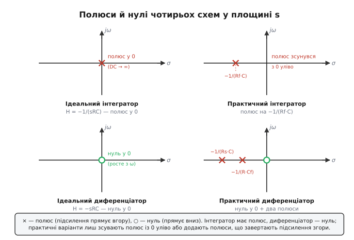
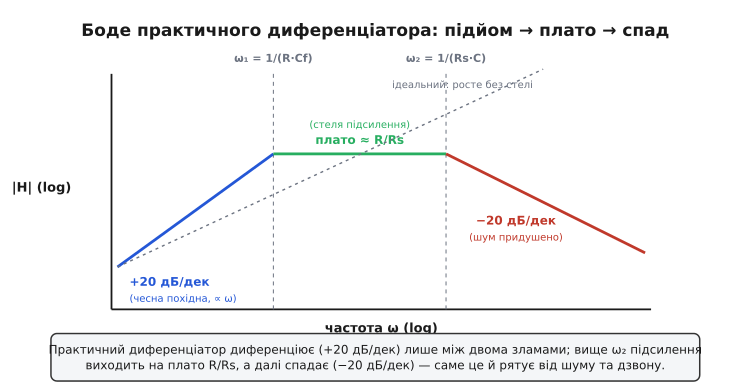

# 🧮 Передавальні функції інтегратора й диференціатора в s-області

Інтеграл і похідна — дії з аналізу, з графіків і нескінченно малих. Та коли ту саму дію виконує схема, дивитись на неї крізь інтеграли незручно: щойно сигнал стає сумішшю частот, доводиться інтегрувати й диференціювати руками для кожної складової окремо. Є мова, в якій інтегрування й диференціювання перетворюються на просте ділення й множення, а вся схема — на один дріб, з якого відразу видно, що вона робить із кожною частотою. Це **s-область** (комплексна частота). Виведемо в ній чотири передавальні функції — ідеального та практичного інтегратора, ідеального та практичного диференціатора — крок за кроком, від рівняння віртуальної землі, і подивимось, що кожен множник у тих дробах насправді означає для сигналу.

Уся вигода тримається на одному факті, який варто здобути чесно, а не прийняти на віру: чому конденсатор у цій мові виглядає як **опір 1/(sC)**, а не як «накопичувач заряду».

## Звідки береться s і чому конденсатор стає опором

Почнімо з єдиної фізичної рівності, на якій стоїть уся тема, — закону конденсатора. Заряд пропорційний напрузі (Q = C·V), а струм є швидкістю зміни заряду, тобто похідною:

```
i(t) = C · dV(t)/dt
```

Поки сигнал довільний, ця похідна — головний біль: щоб знайти струм, треба диференціювати напругу в кожну мить. Але є один сорт сигналу, для якого диференціювання тривіальне, — **експонента**. Похідна e^(st) дорівнює тій самій e^(st), лише помноженій на s. Це не математичний трюк, а серцевина методу: візьмімо напругу у вигляді V(t) = V·e^(st), де V — стала амплітуда, а s — поки що просто число в показнику. Тоді

```
i(t) = C · d(V·e^(st))/dt = C · V · s · e^(st) = sC · V(t)
```

Подивіться, що сталося. Похідна зникла. Струм виявився просто напругою, помноженою на число sC. А це — закон Ома: струм дорівнює напрузі, поділеній на опір. Тобто для експоненційного сигналу конденсатор поводиться як **опір (точніше, опір комплексний — імпеданс)**

```
Z_C = V/i = 1/(sC)
```

Ось і вся магія. Доки ми працюємо з експонентами e^(st), диференціальне рівняння конденсатора перетворюється на алгебраїчне, а сам конденсатор — на «резистор» зі значенням 1/(sC). Резистор лишається собою, Z_R = R. Більше в цих схемах нічого й нема, тож будь-яку з них тепер можна розв'язати самим лише поділом опорів, не чіпаючи інтегралів.

> 🔧 **Навіщо це.** Усі готові формули фільтрів, інтеграторів, коректорів частоти, які інженер бере зі схеми за хвилину, виведені саме так: замінив C на 1/(sC), L на sL — і далі звичайна алгебра кіл. Уміння побачити схему «в s» — це вміння прочитати її поведінку з частотою, не розв'язуючи диференціальних рівнянь щоразу. Для прошивки це той самий апарат: цифровий фільтр проєктують у s, а тоді переводять у дискретну форму.

Лишається чесно сказати, що таке s, бо від цього залежить, як читати результат. У показнику e^(st) число s — комплексне: s = σ + jω. Уявна частина ω (грецька *omega*) — звична кутова частота: при σ = 0 експонента e^(jωt) є чистим синусом-косинусом (формула Ойлера), і s = jω описує усталений гармонічний режим. Дійсна частина σ (грецька *sigma*) задає наростання чи згасання: σ < 0 — згасальна експонента, σ > 0 — наростальна. Передавальна функція H(s) — це відношення вихідної амплітуди до вхідної для сигналу e^(st); підставивши s = jω, дістаємо відгук на частоту ω (амплітуду й фазу), а нулі та полюси H(s) у площині (σ, jω) показують внутрішній характер схеми. Чому це не довільна заміна, а строга процедура — стоїть на **перетворенні Лапласа**.

> Що треба знати про перетворення Лапласа: це інтегральне перетворення, що розкладає довільний сигнал часу на суму експонент e^(st) і переводить операцію «диференціювати за часом» у множення на s, «інтегрувати» — у ділення на s. Назву носить за П'єром-Сімоном Лапласом, який подібний інтеграл застосовував у теорії ймовірностей (бл. 1809); робочий обчислювальний апарат для інженерії — «операційне числення», де оператор p = d/dt трактують як алгебраїчну змінну, — розвинув Олівер Гевісайд (1880–1895), а строгий зв'язок із інтегралами Лапласа встановили пізніше (Пуанкаре та інші). Тобто математична основа — Лапласова, практичний інструмент кіл — Гевісайдів; статус усталений. Для наших схем важливий єдиний наслідок: d/dt → ·s, ∫dt → ÷s, і конденсатор стає опором 1/(sC).

Тепер у нас є все, щоб зібрати чотири дроби.

## Інтегратор: один поділ опорів — і похідна зникає

Схема інвертуючого підсилювача має універсальну передавальну функцію, і вивести її варто один раз, щоб далі лиш підставляти. На інвертуючий вхід «−» заходить вхідний імпеданс Z_вх із джерела, а зі зворотного зв'язку від виходу йде імпеданс Z_зз. Неінвертуючий вхід «+» на землі, тож «−» тримається на **віртуальній землі** — рівно 0 В, бо зворотний зв'язок підганяє вихід так, щоб два входи зрівнялись. У входи струм не тече.

Запишемо два струми, що сходяться у вузлі «−». Зліва, від джерела, крізь Z_вх: лівий кінець має V_вх, правий — 0 В, отже струм i_вх = V_вх/Z_вх. Справа, зі зворотного зв'язку, крізь Z_зз: один кінець на виході V_вих, другий на 0 В, струм i_зз = V_вих/Z_зз, що **витікає** з вузла. Оскільки у вхід ОП струму нема, увесь, що прийшов зліва, мусить піти у зворотний зв'язок:

```
V_вх / Z_вх = − V_вих / Z_зз
```

Знак мінус — бо обидва струми ми відлічили «до вузла», а виходить вони мають бути зустрічні. Звідси одразу

```
H(s) = V_вих / V_вх = − Z_зз / Z_вх
```

Це стрижнева формула інвертуючого каскаду: **передавальна функція дорівнює мінус відношенню зворотного імпедансу до вхідного**. Уся подальша робота — підставити, що саме стоїть на цих двох місцях.

Для інтегратора на вході — резистор (Z_вх = R), у зворотному зв'язку — конденсатор (Z_зз = 1/(sC)). Підставляємо:

```
H(s) = − Z_зз / Z_вх = − (1/(sC)) / R = − 1/(sRC)
```

Ось вона. Передавальна функція ідеального ОП-інтегратора:

```
H(s) = − 1/(sRC)
```

Тепер прочитаймо цей дріб, бо в ньому записано все. Поділ на s — це і є інтегрування: ми домовились, що множення на s означає d/dt, отже ділення на s означає зворотну дію, ∫dt. Тобто вихід є інтегралом входу — рівно те, що дала фізика заряду, але здобуте без жодного інтеграла, самим поділом опорів. Множник 1/(RC) — стала часу навпаки: τ = RC задає, наскільки швидко накопичується вихід (велике RC — повільний, лагідний інтегратор; мале — різкий). Знак мінус — інвертуючий вхід перевертає сигнал.

Перевірмо, що це справді інтегратор, на сталому вході — найжорсткіша перевірка. Стала напруга — це гранична експонента з s → 0 (нульова частота, ω = 0, σ = 0). Підставивши s → 0 у H(s) = −1/(sRC), дістаємо **нескінченність**: |H| → ∞. Підсилення на сталому струмі необмежене. Спершу це лякає, та насправді саме цього й вимагає чесне інтегрування: інтеграл сталої величини росте без межі (∫C dt = C·t), отже й «підсилення» на нульовій частоті мусить бути нескінченним. Дріб 1/(sRC) каже про це чесно й заздалегідь.

Подивімось на ту саму річ у площині s, бо звідти видно характер схеми одним поглядом. Дріб −1/(sRC) має **полюс** там, де знаменник нуль, тобто при s = 0 — у самому початку координат. Полюс — це точка, де передавальна функція прямує в нескінченність; полюс у нулі і означає «нескінченне підсилення на DC». Нулів (де H = 0) у інтегратора нема.


*Полюс (×) — частота, де підсилення прямує вгору; нуль (○) — де воно прямує вниз. Інтегратор має полюс, диференціатор — нуль; саме розташування цих точок у площині s і є повний «паспорт» схеми. Практичні варіанти лиш зсувають полюс із початку координат уліво або додають полюси, що завертають підсилення на високих частотах.*

На частоту дивимось, поклавши s = jω: |H(jω)| = 1/(ωRC). Це гіпербола — підсилення спадає обернено до частоти. На логарифмічній сітці (а Боде-діаграму будують саме так) обернена пропорційність до ω — це пряма зі сталим нахилом **−20 децибел на декаду** (decade — десятикратна зміна частоти): щоразу як частота вдесятеро більша, підсилення вдесятеро менше. Той самий нахил інакше називають **−6 децибел на октаву** (octave — подвоєння частоти): подвоїли частоту — підсилення впало вдвічі (на 6 дБ). Це дві назви одного й того ж спаду, і саме сталий нахил −20 дБ/дек крізь увесь діапазон є підписом ідеального інтегратора.

## Практичний інтегратор: куди переїжджає полюс, коли додати Rf

Ідеальний інтегратор має ваду, видну прямо з полюса в нулі: нескінченне підсилення на DC означає, що крихітна стала похибка ОП (напруга зсуву, вхідний струм) інтегрується без упину, і вихід поволі сповзає в насичення. Лік — резистор Rf паралельно конденсаторові зворотного зв'язку. Подивімось, що він робить із передавальною функцією, бо звідти й вилазить уся практична поведінка.

Тепер зворотний зв'язок — це Rf та C **паралельно**. Паралельний імпеданс двох елементів — це добуток, поділений на суму (як для паралельних опорів, лиш один із них тепер 1/(sC)):

```
Z_зз = Rf ‖ (1/(sC)) = (Rf · (1/(sC))) / (Rf + 1/(sC))
```

Розкриймо акуратно — помножимо чисельник і знаменник на sC, щоб позбутись дробу в дробі:

```
Z_зз = Rf / (1 + sRfC)
```

Гарний компактний вираз. Тепер ставимо його в універсальну формулу H(s) = −Z_зз/Z_вх, де Z_вх = R (вхідний резистор той самий):

```
H(s) = − Z_зз / R = − (Rf / (1 + sRfC)) / R = − (Rf/R) / (1 + sRfC)
```

Передавальна функція практичного інтегратора:

```
H(s) = − (Rf/R) / (1 + sRfC)
```

Прочитаймо її на двох краях частоти, і все стане на місця. На **сталому струмі** (s → 0) знаменник прямує до 1, і лишається

```
H(0) = − Rf/R
```

— скінченне число. Більше ніякої нескінченності: на DC схема — просто інвертуючий підсилювач із підсиленням −Rf/R. Полюс із початку координат **переїхав уліво**, у точку s = −1/(RfC) (де знаменник 1 + sRfC дорівнює нулю). Саме це зрушення полюса з 0 в −1/(RfC) і є вся фізика «лікування дрейфу»: підсилення на нулі частоти стало скінченним, тож стала похибка вже не накопичується безмежно, а дає лише обмежений зсув −Rf/R·V_зсуву.

На **високих частотах** (велике ω) у знаменнику доданок sRfC переважає одиницю, нею можна знехтувати, і дріб спрощується:

```
H(s) ≈ − (Rf/R) / (sRfC) = − 1/(sRC)
```

Дивіться — повернулась рівно ідеальна формула −1/(sRC). Тобто **вище полюса** практична схема інтегрує точно так само, як ідеальна; нижче — поводиться як підсилювач зі сталим підсиленням Rf/R. Межа між двома режимами — частота полюса. Перейдемо від кутової частоти до звичайної (ω = 2πf), щоб дістати число, яке ставлять на схемі:

```
f_c = 1/(2π·Rf·C)
```

> 🔧 **Навіщо це.** Цю частоту добирають за одним правилом: f_c має лежати **нижче** за найнижчу частоту корисного сигналу. Тоді весь сигнал потрапляє у смугу вище зламу, де схема чесно інтегрує (−1/(sRC)), а нижче зламу лишається тільки рівне підсилення Rf/R, що гамує дрейф і нічого корисного не псує. Приклад: треба інтегрувати сигнали від 20 Гц і вище — ставлять f_c десь 1–2 Гц. Чим нижче f_c, тим ближче схема до ідеального інтегратора в робочій смузі, але тим слабше приборкано дрейф; це і є компроміс, який інженер крутить через Rf.

**Умова: інтегратор із R = 10 кОм, C = 100 нФ; який злам і яке підсилення на DC дає Rf = 1 МОм?**

```
Стала часу інтегрування:   τ  = R·C  = 10·10³ · 100·10⁻⁹ = 1·10⁻³ с = 1 мс
Частота зламу:             f_c = 1/(2π·Rf·C)
                               = 1/(6.2832 · 1·10⁶ · 100·10⁻⁹)
                               = 1/(6.2832 · 0.1) = 1/0.62832 ≈ 1.59 Гц
Підсилення на DC:          |H(0)| = Rf/R = 1·10⁶ / 10·10³ = 100  (тобто 40 дБ)
```

Висновок: вище ≈1.6 Гц схема чесно інтегрує зі сталою 1 мс, нижче — це підсилювач ×100, що не дає дрейфу зсуву рости без міри. Хочемо інтегрувати ще нижчі частоти — беремо Rf більший, f_c сповзає вниз, але стеля дрейфу (Rf/R·V_зсуву) піднімається.

Стала часу інтегрування τ = RC (1 мс) і стала, що задає злам, RfC (тут 0.1 с) — **різні** й керуються різними резисторами: R задає *крутість* інтегрування, Rf — *де* воно починається знизу. Це дає інженерові дві незалежні ручки.

## Диференціатор: той самий поділ, лиш дріб перевертається

Поміняймо R і C місцями — конденсатор на вхід, резистор у зворотний зв'язок — і пройдімо той самий шлях. Тепер Z_вх = 1/(sC), Z_зз = R. Підставляємо в універсальну формулу:

```
H(s) = − Z_зз / Z_вх = − R / (1/(sC)) = − sRC
```

Передавальна функція ідеального диференціатора:

```
H(s) = − sRC
```

Дзеркало інтегратора в найбуквальнішому сенсі: там було ділення на s, тут — множення. А множення на s ми домовились читати як d/dt: вихід є **похідною** входу, помноженою на сталу часу τ = RC, зі знаком мінус. Те, що в інтегратора стояло в знаменнику, тут стоїть у чисельнику — дріб просто перевернувся, бо R і C помінялись місцями у відношенні Z_зз/Z_вх. Уся різниця між «інтегрувати» й «диференціювати» в цій мові — на якому поверсі дробу опинився конденсатор.

У площині s це означає не полюс, а **нуль**: вираз −sRC дорівнює нулю при s = 0. Нуль у початку координат — це «нульове підсилення на DC»: стала напруга має нульову похідну, і схема її глушить. Чим далі від нуля (вища частота), тим більше підсилення.

На частоту: |H(jω)| = ωRC — підсилення росте **прямо** пропорційно до частоти. На Боде-сітці це пряма з нахилом **+20 дБ/дек** (дзеркало інтегратора): удесятеро вища частота — удесятеро більше підсилення. І саме тут схована вся біда диференціатора. Підсилення росте без стелі, а шум — це переважно високі частоти; отже схема найдужче підсилює саме те, чого найменше хочеш. На якійсь частоті власний шум ОП, помножений на величезне ωRC, проб'є корисний сигнал. Дріб −sRC чесно попереджає про це: чисельник із s, що росте без межі, — це математичний підпис «підсилюю високе нескінченно».

Є й друга біда, теж видна з апарату. Вхідний конденсатор разом зі скінченною смугою самого ОП додає у петлю зворотного зв'язку зайвий зсув фази; коли він підкрадається до критичного, [запас стійкості](topic:hw-analog/opamp-stability) тане, і схема дзвенить або зривається в самозбудження. Обидві хвороби — від того самого нічим не обмеженого підйому +20 дБ/дек. Отже лік один: завернути цей підйом на високих частотах.

> Що треба знати про запас стійкості: підсилювач зі зворотним зв'язком стійкий, лише поки на частоті, де петльове підсилення спадає до одиниці, повний зсув фази в петлі не дотягує до 360° (інакше зворотний зв'язок стає додатним і схема самозбуджується). Кожен реактивний елемент і скінченна смуга ОП додають фазу; диференціатор зі своїм вхідним конденсатором і підйомом підсилення особливо схильний підкотити фазу до небезпечної межі — тому його завжди приборкують.

## Практичний диференціатор: нуль лишається, але з'являються два полюси

Лікують диференціатор двома деталями — послідовним резистором Rs у вхідному колі (разом із C) та конденсатором Cf паралельно резисторові зворотного зв'язку. Виведемо повну передавальну функцію й побачимо, що кожна деталь робить у дробі. Тепер імпеданси такі:

```
Вхід (Rs послідовно з C):        Z_вх = Rs + 1/(sC) = (1 + sRsC)/(sC)
Зворотний зв'язок (R ‖ Cf):       Z_зз = R / (1 + sRCf)
```

Z_зз вийшов за тим самим правилом паралельного з'єднання, що й Rf‖C в інтеграторі. Ставимо обидва в H(s) = −Z_зз/Z_вх:

```
                R/(1 + sRCf)            R/(1 + sRCf) · sC          sRC
H(s) = − ───────────────────── = − ─────────────────────── = − ─────────────────────────
            (1 + sRsC)/(sC)              (1 + sRsC)             (1 + sRsC)(1 + sRCf)
```

Повна передавальна функція практичного диференціатора:

```
H(s) = − sRC / [ (1 + sRsC)(1 + sRCf) ]
```

Розгляньмо, що тут з'явилось. У **чисельнику** лишився той самий sRC — нуль у початку координат **нікуди не дівся**: на низьких і середніх частотах схема, як і раніше, чесно диференціює. А ось у **знаменнику** виросли два множники, кожен дає свій полюс — дві точки, де підсилення завертає вниз. Перший полюс — при 1 + sRCf = 0, тобто s = −1/(RCf); другий — при 1 + sRsC = 0, s = −1/(RsC). Обидва ліворуч на дійсній осі (див. карту полюсів-нулів вище: у практичного диференціатора нуль у нулі плюс два хрестики зліва).

Сенс кожного полюса видно, якщо знов прочитати дріб на трьох ділянках частоти.

На **низьких частотах** (обидва доданки sRsC та sRCf малі) знаменник ≈ 1, лишається H ≈ −sRC — ідеальний диференціатор, підйом +20 дБ/дек. Усе як треба: тут і живе корисний сигнал.

Коли частота дістає **першого полюса** (нижчого з двох), його множник у знаменнику починає рости пропорційно до s — і гасить підйом чисельника. s угорі ділиться на s унизу, і підсилення **виходить на плато**: перестає рости, стає сталим. Висота плато — це відношення двох резисторів. Якщо першим спрацьовує полюс від Cf, плато сидить на рівні R/Rs (саме воно й важливе, бо Rs здебільшого мале, тож R/Rs — велике, але вже скінченне число). Це **стеля підсилення** диференціатора: вище неї жодна частота, хоч який високочастотний шум, більше не роздувається.

Коли частота переходить **другий полюс**, у дію вступає його множник, унизу тепер s², а вгорі лиш s — і підсилення повертає **вниз, −20 дБ/дек**. Найвищі частоти не просто перестали рости, а активно придушуються; саме це й рятує від шуму та дзвону, який мучив чистий диференціатор.


*Чесне диференціювання живе тільки в смузі підйому +20 дБ/дек між нулем і першим зламом. Вище першого полюса підсилення впирається в плато R/Rs (стеля), вище другого — спадає −20 дБ/дек і глушить високочастотний шум. Пунктир показує, куди без приборкання поліз би ідеальний sRC — у нескінченність.*

Два зломи добирають так, щоб смуга чесного диференціювання (підйом +20 дБ/дек) накривала корисні частоти, а обидва полюси лягли вище них — там, де лишається сама лиш завада. Нижній злам зазвичай кладуть приблизно на верхній край корисної смуги:

```
f₁ = 1/(2π·R·Cf)     — кінець підйому, початок плато
f₂ = 1/(2π·Rs·C)     — кінець плато, початок спаду
```

**Умова: диференціатор R = 100 кОм, C = 10 нФ; чесно диференціюємо до 1 кГц, а вище — приборкуємо. Які f₁, f₂ і висота плато при Rs = 1 кОм, Cf = 1.5 нФ?**

```
Стала диференціювання:  τ  = R·C = 100·10³ · 10·10⁻⁹ = 1·10⁻³ с = 1 мс
Перший злам (плато):    f₁ = 1/(2π·R·Cf)  = 1/(6.2832 · 100·10³ · 1.5·10⁻⁹)
                            = 1/(6.2832 · 1.5·10⁻⁴) ≈ 1/0.000942 ≈ 1.06 кГц
Висота плато:           R/Rs = 100·10³ / 1·10³ = 100   (стеля підсилення ×100, 40 дБ)
Другий злам (спад):     f₂ = 1/(2π·Rs·C) = 1/(6.2832 · 1·10³ · 10·10⁻⁹)
                            = 1/(6.2832 · 1·10⁻⁵) ≈ 1/0.0000628 ≈ 15.9 кГц
```

Висновок читається з чисел одразу: до ≈1 кГц схема чесно бере похідну (підйом), від 1 до 16 кГц підсилення стоїть на стелі ×100, вище 16 кГц — спадає й глушить шум. Корисна смуга (до 1 кГц) повністю в зоні чесного диференціювання, а небезпечний верх приборкано двома полюсами. Покрутіть Cf — посунеться f₁ (де обірветься диференціювання); покрутіть Rs — посунеться і f₂, і висота плато R/Rs одночасно.

## Чотири дроби поряд: що з усього лишається

Зведімо здобуте — не для переліку, а щоб побачити одну й ту саму машину в чотирьох позах. Усе вийшло з єдиної формули інвертуючого каскаду H(s) = −Z_зз/Z_вх, у яку щоразу підставляли інший імпеданс, бо конденсатор у мові s — це просто опір 1/(sC):

```
Ідеальний інтегратор:        H(s) = − 1/(sRC)                          полюс у 0
Практичний інтегратор:       H(s) = − (Rf/R)/(1 + sRfC)                полюс на −1/(Rf·C)
Ідеальний диференціатор:     H(s) = − sRC                              нуль у 0
Практичний диференціатор:    H(s) = − sRC/[(1+sRsC)(1+sRCf)]           нуль у 0 + два полюси
```

Уся різниця між інтегруванням і диференціюванням — на якому поверсі дробу стоїть s: унизу — інтеграл, угорі — похідна. Полюс у площині s означає «тут підсилення прямує вгору» (інтегратор має його в нулі — нескінченне підсилення на DC); нуль означає «тут воно прямує вниз» (диференціатор має його в нулі — глушить сталу). Практичні варіанти не міняють суті, а лиш **двигають ці точки з небезпечних місць**: інтегратор зсуває свій полюс із самого початку координат трохи вліво, щоб підсилення на DC стало скінченним і дрейф не з'їв вихід; диференціатор лишає свій нуль на місці, але добудовує два полюси вгорі, щоб підйом підсилення не пішов у нескінченність і не потяг із собою шум та самозбудження.

Смуга чесної дії в обох випадках — це проміжок між точками. Інтегратор інтегрує **вище** свого полюса f_c = 1/(2π·Rf·C), нижче нього лиш гамує дрейф. Диференціатор диференціює **нижче** свого першого полюса f₁ = 1/(2π·R·Cf), вище нього впирається в стелю R/Rs і далі спадає. Поставив точки правильно — корисний сигнал лягає в смугу чесної дії, а все зайве (дрейф знизу, шум згори) лишається поза нею. Оце і є вся проєктна суть, яку дають передавальні функції: не «формули роботи схеми», а карта, де схема працює чесно, а де лише захищається.
