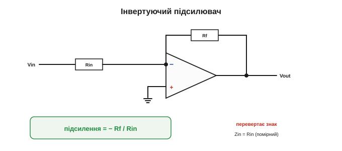
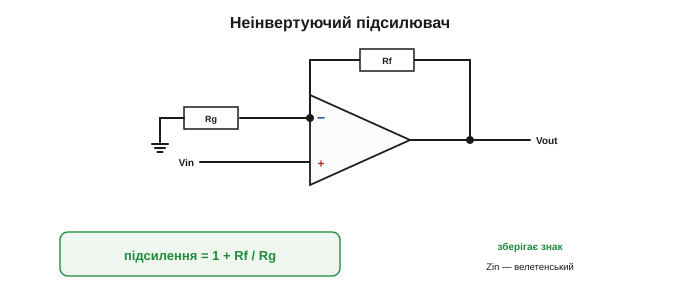
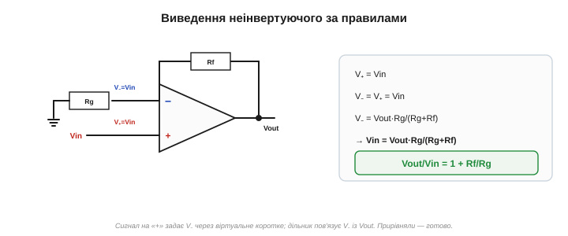
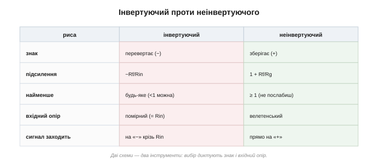
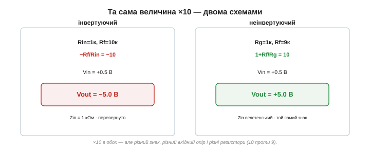

# Неінвертуючий та інвертуючий підсилювач

Спираючись на [два золоті правила](topic:hw-analog/virtual-short) ідеального ОП зі зворотним зв'язком, розберімо дві найважливіші схеми на ОП — два «робочі коники» аналогової збірки: **інвертуючий** і **неінвертуючий** підсилювачі. Обидва дають точне підсилення, задане резисторами; різняться вони знаком, формулою й вхідним опором. Виведемо кожен тими самими правилами.

### Інвертуючий підсилювач

Сигнал Vin подають крізь резистор Rin на вхід «−»; від виходу на той самий вузол іде резистор зворотного зв'язку Rf; вхід «+» заземлено. Вузол «−» стає [віртуальною землею](topic:hw-analog/virtual-short) (0 В), і за три рядки виходить:

```
Підсилення =  Vout / Vin  =  − Rf / Rin
```


*Інвертуючий підсилювач. Сигнал заходить крізь Rin на віртуальну землю «−»; Rf замикає зворотний зв'язок. Підсилення −Rf/Rin; знак «мінус» означає перевертання сигналу.*

Дві риси цієї схеми варто тримати в голові. По-перше, вона **перевертає** сигнал (знак «мінус»): додатний вхід дає від'ємний вихід. По-друге, її **вхідний опір дорівнює Rin** — джерело живить струм у віртуальну землю крізь Rin, тож «бачить» саме цей резистор. Опір цей помірний (кілоомні величини), і це інколи вада: слабке джерело такий вхід може «просадити».

Є й особливо корисний родич інвертуючої схеми — **перетворювач струму на напругу** *(transimpedance)*. Прибери вхідний резистор Rin і подай у віртуальну землю прямо **струм** — наприклад, від [фотодіода](topic:hw-sensing/led-photodiode). Цьому струмові нікуди дітися, окрім як крізь Rf, тож на виході постає напруга Vout = −I·Rf. Так крихітний фотострум обертають на зручну напругу — це серце кожного люксметра й оптичного приймача. Класична робота саме для віртуальної землі. Числом: фотодіод дає 1 мкА, Rf = 1 МОм → Vout = −I·Rf = −(1·10⁻⁶)·(1·10⁶) = −1 В. Мікроампер світлового струму став цілим вольтом, який легко виміряти; що яскравіше світло — то більший струм — то більша напруга.

### Неінвертуючий підсилювач

А тепер — інша схема, у якій сигнал заходить **прямо на «+»**. Зворотний зв'язок беруть з виходу через дільник напруги: резистор Rf з виходу на вузол «−» і резистор Rg з того ж вузла на землю. Виведемо підсилення.

```
сигнал на «+»:        V₊ = Vin
віртуальне коротке:    V₋ = V₊ = Vin

вузол «−» — це вихід дільника Rf–Rg (струму у вхід нема, правило 1):
   V₋ = Vout · Rg / (Rg + Rf)

прирівнюємо:   Vin = Vout · Rg / (Rg + Rf)
звідси:        Vout / Vin = (Rg + Rf) / Rg  =  1 + Rf / Rg
```


*Неінвертуючий підсилювач. Сигнал заходить прямо на «+»; дільник Rf–Rg повертає частину виходу на «−». Підсилення 1+Rf/Rg — завжди додатне (без перевертання) і не менше за одиницю.*

Маленьке уточнення: дільник Rf–Rg «тягне» струм не з джерела сигналу (той сидить на «+», звідки струму не беруть), а з **виходу** ОП. Тому опір цього дільника обирають помірним — не надто малим, щоб не вантажити вихід зайвим струмом, і не надто великим, щоб [струми зміщення входу](topic:hw-analog/real-opamp-limits) не псували точність. Типово це кілоомні номінали.

Знову три рядки — і відповідь: **підсилення 1 + Rf/Rg**. Воно теж задане лише резисторами, але має дві відмінності від інвертуючого. По-перше, воно **додатне** — сигнал **не перевертається**. По-друге — і це головна перевага — сигнал заходить прямо на вхід «+», у який **струм не тече зовсім** (правило 1), тож **вхідний опір цієї схеми велетенський**. Вона майже не вантажить джерело — ідеально для слабких давачів.


*Виведення за правилами. V₊ = Vin (сигнал прямо на «+»); віртуальне коротке робить V₋ = Vin; а V₋ — це вихід дільника Rf–Rg. Прирівнявши, дістаємо 1 + Rf/Rg.*

Звідки в неінвертуючому той «+1»? Інтуїтивно: сигнал на «+» **і так** з'являється на виході в повному розмірі (бо вихід женеться за ним), а резистори лише **додають** зверху ще Rf/Rg підсилення. Тому мінімум — одиниця: навіть без жодного додаткового підсилення вихід точно повторює вхід. Інакше це бачать через **частку зворотного зв'язку**: дільник Rf–Rg повертає на «−» лише частку Rg/(Rg+Rf) виходу, і ОП підганяє вихід так, щоб ця частка зрівнялася з усім Vin, — а отже, вихід має бути в (Rg+Rf)/Rg = 1+Rf/Rg разів більший за вхід. Менша повернута частка — більше підсилення; це загальна логіка будь-якого підсилювача зі зворотним зв'язком.

> 🔧 **Навіщо це.** Дві формули, які варто закарбувати (а ще краще — уміти **вивести** за [правилами ідеального ОП](topic:hw-analog/virtual-short)): **інвертуючий — `−Rf/Rin`**, **неінвертуючий — `1 + Rf/Rg`**. Зверніть увагу на «+1» у неінвертуючому: він означає, що така схема **не вміє послаблювати** — її підсилення завжди ≥1 (навіть із Rf = 0 вийде рівно ×1, [повторювач](topic:hw-analog/voltage-follower)). Інвертуюча ж може давати й менше за одиницю — тобто **послаблювати**. Це одна з відмінностей, що диктують вибір.

А що, як треба і **високий вхідний опір**, і підсилення **менше за одиницю** (послабити, не вантажачи джерело)? Неінвертуючий цього не вміє (його мінімум — одиниця), інвертуючий вантажить джерело своїм Rin. Розв'язок — **поєднати** блоки: спершу [буфер-повторювач](topic:hw-analog/voltage-follower) з велетенським входом, а вже після нього звичайний дільник. Гнучкість ОП саме в тому, що готові блоки складають у ланцюги, як деталі конструктора.

### Дві схеми поряд

Зведімо різницю в таблицю.


*Інвертуючий проти неінвертуючого. Різний знак, різні формули підсилення, різний вхідний опір і різне місце входу сигналу. Дві схеми — два інструменти під різні потреби.*

Словами:

- **Знак:** інвертуючий **перевертає** (−), неінвертуючий **зберігає** (+).
- **Підсилення:** −Rf/Rin проти 1+Rf/Rg.
- **Найменше підсилення:** інвертуючий — будь-яке (можна <1, тобто послаблювати); неінвертуючий — **не менше за 1**.
- **Вхідний опір:** інвертуючий — помірний (= Rin); неінвертуючий — **велетенський** (вхід на «+»).
- **Куди заходить сигнал:** інвертуючий — на «−» крізь Rin; неінвертуючий — прямо на «+».

### Коли яку брати

Вибір диктують саме ці відмінності:

- **Неінвертуючий** беруть, коли головне — **не навантажити джерело**: слабкі давачі, високоомні джерела, входи, з яких не можна «висмоктувати» струм. Платять за це тим, що підсилення не опускається нижче 1 і знак не перевертається.
- **Інвертуючий** беруть, коли потрібна **віртуальна земля** (для [суматорів](topic:hw-analog/summing-difference-amp), перетворювачів «струм→напруга»), коли треба **послабити** сигнал, або коли перевертання знаку не заважає (а часто й бажане). Ціна — помірний вхідний опір Rin.


*Вибір схеми. Неінвертуючий — коли не можна вантажити джерело (давачі). Інвертуючий — коли потрібні віртуальна земля, послаблення чи перевертання. Часто рішення диктує саме вхідний опір.*

Кілька прикладів із життя. Неінвертуючий — це класичний **підсилювач давача**: мікрофон, термопара, тензодавач дають слабкий сигнал із високим внутрішнім опором, і неінвертуюча схема підсилює його, не «висмоктуючи» струму. Інвертуючий — серце аналогового **мікшера** (на основі [суматора](topic:hw-analog/summing-difference-amp)) і схем обробки сигналу, де перевертання знаку байдуже або корисне. Майже в кожному приладі знайдеться по кілька і тих, і тих.

### Числа на двох прикладах

Покажемо обидві з тими самими резисторами, щоб різниця впала в око.

```
ІНВЕРТУЮЧИЙ:    Rin = 1 кОм, Rf = 10 кОм
   підсилення = −Rf/Rin = −10
   Vin = +0.5 В  →  Vout = −5.0 В      (перевернуто; Zin = 1 кОм)

НЕІНВЕРТУЮЧИЙ: Rg = 1 кОм, Rf = 9 кОм
   підсилення = 1 + Rf/Rg = 1 + 9 = 10
   Vin = +0.5 В  →  Vout = +5.0 В      (той самий знак; Zin — велетенський)
```

Обидві дають однакову **величину** підсилення (×10), але інвертуючий перевертає знак і має скромний вхідний опір, а неінвертуючий зберігає знак і майже не вантажить джерело. Зверніть увагу на дрібну, але важливу деталь: щоб дістати підсилення 10, інвертуючому треба відношення Rf/Rin = 10, а неінвертуючому — Rf/Rg = 9 (бо там додається одиниця). Дрібна арифметична пастка, на якій легко спіткнутися, — тож перш ніж паяти, варто ще раз перевірити формулу під свою схему.


*Та сама величина підсилення (×10) двома схемами. Інвертуючий: −5 В, Zin = 1 кОм. Неінвертуючий: +5 В, Zin велетенський. І відношення резисторів різні: 10 проти 9 (через «+1»).*

А коли потрібне дуже велике підсилення — скажімо, ×1000? Робити його одним каскадом незручно, тому великий коефіцієнт набирають **кількома каскадами** поспіль: два по ×30 дають ×900, три по ×10 — ×1000. Підсилення каскадів **перемножуються** — як і в [транзисторному підсилювачі](topic:hw-analog/bjt-amplifier). Блоки на ОП легко зчіплювати, бо в кожного нульовий вихідний і (для неінвертуючого) велетенський вхідний опір — вони не заважають один одному.

Чому ж незручно тиснути все підсилення в один каскад? Бо в [реального ОП](topic:hw-analog/real-opamp-limits) величина підсилення й **смуга** частот пов'язані: що більше підсилення накрутиш, то вужчою стає смуга, у якій воно тримається. Кілька помірних каскадів дають і велике сумарне підсилення, і пристойну смугу — ще одна причина не вичавлювати все з одного ОП.

Уявіть типовий аналоговий тракт сучасного приладу: давач → неінвертуючий підсилювач (велетенський вхід, не вантажить давач) → ще один каскад підсилення → фільтр на ОП → і нарешті сигнал заходить в [АЦП](topic:hw-analog/adc) мікроконтролера, щоб стати цифрою. Кожна ланка тут — окремий блок на операційному підсилювачі, і кожен виводиться тими самими [двома правилами](topic:hw-analog/virtual-short). Інвертуючий і неінвертуючий — це дві третини всього потрібного для аналогової обробки сигналу; решта спеціальних блоків — буфер, суматор, компаратор, тригер — будуються тим самим способом. Операційний підсилювач тому й цінний, що з кількох однакових на вигляд трикутників і жменьки резисторів складається безліч різних схем.

> 🔧 **Навіщо це.** Практичні застороги до обох схем. (1) Не проси більшого виходу, ніж дозволяють [рейки живлення](topic:hw-analog/ideal-opamp): підсилення 100 від сигналу 0.2 В хотіло б 20 В на виході — а ОП дасть лише до рейки й насититься. (2) Точність підсилення — це точність резисторів: хочеш рівно ×10 — бери резистори 1%. (3) Не сплутай формули: зайва (чи забута) одиниця в неінвертуючому — найчастіша помилка новачка.

Ще дві практичні тонкощі наостанок. **Живлення й нуль:** якщо ОП живиться двополярно (±Vs), «нулем» для сигналу є справжня земля. А коли живлення однополярне (0…5 В від мікроконтролера), вихід не може піти нижче нуля — тож змінний сигнал «піднімають» на **середину живлення**, навколо якої він і гойдається; забути про це — типова причина, чому «підсилювач не працює» на одній батарейці. І **струм виходу:** ОП віддає лише обмежений струм (типово десятки міліампер), тож динамік чи моторчик він напряму не розгойдає — для потужного навантаження після ОП ставлять буфер чи [MOSFET-каскад](topic:hw-components/mosfet-power-switch). ОП — для **сигналу**, не для сили.

І ще: щоб підсилювати **змінний** сигнал (звук, биття пульсу), не чіпаючи його постійної складової, на вході ставлять [розділовий конденсатор](topic:hw-components/capacitor) — він пропускає змінну частину, а постійне зміщення схеми лишає на місці. Ідея та сама, що в [транзисторному підсилювачі](topic:hw-analog/bjt-amplifier), лише прилад зручніший.

### Гранична форма: підсилення рівно одиниця

Два золоті правила дали два робочі підсилювачі: інвертуючий (−Rf/Rin, помірний вхід, перевертає) і неінвертуючий (1+Rf/Rg, велетенський вхід, зберігає знак). Є й гранична, найпростіша форма неінвертуючого — коли підсилення дорівнює рівно одиниці. Здавалося б, навіщо підсилювач, що нічого не підсилює? А виявляється, він — один із найкорисніших: [повторювач-буфер](topic:hw-analog/voltage-follower). Його єдина робота — **розв'язати** опори: узяти напругу з кволого високоомного джерела й віддати її потужно, не змінивши ні на вольт.
