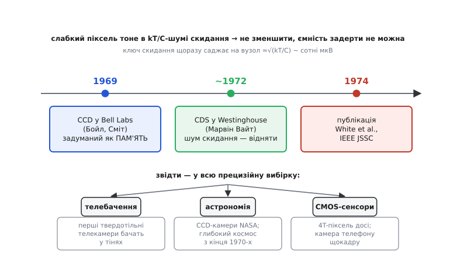

# 📜 Як приручили шум скидання: корельована подвійна вибірка

Будь-яка нова технологія спершу впирається не в те, чого від неї хотіли, а в дрібницю, якої ніхто не передбачив. З першими приладами із зарядовим зв'язком (CCD) такою дрібницею став шум скидання. Сама ідея виявилася блискучою: ганяти пакети заряду по поверхні кремнію, як воду по жолобах, і так зчитувати зображення піксель за пікселем. Та коли дійшло до зчитування слабко освітленого пікселя, інженери побачили химерне: сигнал тоне в шумі, який не з пікселя й не з підсилювача, — він народжується в самому акті скидання вузла перед кожним відліком. Це був [kT/C-шум](root:hw-analog/kT-over-C-noise) у чистому вигляді, тільки тоді його ще не звали так буденно. Історія того, як його обійшли, — це історія одного несподівано простого прийому, що згодом ліг в основу зчитування майже кожної камери на світі.

## Прилад, який задумали як пам'ять

Щоб зрозуміти, звідки взявся шум скидання, варто почати з того, чим CCD був задуманий — а задуманий він був зовсім не камерою. 17 жовтня 1969 року в Bell Telephone Laboratories у Мюррей-Гілл (Нью-Джерсі) двоє фізиків — **Віллард Бойл** (Willard Boyle, канадець із Амгерста, Нова Шотландія) і **Джордж Сміт** (George E. Smith, американець) — за якусь годину біля дошки накидали структуру, що мала стати твердотільним аналогом магнітної бульбашкової пам'яті. Керівник відділу Джек Мортон (Jack Morton) просив придумати напівпровідниковий замінник тій пам'яті; Бойл і Сміт відповіли регістром зсуву, що пересуває не біти в тригерах, а **пакети заряду** під ланцюжком затворів. *(Усталений факт: дата, місце й первісне призначення підтверджені нобелівською лекцією та архівами Bell Labs; за CCD Бойл і Сміт дістали Нобелівську премію з фізики 2009 року.)*

Те, що цей регістр заряду можна освітити й перетворити на матрицю світлочутливих комірок, стало зрозуміло майже одразу — і саме перетворення CCD на **прилад зображення** велику частину роботи зробив колега тих самих лабораторій **Майкл Томпсетт** (Michael F. Tompsett), який подав патент на CCD саме як на пристрій формування зображення. *(Усталено, хоч атрибуцію довкола Нобеля 2009 досі обговорюють: Томпсетт у премію не ввійшов, що частина спільноти вважає несправедливим. Розрізняймо: ідея регістра заряду — Бойл і Сміт; робоча реалізація саме як камери — значною мірою Томпсетт.)*

І от тут вилазить корінь проблеми. Щоб зчитати заряд пікселя, його зливають на маленьку ємність вузла зчитування й міряють напругу, яку він там наводить. Але перед кожним новим пікселем цю ємність треба **скинути** — повернути до опорного рівня ключем. А скидання ключем — це рівно та ситуація, через яку взагалі існує kT/C-шум: замкнули ключ, ємність підтяглася до опори крізь опір каналу, розімкнули — і на ємності застиг не чистий опорний рівень, а він плюс випадковий миттєвий тепловий шум каналу. Для дрібного вузла зчитування з ємністю в одиниці-десятки фемтофарад √(kT/C) виходить у сотні мікровольтів:

```
C = 10 фФ = 10⁻¹⁴ Ф,  T = 300 К
√(kT/C) = √(1.38×10⁻²³ × 300 / 10⁻¹⁴) ≈ 6.4×10⁻⁴ В ≈ 0.6 мВ (rms)
```

Пів-мілівольта випадкового зсуву, що наново кидається з кожним скиданням, — а сигнал від кволого пікселя може бути такого самого порядку або й менший. У темряві саме цей шум вирішував, що камера ще здатна розгледіти, а що вже ні. Збільшити ємність вузла, щоб стишити kT/C, не випадало: більша ємність — менша наведена пікселем напруга, тобто менша чутливість. Класична стіна.

## Думка з Westinghouse: не зменшити, а відняти

Ключ до обходу знайшовся не в Bell Labs, а в **Westinghouse Advanced Technology Laboratory** (Балтимор, Меріленд), де групу твердотільного зображення вів **Марвін Вайт** (Marvin H. White, нар. 1937, Бронкс; фізику здобув у Мічиганському університеті). Наприкінці 1960-х Вайт працював над приладами з перенесенням заряду й МНОН-структурами; коли постала задача зчитати CCD-матрицю на низькому світлі, його група близько 1972 року прийшла до прийому, який згодом назвали **корельованою подвійною вибіркою** (correlated double sampling, CDS). *(Усталено: розробка ~1972 у Westinghouse ATL, перша повна публікація — 1974; це підтверджують стаття в IEEE JSSC та власна усна історія Вайта в архіві IEEE.)*

Хід думки був гарний саме тим, що приймав поразку як даність. Раз заморожений на ємності рівень скидання **не змінюється**, доки ключ розімкнений, — це не «шум, що шумить», а **сталий випадковий зсув** на час одного відліку. А сталу величину, хай і випадкову, можна зміряти. Тож замість одного зчитування роблять два:

```
1) скинули вузол ключем  →  зчитали РІВЕНЬ СКИДАННЯ  (тільки kT/C-зсув, без сигналу)
2) злили заряд пікселя   →  зчитали РІВЕНЬ СИГНАЛУ   (сигнал + ТОЙ САМИЙ зсув)
   результат = (2) − (1)  →  зсув гаситься, лишається чистий сигнал
```

Слово **корельована** тут несе весь сенс. Обидва відліки беруть **той самий екземпляр** замороженого шуму — між ними ключ не клацає, рівень не оновлюється, тому два відліки скорельовані. Віднімаючи один від одного, спільний зсув виносять за дужки, і він зникає. Якби між відліками ключ скинув вузол ще раз, рівень оновився б на новий, незалежний, — кореляція б розпалася, і віднімання лише **подвоїло** б шум замість гасити. Уся хитрість трималася на тому, щоб устигнути зняти обидві вибірки за один цикл, поки зсув ще той самий.

> 🔧 **Навіщо це.** Прийом Вайта — це окремий спосіб мислити про похибку взагалі. Коли її не можна **зменшити** (kT/C не бере ні кращий ключ, ні розумніша топологія), питають інакше: чи стала вона між двома близькими відліками? Якщо так — її можна **зміряти й відняти**. Та сама логіка згодом дала чопперні та auto-zero підсилювачі й рейтіометричні вимірювання. CDS — найчистіший її приклад: два дешеві відліки роблять те, чого не зробив би вчетверо більший конденсатор.

Була й безкоштовна премія, якої спершу навіть не шукали. Віднімання двох близьких у часі відліків гасить не лише заморожений kT/C-зсув, а й **повільний дрейф** — постійну складову й низькочастотний 1/f-шум підсилювача, які за короткий проміжок між двома вибірками майже не встигають змінитися, тобто теж однакові в обох. Математично передавальна характеристика CDS має нуль на нульовій частоті: усе найповільніше вона притлумлює. Тому CDS цінують подвійно — і за шум скидання, і за приборкання 1/f. Цей бік прийому Вайт із колегами розібрали окремо в статті про відгук CDS-схеми на 1/f-шум CCD-матриць (IEEE Transactions on Electron Devices, 1975).

## Публікація 1974 року й що було далі

Свій результат група Вайта оприлюднила двічі: спершу доповіддю на конференції 1973 року, а тоді повною статтею в лютому 1974-го —

> **M. H. White, D. R. Lampe, F. C. Blaha, I. A. Mack.** «Characterization of surface channel CCD image arrays at low light levels». *IEEE Journal of Solid-State Circuits*, т. 9, № 1, с. 1–12, лютий 1974.

Назва скромна — «характеризація поверхневих CCD-матриць на низькому світлі», — але саме в ній уперше описано CDS як спосіб прибрати шум скидання й перехідні викиди ключа. У супровідних роботах тієї ж групи (зокрема Лампе з колегами, доповідь на CCD Applications Conference у Сан-Дієго, вересень 1973) прийом розширили на гасіння й інших систематичних похибок — розкиду порогів, струмів витоку, дрейфу зміщення; цей ширший варіант пізніше закріпили патентом Westinghouse «extended correlated double sampling for charge transfer devices». *(Назву патенту й приналежність Westinghouse підтверджено; точний номер і дату видачі різні джерела подають неоднаково, тож тут не фіксую конкретний номер — статус: усталено щодо суті, спірно щодо точного реквізиту.)*

Далі прийом розійшовся хвилею — і скрізь з тієї самої причини. **Телебачення:** перші твердотільні телекамери на CCD без CDS просто не давали чистої картинки в тінях; подвійна вибірка зробила їх придатними. **Астрономія:** саме тут CDS виграв найбільше. Телескоп ловить жменьку фотонів за довгу витримку, сигнал кволий до краю, і шум скидання інакше потопив би слабкі зорі цілком. Перші астрономічні CCD-камери з'явилися наприкінці 1970-х (зокрема в Лабораторії реактивного руху NASA), і CDS — стандартний крок їхнього зчитування досі: рівень скидання й рівень сигналу знімають окремо й віднімають для кожного пікселя. Без цього прийому глибокий космічний знімок був би сірою кашею.


*Прилад задумали як пам'ять, перетворили на камеру — і впіймали kT/C-шум скидання, який не зменшити. Замість зменшувати, рівень скидання навчилися вимірювати й віднімати. Опубліковано 1974-го, прийом розійшовся в телебачення, астрономічні камери й сучасні CMOS-сенсори, де живе досі.*

**Сучасні CMOS-сенсори.** Коли матрицю зображення перенесли з CCD на звичайну КМОН-технологію, шум скидання нікуди не подівся — у пікселі на чотирьох транзисторах (4T) є той самий ключ скидання й та сама ємність на плаваючому вузлі. Тому CDS вмонтували прямо в КМОН-зчитування: рівень скидання й рівень сигналу знімають із кожного пікселя й віднімають — часто вже в стовпцевих схемах або навіть у цифрі, після АЦП. Камера у вашому телефоні щокадру робить рівно те, що група Вайта придумала для CCD-матриці на пів-сторінки в 1972 році. Прийом пережив саму технологію, заради якої народився.

> 🔧 **Навіщо це.** Те, що CDS перейшов з CCD на CMOS без змін у суті, — добрий урок про природу фундаментальних обмежень. kT/C-шум не належить жодній конкретній технології: він випливає з теплового руху електронів у будь-якому опорі, крізь який заряджають будь-яку ємність. Тому й ліки від нього технологію переживають. Хто розуміє причину шуму, а не лише його прояв в одному приладі, отримує прийом, що працює й через півстоліття, і в кремнії, про який винахідник не чув.

## Що з цього лишилося

Корельована подвійна вибірка — рідкісний випадок, коли одну акуратну думку видно наскрізь через десятиліття й через зміну поколінь заліза. CCD задумали як пам'ять, перетворили на камеру — і відразу впіймали kT/C-шум скидання, що потопляв слабкі пікселі. Збільшити ємність було не можна, кращий ключ не рятував — і Марвін Вайт із колегами в Westinghouse близько 1972-го змінили саме питання: не як зменшити заморожений зсув, а як його **зміряти й відняти**, поки він сталий. Два відліки замість одного, віднімання — і шум скидання разом із повільним дрейфом виноситься за дужки. Опубліковано 1974-го, прийом пішов у телебачення, в астрономічні камери, а тоді й у кожен CMOS-сенсор, де живе й нині. Гарна ідея не зменшує те, що зменшити не можна, — вона ставить питання так, щоб незмінне само себе скасувало.
