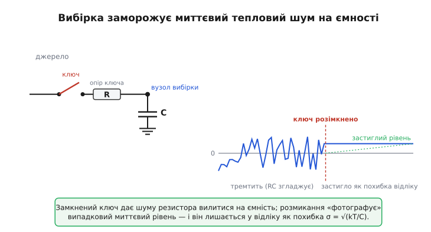
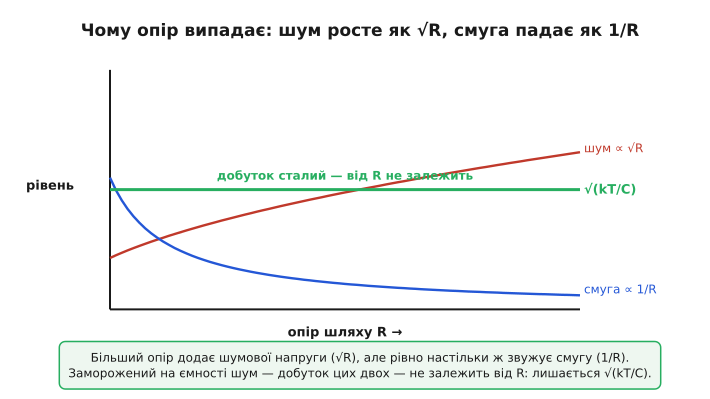
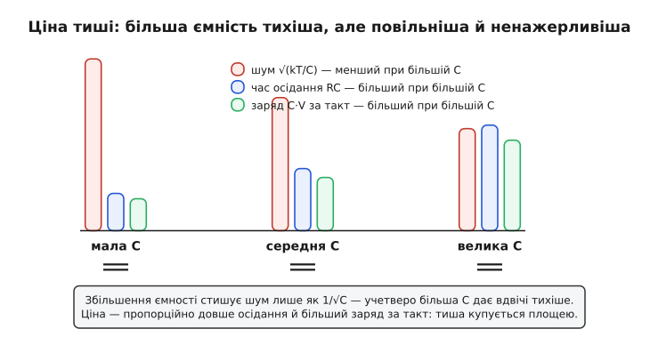
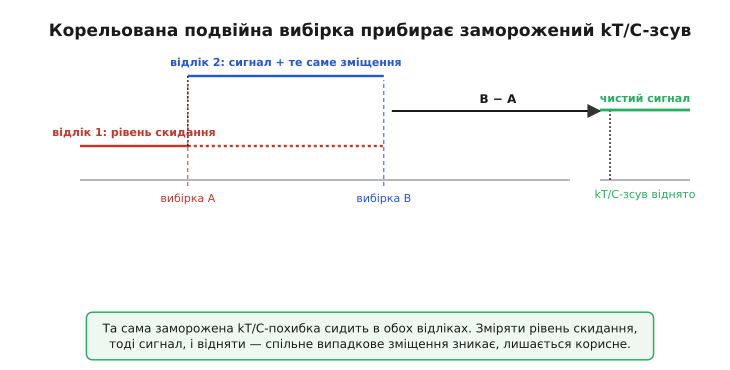

# kT/C-шум: чому простий конденсатор ставить стелю точності вибірки

Майже кожен аналоговий вхід десь усередині робить одну й ту саму просту річ: замикає ключ, дає напрузі затекти на конденсатор, тоді розмикає ключ — і тримає заморожений на ємності рівень, поки його зчитують. Так працює пристрій вибірки-зберігання перед АЦП, так працює кожен такт схеми на комутованих конденсаторах, так зчитується піксель матриці камери. Дія настільки буденна, що про неї не думають. А дарма: саме в цей момент розмикання конденсатор «фотографує» не лише корисну напругу, а й крихітний тепловий шум — і замикає його в собі як похибку відліку. Похибку, від якої не рятує ні ідеальний ключ, ні ідеальний АЦП, бо вона приходить раніше за них.

Найдивніше в цій похибці — її формула. Шумова напруга, що лишається на ємності C, дорівнює √(kT/C): стала Больцмана, температура, ємність — і **жодного опору**. Хоча весь цей шум народжується саме в опорі ключа. Опір, через який тече заряд, у відповідь не входить узагалі. Це не помилка й не наближення: так і має бути, і причина цього — одна з найгарніших у всій теорії шумів. Розберімо її від першопричини: звідки шум, чому він застигає, чому R випадає, скільки це в числах і як від цього захищаються там, де мікровольти вирішують.

> 🔧 **Навіщо це.** kT/C-шум — це підлога, об яку впирається роздільність будь-якого тракту з вибіркою. Інженер ставить 16-розрядний АЦП, а реально працюють 13 розрядів — і починає винуватити мікросхему. А насправді шумить конденсатор вибірки на вході: він замалий, тож √(kT/C) з'їв три молодші розряди ще до того, як перетворювач почав рахувати. Хто вміє порахувати kT/C-шум наперед, той одразу бачить, чи взагалі досяжна потрібна роздільність — і яку ємність під неї треба, перш ніж паяти.

### Ключ, конденсатор і момент заморожування

Зведімо вибірку до голої суті теорії кіл. Є джерело напруги, яку треба запам'ятати. Є ключ із якимось опором у замкненому стані — назвімо його R (це може бути канал польового ключа, опір аналогового мультиплексора, будь-що, крізь що тече заряд). І є конденсатор C, на якому напруга й зберігається. Замкнули ключ — вийшов звичайний RC-ланцюг: напруга на ємності підтягується до джерела зі сталою часу RC. Дали досить часу — ємність зарядилася, рівень устоявся. Розмикаємо ключ — і те, що було на C цієї миті, лишається замкненим усередині: розряджатися немає куди, ключ розірвав єдиний шлях.

Поки що ні слова про шум. Але згадаймо, що опір R — не просто опір. Кожен резистор, кожен провідний канал породжує власну [теплову шумову напругу](topic:hw-analog/resistor-noise): через хаотичний тепловий рух носіїв заряду на його виводах сама собою тремтить крихітна випадкова ЕРС √(4kTRB). Доки ключ замкнений, ця шумова напруга джерела теж тече на конденсатор — нарівні з корисним сигналом. Тобто рівень на ємності не стоїть мертво на значенні джерела: він безперестанку дрібно тремтить навколо нього, бо тепловий шум опору ключа гойдає його туди-сюди.

> Тепловий шум — це мала змінна напруга √(4kTRB), яку сам по собі породжує будь-який резистор опором R за рахунок теплового руху електронів (k — стала Больцмана, T — абсолютна температура, B — смуга вимірювання). Він «білий» — рівний на всіх частотах, незалежний у різних резисторів, і не залежить від матеріалу. Це фундаментальна підлога: тихіше за неї жоден опір не буває. Докладно — у статті [Резистор як джерело шуму](topic:hw-analog/resistor-noise).

І ось ключовий момент. Коли ми розмикаємо ключ, ми не ловимо «середнє» значення — ми ловимо **миттєвий рівень саме цієї секунди**. А цей миттєвий рівень дорівнює корисній напрузі плюс випадкове тремтіння теплового шуму в точці розриву. Розмикання діє як затвор фотоапарата: воно заморожує одну випадкову вибірку шуму й залишає її на ємності назавжди (точніше — поки конденсатор не скинуть і не виберуть наново). Корисний сигнал застиг правильно, а на нього зверху сів випадковий зсув — той рівень шуму, що випадково був тієї миті, коли клацнув ключ.


*Доки ключ замкнений, опір ключа гойдає напругу на ємності своїм тепловим шумом — рівень тремтить навколо значення джерела. Розмикання «фотографує» випадковий миттєвий рівень і лишає його у відліку як похибку. Її середньоквадратичне значення — √(kT/C).*

Саме тому цей шум зветься **шумом вибірки**, або, за своєю формулою, **kT/C-шумом**. Він не додається пізніше, в підсилювачі чи АЦП, — він уже сидить на ємності, щойно ключ розімкнувся. Усе, що зчитує цей конденсатор далі, дістає корисний сигнал укупі з цим замороженим зсувом і не може їх розрізнити: для нього вони — одна напруга.

### Чому в підсумку лишається саме √(kT/C)

Тепер головна загадка: чому в кінцевій похибці немає ні опору R, ні смуги B, хоча шум джерела √(4kTRB) залежить і від того, й від іншого? Адже здається природним, що більший опір ключа має лишити більший шум на ємності. Виявляється — ні, і причина варта того, щоб її побачити на власні очі.

Подивімося на два протилежні впливи опору, що діють водночас. **Перший:** більший опір R сам шумить дужче — його теплова напруга росте як √R. Це штовхає шум на ємності вгору. **Другий, протилежний:** опір R разом із ємністю C утворює RC-фільтр низьких частот зі смугою пропускання, що падає як 1/R (бо частота зрізу ≈ 1/(2π·RC)). Чим більший опір, тим вужчу смугу частот цей фільтр пропускає на конденсатор — а ширша чи вужча смуга прямо керує тим, скільки теплового шуму просочиться, бо шум росте як корінь зі смуги, √B. Тобто більший R **звужує** вікно, крізь яке шум потрапляє на C.

Складімо ці два впливи. Шумова напруга на ємності пропорційна √(R · B) — кореню з добутку опору та ефективної смуги. Але смуга сама ≈ 1/(2π·RC), тобто пропорційна 1/R. У добутку R·B опір **скорочується**:

```
шум на C  ∝  √(R · B)  ∝  √(R · 1/R · 1/C)  =  √(1/C)
```

Опір зник. Усе, що додав більший опір своєю більшою шумовою напругою, він рівно настільки ж відібрав, звузивши смугу RC-фільтра. Два ефекти точно гасять один одного — не приблизно, а тотожно, бо обидва тримаються на тому самому R. Лишається залежність лише від ємності. Точний коефіцієнт, коли акуратно проінтегрувати білий шум через RC-фільтр по всіх частотах, дає рівно kT/C для квадрата напруги:

```
⟨Uш²⟩ = kT / C
Uш(rms) = √(kT / C)
```


*Більший опір шляху додає шумової напруги (зростання як √R), але рівно настільки ж звужує смугу RC-фільтра (спад як 1/R). Заморожений на ємності шум — добуток цих двох — від опору не залежить: лишається √(kT/C).*

> Цю саму відповідь можна дістати, навіть не торкаючись фільтрів і смуг, — через [теорему рівнорозподілу енергії](topic:ph-thermodynamics/equipartition-theorem): у тепловій рівновазі на кожен «спосіб запасати енергію» припадає ½kT, а конденсатор запасає енергію як ½C·U². Прирівнявши середню теплову енергію ½kT до ½C·⟨U²⟩, відразу маємо ⟨U²⟩ = kT/C. Повне виведення обома шляхами — спектральним інтегралом і через рівнорозподіл, із точним коефіцієнтом — у вставці [звідки береться kT/C](topic:hw-analog/kT-over-C-noise/math-kt-over-c-derivation.md).

Висновок цей не просто гарний — він практичний і трохи прикрий. Раз опір випадає, **поліпшити kT/C-шум вибором кращого, «тихішого» ключа неможливо**. Низькоомний ключ чи високоомний — заморожена похибка та сама. Менший опір лише пришвидшує заряджання (RC коротша), тобто дозволяє вибирати швидше; на рівень шуму він не впливає взагалі. Єдина ручка, яка справді керує kT/C-шумом, — це **ємність C**. І це переводить усю боротьбу за тишу вибірки в площину одного-єдиного компромісу, до якого ми зараз дійдемо.

### Скільки це в числах

Абстракція стає відчутною, щойно підставити цифри. Корисно завчити один опорний орієнтир, від якого все масштабується усно.

**kT/C-шум конденсатора 1 пФ при кімнатній температурі.** Скільки шуму застигне на ємності 1 пФ після розмикання ключа, якщо схема при 300 К?

```
дано:  C = 1 пФ = 10⁻¹² Ф,  T = 300 К,  k = 1.38×10⁻²³ Дж/К
kT   = 1.38×10⁻²³ × 300 = 4.14×10⁻²¹  Дж
kT/C = 4.14×10⁻²¹ / 10⁻¹² = 4.14×10⁻⁹  В²
Uш   = √(4.14×10⁻⁹) ≈ 6.4×10⁻⁵ В ≈ 64 мкВ (rms)
```

Шістдесят чотири мікровольти шуму з порожнього конденсатора — лише тому, що він малий і теплий. Це число варто запам'ятати як точку відліку: **1 пФ при кімнатній температурі дає ≈ 64 мкВ (rms)**. Звідси будь-яка інша ємність рахується миттєво, бо напруга йде як 1/√C: ушестеро… точніше, при множенні ємності на 100 шум падає в 10 разів. Тому:

```
C = 1 пФ   →  64 мкВ
C = 10 пФ  →  64/√10 ≈ 20 мкВ
C = 100 пФ →  64/10  ≈ 6.4 мкВ
C = 1 нФ   →  64/√1000 ≈ 2.0 мкВ
```

Тепер відчуймо, що це означає для перетворювача. Нехай АЦП працює зі шкалою 0…3.3 В, а на вході — типова ємність вибірки 10 пФ, тобто 20 мкВ шуму. Один молодший розряд (МР) 16-розрядного АЦП — це 3.3 В / 2¹⁶ ≈ 50 мкВ. Виходить, kT/C-шум (20 мкВ) — це майже половина молодшого розряду: він гойдає два-три найнижчі біти й robить останні розряди шумовими. А якби ту саму шкалу ділив 18-розрядний АЦП (1 МР ≈ 12.6 мкВ), 20 мкВ kT/C-шуму вже перекрили б цілий розряд — і три зайві біти точності перетворювача пропали б намарне, з'їдені конденсатором на вході.

> 🔧 **Навіщо це.** Звідси народжується найперша оцінка, яку роблять, проєктуючи точний вхід: **порівняти √(kT/C) з молодшим розрядом АЦП**. Якщо шум вибірки більший за пів-МР, додаткові розряди перетворювача — викинуті гроші: вони оцифровують власний тепловий шум конденсатора. Перш ніж гнатися за 18- чи 20-розрядним АЦП, перевіряють, чи дозволяє ємність вибірки взагалі побачити такі дрібні кроки. Часто відповідь — ні, і тоді або беруть більший конденсатор, або усереднюють кілька відліків.

### Ціна тиші: чому не поставити просто велику ємність

Раз єдиний важіль — ємність, і шум падає як 1/√C, напрошується очевидне: поставмо C побільше, і шум впаде. Це правда — але важіль цей тугий з двох боків, і саме тому kT/C-шум лишається реальною межею, а не дрібницею, яку «домножив на сто й забув».

По-перше, виграш повільний. Шум падає лише як **корінь** з ємності. Щоб стишити kT/C-шум удвічі, ємність треба збільшити **вчетверо**; щоб удесятеро — у сто разів. Кожен наступний розряд точності коштує вчетверо більшої ємності, ніж попередній. Дуже швидко це впирається в фізичні розміри: конденсатор на десятки нанофарад, потрібний для по-справжньому тихої вибірки, на кристалі АЦП просто не вміщається — а зовнішній тягне за собою довгі доріжки, наводки й паразитні ємності.

По-друге, більша ємність **повільніша**. Час, потрібний на заряджання до потрібної точності, росте з C (стала часу RC): учетверо більший конденсатор заряджається вдвічі-вчетверо довше при тому самому ключі. Тиша купується швидкодією — а швидкодія вибірки часто і є тим, заради чого будувався весь швидкий тракт. Можна було б компенсувати, зменшивши опір ключа (щоб RC лишилася короткою), але широкий низькоомний ключ — це більша площа й більший заряд інжекції при перемиканні, тобто свої нові похибки.

По-третє, кожен такт вибірки коштує **заряду**, а отже й енергії. Щоб зарядити ємність C до напруги V, треба заряд Q = C·V; за f тактів на секунду це струм, пропорційний C·V·f, а втрачена на ключі енергія за такт — пропорційна C·V². Більша ємність — пропорційно більший заряд щотакту, більше споживання й більше тепла. У швидкому АЦП на комутованих конденсаторах саме ємності вибірки часто визначають левову частку споживаного струму.


*Збільшення ємності стишує kT/C-шум лише як 1/√C — учетверо більша C дає вдвічі тихіше. Ціна — пропорційно довше осідання (RC) і пропорційно більший заряд за такт (C·V): тиша купується площею, швидкодією та струмом.*

Ось чому ємність вибірки в реальному АЦП — завжди компроміс трьох сил: тиша тягне її вгору, швидкодія й споживання — вниз, а площа кристала ставить стелю. Інженери звуть цю межу «kT/C-стіною»: за певної ємності далі тихшати вже надто дорого, і якщо потрібну роздільність так не дістати, переходять до зовсім інших прийомів — усереднення багатьох відліків або хитрого віднімання шуму, до якого ми зараз дійдемо.

### Де kT/C-шум вирішує: вибірка, комутовані ємності, пікселі

Той самий механізм — замкнули, зарядили, розімкнули, заморозили — повторюється в кількох наріжних вузлах сучасної електроніки, і скрізь kT/C ставить ту саму підлогу.

**Пристрій вибірки-зберігання перед АЦП.** Класичний випадок: ключ заряджає конденсатор зберігання, тоді розмикається, і АЦП спокійно оцифровує застиглий рівень. Саме момент розмикання саджає на ємність kT/C-похибку, і вона додається до сигналу ще до перетворення. Хоч який ідеальний далі АЦП, нижче за цей шум він не опуститься. Тому ємність зберігання й роздільність перетворювача завжди узгоджують між собою. Як саме влаштований і де спотикається такий вузол — у темі [вибірка і зберігання в АЦП](topic:hw-analog/adc-sample-hold).

**Схеми на комутованих конденсаторах.** Тут конденсатори перемикаються ключами щотакту — так будують фільтри, підсилювачі, інтегратори без жодного резистора. Кожне розмикання ключа в такій схемі — це новий укол kT/C-шуму на відповідну ємність. У [комутованому конденсаторі](topic:hw-analog/switched-cap-filter), що імітує резистор перенесенням заряду, шум вибірки лягає прямо в сигнальний тракт щотакту, і часто саме він, а не щось інше, задає шумову підлогу всього фільтра. Тому навіть у суто «цифрових на вигляд» схемах із перемиканням заряду тепловий kT/C-шум лишається фундаментальним обмеженням.

> Комутований конденсатор замінює резистор: конденсатор C, який ключі поперемінно під'єднують то до входу, то до виходу з частотою f, переносить за такт заряд так, наче між точками стоїть опір ≈ 1/(f·C). Так роблять прецизійні фільтри й інтегратори на кристалі, де якісний резистор зробити важко, а ємність і ключі — легко. Докладно — у статті [комутований конденсатор](topic:hw-analog/switched-cap-filter).

**Сенсор зображення.** У матриці камери (CCD чи CMOS) кожен піксель перед зчитуванням скидають ключем — і це скидання саджає kT/C-шум на ємність вузла зчитування. Його так і звуть — **шум скидання** (*reset noise*). Для дрібного пікселя з ємністю в одиниці фемтофарад √(kT/C) виходить у сотні мікровольтів — помітна частина всього сигналу слабко освітленого пікселя. У темряві саме цей шум визначає, що камера ще здатна розгледіти. І саме боротьба з ним у телебаченні й астрономічних камерах породила найрозумніший спосіб обійти kT/C-шум узагалі.

### Як обдурити заморожений шум: корельована подвійна вибірка

Здавалося б, kT/C-шум невідворотний: він застряг на ємності, опір на нього не діє, а ємність задерти можна лиш до певної межі. Та є спритний обхід, який не зменшує шум, а **віднімає** його. Уся хитрість — в одному спостереженні: заморожений рівень шуму, доки ключ розімкнений, **не змінюється**. Це сталий зсув, однаковий від першої миті після розмикання до останньої. А раз він сталий — його можна зміряти й відняти.

Прийом зветься **корельована подвійна вибірка** (*correlated double sampling*, CDS) і працює так. Спершу скидаємо вузол ключем і **зразу ж зчитуємо рівень скидання** — у ньому сидить чистий kT/C-шум, без сигналу. Тоді даємо накопичитися корисному сигналу (заряд від світла в пікселі, перенесений заряд у схемі) — і зчитуємо **вдруге**. У другому відліку є і сигнал, і **той самий** заморожений зсув шуму, що й у першому, бо між двома зчитуваннями ключ не клацав і рівень шуму не оновлювався. Віднімаємо перший відлік від другого — спільний випадковий зсув зникає, лишається чистий сигнал.


*Та сама заморожена kT/C-похибка сидить в обох відліках, бо між ними ключ не перемикався. Зчитати рівень скидання, тоді сигнал, і відняти один від одного — спільне випадкове зміщення гаситься, лишається корисний сигнал.*

Ключове слово тут — **корельована**: обидва відліки несуть **той самий** екземпляр шуму (вони скорельовані), тому віднімання його гасить, а не подвоює. Якби рівень шуму між відліками встиг оновитися — наприклад, ключ клацнув би ще раз посередині, — кореляція зникла б і фокус не вдався. Тому CDS вимагає зчитати обидві вибірки за один цикл, поки заморожений зсув ще той самий. (Заодно віднімання прибирає й повільний дрейф підсилювача — постійне зміщення, що теж однакове в обох відліках; тому CDS цінують і за придушення низькочастотного шуму, не лише kT/C.)

Цей прийом — стандарт у зчитуванні матриць камер: завдяки йому сучасні сенсори бачать у напівтемряві, де kT/C-шум скидання інакше потопив би слабкий сигнал. Народився він наприкінці 1960-х — на початку 1970-х саме з потреби прибрати шум скидання у перших [приладах із зарядовим зв'язком (CCD)](topic:hw-analog/kT-over-C-noise/hist-cds-white.md); звідти й пішов у всю прецизійну вибірку.

> 🔧 **Навіщо це.** CDS — це урок, ширший за камери: коли похибку не можна **зменшити**, її часто можна **зміряти й відняти**, якщо вона стала між двома відліками. Та сама логіка стоїть за чоперними й auto-zero підсилювачами, за рейтіометричними вимірюваннями, за багатьма прецизійними прийомами. Інженер, який натрапив на kT/C-стіну й не може задерти ємність, насамперед питає: чи можна цей заморожений зсув зчитати окремо й відняти? Якщо так — два дешеві відліки дають те, чого не дав би вчетверо більший конденсатор.

### Що варто винести

Будь-яка вибірка напруги на конденсатор закінчується розмиканням ключа — і ця мить заморожує на ємності не лише корисний рівень, а й випадковий миттєвий тепловий шум опору, крізь який ішов заряд. Заморожена похибка має середньоквадратичне значення √(kT/C): стала Больцмана, температура й ємність — і жодного опору, бо більший опір рівно настільки ж додає шуму, наскільки звужує смугу RC-фільтра, і ці два впливи точно гасяться. Звідси два наслідки. Перший: «тихіший» ключ kT/C-шуму не виправить — єдиний важіль це ємність, а шум падає лише як 1/√C, тож удвічі тихіше коштує вчетверо більшої, повільнішої й ненажерливішої ємності. Другий: kT/C ставить тверду підлогу роздільності скрізь, де є вибірка, — у пристроях вибірки-зберігання, у схемах на комутованих конденсаторах, у пікселях камер, — і часто саме він, а не АЦП, обмежує точність. Коли стіну не подолати ємністю, заморожений зсув можна зміряти й відняти корельованою подвійною вибіркою. Хто бачить цей шум на схемі й рахує √(kT/C) наперед, той знає межу свого тракту ще до паяння — і не платить за розряди точності, які однаково потонуть у конденсаторі.

---
