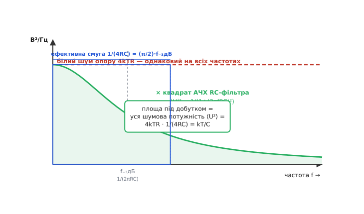
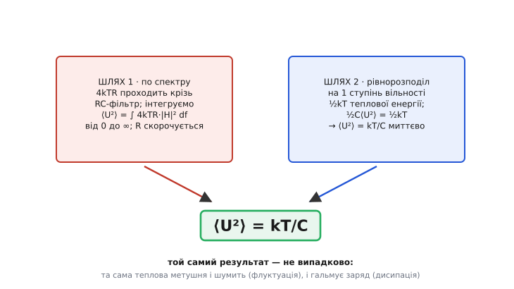

# 🧮 Звідки береться kT/C: два незалежні виведення

> Це математична вставка до теми [kT/C-шум у ланцюгах вибірки](topic:hw-analog/kT-over-C-noise). Там показано на пальцях, чому опір ключа випадає з відповіді: більший R дужче шумить, але рівно настільки ж звужує смугу RC-фільтра. Тут той самий висновок виводиться **до точного коефіцієнта** — і двічі, двома цілком різними дорогами. Перша дорога чесно інтегрує спектр шуму по всіх частотах. Друга не торкається ні частот, ні фільтрів — бере результат із чистої термодинаміки за один рядок. Те, що обидві дають **точно** ⟨U²⟩ = kT/C, — не збіг, і причина цього збігу варта окремої розмови.

Формула √(kT/C) має дивну рису: у ній немає опору, хоча весь шум народжується в опорі. «На пальцях» це пояснюється скороченням двох впливів R. Але скорочення — слово приблизне; воно не каже, чому коефіцієнт виходить рівно одиниця, а не, скажімо, 0.8 чи π/4. Щоб побачити **точне** число, мусимо проінтегрувати спектр як слід. А коли проінтегруємо — виявиться, що до тієї самої відповіді веде ще й зовсім інша стежка, яка про опір та фільтри взагалі не згадує. Дві дороги, один пункт призначення.

### Дорога 1: чесно зінтегрувати спектр

Почнімо з того, що шумить. Опір ключа R — це джерело [теплового шуму](topic:hw-analog/resistor-noise): на його виводах сама собою тремтить випадкова напруга з **рівномірною спектральною щільністю потужності**

```
S_U(f) = 4kTR     [В²/Гц]
```

Слово «спектральна щільність» тут ключове. Це не напруга й навіть не її квадрат — це **квадрат напруги на одиницю смуги частот**. Скільки шумового В² припадає на кожен герц. Величина 4kTR однакова на всіх частотах (тому шум і звуть «білим», за аналогією з білим світлом, де всі кольори рівні), і саме рівномірність робить інтеграл по частотах осмисленим: щоб дістати повну шумову потужність, треба просто додати внески всіх герців — тобто проінтегрувати щільність по f.

> 🔧 **Навіщо це.** Щільність 4kTR — це не «формула шуму резистора», а **сировина** для будь-якого шумового розрахунку. Сама по собі вона нескінченна за повною потужністю (рівна на всіх частотах аж до безмежності). Реальне, скінченне число шуму з'являється лише тоді, коли цю сировину пропустити крізь фільтр зі скінченною смугою — і саме фільтр, а не джерело, вирішує, скільки шуму ви насправді побачите. Тому інженер ніколи не питає «який шум резистора?» без другого питання: «у якій смузі?».

Тепер — фільтр. Опір R разом із ємністю C утворюють однополюсний RC-фільтр низьких частот. Корисний сигнал він пропускає, а високі частоти ріже; те саме він робить і з шумом. Його [передавальна функція](topic:hw-analog/rc-low-pass/math-transfer-function.md) — це H(jω) = 1/(1 + jωRC), а нам для потужності потрібен **квадрат модуля** (бо потужність іде як квадрат напруги):

```
|H(f)|² = 1 / (1 + (2πfRC)²)
```

На постійному струмі (f = 0) це одиниця — фільтр пропускає все. На частоті зрізу f₋₃дБ = 1/(2πRC) знаменник стає 2, тобто потужність падає вдвічі. Вище — спадає як 1/f². Цей квадрат модуля і є вагою, з якою кожна частота шуму доходить до конденсатора.

Повна шумова потужність на ємності — це щільність джерела, помножена на квадрат АЧХ фільтра, проінтегрована по всіх частотах від нуля до безмежності:

```
⟨U²⟩ = ∫₀^∞ S_U(f) · |H(f)|² df = ∫₀^∞ 4kTR / (1 + (2πfRC)²) df
```


*Білий шум опору 4kTR (червона пряма, однакова на всіх частотах) множиться на квадрат АЧХ RC-фільтра (зелена крива). Площа під їхнім добутком — уся шумова потужність ⟨U²⟩. Той самий результат дає прямокутник висотою 4kTR і шириною 1/(4RC): це й є ефективна шумова смуга, у (π/2) раза ширша за частоту зрізу f₋₃дБ.*

Уся стаття тепер зводиться до одного інтеграла. Винесімо сталу 4kTR за знак (вона від частоти не залежить) і займімося тим, що лишилося:

```
⟨U²⟩ = 4kTR · ∫₀^∞ df / (1 + (2πfRC)²)
```

Цей інтеграл — стандартний, і його варто взяти явно, бо саме в ньому ховається точний коефіцієнт. Заведімо підстановку, яка прибере весь мотлох зі знаменника: нехай

```
x = 2πfRC,     тоді   df = dx / (2πRC)
```

Межі лишаються ті самі (при f = 0 маємо x = 0; при f → ∞ маємо x → ∞), а інтеграл стає геть простим:

```
∫₀^∞ df / (1 + (2πfRC)²) = 1/(2πRC) · ∫₀^∞ dx / (1 + x²)
```

А ∫₀^∞ dx/(1 + x²) — один із небагатьох інтегралів, які варто знати напам'ять: це **арктангенс**. Похідна arctan(x) дорівнює саме 1/(1 + x²), тож

```
∫₀^∞ dx/(1 + x²) = arctan(x) |₀^∞ = arctan(∞) − arctan(0) = π/2 − 0 = π/2
```

Ось звідки в задачі береться π. Підставмо назад:

```
∫₀^∞ df / (1 + (2πfRC)²) = 1/(2πRC) · π/2 = 1/(4RC)
```

Зупинімося тут на мить, бо це найважливіший проміжний результат. Інтеграл квадрата АЧХ однополюсного RC-фільтра по всіх частотах дорівнює **1/(4RC)**. Ця величина має ім'я — **ефективна шумова смуга** (*equivalent noise bandwidth*). Її зміст такий: реальний фільтр із плавним спадом пропускає рівно стільки ж білого шуму, скільки пропустив би **ідеальний прямокутний** фільтр шириною 1/(4RC) — той, що до своєї межі пропускає все на повну, а за нею ріже наглухо. Плавний «хвіст» характеристики, що тягнеться у високі частоти, точно еквівалентний доданій смузі прямокутника.

Порівняймо цю ефективну смугу зі звичною частотою зрізу f₋₃дБ = 1/(2πRC):

```
B_шум = 1/(4RC) = (π/2) · 1/(2πRC) = (π/2) · f₋₃дБ ≈ 1.571 · f₋₃дБ
```

Шумова смуга **ширша** за смугу −3 дБ у π/2 раза. Це не описка й не парадокс: точка −3 дБ — лише там, де потужність впала вдвічі, але за нею фільтр пропускає ще чимало шуму, перш ніж остаточно стихнути. Той «хвіст» і додає півтори десятих понад одиницю. Коефіцієнт π/2 для однополюсного фільтра варто запам'ятати — він зринає всюди, де білий шум проходить крізь просте RC.

Лишилося звести докупи. Повертаємо 4kTR на місце:

```
⟨U²⟩ = 4kTR · 1/(4RC) = 4kTR / (4RC)
```

І ось мить, заради якої все робилося. У дробі 4kTR/(4RC) **опір R стоїть і в чисельнику, і в знаменнику** — він скорочується тотожно, не наближено. Четвірки теж гасяться. Лишається:

```
⟨U²⟩ = kT/C
```

Тепер видно, **де саме** випадає опір, і це місце цілком конкретне. R увійшов двічі: один раз — у щільність джерела 4kTR (чисельник), де він додавав шуму; другий раз — у ефективну смугу 1/(4RC) (знаменник), де він шум віднімав, бо більший R звужує смугу фільтра. Ці два входження — той самий R, тому вони скорочуються математично точно. «На пальцях» це звалося «два ефекти гасять один одного»; тут видно, що гасіння — буквальне скорочення одного символу в дробі, і саме воно лишає в коефіцієнті чисту одиницю.

Скорочуються й четвірки: 4 з щільності 4kTR гаситься 4 з ефективної смуги 1/(4RC), і лишається голий kT/C без жодного зайвого множника. Це зручний контроль: якщо виведете щось на кшталт «2kT/C» чи «kT/(2C)», шукайте, де загубили двійку в означенні щільності або смуги.

### Дорога 2: рівнорозподіл за один рядок

Тепер — зовсім інша стежка, і її сила в тому, наскільки вона коротша. Жодних частот, жодних фільтрів, жодних інтегралів. Лише одна з найглибших теорем статистичної фізики — **теорема про рівнорозподіл енергії** (*equipartition theorem*).

> Теорема рівнорозподілу каже: у тепловій рівновазі за температури T на кожен **квадратичний ступінь вільності** системи припадає в середньому однакова порція теплової енергії — рівно ½kT, де k — стала Больцмана. «Квадратичний ступінь вільності» — це будь-який спосіб запасати енергію, що входить у її вираз як квадрат якоїсь змінної (½mv² для руху, ½kx² для пружини, ½CU² для конденсатора). Скільки таких квадратів — стільки порцій ½kT. Це фундамент, на якому стоїть уся класична термодинаміка газів і коливань; докладно — у статті [теорема рівнорозподілу](topic:ph-thermodynamics/equipartition-theorem).

Прикладімо її до конденсатора. Енергія, запасена на ємності C, коли на ній напруга U, дорівнює

```
E = ½ C U²
```

Це **квадратична** форма за напругою U — рівно той вид, до якого теорема й застосовна. Конденсатор у тепловій рівновазі зі своїм оточенням (з опором ключа, з рештою кола за тієї самої температури T) поводиться як один квадратичний ступінь вільності, що запасає енергію в електричному полі. Отже, його середня теплова енергія мусить дорівнювати тій самій універсальній порції ½kT:

```
⟨E⟩ = ½ kT
```

Прирівнюємо два вирази для тієї самої середньої енергії — і все:

```
½ C ⟨U²⟩ = ½ kT
```

Половинки й C переносяться за один крок:

```
⟨U²⟩ = kT/C
```

Це справді один рядок. Конденсатор — це «спосіб запасати енергію», йому належить ½kT теплової енергії за самим фактом перебування при температурі T, енергія на ньому йде як ½CU², — і kT/C випадає миттєво, без жодного інтеграла. Тут немає ні опору (бо ми взагалі не питали, **звідки** взялася теплова рівновага), ні смуги (бо ми не дивилися на частоти), ні навіть згадки про те, що шум «білий». Сама лише термодинаміка рівноваги.

> 🔧 **Навіщо це.** Друга дорога — це найшвидший спосіб згадати формулу й перевірити чужу. Не треба пам'ятати ні 4kTR, ні π/2, ні арктангенса: «½kT на ступінь вільності, енергія ємності ½CU²» — і відповідь складається за секунди в голові. Так само вона миттєво каже, **на що** взагалі впливаєш: у kT/C немає R, бо в енергії ½CU² немає R; немає смуги, бо в термодинаміці рівноваги немає частот. Хто бачить kT/C як «½kT на ємнісному ступені вільності», той одразу знає, що єдина ручка — це C, ще до будь-яких розрахунків.

### Чому обидві дороги ведуть в одне місце

Дві стежки не просто дали однакову відповідь — вони дали її **точно**, до останнього коефіцієнта. Перша пробиралася крізь спектр білого шуму й квадрат АЧХ фільтра, набираючи по дорозі четвірки й π/2, які наприкінці дивовижно скоротилися. Друга про спектр і фільтр навіть не згадала. Якби збіг був випадковий, він тримався б на тонкій ниточці — варто було б десь схибити з коефіцієнтом, і дороги розійшлися б. А вони сходяться точно. Чому?


*Спектральний інтеграл (ліворуч) і теорема рівнорозподілу (праворуч) дають той самий ⟨U²⟩ = kT/C. Це не випадковість: одна й та сама теплова метушня електронів в опорі і породжує шум (флуктуацію), і чинить опір струму (дисипацію). Зв'язок між ними — флуктуаційно-дисипаційна теорема.*

Відповідь у тому, що обидві дороги описують **те саме фізичне явище** з двох боків, і явище це підпорядковане одному глибокому закону природи. Подумаймо, що насправді коїться в опорі. Електрони в ньому безперестанку хаотично метушаться через тепло. Ця сама метушня має два обличчя. Перше: вона створює на виводах опору випадкову напругу — це й є шум, **флуктуація**. Друге: коли крізь опір женуть струм, та сама метушня заважає впорядкованому руху електронів, розсіюючи енергію в тепло, — це **дисипація**, тобто власне опір як такий. Шум і опір — не дві різні властивості, а **два прояви однієї й тієї самої теплової метушні**. Не буває опору без шуму, і не буває цього шуму без опору: вони нерозривні, бо мають спільне джерело.

Саме цей зв'язок і формалізує **флуктуаційно-дисипаційна теорема** (*fluctuation–dissipation theorem*): у будь-якій системі в тепловій рівновазі величина випадкових флуктуацій жорстко прив'язана до того, наскільки система дисипує енергію. Чим сильніше тіло гальмує рух (більша дисипація), тим дужче воно й тремтить (більша флуктуація) — за тієї самої температури коефіцієнт між ними фіксований. Для опору це означає: спектральна щільність його шуму **зобов'язана** дорівнювати 4kTR, де той самий R, що задає дисипацію, задає й величину флуктуації. Формула 4kTR — не окремий експериментальний факт, а **наслідок** того, що опір дисипує.

Тепер видно, чому дві дороги не могли розійтися. Перша дорога стартує з флуктуації (щільність 4kTR) і чесно пропускає її крізь фільтр. Друга стартує з рівноваги (½kT на ступінь вільності). Але флуктуаційно-дисипаційна теорема — це і є міст, що пов'язує флуктуацію 4kTR з тепловою енергією рівноваги ½kT: вона буквально каже, що величина шуму визначена так, **щоб** у рівновазі енергія на конденсаторі вийшла рівно ½kT. Інакше кажучи, коефіцієнт 4 у щільності шуму підібраний самою природою саме так, щоб після інтегрування крізь будь-яке коло отримати термодинамічно правильну енергію. Тому перша дорога **мусила** прийти туди ж, куди друга, — вони не незалежні в глибині, вони дзеркальні відображення одного закону. Скорочення четвірок і поява π/2 в першій дорозі — це не везіння, а та сама флуктуаційно-дисипаційна узгодженість, що проступає крізь алгебру.

Це й робить kT/C таким міцним. Результат не залежить ні від форми кола (будь-яке пасивне коло з ємністю C на виході дасть те саме ⟨U²⟩ = kT/C, хоч би скільки в ньому було резисторів і яких завгодно), ні від способу виведення. Він тримається не на конкретному інтегралі, а на термодинаміці: конденсатор за температури T мусить нести ½kT теплової енергії — і крапка. Будь-яка деталь, яка спробувала б це порушити, порушила б другий закон термодинаміки. Тому щойно ви бачите на схемі заряджену через щось ємність C, ви вже знаєте її шумову енергію з точністю до температури — не рахуючи нічого, лише за фактом, що вона тепла.

Цей урок ширший за kT/C. Усюди, де є дисипація — опір, тертя, в'язкість, втрати, — там **обов'язково** є й супутній тепловий шум, прив'язаний до неї тим самим законом. Не можна збудувати «тихий резистор» чи «безшумний демпфер»: тиша коштувала б порушення термодинаміки. kT/C — лише найчистіший, найнаочніший випадок цього всеосяжного правила, де вся фізика стискається в три літери під коренем.
