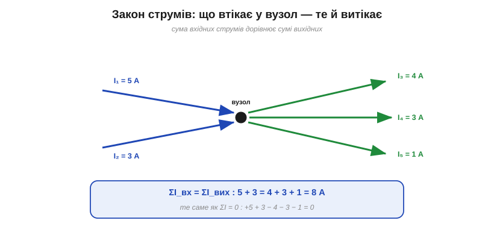
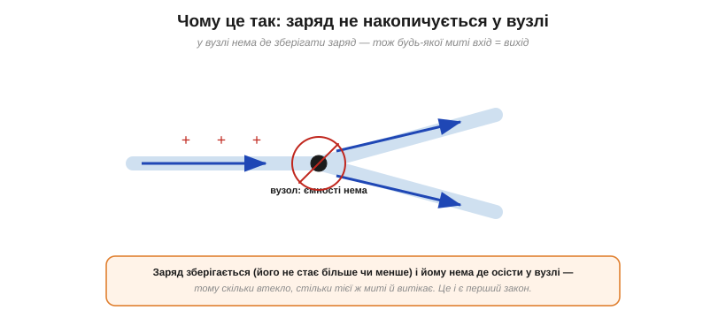
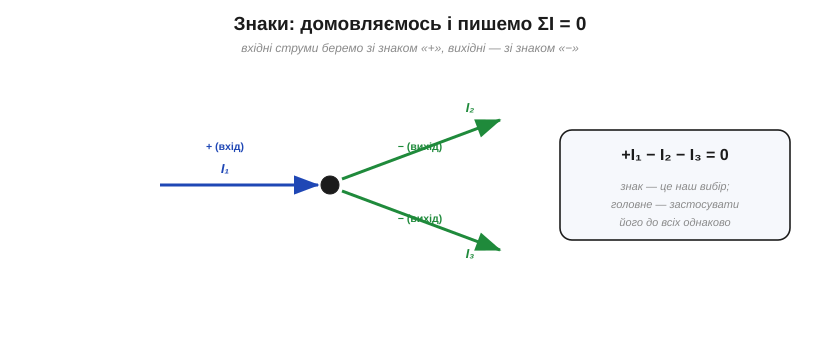
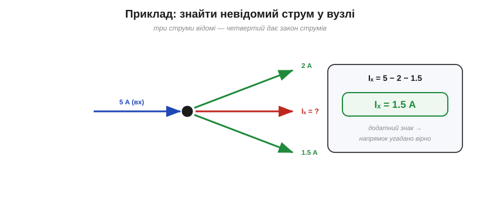
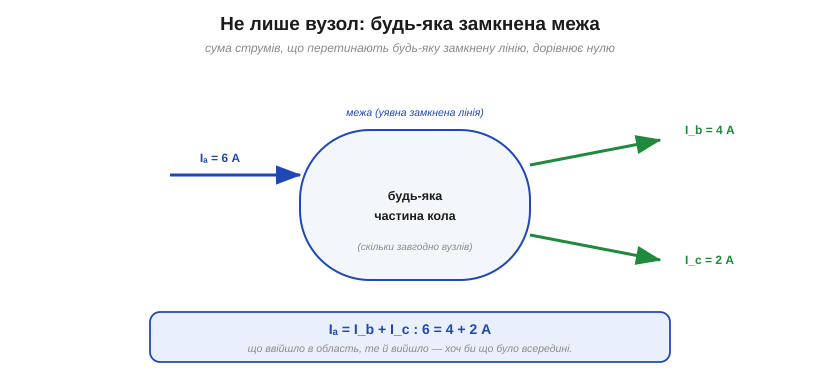

# Закон струмів Кірхгофа (KCL)

Користуючись мовою [вузлів і гілок](root:hw-analog/nodes-branches-loops), розгляньмо один із двох законів Кірхгофа. **Закон струмів Кірхгофа** (*Kirchhoff's Current Law*, KCL) стосується **вузлів** — і він напрочуд простий. У своїй основі це збереження заряду (як саме його сформулював Кірхгоф — в [історії законів](root:hw-analog/nodes-branches-loops/hist-kirchhoff.md)); сформулюймо його чітко й навчімося **застосовувати**.

### Формулювання: ΣI = 0 у вузлі

Закон каже: **сума струмів, що втікають у вузол, дорівнює сумі струмів, що з нього витікають**. Або, ще коротше: алгебрична сума всіх струмів у вузлі дорівнює **нулю**.


*Закон струмів у вузлі: сума вхідних струмів (5 + 3) дорівнює сумі вихідних (4 + 3 + 1) — обидві по 8 А. Те саме можна записати як алгебричну суму всіх струмів, що дорівнює нулю (входи зі знаком +, виходи −).*

Обидва формулювання — те саме. «Вхід = вихід» наочніше, «ΣI = 0» зручніше для рівнянь. Головне, що струм у вузлі **не береться нізвідки й не дівається в нікуди**: усе, що притекло, мусить відтекти.

Аналогія з перехрестям чи водогоном тут точна: скільки машин в'їхало на перехрестя, стільки й виїхало; скільки води влилося в трійник, стільки витекло. Важливо, що в звичайному колі (зосереджені елементи) рівність тримається **щомиті** й **точно** — не «в середньому за час», а в кожен окремий момент, і однаково для постійного та змінного струму. Саме ця непохитність робить закон струмів надійним каркасом для будь-якого аналізу кола.

### Чому: заряд не накопичується

Звідки така залізна певність? З двох простих фактів. По-перше, [**заряд зберігається**](root:ph-electromagnetism/electric-charge) — його не стає ні більше, ні менше. По-друге, у наближенні **зосереджених елементів** (*lumped*) вузол — це просто **точка з'єднання**, де зберігати заряд **нема де** (вона не має ємності). Насправді будь-який реальний вузол має крихітну **паразитну ємність** і на дуже високих частотах може на мить накопичити заряд (там KCL доповнюють струмом зміщення); та для звичайних кіл цим нехтують, і закон тримається точно.


*Чому KCL виконується: заряд зберігається, і у вузлі йому нема де накопичитись (вузол — точка, без ємності). Тому будь-якої миті скільки заряду втікає, стільки ж і витікає.*

Якби в вузол втікало більше, ніж витікає, там **зростав** би заряд — а отже, і потенціал, і поле, що відштовхувало б нові заряди, доки приплив не зрівняється з відпливом. У звичайному колі це вирівнювання миттєве, тож баланс тримається **щомиті**. (Запасати заряд уміє лише спеціальний елемент — [конденсатор](root:hw-components/capacitor); але то вже не вузол, а окремий компонент.)

### Знаки: вхід плюс, вихід мінус

Щоб писати рівняння без плутанини, зручно домовитися про **знаки**. Найпоширеніша угода: струми, що **втікають** у вузол, беремо зі знаком «**+**», а ті, що **витікають**, — зі знаком «**−**». Тоді закон набуває стрункого вигляду **ΣI = 0**.


*Зручний запис: домовляємось брати вхідні струми зі знаком «+», вихідні — зі знаком «−», і пишемо ΣI = 0. Знак — наш вибір; важливо лише застосувати правило до всіх струмів однаково.*

Підкреслимо: який саме напрямок назвати «додатним» — це **наш вибір**, і він ні на що не впливає, доки ми застосовуємо його **послідовно** до всіх струмів. Якщо наприкінці якийсь струм вийде **від'ємним** — нічого страшного: це лише означає, що насправді він тече у зворотний бік, адже [напрямок гілки ми обираємо вільно](root:hw-analog/nodes-branches-loops).

Запишімо для прикладу рівняння вузла з рисунка: вхідний I₁ — додатний, два вихідні I₂ та I₃ — від'ємні, тож +I₁ − I₂ − I₃ = 0, тобто I₁ = I₂ + I₃. Бачите: «алгебрична сума дорівнює нулю» — це лише компактний запис звичного «вхід дорівнює виходу». Обидві форми взаємозамінні; беріть ту, що зручніша в конкретній задачі.

### Приклад: знайти невідомий струм

Найчастіше KCL застосовують так: відомі всі струми у вузлі, крім одного, — і закон одразу дає цей останній.

**Приклад. У вузол втікає 5 А, а витікають 2 А і 1.5 А. Який четвертий струм?**

```
Закон струмів:  ΣI_вх = ΣI_вих
Підставляємо:   5 = 2 + 1.5 + Iₓ
Розв'язуємо:    Iₓ = 5 − 2 − 1.5  = 1.5 А  (витікає)
```


*Якщо три струми у вузлі відомі, четвертий дає закон струмів: Iₓ = 5 − 2 − 1.5 = 1.5 А. Додатний результат підтверджує, що напрямок ми вгадали правильно.*

Відповідь додатна — отже, обраний напрямок (витікає) правильний. Якби вийшло −1.5 А, ми б знали: струм насправді **втікає**. Саме так, по одному невідомому за раз, KCL допомагає «розшити» струми в будь-якому розгалуженні.

Зверніть увагу на межу можливостей: один вузол дає **одне** рівняння, тож знайти ним можна лише **один** невідомий струм. Якщо невідомих більше, рівнянь забракне — і тоді в гру вступлять [закон напруг](root:hw-analog/kvl) та [систематичний метод аналізу кола](root:embedded/circuit-analysis), де рівнянь складають рівно стільки, скільки треба. Але там, де лишилося добити останній струм у розгалуженні, перший закон — найшвидший інструмент у скриньці.

### Не лише вузол: будь-яка замкнена межа

І нарешті — потужне узагальнення, яке дуже спрощує життя. Закон струмів справджується не тільки для точки-вузла, а для **будь-якої замкненої межі**, хоч би що було всередині. Подумки обведіть якусь частину схеми замкненою лінією: **сума струмів, що перетинають цю межу, дорівнює нулю** — що в область увійшло, те з неї й вийшло.


*Потужне узагальнення: закон струмів справджується не лише для точки-вузла, а для будь-якої замкненої межі. Що ввійшло в окреслену область, те з неї й виходить, хоч би скільки вузлів і елементів було всередині.*

Це випливає з того самого збереження заряду: якщо всередині межі заряд не накопичується (а в усталеному колі це так), то сумарний приплив дорівнює сумарному відпливу. Прийом дуже корисний: ціле плетиво вузлів і гілок можна «загорнути» в одну область і миттєво пов'язати струми на її краях, не розбираючись із нутрощами.

Практичний приклад: щоб дізнатися, який струм споживає цілий **модуль** (мікросхема, плата, прилад), не треба знати його внутрішню схему — досить обвести його уявною межею й порахувати струми на провідниках живлення. Скільки втікає по «плюсі», стільки ж витікає по «мінусі» (землі). На цьому й тримаються і бюджет живлення, і вимірювання споживання приладу мультиметром.

### Послідовне коло: той самий струм усюди

Найпростіший, але дуже важливий наслідок KCL: у **послідовному** (нерозгалуженому) колі струм **скрізь однаковий**. Адже кожен внутрішній вузол такого кола має лише один вхід і один вихід, тож закон струмів дає просто I_вх = I_вих — струм не змінюється від елемента до елемента. Це і є строге обґрунтування звичного правила, що [струм не витрачається, а тече однаковим уздовж нерозгалуженого кола](root:ph-electromagnetism/current-continuity): воно виявляється окремим випадком KCL — для кола **без розгалужень**.

> 🔧 **Навіщо це.** KCL — щоденний робочий інструмент. Він каже, як струм **ділиться** в [паралельних вітках](root:hw-analog/parallel-connection): сума струмів гілок дорівнює загальному (на цьому стоїть і [подільник струму](root:hw-analog/current-divider)). Він же — основа діагностики: якщо в якусь точку струм заходить, він **зобов'язаний** кудись вийти; «зайвого» струму не буває. А узагальнення на замкнену межу дозволяє рахувати струм, що входить у цілий блок (модуль, мікросхему, плату), не зазираючи всередину. Питання «куди подівся струм?» завжди має відповідь — і дає її саме перший закон Кірхгофа.

---

Підсумок: **закон струмів** (KCL) — у будь-якому вузлі сума вхідних струмів дорівнює сумі вихідних, або ΣI = 0. Це пряме **збереження заряду**: у вузлі немає де його накопичити. Знаки (вхід +, вихід −) — наша угода; від'ємний результат просто означає зворотний напрямок. Закон дозволяє знаходити невідомий струм у розгалуженні й діє не лише для точки, а для **будь-якої замкненої межі**. Це перший із двох законів Кірхгофа; другий, [закон напруг у контурі](root:hw-analog/kvl), доповнює його правилом для напруг.

---
