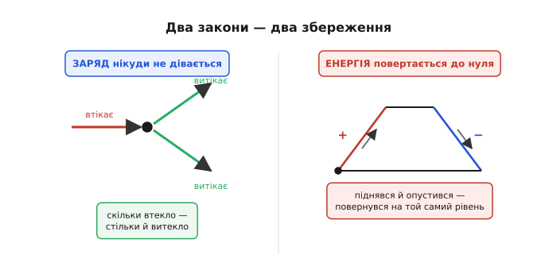
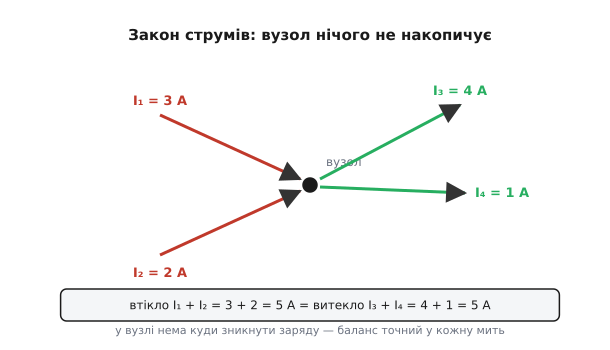
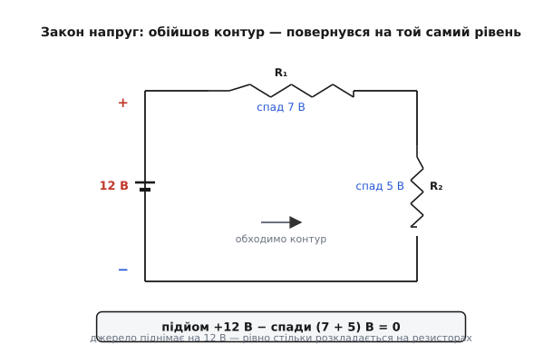
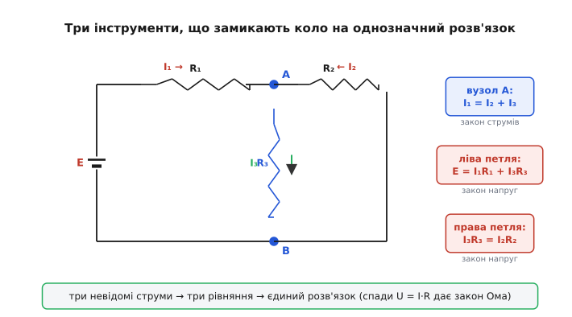

# Закони Кірхгофа

Закон Ома описує **одну** деталь: знаєш опір і напругу на ньому — знаєш струм. Але справжня схема — не одна деталь, а плетиво з десятків резисторів, джерел і гілок, де все пов'язане з усім. Струм у будь-якій вітці залежить від того, що відбувається в усіх інших. Закон Ома сам по собі тут безсилий: він дає рівняння для кожного резистора окремо, але не каже, **як ці рівняння зчепити в одне ціле**. Бракує двох правил, які скажуть, як струми й напруги різних гілок пов'язані між собою в точках з'єднання та вздовж замкнених шляхів.

Ці два правила й дав 1845 року двадцятиоднорічний студент із Кеніґсберга — **Ґустав Кірхгоф**. Вони такі прості, що вміщаються у два короткі речення, і такі могутні, що з них (плюс закон Ома) можна, без жодних винятків, розрахувати **будь-яке** коло з лінійних елементів. Розберімо, на чому вони тримаються, чому інакше бути не може й як ними справді користуються.

> 🔧 **Навіщо це.** Закони Кірхгофа — це не «теорія для іспиту», а той фундамент, на якому стоїть кожен симулятор кіл, кожен ручний розрахунок зміщення транзистора, кожна прикидка «а скільки тут потече струму». Коли ви ставите на схему дільник, рахуєте струм крізь світлодіод чи розумієте, чому просіла напруга на шині живлення під навантаженням, — ви, свідомо чи ні, застосовуєте саме ці два закони. Вони — граматика, якою «розмовляють» усі електричні кола.

## Дві речі, які нікуди не діваються

Обидва закони Кірхгофа — це насправді **закони збереження**, переказані мовою кіл. У природи є дві величини, які в електричному колі не виникають із нічого й не зникають у нікуди: **заряд** і **енергія**. Кожен закон стереже одну з них.

Почнімо з заряду. Уявіть точку, де сходяться кілька дротів, — таку точку звуть [вузлом](root:hw-analog/nodes-branches-loops). Заряд — це фізичні носії (електрони), а провід — не комора: він не може накопичувати заряд усередині себе й не може його народжувати. Тож скільки заряду за секунду **втекло** у вузол усіма дротами, рівно стільки мусить за ту саму секунду **витекти** іншими. Інакше заряд або копичився б у точці без об'єму (а нікуди), або брався б нізвідки. Ні те, ні те неможливе — отже, у вузлі струми сходяться в точний нуль.


*Два закони — два збереження. Ліворуч: вузол не комора, скільки заряду втекло — стільки витекло, тому струми у вузлі балансують. Праворуч: обходячи замкнений контур, заряд піднімається джерелом і опускається на елементах, а повернувшись у вихідну точку, опиняється на тому самому потенціалі — тож сума підйомів дорівнює сумі спадів.*

Тепер енергія. Візьміть будь-який **замкнений** шлях у схемі — [контур](root:hw-analog/nodes-branches-loops), що виходить з якоїсь точки й повертається в неї ж. Напруга між двома точками — це різниця їхніх **потенціалів**, тобто скільки енергії несе одиниця заряду, перебуваючи там. Джерело піднімає цю енергію (заряд «вилазить угору»), резистори її забирають (заряд «з'їжджає вниз», гріючи їх). Але потенціал — однозначна властивість точки: повернувшись у ту саму точку, заряд **зобов'язаний** мати ту саму енергію, що й на старті. А отже, усе, що джерела вздовж контуру додали, резистори (та інші споживачі) рівно стільки й забрали. Сума підйомів дорівнює сумі спадів — обходячи коло, ви завжди повертаєтеся «на той самий рівень».

Ось і весь корінь. Далі — лише акуратні формулювання цих двох очевидностей.

## Закон струмів: вузол нічого не накопичує

[Закон струмів Кірхгофа](root:hw-analog/kcl) (англ. *Kirchhoff's Current Law*, KCL) каже: **алгебраїчна сума струмів у вузлі дорівнює нулю**. «Алгебраїчна» означає, що втікання беремо з одним знаком, а витікання — з протилежним; тоді все, що зайшло, гаситься тим, що вийшло.

```
ΣI = 0   у будь-якому вузлі
```

Зручніше тримати в голові рівнозначне формулювання без знаків:

```
сума струмів, що ВТІКАЮТЬ  =  сума струмів, що ВИТІКАЮТЬ
```


*Закон струмів на числах. У вузол двома гілками втікає 3 А і 2 А — разом 5 А; трьома іншими витікає 4 А і 1 А — теж разом 5 А. Баланс точний у кожну мить: вузол нічого не запасає, тому те, що зайшло, миттєво розходиться рештою гілок.*

Це не «закон про струми взагалі», а правило саме для **точок з'єднання**. Воно діє завжди й миттєво: вузол не має пам'яті й не накопичує — баланс зводиться в кожну мить часу, навіть коли струми пульсують.

> 🔧 **Навіщо це.** Найчастіше KCL застосовують, навіть не називаючи: «струм із батареї розщепився на дві паралельні вітки, а потім зійшовся назад». Саме на цьому стоїть [паралельне з'єднання](root:hw-analog/parallel-connection) — гілки ділять спільний струм. А коли інженер у точці схеми пише «сюди заходить 10 мА, на світлодіод іде 8 мА, значить, у решту відгалуження — рівно 2 мА», він робить просте віднімання, узаконене Кірхгофом.

## Закон напруг: контур повертається на той самий рівень

[Закон напруг Кірхгофа](root:hw-analog/kvl) (англ. *Kirchhoff's Voltage Law*, KVL) каже: **алгебраїчна сума напруг уздовж будь-якого замкненого контуру дорівнює нулю**. Знову «алгебраїчна»: підйоми на джерелах беремо з одним знаком, спади на елементах — з протилежним, і за повний оберт вони взаємно гасяться.

```
ΣU = 0   уздовж будь-якого замкненого контуру
```

Без знаків це звучить так само природно, як і для струмів:

```
сума ПІДЙОМІВ (джерела)  =  сума СПАДІВ (резистори та інші споживачі)
```


*Закон напруг на числах. Джерело піднімає потенціал на 12 В; обходячи контур, заряд віддає 7 В на R₁ і 5 В на R₂ — разом ті самі 12 В. Підйом мінус спади дорівнює нулю: повний оберт повертає заряд на вихідний рівень, бо потенціал точки однозначний.*

Тонкість, через яку KVL легко наплутати, — **знаки**. Той самий резистор у рівнянні буде «плюс» чи «мінус» залежно від того, у який бік ви обходите контур і куди тече струм. Лікується це одним залізним прийомом: оберіть напрям обходу (хоч за годинниковою стрілкою), ідіть ним і послідовно ставте знаки — підйом, коли заряд «лізе вгору» (входимо в джерело з мінуса в плюс), спад, коли «з'їжджає вниз». Аби напрям обходу був один на весь контур — результат вийде правильний.

> 🔧 **Навіщо це.** KVL — це душа [дільника напруги](root:hw-analog/voltage-divider): живлення розкладається між послідовними резисторами рівно в стільки, скільки на кожному «спадає», а сума спадів дорівнює вхідній напрузі. Він же пояснює, чому під навантаженням просідає шина живлення: струм, потягнутий навантаженням, дає спад на [внутрішньому опорі](root:hw-analog/internal-resistance) джерела та опорі дротів, і за KVL цей спад відбирається від напруги, що доходить до споживача.

## Як два закони з Омом замикають коло

Поодинці кожен закон — лише половина справи. KCL пов'язує струми, що сходяться, але мовчить про напруги. KVL пов'язує напруги вздовж контуру, але мовчить про струми. Третій гравець — [закон Ома](root:hw-analog/ohms-law) `U = I·R` — переводить одне в інше: він каже, яку напругу дасть струм на кожному резисторі. Разом ці троє утворюють замкнену систему, де невідомих рівно стільки, скільки й рівнянь, — а отже, розв'язок існує й він єдиний.

Логіка проста до краси. Кожна невідома — це струм у якійсь гілці. KCL у вузлах і KVL у контурах дають рівняння, які цих невідомих пов'язують; закон Ома підставляє в рівняння KVL спади `I·R` замість незалежних напруг. Виходить система лінійних рівнянь — і її розв'язання дає всі струми, а далі (знов через Ом) і всі напруги.


*Три інструменти, що замикають коло на однозначний розв'язок. Схема з двома контурами й спільною гілкою має три невідомі струми. Закон струмів у вузлі A дає одне рівняння (I₁ = I₂ + I₃); закон напруг для лівого й правого контуру — ще два, причому спади в них записані як I·R за законом Ома. Три рівняння на три невідомі — розв'язок єдиний.*

Доведімо це на конкретному колі. Хай джерело E = 12 В живить два резистори R₁ = 1 кОм і R₂ = 2 кОм, з'єднані **послідовно** в одну петлю. Невідомий струм один (петля одна), тож вистачить самого KVL і Ома:

**Worked-приклад: струм у послідовній петлі.** Обходимо єдиний контур, прирівнюємо підйом джерела до суми спадів:

```
KVL:   E = I·R₁ + I·R₂
       12 = I·(1000 + 2000)
       12 = I·3000
       I  = 12 / 3000 = 0.004 А = 4 мА
```

Тепер напруги на кожному резисторі — простим Омом:

```
U₁ = I·R₁ = 0.004 · 1000 = 4 В
U₂ = I·R₂ = 0.004 · 2000 = 8 В
перевірка KVL:  U₁ + U₂ = 4 + 8 = 12 В = E   ✓
```

Сума спадів зійшлася з напругою джерела — коло замкнулося само на себе, і це знак, що розв'язок правильний. Ось той самий розрахунок у коді — рівно та логіка, яку зручно тримати під рукою для будь-якої послідовної петлі:

:::tabs
```cpp
// Струм і спади в простій послідовній петлі з одним джерелом.
// За KVL: E = I·(R1+R2); за Омом: U = I·R. Усе у вольтах, омах, амперах.
struct Loop { float I, U1, U2; };

Loop series_loop(float E, float R1, float R2)
{
    float I  = E / (R1 + R2);   // KVL дає єдиний струм петлі
    float U1 = I * R1;          // закон Ома: спад на R1
    float U2 = I * R2;          // закон Ома: спад на R2
    // інваріант: U1 + U2 має дорівнювати E (контроль KVL)
    return { I, U1, U2 };
}
// auto r = series_loop(12.0f, 1000.0f, 2000.0f); -> r.I=4 мА, U1=4 В, U2=8 В
```
```c
// Струм і спади в простій послідовній петлі з одним джерелом.
// За KVL: E = I·(R1+R2); за Омом: U = I·R. Усе у вольтах, омах, амперах.
void series_loop(float E, float R1, float R2,
                 float *I, float *U1, float *U2)
{
    *I  = E / (R1 + R2);   // KVL дає єдиний струм петлі
    *U1 = *I * R1;         // закон Ома: спад на R1
    *U2 = *I * R2;         // закон Ома: спад на R2
    // інваріант: *U1 + *U2 має дорівнювати E (контроль KVL)
}
// series_loop(12.0f, 1000.0f, 2000.0f, …) -> I=4 мА, U1=4 В, U2=8 В
```
```python
# Струм і спади в простій послідовній петлі з одним джерелом.
# За KVL: E = I·(R1+R2); за Омом: U = I·R. Усе у вольтах, омах, амперах.
def series_loop(E, R1, R2):
    I  = E / (R1 + R2)   # KVL дає єдиний струм петлі
    U1 = I * R1          # закон Ома: спад на R1
    U2 = I * R2          # закон Ома: спад на R2
    # інваріант: U1 + U2 має дорівнювати E (контроль KVL)
    return I, U1, U2
# series_loop(12, 1000, 2000) -> I=4 мА, U1=4 В, U2=8 В
```
:::

Коли контурів стає більше, як на схемі вище, схема рішення та сама — лише рівнянь більше. Для кола з кількома незалежними петлями записують повну систему: по одному рівнянню KCL на кожен незалежний вузол і по одному KVL на кожен незалежний контур, з підставленими `I·R`. Як саме скласти таку систему так, щоб рівнянь було рівно стільки, скільки невідомих, — ні забагато, ні замало — і довести її до числа, показано в [систематичному методі гілкових струмів](root:hw-analog/branch-current-method): покрокова рецептура від схеми до розв'язаної системи з робочим прикладом.

## Чим закони не є: межі застосування

Поважати інструмент — означає знати, де він перестає працювати. У законів Кірхгофа є чітка межа, і нехтування нею — джерело прихованих помилок.

Обидва закони — це **наближення зосереджених кіл** (англ. *lumped-element model*): вони припускають, що струм у вузол приходить тієї самої миті, що й виходить, а напруга вздовж дроту встановлюється миттєво. Насправді сигнал біжить дротом зі скінченною швидкістю (близькою до швидкості світла), тож на дуже високих частотах або на дуже довгих лініях «той самий момент» перестає бути тим самим: поки сигнал добіг до кінця проводу, на його початку напруга вже змінилася. Коли довжина провідника стає сумірною з довжиною хвилі сигналу, наївне «ΣI = 0 у вузлі» вже не діє, і коло доводиться описувати як лінію передавання з розподіленими параметрами. Для типової електроніки — навіть на мегагерцах і на платі завдовжки в долоню — ця межа далеко, і закони Кірхгофа працюють бездоганно; пам'ятати про неї треба лише на радіочастотах і у швидкісній цифровій техніці.

І ще одне уточнення, важливе для строгості. KVL у формі «сума напруг по контуру дорівнює нулю» спирається на те, що напруга — однозначна функція точки. Це справедливо, доки немає **змінного магнітного поля**, що пронизує контур: таке поле наводить у контурі електрорушійну силу (це закон електромагнітної індукції), і тоді обхід контуру дає не нуль, а саме цю наведену ЕРС. На практиці її просто враховують як ще одне «джерело» в контурі — наприклад, так працює будь-який трансформатор, — і KVL знову сходиться. Тож закон не порушується, його лише чесно доповнюють тим, що поле теж рухає заряди.

## Що варто винести

Уся теорія кіл на постійному й повільно змінному струмі тримається на трьох стовпах, і два з них — закони Кірхгофа. Закон струмів стереже **заряд**: у вузлі скільки втекло, стільки й витекло. Закон напруг стереже **енергію**: обійшовши замкнений контур, повертаєшся на той самий потенціал, тож підйоми джерел дорівнюють спадам на елементах. Третій стовп — закон Ома — зчіплює струми з напругами на кожному резисторі. Разом вони перетворюють будь-яке плетиво дротів на систему рівнянь, що має єдиний розв'язок, — і саме цю систему під капотом розв'язує кожен симулятор і кожен інженер, який бере в руки олівець.
