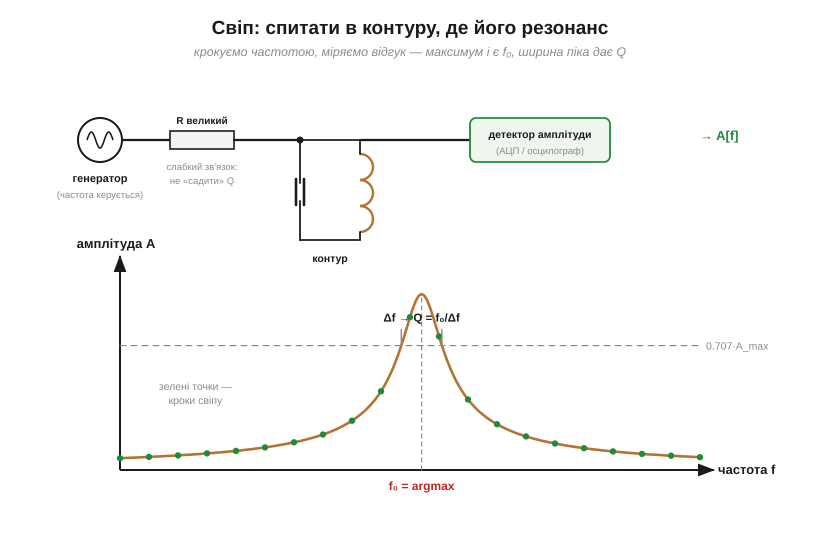
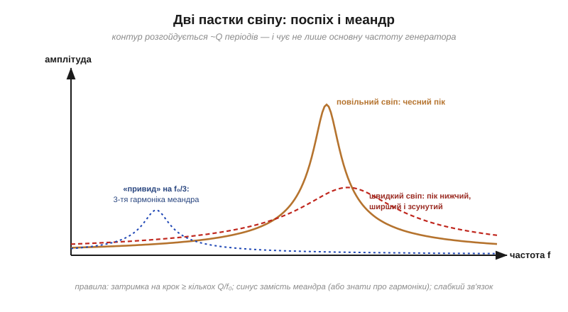

# ⚙️ Знайти резонанс свіпом: генератор, вимірювання амплітуди, пошук максимуму

> Це алгоритмічна вставка до теми [«LC-резонанс»](root:hw-analog/lc-resonance). Формула Томсона каже, де резонанс *має бути*; реальний контур із паразитними ємностями, насиченням і розкидом номіналів відгукується трохи інакше. Найчесніший спосіб дізнатися правду — спитати в самого контуру: пройтися частотою і подивитися, де відгук найбільший. Цей прийом зветься **свіпом** (*frequency sweep*) і працює для будь-чого резонансного — від LC-контуру до антени.

### Задача

Дано: досліджуваний контур (чи інший резонатор), генератор сигналу з керованою частотою (підійде й вивід мікроконтролера з таймером) і вимірювач амплітуди — АЦП із детектором або осцилограф. Знайти справжні f₀ і Q.

### Ідея

Крокувати частоту від f_min до f_max; на кожному кроці дати контуру **встановитися**, виміряти амплітуду відгуку, записати. Максимум кривої — f₀; ширина піка на рівні 0.707 від максимуму — смуга Δf, з якої [Q = f₀/Δf](root:hw-analog/quality-factor).


*Генератор під'єднано до контуру слабко — через великий резистор, щоб не «садити» добротність; детектор знімає амплітуду. Унизу — результат: кожна зелена точка — один крок свіпу; максимум дає f₀, ширина на 0.707·A_max — добротність.*

### Реалізація

Свіпом зазвичай керує мікроконтролер, тож код — на C. Три функції — виставити частоту, почекати, зняти відлік — залежать від плати, тож винесені в апаратну абстракцію; решта від заліза не залежить.

```c
#include <stdint.h>

// --- Апаратна абстракція (реалізується під конкретну плату) ---
void     gen_set_freq(float hz);   // виставити частоту генератора
void     delay_ms(uint32_t ms);    // пауза, мілісекунди
uint16_t adc_read(void);           // один відлік детектора амплітуди

// Усереднити кілька відліків детектора — дешева страховка від шуму.
static float measure_amplitude(uint8_t averages) {
    uint32_t acc = 0;
    for (uint8_t i = 0; i < averages; ++i)
        acc += adc_read();
    return (float)acc / averages;
}

// Один прохід свіпу: заповнити freq[]/amp[], повернути кількість точок.
static int sweep(float f_min, float f_max, float f_step, float q_guess,
                 float *freq, float *amp, int max_pts) {
    int steps = (int)((f_max - f_min) / f_step) + 1;
    if (steps > max_pts) steps = max_pts;

    for (int i = 0; i < steps; ++i) {
        float f = f_min + i * f_step;
        gen_set_freq(f);

        // Контур розгойдується ~Q періодів — чекаємо кілька Q/f із запасом.
        uint32_t settle_ms = (uint32_t)(3.0f * q_guess / f * 1000.0f + 0.5f);
        delay_ms(settle_ms);

        freq[i] = f;
        amp[i]  = measure_amplitude(8);   // 8 відліків на точку
    }
    return steps;
}

// За готовими масивами: пік дає f0, смуга на рівні 0.707·max дає Q.
static void find_resonance(const float *freq, const float *amp, int n,
                           float *f0, float *q) {
    int peak = 0;
    for (int i = 1; i < n; ++i)
        if (amp[i] > amp[peak]) peak = i;
    *f0 = freq[peak];

    float half = 0.70710678f * amp[peak];   // 1/√2 від максимуму

    // Ліва межа смуги: від піка вліво до падіння нижче half,
    // уточнити частоту лінійною інтерполяцією між сусідніми точками.
    float f_lo = freq[0];
    for (int i = peak; i > 0; --i)
        if (amp[i - 1] < half) {
            float t = (half - amp[i - 1]) / (amp[i] - amp[i - 1]);
            f_lo = freq[i - 1] + t * (freq[i] - freq[i - 1]);
            break;
        }

    // Права межа — симетрично, від піка вправо.
    float f_hi = freq[n - 1];
    for (int i = peak; i < n - 1; ++i)
        if (amp[i + 1] < half) {
            float t = (half - amp[i + 1]) / (amp[i] - amp[i + 1]);
            f_hi = freq[i + 1] + t * (freq[i] - freq[i + 1]);
            break;
        }

    *q = *f0 / (f_hi - f_lo);   // Q = f0 / Δf
}

// Повний вимір: грубий прохід по діапазону, тоді тонкий навколо горба.
void find_lc_resonance(float f_min, float f_max, float q_guess,
                       float *f0, float *q) {
    float freq[64], amp[64];

    // Грубо: рідка сітка на весь діапазон (~30 точок).
    float coarse_step = (f_max - f_min) / 30.0f;
    int n = sweep(f_min, f_max, coarse_step, q_guess, freq, amp, 64);
    find_resonance(freq, amp, n, f0, q);

    // Тонко: вузьке вікно ±2·Δf навколо f0, крок ≤ Δf/5.
    float bw = *f0 / *q;
    n = sweep(*f0 - 2.0f * bw, *f0 + 2.0f * bw, bw / 5.0f, q_guess,
              freq, amp, 64);
    find_resonance(freq, amp, n, f0, q);
}
```

Складність — O(N) вимірювань. Економна стратегія — **два проходи**: грубий свіп рідкою сіткою по всьому діапазону, далі тонкий — вузько навколо знайденого горба.

### Головна пастка: час встановлення

Контур із добротністю Q розгойдується (і заспокоюється) приблизно **Q періодів** — це прямий наслідок [енергетичного означення Q](root:hw-analog/quality-factor/math-q-factor.md). Якщо свіпати швидше, контур просто не встигає відгукнутися на повну: пік виходить **нижчим, ширшим і зсунутим** у бік руху свіпу. Що добротніший об'єкт, то повільніше треба йти — фундаментальна плата за гострий резонанс, та сама пара «час ↔ частота».


*Суцільна крива — чесний пік повільного свіпу. Штрихова червона — той самий контур, свіпнутий поспіхом: пік занижений і зсунутий. Синій «привид» на f₀/3 — слід третьої гармоніки, якщо генератором служить меандр.*

**Приклад (план свіпу).** Контур з [вставки про Томсона](root:hw-analog/lc-resonance/math-thomson-formula.md): 10 мГн + 10 мкФ, очікувано f₀ ≈ 503 Гц, Q ≈ 30:

```
T_встан ≈ 3·Q/f₀ = 3·30/503 ≈ 0.18 с на крок
грубий свіп: 250–1000 Гц кроком 25 Гц = 30 точок ≈ 6 с
тонкий свіп: ±40 Гц навколо горба кроком 2 Гц
```

Крок тонкого проходу беруть не більшим за Δf/5 (тут Δf = f₀/Q ≈ 17 Гц → крок 2–3 Гц), щоб на пік припало кілька точок.

### Як міряти амплітуду без осцилографа

Найпростіше — **піковий детектор**: [діод плюс конденсатор](root:hw-power/rectification) перетворюють змінний відгук на повільну постійну напругу «висотою з пік», яку спокійно читає АЦП. Альтернатива — семплити швидко й брати розмах (max − min) за кілька періодів. Обидва способи дають саме те, що потрібно алгоритму, — одне число «наскільки сильно дзвенить».

### Пастки

- **Свіп без затримки** — головна, розібрана вище.
- **Засильний сигнал.** Великий розмах на [котушці з осердям](root:hw-components/inductor-types) підмагнічує його: L «пливе» з амплітудою, і f₀ їде разом із нею. Міряти на малому сигналі.
- **Тісний зв'язок.** Генератор із низьким внутрішнім опором, увімкнений прямо в контур, демпфує його — виміряєте Q з'єднання, а не контуру. Під'єднуйтеся слабко: великий резистор або крихітна ємність. Те саме стосується вимірювача: щуп — це теж [ємність](root:hw-components/capacitor), і вона детюнить контур.
- **Меандр замість синуса.** Прямокутник частоти f містить і 3f, 5f… ([несинусоїдні форми — суміші синусоїд](root:hw-components/phase-shift/math-sine-derivative.md)). Коли третя гармоніка влучає в f₀, на графіку виростає «привид» на f₀/3. Або беріть синус, або знайте своїх привидів в обличчя.
- **Шум.** Кілька вимірів на точку з усередненням — дешева страховка.

### Де ще працює

Цей самий цикл «частота → відгук → максимум» налаштовує [антени](root:com-medium/resonance-dipole), перевіряє п'єзорезонатори, підстроює бездротову зарядку і взагалі знімає будь-яку [частотну характеристику](root:hw-analog/frequency-response) — для роботи з фільтрами свіп стає головним вимірювальним інструментом. А пара «гострий пік ↔ повільне вимірювання» — ще один прояв зв'язку часу й частоти, який тепер можна і рахувати, і обходити.
