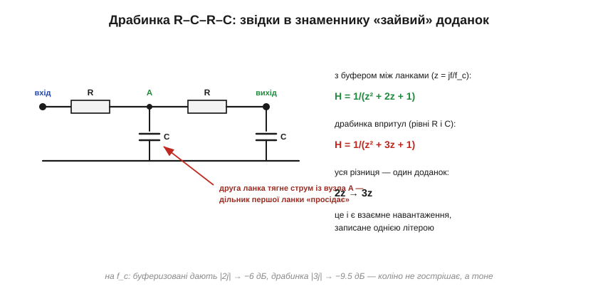
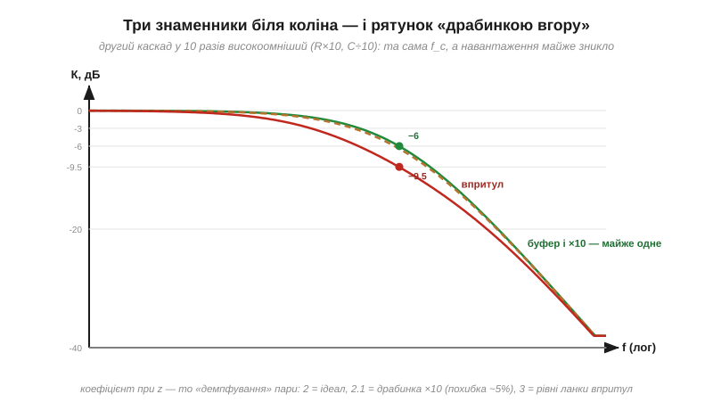

# 🧮 Каскадування фільтрів: чому два RC впритул — не «двічі один RC»

> Коли два RC-фільтри ([фільтр нижніх частот](topic:hw-analog/rc-low-pass)) з'єднати напряму, вони поводяться гірше, ніж «один RC у квадраті». Порахуймо це чесно — мовою [передавальної функції H](topic:hw-analog/rc-low-pass/math-transfer-function.md): взаємне навантаження виявиться одним-єдиним доданком у знаменнику, зріз драбинки з'їде аж до 0.37·f_c, а просте правило наприкінці покаже, як каскадувати без буфера й майже без втрат.

### Еталон: дві незалежні ланки

Якщо між ланками стоїть [буфер на повторювачі напруги](topic:hw-analog/voltage-follower), передавальні функції просто перемножуються. Позначимо z = jf/f_c (нормована частота, як у [вставці про H](topic:hw-analog/rc-low-pass/math-transfer-function.md)):

```
H_буф = 1/(1+z) · 1/(1+z) = 1/(z² + 2z + 1)
```

На f_c (z = j) знаменник дорівнює j² + 2j + 1 = 2j: передача 1/2 — це **−6 дБ** ([смуга й рівень −3 дБ](topic:hw-analog/bandwidth-3db)), а сумарна точка −3 дБ сидить на 0.64·f_c.

### Драбинка впритул: рахуємо чесно

Тепер приберемо буфер: R–C–R–C одним ланцюжком. Друга ланка тягне струм із вихідного вузла першої — той самий «дільник під навантаженням», що й у [RC-фільтрі нижніх частот](topic:hw-analog/rc-low-pass), лише тепер навантаження саме частотозалежне. Акуратний підрахунок дільника двічі поспіль (з паралельним з'єднанням C першої ланки і входу другої) дає несподівано охайний результат:


*Уся фізика взаємного навантаження вмістилась в один доданок знаменника: 2z виросло до 3z. Третя «z» — це струм, який друга ланка відсмоктує з вузла A.*

```
H_впритул = 1/(z² + 3z + 1)
```

Порівняйте знаменники: z² + **2**z + 1 проти z² + **3**z + 1. Квадратний член той самий — далекий спад в обох випадках чесні −40 дБ/дек: удалині, де z² гігантський, доданки z уже неважливі. Уся драма — **біля коліна**, де z² ще малий і середній доданок керує:

- на f_c: |3j| = 3 → **−9.5 дБ** замість −6;
- точка −3 дБ: розв'язок (1−x²)² + 9x² = 2 дає x ≈ **0.37** — зріз з'їхав майже вдвічі нижче, ніж у буферизованої пари (0.64), і втричі нижче за одиночний RC.

### Погляд через добротність

Характер коліна другого порядку задає демпфування. Запишемо знаменники в канонічній формі z² + z/Q + 1 — і коефіцієнт при z виявиться просто **1/Q**:

```
з буфером:   2z   →  Q = 0.50
впритул:     3z   →  Q = 0.33
LC-ланка:    z/Q  →  Q — яка завгодно (хоч 10)
```

Звідси два важливі висновки одним поглядом. Перший: пасивні RC-каскади **завжди передемпфовані** (Q ≤ 0.5, а впритул — ще менше): жодного піка, жодного дзвону, лише дедалі м'якше коліно. Це і відповідь, чому з самих лише RC не зібрати гострий фільтр — максимально плоске коліно Баттерворта вимагає Q ≈ 0.707, недосяжного для RC-драбинки. Другий: котушка в [LC-ланці](topic:hw-analog/lc-rlc-filters) потрібна саме за цим — вона дозволяє підняти Q до потрібного.

### Рятунок без буфера: драбинка вгору

Буфер — найчистіше рішення, але є і пасивний рецепт: зробити другу ланку **високоомнішою**, щоб вона майже не тягла струму з першої. Збільшимо її R удесятеро і зменшимо C удесятеро — f_c не зміниться (добуток RC той самий!), а навантаження полегшає в десять разів. Чесний перерахунок драбинки 1×R/C → 10×R, C/10 дає:

```
H_×10 = 1/(z² + 2.1z + 1)
```


*Коефіцієнт при z — діагноз каскадування: 2 — ідеал із буфером, 2.1 — драбинка з десятикратним масштабуванням (крива практично лягає на еталон), 3 — рівні ланки впритул. Далекий спад у всіх трьох однаковий; різниться лише коліно.*

Коефіцієнт 2.1 проти ідеальних 2.0 — похибка близько п'яти відсотків, на око на графіку її вже не видно. Звідси робоче правило: **кожна наступна пасивна ланка — приблизно вдесятеро високоомніша за попередню** (наприклад, 1 кОм + 159 нФ, далі 10 кОм + 15.9 нФ). Платня — зростання опору: третя ланка вже 100 кОм, і на ній починають важити вхідні струми та наведення; саме тому довгі пасивні драбинки в практиці рідкість, а з'являється буфер або готовий активний фільтр.

### Де це працює

Цей розрахунок — найпростіший приклад загального явища: **з'єднання змінює характеристики з'єднаного**. Та сама логіка працює, коли щуп навантажує вимірюване коло, коли вихідний опір датчика «псує» вхідний фільтр АЦП, і коли ланки [LC-фільтра](topic:hw-analog/lc-rlc-filters) проєктують разом, а не стосом незалежних ланок. А правило «вгору по опорах» ви впізнаєте в готових схемах: у багатоланкових RC-фільтрах живлення й зміщення номінали майже завжди ростуть по ходу сигналу — тепер ви знаєте, що це не примха, а ті самі 2.1 проти 3 у знаменнику.
