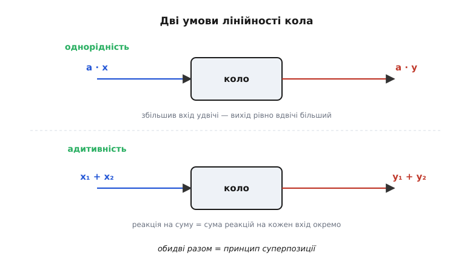
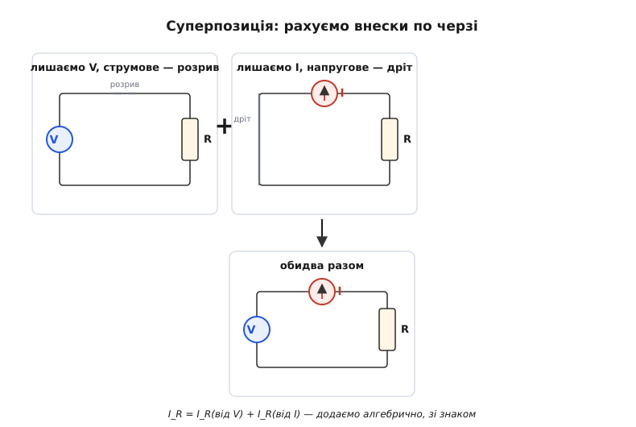
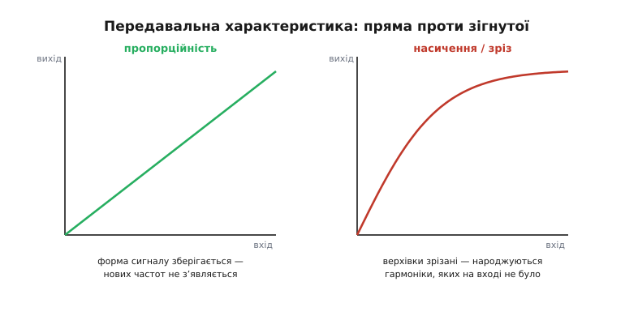

# Лінійність кола

Якщо вибрати одне слово, яке найбільше полегшує життя інженерові-аналоговику, це буде **лінійність** (лат. *linea* — лінія, пряма). Не тому, що лінійні кола найточніше описують природу — насправді жоден реальний компонент не лінійний до кінця. А тому, що лінійне коло **можна розкласти на частини, порахувати кожну окремо й скласти результати** — і відповідь буде правильна. Це звучить буденно, поки не усвідомиш: у природі так майже ніщо не поводиться. Підсиль звук удвічі — і вухо чує не зовсім удвічі гучніше. Натисни на педаль удвічі сильніше — і машина не поїде рівно вдвічі швидше. А ось напруга й струм у колі з резисторів, конденсаторів і котушок підкоряються цьому простому правилу майже ідеально. І весь могутній апарат теорії кіл — суперпозиція, еквівалентні джерела, перетворення Лапласа, частотні характеристики — стоїть рівно на цій одній властивості.

Тож варто розібратися дуже точно: що означає «коло лінійне», звідки ця властивість береться, що вона дає на практиці й де ламається.

## Дві умови, не одна

Інтуїтивно «лінійне» хочеться прирівняти до «прямого графіка»: вихід проти входу — пряма лінія. Це майже правильно, але є тонкість, яку легко проґавити, і вона коштує помилок. Лінійність — це **дві окремі вимоги**, і коло має задовольняти **обидві**.

Перша — **однорідність** (англ. *homogeneity*, від гр. *homós* — однаковий, *génos* — рід): якщо помножити вхід на якесь число, вихід множиться на те саме число. Подав сигнал удвічі більший — отримав відгук удвічі більший. У десять разів менший вхід — у десять разів менший вихід. Знак теж зберігається: змінив полярність входу — змінилася полярність виходу.

Друга — **адитивність** (лат. *additivus* — той, що додається): реакція на суму двох входів дорівнює сумі реакцій на кожен вхід окремо. Подай сигнал A — заміряй відгук. Подай сигнал B — заміряй відгук. А тепер подай A і B разом: відгук буде точно сумою цих двох окремих відгуків, нічого більше й нічого менше.



*Дві окремі умови лінійності. Зверху — однорідність: коефіцієнт a на вході виходить таким самим на виході. Знизу — адитивність: коло, що бачить суму двох сигналів, відповідає сумою двох окремих реакцій.*

Чому неодмінно обидві? Бо існують поведінки, що проходять одну перевірку й провалюють іншу. Уяви коло, чий вихід — це вхід **плюс стала напруга зміщення**, скажімо +1 В завжди. Подвоїв вхід — вихід не подвоївся (бо до подвоєного входу все одно додається той самий +1 В, а не +2 В): однорідності немає. І сума теж не сходиться: реакція на A+B матиме одне зміщення +1 В, а сума двох окремих реакцій принесе +1 В двічі. Така характеристика — пряма лінія на графіку, але вона **не проходить через нуль**, і коло не лінійне в строгому сенсі. Інженери звуть таке **афінним** (лат. *affinis* — суміжний) і кажуть «лінійне зі зсувом», та для теорем суперпозиції це вже не те саме — постійну складову доводиться віднімати окремо.

> 🔧 **Навіщо це.** Підсилювач із напругою зміщення на виході (а вона є завжди — це неідеальність будь-якого операційного підсилювача) — формально не лінійний пристрій. На практиці його розглядають як лінійне коло **плюс** окреме джерело сталого зміщення, і ці дві частини рахують нарізно. Саме тому в паспортах ОП «вхідна напруга зсуву» (offset voltage) стоїть окремим рядком від коефіцієнта підсилення: підсилення — про лінійну частину, зсув — про ту сталу добавку, яку лінійність не описує.

Дві умови разом утворюють те, що зветься **принципом суперпозиції** (лат. *super* — над, *positio* — покладання): накладання. Це серце всього. Якщо однорідність і адитивність виконуються, то будь-який вхід можна розбити на скільки завгодно складових, порахувати реакцію на кожну окремо й просто скласти — у будь-якому порядку, у будь-якій комбінації. Те, що принцип суперпозиції першим чітко сформулював для електричних кіл Герман фон Гельмгольц у 1853 році, а інженерну форму «еквівалентного джерела» дав французький телеграфіст Леон Тевенен, — окрема [історія народження цих ідей](topic:hw-analog/linear-circuit/hist-superposition.md).

## Що означає лінійність *кола* конкретно

Загальне правило про входи й виходи стає відчутним, коли назвати, що тут вхід, а що вихід. У теорії кіл **входи — це джерела** (напруги й струму), а **виходи — це напруги на вузлах і струми в гілках**, які нас цікавлять.

Звідки взагалі береться лінійність у залізі? Із того, що **означальні рівняння ідеальних пасивних елементів самі лінійні**. Резистор: струм пропорційний напрузі, u = R·i — пряма пропорційність, коефіцієнт R сталий. Конденсатор: струм пропорційний **швидкості зміни** напруги, i = C·(du/dt) — похідна теж лінійна операція (похідна суми = сума похідних, похідна від подвоєного = подвоєна похідна). Котушка: напруга пропорційна швидкості зміни струму, u = L·(di/dt) — те саме. Складемо коло з таких елементів і застосуємо закони Кірхгофа (сума струмів у вузлі — нуль; сума напруг уздовж контуру — нуль) — а ці закони теж лінійні, бо це просто додавання. У підсумку все коло описується системою **лінійних** рівнянь (алгебричних для резисторів, диференціальних, коли є C і L). А лінійні рівняння й дають суперпозицію — це не випадковість, а пряме її математичне джерело. [Чому з лінійних означальних рівнянь випливає суперпозиція](topic:hw-analog/linear-circuit/math-superposition.md) — це варто розписати окремо, з означеннями та виведенням.

Сталість коефіцієнтів — ключова. R, L, C мають **не залежати від сигналу**. Якщо опір росте, коли через нього йде більший струм (а він росте — резистор гріється), то R уже не стала, і пропорційність u = R·i ламається: подвоївши струм, ти більш ніж подвоїш напругу. Поки нагрів мізерний, ним нехтують і вважають коло лінійним. Це типова ситуація: **лінійність — не абсолют, а добре наближення в робочому діапазоні**.

> 🔧 **Навіщо це.** Коли проєктувальник пише «цей вузол лінійний до 2 В розмаху, далі насичується», він окреслює діапазон, у якому дозволено застосовувати весь зручний апарат: коефіцієнт підсилення стабільний, форма сигналу не спотворюється, можна користуватися частотною характеристикою. Вийшов за межу — і всі ці інструменти брешуть, бо коло там уже не лінійне.

## Суперпозиція як робочий метод

Найпряміший плід лінійності — **метод суперпозиції** для розрахунку кіл із кількома джерелами. Замість того щоб розв'язувати громіздку систему з усіма джерелами одразу, рахують внесок кожного джерела **поодинці**, а тоді складають.

Правило вимикання джерел випливає просто з їхньої суті. Щоб «вимкнути» **джерело напруги**, його заміняють **дротом** (коротким замиканням): ідеальне джерело напруги тримає на собі задану напругу, а «нуль вольт» — це і є просто провідник. Щоб вимкнути **джерело струму**, на його місці лишають **розрив**: ідеальне джерело струму проганяє заданий струм, а «нуль ампер» — це відсутність шляху, тобто обрив.



*Розрахунок струму в навантаженні R за суперпозицією. Спершу працює лише джерело напруги (струмове замінене розривом), потім лише джерело струму (напругове замкнене дротом). Шуканий струм — алгебрична сума двох внесків.*

**Струм у навантаженні за суперпозицією.** Хай маємо коло: джерело 12 В через резистор 2 кОм живить навантаження 1 кОм, і паралельно навантаженню підключене джерело струму 3 мА. Знайдемо струм у навантаженні.

```text
Внесок джерела напруги (струмове → розрив):
  струм тече 12 В через (2 кОм + 1 кОм) послідовно
  I_v = 12 В / (2000 + 1000) Ом = 4.0 мА   — через навантаження

Внесок джерела струму (напругове → дріт):
  3 мА розтікаються між 1 кОм (навантаження) і 2 кОм (тепер на землю)
  до навантаження йде частка за правилом дільника струму:
  I_i = 3 мА · 2000 / (2000 + 1000) = 2.0 мА

Сумарний струм у навантаженні:
  I_R = I_v + I_i = 4.0 + 2.0 = 6.0 мА
```

Зверни увагу на слово **алгебрична** сума: якби джерело струму гнало струм у протилежний бік, його внесок увійшов би зі знаком мінус, і ми б відняли. Знак — частина відповіді, і його не можна губити.

У коді той самий розрахунок — це буквально окремі доданки, які підсумовуються. Саме так зручно міркувати про лінійне коло у вбудованій математиці: внески незалежні, тож їх можна рахувати, кешувати й комбінувати по черзі.

:::tabs
```cpp
// Струм у навантаженні R_load від двох незалежних джерел (лінійне коло).
// Кожен внесок рахуємо так, ніби інше джерело вимкнене, потім складаємо.
float load_current_mA(float V_src, float R_src, float R_load, float I_src_mA)
{
    // Внесок джерела напруги: струмове вимкнене (розрив),
    // струм іде послідовним колом R_src + R_load.
    float i_from_V = V_src / (R_src + R_load);          // А, якщо Ом і В
    i_from_V *= 1000.0f;                                // В/Ом = А → мА

    // Внесок джерела струму: напругове вимкнене (коротке),
    // дільник струму віддає навантаженню частку R_src/(R_src+R_load).
    float i_from_I = I_src_mA * R_src / (R_src + R_load);

    // Лінійність: повна реакція = сума окремих реакцій (зі знаком).
    return i_from_V + i_from_I;
}
```
```c
// Струм у навантаженні R_load від двох незалежних джерел (лінійне коло).
// Кожен внесок рахуємо так, ніби інше джерело вимкнене, потім складаємо.
float load_current_mA(float V_src, float R_src, float R_load, float I_src_mA)
{
    // Внесок джерела напруги: струмове вимкнене (розрив),
    // струм іде послідовним колом R_src + R_load.
    float i_from_V = V_src / (R_src + R_load);          // у мА, якщо Ом і В дають мА
    i_from_V *= 1000.0f;                                // В/Ом = А → мА

    // Внесок джерела струму: напругове вимкнене (коротке),
    // дільник струму віддає навантаженню частку R_src/(R_src+R_load).
    float i_from_I = I_src_mA * R_src / (R_src + R_load);

    // Лінійність: повна реакція = сума окремих реакцій (зі знаком).
    return i_from_V + i_from_I;
}
```
```python
def load_current_mA(v_src, r_src, r_load, i_src_mA):
    """Струм у навантаженні R_load від двох незалежних джерел (лінійне коло).
    Кожен внесок рахуємо так, ніби інше джерело вимкнене, потім складаємо."""
    # Внесок джерела напруги: струмове вимкнене (розрив),
    # струм іде послідовним колом R_src + R_load.
    i_from_V = v_src / (r_src + r_load)          # А, якщо Ом і В
    i_from_V *= 1000.0                           # В/Ом = А → мА

    # Внесок джерела струму: напругове вимкнене (коротке),
    # дільник струму віддає навантаженню частку R_src/(R_src+R_load).
    i_from_I = i_src_mA * r_src / (r_src + r_load)

    # Лінійність: повна реакція = сума окремих реакцій (зі знаком).
    return i_from_V + i_from_I
```
:::

Для двох джерел виграш скромний, але суть масштабується. У колі з десятьма джерелами суперпозиція перетворює одну страшну систему на десять простих незалежних задач. А головне — вона дозволяє **окремо думати про різні впливи**: ось реакція на корисний сигнал, ось — на наведену завадку від мережі, ось — на дрейф живлення. Кожен внесок живе сам по собі, і його можна давити чи підсилювати, не перераховуючи решту.

## Чому лінійність — це збереження форми

Є інший спосіб відчути лінійність, ближчий до сигналів, ніж до джерел: **лінійне коло не створює нових частот**. Подаси на вхід чисту синусоїду — на виході буде синусоїда **тієї самої частоти**. Коло може змінити її розмах (підсилити чи послабити) і зсунути в часі (затримка, тобто зсув фази), але частоту чіпати не може. Звідси й уся теорія частотних характеристик: достатньо знати, як коло поводиться з кожною окремою частотою, і за суперпозицією можна передбачити реакцію на будь-який сигнал, бо сигнал — це сума синусоїд.

А ось **нелінійність народжує частоти, яких на вході не було**. І це не абстракція — це чути й видно. Якщо передавальна характеристика підсилювача зігнута (а вона завжди зігнута поблизу країв, де транзистори впираються в живлення), то синусоїда виходить зі зрізаними або несиметричними верхівками. А зрізана синусоїда — це вже сума основної частоти **плюс її кратні** (гармоніки): подвоєна частота, потроєна й так далі. Цих гармонік на вході не було — їх породила зігнутість характеристики.



*Дві передавальні характеристики. Ліворуч — пряма (пропорційність): синусоїда виходить синусоїдою, нових частот немає. Праворуч — зігнута до насичення: верхівки зрізані, у спектрі з'являються гармоніки, яких на вході не було.*

Ось чому в підсилювачі звуку борються за лінійність характеристики: будь-яка її зігнутість — це **спотворення** (поява паразитних гармонік, яких у музиці не було). Параметр, що це міряє, — коефіцієнт гармонічних спотворень; чим лінійніший підсилювач, тим він менший. І навпаки: коли треба **навмисно** отримати нову частоту — у змішувачі радіоприймача, що зсуває сигнал по спектру, або в помножувачі частоти — інженер свідомо вводить нелінійний елемент, бо лінійне коло на таке нездатне в принципі. Лінійність і породження частот — речі взаємовиключні, і це не недолік, а фундаментальна риса.

> 🔧 **Навіщо це.** Той самий поділ диктує вибір елемента. Потрібно підсилити сигнал без спотворень — береш робочу точку подалі від країв, де характеристика пряма, і тримаєш розмах малим, щоб не залізти в зігнуту зону. Потрібно змішати дві частоти чи випрямити — навпаки, працюєш саме на нелінійній ділянці. Лінійність із друга стає ворогом і назад залежно від задачі, тож інженер мусить твердо знати, в якому режимі він зараз.

## Інструменти, що тримаються на лінійності

Майже весь зручний арсенал теорії кіл працює **лише** для лінійних кіл — і це не збіг, а та сама суперпозиція в різних подобах.

**Еквівалентні джерела (Тевенена й Нортона).** Будь-яке скільки завгодно складне лінійне коло, якщо дивитися на нього з двох виводів, поводиться рівно як **одне джерело з одним послідовним опором**. Чому це взагалі можливо? Бо завдяки лінійності залежність напруги на виводах від витягнутого струму — пряма лінія, а пряму повністю задають два числа: де вона перетинає вісь (напруга холостого ходу) і який її нахил (внутрішній опір). Для нелінійного кола ця залежність — крива, і двома числами її не описати, тож теорема не діє.

**Комплексні опори й частотні характеристики.** Коли коло лінійне, реакцію на синусоїду кожної частоти можна звести до множення на комплексне число (опір конденсатора й котушки на даній частоті). Уся поведінка фільтра, його смуга пропускання, спад на краях — це і є частотна характеристика, і вона має сенс **тільки** доти, доки коло лінійне. Зайшов сигнал у насичення — і про частотну характеристику можна забути.

**Перетворення Лапласа й передавальні функції.** Найпотужніший метод аналізу динаміки кіл — звести диференціальні рівняння до алгебричних — теж побудований на лінійності, бо саме лінійні рівняння це перетворення й перетворює на множення.

Спільний знаменник усього цього один: **розклади й складай**. Лінійність дає право розбити складне на прості частини, розв'язати кожну незалежно й зібрати назад без поправок на взаємодію. Прибери лінійність — і жоден із цих інструментів більше не дає правильної відповіді, бо частини починають впливати одна на одну, і сума перестає дорівнювати цілому.

## Де лінійність ламається — і чому це нормально

Варто чесно тримати в голові: **ідеально лінійних кіл не існує**. Резистор гріється й змінює опір. Конденсатор із сегнетоелектрика (клас X7R і подібні) втрачає ємність під напругою. Котушка з осердям насичується, коли струм великий, і її індуктивність падає. Транзистор лінійний лише у вузькому вікні, а ледь сигнал підходить до меж живлення — характеристика загинається в насичення чи в зріз.

Чому ж тоді вся теорія кіл будується на лінійності, якщо її ніде немає в чистому вигляді? Бо в **робочому діапазоні** відхилення від лінійності зазвичай мізерні. Резистор, що нагрівся на частку градуса, змінив опір на соті частки відсотка — і знехтувати цим точніше, ніж тягти в розрахунок. Інженерна майстерність тут — не в тому, щоб вимагати ідеальної лінійності, а в тому, щоб **знати межі, у яких наближення чесне**, і не виходити за них, коли потрібна лінійна поведінка. А коли все ж виходиш — свідомо переходити на нелінійні методи й не дивуватися, що звичні формули перестали працювати.

Саме тому лінійність — не стільки властивість заліза, скільки **дозвіл мислити просто**, виданий у певних межах. Поки коло лінійне, складна задача розпадається на прості; щойно межу перейдено, простота зникає, і складність повертається сповна. Уся практика аналогової електроніки — це вміння триматися всередині цих меж там, де потрібна передбачуваність, і впевнено виходити за них там, де потрібна нелінійна магія.
