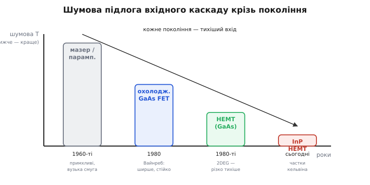
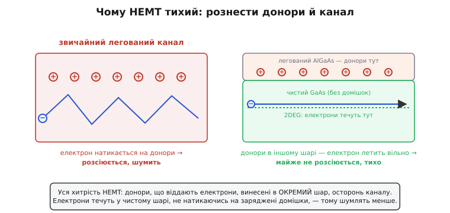

# 📜 Як училися чути найтихіше: історія наднизькошумних вхідних каскадів

Є межа чутності, об яку впирається будь-який приймач, і вона не в тому, наскільки сильно вмієш підсилити. Сигнал із далекого космічного джерела чи з кишені під вишкою — це вже майже тиша; питання лиш у тому, чи перший каскад приймача додасть до цієї тиші своєї менше, ніж природа лишила від сигналу. Уся історія, яку варто тут розповісти, — це історія того, як інженери шістдесят років поспіль відвойовували в перших каскадів частку за часткою власного шуму, аж поки не дійшли до підсилювачів, що додають частки одного-єдиного кельвіна. По дорозі змінилися самі прилади: спершу химерні квантові ампліфікатори, потім перший охолоджений транзистор, потім транзистор, спеціально вигаданий, щоб шуміти менше за всі попередні. Розповідь не про дати заради дат — а про те, **чому** кожен наступний крок узагалі знадобився й що саме змусило відмовитися від попереднього.

> 🔧 **Навіщо це.** Коли тримаєш у руках сучасний LNA з коефіцієнтом шуму в частки децибела, важко відчути, якою ціною далася ця цифра. Знати історію тут — не музейна примха: вона показує, **які фізичні стіни** обмежують шум вхідного каскаду й чому їх не можна обійти простим підсиленням. Інженер, який бачив, об що спіткнулися параметричні підсилювачі й чому HEMT їх переміг, не повторює старих помилок і розуміє, де в його власному тракті схована справжня шумова підлога.

## Початок: чим міряти, коли сигнал тихіший за деталі

Щоб зрозуміти, навіщо взагалі знадобилися химерні квантові підсилювачі, треба спершу побачити, з ким боролися. Ворог вхідного каскаду — не зовнішня завада (її можна відфільтрувати), а **власний тепловий шум** його ж деталей. Будь-який опір за температури вище абсолютного нуля сам собою породжує крихітну хаотичну напругу: електрони в ньому борсаються від тепла, і це борсання — справжній сигнал, неотличний від корисного. Що тепліша деталь, то гучніше вона шумить. Цей шум відкрили й виміряли ще в 1928 році в Bell Labs: експериментально його зафіксував Джон Джонсон (John B. Johnson), а теоретично пояснив Гаррі Найквіст (Harry Nyquist) — обидва шведсько- й німецькомовного походження, що працювали в США. Звідси й звична назва «джонсонів» або «найквістів» шум; статус — твердо встановлений факт, підпертий і дослідом, і теорією одночасно.

Із цього випливає одразу дві речі, на яких тримається вся подальша історія. По-перше, шум вхідного каскаду зручно міряти не у вольтах, а в **градусах** — у тій температурі, до якої треба було б нагріти ідеальний опір, щоб він шумів так само гучно, як шумить наш реальний підсилювач. Це **шумова температура** (англ. *noise temperature*): підсилювач із шумовою температурою 20 кельвінів додає рівно стільки шуму, скільки додав би опір, охолоджений до 20 К. Мірка геніально наочна: вона прямо каже, до якого холоду «дорівнює» тиша твого приладу.

По-друге — і це ключ до всієї саги — якщо шум родом від тепла, то **холод його глушить**. Охолоди деталь — і вона шумітиме менше; охолоди до кількох кельвінів — і її власне теплове борсання майже завмре. Звідси неминуче: усі наднизькошумні вхідні каскади історично живуть у холоді, у дьюарах із рідким гелієм. Не тому, що так модно, а тому, що інакше теплова підлога самих деталей не пускає нижче. Уся подальша гонитва — це гонитва приладів, які не лише самі по собі тихі, а ще й добре терплять охолодження до кріогенних температур.

```
Шумова температура — наочна мірка тиші підсилювача:
  T_шум = 20 К   →  «тихий, як опір, охолоджений до 20 К»
  T_шум = 4 К    →  «тихий майже як рідкий гелій навколо»
  T_шум = 1 К    →  межа сьогодення (InP HEMT для кубітів)
Зв'язок із коефіцієнтом шуму (опорна T₀ = 290 К):
  NF(дБ) = 10·log₁₀(1 + T_шум/290)
  T_шум = 20 К  →  NF ≈ 0.29 дБ
  T_шум = 4 К   →  NF ≈ 0.06 дБ
```

> Що таке коефіцієнт шуму строго, як шумова температура переводиться в децибели коефіцієнта шуму й чому перший каскад тракту вирішує майже все, — у статті [коефіцієнт шуму](root:hw-analog/noise-figure). Тут досить знати: шумова температура — це «градуси тиші», і чим вони нижчі, тим тихіший вхід.

## Доба мазерів: квантова тиша ціною неймовірних примх

Коли наприкінці 1950-х радіоастрономи й перші станції далекого космічного зв'язку захотіли почути сигнали, тихіші за все досі чуте, звичайні лампові й перші транзисторні підсилювачі їм не годилися — вони самі шуміли надто гучно. Порятунок прийшов із несподіваного боку: з квантової фізики. Це був **мазер** (англ. *maser*, від *microwave amplification by stimulated emission of radiation* — підсилення мікрохвиль вимушеним випромінюванням).

Ідея мазера — рідня лазерові, тільки в мікрохвильовому, а не світловому діапазоні. Беруть кристал (класично — рубін), охолоджують його до кількох кельвінів, заганяють електрони на вищий енергетичний рівень потужним «накачувальним» генератором — і тоді слабкий вхідний сигнал, пролітаючи крізь кристал, змушує ці електрони злетіти додолу всі разом, віддавши свою енергію точно в такт сигналові. Сигнал виходить підсиленим, а додаткового шуму майже немає — бо підсилює сам квантовий перехід, у якому нічого зайвого не борсається. Теоретичну змогу такого підсилення показав 1954 року Чарльз Таунс (Charles Townes) зі співавторами в США; паралельно й незалежно квантову теорію вимушеного підсилення розвивали в Москві Микола Басов і Олександр Прохоров — усі троє пізніше розділили за це Нобелівську премію 1964 року. (Статус — твердо встановлено; це рідкісний випадок, коли пріоритет справді поділений між кількома незалежними групами, і Нобелівський комітет це визнав явно, без імперських перекручень.)

Радіоастрономічні й далекокосмічні мазери на рубіні справді давали нечувану тишу — шумову температуру в одиниці кельвінів. У Лабораторії реактивного руху (JPL) у США кавітаційні рубінові мазери, охолоджені до 4 кельвінів рідким гелієм, працювали на антенах далекого космічного зв'язку вже з 1960 року й десятиліттями ловили сигнали міжпланетних апаратів. Це був тріумф: уперше підсилювач шумів менше, ніж небо над антеною.

І все ж мазер виявився **примхою, з якою важко жити**. Подивіться, чим за цю тишу платили:

- Він вимагав **другого, потужного генератора** — накачки на ще вищій частоті (класично десь 12 ГГц), щоб піднімати електрони нагору. Без накачки мазер мертвий.
- Він був **разюче вузькосмуговий**: підсилював лише в тонкій смужці частот навколо квантового переходу, і розширити її було майже нічим. Хочеш іншу частоту — перебудовуй магнітне поле або міняй кристал.
- Він тримався на **рідкому гелії** не заради зручності, а конструктивно: без кріогеніки квантові рівні розмиваються тепловим борсанням і підсилення зникає. Уся обв'язка — дьюари, насоси, магніти — була громіздка й дорога.
- Він був **вередливий у налаштуванні**: магнітне поле, температуру, накачку доводилося ретельно зводити докупи, і будь-який дрейф збивав режим.

Виходила дивна картина: фізично найтихіший підсилювач у світі був водночас найнезручнішим. Радіотелескоп чи станція могли його собі дозволити — там за тишу платили будь-яку ціну. Але як універсальний вхідний каскад мазер не годився: надто вузький, надто складний, надто прив'язаний до гелію й накачки.

## Паралельна доба: параметричні підсилювачі — простіше за мазер, та все ще химерно

Поряд із мазерами існував другий клас наднизькошумних підсилювачів, трохи земніший, — **параметричні підсилювачі** (англ. *parametric amplifier*, у жаргоні «парамп»). Їхня ідея теж хитра, але вже без квантових переходів.

Параметричний підсилювач підсилює, **гойдаючи реактивний параметр** кола — звідси й назва. Беруть особливий діод (варактор), ємність якого залежить від прикладеної напруги, і швидко «розгойдують» цю ємність потужним генератором-накачкою. Слабкий сигнал, що сидить на тому самому колі, від цього гойдання набирає енергії — приблизно так, як дитина на гойдалці розгойдується, ритмічно присідаючи в такт, хоча її ніхто не штовхає ззовні. Енергію в сигнал перекачує накачка через нелінійну ємність; а оскільки головний елемент — майже чистий реактивний опір, який сам по собі майже не шумить (на ньому не гріються електрони, як на звичайному резисторі), власний шум такого підсилювача малий.

Параметричні підсилювачі, охолоджені до кількох десятків кельвінів, давали шумову температуру в кілька десятків кельвінів — гірше за мазер, зате без квантового кристала й без такого лютого холоду. Тому в 1960–1970-х вони стали робочою конячкою там, де мазер був завеликою розкішшю: супутникові наземні станції, частина радіотелескопів, далекий космос. У ранніх 1970-х, як свідчать огляди NRAO та JPL, наднизькошумні приймачі трималися саме на трьох речах: твердотільні мазери, кріогенно охолоджені параметричні підсилювачі та змішувачі на діодах Шотткі. (Статус — твердо встановлено за технічними оглядами епохи.)

Та й параметричний підсилювач ніс на собі тавро всього того класу:

- Йому теж потрібна була **потужна накачка** — окремий генератор на високій частоті.
- Він теж був **вузькосмуговий** і капризний у настроюванні: смугу й режим задавало тонке узгодження реактивностей, і будь-яка зміна навантаження їх збивала.
- Він охоче **самозбуджувався**: за самою природою параметричного підсилення там легко зривалося паразитне коливання, і боротьба зі стійкістю була постійним головним болем.
- Узгодити його, перебудувати на іншу частоту, тримати в режимі — усе це вимагало майстра й часу.

Отож на порозі 1980-х склалася промовиста ситуація. Найтихіші вхідні каскади світу — мазери й парампи — усі як один були **вузькосмугові, примхливі, з накачкою, схильні до самозбудження й намертво прив'язані до кріогеніки**. Вони працювали, але кожен такий приймач був майже витвором мистецтва, який вимагав догляду. Інженери мріяли про щось простіше: про звичайний транзистор, який підсилював би так само тихо, але без накачки, у широкій смузі, без танців із настроюванням. Довго це здавалося нездійсненним — транзистори тих років шуміли надто гучно. Аж поки не дозрів арсенід галію.

## Перелом 1980 року: Вайнреб охолоджує транзистор — і парампи відступають

Транзистори на арсеніді галію (GaAs) визрівали все 1970-ті. На відміну від кремнію, в арсеніді галію електрони рухаються прудкіше й охочіше, тож польовий транзистор на ньому — GaAs MESFET (польовий транзистор із бар'єром метал–напівпровідник на затворі) — добре працював на високих радіочастотах і шумів менше за кремнієві родичі. Та за кімнатної температури він усе одно програвав параметричним підсилювачам за тишею. Лишалося спитати очевидне, підказане всією попередньою історією: **а що, як його охолодити?**

Це й зробив Сандер Вайнреб (Sander Weinreb) — американський радіоінженер, що тоді працював у Національній радіоастрономічній обсерваторії (NRAO) у США й усе життя присвятив саме наднизькошумним приймачам для радіоастрономії. У листопаді 1980 року він зі співавторами оприлюднив вимірювання шуму арсенід-галієвих польових транзисторів на частоті близько 5 ГГц за температур від кімнатних 300 К аж до 20 К, і — головне — описав на їх основі реальні охолоджені підсилювачі. Один із них давав шумову температуру близько 20–25 кельвінів у смузі завширшки 500 МГц. (Статус — твердо встановлено за публікацією епохи; цей результат прямо фіксують пізніші огляди NRAO.)

Здавалося б, 20 кельвінів — гірше за мазер. Але дивитися треба не на одну цифру. **Охолоджений GaAs FET виграв усім іншим**, і саме це його зробило революцією:

- **Широка смуга** — 500 МГц проти тонкої смужки мазера чи парампа. Один підсилювач накривав цілий діапазон.
- **Жодної накачки** — звичайний транзистор підсилює сам, від живлення. Геть другий генератор, геть половину обв'язки.
- **Краща лінійність** — він не м'явся під сильними сигналами так, як капризні попередники.
- **Стійкість і простота** — ніяких танців із магнітним полем і реактивностями; увімкнув, охолодив — працює. Виготовляти й налаштовувати його було незрівнянно простіше.

> Чому транзистор не може мати скільки завгодно великого підсилення в широкій смузі (добуток підсилення на смугу сталий) — у статті [добуток підсилення на смугу](root:hw-analog/gain-bandwidth-product); чому LNA, окрім тиші, вимагають лінійності, щоб сильний сусідній канал не зім'яв слабкий сигнал, — це окрема вісь якості, описана в самій темі [LNA](root:hw-analog/lna-low-noise-amplifier).

Це й вирішило долю параметричних підсилювачів. Інженер охоче віддасть кілька зайвих кельвінів шуму за широку смугу, відсутність накачки, лінійність і спокій у налаштуванні. Тому впродовж 1980-х охолоджені GaAs FET витіснили парампи з радіотелескопів і наземних станцій майже всюди, де ширина смуги й простота важили більше за останні крихти тиші. Складна, примхлива квантово-реактивна доба добігала кінця; починалася доба транзисторного вхідного каскаду, який можна виготовити серійно.


*Кожне покоління вхідного каскаду опускало шумову підлогу нижче. Мазери й параметричні підсилювачі 1960-х були фізично тихі, але вузькосмугові й примхливі; охолоджений GaAs FET Вайнреба (1980) виграв смугою, лінійністю та стійкістю; HEMT із його двовимірним газом електронів різко знизив шум, а сучасний InP HEMT дійшов до часток кельвіна.*

## Тим часом у Японії: транзистор, навмисне вигаданий тихим

Поки Вайнреб охолоджував наявний транзистор, в іншій півкулі визрівала ідея зробити транзистор, який буде тихим **сам по собі**, за самою своєю будовою. Щоб зрозуміти її красу, треба спитати: а **чому**, власне, транзистор шумить? Звідки в його каналі береться той хаос, що псує сигнал?

Корінь — у домішках. Щоб у напівпровіднику з'явилися вільні електрони-носії струму, його легують: підмішують атоми-донори, кожен з яких віддає в кристал один електрон. Але, віддавши електрон, донор лишається в кристалі зарядженим іоном — і цей нерухомий заряд стирчить просто на шляху електронів, що течуть каналом. Електрони раз по раз пролітають повз заряджені домішки, відхиляються, гальмують, розсіюються — і цей безлад руху і є чималою часткою шуму. Виходить парадокс: домішки потрібні, щоб були носії, але ті самі домішки збивають носіям рух і змушують їх шуміти.

А що, як **розвести їх по різних кутках** — електрони окремо, донори окремо? Саме цю можливість відкрила нова фізика напівпровідникових гетероструктур. У 1978 році в Bell Labs у США троє дослідників — Рей Дінгл (Ray Dingle), Горст Штьормер (Horst Störmer) і Артур Госсард (Arthur Gossard) — показали хитрий трюк, який назвали **модуляційним легуванням** (англ. *modulation doping*). Беруть два різні напівпровідники з різною шириною забороненої зони (класично — AlGaAs і GaAs) і вирощують їх шарами. Донори кладуть **тільки у верхній шар** (AlGaAs); електрони, які вони віддають, скочуються вниз, на межу, у нижній **чистий** шар (GaAs), де донорів нема зовсім. Там, на самій межі, електрони збираються в тонесеньку плівку — **двовимірний газ електронів** (англ. *two-dimensional electron gas*, 2DEG). І ось у чому фокус: цей газ тече в чистому шарі, а заряджені донори лишилися нагорі, осторонь. Електрони більше не натикаються на іони, що їх породили, — вони летять майже вільно. Їхня рухливість підскакує в рази, а шум від розсіяння на домішках різко падає. (Статус — твердо встановлено: робота Дінгла, Штьормера й Госсарда «Electron mobilities in modulation-doped semiconductor heterojunction superlattices» вийшла в *Applied Physics Letters* 1978 року, патент подано того ж року.)


*Корінь шуму звичайного транзистора — заряджені домішки просто в каналі: електрони натикаються на них і розсіюються. Хитрість HEMT — рознести донори й канал: донори лишаються у верхньому шарі, а електрони збираються тонкою плівкою (2DEG) у чистому нижньому шарі, де нема на що натикатися. Тому HEMT шумить менше.*

Цю статтю з Bell Labs і прочитав навесні 1979 року Такаші Мімура (Takashi Mimura, 三村高志) — фізик компанії Fujitsu в Японії. Мімура від 1977 року бився над арсенід-галієвим транзистором як заміною кремнієвому, і стаття про модуляційне легування дала йому ключ: якщо двовимірний газ електронів такий рухливий і тихий, чому б не зробити з нього **канал транзистора**? Покласти затвор над цією плівкою й керувати нею, як звичайним польовим транзистором, — і дістати прилад, у якого носії за самою будовою рознесені з домішками й тому шумлять винятково мало. Ідею Мімура подав на внутрішній патент Fujitsu у серпні 1979 року, а вже в травні 1980-го він разом із Сатоші Хіямідзу (Satoshi Hiyamizu) виготовив і запустив перший робочий прилад. Так народився **HEMT** (англ. *high-electron-mobility transistor* — транзистор із високою рухливістю електронів). (Статус — твердо встановлено; Fujitsu відзначає липень 1979-го як місяць задуму, серпень 1979-го — як подання патенту, травень 1980-го — як перший прилад; за винахід HEMT Мімура 2017 року здобув Кіотську премію.)

Тут важливо назвати все точно, без імперських ярликів. **HEMT — японський винахід**: його задумав і вперше втілив Такаші Мімура в Fujitsu, спираючись на американську фізику гетероструктур із Bell Labs. Це класичний приклад того, як винахід **складається з кількох внесків різних країн**: фізику двовимірного газу електронів відкрили в США (Дінгл, Штьормер, Госсард), а перетворив її на робочий транзистор — японський інженер у японській компанії. Варто згадати й те, що майже одночасно подібну ідею незалежно запатентували у Франції — Даніель Делажбодеф (Daniel Delagebeaudeuf) і Чан Лінь Нгуєн (Tran Linh Nguyen) у Thomson-CSF, подавши заявку в березні 1979 року й показавши «обернений» варіант у серпні 1980-го. Тобто думка визріла в повітрі одразу в кількох місцях; пріоритет першого працюючого приладу належить групі Мімури. Жодного «російського» чи якогось іншого підставного авторства тут нема й бути не може — ланцюг внесків добре задокументований.

## Чому HEMT змінив не лише телескопи, а й кишеню кожного

Перший HEMT був лабораторною дивиною, та його перевага виявилася настільки фундаментальною, що прилад швидко вийшов далеко за межі радіоастрономії. Двовимірний газ електронів дав те, чого не міг дати жоден доти: винятково низький шум **разом** із доброю роботою на дуже високих частотах. А це рівно те, чого потребує будь-який приймач слабкого радіосигналу — байдуже, телескоп то чи телефон.

Подумайте, що означає «тихий вхідний каскад на надвисоких частотах», у побутових словах. Це означає, що супутник можна **почути меншою тарілкою** — бо тихіший вхід відіграє те, що інакше довелося б добирати залізом антени. Це означає, що слабесенький сигнал GPS із орбіти можна **впіймати крихітною антеною в телефоні**. Це означає, що базова станція мобільного зв'язку чує далекий апарат на краю стільника. Усе це впродовж 1980–1990-х відчинив саме HEMT: супутникове телебачення, що прийшло в кожен дім із розумного розміру тарілкою; супутникова навігація GPS у кишені; мобільний зв'язок; згодом — Wi-Fi і автомобільні радари. Те, що колись вимагало громіздкого охолодженого парампа з накачкою, помістилося в одну дешеву мікросхему вхідного каскаду. (Статус — твердо встановлено: ці застосунки HEMT прямо названі і в матеріалах Fujitsu, і в обґрунтуванні Кіотської премії.)

Сталося те, що в техніці трапляється рідко: прилад, народжений у гонитві за останніми крихтами тиші для радіотелескопів, виявився саме тим, що потрібно мільярдам побутових приймачів. Тиша вхідного каскаду перестала бути розкішшю обсерваторій — вона лягла в основу повсякденного зв'язку.

## Сходження по матеріалах: від GaAs до InP — і знов у кріогеніку

Перші HEMT робили на тій самій парі AlGaAs/GaAs, що й дослід Bell Labs. Але як тільки виявилося, що двовимірний газ електронів — золота жила тиші, інженери почали добирати матеріали так, щоб електрони в каналі бігали ще прудкіше й шуміли ще менше. Канал збагачували індієм (InGaAs), а далі перейшли на зовсім інший фундамент — **фосфід індію (InP)**. У гетероструктурі на InP (класично AlInAs/InGaAs/InP) електрони набирають іще вищу рухливість, тож такий HEMT шумить найменше з усіх і працює аж до міліметрових хвиль. Шлях матеріалів історично йшов сходинками: AlGaAs/GaAs → AlGaAs/InGaAs/GaAs → AlInAs/InGaAs/InP, і InP-варіант став технологією вибору для наднизькошумних кріогенних підсилювачів на найвищих частотах. (Статус — твердо встановлено за оглядами NRAO.)

І тут історія робить повне коло. Найтихіший транзистор світу, як колись мазер, найкраще показує себе **в холоді**. Охолодіть InP HEMT до кількох кельвінів — і його власне теплове борсання майже завмре, лишивши шум, про який доба мазерів могла лише мріяти. Сучасні кріогенні InP HEMT-підсилювачі дають шумову температуру в **одиниці кельвінів і нижче**: для квантових обчислень, де такими підсилювачами зчитують стан кубітів на частотах 4–8 ГГц просто в кріостаті за 4 К, оприлюднені результати — це шумова температура десь 1–3 кельвіни за підсилення в кілька десятків децибелів. (Статус — твердо встановлено за свіжими публікаціями про кріогенні InP HEMT LNA для зчитування кубітів.)

Подивіться, який шлях пройдено. Доба мазерів давала одиниці кельвінів — але ціною накачки, вузької смуги й примх. Сьогоднішній InP HEMT дає ту саму тишу в одиниці кельвінів — **без накачки, у широкій смузі, серійним приладом**, у який лишилося хіба що залити гелій. Транзистор наздогнав, а в зручності давно перегнав квантові підсилювачі, заради тиші яких усе й починалося.

Сьогодні наднизькошумний вхідний каскад живе у двох світах одразу. У радіотелескопах InP HEMT, охолоджені рідким гелієм, ловлять випромінювання найдальших галактик — там кожен зайвий кельвін шуму це втрачені об'єкти на межі видимості. А в дилюційних кріостатах квантових обчислювачів ті самі за природою підсилювачі зчитують крихкі стани кубітів, і головною мукою стало вже не «як зробити тихіше», а «як зробити тихо **і** майже без споживаної потужності» — бо кожен мілівт, розсіяний підсилювачем біля кубітів, гріє кріостат і заважає масштабувати машину. Гонитва за тишею не скінчилася — вона лише перейшла на новий рубіж.

## Що залишила по собі ця історія

Сторіччя боротьби за тихий вхідний каскад склало просту, але не очевидну на перший погляд лінію. Спочатку зрозуміли, що ворог — власний тепловий шум деталей, і навчилися міряти його **градусами тиші** (шумовою температурою), а глушити — **холодом**. Потім квантова фізика дала мазер: фізично найтихіший підсилювач, та намертво вузькосмуговий, з накачкою й примхами; поряд служили трохи земніші, але такі ж капризні параметричні підсилювачі. Перелом стався 1980 року, коли Сандер Вайнреб охолодив звичайний GaAs-транзистор і той виграв у парампів **смугою, лінійністю та простотою**, віддавши лиш кілька зайвих кельвінів, — і витіснив їх. Майже водночас Такаші Мімура в японській Fujitsu, спираючись на американську фізику двовимірного газу електронів із Bell Labs, вигадав HEMT — транзистор, **навмисне зроблений тихим** за самою будовою, бо донори в ньому рознесені з каналом. HEMT не лише дав радіоастрономії частки децибела, а й відчинив супутникове ТБ, GPS і мобільний зв'язок мільярдам людей. А далі сходження по матеріалах привело до кріогенного InP HEMT, який дає одиниці кельвінів шуму без накачки й у широкій смузі — і служить однаково й найдальшим телескопам, і найновішим квантовим машинам.

Головний урок, який варто винести з цієї історії, не в датах. Він у тому, що **тиша вхідного каскаду — це не питання підсилення, а питання фізики самого приладу й того холоду, в якому він живе**. Її не накрутиш коефіцієнтом; її виборюють поколіннями приладів, кожне з яких прибирає одне фізичне джерело шуму. Хто це бачить, той розуміє, чому супутникову тарілку можна зменшити, лише зробивши тихіший вхід, і чому в дьюарі радіотелескопа сидить транзистор, родом із тієї самої ідеї, що чує GPS у вашій кишені.
