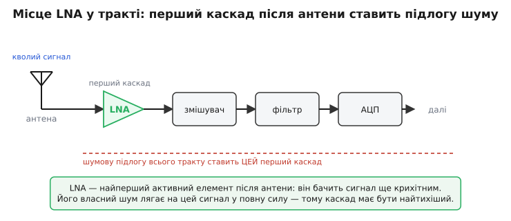
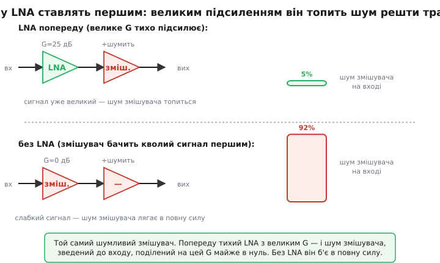
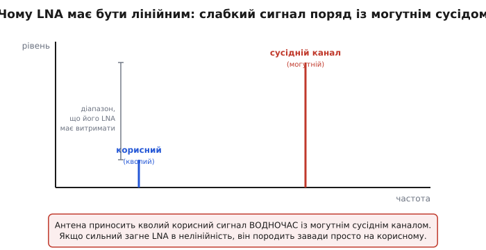
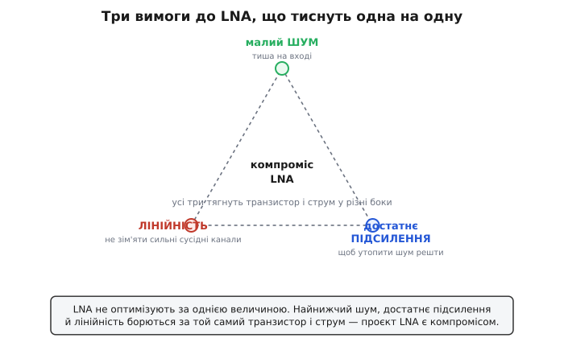

# Малошумний підсилювач (LNA): найперший каскад, що вирішує, чи взагалі почуєш сигнал

Антена супутникової тарілки ловить із орбіти за тридцять шість тисяч кілометрів сигнал такий слабкий, що його потужність — частки мільярдної частки вата. Антена GPS-приймача в телефоні чує супутник, що летить на висоті двадцять тисяч кілометрів і світить передавачем у якихось півста ватів — на той момент, коли хвиля доходить до кишені, від неї лишається менше, ніж шумить власний опір вхідного кола. Сигнал у буквальному сенсі тихіший за шум деталей, крізь які він має пройти. І все ж тарілка показує картинку, а телефон знає, де ви. Між антеною й рештою приймача стоїть один маленький підсилювач, від якого залежить, чи це взагалі можливо, — **малошумний підсилювач**.

**Малошумний підсилювач** (англ. *low-noise amplifier*, скорочено LNA) — це перший активний каскад приймача, поставлений одразу за антеною (чи давачем), завдання якого — підсилити кволий сигнал, додавши до нього **якомога менше власного шуму**. Назва каже все: не «потужний», не «широкосмуговий», не «з великим підсиленням», а саме **мало-шумний**. Бо на цьому місці тракту головне не те, наскільки сильно підсилити, а наскільки тихо.

> 🔧 **Навіщо це.** LNA — це той каскад, що перетворює добру антену на добрий приймач. Дві однакові тарілки з різними LNA дадуть різну дальність зв'язку; два однакові телефони з різними вхідними підсилювачами зловлять GPS на різній глибині міського каньйону. Усе, що приймач уміє почути на межі чутності, вирішується тут. Інженер, який це розуміє, не економить на першому каскаді й не ставить туди абищо «бо потім же підсилимо ще» — він знає, що «потім» уже нічого не виправить.

### Чому взагалі потрібен окремий «тихий» каскад

Перша спокуса, коли сигнал слабкий, — підсилити його посильніше. Поставив підсилювач із підсиленням тисяча, і там, де було мізерно мало, стало пристойно. Здавалося б, проблему розв'язано. Але вона так не розв'язується, і причина — наріжний камінь усієї слабкосигнальної техніки.

Підсилювач не вміє відрізнити сигнал від шуму: на його вхід по одному дроту приходить **сума** корисного й паразитного, і він чесно множить на свій коефіцієнт **усе**. Сигнал виріс у G разів — і шум виріс у ті самі G разів. Їхнє відношення не зрушилося. Підсилення робить сигнал гучнішим, зручнішим для наступних каскадів — але [відношення сигнал/шум](root:hw-analog/signal-noise-ratio) не покращує ані на децибел. Якщо корисне вже потонуло в шумі на вході, жодне підсилення його не витягне.

> Чому підсилення множить сигнал і шум на той самий коефіцієнт і тому не змінює їхнього відношення, і чому якість аналогового каналу вирішує саме цей запас, а не «гучність», — у статті [відношення сигнал/шум](root:hw-analog/signal-noise-ratio). Тут ми беремо це як засаду: тиша вирішується на вході, а не накручується підсиленням.

Звідси випливає золоте правило входу: **відношення сигнал/шум задає найперший елемент тракту, і далі його можна лише погіршити.** Той перший каскад, що бачить сигнал ще крихітним, ставить шумову підлогу всього каналу. Усе наступне додає свій шум згори — але прибрати вже домішаного не може. Тому проєктувати тихий приймач завжди починають із входу: туди ставлять найтихіше, а економлять далі, де сигнал уже великий і трохи зайвого шуму нічого не псує.


*LNA стоїть найпершим активним елементом після антени й бачить сигнал ще крихітним, тож його власний шум лягає на сигнал у повну силу. Решта тракту — змішувач, фільтр, АЦП — додають свій шум уже згори, але підлогу всього каналу ставить саме перший каскад.*

LNA — це і є той перший елемент, зроблений навмисне якнайтихішим. Окремий каскад потрібен тому, що тиша й сила — різні задачі, які важко вдовольнити одним пристроєм. Дешевше й чесніше розділити: один маленький транзистор, виведений на найнижчий власний шум, ставить підлогу — а підсилювати до пристойних рівнів і обробляти можна вже далі, де ціна шуму впала.

### Чому саме першим — і чому з великим підсиленням

Тут ховається тонкість, без якої LNA здається зайвим. Якщо підсилення SNR не покращує, навіщо взагалі ставити підсилювач першим? Хіба не однаково?

Не однаково — і ось чому. Реальний тракт це ланцюг: антена, LNA, змішувач, фільтр, АЦП. Кожна ланка додає **свій** шум. Та шум кожного каскаду, зведений до входу для чесного порівняння з сигналом, **ділиться на сумарне підсилення всіх каскадів перед ним**. Власний шум першого каскаду лягає на вхід як є, у повну силу. Шум другого, щоб порівняти його з вхідним сигналом, треба поділити на підсилення першого — а воно велике, тож на вході цей шум виглядає вже маленьким. Шум третього ділиться на добуток підсилень першого й другого — і майже зникає.

Ось де народжується роль LNA. Сам він SNR не покращує — але своїм **великим підсиленням** він топить шум усього, що стоїть за ним. Поставте попереду тихий каскад із підсиленням у двадцять п'ять децибелів — і шум змішувача, поділений на це підсилення, доходить до входу вже мізерним. Заберіть LNA, хай змішувач бачить кволий сигнал першим — і його чималий власний шум ляже на сигнал у повну силу, бо ділити вже немає на що.


*Угорі попереду стоїть тихий LNA з великим підсиленням: шум змішувача, зведений до входу, поділений на це підсилення майже в нуль. Унизу того самого змішувача поставлено першим — його шум лягає на кволий сигнал у повну силу. Перший каскад має бути водночас тихим і з добрим підсиленням.*

Звідси два слова в технічному завданні на LNA, що тягнуть в один бік: **малий власний шум** (щоб не зіпсувати вхід самому) і **достатнє підсилення** (щоб утопити шум решти тракту). Перше робить каскад придатним для входу, друге — робить його корисним там. Каскад тихий, але зі слабким підсиленням, погано давить шум наступних ланок; каскад із великим підсиленням, але шумливий, псує вхід сам. LNA мусить мати і те, і те.

> Точний підрахунок, як шуми ланок складаються вздовж тракту, ділячись на підсилення попередніх (формула Фрііса), і чому через це перший каскад домінує над усім приймачем, — у статті [коефіцієнт шуму](root:hw-analog/noise-figure). Там видно, чому добрий LNA з великим підсиленням робить шум решти тракту майже неважливим.

### Головне число: коефіцієнт шуму

Раз уся суть LNA — додати якомога менше шуму, потрібна мірка цього «якомога менше». Нею є **коефіцієнт шуму** (англ. *noise figure*, скорочено NF): на скільки відношення сигнал/шум на виході підсилювача гірше, ніж було на вході. Ідеальний, абсолютно тихий каскад нічого не псує — у нього NF = 0 дБ. Реальний LNA трохи псує — і весь сенс у тому, щоб це «трохи» було якомога меншим.

Числа тут вражають, наскільки малими вони бувають. Добрий супутниковий LNA має коефіцієнт шуму **менше одного децибела** — тобто SNR на виході гірший за вхідний лиш на якісь півдецибела. Щоб відчути, чого варта ця дрібка: у супутниковому прийомі покращення NF приймача на **0.3 дБ** дає ту саму чутливість, що й збільшення тарілки на сім–десять відсотків за діаметром. Третина децибела на вході вартує сантиметрів заліза на даху. Тому за коефіцієнт шуму LNA б'ються так, як ні за що інше в тракті: тут кожна десята децибела — це гроші, дальність, висота орбіти.

**Скільки чутливості коштує зайвий шум LNA.** Приймач має LNA з підсиленням 25 дБ. Замість тихого транзистора з NF = 0.6 дБ поставили дешевший із NF = 1.6 дБ. На скільки погіршиться чутливість усього приймача (вважаймо, що перший каскад домінує, як воно й буває)?

:::tabs
```cpp
#include <cmath>

// Коефіцієнт шуму першого каскаду майже повністю задає шум приймача:
// зайвий шум LNA напряму віднімається від чутливості (у дБ).
float nf_good = 0.6f;     // тихий LNA, дБ
float nf_cheap = 1.6f;    // дешевий LNA, дБ

float loss_dB = nf_cheap - nf_good;   // 1.0 дБ гіршої чутливості

// 1 дБ чутливості на 12 ГГц — це приблизно стільки відсотків площі тарілки:
// площа ∝ 10^(втрата/10);  10^(1.0/10) ≈ 1.26  →  на 26% більша тарілка
float dish_area_ratio = std::pow(10.0f, loss_dB / 10.0f);   // ≈ 1.26
```
```c
#include <math.h>

// Коефіцієнт шуму першого каскаду майже повністю задає шум приймача:
// зайвий шум LNA напряму віднімається від чутливості (у дБ).
float nf_good = 0.6f;     // тихий LNA, дБ
float nf_cheap = 1.6f;    // дешевий LNA, дБ

float loss_dB = nf_cheap - nf_good;   // 1.0 дБ гіршої чутливості

// 1 дБ чутливості на 12 ГГц — це приблизно стільки відсотків площі тарілки:
// площа ∝ 10^(втрата/10);  10^(1.0/10) ≈ 1.26  →  на 26% більша тарілка
float dish_area_ratio = powf(10.0f, loss_dB / 10.0f);   // ≈ 1.26
```
```python
# Коефіцієнт шуму першого каскаду майже повністю задає шум приймача:
# зайвий шум LNA напряму віднімається від чутливості (у дБ).
nf_good = 0.6     # тихий LNA, дБ
nf_cheap = 1.6    # дешевий LNA, дБ

loss_dB = nf_cheap - nf_good   # 1.0 дБ гіршої чутливості

# 1 дБ чутливості на 12 ГГц — це приблизно стільки відсотків площі тарілки:
# площа ∝ 10^(втрата/10);  10^(1.0/10) ≈ 1.26  →  на 26% більша тарілка
dish_area_ratio = 10 ** (loss_dB / 10)   # ≈ 1.26
```
:::

Один зекономлений на транзисторі долар обернувся вимогою на чверть більшої тарілки, щоб повернути ту саму дальність. Ось чому в першому каскаді не економлять.

> Що таке коефіцієнт шуму строго, як він рахується для цілого ланцюга каскадів і чому виходить, що перший каскад вирішує майже все, — у статті [коефіцієнт шуму](root:hw-analog/noise-figure). Тут ми беремо NF як готову мірку якості LNA: чим менший, тим тихіший підсилювач.

Тут і ховається половина мистецтва. Найнижчий коефіцієнт шуму транзистор віддає **не за будь-якого** джерела на вході, а лише коли джерело має певний особливий опір — і цей опір, як правило, **не той**, за якого антена віддала б підсилювачеві найбільше потужності. Тому вхід LNA узгоджують не за звичним рефлексом «спряжений опір для максимальної передачі», а за окремим, шумовим оптимумом. Це окрема велика тема, специфічна саме для входу приймача.

> Чому шумовий оптимум джерела не збігається з потужнісним, якими чотирма числами (Fmin, Yopt, Rn) виробник описує шум транзистора в даташиті й як котушка в емітері хитро зводить обидва оптимуми докупи без зайвого шуму, — у статті [узгодження за шумом у LNA](root:hw-analog/noise-matching). Тут досить знати, що вхід LNA настроюють на найтихіший, а не на найпотужніший варіант.

### Друге число: підсилення, але рівно стільки, скільки треба

Підсилення LNA вже з'явилося як важіль, що топить шум решти тракту, тож більше підсилення — наче завжди краще. Та й тут є межа, і не одна.

По-перше, велике підсилення на високих частотах коштує дорого: у будь-якого транзистора добуток підсилення на смугу обмежений, тож що ширшу смугу частот ловить приймач, то менше підсилення лишається. На радіочастотах це жорстка стеля.

> Чому в транзистора добуток підсилення на смугу частот сталий, тож за більшу смугу платиш меншим підсиленням, — у статті [добуток підсилення на смугу](root:hw-analog/gain-bandwidth-product). Для LNA це означає: широкосмуговий вхід не може мати скільки завгодно великого підсилення.

По-друге — і це важливіше — завелике підсилення на вході **шкодить**. Підсилений сигнал іде в наступний каскад, змішувач; якщо LNA підсилив надто сильно, навіть помірний вхідний сигнал виходить таким великим, що змішувач уже не справляється й починає спотворювати. Виходить, LNA треба рівно стільки підсилення, щоб надійно втопити шум наступних каскадів, — і ні децибела зайвого, бо зайве лише наближає весь тракт до перевантаження. Тому типове підсилення LNA — двадцять-тридцять децибелів: помітно, але стримано.

### Третє число: лінійність — щоб сильний сусід не зім'яв слабкий сигнал

Ось вимога, яку легко проґавити, коли думаєш лише про тишу, а вона часто і є найважчою. Антена приносить **не лише** ваш кволий корисний сигнал. Разом із ним у вхід LNA вливається все, що ловиться на тій антені, — і серед нього бувають канали в тисячі та мільйони разів сильніші. GPS-приймач у телефоні чує супутник на тлі могутньої стільникової вишки за кілька кварталів; супутниковий вхід бачить слабкий потрібний транспондер поряд із сусідніми.


*Антена приносить кволий корисний сигнал водночас із могутнім сусіднім каналом. LNA мусить підсилити обидва, не спотворивши, — інакше сильний породить паразитні складові просто на частоті слабкого, і ніяке фільтрування потім їх уже не відокремить.*

Чому це небезпечно? Доки підсилювач **лінійний** — множить усе на той самий коефіцієнт, — сильний сусід просто проходить наскрізь, а потім його відсіє фільтр. Та жоден підсилювач не лишається лінійним за будь-якого рівня: за досить великого сигналу транзистор виходить за межі, де приріст виходу пропорційний приросту входу, і починає **спотворювати**. А спотворення нелінійного елемента — це не просто стиснення; воно породжує нові частотні складові, яких на вході не було, з сум і різниць наявних. Дві сильні завади поряд можуть народити таку складову, що ляже **точно на частоту вашого слабкого сигналу** — і змішається з ним нерозривно. Фільтр уже безсилий: завада сидить на тій самій частоті, що й корисне.

Тому в LNA, окрім тиші, вимагають **лінійності** — здатності підсилювати без спотворень аж до досить великих сигналів. Міряють її кількома числами: точкою, де підсилення просіло на децибел через стиснення, і — головне для завад поряд — **точкою перетину третього порядку** (англ. *third-order intercept point*, IP3), що каже, наскільки малими лишаються ті паразитні складові від сильних сусідів.

> Звідки беруться паразитні складові третього порядку, чому саме вони найнебезпечніші (бо лягають близько до корисної частоти), що таке точка перетину IP3 й точка стиснення на децибел і як їх рахувати — у [математиці лінійності LNA](root:hw-analog/lna-low-noise-amplifier/math-lna-intercept.md). Тут досить ідеї: сильний сусід здатен породити заваду просто на корисному сигналі, і лінійність LNA це обмежує.

І ось чому LNA — завжди компроміс, а не гонитва за однією цифрою. Найнижчий шум, достатнє підсилення й добра лінійність **тягнуть транзистор і його робочий струм у різні боки**. Тихий режим — це часто малий струм; добра лінійність хоче струму більшого; узгодження за шумом суперечить узгодженню за підсиленням. Інженер не «оптимізує LNA» — він знаходить точку, де всі три вимоги стерпно вдоволені для його задачі.


*Три вимоги до LNA борються за той самий транзистор і той самий робочий струм: найнижчий шум, достатнє підсилення й лінійність неможливо довести до максимуму одночасно. Проєкт LNA — це вибір компромісної точки, а не оптимізація однієї величини.*

### Четверте, що мовчазно вимагається: узгоджений вхід і стійкість

Дві речі добрий LNA робить, не потрапляючи в гасла, але без них він не працює.

Перша — **узгоджений вхід**. На радіочастотах сигнал біжить до підсилювача коаксіальним кабелем чи доріжкою з певним хвильовим опором (зазвичай п'ятдесят омів). Якщо вхід LNA цього опору не тримає, частина сигналу від нього **відбивається** назад, як луна від нерівного стику труби, — і не доходить туди, де її підсилюють. Тому вхід LNA узгоджують так, щоб відбиття було малим; міру цього називають зворотними втратами (англ. *return loss*). Тонкість LNA в тому, що це узгодження мусить водночас бути й тим, що дає найнижчий шум, — а ці дві вимоги, як уже сказано, тягнуть у різні боки, і їх примиряють спеціальними прийомами.

> Чому неузгоджений вхід відбиває частину сигналу назад і як підбирають вхідне коло, щоб віддача в підсилювач була повна, — у статті [узгодження опорів](root:hw-analog/impedance-matching); чому відбиту хвилю краще поглинути, ніж відпустити гуляти, — у статті [відбиття й поглинання](root:hw-sensing/reflection-absorption). Для LNA це означає: вхід проєктують так, щоб і шум був мінімальний, і відбиття мале.

Друга — **стійкість**. Підсилювач із великим підсиленням на високих частотах легко перетворюється на генератор: крихітний зворотний зв'язок із виходу на вхід через паразитні ємності — і замість тихого підсилення каскад починає сам собою свистіти на якійсь частоті, заглушаючи все. LNA проєктують так, щоб за жодного розумного навантаження він не зривався в самозбудження. Це накладає ще одне обмеження на вибір робочої точки й узгодження — інколи доводиться навмисне трохи зменшити підсилення заради певної стійкості.

### З чого LNA роблять і де він живе

Серце LNA — один транзистор, виведений у найтихіший режим. Який саме — залежить від частоти й вимог.

На високих радіочастотах (супутникові діапазони, мобільний зв'язок, GPS) царюють **транзистори з високою рухливістю електронів** (HEMT) на основі сполук на кшталт арсеніду галію чи фосфіду індію: їхній канал шумить винятково мало, і саме вони дають ті частки децибела, якими хвалиться супутниковий вхід. На нижчих частотах і там, де важить дешевизна, добре служать звичайні [польові транзистори](root:hw-components/jfet) та [біполярні](root:hw-analog/bjt-small-signal) — а в дешевих масових приймачах LNA взагалі вбудований у кремнієву мікросхему разом із рештою радіочастини. Часто вхідний каскад роблять не на одному транзисторі, а [диференційною парою](root:hw-analog/opamp-input-stage) — тоді він краще придушує спільні для обох входів завади й живлення.

> Як працює польовий транзистор із керованим каналом і чому його вхід — майже чиста ємність (зручна для радіочастотного входу), — у статті [польовий транзистор](root:hw-components/jfet); як рахувати підсилення й опори транзисторного каскаду в режимі слабкого сигналу — у статті [мала модель біполярного транзистора](root:hw-analog/bjt-small-signal).

Де живе LNA — простіше перелічити, де ні. У супутниковій тарілці перший каскад сидить просто в головці на штанзі, на самому фокусі, щоб піймати сигнал до того, як його з'їсть кабель донизу; в телефоні крихітний LNA стоїть першим за кожною антеною — стільниковою, GPS, Wi-Fi; у радіотелескопі вхідний підсилювач **охолоджують рідким гелієм** мало не до абсолютного нуля, бо за такої тиші важить навіть теплове борсання електронів у самому транзисторі, і кожен зайвий градус — це втрачені далекі галактики. Скрізь, де ловлять слабке, перший каскад — це LNA.

> Як народилася техніка наднизькошумних підсилювачів: чому радіоастрономи спершу мучилися з примхливими параметричними підсилювачами, як 1980 року перший охолоджуваний підсилювач на польовому транзисторі (Сандер Вайнреб) їх витіснив і як винайдений 1979-го Такаші Мімурою в Fujitsu транзистор HEMT відкрив частки децибела для всіх — у [нарисі історії наднизькошумних підсилювачів](root:hw-analog/lna-low-noise-amplifier/hist-cryo-lna.md).

### Що варто винести

Малошумний підсилювач — це перший активний каскад приймача за антеною, зроблений навмисне якнайтихішим, бо **відношення сигнал/шум вирішується на вході й далі лише гіршає**. Окремий каскад потрібен тому, що тиша й сила — різні задачі: LNA своїм малим власним шумом не псує вхід, а достатнім підсиленням топить шум усього, що стоїть за ним (бо шум кожної дальшої ланки ділиться на підсилення попередніх). Якість LNA міряють кількома числами, що тягнуть у різні боки. Головне — **коефіцієнт шуму**: на скільки підсилювач псує SNR; у доброго супутникового входу він менший за децибел, і кожна його десята вартує заліза на тарілці. Підсилення дають **рівно стільки**, щоб утопити шум решти, не перевантаживши наступний каскад. **Лінійність** боронить кволий сигнал від могутніх сусідніх каналів, що інакше породили б заваду просто на ньому. А мовчазно вимагаються ще узгоджений (під найнижчий шум) вхід і безумовна стійкість. Через усе це LNA — не гонитва за однією цифрою, а компроміс трьох вимог за той самий транзистор і струм. Хто це бачить, той не плутає тихий вхідний каскад із потужним вихідним і не віддає чутливість приймача задарма там, де її вже нічим не повернути.

---
