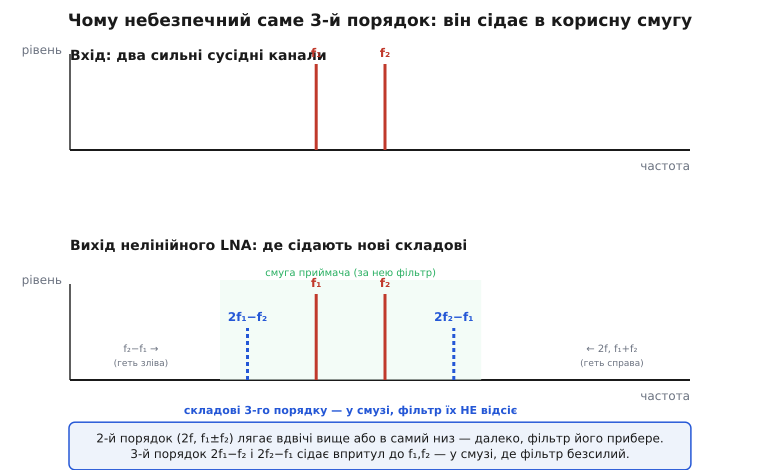
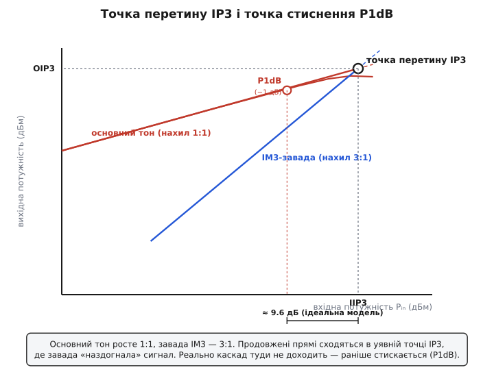

# 🧮 Лінійність LNA числами: звідки беруться завади третього порядку й що таке IP3

Стаття-власник доводить до одного тривожного твердження й лишає його як факт: два сильні сусідні канали, потрапивши в недостатньо лінійний вхідний підсилювач, здатні **народити заваду просто на частоті вашого кволого сигналу** — і ніяке фільтрування її вже не відокремить. Звучить як прокляття. Фільтр — це ж саме той інструмент, яким відсівають усе чуже за частотою; як може бути завада, проти якої фільтр безсилий? І чому винні саме **два** сильні сигнали, а не один? І звідки беруться частоти, яких на вході не було?

Тут ми це розкриємо до кінця — не на пальцях, а з алгеброю, яку можна перевірити рядок за рядком. Спершу побачимо, що нелінійний підсилювач описують **степеневим рядом** передавальної кривої, і простежимо, який саме член цього ряду й чому породжує складові другого, третього та вищих порядків. Тоді стане видно головне: чому з усіх паразитних складових **третій порядок** — найпідступніший, бо дві його комбінації, 2f₁−f₂ і 2f₂−f₁, лягають упритул до самих f₁, f₂, тобто **в середину корисної смуги**, де фільтр уже нічого не вдіє. Далі введемо дві числові мірки лінійності — **точку стиснення на 1 дБ** (P1dB) і **точку перетину третього порядку** (IP3) — виведемо їхній зв'язок (знамените «IP3 ≈ P1dB + 9.6 дБ» не вгадаємо, а **отримаємо** з тієї самої кривої), навчимося читати їх із даташита й завершимо робочим кодом, що рахує рівень інтермодуляційної завади за заданих IIP3 і рівнів двох сильних сусідів.

Шуму тут не буде жодного слова — це окрема половина LNA. Тут лише лінійність: що каскад робить із **сильними** сигналами, коли перестає бути прямою лінією.

## Чому один тон не показує всієї біди: потрібні два

Почнімо з того, що відрізняє цю тему від звичайних спотворень. Коли на нелінійний підсилювач подають **один** сильний тон, він плодить **гармоніки** — складові на кратних частотах 2f, 3f, 4f. Це знайома річ, і її міра — коефіцієнт гармонічних спотворень.

> Як саме крива передавальної характеристики дописує до одного тону кратні частоти — чому квадрат породжує другу гармоніку, куб третю, n-ий степінь рівно n-ту, — строго виведено в [гармонічних спотвореннях](topic:hw-analog/harmonic-distortion). Тут ми беремо звідти готовий апарат — степеневий ряд кривої — і застосовуємо його не до одного тону, а до двох; саме два тони виявляють найнебезпечніше.

Та гармоніки одного тону для радіоприймача — півбіди. Якщо корисний канал на 1000 МГц, а сильний сусід на 950 МГц, то гармоніки сусіда сядуть на 1900, 2850, 3800 МГц — **далеко вгорі**, за межами смуги приймача, і їх легко зріже навіть простий фільтр. Один сильний сигнал шкодить переважно собі.

Біда починається, коли сильних сигналів **два** — а в антені їх завжди більше двох. Тоді нелінійність не просто подвоює-потроює кожну частоту окремо, а **перемішує** їх: породжує складові на всіх сумах і різницях, де частоти беруться з вагами. Саме серед цих змішаних складових і ховається та, що падає в корисну смугу. Тому стандартний спосіб міряти лінійність приймача — це **двотональна** проба (англ. *two-tone test*): на вхід подають два чисті сильні тони рівної амплітуди на близьких частотах f₁ і f₂ й дивляться, які нові частоти народилися й наскільки вони великі. Чому саме два й чому близькі — стане очевидно за хвилину, коли побачимо механізм.

## Підсилювач як степеневий ряд: де ховається нелінійність

Щоб рахувати, потрібна модель того, що каскад робить із миттєвим значенням напруги. Беремо ту саму, що й для гармонік: **статичну нелінійність** — миттєвий вихід залежить лише від миттєвого входу за фіксованою кривою y = f(x), без пам'яті й інерції. Для народження інтермодуляції цього досить: вона родиться з **форми кривої**, а не з частотної залежності.

Будь-яку гладку криву поблизу робочої точки розкладають у степеневий ряд (зсунувши початок у робочу точку й відкинувши сталий член):

```
y = a₁·x + a₂·x² + a₃·x³ + …
```

Кожен коефіцієнт має чіткий зміст. **a₁** — нахил у робочій точці, тобто корисне підсилення (саме його ми хочемо). **a₂** — наскільки крива несиметрично вигнута (одна верхівка приплющена більше за іншу). **a₃** — наскільки вона симетрично сплющена згори й знизу. У доброго підсилювача на малому сигналі працює майже сама пряма a₁·x: усі вищі коефіцієнти малі, бо крихітний сигнал не виходить за прямий шматок характеристики. Чим сильніший сигнал, тим далі він дістає до вигинів — і тим помітніше оживають члени a₂·x², a₃·x³ і вище. Ось чому лінійність — це завжди питання **рівня**: той самий каскад лінійний для слабкого сигналу й нелінійний для сильного.

> 🔧 **Навіщо це.** Ці три коефіцієнти — не абстракція, вони прямо вимірні й прямо задають усі числа лінійності каскаду. a₁ задає підсилення; a₃ задає (як зараз побачимо) точку перетину третього порядку — головну мірку стійкості LNA до сильних сусідів. Виробник транзистора фактично продає вам певний a₃: чим він менший відносно a₁, тим лінійніший каскад. Уся боротьба за лінійність LNA — це боротьба за те, щоб робоча точка й струм давали якнайменший a₃.

Тепер головний хід. Подамо на цю криву не один тон, а **суму двох** чистих тонів рівної амплітуди A на частотах ω₁ і ω₂:

```
x(t) = A·cos(ω₁t) + A·cos(ω₂t)
```

і подивимося, що зробить із цією сумою кожен член ряду. Лінійний член a₁·x просто пропустить обидва тони без змін — він нічого нового не творить. Уся цікавість — у квадраті й кубі.

## Що породжує квадрат: другий порядок, який летить геть зі смуги

Підставмо суму двох тонів у квадратичний член. Розкриваємо квадрат суми:

```
x² = [A·cosω₁t + A·cosω₂t]²
   = A²·cos²ω₁t + A²·cos²ω₂t + 2A²·cosω₁t·cosω₂t
```

Кожен доданок розкладається шкільною тригонометрією. Для квадратів — формула пониження степеня cos²θ = ½ + ½·cos2θ; для добутку — формула добутку косинусів cosα·cosβ = ½·cos(α−β) + ½·cos(α+β):

```
A²·cos²ω₁t  = A²/2 + (A²/2)·cos2ω₁t
A²·cos²ω₂t  = A²/2 + (A²/2)·cos2ω₂t
2A²·cosω₁t·cosω₂t = A²·cos(ω₁−ω₂)t + A²·cos(ω₁+ω₂)t
```

Зберімо, які **частоти** народив квадрат:

```
0          — постійна складова (зсув)
2ω₁, 2ω₂   — другі гармоніки кожного тону
ω₂−ω₁      — різницева частота
ω₁+ω₂      — сумарна частота
```

Це і є **складові другого порядку**: усі вони — суми двох частот, узятих із загальною «вагою два» (2ω₁ — це ω₁+ω₁; ω₁+ω₂ — теж двійка частот). А тепер вирішальне спостереження: **де вони лежать**. Нехай корисний канал десь біля f₁ ≈ f₂ ≈ 1000 МГц, тони близькі: f₁ = 1000, f₂ = 1001 МГц. Тоді:

```
різниця  f₂−f₁ = 1 МГц        — майже постійна, у самому низу спектра
сума     f₁+f₂ = 2001 МГц     — удвічі вище смуги
2f₁,2f₂  ≈ 2000 МГц           — теж удвічі вище
```

Жодна складова другого порядку **не падає в корисну смугу**. Різниця провалюється в самий низ, сума й другі гармоніки злітають удвічі вгору. Усе це — далеко за межами вузької смуги приймача, і **звичайний фільтр їх прибирає легко**. Другий порядок шкодить лише там, де приймач широкосмуговий або де різницева/сумарна частота випадково потрапляє в інший його канал; для вузькосмугового LNA він майже нешкідливий саме через те, що його продукти летять геть зі смуги.

Запам'ятаймо причину: у складовій другого порядку частоти додаються з вагами, що дають у сумі ±2 або 0, — тому результат або вдвічі вищий, або майже нульовий, але **ніколи не лишається біля вихідних f₁, f₂**. Для біди треба, щоб нова частота опинилася **поряд** із корисною. Це вміє лише наступний член.

## Що породжує куб: третій порядок, і дві його складові сідають у смугу

Тепер кубічний член — серце всієї теми. Підставмо суму двох тонів у x³. Це довший розклад, але кожен крок — та сама тригонометрія. Куб суми:

```
x³ = [A·cosω₁t + A·cosω₂t]³
   = A³·cos³ω₁t + A³·cos³ω₂t
     + 3A³·cos²ω₁t·cosω₂t + 3A³·cosω₁t·cos²ω₂t
```

Куби кожного тону дають, як у задачі з одним тоном, основну частоту й третю гармоніку (cos³θ = ¾cosθ + ¼cos3θ): тобто ω₁, 3ω₁ та ω₂, 3ω₂. Треті гармоніки 3ω₁, 3ω₂ злітають утричі вгору — далеко, як і другий порядок. Цікаве — у **змішаних** членах cos²ω₁t·cosω₂t. Розкладемо один із них. Спершу cos²ω₁t = ½ + ½cos2ω₁t, тоді

```
cos²ω₁t·cosω₂t = ½·cosω₂t + ½·cos2ω₁t·cosω₂t
```

а добуток cos2ω₁t·cosω₂t = ½·cos(2ω₁−ω₂)t + ½·cos(2ω₁+ω₂)t. Підставивши, дістаємо в члені 3A³·cos²ω₁t·cosω₂t такі частоти:

```
ω₂            — підспівка до основного тону
2ω₁ − ω₂      ← ось вона
2ω₁ + ω₂      — летить угору, далеко
```

Симетрично, член 3A³·cosω₁t·cos²ω₂t народжує 2ω₂−ω₁ і 2ω₂+ω₁. Зберімо всі **нові** частоти третього порядку, відкинувши ті, що злітають угору (треті гармоніки й суми 2ω+ω):

```
2ω₁ − ω₂      — третій порядок, складова «зліва»
2ω₂ − ω₁      — третій порядок, складова «справа»
```

І ось де ховалося прокляття. Підставмо ті самі числа f₁ = 1000, f₂ = 1001 МГц:

```
2f₁ − f₂ = 2·1000 − 1001 =  999 МГц     ← на 1 МГц нижче f₁
2f₂ − f₁ = 2·1001 − 1000 = 1002 МГц     ← на 1 МГц вище f₂
```

Ці дві складові сідають **просто обабіч корисних тонів**, на тій самій відстані 1 МГц, що й розрив між тонами. Вони **в корисній смузі**. Якщо ваш кволий сигнал стоїть якраз на 999 МГц — а він цілком може там стояти, — нова завада ляже **точно на нього**, з тієї самої антени, народжена двома сильними сусідами в самому вашому LNA. І ніякий фільтр її не візьме: за частотою вона невідрізненна від корисного. Фільтр відсіює чуже **за частотою**; а ця завада сидить на **тій самій** частоті, що й сигнал. Проти неї фільтр такий самий безсилий, як ніж проти тіні.


*Два сильні сусідні канали f₁, f₂ на вході. На виході нелінійного каскаду складові другого порядку (2f, f₁±f₂) лягають удвічі вище або в самий низ — далеко, фільтр їх прибере. А складові третього порядку 2f₁−f₂ і 2f₂−f₁ сідають упритул до f₁, f₂, у самій смузі приймача, — там, де фільтр уже безсилий.*

Тепер видно, чому **два** тони, а не один, і чому **близькі**. Один тон дає лише гармоніки — вони далеко. Потрібні два, щоб з'явилися комбінації 2ω₁−ω₂; і що **ближче** тони, то ближче ці комбінації підсуваються до них самих (різниця між 2f₁−f₂ і f₁ дорівнює f₁−f₂). Близькі сильні сусіди — найгірший випадок, і саме ним міряють лінійність.

> 🔧 **Навіщо це.** Це пояснює, чому в радіо так бояться слова «інтермодуляція». GPS-приймач у телефоні має кволий сигнал на 1575 МГц; поряд гримлять стільникові передавачі. Якщо їхні частоти стоять так, що 2f₁−f₂ падає на 1575 МГц, могутні сусіди народять у вхідному LNA заваду просто на GPS — і приймач «осліпне» не тому, що сусід гучний на частоті GPS (там його нема), а тому, що LNA сам зварив заваду з двох чужих сигналів. Лінійність LNA — це і є запас проти такого «варива».

## Закон 3:1 — чому третій порядок росте втричі швидше

У кубічних доданках сховано друге важливе передбачення — як **швидко** росте завада з рівнем сильних сусідів. Подивіться на амплітуду складової 2ω₁−ω₂. Збираючи коефіцієнти при cos(2ω₁−ω₂)t із члена 3a₃·cos²ω₁t·cosω₂t (множник ½·½ від двох розкладів, помножений на 3), дістаємо:

```
амплітуда IM3-складової = (3/4)·a₃·A³
```

Вона росте **як куб** амплітуди вхідних тонів A. А корисний основний тон росте лінійно (≈ a₁·A). Звідси — наріжний для всієї теми **закон нахилів**:

```
основний тон:   вихід ∝ A¹    →  +1 дБ входу даєт +1 дБ виходу
завада IM3:     вихід ∝ A³    →  +1 дБ входу даєт +3 дБ завади
```

Підніміть рівень обох сильних сусідів на 1 дБ — корисний відгук підросте на 1 дБ, а інтермодуляційна завада підскочить на **3 дБ**. На кожен децибел сильнішого «оточення» завада третього порядку додає три. Це і є та крутість, через яку інтермодуляція «вмикається раптом»: доки сусіди помірні, завада десь глибоко внизу, її не видно; підросли сусіди на кілька дБ — і завада, втричі прудкіша, вистрибує з-під шумової підлоги й накриває сигнал.

Цей закон 3:1 — не лише пророцтво біди, а й **інструмент вимірювання**. Якщо завада росте втричі прудкіше за сигнал, то на графіку «вихід від входу» в децибелах це дві прямі з нахилами 1 і 3. Вони сходяться. Точку, де вони сходяться, і беруть за єдину мірку лінійності — бо одна ця точка задає обидві прямі повністю.

## Точка перетину третього порядку: одне число замість двох прямих

Ось означення, заради якого все будувалося.

**Точка перетину третього порядку** (англ. *third-order intercept point*, IP3) — це той рівень сигналу, на якому, **якби обидві прямі продовжувалися без загину**, лінія корисного основного тону й лінія завади третього порядку **зійшлися б** на одній висоті. У цій уявній точці завада «наздогнала» б корисний сигнал — зрівнялася б із ним за рівнем.

Слово «якби» тут не випадкове, і його треба зрозуміти, інакше IP3 здається містикою. **Реальний каскад у цю точку ніколи не доходить.** Задовго до неї він стискається (про це далі) і перестає підкорятися прямим. IP3 — це **екстраполяція**: беруть дві прямі там, де вони ще прямі (на помірних рівнях, де закони 1:1 і 3:1 чесно виконуються), подумки продовжують їх угору й дивляться, де вони перетнуться. Перетин лежить **вище** за все, що каскад фізично віддає, — це фіктивна, розрахункова точка. Але саме тому вона зручна: одне число, не залежне від рівня вимірювання, що повністю задає, наскільки малі завади третього порядку на **будь-якому** робочому рівні.


*Основний тон росте з нахилом 1:1, завада третього порядку — 3:1. Продовжені пунктиром прямі сходяться в уявній точці перетину IP3 (по входу — IIP3, по виходу — OIP3). Реально каскад туди не доходить: справжня крива основного тону раніше загинається — це стиснення, і його мірять точкою P1dB, що лежить приблизно на 9.6 дБ нижче за IIP3.*

IP3 називають **двома** числами — дивлячись, чи міряти рівень на вході, чи на виході:

```
IIP3  (input IP3)   — рівень перетину, зведений до ВХОДУ підсилювача
OIP3  (output IP3)  — той самий перетин, зведений до ВИХОДУ
OIP3 = IIP3 + G     — різняться рівно на підсилення каскаду G (у дБ)
```

Для LNA частіше дивляться на **IIP3** — він каже, який сильний сигнал **на вході** каскад терпить, перш ніж завада стане відчутною; це природна мова, коли йдеться про стійкість входу до сусідів. OIP3 зручніший, коли рахують каскади тракту разом. Перехід між ними — просто додавання підсилення, бо і сигнал, і завада на виході вищі за вхідні рівно на G.

> 🔧 **Навіщо це.** Чим **вищий** IIP3, тим лінійніший LNA — тим сильніших сусідів він стерпить, не наплодивши завад. Це число прямо протистоїть шумовому: тихий режим хоче малого струму, а високий IIP3 хоче струму більшого (більший струм відсуває вигини кривої далі, зменшує відносний a₃). Тому в даташиті LNA IIP3 і коефіцієнт шуму стоять поруч як дві ворожі цифри, і вибір робочого струму — це торг між ними. Підсилювач для «чистого» діапазону тягнуть до низького шуму; підсилювач для входу, забитого сильними сусідами (приймач біля передавачів), тягнуть до високого IIP3, жертвуючи десятими шуму.

## Як завада залежить від IP3: формула, що рахує біду

Тепер видобудемо з геометрії двох прямих робочу формулу — наскільки **глибоко** під корисним сигналом сидить завада за заданих IIP3 і рівня сусідів. Це те, заради чого IP3 узагалі введено.

Працюймо в децибелах і зведемо все до **входу**. Нехай кожен із двох сильних сусідів має на вході рівень Pᵢₙ (дБм), а точка перетину по входу — IIP3 (дБм). Введемо «відступ від перетину» — наскільки наш сигнал нижчий за точку перетину:

```
Δ = IIP3 − Pᵢₙ     (дБ, завжди додатне: робочий рівень нижчий за IP3)
```

На графіку основний тон і завада в точці перетину рівні. Спускаючись від перетину вниз на Δ децибелів по входу, ми йдемо двома прямими різного нахилу. Основний тон (нахил 1) опускається на 1·Δ. Завада (нахил 3) опускається на 3·Δ — утричі швидше. Тож на нашому робочому рівні завада виявляється **нижчою за основний тон** на різницю цих спусків:

```
розрив (дБ) = 3·Δ − 1·Δ = 2·Δ = 2·(IIP3 − Pᵢₙ)
```

Ось ключове співвідношення лінійності, усе вкладене в один рядок:

```
наскільки завада IM3 нижча за корисний сигнал  =  2·(IIP3 − Pᵢₙ)   [дБ, dBc]
```

Прочитаймо його. Завада нижча за сигнал на **подвоєний** відступ від точки перетину. Відсуньтеся від IP3 на 30 дБ (тобто сильні сусіди на 30 дБ слабші за точку перетину) — завада буде на 60 дБ під корисним, тобто мізерна. Підпустіть сусідів на 10 дБ ближче до IP3 — завада підскочить на 20 дБ. **Подвоєння** тут — пряме обличчя закону 3:1 мінус 1:1.

А **абсолютний рівень** завади на виході (часто саме його хочуть знати — чи вилізе вона з-під шумової підлоги):

```
рівень IM3 на виході (дБм) = 3·Pᵢₙ − 2·IIP3 + G
```

(виходить підстановкою: вихідний корисний = Pᵢₙ + G, а завада нижча за нього на 2(IIP3−Pᵢₙ); G — підсилення). Ця формула — пряме знаряддя: знаючи з даташита IIP3 і G, а з обстановки — рівень сусідів, рахуєш, на якій висоті сяде завада, і порівнюєш із шумовою підлогою приймача. Якщо завада нижча за підлогу — вона потоне в шумі й не зашкодить; якщо вища — приймач осліпне. Саме це й кодуємо наприкінці.

## Точка стиснення на 1 дБ: де каскад починає здаватися

Поряд з IP3 у кожному даташиті стоїть друга мірка лінійності — **точка стиснення на 1 дБ** (англ. *1 dB compression point*, P1dB). Вона про інший бік тієї самої нелінійності — не про народження завад від двох тонів, а про **стиснення** самого корисного сигналу.

Згадаймо: амплітуда основного тону на виході — не просто a₁·A. Кубічний член підмішує до основної частоти ще доданок (його ми бачили в розкладі cos³). Для одного тону повна амплітуда основної частоти на виході:

```
вихід на основній частоті = a₁·A + (3/4)·a₃·A³ = (a₁ + ¾·a₃·A²)·A
```

У реальних підсилювачів a₃ **протилежного знаку** до a₁ (характеристика з ростом сигналу загинається донизу, насичується). Тому з ростом A доданок ¾a₃A² **віднімається** від a₁ — ефективне підсилення (a₁ + ¾a₃A²) **спадає**. Каскад на великому сигналі підсилює слабше, ніж на малому: крива «вихід від входу» загинається, відстає від прямої. Це й є стиснення (компресія).

**Точка стиснення на 1 дБ** — це рівень, на якому ефективне підсилення просіло рівно на 1 дБ проти лінійного (малосигнального). Тобто реальний вихід на 1 дБ нижчий, ніж дала б ідеальна пряма a₁·A. Її теж називають по входу (вхідна P1dB) і по виходу (вихідна), і вони різняться на підсилення мінус той самий 1 дБ.

Чому беруть саме **1 дБ**, а не 2 чи 3? Це домовленість, але розумна: 1 дБ — це вже надійно вимірне відхилення (≈ 11% за напругою), але ще не глибоке насичення; це той рубіж, де каскад **починає** помітно здаватися, природна межа «лінійної» роботи. Працювати **вище** P1dB означає свідомо м'яти сигнал; робочий рівень тримають із запасом **нижче**.

## Звідки 9.6 дБ: зв'язок P1dB та IP3 не вгадуємо, а виводимо

І P1dB, і IP3 ростуть з того самого кубічного коефіцієнта a₃ — обидві міряють той самий загин кривої, лише по-різному. Отже, між ними мусить бути зв'язок. Виведімо його — бо знамените правило «IP3 ≈ P1dB + 9.6 дБ» набагато корисніше зрозуміти, ніж завчити.

Працюємо з одним тоном (так визначені обидві точки в цьому виведенні) і з кубічною моделлю. Позначимо |a₃/a₁| = r — відносну кривину.

**Точка стиснення.** Ефективне підсилення (a₁ − ¾|a₃|A²) просіло на 1 дБ означає, що його модуль становить 10^(−1/20) = 0.8913 від a₁:

```
1 − ¾·r·A₁dB² = 0.8913
¾·r·A₁dB²    = 0.10875
A₁dB²        = 0.145 / r            (бо 0.10875·4/3 = 0.145)
```

**Точка перетину** (одно­тональне означення). Прямі сходяться, коли лінійний доданок дорівнює кубічному за модулем:

```
a₁·A = ¾·|a₃|·A_IP3³
A_IP3² = (4/3)·(a₁/|a₃|) = (4/3)/r = 1.333 / r
```

**Відношення** двох рівнів (квадрати, бо потужність ∝ A²):

```
A_IP3² / A₁dB² = (1.333/r) / (0.145/r) = 9.20
```

Дивовижно: невідома кривина r **скоротилася**. Відношення — чисте число, однакове для будь-якого каскаду в межах кубічної моделі. Переведемо в децибели (потужність):

```
IP3 − P1dB = 10·log₁₀(9.20) = 9.64 дБ ≈ 9.6 дБ
```

Ось воно — не з підручника, а з власної алгебри. **У кубічній моделі точка перетину лежить рівно на 9.6 дБ вище за точку стиснення**, і це число не залежить ні від чого, бо a₃ вийшло з обох боків і скоротилося. Тому в першому наближенні, не маючи в даташиті IP3, його прикидають як P1dB + 9.6 дБ (а навпаки — P1dB ≈ IP3 − 9.6 дБ).

Чому ж у літературі частіше кажуть «**9..15 дБ**», а не точні 9.6? Бо реальний каскад — не чистий куб. Поблизу стиснення оживають вищі члени ряду (a₅ і далі), знаки й величини яких залежать від конкретного транзистора, режиму, частоти. Вони зсувають точку стиснення, не чіпаючи так само екстрапольованої IP3, — і розрив «розповзається». Практичні цифри: близько **10 дБ** для мікрохвильових підсилювачів, **до 15 дБ** на нижчих частотах (HF/VHF). Тому 9.6 дБ — це **теоретичне дно** й орієнтир, а не закон: точного універсального зв'язку між P1dB та IP3 немає, і **серйозний розрахунок завжди бере IP3 з вимірювання чи даташита, а не з P1dB**. (Статус: 9.6 дБ — точний наслідок кубічної моделі, стандартний результат теорії нелінійних кіл; діапазон 9..15 дБ — емпіричне правило, добре задокументоване в довідниках РЧ-техніки.)

> 🔧 **Навіщо це.** Правило 9.6 дБ рятує, коли в даташиті дано лише одне з двох чисел. Дали P1dB = +5 дБм, треба прикинути IIP3 — береш ≈ +14...+15 дБм і знаєш, чого приблизно чекати від сусідів. Але якщо лінійність критична (приймач коло потужних передавачів), на цю прикидку не покладаються: вимагають виміряний IIP3, бо реальний розрив може бути й 12, і 14 дБ, а це для запасу по інтермодуляції — істотна різниця.

## Як це лежить у даташиті й що з чим зіставляти

Зведімо мову даташита докупи, бо саме там ці числа доводиться читати й перераховувати.

```
NF          коефіцієнт шуму (дБ)      — наскільки псує SNR (інша половина LNA)
Gain (G)    підсилення (дБ)
P1dB        точка стиснення на 1 дБ   — звичайно вихідна (OP1dB), іноді вхідна
OIP3 / IIP3 точка перетину 3-го пор.  — вихідна / вхідна
```

Кілька практичних правил перерахунку, усі — пряме наслідування означень:

```
OIP3 = IIP3 + G        перехід вхід↔вихід — додати/відняти підсилення
IIP3 ≈ вхідна P1dB + 9.6 дБ      (груба прикидка, якщо IP3 не дано)
вхідна P1dB = OP1dB − G + 1 дБ   (вихідну стиснену точку звести до входу)
```

Найчастіша пастка — **сплутати вхідні й вихідні** значення. Якщо взяти OIP3 там, де треба IIP3, помилишся рівно на підсилення — а для LNA це 15–25 дБ, тобто груба похибка. Тому, читаючи число, завжди питай: воно зведене до входу чи до виходу? Для оцінки стійкості входу до сусідів потрібен **IIP3**; якщо в даташиті лише OIP3 — відніми підсилення.

Друге зіставлення — з шумом. У LNA два головні числа тягнуть у різні боки: малий **NF** хоче малого струму, високий **IIP3** — більшого. Їхня різниця задає **динамічний діапазон без спотворень** (англ. *spurious-free dynamic range*) — від шумової підлоги внизу до рівня, де завади IM3 виходять із цієї підлоги вгорі. Це і є вся «робоча шпарина» приймача: тихіше підлоги не почуєш, гучніше стелі — наплодиш завад.

> Як шумова підлога й рівень інтермодуляційних завад разом окреслюють вікно рівнів, у якому приймач працює чисто, і чому його звуть динамічним діапазоном без спотворень, — у [динамічному діапазоні](topic:hw-analog/dynamic-range). Тут досить тримати в голові: IIP3 ставить **верхню** межу цього вікна, а коефіцієнт шуму — нижню.

## Робочий приклад: чи зашкодить завада, рахунок на C

Зведімо весь апарат до коду, який реально лежить у розрахунку радіотракту чи в прошивці, що оцінює обстановку. Задача типова: відомий IIP3 нашого LNA, відомі підсилення й шумова підлога приймача, відомий рівень двох сильних сусідів на вході — треба знати, **на якій висоті сяде завада третього порядку** і **чи вилізе вона з-під шумової підлоги** (тобто чи зашкодить).

Усе спирається на два виведені рядки: розрив завади під сигналом = 2·(IIP3 − Pᵢₙ), а абсолютний вихідний рівень завади = 3·Pᵢₙ − 2·IIP3 + G.

**Рівень IM3-завади за заданих IIP3 і рівня сусідів.** LNA: IIP3 = −10 дБм (по входу), підсилення 18 дБ, шумова підлога на виході −95 дБм. На вхід прийшли два сильні сусідні канали по −30 дБм кожен. На якій висоті сяде завада 2f₁−f₂ і наскільки вона над/під шумовою підлогою?

:::tabs
```cpp
// Усе в дБ / дБм. Модель — третій порядок (нахили 1:1 і 3:1).
struct LnaLin {
    float iip3_dBm;            // точка перетину 3-го порядку, зведена до ВХОДУ
    float gain_dB;             // підсилення каскаду
    float noise_floor_out_dBm; // шумова підлога приймача на ВИХОДІ
};

// Наскільки завада IM3 нижча за корисний сигнал (у dBc), за рівня сусіда p_in:
//   розрив = 2·(IIP3 − Pin)
float im3_below_carrier_dBc(const LnaLin& d, float p_in_dBm)
{
    return 2.0f * (d.iip3_dBm - p_in_dBm);       // завжди додатне число дБ «вниз»
}

// Абсолютний рівень IM3-завади на ВИХОДІ (дБм):
//   корисний на виході = Pin + G;  завада нижча за нього на розрив
float im3_output_level_dBm(const LnaLin& d, float p_in_dBm)
{
    const float carrier_out = p_in_dBm + d.gain_dB;      // вихідний корисний тон
    return carrier_out - im3_below_carrier_dBc(d, p_in_dBm);
    // рівносильно: 3*Pin − 2*IIP3 + G
}

// Запас завади над шумовою підлогою (дБ): >0 — завада вилазить з-під підлоги (шкодить);
//   <0 — тоне в шумі (нешкідлива на цьому рівні сусідів).
float im3_margin_over_floor_dB(const LnaLin& d, float p_in_dBm)
{
    return im3_output_level_dBm(d, p_in_dBm) - d.noise_floor_out_dBm;
}

void demo()
{
    const LnaLin lna{
        .iip3_dBm            = -10.0f,   // IIP3 = −10 дБм
        .gain_dB             =  18.0f,   // G = 18 дБ
        .noise_floor_out_dBm = -95.0f,   // підлога на виході
    };
    const float p_in = -30.0f;           // два сусіди по −30 дБм

    const float below   = im3_below_carrier_dBc(lna, p_in);   // 2·(−10 −(−30)) = 40 дБ
    const float im3_out = im3_output_level_dBm(lna, p_in);    // (−30+18) − 40 = −52 дБм
    const float margin  = im3_margin_over_floor_dB(lna, p_in);// −52 −(−95) = +43 дБ

    // below   ≈ 40 дБ   — завада на 40 дБ під корисним сигналом
    // im3_out ≈ −52 дБм — абсолютний рівень завади на виході
    // margin  ≈ +43 дБ  — завада НА 43 дБ ВИЩЕ підлоги → виразно шкодить!
    (void)below; (void)im3_out; (void)margin;

    // Який рівень сусідів каскад іще терпить? Прирівняймо заваду до підлоги:
    //   3*Pin − 2*IIP3 + G = floor  →  Pin = (floor + 2*IIP3 − G)/3
    const float p_in_max = (lna.noise_floor_out_dBm + 2.0f*lna.iip3_dBm - lna.gain_dB) / 3.0f;
    // = (−95 + 2·(−10) − 18)/3 = (−95 −20 −18)/3 = −133/3 ≈ −44.3 дБм
    // Тобто поки сусіди слабші за ≈ −44 дБм, завада сидить під підлогою.
    (void)p_in_max;
}
```
```c
#include <math.h>

// Усе в дБ / дБм. Модель — третій порядок (нахили 1:1 і 3:1).
typedef struct {
    float iip3_dBm;       // точка перетину 3-го порядку, зведена до ВХОДУ
    float gain_dB;        // підсилення каскаду
    float noise_floor_out_dBm; // шумова підлога приймача на ВИХОДІ
} lna_lin_t;

// Наскільки завада IM3 нижча за корисний сигнал (у dBc), за рівня сусіда p_in:
//   розрив = 2·(IIP3 − Pin)
float im3_below_carrier_dBc(const lna_lin_t *d, float p_in_dBm)
{
    return 2.0f * (d->iip3_dBm - p_in_dBm);     // завжди додатне число дБ «вниз»
}

// Абсолютний рівень IM3-завади на ВИХОДІ (дБм):
//   корисний на виході = Pin + G;  завада нижча за нього на розрив
float im3_output_level_dBm(const lna_lin_t *d, float p_in_dBm)
{
    float carrier_out = p_in_dBm + d->gain_dB;            // вихідний корисний тон
    return carrier_out - im3_below_carrier_dBc(d, p_in_dBm);
    // рівносильно: 3*Pin − 2*IIP3 + G
}

// Запас завади над шумовою підлогою (дБ): >0 — завада вилазить з-під підлоги (шкодить);
//   <0 — тоне в шумі (нешкідлива на цьому рівні сусідів).
float im3_margin_over_floor_dB(const lna_lin_t *d, float p_in_dBm)
{
    return im3_output_level_dBm(d, p_in_dBm) - d->noise_floor_out_dBm;
}

void demo(void)
{
    lna_lin_t lna = {
        .iip3_dBm            = -10.0f,   // IIP3 = −10 дБм
        .gain_dB             =  18.0f,   // G = 18 дБ
        .noise_floor_out_dBm = -95.0f,   // підлога на виході
    };
    float p_in = -30.0f;                 // два сусіди по −30 дБм

    float below   = im3_below_carrier_dBc(&lna, p_in);   // 2·(−10 −(−30)) = 40 дБ
    float im3_out = im3_output_level_dBm(&lna, p_in);     // (−30+18) − 40 = −52 дБм
    float margin  = im3_margin_over_floor_dB(&lna, p_in); // −52 −(−95) = +43 дБ

    // below   ≈ 40 дБ   — завада на 40 дБ під корисним сигналом
    // im3_out ≈ −52 дБм — абсолютний рівень завади на виході
    // margin  ≈ +43 дБ  — завада НА 43 дБ ВИЩЕ підлоги → виразно шкодить!
    (void)below; (void)im3_out; (void)margin;

    // Який рівень сусідів каскад іще терпить? Прирівняймо завto до підлоги:
    //   3*Pin − 2*IIP3 + G = floor  →  Pin = (floor + 2*IIP3 − G)/3
    float p_in_max = (lna.noise_floor_out_dBm + 2.0f*lna.iip3_dBm - lna.gain_dB) / 3.0f;
    // = (−95 + 2·(−10) − 18)/3 = (−95 −20 −18)/3 = −133/3 ≈ −44.3 дБм
    // Тобто поки сусіди слабші за ≈ −44 дБм, завада сидить під підлогою.
    (void)p_in_max;
}
```
```python
from dataclasses import dataclass

# Усе в дБ / дБм. Модель — третій порядок (нахили 1:1 і 3:1).
@dataclass
class LnaLin:
    iip3_dBm: float            # точка перетину 3-го порядку, зведена до ВХОДУ
    gain_dB: float             # підсилення каскаду
    noise_floor_out_dBm: float # шумова підлога приймача на ВИХОДІ

# Наскільки завада IM3 нижча за корисний сигнал (у dBc), за рівня сусіда p_in:
#   розрив = 2·(IIP3 − Pin)
def im3_below_carrier_dBc(d: LnaLin, p_in_dBm: float) -> float:
    return 2.0 * (d.iip3_dBm - p_in_dBm)         # завжди додатне число дБ «вниз»

# Абсолютний рівень IM3-завади на ВИХОДІ (дБм):
#   корисний на виході = Pin + G;  завада нижча за нього на розрив
def im3_output_level_dBm(d: LnaLin, p_in_dBm: float) -> float:
    carrier_out = p_in_dBm + d.gain_dB           # вихідний корисний тон
    return carrier_out - im3_below_carrier_dBc(d, p_in_dBm)
    # рівносильно: 3*Pin − 2*IIP3 + G

# Запас завади над шумовою підлогою (дБ): >0 — завада вилазить з-під підлоги (шкодить);
#   <0 — тоне в шумі (нешкідлива на цьому рівні сусідів).
def im3_margin_over_floor_dB(d: LnaLin, p_in_dBm: float) -> float:
    return im3_output_level_dBm(d, p_in_dBm) - d.noise_floor_out_dBm

def demo() -> None:
    lna = LnaLin(
        iip3_dBm            =-10.0,   # IIP3 = −10 дБм
        gain_dB             = 18.0,  # G = 18 дБ
        noise_floor_out_dBm =-95.0,  # підлога на виході
    )
    p_in = -30.0                     # два сусіди по −30 дБм

    below   = im3_below_carrier_dBc(lna, p_in)   # 2·(−10 −(−30)) = 40 дБ
    im3_out = im3_output_level_dBm(lna, p_in)    # (−30+18) − 40 = −52 дБм
    margin  = im3_margin_over_floor_dB(lna, p_in)# −52 −(−95) = +43 дБ

    # below   ≈ 40 дБ   — завада на 40 дБ під корисним сигналом
    # im3_out ≈ −52 дБм — абсолютний рівень завади на виході
    # margin  ≈ +43 дБ  — завада НА 43 дБ ВИЩЕ підлоги → виразно шкодить!

    # Який рівень сусідів каскад іще терпить? Прирівняймо заваду до підлоги:
    #   3*Pin − 2*IIP3 + G = floor  →  Pin = (floor + 2*IIP3 − G)/3
    p_in_max = (lna.noise_floor_out_dBm + 2.0*lna.iip3_dBm - lna.gain_dB) / 3.0
    # = (−95 + 2·(−10) − 18)/3 = (−95 −20 −18)/3 = −133/3 ≈ −44.3 дБм
    # Тобто поки сусіди слабші за ≈ −44 дБм, завада сидить під підлогою.
```
:::

Розберімо, що показав рахунок, бо в ньому — вся практика теми. Сусіди по −30 дБм народили заваду на −52 дБм, **на 43 дБ вище** за шумову підлогу −95 дБм. Це катастрофа: завада не просто видніється — вона гримить над підлогою, і якщо ваш кволий корисний сигнал стоїть на 999 МГц, він під нею похований. Останній рядок показує **межу терпіння**: щоб завада сховалася під підлогу, сусіди мають бути слабшими за ≈ −44 дБм. Між нашими −30 і дозволеними −44 — розрив 14 дБ, на які LNA «не дотягує» для цієї обстановки.

Що з цим робить інженер? Три важелі, усі видно з формул. **Підняти IIP3** (вибрати лінійніший LNA або більший струм): кожен +1 дБ до IIP3 опускає заваду на 2 дБ — найдієвіший важіль. **Послабити сусідів до LNA** (поставити перед ним фільтр, що вріже саме їхні частоти, поки вони ще нарізно й фільтр їх бере): кожен −1 дБ сусідам опускає заваду на 3 дБ. **Зменшити підсилення** — опускає й заваду, і сигнал нарівні, тож саме від інтермодуляції не рятує, зате розвантажує наступний каскад. Закон 3:1 робить перші два важелі такими сильними: завада прудка вниз так само, як прудка вгору.

> 🔧 **Навіщо це.** Саме такий рахунок вирішує, чи буде приймач працювати в реальному ефірі, а не в тиші лабораторії. «LNA з NF 0.5 дБ» звучить чудово, але якщо його IIP3 низький, у місті біля передавачів він наплодить завад і осліпне — а тихий приймач, що глухне від сусідів, нікому не потрібен. Тому поряд із коефіцієнтом шуму завжди рахують оцей запас по інтермодуляції; обидва числа разом, а не кожне окремо, кажуть, чи почує приймач слабке серед сильного.

## Що з цього лишається

Уся лінійність LNA виростає з одного: реальний підсилювач — не пряма, а крива, і її розклад y = a₁x + a₂x² + a₃x³ + … показує механізм точно. Квадратичний член від двох сильних тонів плодить складові другого порядку (2f, f₁±f₂), та всі вони летять геть зі смуги — удвічі вгору або в самий низ, — тож фільтр їх бере. **Кубічний** член народжує дві складові третього порядку, 2f₁−f₂ і 2f₂−f₁, і саме вони сідають упритул до f₁, f₂ — **у корисну смугу**, де фільтр безсилий: завада за частотою невідрізненна від сигналу. Через множник A³ ця завада росте з рівнем сусідів **утричі прудкіше** за корисний сигнал (закон 3:1), і ця крутість веде до єдиної мірки — **точки перетину IP3**, де уявно продовжені прямі сигналу (нахил 1) і завади (нахил 3) зійшлися б; реально каскад туди не доходить, тож IP3 — це екстраполяція, зате одне число (IIP3 по входу, OIP3 = IIP3 + G по виходу) повністю задає рівень завад на будь-якому робочому рівні: завада нижча за сигнал на 2·(IIP3 − Pᵢₙ). Поряд стоїть **точка стиснення P1dB** — де самé підсилення просіло на 1 дБ; обидві ростуть з того самого a₃, тому пов'язані, і кубічна модель дає точний розрив **9.6 дБ** (на практиці 10..15 дБ через вищі члени — тож серйозний розрахунок бере IP3 з вимірювання, не з P1dB). А зведена до коду формула 3·Pᵢₙ − 2·IIP3 + G каже наперед, чи вилізе завада з-під шумової підлоги, тобто чи зашкодить, — і ставить верхню межу робочого вікна приймача рівно так, як коефіцієнт шуму ставить нижню. Хто бачить за прямою її степеневий ряд, а в кубі — дві частоти, що падають у смугу, той розуміє не лише *що* сильний сусід зробить кволому сигналу, а й *чому* проти цього безсилий фільтр і *скільки саме* лінійності треба, щоб вистояти.
