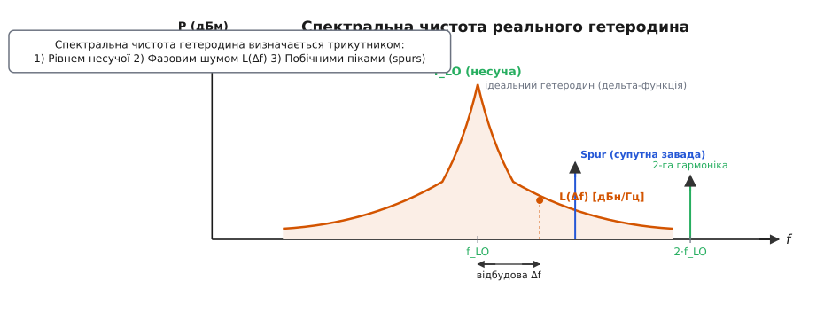
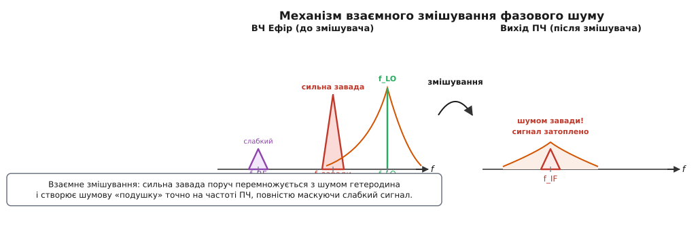
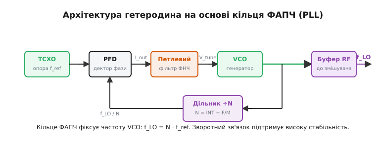
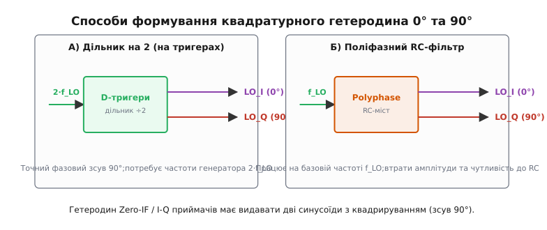

# Гетеродин

<preknowlist>
- [Супергетеродин](topic:hw-analog/superheterodyne) — концепція переносу радіочастоти на проміжну за допомогою змішування.
- [Генератор Пірса](topic:hw-analog/pierce-oscillator) — базовий кварцовий генератор синусоїдальних коливань.
</preknowlist>

Коли радіоприймач або трансивер налаштовується на станцію 100 МГц, усередині його корпусу на повну потужність працює власний внутрішній передавач. Він не випромінює сигнал у простори через антену, але генерує чисту синусоїду високої частоти — наприклад, 110.7 МГц. Якщо цей внутрішній генератор раптом зсунеться за частотою хоча б на кілька кілогерц від нагріву плати або схибить за фазою від шуму живлення, приймач миттєво втратить зв'язок: корисна станція зникне з налаштованого каналу, а демодулятор видасть лише шум або спотворений тріск.

Цей внутрішній генератор високочастотних коливань називається **гетеродином** (англ. *Local Oscillator*, або скорочено **LO**). Назва походить від грецьких слів *heteros* («інший») та *dynamis* («сила, потужність») — її ввів у 1905 році канадський винахідник Реджинальд Фессенден, який запропонував подавати на змішувач «іншу, власну силу-частоту» для прийому незагасаючих радіосигналів. Базові віхи того, як ідея бить подолала технологічну прірву від дугових генераторів до електронних ламп, розкрито в [історії винайдення гетеродинного принципу Реджинальдом Фессенденом](topic:hw-analog/local-oscillator/hist-fessenden-heterodyne.md).

Сьогодні гетеродин є серцем будь-якого радіочастотного тракту — від класичного FM-приймача до чипів Wi-Fi 6, 5G-модемів, супутникових конвертерів та радарів. Розберімося, як працює ця «частотна ручка», від чого залежить її якість та чому саме чистота гетеродина визначає граничну чутливість і вибірковість усієї системи.

---

### Серце радіотракту: як гетеродин керує змішувачем

Головне завдання гетеродина — давати високостабільний синусоїдальний сигнал опорної частоти f_LO та амплітуди, достатньої для перемикання елементів змішувача. 

У супергетеродинній схемі прийнятий з антени сигнал високочастотного діапазону f_RF надходить на вхід змішувача (*Mixer*). Змішувач здійснює аналогову операцію множення двох сигналів: v_RF(t) × v_LO(t). Результатом множення двох синусоїдальних коливань є виникнення сумарної f_RF + f_LO та різницевої f_RF − f_LO частот. 

```
вхід 1:  v_RF(t) = A_RF · cos(2π · f_RF · t)
вхід 2:  v_LO(t) = A_LO · cos(2π · f_LO · t)
вихід:   v_out(t) = ½ · A_RF · A_LO · [ cos(2π · (f_RF − f_LO) · t) + cos(2π · (f_RF + f_LO) · t) ]
```

Сумарна частота відфільтровується, а різницева стає **проміжною частотою** f_IF (*Intermediate Frequency*). Таким чином, гетеродин виступає в ролі «частотного важеля»: змінюючи його частоту f_LO, ми можемо перенести будь-яку прийняту станцію в ефірі точно на сталу частоту IF, де розміщено гострі канальні фільтри й підсилювачі.

#### Вимоги до потужності та розв'язки гетеродина

Змішувачі радіосигналів бувають пасивними (наприклад, кільцеві діодні змішувачі) та активними (на осередках Гілберта). Для пасивних діодних змішувачів гетеродин є не просто інформаційним сигналом, а **джерелом енергії**, що почергово відкриває й закриває діоди. 

Такий змішувач вимагає від гетеродина значної потужності — наприклад, рівень +7 дБм (5 мВт) для стандартного змішувача Level 7 або навіть +13...+17 дБм (20...50 мВт) для змішувачів високого динамічного діапазону. Якщо гетеродин не дає потрібної потужності, діоди перемикаються неповністю, інтермодуляційні спотворення приймача зростають, а втрати перетворення (*conversion loss*) різко збільшуються.

Другий критичний параметр — **ізоляція гетеродинного порту** (*LO Isolation*). Гетеродинний сигнал має велику амплітуду порівняно зі слабким вхідним сигналом антени (який може становити частки мікровольта, або −100 дБм). Через паразитні ємності транзисторів чи витоків на друкованій платі сигнал гетеродина може просочуватися:
1. **На вхідний RF-порт (LO-to-RF leakage):** сигнал перевипромінюється через антену в ефір, створюючи завади іншим приймачам або викликаючи самозмішування.
2. **На вихідний IF-порт (LO-to-IF leakage):** сигнал зідрізає динамічний діапазон підсилювача проміжної частоти та перевантажує аналогово-цифровий перетворювач (АЦП).

Для запобігання цьому між генератором гетеродина та змішувачем обов'язково ставлять **буферні підсилювачі** (*LO Buffer*), які ізолюють гетеродин від змін навантаження та забезпечують зворотне згасання понад 30–40 дБ.

---

### Анатомія спектральної чистоти: фазовий шум і його жертви

У підручниках з електродинаміки гетеродин малюють у вигляді нескінченно тонкої вертикальної лінії на графіку спектральної щільності потужності. Проте в реальному фізичному світі ідеальних синусоїд не існує. 

Реальний гетеродин схильний до амплітудних та фазових флуктуацій. Амплітудний шум придушується обмежувачами й нелінійним режимом роботи, але **фазовий шум** (*Phase Noise*) залишається недоторканим і розмиває чітку лінію частоти f_LO у суцільну «спідницю».


*Спектр ідеального гетеродина є нескінченно вузькою дельта-функцією на частоті f_LO. Реальний гетеродин має «спідницю» фазового шуму L(Δf), кратні гармоніки та побічні випромінювання (spurs) від дільників і живлення.*

Спектральну чистоту реального гетеродина оцінюють за трьома складовими:

1. **Фазовий шум L(Δf):** вимірюється в **дБн/Гц** (dBc/Hz — децибели відносно потужності несучої в смузі 1 Гц) на певній відбудові Δf від центру (наприклад, −110 дБн/Гц на відбудові 10 кГц). Чим нижча ця «спідниця», тим чистіший сигнал.
2. **Побічні випромінювання (Spurs / Spurious Signals):** вузькі дискретні піки на спектрі, викликанні роботою цифрових дільників, наводками від імпульсних джерел живлення або наводками від процесора.
3. **Вищі гармоніки (2·f_LO, 3·f_LO):** виникають через нелінійність генератора. Якщо змішувач приймача не є симетричним, гармоніки гетеродина можуть переносити в робочу смугу перешкоди з побічних діапазонів N·f_LO ± f_IF.

```
Шумовий профіль L(Δf) визначає:
- Наскільки малі відбудови між сусідніми каналами може розрізнити приймач.
- Граничне значення векторної амплітуди помилки (EVM) у цифрових модуляціях (QAM-64, QAM-256, QAM-1024).
```

Якщо фазовий шум гетеродина високий, сузір'я відліків цифрової модуляції починає крутитися по колу навколо центрів кластерів. При перевищенні певного рівня фазового шуму приймач розпізнає один символ QAM замість іншого, що призводить до сплеску помилок у бітовому потоці (*BER — Bit Error Rate*).

---

### Взаємне змішування (Reciprocal Mixing)

Найнебезпечніший наслідок недосконалості гетеродина проявляється тоді, коли приймач працює в реальному ефірі в умовах сильних завад. Цей ефект називається **взаємним змішуванням** (*Reciprocal Mixing*).

Уявімо ситуацію: приймач налаштовано на дуже слабкий корисний сигнал на частоті f_RF (наприклад, −110 дБм). А на сусідній частоті, віддаленій лише на Δf = 100 кГц, працює потужний передавач базової станції із сигналом f_blocker = −30 дБм (на 80 дБ сильніший за корисний!).


*Потужний сигнал завади на сусідній частоті f_blocker змішується з розширеним «хвостом» фазового шуму гетеродина. Утворена шумова смуга накриває слабкий корисний сигнал на проміжній частоті f_IF, різко погіршуючи відношення сигнал/шум.*

Вхідний ВЧ-фільтр приймача є відносно широким і не може повністю відсіяти заваду на відбудові 100 кГц. Обидва сигнали — слабкий корисний і сильний блокер — надходять на змішувач.

Коли сильний сигнал блокера перемножується не з чистою синусоїдою гетеродина, а з його шумовими «хвостами» L(Δf), фазовий шум гетеродина **дзеркально копіюється на заваду** і переноситься прямо на проміжну частоту f_IF. 

У результаті на частоті ПЧ довкола корисного сигналу піднімається потужна «шумова подушка». Навіть якщо вузький канальний фільтр ПЧ повністю відріже несучу завади f_blocker, шум від взаємного змішування вже потрапив усередину смуги пропускання і повністю затопив слабкий корисний сигнал!

```
Потужність шуму на ПЧ від завади:
P_noise_recip (дБм) = P_blocker (дБм) + L(Δf) (дБн/Гц) + 10 · log₁₀(Смуга_каналу_Гц)
```

Математичні рівняння та приклад точного числового розрахунку підняття шумового порогу наведено в матеріалі про [розрахунок деградації чутливості через взаємне змішування](topic:hw-analog/local-oscillator/math-reciprocal-mixing.md).

Звідси випливає фундаментальний інженерний висновок: **селективність приймача по сусідньому каналу визначається не лише якістю його фільтрів, а насамперед фазовим шумом гетеродина.** Якщо гетеродин «шумить», жоден фільтр у світі не зможе врятувати слабкий сигнал від сусіднього потужного передавача.

---

### Еволюція topology гетеродина: від LC-контуру до ФАПЧ та DDS

Вимоги до гетеродина завжди розривалися між двома протилежностями: **діапазоном перебудови частоти** та її **стабільністю**. За століття розвитку радіотехніки гетеродини пройшли чотири епохи розвитку.

```
LC-генератор        Кварцовий генератор        ФАПЧ (PLL)           DDS (Цифровий)
(Hartley/Colpitts)         (XO/TCXO)         Синтезатор             Синтез
   [1920-ті]               [1940-ві]          [1970-ті]                [1990-ті]
     │                         │                  │                        │
  Плавна перебудова       Ідеальна чистота    Сітка частот          Миттєве перемикання
  але сильний дрейф!      але лише 1 частота! з точністю TCXO!        крок < 1 Гц!
```

#### 1. Автогенератори на LC-контурах (Colpitts, Clapp, Hartley)
Перші гетеродини будувалися на основі коливальних контурів з індуктивностей `L` та ємностей `C`. Змінюючи ємність змінного конденсатора, оператор міг плавно перебудовувати гетеродин по всьому діапазону. 
- *Недолік:* LC-контур надзвичайно чутливий до температури, вібрацій та зміни напруги живлення. Частота таких гетеродинів постійно «плавала», змушуючи оператора щокілька хвилин підкручувати ручку настройки.

#### 2. Кварцові генератори (XO)
Застосування кварцового резонатора замість LC-контуру підняло добротність Q коливальної системи з 100...200 до 10 000...100 000. Частота гетеродина стала монолітною.
- *Недолік:* Кварц генерує лише одну фіксовану частоту (або її гармоніки). Для багатоканальної рації доводилося вставляти барабан із десятками окремих кварцових кристалів.

Для розуміння того, як конструктивне виконання опорних кварців гарантує термостабільність пристроїв, корисний [порівняльний аналіз кварцових опорних джерел](topic:hw-analog/local-oscillator/comp-tcxo-ocxo.md).

#### 3. Синтезатори частот на основі кільця ФАПЧ (Phase-Locked Loop, PLL)
Революцією стало поєднання генератора, керованого напругою (VCO — *Voltage Controlled Oscillator*), та опорного TCXO за допомогою системи фазового автопідлаштування частоти (ФАПЧ).


*Опорний генератор (TCXO) дає стабільну частоту f_ref. Частотно-фазовий детектор (PFD) порівнює її з поділеною частотою VCO (f_LO/N). Сигнал помилки через петлевий фільтр керує частотою VCO, замикаючи зворотний зв'язок.*

У такий схемі VCO забезпечує широкий діапазон генерації (наприклад, 2...4 ГГц), а кільце ФАПЧ порівнює його поділену дільником ÷N частоту з еталонною f_ref від кварцу. Якщо частота VCO починає відхилятися, фазовий детектор генерує напругу корекції, яка повертає VCO на місце. 

Сучасні синтезатори з дробовим коефіцієнтом ділення (*Fractional-N PLL*) дозволяють задавати крок сітки частот аж до частки герца. Для тих, хто розробляє власні радіосистеми на мікроконтролерах, стане у пригоді [практичний розрахунок і програмування гетеродина на C та C++](topic:hw-analog/local-oscillator/proj-pll-lo-calc.md).

#### 4. Прямий цифровий синтез (Direct Digital Synthesis, DDS)
DDS-гетеродини генерують синусоїду повністю обчислювальним шляхом: цифровий фазовий акумулятор розраховує поточну фазу, таблиця LUT перетворює її на цифровий код синуса, а швидкісний цифро-аналоговий перетворювач (ЦАП) формує аналоговий сигнал.
- *Переваги:* Перемикання частоти відбувається практично миттєво (за наносекунди), що ідеально для систем зі стрибкоподібною перебудовою частоти (FHSS в ELRS та військовому зв'язку).
- *Недоліки:* Більш високий рівень побічних завад (*spurs*) та вище енергоспоживання на частотах понад 1 ГГц.

---

### Квадратурний гетеродин (I/Q) та приймачі прямого перетворення

З розвитком інтегральних мікросхем на зміну супергетеродинам із високою проміжною частотою прийшли архітектури **прямого перетворення** (*Zero-IF* / *Direct Conversion*). У них гетеродин налаштовується **точно на частоту прийнятого сигналу** (f_LO = f_RF), переносячи спектр одразу на нульову частоту (в нульову ПЧ, або *baseband*).

Але при f_LO = f_RF виникає проблема: втрачається різниця між верхньою та нижньою боковими смугами. Щоб розділити їх і зберегти фазову інформацію сигналу, гетеродин повинен видавати не один сигнал, а **дві однакові синусоїди, зсунуті одна відносно одної точно на 90°** (квадратура):
- **LO_I (In-phase):** фаза 0°;
- **LO_Q (Quadrature):** фаза 90°.


*Для прямого перетворення (Zero-IF) гетеродин має видавати дві синусоїди, зсунуті на 90°. Ліворуч — класичний тригерний дільник частоти на 2 (потребує 2·f_LO від VCO), праворуч — багатофазний RC-ланцюг (Polyphase Filter).*

Створення точного 90-градусного зсуву фаз у широкому діапазоні частот — складна інженерна задача. Для цього застосовують два головні підходи:
1. **Дільник частоти на 2 на D-тригерах:** VCO працює на подвоєній частоті (2·f_LO). Два D-тригери, які перемикаються по фронту й спаду тактового сигналу, формують меандр зі строгим 90-градусним зсувом. Це дає високу точність, але вимагає від VCO генерації вдвічі вищої частоти.
2. **Багатофазні RC-ланцюги (Polyphase Filters):** пасивні містки з мікроскопічних резисторів та конденсаторів, виточені прямо на силіцієвому кристалі. Вони розщеплюють фазу на базовій частоті, але мають певні втрати амплітуди.

#### Небезпеки гетеродина в Zero-IF приймачах

Прийняття сигналу на нульовій ПЧ позбавляє приймач дзеркального каналу, але висуває наджорсткі вимоги до гетеродина:

- **Самозмішування та постійне зміщення (Self-Mixing & DC Offset):** Якщо сигнал гетеродина f_LO просочиться через підкладку чи виводи чипа на вхід антени, він відіб'ється від антени й повернеться назад у змішувач. Перемноження гетеродина самісінького на себе give:

```
cos(2π · f_LO · t) × cos(2π · f_LO · t) = ½ + ½ · cos(4π · f_LO · t)
```

На виході з'являється постійна напруга (DC offset). Ця напруга може бути в тисячі разів сильнішою за корисний мікровольтний сигнал і повністю засліпити АЦП приймача!

- **I/Q Дисбаланс:** Якщо амплітуди каналів LO_I та LO_Q відрізняються хоча б на 0.5 дБ або кут зсуву відхиляється від 90° на 1–2 градуси, придушення дзеркального каналу в цифровій обробці падає з 50 дБ до 30 дБ.

---

### Синхронізація багатоелементних гетеродинних систем (Coherent Multi-Channel LO)

У сучасних системах зв'язку MIMO (5G/Wi-Fi 7), цифрових апаратурних радарах із фазованими антенними решітками (ФАР) та системах пеленгації виникає потреба використання кількох паралельних приймальних чи передавальних каналів. 

Для обчислення напрямку на джерело сигналу або цифрового формування променя (*beamforming*) усі гетеродини в кожному каналі повинні працювати не просто на одній частоті, а мати **сувору когерентність фази** з точністю до частки пікосекунди:

```
Δφ = 2π · f_LO · Δt
При f_LO = 10 ГГц відхилення часу Δt = 1 пікосекунда відповідає фазовому зсуву Δφ = 3.6°!
```

Для досягнення фазової когерентності застосовують схеми із заповненням загального гетеродина (*Shared LO Architecture*): один центральний високостабільний генератор гетеродина розмножується через активні дільники потужності й розлучається по всіх змішувачах плати за допомогою симетричних смускових ліній однакової довжини. 

У великих розподілених системах застосовують мікросхеми синтезаторів із цифровою підтяжкою фази (*Digital Phase Adjust*), які дозволяють програмно компенсувати температурну неідентичність довжини кабелів кожного каналу.

---

### Паразитні явища: Pulling, Pushing та темп стабілізації

Під час проектування плати радіотракту інженер має враховувати три підступні ефекти, здатні зіпсувати роботу навіть найкращого гетеродина:

#### 1. Frequency Pulling (Затягування частоти)
Зсув частоти генератора VCO, викликаний зміною опору навантаження на його виході. 
*Приклад:* Під час перемикання трансивера з прийому на передачу вхідний опір змішувача або підсилювача потужності змінюється. Якщо між VCO та змішувачем немає хороших буферних каскадів, ця зміна навантаження «потягне» частоту VCO, викликавши зрив захвату ФАПЧ або сплеск завад в ефірі.

#### 2. Frequency Pushing (Штовхання частоти)
Зміна частоти VCO при коливаннях напруги його живлення. 
*Приклад:* Під час виходу в ефір підсилювач потужності передавача споживає великий струм (наприклад, 2 А), викликаючи просідання напруги акумулятора на 0.2 В. Якщо VCO живиться від тієї ж шини без окремого малошумного LDO-стабілізатора, його частота зсунеться на сотні кілогерц (штовхання частоти), зіпсувавши початковий пакет даних.

#### 3. Lock Time (Час захоплення фази)
Час, необхідний кільцю ФАПЧ для переходу з однієї частоти на іншу та встановлення фазової синхронізації. 
В сучасних протоколах зв'язку зі стрибкоподібною перебудовою частоти (ExpressLRS, Bluetooth) гетеродин повинен перескочити на новий канал і стабілізуватися за 20–50 мікросекунд. Якщо час захоплення занадто довгий, передавач почне випромінювати потужність до того, як гетеродин зафіксує частоту, захаращуючи сусідні канали завадами.

---

> 🔧 **Навіщо це.**
> Розуміння фізики гетеродина — це головний ключ до системного проектування та діагностики будь-якого радіоканалу:
> 1. **Вибір компонента:** Якщо ти створюєш вузькосмуговий пристрій зв'язку (канал 12.5 кГц, LoRa, рація), дивися в даташиті синтезатора перш за все на **фазовий шум L(Δf)** на відбудові 10–25 кГц та вибирай опорник TCXO з точністю ≤ 1 ppm. Якщо фазовий шум високий, пристрій буде глухнути від будь-якої рації, що працює на сусідній вулиці.
> 2. **Розведення друкованої плати (PCB Layout):** Лінію живлення VCO слід розв'язувати окремим LDO-регулятором із низьким рівнем шуму (наприклад, 2...5 мкВ RMS). Заборонено прокладати цифрові шини SPI або лінії ШІМ поруч із петлевим фільтром ФАПЧ (*Loop Filter*): будь-яка наводка на аналоговий вивід `V_tune` перетворюється на фазову модуляцію гетеродина з появою потужних побічних завад (*spurs*).
> 3. **Діагностика несправностей:** Якщо на спектроаналізаторі вихідний сигнал передавача має розширену основу («бороду»), або приймач втрачає пакети при появі потужних сусідніх станцій — перевіряй чистоту живлення гетеродина, режим перемикання змішувача та стабільність опорного джерела.
