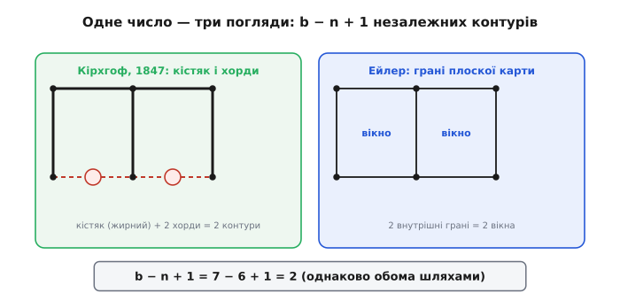

# 📜 Звідки взялися контурні струми: Максвелл, Кірхгоф і топологія схеми

Метод контурних струмів носить ім'я Джеймса Клерка Максвелла — а більшу частину того, на чому він стоїть, придумав не Максвелл. Це не докір нікому: так в історії науки трапляється часто. Спритний прийом, який ми тепер пишемо за хвилину на полях, складався десятиліттями з кількох незалежних думок — про граф схеми, про незалежні контури, про уявний струм, що біжить по кільцю, — і кожна думка має свого автора. Розплутаймо, хто що зробив, бо за цим стоїть гарна й несподівана історія: рахівничий шкільний прийом виявляється молодшим братом теорії графів і топології, а самого Максвелла найточніше було б згадувати радше за **дуальний**, вузловий метод, ніж за той, що носить його ім'я.

Тут варто від початку розрізняти три речі, які в підручниках часто змішують в одну: **граф** схеми й підрахунок незалежних контурів (це топологія — і це Кірхгоф, 1847); **уявний струм по кільцю** як зручна невідома (це Максвелл, 1873); і **слово «чарунка» (mesh)** разом із готовим рецептом, яким ми користуємось (це вже XX століття, безіменна редакторська робота підручників). Розглянемо по черзі.

## Кірхгоф, 1847: граф замість схеми

Почати треба з того, кого в історії контурного методу зазвичай не згадують, — а дарма. Густав Роберт Кірхгоф (нім. Gustav Robert Kirchhoff, німецький фізик, народився 1824 року в Кенігсберзі, тоді Пруссія) свої знамениті [закони для кіл](topic:hw-analog/kvl) сформулював ще студентом, у статті 1845 року. Але важливіша для нас його **друга** робота — 1847 року, з довгою німецькою назвою «Ueber die Auflösung der Gleichungen, auf welche man bei der Untersuchung der linearen Vertheilung galvanischer Ströme geführt wird» — «Про розв'язання рівнянь, до яких приводить дослідження лінійного розподілу гальванічних струмів» (Annalen der Physik, том 148, с. 497–508). *(Бібліографія перевірена за Annalen der Physik і вторинними джерелами; статус: усталений факт.)*

Назва суха, а зміст — переломний. Кірхгоф зіткнувся з прозаїчною бідою, тією самою, що мучить кожного, хто рахує велику схему руками: рівнянь, які дають його ж закони, виходить **більше, ніж невідомих**, і частина з них повторює одна одну. Як вибрати рівно стільки незалежних рівнянь, скільки треба, — ні більше, ні менше? Щоб відповісти, Кірхгоф зробив хід, який сьогодні назвали б народженням цілого розділу математики: він **викинув зі схеми всю фізику** — опори, ЕРС, напруги — і лишив самий кістяк зі з'єднань. Вузли стали точками, гілки — лініями між ними. Те, що лишилося, — це **граф**: чиста схема зв'язків, без жодної електрики.

> 🔧 **Навіщо це.** Думка «забудь, що в гілці, лиши тільки, з чим вона з'єднана» — це не історична дрібниця, а робочий інструмент і донині. Саме так працює всередині будь-який симулятор схем: перш ніж рахувати, він будує граф із вашого нетлиста й по ньому визначає, скільки незалежних рівнянь писати й яких. Коли ви прикидаєте «скільки тут вікон, скільки незалежних вузлів» — ви робите рівно те, що Кірхгоф зробив уперше: дивитесь на **топологію**, а не на номінали.

На цьому графі Кірхгоф і розв'язав свою задачу про підрахунок. Він показав, що в мережі завжди можна виділити **кістяк** (англ. *tree*) — набір гілок, що сполучає всі вузли, але **не утворює жодного кільця**. Гілки, які до кістяка не ввійшли (їх звуть хордами або зв'язками, *links*), і задають незалежні контури: додай до кістяка одну хорду — отримаєш рівно одне кільце, і таких кілець стільки ж, скільки хорд. Ось він, шуканий лік незалежних контурів — не на око, а строго. *(Кірхгоф 1847 — за історико-математичними оглядами теорії графів; статус: усталений факт.)*

Це число — **скільки незалежних кілець у графі** — згодом дістало власну назву: **цикломатичне число** (англ. *cyclomatic number*), і ввів його, за тими самими оглядами, теж Кірхгоф. *(Атрибуцію подають довідкові джерела з теорії графів; статус: усталено, хоч сам термін «цикломатичне» закріпився пізніше.)* Для зв'язного графа воно рахується гранично просто:

```
L = b − n + 1
```

де `b` — число гілок (англ. *branches*), `n` — число вузлів (англ. *nodes*), а `L` — число незалежних контурів. Якщо граф розпадається на `s` окремих шматків, формула трохи загальніша: `L = b − n + s`. Саме це число й каже, скільки рівнянь писати контурним методом, — і воно ж дорівнює числу «вікон» у плоскій схемі. Чому так — побачимо за хвилину, через Ейлера; поки зафіксуймо головне: **підрахунок контурів — це топологія графа, і вона старша за метод Максвелла на чверть століття.**

> 🔧 **Навіщо це.** Формула `L = b − n + 1` — це і є відповідь на питання «скільки рівнянь у мене буде». Перш ніж писати систему, перелічіть гілки й вузли — і ви наперед знаєте її розмір. Якщо нарахували вікон більше, ніж дає `b − n + 1`, десь подвоїли контур; менше — загубили. Це безкоштовна перевірка ще до першого рівняння.

Тут просяться два уточнення про ідентичність, бо популярні перекази люблять усе спрощувати. Кірхгоф — справді німецький фізик, народжений у Кенігсберзі; це не спірно. А от ширша легенда, нібито «теорію графів заснував Кірхгоф», — півправда: першим граф (мости Кенігсберга) розглянув ще Леонард Ейлер (нім./швейц. Leonhard Euler) 1736 року, а як окрему науку теорію графів оформили значно пізніше. Кірхгофова заслуга вужча й конкретніша: він **перший застосував граф до фізичної мережі** і витяг із нього кістяк та незалежні контури. *(Розрізнення за історико-математичними джерелами; статус: усталено.)* Це добрий приклад, чому в історії науки варто питати не «хто власник ідеї», а «хто саме що зробив».

## Максвелл, 1873: уявний струм по кільцю — і дзеркальний, вузловий метод

Тепер власне Максвелл. Джеймс Клерк Максвелл (англ. James Clerk Maxwell, шотландський фізик; народився 13 червня 1831 року в Единбурзі, помер 5 листопада 1879 року в Кембриджі) — постать, яку відрекомендовувати майже зухвало: це людина, що звела електрику, магнетизм і світло в одну теорію поля. *(Дати й національність — за Британікою та MacTutor; статус: усталений факт.)* Свою електромагнітну теорію він виклав у двотомному «Трактаті про електрику й магнетизм» (англ. «A Treatise on Electricity and Magnetism»), що вийшов 1873 року в Оксфорді. *(Видання й рік перевірені; статус: усталений факт.)*

І ось у цьому ж томі, серед рівнянь поля, заради яких його й читають, Максвелл відвів окрему частину прозаїчнішій справі — мережам із резисторів і батарей. У Частині II, у розділі «Математична теорія розподілу електричних струмів», стоїть параграф «Про системи лінійних провідників» (англ. «On Systems of Linear Conductors», починається зі статті 273). *(Структуру Трактату звірено з його змістом; статус: усталений факт.)* Саме там і живе те, що ми тепер звемо контурним методом.

Що нового вніс Максвелл понад Кірхгофа? Не підрахунок контурів — той уже був. Максвеллів внесок — у **виборі невідомих**. Замість того щоб писати струм у кожній гілці й потім зв'язувати їх законом струмів, він запропонував для кожного незалежного контура одну величину — уявний струм, що **тече по всьому кільцю** цього контура, не розгалужуючись. Реальний струм у гілці — це накладення тих кільцевих струмів, що крізь неї проходять. У спільній гілці двох контурів — їхня різниця. Цей хід і робить [закон струмів](topic:hw-analog/kcl) виконаним сам собою: кільцевий струм нікуди не дівається, скільки з вузла витекло — стільки й повернулося. Кірхгоф рахував контури; Максвелл дав **зручну змінну**, прив'язану до контура, з якою рівняння виходять одразу й майже без зайвих невідомих. За ці уявні струми метод і назвали його ім'ям — а самі струми донині звуть **максвелловими циркулюючими струмами** (англ. *Maxwell's circulating currents*). *(Термінологію подають численні підручники; статус: усталено.)*

А тепер найцікавіший і найменш відомий поворот. Якщо вже комусь і вішати на Максвелла фірмовий метод, то історично точніше — **не контурний, а вузловий**. Довідкові джерела з топології кіл прямо кажуть: саме Максвелл дав **дуальний** до кірхгофового аналіз — **вузловий** (англ. *node analysis*), у якому невідомі не струми в кільцях, а потенціали вузлів. Більше того, він довів красиву теорему: визначник матриці вузлових провідностей дорівнює сумі добутків провідностей по всіх кістяках графа — місток від схем назад до Кірхгофових дерев. *(За довідником із топології електричних кіл; статус: усталено.)*

Виходить майже парадокс. **Контурний** метод спирається на топологію Кірхгофа (контури, кістяк) — а зветься максвелловим. **Вузловий** метод як систематичну дуальну побудову дав власне Максвелл — а в підручниках його рідко звуть «методом Максвелла». Історія розклала ярлики майже навпаки. Тож коли в статті [про метод контурних струмів](topic:hw-analog/mesh-analysis) ми згадуємо, що дзеркально до нього працює вузловий, — варто пам'ятати, що ця дзеркальність не пізніший доважок, а закладена в саму генезу: обидва методи виросли з однієї роботи й одного графа, просто рахують його з двох протилежних боків (один — по контурах, другий — по вузлах).

> 🔧 **Навіщо це.** Дуальність контурного й вузлового методів — не абстракція, а практичний важіль. Будь-яку схему можна порахувати з двох боків; історично вони народилися як пара, тож і користуватись ними варто парою. Бачите схему «в ширину», з багатьма петлями, — беріть контурний (його кільцеві струми); бачите «у висоту», з купою паралельних віток між кількома шинами, — беріть вузловий (потенціали вузлів). Те, що це справді одна медаль із двох боків, і дає вам право щоразу обирати дешевший.

## Звідки слово «чарунка» (mesh) — і чому це вже XX століття

Лишилося розібратися зі словом. У сучасній англійській метод зветься *mesh analysis*, а саме кільце-вікно — *mesh*: слово означає **чарунку сітки**, ту дірочку між нитками, як у рибальській сіті чи решеті. Звідки воно тут?

Картинка точна, і варто відчути, чому. Плоску схему — таку, що малюється на папері **без перетину проводів**, — можна накреслити так, що вона ляже на аркуш, мов шибки у віконній рамі або клітинки сітки. Кожне найменше «віконце», всередині якого більше нічого немає, і є чарункою. Технічне означення таке і є: **чарунка — це контур, що не охоплює всередині жодного іншого контура**. *(Означення за довідником із топології кіл; статус: усталено.)* Сітка-схема, її чарунки-вічка — звідси й *mesh*. Українською найближче лягає саме «чарунка»: жива, не калькована назва тієї самої дірочки в сіті.

А тепер чесно про авторство слова. **Хто перший назвав контур «mesh» у схемному сенсі — документально не встановлено.** Максвелл цього слова в тому значенні не вживав; він писав про струми по замкнених контурах своєю мовою свого часу. Термін *mesh*, як і готовий «рецепт у три кроки» зі шкільних підручників («полічи вікна — для кожного напиши рівняння за шаблоном — розв'яжи систему»), усталився вже у XX столітті, у навчальній і інженерній літературі, **безіменно** — як це й буває з гарними педагогічними знахідками, що шліфуються багатьма руками. Тож якщо хтось упевнено назве вам «винахідника слова mesh» — це майже напевно домисел. *(Статус: атрибуцію не знайдено в перевірених джерелах; чесніше сказати «невідомо», ніж приписати комусь.)*

Тут же мешкає й тонка термінологічна різниця, яку плутають навіть посібники. *Mesh analysis* (метод чарунок) бере **лише найменші** контури-вікна — і тому працює **тільки для плоских** схем, де ці вікна взагалі є. Ширший *loop analysis* (метод контурів) дозволяє брати **будь-які** незалежні кільця, не конче найменші, — і тому годиться для **будь-якої** схеми, хай навіть її не намалювати без перетину проводів. Перший — окремий, зручний випадок другого. *(Розрізнення за навчальними джерелами; статус: усталено.)* На практиці для плати майже завжди вистачає чарункового: переважна більшість того, що ви креслите, плоска.

## Чому контурів рівно `b − n + 1`: Ейлер замикає коло

Тепер борг із початку розділу — звідки береться `L = b − n + 1` і чому в плоскій схемі це водночас і число незалежних контурів Кірхгофа, і просто **число вікон**. Тут історія робить гарне коло й повертається до Ейлера, з якого все починалося.

Плоску схему можна бачити як карту, накреслену на аркуші: вузли — це **вершини**, гілки — **ребра**, а вікна (включно з нескінченним зовнішнім полем навколо всієї схеми) — **грані**. Для будь-якої такої зв'язної карти на площині справджується формула Ейлера для багатогранників і плоских графів (Леонард Ейлер, 1750-ті):

```
V − E + F = 2
```

де `V` — вершини, `E` — ребра, `F` — грані. Перепишемо в наших позначеннях: `V = n` (вузли), `E = b` (гілки), `F` — усі грані. Серед граней одна — зовнішнє нескінченне поле, яке вікном не рахують; внутрішніх вікон тоді `F − 1`. Підставмо й виразимо їх:

```
n − b + F = 2
F = 2 − n + b
вікон  =  F − 1  =  b − n + 1
```

Те саме число `b − n + 1`, що Кірхгоф вивів через кістяк і хорди, Ейлерова формула дає через грані. Два різні шляхи — топологія мережі й геометрія плоскої карти — приводять до одного ліку. **Ось чому в плоскій схемі «полічити вікна» і «полічити незалежні контури» — це те саме дійство:** число вікон, цикломатичне число графа й кількість потрібних рівнянь контурного методу збігаються не випадково, а тому, що це одна величина, побачена з трьох боків. *(Виведення через формулу Ейлера; статус: усталено.)*


*Один граф схеми, порахований трьома способами. Ліворуч — підхід Кірхгофа: жирні гілки утворюють кістяк (дерево без кілець), а кожна хорда, додана до нього, замикає рівно один незалежний контур; число хорд і є числом контурів. Праворуч — підхід Ейлера: ті самі вузли й гілки ділять площину на вікна, і їхній лік дає формула V − E + F = 2. Обидва шляхи приводять до b − n + 1 — тому «полічити вікна» й «полічити незалежні контури» в плоскій схемі означають одне.*

## Кого ж згадувати

Складімо все докупи, щоб наступного разу, пишучи на полях три акуратні рівняння, ви знали, чию роботу тримаєте в руках.

**Граф схеми, кістяк, лік незалежних контурів** — Густав Кірхгоф, 1847. Це він викинув зі схеми фізику, лишив самі з'єднання й навчився рахувати топологію. Цикломатичне число — його. *(Усталено.)*

**Уявний струм по кільцю як зручна невідома** — Джеймс Клерк Максвелл, «Трактат», 1873; і він-таки систематично розгорнув **дуальний, вузловий** метод. За кільцеві струми метод дістав його ім'я. *(Усталено.)*

**Формула `b − n + 1`** — спадщина Ейлера (1736 — мости Кенігсберга; 1750-ті — формула граней), що змикається з підрахунком Кірхгофа через грані плоскої карти. *(Усталено.)*

**Кістякове дерево як систематичний апарат для вибору змінних** — пізніше, Освальд Веблен (англ. Oswald Veblen), близько 1916 року, уже мовою алгебричної топології; а матричне представлення графів через матриці інцидентності — Анрі Пуанкаре (фр. Henri Poincaré), близько 1900-го. *(За довідником із топології кіл; статус: усталено.)*

**Слово «mesh» («чарунка») і шкільний рецепт у три кроки** — XX століття, навчальна література, **без певного автора**. *(Атрибуцію не знайдено; чесний статус — невідомо.)*

Виходить типова для техніки картина: «метод Максвелла» — насправді плід кількох рук, де топологію заклав Кірхгоф, зручну змінну й дуальну пару дав Максвелл, лічбу через грані подарував ще Ейлер, а звичну нам назву й оформлення дошліфували безіменні автори підручників. І в цьому немає нічого прикрого — навпаки, це показує, як працює наука: не одним стрибком генія, а нашаруванням точних думок, кожна з яких лягає на попередню. Той факт, що ми звемо метод одним ім'ям, — лише зручний ярлик; за ним стоїть ціла лінія людей, які за півтора століття зробили підрахунок схеми з мороки — рутиною.

Якщо захочете розгледіти топологічний бік ближче — як саме кістяк і хорди задають базис контурів і чому матриця методу виходить [симетричною](topic:hw-analog/mesh-analysis/math-mesh-matrix.md) — це вже мова [теорії графів](topic:math-combinatorics/graph-theory), тієї самої, що почалася з кірхгофового рішення викинути зі схеми все, крім з'єднань.
