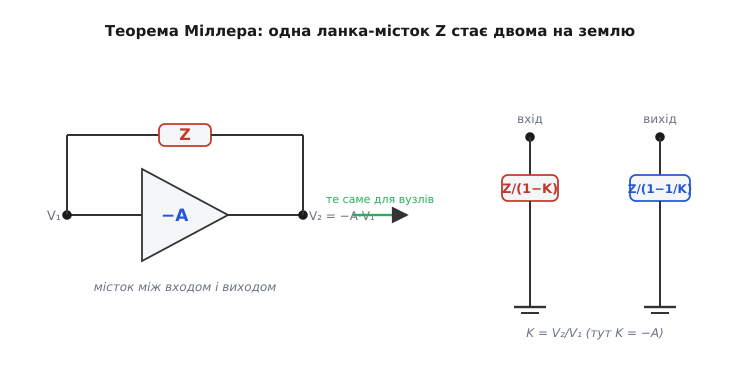
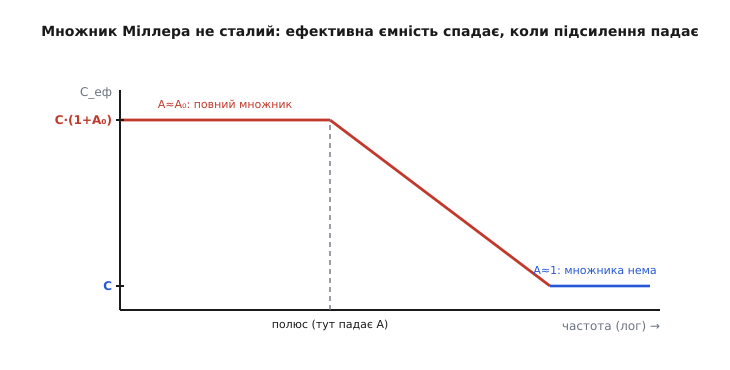

# 🧮 Виведення ефекту Міллера: теорема, комплексне підсилення, дві ємності

Проста картина «вхід бачить C·(1+A)» вірна — і її досить, щоб передбачити, де каскад втратить швидкість. Та в ній сховано три речі, яких вона не показує. Перша: чому множник саме (1+A), а не A і не (1+A)² — звідки він береться строго, а не з образу гойдалки. Друга: той самий місток, що роздуває ємність на вході, відбиває **ще одну** ємність — на вихід, і вона зовсім інша, C·(1+1/A); проста картина про неї мовчить, а в інтеграторі й у корекції підсилювача саме вона вирішує. Третя: підсилення A — не число, а **функція частоти** A(jω), тож і «роздута» ємність не стала: на низьких частотах вона велетенська, на високих тане до голої C. Хто бачить лише C·(1+A), той дивується, коли каскад поводиться не так, як обіцяла формула.

Розберемо все це з першопричини. Інструмент — **теорема Міллера** *(англ. Miller theorem)*: вона перетворює будь-яку ланку, увімкнену містком між входом і виходом підсилювача, на дві окремі ланки, кожну на землю. Спершу доведемо саму теорему (вона коротка й чесна), тоді підставимо в неї конденсатор і дістанемо обидві ємності, а наприкінці впустимо туди частоту й побачимо, як ефект Міллера зростається з добутком підсилення на смугу — і навіть народжує нуль у правій півплощині, через який корекція підсилювачів інколи робить гірше, ніж мала б.

## Теорема Міллера: місток стає двома ланками на землю

Почнімо з постановки, бо в ній уся хитрість. Маємо підсилювач: на вхідному вузлі напруга V₁, на вихідному V₂, і вони жорстко зв'язані підсиленням

```
V₂ = K · V₁
```

де K — підсилення **з усіма знаками**. Для інвертувального каскаду K = −A (A > 0 — модуль), тож V₂ = −A·V₁: вихід іде в протилежний бік і в A разів дужче. Тепер між цими двома вузлами стоїть ланка з опором Z — поки що будь-яким (резистор, конденсатор, котушка). Крізь неї тече струм з входу на вихід, і цей струм **навантажує вхід**: джерело сигналу мусить його постачати. Питання теореми: чи можна викинути місток і замінити його чимось, увімкненим **просто з входу на землю**, так, щоб джерело відчуло **точнісінько той самий** струм? Якщо так — вхідний вузол не помітить підміни, а рахувати стане легше, бо ланка на землю аналізується тривіально.

Рахуймо струм у місток з боку входу. Через будь-яку двополюсну ланку струм — це різниця напруг на її кінцях, поділена на її опір. Лівий кінець містка сидить на V₁, правий — на V₂. Отже струм, що витікає з входу в місток:

```
I₁ = (V₁ − V₂) / Z
```

Ось тут вступає зв'язок V₂ = K·V₁. Підставмо його — і вся залежність від виходу зникне, лишиться тільки V₁:

```
I₁ = (V₁ − K·V₁) / Z = V₁ · (1 − K) / Z
```

Тепер придивімося до цього виразу. Струм з входу пропорційний V₁ — рівно так, наче з входу на землю стоїть якийсь один опір Z₁, крізь який тече I₁ = V₁/Z₁. Прирівняймо й виразимо цей уявний Z₁:

```
I₁ = V₁ / Z₁     ⟹     V₁ / Z₁ = V₁ · (1 − K) / Z
                  ⟹     Z₁ = Z / (1 − K)
```

Це і є **вхідна частина теореми Міллера**. Місток Z, побачений з боку входу, поводиться точно як опір Z/(1−K), увімкнений з входу на землю. Жодного наближення тут не зроблено — це алгебраїчна тотожність за єдиної умови, що V₂ = K·V₁ виконується (підсилювач справді тримає свій зв'язок між вузлами).

> 🔧 **Навіщо це.** Теорема перетворює «незручну» схему із зворотним містком на дві звичайні ланки на землю — а такі ми вміємо рахувати з заплющеними очима (опір на землю задає сталу часу з тим, що його живить). Саме тому аналіз смуги підсилювального каскаду починають із Міллера: він розщеплює клубок «вхід впливає на вихід, а вихід назад на вхід» на два незалежні вузли, кожен зі своєю ємністю й своєю частотою зламу.

Симетрично знайдемо, що бачить **вихід**. З боку виходу струм у той самий місток — це (V₂ − V₁)/Z (та сама ланка, протилежний напрям відліку). Виразимо V₁ через V₂: з V₂ = K·V₁ маємо V₁ = V₂/K. Тоді струм, що витікає з виходу в місток:

```
I₂ = (V₂ − V₁) / Z = (V₂ − V₂/K) / Z = V₂ · (1 − 1/K) / Z
```

Тією самою логікою цей струм виглядає так, наче з виходу на землю стоїть опір Z₂ = V₂/I₂:

```
Z₂ = Z / (1 − 1/K)
```

Маємо повну теорему. Один місток Z між двома вузлами **точно** еквівалентний (з погляду струмів у вузлах) двом окремим ланкам на землю:

```
з входу на землю:    Z₁ = Z / (1 − K)
з виходу на землю:   Z₂ = Z / (1 − 1/K)
```


*Серце апарату. Ліворуч — реальна схема: ланка Z містком між входом і виходом, де вихід жорстко дорівнює K·V₁. Праворуч — точний еквівалент за теоремою Міллера: дві ланки на землю, вхідна Z/(1−K) і вихідна Z/(1−1/K). Підміна не змінює жодного струму у вузлах, але робить кожен вузол незалежним і легким для розрахунку.*

Зверніть увагу на одну тонкість, без якої теорема обманює. Вона тримається на припущенні, що V₂ = K·V₁ — тобто що підсилення K **відоме й не залежить** від того струму, який тече крізь місток. У реальному каскаді частина того струму сама підмішується у вихід і трохи зсуває K, тож для дуже точних розрахунків теорема — перше наближення, не остання істина. Але для головного — пояснити, **звідки** береться множник і куди дівається ємність, — вона точна там, де нам треба.

## Підставляємо конденсатор: звідки (1+A) на вході

Тепер головний хід. Місток у нас — **конденсатор** C. Його опір не сталий: для змінного сигналу конденсатор має комплексний опір (точніше — реактивний), що залежить від частоти:

```
Z_C = 1 / (jωC)
```

де ω — кругова частота (рад/с), а j — уявна одиниця (вона лиш каже, що струм у конденсаторі випереджає напругу на чверть періоду; на величину множника це не впливає, тож стежмо за модулями). Підставмо Z_C у вхідну формулу теореми Z₁ = Z/(1−K), узявши інвертувальний каскад K = −A:

```
Z₁ = Z_C / (1 − K) = (1/(jωC)) / (1 − (−A)) = 1 / (jωC·(1 + A))
```

Подивіться, що вийшло. Вираз 1/(jωC·(1+A)) — це опір конденсатора, але **ємність у ньому не C, а C·(1+A)**. Тобто вхід бачить просту ємність на землю величиною

```
C_вх = C · (1 + A)
```

— рівно ту формулу, яку дає образ гойдалки. Тепер видно, **чому** саме (1+A), а не щось інше. Одиниця — це «свій» внесок входу: навіть якби каскад зовсім не підсилював (A = 0), різниця напруг на конденсаторі змінювалася б на повний розмах входу, тобто лишалася б гола C. А доданок A — це внесок виходу, що тікає назустріч: на кожен вольт входу він додає A вольтів зустрічного розмаху, і саме стільки додаткового заряду треба влити. Сума «своє плюс зустрічне» і дає (1+A). Не A — бо власний внесок входу нікуди не зник; не (1+A)² — бо заряд лінійний за напругою, подвійного множення нема.

> 🔧 **Навіщо це.** Із цього виведення прямо випливає, чому повторювач напруги не страждає від Міллера, а каскад зі спільним емітером страждає тяжко. У повторювача вихід **повторює** вхід, тобто K ≈ +1, не −A. Підставте K = +1 у Z/(1−K) — і дістанете ділення на (1−1) = 0, тобто Z₁ → ∞: ємність-місток з боку входу **зникає зовсім**, бо обидві її пластини рухаються разом, різниця на ній не змінюється, заряд не тече. Той самий конденсатор, та сама теорема — але інший знак K, і ефект або велетенський (K = −A), або відсутній (K = +1). Один доданок у знаменнику вирішує долю смуги.

## Обернена ємність: що місток відбиває на вихід

А тепер те, про що проста картина мовчить. Підставмо той самий конденсатор у **вихідну** формулу теореми Z₂ = Z/(1−1/K), знову з K = −A:

```
Z₂ = Z_C / (1 − 1/K) = (1/(jωC)) / (1 − 1/(−A)) = 1 / (jωC·(1 + 1/A))
```

Знову опір конденсатора — але тепер з боку виходу ємність дорівнює

```
C_вих = C · (1 + 1/A)
```

Це **друга, обернена ємність**, яку той самий місток відбиває вже на вихідний вузол. Її поведінка дзеркальна до вхідної, і саме контраст робить картину повною:

- На **вході** множник (1+A) — велетенський: при A = 150 ємність роздувається в 151 раз. Сюди йде вся шкода від смуги.
- На **виході** множник (1+1/A) — крихітний: при A = 150 це 1.0067, тобто ємність майже точно дорівнює голій C. Вихід бачить просто сам конденсатор, ніби ніякого підсилення й немає.

Чому так — видно з тієї ж механіки зустрічних пластин, тільки тепер дивимося очима **виходу**. Вихід гойдається на повний свій розмах A·V₁; його власна пластина проходить майже всю різницю напруг на конденсаторі сама, бо вхід поряд із ним ледь ворушиться (його розмах у A разів менший). Тому виходу майже байдуже, що там робить далека вхідна пластина: різниця на конденсаторі для нього — це практично весь його власний рух, тобто ємність ≈ C. Додаток 1/A — це той дрібний внесок входу, що тікає назустріч виходу; чим більше підсилення, тим менший цей зустрічний рух **відносно** виходу, тим ближче C_вих до голої C.

Граничний випадок особливо чистий. Коли A → ∞:

```
C_вх  = C·(1 + A)    → ∞      (вхід бачить нескінченну ємність)
C_вих = C·(1 + 1/A)  → C      (вихід бачить рівно конденсатор)
```

Ось чому **інтегратор Міллера** працює так точно. У ньому конденсатор зворотного зв'язку охоплює операційний підсилювач з гігантським A, інвертуючий вхід завдяки [від'ємному зворотному зв'язку](root:hw-analog/negative-feedback) тримається віртуальною землею, і вхідна ємність C·(1+A) роздувається до велетенської. Велика й при цьому **ідеально лінійна** ємність на віртуальній землі — це точно те, що змушує вихід бути чистим інтегралом струму, який туди вливається. А обернена C_вих ≈ C на виході нікому не заважає, бо вихід ОП низькоомний і легко її переганяє. Та сама теорема, обидві її половини, працюють тут на користь.

> 🔧 **Навіщо це.** Обернена ємність C·(1+1/A) — не цурпалок для повноти. Саме вона визначає, як швидко вихідний вузол каскаду може гойдатися, а в багатокаскадній корекції підсилювача — куди стає **другий** полюс. Інженер, що рахує стійкість ОП, тримає в голові обидві ємності: вхідна (велетенська) робить домінантний полюс, вихідна (≈ C) штовхає високочастотний полюс іще вище. Нижче побачимо, що та сама вихідна гілка ховає й пастку — нуль у правій півплощині.

## Частота входить у гру: множник не сталий

Досі ми мовчки вважали A числом. Але підсилення жодного каскаду не лишається сталим угору по частоті: рано чи пізно власні ємності каскаду починають його з'їдати, і модуль підсилення падає. Запишімо це чесно — підсилення є **комплексна функція частоти** A(jω). Найпростіший і найтиповіший випадок — каскад з одним домінантним полюсом на частоті ω_p:

```
A(jω) = A₀ / (1 + jω/ω_p)
```

де A₀ — підсилення на низьких частотах (на постійному струмі), ω_p — частота, де воно починає валитися. Нижче ω_p модуль |A| ≈ A₀ (повна сила); вище ω_p він спадає обернено пропорційно частоті.

Тепер підставмо цю A(jω) у вхідну ємність Міллера. Множник (1+A) тепер залежить від частоти, тож і «роздута» ємність — функція частоти:

```
C_вх(ω) = C · (1 + A(jω)) = C · (1 + A₀/(1 + jω/ω_p))
```

Прочитаймо це у двох краях діапазону, де все спрощується:

```
низькі частоти (ω ≪ ω_p):   A ≈ A₀          ⟹  C_вх ≈ C·(1 + A₀)   — велетенська
високі частоти (ω ≫ ω_p):   A → мала, → 0    ⟹  C_вх → C·(1 + 0) = C — гола
```

Ось вона, третя прихована річ. Ефективна ємність Міллера **не стала**: на низьких частотах вона роздута в (1+A₀) разів, а на високих, де підсилення вже впало до одиниці й нижче, множник тане, і вхід бачить просто голу C. Між цими краями — плавний перехід, і починається він якраз біля домінантного полюса каскаду.


*Чому множник не сталий. На низьких частотах підсилення повне (A ≈ A₀), і вхід бачить роздуту C·(1+A₀). Коли частота переходить домінантний полюс, підсилення валиться — і ефективна ємність сповзає вниз, аж поки на високих частотах від множника не лишається нічого: вхід бачить голу C. «Роздута ємність» живе лише там, де живе підсилення.*

Це пояснює, чому проста формула C·(1+A) — добра робоча оцінка, але не остаточна істина. Вона бере A на низьких частотах (A₀) і вважає його сталим. Доки нас цікавить, **де** каскад починає глухнути — тобто сама частота зламу, яка лежить нижче ω_p, — це чесно: там підсилення ще повне, ємність справді C·(1+A₀). А от поведінку **далеко за** зламом проста картина передбачає невірно: там ефективна ємність уже менша, і реальний спад АЧХ м'якший, ніж дала б стала C·(1+A₀). Для практики цього здебільшого не треба; знати про це треба, щоб не дивуватися розбіжності з точним розрахунком чи симуляцією.

## Зв'язок із домінантним полюсом і добутком підсилення на смугу

Тепер найглибше. Чому ефект Міллера так тісно зрісся з [добутком підсилення на смугу](root:hw-analog/gain-bandwidth-product) — тією сталою, що в підсилювача з одним полюсом дорівнює добутку низькочастотного підсилення на смугу й не змінюється, хоч би як ви розмінювали одне на одне зворотним зв'язком?

Зберімо ланцюжок причин. Вхідна ємність Міллера C·(1+A₀) разом із опором R, що живить вхід, утворюють [фільтр низьких частот](root:hw-analog/rc-low-pass) зі сталою часу τ = R·C·(1+A₀). Частота зламу цього фільтра — і є домінантний полюс каскаду:

```
ω_дом = 1 / τ = 1 / (R · C · (1 + A₀))
```

А тепер обчислимо добуток підсилення на цю смугу. Підсилення на низькій частоті — A₀; смуга — ω_дом. Їхній добуток:

```
A₀ · ω_дом = A₀ / (R · C · (1 + A₀))
```

При A₀ ≫ 1 (а підсилювальний каскад на те й каскад, щоб A₀ було велике) дріб A₀/(1+A₀) ≈ 1, і добуток зводиться до

```
A₀ · ω_дом ≈ 1 / (R · C)
```

Дивіться, що сталося. Підсилення A₀ **скоротилося**. У добутку «підсилення × смуга» його не лишилося зовсім — він залежить тільки від R і C, а не від того, наскільки сильно каскад підсилює. Ось механізм золотого правила: **піднімаєте підсилення A₀ — рівно настільки роздувається ємність Міллера — рівно настільки опускається смуга**, і добуток стоїть на місці. Те саме R·C визначає й те, і те; підсилення лише перерозподіляє його між «висотою» (A₀) і «шириною» (ω_дом), як стискання повітряної кульки: чавиш з одного боку — випинається з іншого, об'єм незмінний.

Звідси й глибший погляд на компенсацію Міллера в операційних підсилювачах. Маленький конденсатор C, навмисне ввімкнений навколо проміжного каскаду з підсиленням A₀, відбиває на його вхід ємність C·(1+A₀) — і **сам задає** домінантний полюс ω_дом = 1/(R·C·(1+A₀)) всього підсилювача. Дрібний C множиться на велике A₀ й виходить «повільне місце» потрібної низької частоти, не займаючи на кристалі площу справжнього великого конденсатора. А добуток підсилення на смугу всього ОП виходить ≈ 1/(R·C) — задається тим самим маленьким C. Інженер, обираючи C компенсації, прямо ставить добуток підсилення на смугу майбутнього підсилювача. Те, як саме цю сталу читають і на що розмінюють у зворотному зв'язку, розкриває окрема тема — [добуток підсилення на смугу](root:hw-analog/gain-bandwidth-product); тут важливе одне: ефект Міллера — це і є той фізичний механізм, що робить добуток сталим.

**Порахуймо: добуток підсилення на смугу не зрушив.** Каскад з підсиленням A₀ = 100, ємність-місток C = 4 пФ, опір на вході R = 5 кОм. Знайдемо домінантний полюс і добуток підсилення на смугу — а тоді **подвоїмо** підсилення до A₀ = 200 і подивимося, що стане з добутком.

:::tabs
```c
// Ефект Міллера й добуток підсилення на смугу: підсилення скорочується.
// Ємність — у фарадах, опір — у омах, частота — у герцах.
float C = 4.0e-12f;        // ємність-місток, 4 пФ
float R = 5.0e3f;          // опір, що живить вхід, 5 кОм
const float PI = 3.14159f;

// — варіант 1: A0 = 100 —
float A0_1 = 100.0f;
float Cin_1 = C * (1.0f + A0_1);                 // 4 пФ · 101 = 404 пФ
float fdom_1 = 1.0f / (2.0f * PI * R * Cin_1);   // домінантний полюс, Гц
float gbw_1 = A0_1 * fdom_1;                     // добуток підсилення на смугу

// — варіант 2: подвоїли підсилення, A0 = 200 —
float A0_2 = 200.0f;
float Cin_2 = C * (1.0f + A0_2);                 // 4 пФ · 201 = 804 пФ — удвічі більша
float fdom_2 = 1.0f / (2.0f * PI * R * Cin_2);   // полюс опустився ~удвічі
float gbw_2 = A0_2 * fdom_2;                      // добуток

// fdom_1 = 1/(2π·5000·404e-12) ≈ 78 800 Гц,  gbw_1 = 100·78 800 ≈ 7.88 МГц
// fdom_2 = 1/(2π·5000·804e-12) ≈ 39 600 Гц,  gbw_2 = 200·39 600 ≈ 7.92 МГц
```
```python
import math

# Ефект Міллера й добуток підсилення на смугу: підсилення скорочується.
# Ємність — у фарадах, опір — у омах, частота — у герцах.
C = 4.0e-12    # ємність-місток, 4 пФ
R = 5.0e3      # опір, що живить вхід, 5 кОм

# — варіант 1: A0 = 100 —
A0_1  = 100.0
Cin_1 = C * (1.0 + A0_1)                  # 4 пФ · 101 = 404 пФ
fdom_1 = 1.0 / (2.0 * math.pi * R * Cin_1)   # домінантний полюс, Гц
gbw_1 = A0_1 * fdom_1                     # добуток підсилення на смугу

# — варіант 2: подвоїли підсилення, A0 = 200 —
A0_2  = 200.0
Cin_2 = C * (1.0 + A0_2)                  # 4 пФ · 201 = 804 пФ — удвічі більша
fdom_2 = 1.0 / (2.0 * math.pi * R * Cin_2)   # полюс опустився ~удвічі
gbw_2 = A0_2 * fdom_2                     # добуток

# fdom_1 = 1/(2π·5000·404e-12) ≈ 78 800 Гц,  gbw_1 = 100·78 800 ≈ 7.88 МГц
# fdom_2 = 1/(2π·5000·804e-12) ≈ 39 600 Гц,  gbw_2 = 200·39 600 ≈ 7.92 МГц
```
:::

Підсилення зросло вдвічі — смуга рівно вдвічі впала (78.8 кГц → 39.6 кГц), а добуток підсилення на смугу не зрушив: ≈ 7.9 МГц в обох випадках (дрібна різниця — від того, що множник (1+A₀), а не точно A₀, тож при більшому A₀ скорочення ще повніше). Ємність Міллера сама собою тримає цю сталу: щоразу, коли підсилення росте, вона роздувається рівно настільки, щоб опустити смугу й залишити добуток на місці.

## Прихована пастка: нуль у правій півплощині

Лишилася одна річ, через яку «обернена» вихідна ємність — не просто академічна симетрія, а те, що інженери справді ловлять у лабораторії. Досі ми думали про струм у конденсаторі-містку як про щось, що тече **з входу на вихід через підсилювач**. Але конденсатор — двобічна деталь: струм тече ним і **прямо з входу на вихід, минаючи підсилювач**. На низьких частотах опір конденсатора величезний, цей прямий струм дрібний, і ним нехтують. На високих частотах опір конденсатора падає (Z_C = 1/(jωC)), прямий шлях відкривається — і вхідний сигнал просочується на вихід **в обхід** підсилювача.

Чому це біда саме для інвертувального каскаду. Нормальний шлях (крізь підсилювач) перевертає знак: вихід іде вниз, коли вхід угору. Прямий шлях крізь конденсатор знак **не** перевертає: підняли вхід — крізь ємність він підтягує вихід угору. На певній частоті ці два шляхи дають на виході струми, **рівні за величиною й протилежні за напрямом**, — вони гасять одне одного, і вихід завмирає. У передавальній характеристиці це **нуль**: частота, на якій сигнал на вихід не проходить узагалі.

Знайдемо цю частоту. Підсилювач женеться вихідним струмом g_m·V₁ (де g_m — крутість, що пов'язує вхідну напругу з вихідним струмом каскаду). Прямий струм крізь конденсатор з входу на вихід — це (V₁ − V₂)/Z_C; на цікавій нам частоті, де вихід уже майже завмер, він ≈ V₁·jωC. Два струми гасяться, коли вони рівні:

```
g_m · V₁ = ωₙ · C · V₁     ⟹     ωₙ = g_m / C
```

Це нуль передавальної функції на частоті ω_z = g_m/C, і він лежить у **правій півплощині** *(англ. right-half-plane zero, RHP zero)*. Назва технічна, але наслідок дуже відчутний: такий нуль додає підсилення **без** того фазового запасу, який дав би «нормальний» нуль, — він **знижує фазу** там, де її якраз бракує. У компенсації підсилювача, де домінантний полюс Міллера навмисне зроблено, щоб тримати стійкість, цей RHP-нуль може з'їсти запас фази й **погіршити** стійкість, замість поліпшити. Той самий конденсатор, що робить добру справу (домінантний полюс), приносить у нагрузку прихований нуль.

Звідки беруть ліки — теж видно з виведення. Нуль народжується там, де прямий струм крізь C дорівнює струму підсилювача. Якщо послідовно з конденсатором поставити невеликий опір R_z, прямий шлях стане «C і R_z разом», і умова гасіння зсунеться: при R_z = 1/g_m прямий струм узагалі не дожене струм підсилювача на жодній частоті — нуль ідеально гаситься; при R_z > 1/g_m нуль **переходить у ліву півплощину**, де він уже корисний (додає запас фази). Цей послідовний опір так і звуть «нуль-гасним» резистором — він стандартно стоїть поряд із конденсатором компенсації Міллера у схемах операційних підсилювачів. Деталі того, як домінантний полюс і цей нуль разом визначають стійкість, — у статті про [стійкість операційного підсилювача](root:hw-analog/opamp-stability); тут важливо, що RHP-нуль випливає прямо з того самого містка, з якого випливає й сам ефект Міллера: це дві сторони однієї двобічної ємності — одна множить заряд, друга пропускає сигнал в обхід.

> 🔧 **Навіщо це.** Якщо ваш операційний підсилювач у схемі з підсиленням, близьким до одиниці, дзвенить чи має горб на АЧХ попри «правильну» компенсацію — підозрюйте RHP-нуль. Симуляція покаже його як завмирання сигналу на високій частоті з падінням фази; ліки — той самий R_z = 1/g_m послідовно з конденсатором корекції. Ефект Міллера тут показує обидва свої обличчя в одній схемі: множенням ємності він дає потрібний повільний полюс, а прямим просочуванням крізь ту саму ємність — небажаний нуль, і грамотна корекція володіє обома.

## Що з цього винести

Уся математика ефекту Міллера виростає з однієї короткої тотожності — теореми Міллера: місток з опором Z між входом (V₁) і виходом (V₂ = K·V₁) точно еквівалентний двом ланкам на землю, Z/(1−K) з боку входу і Z/(1−1/K) з боку виходу. Підставивши конденсатор у інвертувальний каскад (K = −A), дістаємо обидві ємності строго: вхідну C·(1+A) — велетенську, бо вихід тікає назустріч і додає до власного розмаху входу ще A розмахів; і вихідну C·(1+1/A) — майже голу C, бо вихід гойдається сам і ледь помічає дрібний зустрічний рух входу. Одиниця в кожному множнику — це власний внесок вузла, доданок A чи 1/A — внесок протилежного. Щойно ми згадуємо, що A — не число, а A(jω), множник перестає бути сталим: на низьких частотах ємність роздута в (1+A₀) разів, на високих, де підсилення впало, тане до голої C. З цього прямо випливає зрощеність Міллера з добутком підсилення на смугу: вхідна ємність C·(1+A₀) задає домінантний полюс 1/(R·C·(1+A₀)), і в добутку «підсилення × смуга» підсилення скорочується, лишаючи сталу ≈ 1/(R·C) — підняли підсилення, ємність роздулась, смуга впала, добуток стоїть. А двобічність тієї самої ємності ховає й пастку: прямий струм крізь конденсатор в обхід підсилювача народжує нуль у правій півплощині на ω_z = g_m/C, який псує стійкість і якого позбуваються нуль-гасним опором R_z = 1/g_m. Проста картина C·(1+A) вірна для головного — передбачити, де каскад втратить швидкість; але повний апарат показує ще три речі, без яких не зрозуміти ні інтегратора, ні внутрішньої корекції підсилювача: обернену ємність на виході, спад множника з частотою і нуль, що ховається в тому самому містку.
