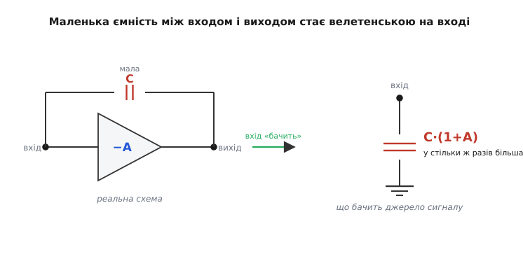
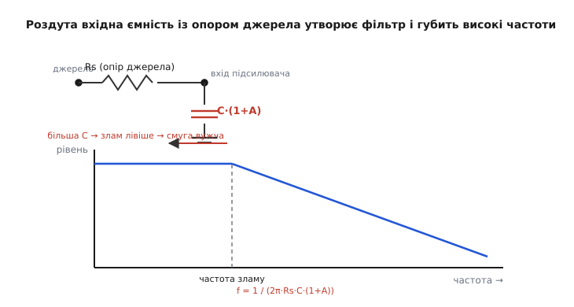
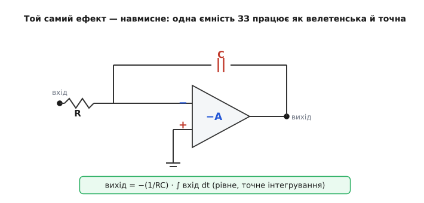

# Ефект Міллера

Візьміть зовсім крихітний конденсатор — кілька пікофарад, ємність, яку годі й помітити, — і ввімкніть його між входом і виходом підсилювача, що перевертає сигнал. На вході він раптом поведеться так, наче його ємність у сотні разів більша. Той самий конденсатор, не змінивши жодного свого фізичного параметра, душить смугу частот, гальмує фронти й перетворює на загадку схему, яка «за всіма розрахунками» мала бути швидкою. Це не примара й не похибка вимірювання — це **ефект Міллера**, і він криється всередині кожного підсилювального каскаду, хоч би ви свідомо жодного конденсатора туди не ставили.

Зрозуміти його варто з однієї причини: він пояснює, **чому реальні підсилювачі повільніші, ніж обіцяють їхні транзистори**. А заразом — чому той самий, на перший погляд шкідливий, ефект інженери навмисне запрягають у роботу, коли треба точне інтегрування або стійкість.

### Чому маленький конденсатор «бачиться» великим

Почнімо з самої серцевини, бо в ній уся суть. Уявіть підсилювач, що **перевертає** сигнал: піднімаєте напругу на вході на трошки — вихід зривається вниз на багато. Скажімо, підсилення дорівнює −20: на кожен мілівольт угору на вході вихід падає на 20 мілівольт. Знак «мінус» тут — головний герой; саме він робить усю різницю.

Тепер з'єднаємо вхід і вихід **містком — конденсатором**. Конденсатор реагує не на напругу саму по собі, а на **різницю напруг на своїх двох пластинах**: скільки заряду в нього треба влити, визначає те, наскільки змінилася ця різниця. І ось ключ. Коли вхід піднявся на 1 мілівольт, його ліва пластина пішла вгору на 1 мілівольт. Але права пластина — це вихід, і вона тієї ж миті провалилася на 20 мілівольт **униз**. Виходить, різниця напруг на конденсаторі змінилася не на 1 мілівольт, а на **1 + 20 = 21 мілівольт** — пластини розійшлися назустріч одна одній.

> 🔧 **Навіщо це.** Це та сама механіка, що в гойдалці-балансирі: ви тиснете свій кінець донизу на сантиметр, а протилежний злітає вгору на метр — і людині, що тримається за дальній край, здається, наче ваш кінець страшенно «важкий». Конденсатор «тримається» за обидва кінці гойдалки водночас, тому йому дістається повний розмах.

А тепер подивімося на це **очима джерела сигналу**, яке штовхає струм у вхід. Джерело бачить лише свою пластину й питає одне: скільки заряду я мушу влити, щоб підняти вхід на 1 мілівольт? Якби друга пластина стояла нерухомо, відповідь була б «заряд, що відповідає ємності C». Та оскільки друга пластина тікає вниз на 20 мілівольт, влити доводиться у **21 раз більше** заряду на той самий мілівольт входу. А «багато заряду на маленьку зміну напруги» — це і є **означення великої ємності**. Отже джерело відчуває не C, а:

```
C_вх = C · (1 + A)
```

де A — модуль підсилення каскаду. Маленька C, помножена на (1 + A), і є та велетенська ємність, яку «бачить» вхід.


*Звідки множник. Ліворуч — реальна схема: крихітна ємність-місток між входом і виходом інвертувального підсилювача. Праворуч — що відчуває джерело сигналу: одна велика ємність на землю, у (1+A) разів більша за справжню. Перевертання знака виходу — причина всього: пластини розходяться назустріч, тож заряду треба багатократно більше.*

Зверніть увагу, наскільки це чутливе до підсилення. При скромному A = 20 множник 21 — уже відчутно. Але каскад на транзисторі легко дає підсилення в сотні разів; при A = 200 той самий пікофарад поводиться як 200 пікофарад. Ось чому ефект із дрібної деталі виростає у головного винуватця втрати швидкості.

### Звідки назва

Явище першим описав американський інженер **Джон Мілтон Міллер** *(John Milton Miller, 1882–1962)* у праці 1920 року, коли підсилювачі будували на трьохелектродних електронних лампах — тріодах. Між сіткою (входом) і анодом (виходом) лампи завжди є невелика паразитна ємність, і Міллер показав строго: через підсилення каскаду ця ємність відбивається на вхід багатократно збільшеною. Його власні слова в тій статті були прямі: «уявна вхідна ємність може стати в кілька разів більшою за справжні ємності між електродами лампи». Звідки взялася назва і як Міллер дійшов до цього висновку на лампах — [📜 Міллер і вхідний опір тріода, 1920](topic:hw-analog/miller-effect/hist-miller-1920.md).

Відтоді лампи майже зникли, а ефект — ні. Він не залежить від того, що саме підсилює: лампа, біполярний транзистор, польовий чи цілий операційний підсилювач — байдуже. Потрібні лише дві речі: **перевертання знака** і **якийсь шлях для ємності між входом і виходом**. А ці дві речі є практично завжди.

### Чим він шкодить: з'їдає смугу

Сама собою велика вхідна ємність нікого не лякала б, якби джерело сигналу було ідеальним. Біда в тім, що будь-яке реальне джерело має **власний опір** — опір попереднього каскаду, опір давача, опір дільника на вході. І ось цей опір разом із роздутою ємністю Міллера утворюють **фільтр низьких частот** *(англ. low-pass filter)*: послідовний опір, а за ним ємність на землю — класична ланка, що пропускає повільні зміни й гальмує швидкі.

Це той самий [конденсаторний фільтр низьких частот](topic:hw-analog/rc-low-pass), що й у будь-якій RC-ланці, тільки ємність у ньому — не реальна деталь, а «оптичний обман», створений підсиленням. Частота, на якій сигнал починає котитися вниз (частота зламу), визначається звичною формулою:

```
f = 1 / (2π · R_дж · C_вх)
```

Підставивши сюди роздуту C_вх = C·(1+A), бачимо біду: що більше підсилення, то більша ефективна ємність, то **нижча** частота зламу — то раніше підсилювач починає глухнути до високих частот. Підсилювач наче сам собі ставить підніжку: чим сильніше він підсилює, тим вужчою стає його смуга.


*Звідки втрата смуги. Угорі — опір джерела, що живить вхід, навантажений ємністю Міллера на землю. Унизу — частотна характеристика: до частоти зламу сигнал проходить рівно, після — спадає. Збільшуєте підсилення — ємність росте, злам сповзає ліворуч, смуга вужчає. Підсилення й швидкість тягнуть схему в різні боки.*

Саме тому каскад зі спільним емітером *(common-emitter)* — найпоширеніший підсилювальний каскад на біполярному транзисторі — славиться вузькою смугою попри швидкий транзистор. У ньому між базою (входом) і колектором (виходом) є ємність переходу, а підсилення велике й перевертає знак — ідеальні умови для Міллера. Той самий транзистор у схемі, де знак не перевертається (наприклад, повторювач), показує куди ширшу смугу, бо множника (1+A) там просто немає. Деталі того, як це лягає на конкретний каскад, — у статті про [підсилювач на біполярному транзисторі](topic:hw-analog/bjt-amplifier).

**Порахуймо: наскільки впаде смуга.** Маємо каскад зі спільним емітером. Ємність база-колектор C = 5 пФ (типова дрібниця). Підсилення каскаду A = 150, знак перевертається. Джерело сигналу має опір R_дж = 2 кОм. До якої частоти каскад іще тримає сигнал?

:::tabs
```c
// Ефект Міллера: вхідна ємність і частота зламу каскаду.
// Ємності — у фарадах, опір — у омах, частота — у герцах.
float C_bc  = 5.0e-12f;    // ємність база-колектор, 5 пФ
float A     = 150.0f;      // модуль підсилення каскаду (знак перевертається)
float R_dzh = 2.0e3f;      // опір джерела сигналу, 2 кОм

// 1) Ємність множиться на (1 + A) — ефект Міллера:
float C_in = C_bc * (1.0f + A);
// C_in = 5 пФ · 151 = 755 пФ  — у 151 раз більше за справжні 5 пФ!

// 2) Опір джерела й ця ємність утворюють ФНЧ; частота зламу:
float f_break = 1.0f / (2.0f * 3.14159f * R_dzh * C_in);
// f_break = 1 / (2π · 2000 · 755e-12) ≈ 105 000 Гц ≈ 105 кГц
```
```python
import math

# Ефект Міллера: вхідна ємність і частота зламу каскаду.
# Ємності — у фарадах, опір — у омах, частота — у герцах.
C_bc  = 5.0e-12    # ємність база-колектор, 5 пФ
A     = 150.0      # модуль підсилення каскаду (знак перевертається)
R_dzh = 2.0e3      # опір джерела сигналу, 2 кОм

# 1) Ємність множиться на (1 + A) — ефект Міллера:
C_in = C_bc * (1.0 + A)
# C_in = 5 пФ · 151 = 755 пФ  — у 151 раз більше за справжні 5 пФ!

# 2) Опір джерела й ця ємність утворюють ФНЧ; частота зламу:
f_break = 1.0 / (2.0 * math.pi * R_dzh * C_in)
# f_break = 1 / (2π · 2000 · 755e-12) ≈ 105 000 Гц ≈ 105 кГц
```
:::

Крихітні 5 пікофарад обернулися на 755 — і смуга каскаду впала приблизно до 105 кГц. А якби множника Міллера не було, ті самі 5 пФ дали б злам аж за 15 МГц — у півтораста разів вище. Один знак «мінус» коштував каскадові більшої частини його швидкості.

> 🔧 **Навіщо це.** Коли ваш підсилювач «незрозуміло чому» не тягне високі частоти, хоча транзистор паспортно швидкий, перша підозра — Міллер. І перший рятунок звідси прямо випливає: **зменшіть опір джерела**. Чим нижчий R_дж, тим вище злам — навіть із тією самою роздутою ємністю. Тому швидкі каскади живлять від низькоомного джерела, а не «навісьмо підсилювач прямо на високоомний давач».

### Як від нього тікають

Раз корінь зла — у **перевертанні знака на великому підсиленні**, то й ліки бувають двох ґатунків.

Перший — **не давати каскаду великого підсилення по напрузі**. Якщо каскад майже не перевертає сигнал (підсилення близьке до одиниці), множник (1+A) малий, і ефект майже зникає. Саме так працює повторювач напруги: він не підсилює, зате й Міллера не плодить, тому в нього широка смуга. Звідси й типова тактика — ставити повільний, але «безпечний» повторювач на вході перед швидким підсилювачем.

Другий, хитріший, — **не дати виходу гойдатися там, де сидить ємність**. Якщо примусити вузол, до якого підключена «небезпечна» пластина, стояти майже нерухомо за напругою, то й різниця на конденсаторі майже не змінюватиметься, і множника не буде. На цій ідеї стоїть каскадне ввімкнення двох транзисторів, де другий тримає колектор першого на сталій напрузі — підсилення по струму лишається, а гойдання напруги в небезпечному вузлі гаситься. Ця схема — окрема тема: [каскод](topic:hw-analog/cascode) розкриває, як саме нерухомий вузол прибирає множник Міллера й рятує смугу.

Обидва прийоми б'ють у те саме місце формули C·(1+A): або тиснуть на A, або не дають напрузі гойдатися так, щоб (1+A) реалізувалося.

### Той самий ефект — навмисне

Тепер найцікавіший поворот. Усе, що ми досі лаяли, можна **обернути на користь**, і тоді ефект Міллера з ворога стає інструментом.

Перше застосування — **точне інтегрування**. Поставимо в операційний підсилювач ємність зі зворотним зв'язком: з виходу на інвертуючий вхід. Тут велике підсилення ОП — не біда, а саме те, що треба. Інвертуючий вхід завдяки [від'ємному зворотному зв'язку](topic:hw-analog/negative-feedback) тримається майже на нулі (це «віртуальна земля»), і вся напруга гойдання дістається конденсаторові. Ефект Міллера множить його ємність на величезне підсилення ОП — і конденсатор поводиться як гігантський та ідеально лінійний. Завдяки цьому схема інтегрує сигнал напрочуд точно: вихід стає чистим інтегралом входу. Цей класичний вузол так і звуть — **інтегратор Міллера**; як його будують і де він живе, — стаття про [інтегратор і диференціатор на операційному підсилювачі](topic:hw-analog/integrator-differentiator).


*Ефект на службі. Вхідний резистор R задає струм, що тече у віртуальну землю; цей струм нікуди не дівається, окрім як у ємність зворотного зв'язку C. Помножена ефектом Міллера на величезне підсилення ОП, ця ємність поводиться як гігантська — і вихід стає рівним, точним інтегралом входу.*

Друге застосування — **стійкість підсилювачів**. Усередині майже кожного операційного підсилювача навмисне ввімкнено малесенький конденсатор між входом і виходом проміжного каскаду. Завдяки ефекту Міллера він відбивається на вузол величезною ємністю й створює потрібне «повільне місце», яке робить підсилювач стійким. Замість громіздкого конденсатора на десятки пікофарад вистачає кількох — решту домножує сам Міллер. Цей прийом так і називають — **компенсація Міллера** *(Miller compensation)*; докладно про неї — у статті про [стійкість операційного підсилювача](topic:hw-analog/opamp-stability). Економія площі тут вирішальна: на кристалі мікросхеми велика ємність — це велика й дорога площа, тож «безкоштовне» множення Міллера прямо економить кремній.

> 🔧 **Навіщо це.** Ось чому той самий ефект не варто беззастережно вважати «шкідливим». У підсилювальному каскаді він краде смугу — там його тиснуть. В інтеграторі й у внутрішній корекції ОП він робить ємність велетенською й точною майже задарма — там його запрягають. Один і той самий механізм: усе залежить від того, шкодить вам помножена ємність чи допомагає.

### Тонкість, про яку легко забути

Ефект Міллера множить ємність **рівно настільки, наскільки великим є підсилення в цей момент**. А підсилення каскаду саме спадає з частотою. Тому й «роздута» ємність не стала — на низьких частотах вона велетенська, на високих, де підсилення вже впало, множник менший. Це робить точну картину дещо складнішою за просте C·(1+A), і саме звідси випливає глибокий зв'язок Міллера з [добутком підсилення на смугу](topic:hw-analog/gain-bandwidth-product): помножена ємність — це і є той механізм, що задає єдине «повільне місце» підсилювача. Повне виведення з комплексним підсиленням, разом із другою, оберненою ємністю, яку Міллер відбиває вже **на вихід**, — [🧮 виведення ефекту Міллера](topic:hw-analog/miller-effect/math-miller-derivation.md).

Для практики ж досить тримати в голові просту й вірну картину: **інвертувальне підсилення множить будь-яку ємність між входом і виходом на (1 плюс це підсилення)** — і вже з цього передбачати, де схема втратить швидкість.

### Що з цього винести

Усе тримається на одному образі гойдалки. Конденсатор, увімкнений між входом і інвертованим виходом, відчуває не зміну входу, а суму зустрічних розмахів обох кінців — тому вливати в нього доводиться у (1+A) разів більше заряду, і вхід «бачить» ємність C·(1+A). Звідси прямо випливає головна шкода: ця роздута ємність із опором джерела утворює фільтр низьких частот і ріже смугу тим сильніше, чим більше підсилення. Тікають від цього або відбираючи в каскаду підсилення (повторювач), або не даючи небезпечному вузлу гойдатися (каскод), або просто живлячи вхід від низькоомного джерела. А той самий ефект, обернений на користь, дає точний інтегратор і дешеву внутрішню корекцію операційних підсилювачів. Раз побачивши гойдалку всередині кожного підсилювального каскаду, ви наперед знатимете, де схема сповільниться, — ще до того, як уперше подасте на неї сигнал.
