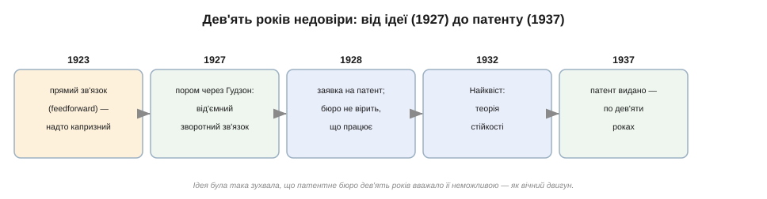
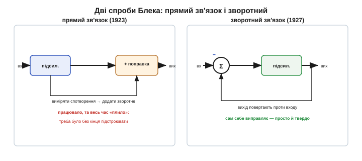
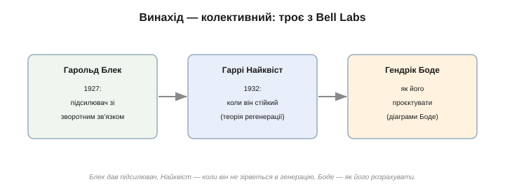

# 📜 Гарольд Блек і зухвала ідея, що чекала визнання дев'ять років

> Це історична вставка про [від'ємний зворотний зв'язок](root:hw-analog/negative-feedback). У ньому — головний обмін аналогової електроніки: віддати велетенське, але примхливе підсилення — і дістати натомість точність. Думка ця така проста, що нині здається очевидною. А коли її вперше висловили, світ майже сто років тому не повірив: патентне бюро дев'ять років вважало її неможливою. Ось історія однієї поїздки на поромі, що змінила електроніку, — і чесне нагадування, що зробила це не одна людина.

*Шлях ідеї. Спершу — вибагливий «прямий зв'язок» (1923); тоді осяяння на поромі (1927); заявка на патент (1928), якій патентне бюро дев'ять років не вірило; теорія стійкості Найквіста (1932); і нарешті патент (1937). Між заявкою й видачею — ціле десятиліття недовіри.*

---

## Проблема: розмова, що губилася в дорозі

На початку 1920-х перед телефонними інженерами стояла, здавалося б, нездоланна стіна — **далекий зв'язок**. Сигнал, біжучи дротом через континент, слабшає; щоб донести голос від Нью-Йорка до Сан-Франциско, його доводилося раз у раз **підсилювати** — ставити вздовж лінії десятки підсилювачів-повторювачів на радіолампах.

Та була халепа. Кожен ламповий підсилювач трохи **спотворював** сигнал — додавав від себе хрипи й нелінійність. Один підсилювач — дрібниця; але коли їх **сотні** поспіль, спотворення накопичуються, мов снігова куля, і на тому кінці лишається нерозбірлива каша. Що довша лінія, то більше підсилювачів — і то гірша розмова. Зробити кожен підсилювач достатньо чистим звичайними засобами не виходило: лампи старіли, грілися, «плавали», і їхній характер повзав сам по собі. Саме над цією стіною й бився молодий інженер **Western Electric** (згодом Bell Telephone Laboratories) — **Гарольд Стівен Блек** *(Harold Stephen Black)*, американський електротехнік.

## Перша спроба: прямий зв'язок

Блек був упертий і винахідливий. Ще 1923 року, надихнувшись доповіддю інженера Чарльза Штайнмеца, він придумав першу атаку на спотворення — **прямий зв'язок** *(feedforward)*. Ідея хитра: виміряти, **наскільки** підсилювач спотворив сигнал (порівнявши його вхід і вихід), виділити саме оту «брудну» домішку — і додати її **навпаки** на виході, щоб вона сама себе погасила.

*Прямий зв'язок (ліворуч): виміряти спотворення й додати йому протилежне — працювало в лабораторії, та весь час «плило», бо потребувало безперервного підстроювання ламп. Зворотний (праворуч): повернути сам вихід проти входу — схема стає самовиправною, простою й твердою.*

На столі це навіть працювало. Але в полі прямий зв'язок виявився **капризним**: щоб погашення лишалося точним, доводилося безперестанку підкручувати струми й напруги ламп, що повзли від нагріву й старіння. Для телефонної мережі на тисячі підсилювачів, де ніхто не стоятиме з викруткою біля кожного, це не годилося. Потрібен був спосіб, що **сам** тримав би себе в формі.

## Осяяння на поромі

Розв'язок прийшов несподівано. Серпневого ранку **1927 року** Блек, як завжди, плив **поромом через річку Гудзон** на роботу — з Нью-Джерсі на Мангеттен. І там, у дорозі, його осяяло. А що, як повертати на вхід підсилювача **не** виділене спотворення, а **сам вихід** — та ще й **проти** входу, щоб він йому протидіяв?

Думка була настільки ясна й настільки важлива, що Блек, не маючи паперу, накидав схему й рівняння просто на сторінці ранкової газети **New York Times** (як переказують, на бракованому, криво надрукованому аркуші), а тоді підписав і поставив дату — щоб закріпити дату винаходу. Той газетний аркуш став однією з найзнаменитіших реліквій в історії електроніки.

Суть ідеї була **парадоксальна** до зухвалості. Блек пропонував навмисне **викинути** більшу частину дорогоцінного підсилення — повернути його в петлю, щоб воно гасило саме себе. Сучасникам це здавалося безглуздям: інженери десятиліттями **боролися** за кожен децибел підсилення, а тут хтось каже його **марнувати**. Та натомість підсилювач ставав **точним і стабільним**: завдяки [від'ємному зворотному зв'язку](root:hw-analog/negative-feedback) його поведінку тепер задавали тверді резистори, а не примхливі лампи. Віддати кількість — здобути якість.

## Чому світ не повірив

Блек подав заявку на патент **8 серпня 1928 року**. А далі сталося дивовижне: патент видали аж **через дев'ять років** — у **грудні 1937-го** (US Patent 2 102 671). Чому так довго?

Бо ідея настільки суперечила усталеним уявленням, що **патентне бюро просто не вірило, що вона працює**. Експерти ставилися до «підсилювача, що віддає підсилення», приблизно як до заявки на **вічний двигун** — як до фізично неможливого пристрою, що його не варто й розглядати. Знадобилося дев'ять років, доти Блек і колеги з AT&T побудували не лише робочий підсилювач, а й **теорію**, яка строго пояснювала, чому й коли він стійкий, — щоб недовіра нарешті розвіялася. 1934 року Блек опублікував класичну працю «Stabilized Feed-Back Amplifiers», де виклав усе зріло й переконливо.

Аби відчути цю недовіру, треба згадати дух тієї доби. Радіолампа була дорога, вибаглива й недовговічна, а підсилення — рідкісним і коштовним здобутком, за який інженери боролися роками. Сказати «віддаймо більшу частину підсилення назад» означало для них викинути на вітер найдорожче, що є в схемі. Те, що натомість приходить **точність**, годі було вкласти в голову, поки не з'явилася теорія, яка це строго довела. Найбільші ідеї часто й виглядають спершу як марнотратство чи дивацтво — саме тому, що ламають звичку.

## Винахід — не одна людина

І тут — найважливіша частина історії, яку легенда любить опускати. Сам по собі зворотний зв'язок **небезпечний**: якщо повернути сигнал невдало, підсилювач зі стабільного перетворюється на **генератор** — починає сам себе розгойдувати й вищати — та сама пастка [додатного зворотного зв'язку](root:hw-analog/schmitt-trigger). Блек дав **підсилювач**, але не дав способу **гарантувати**, що той не зірветься в генерацію. Цю прогалину закрили інші.

*За «підсилювачем Блека» стоять троє з Bell Labs. Блек дав сам підсилювач (1927). Гаррі Найквіст — теорію, що каже, **коли** він стійкий, а коли зірветься (1932). Гендрік Боде — практичні методи, **як** його розрахувати (діаграми Боде). Один винайшов, другий пояснив, третій навчив проєктувати.*

Щоб зрозуміти стійкість, Блек звернувся по допомогу до колеги — **Гаррі Найквіста** *(Harry Nyquist)*, шведсько-американського інженера Bell Labs (народженого у Швеції й молодим емігрувавшого до США). Той відповів славетною працею «Regeneration Theory» (1932), де вивів **критерій стійкості**: точний спосіб сказати наперед, чи буде підсилювач зі зворотним зв'язком спокійним, чи зірветься в самозбудження. А вже згодом інший інженер Bell Labs — **Гендрік Воде Боде** *(Hendrik Wade Bode)*, американець, — розробив наочні **методи проєктування** (відомі нині як діаграми Боде), що перетворили теорію на щоденний інженерний інструмент.

Тож «підсилювач зі зворотним зв'язком» — це праця **щонайменше трьох**: Блек **винайшов**, Найквіст **пояснив**, коли він не зірветься, Боде **навчив** його розраховувати. Як і більшість великих ідей в електроніці, ця виросла не з одного осяяння, а з колективної роботи цілої лабораторії.

## Що з цього виросло

Спершу зворотний зв'язок зробив те, заради чого й створювався: **далекий телефонний зв'язок** став реальністю — тепер сотні чистих, стабільних повторювачів несли голос через континент і під океаном, не перетворюючи його на кашу. Без цього принципу не було б ні континентальних коаксіальних магістралей, де сигнал ішов крізь сотні підсилювачів поспіль, ні першого **трансатлантичного** телефонного кабелю (1956), у глибинах якого низка лампових повторювачів несла розмову через цілий океан. Кожен такий повторювач лишався чистим і стабільним роками саме завдяки зворотному зв'язку — без нього спотворення з'їли б голос уже на перших милях.

Та справжній масштаб ідеї виявився куди більшим. Виявилося, що **від'ємний зворотний зв'язок** — це універсальний принцип точності, далеко за межами підсилювачів. На ньому стоїть уся **теорія керування**: автопілот літака, термостат, круїз-контроль, регулятор обертів двигуна — усе це порівнює бажане з фактичним і відпрацьовує різницю, точнісінько як підсилювач Блека. На ньому ж тримається й увесь [операційний підсилювач](root:hw-analog/ideal-opamp): уся його магія приборкання — це Блекова ідея [від'ємного зворотного зв'язку](root:hw-analog/negative-feedback), доведена до досконалості. Сама ж формула, що ховається за цим обміном, — у [математичній вставці](root:hw-analog/negative-feedback/math-feedback-formula.md).

Історія Блекового зв'язку — ще один приклад ідеї, що випередила свій час і мусила чекати визнання, як свого часу чекали [польовий транзистор](root:hw-components/field-control/hist-mosfet.md) і [КМОН](root:hw-digital/cmos/hist-cmos.md). Тільки тут чекати довелося не приладу, а самій **думці** — поки інженерний світ дозрів її прийняти.

Тож наступного разу, налаштовуючи підсилення дільником резисторів чи дивуючись, як ОП тримає вихід точним усупереч примхам, згадайте інженера на поромі через Гудзон, що зухвало вирішив **викинути** підсилення заради якості, — і дев'ять років чекав, поки світ збагне, що він мав рацію.
