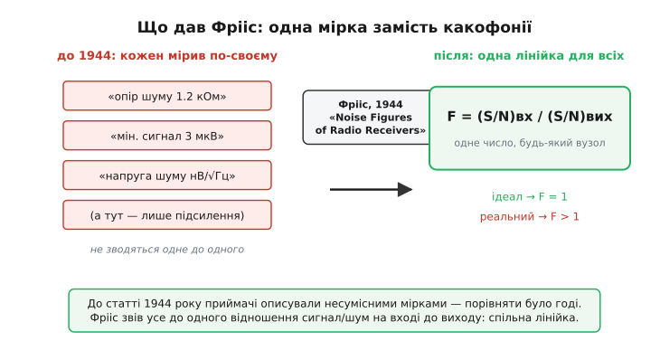

# 📜 Гаральд Фрііс: як приймачам дали спільну лінійку

> Історична вставка до теми [коефіцієнт шуму](root:hw-analog/noise-figure). Сьогодні NF читають у даташиті як зріст на одвірку — одне число, і одразу видно, котрий підсилювач тихіший. Але до 1944 року цієї лінійки не існувало. Радіоінженери відчували, що один приймач «чутливіший» за інший, а порівняти їх чесно не могли — кожна лабораторія міряла по-своєму. Це історія про данського інженера, який дав усім спільну мірку, про опору в 290 кельвінів, узяту майже навмання, і про те, як одна формула пов'язала між собою малошумний підсилювач у вас на столі, перші радіосигнали з Чумацького Шляху і відлуння Великого вибуху.

Уявіть радіоінженера десь у 1940 році. Він тримає в руках два приймачі й хоче сказати, котрий кращий ловить слабкий сигнал. Підсилення в обох однакове, смуга однакова. Та один «чує» далеку станцію, а другий тоне в шипінні. Чому? Бо другий приймач сам по собі шумить більше — десь у його лампах і опорах народжується власне шипіння, що ховає корисне. Інженер це **відчуває**, але числа в нього немає. Він може сказати «цей кращий», та не може сказати **на скільки** й не може записати це в специфікацію так, щоб колега за океаном зрозумів те саме.

Ось у чому була справжня біда — не у фізиці, а в **мові**. Власний шум приймача кожен описував своїми словами. Хтось казав «еквівалентний опір шуму стільки-то ом». Хтось — «мінімальний сигнал, який ще чути, стільки-то мікровольт на антені». Хтось мовчав і давав лише підсилення. Ці описи не зводилися один до одного: щоб із «опору шуму» дістати «мінімальний сигнал», треба було знати ще купу умов — яка смуга, який опір антени, яка температура. Два чесних інженери, мірявши той самий приймач, виходили з різними цифрами просто тому, що міряли в різних умовах і називали різними словами. Порівнювати специфікації було як порівнювати відстані, коли один міряє в кроках, другий у ліктях, а третій — «скільки встигнеш пройти до обіду».

## Те, що бентежило: шум, якого не уникнути

Щоб зрозуміти, чому мірка взагалі знадобилася саме тоді, треба згадати, що на той час уже знали про шум. А знали несподівано багато — і це знання було свіже й тривожне.

Наприкінці 1920-х **Джон Бертранд Джонсон** (*John Bertrand Johnson*, 1887–1970, народжений у Гетеборзі швед, інженер Bell Labs) помітив у лабораторії неприємну річ: будь-який резистор, навіть просто лежачи на столі, без жодного струму, **сам собою** видає на кінцях крихітну шумову напругу. Це не дефект, не брудний контакт — це теплове ворушіння електронів усередині провідника. Що тепліший резистор і що більший його опір, то гучніше воно шумить. Свій вимір Джонсон описав у статті 1928 року, а колега по Bell Labs **Гаррі Найквіст** (*Harry Nyquist*, 1889–1976, народжений у шведському Нільсбю, до США емігрував 1907-го) того ж 1928 року вивів формулу цього шуму з самих засад термодинаміки — і вийшло, що його не можна ні екранувати, ні відфільтрувати, ні охолодити інакше, ніж буквально холодом. Це **фундаментальна підлога**: будь-який вхідний опір приймача вже шумить, ще до того, як прийде хоч один корисний сигнал.

> Звідки береться ця теплова напруга, чому вона дорівнює √(4kTRB) і чому залежить лише від температури, опору та смуги, а не від матеріалу чи струму — у статті [тепловий шум](root:hw-analog/resistor-noise). Для нашої історії досить одного: ще до Фрііса фізики знали, що в кожного приймача на вході є неуникний тепловий шум, і знали, скільки його точно.

І ось тут визрівала головна думка. Якщо існує **неуникний мінімум** шуму — той самий тепловий шум вхідного опору, — то його можна взяти за **точку відліку**. Ідеальний, уявний приймач не додавав би до цього мінімуму нічого свого: що зайшло теплової підлоги, те й вийшло (помножене на підсилення, звісно). Реальний приймач домішує власне шипіння **понад** цю підлогу. Тоді якість приймача — це не якесь окреме загадкове число, а проста відповідь на питання: **у скільки разів він підняв шум над тією неминучою тепловою підлогою?** Один приймач підняв удвічі, другий — у десять разів; перший очевидно кращий, і тепер це **число**, а не відчуття.

Думка проста — аж дивно, що її треба було комусь уперше чітко вимовити. Але саме так буває з найкращими ідеями: доки їх не сформулюють, усі ходять навколо й мучаться, а щойно сформулюють — здається, ніби це було завжди.

## Дві спроби: спершу Норт, потім Фрііс

Тут історія вимагає чесності, бо мірку, як майже все в техніці, придумала не одна людина в одну мить. Спершу до неї підступився інший інженер.

На початку 1942 року **Дуайт Норт** (*Dwight O. North*) з лабораторій RCA опублікував у *RCA Review* статтю «The Absolute Sensitivity of Radio Receivers» (січень 1942). Норт першим запропонував характеризувати приймач **числом**, що показує, на скільки його власний шум перевищує неминучий тепловий мінімум, — і назвав це **коефіцієнтом шуму** (*noise factor*). Це був правильний напрям. Та Нортове означення лишалося прив'язаним до конкретних умов — узгоджених опорів на вході приймача, — і через те було вужче, ніж хотілося б. Воно працювало для випадку, коли антена точно узгоджена з приймачем, а в реальному житті так буває не завжди.

> 🔧 **Навіщо це.** Це типова історія народження інженерного поняття, і її варто бачити чесно: майже ніколи воно не з'являється «з нічого в одній голові». Норт дав ідею й перше означення; Фрііс зробив його загальним і зручним. Так само було з радіо (Герц, Лодж, Попов, Тесла, Марконі, Бозе — кожен щось додав), з транзистором, з безліччю формул. Коли в даташиті стоїть «формула Фрііса», корисно пам'ятати, що за нею стоїть і Норт, — не щоб применшити Фрііса, а щоб не вірити в міф про самотнього винахідника.

За два роки, у липні 1944-го, у *Proceedings of the IRE* (том 32, сторінки 419–422) вийшла стаття **«Noise Figures of Radio Receivers»** за підписом **H. T. Friis**. Вона зробила з Нортової ідеї робочий стандарт. Фрііс дав **строге означення**, яке не спиралося на узгодження й працювало не лише для приймача загалом, а для **будь-якого чотириполюсника** — будь-якого вузла з входом і виходом: підсилювача, змішувача, кабелю, фільтра. Він записав коефіцієнт шуму як відношення сигнал/шум на вході до відношення сигнал/шум на виході — те саме означення, яке стоїть у підручниках і сьогодні:

```
F = (S/N)_вх / (S/N)_вих
```

Просте до краси. Воно каже буквально: **на скільки елемент погіршив відстань між сигналом і шумом, поки сигнал крізь нього проходив.** Ідеальний елемент нічого не псує — F = 1. Реальний завжди дає F > 1. Жодних «опорів шуму в омах», жодних «мікровольтів на антені» — одне відношення, однакове для будь-якого вузла будь-якого виробника. Лінійка, якої бракувало.


*Що насправді змінила стаття 1944 року. Ліворуч — як описували чутливість до неї: опір шуму в омах, мінімальний сигнал у мікровольтах, напруга шуму, а то й сама лише цифра підсилення; ці описи не зводяться один до одного. Праворуч — те, що дав Фрііс: одне відношення сигнал/шум на вході до виходу, однакове для будь-якого вузла. Спільна лінійка замість какофонії.*

## Опора в 290 кельвінів: умовність, узята близько до правди

У означенні F = (S/N)_вх / (S/N)_вих ховається пастка, яку Фрііс мусив закрити, інакше вся мірка розсипалася б. Щоб порахувати, на скільки елемент **погіршив** SNR, треба знати, який шум був **на вході**. А вхідний шум — це тепловий шум джерела, і він залежить від **температури** цього джерела: гарячий вхід шумить більше, холодний менше. Якщо кожен мірятиме при своїй температурі, цифри знову розповзуться, і ми повернемося туди, звідки втікали.

Отже, треба **домовитися про одну температуру** для всіх вимірів — стандартну опору. І Фрііс запропонував число: **T₀ = 290 кельвінів**. Це 16.85 °C — майже кімната, трохи прохолодна.

Чому саме 290, а не круглі 300 чи звичні 293 (це рівно 20 °C)? Тут і криється цікаве. Вибір був **подвійно зручний**, і обидві причини варто бачити.

Перша — фізична, прив'язана до Землі. Антена наземного приймача дивиться не в порожнечу, а крізь атмосферу на передавач. Повітря, ґрунт, далекі предмети, що потрапляють у її поле зору, мають температуру близько кількох сотень кельвінів, і 290 К непогано лягає на **середню температуру, яку реально «бачить» приймальна антена**, дивлячись крізь атмосферу. Тобто опора не висмоктана з пальця — вона близька до того, з чим наземна техніка й справді працює.

Друга причина — буденна арифметика. Помножмо сталу Больцмана на цю температуру й подивімося, що виходить для теплової потужності шуму в смузі один герц:

```
k·T₀ = 1.38×10⁻²³ · 290 ≈ 4.00×10⁻²¹ Вт/Гц
```

Майже рівно 4×10⁻²¹. А якщо перевести це у децибели відносно мілівата:

```
10·log₁₀(4.00×10⁻²¹ / 1×10⁻³) ≈ −174 дБм/Гц
```

Виходить кругле, легке для пам'яті число — **−174 дБм/Гц**, шумова підлога входу при кімнатній температурі. На 293 чи 300 К арифметика була б трохи бруднішою. Тож 290 К — це **умовність**, обрана так, щоб водночас і бути близькою до реальних земних умов, і давати зручні числа. Не священна константа, а вдала домовленість.

> 🔧 **Навіщо це.** Те, що 290 К — лише умовність, а не закон природи, має дуже практичний наслідок. Коли приймач працює в звичних земних умовах, опора чесна, і коефіцієнт шуму правдиво каже, скільки тиші лишилося. Але щойно вхід перестає бути «кімнатним» — антена радіотелескопа дивиться в холодне небо на кілька кельвінів, або приймач занурений у рідкий азот, — нормування на 290 К перестає чесно описувати систему. Тому в радіоастрономії й супутниковому зв'язку шумність задають не коефіцієнтом шуму, а **шумовою температурою**: вона не прив'язана до земних 290 К і чесна за будь-якого входу. Хто знає, звідки взялося 290, той знає й де ця мірка ламається.

## Друге відкриття в тій самій статті: формула накопичення

Якби Фрііс лише дав означення й опору, його ім'я й так лишилося б у підручниках. Але в тій самій статті 1944 року він зробив другий крок, не менш важливий, і саме його сьогодні найчастіше називають **формулою Фрііса**.

Приймач — це завжди **ланцюг**: антена, підсилювач, змішувач, фільтр, ще підсилювач. Кожна ланка має свій коефіцієнт шуму. Питання, на яке Фрііс відповів формулою: як із коефіцієнтів шуму окремих ланок дістати коефіцієнт шуму **всього тракту**? І відповідь виявилася не лише формулою, а й глибоким практичним правилом.

Логіка така. Власний шум першої ланки заходить на вхід як є — перед нею нічого немає, її шум ні на що не поділений. Власний шум другої ланки народжується **після** першого підсилення; щоб чесно порівняти його з вхідним сигналом, його треба «віднести до входу» — поділити на підсилення першої ланки. А підсилення зазвичай велике, тож на вході шум другої ланки виглядає вже маленьким. Шум третьої ділиться на **добуток** підсилень першої й другої — і майже зникає. Склавши всі внески, зведені до входу, Фрііс дістав:

```
F = F₁ + (F₂ − 1)/G₁ + (F₃ − 1)/(G₁·G₂) + (F₄ − 1)/(G₁·G₂·G₃) + …
```

Тут F₁, F₂, … — коефіцієнти шуму ланок у разах, G₁, G₂, … — їхні підсилення в разах. І з цієї формули випливає висновок, що перевернув проєктування приймачів: **перша ланка вирішує майже все.** Її коефіцієнт шуму лягає на тракт повністю, нічим не поділений; усі наступні діляться на дедалі більший добуток підсилень і важать дедалі менше. Постав на самий вхід тихий підсилювач із великим підсиленням — і він зробить дві справи заразом: своїм малим шумом не зіпсує вхід, а великим підсиленням «утопить» шум усього, що стоїть за ним.

> Повне виведення цієї формули з першопричини — чому в неї входить саме надлишок (Fₙ − 1), а не сам Fₙ, чому ділиться на добуток підсилень і як вона переходить у мову шумових температур — у вставці [виведення формули Фрііса](root:hw-analog/noise-figure/math-friis-cascade.md). Тут важливе інше: обидва наріжні камені слабкосигнальної радіотехніки — і саме поняття коефіцієнта шуму, і правило «перший каскад вирішує» — народилися в одній статті 1944 року.

Саме через цю формулу й донині малошумний підсилювач ставлять **якомога ближче до антени**, часто прямо на ній. Кожен інженер, який тягне коротенький кабель від антени до першого підсилювача, а не навпаки, мимоволі підкоряється тому, що Фрііс вивів вісімдесят років тому.

## Хто такий Фрііс: данський годинникар точності

За формулою стоїть людина, і вона варта знайомства, бо її вдача багато пояснює в самій роботі.

**Гаральд Трап Фрііс** (*Harald Trap Friis*, 22 лютого 1893 — 15 червня 1976) народився в містечку **Нествед** (*Næstved*) на острові Зеландія в Данії. У 1916 році він закінчив **Технічний університет Данії** (*Danmarks Tekniske Universitet*) з дипломом інженера-електрика, попрацював на Королівській збройовій фабриці, а 1919-го дістав стипендію Колумбійського університету й переїхав до США вивчати радіотехніку. У 1920 році він прийшов до дослідницької групи Western Electric, яка 1925-го стала частиною **Bell Labs**, — і лишився там на все життя. Данець за народженням, американець за кар'єрою.

Сучасники описують Фрііса як інженера **майже одержимого точністю й простотою**. Він не терпів зайвої складності: розповідають, що, маючи вибір між мудрованим електронним термостатом і простим механічним, він брав механічний — бо той робив справу й не давав зайвого приводу зламатися. Він вимагав бездоганних вимірів і бездоганного приладдя й передавав цю одержимість молодшим. Один його вислів добре передає вдачу: щоб зробити роботу як слід, вона має **переслідувати тебе вдень і вночі**. Саме така людина й могла висидіти строге означення там, де інші вдовольнялися приблизним відчуттям.

> 🔧 **Навіщо це.** Це не просто рисочка до портрета. Звідки взялася сама потреба в строгій мірці? З вдачі, що не зносить «приблизно». Поки інженери казали «цей приймач якось чутливіший», працювати ще можна було, та точно проєктувати — ні. Коефіцієнт шуму народився саме з відмови вдовольнятися нечітким: коли когось по-справжньому муляє відсутність числа, він те число зрештою й створює. У вашій роботі те саме — найкорисніші мірки родяться там, де хтось відмовився миритися з «на око».

## Не лише шум: Фрііс серед піонерів радіо

Коефіцієнт шуму — далеко не єдине, чим Фрііс лишився в історії, і варто окреслити повніше, бо це показує масштаб.

Через два роки після статті про шум, у травні 1946-го, він опублікував у *Proceedings of the IRE* коротеньку замітку «Note on a Simple Transmission Formula». У ній — **формула передачі Фрііса** (*Friis transmission equation*), що пов'язує потужність, прийняту однією антеною, з потужністю, випроміненою іншою, через відстань між ними, довжину хвилі та підсилення антен. Це наріжний камінь розрахунку будь-якої радіолінії — від рації до супутника: коли інженер прикидає, чи долетить сигнал, він майже напевно користується цією формулою. Прикметно, що **дві різні «формули Фрііса»** — для накопичення шуму й для передачі між антенами — обидві досі в щоденному вжитку, хоч описують зовсім різні речі.

Фрііс багато працював з **антенами**. Разом з Едмондом Брюсом (*Edmond Bruce*) він приклав руку до ромбічної антени, а разом з Альфредом Беком (*Alfred C. Beck*) — до **рупорно-дзеркальної антени** (*horn-reflector antenna*), широкого металевого рупора, що збирає радіохвилі, майже не додаючи власного шуму. І тут історія робить разючий виток. Саме рупорно-дзеркальна антена цього типу стояла потім у Холмделі (*Holmdel*), де Фрііс довгі роки керував радіолабораторією Bell Labs. І саме на холмделівському рупорі в 1965 році **Арно Пензіас** (*Arno Penzias*) і **Роберт Вілсон** (*Robert Wilson*) випадково спіймали слабке рівномірне шипіння, що йшло з усього неба однаково, — **реліктове випромінювання**, відлуння Великого вибуху, за яке 1978 року дістали Нобелівську премію. Антена, що її тип Фрііс із Беком придумали для тихого приймання радіохвиль, зрештою впіймала найдавніший сигнал у Всесвіті. (Будьмо точні: конкретний холмделівський рупор збудували вже 1959–60 для супутникового проєкту «Ехо»; Фріісу з Беком належить сам **тип** антени, не та окрема споруда.)

І ще одна нитка, що замикає коло. Ще на початку 1930-х Фрііс допомагав налаштовувати приймач **Карлу Янському** (*Karl Jansky*) — інженерові Bell Labs, який, шукаючи джерело тріску на телефонних лініях, уперше в історії спіймав **радіовипромінювання з Чумацького Шляху** й тим заснував радіоастрономію. Щоб відрізнити кволий космічний сигнал від шуму приймача, треба було той шум приймача **точно знати** — а це рівно те, що згодом строго опише коефіцієнт шуму. Полювання за слабкими сигналами з космосу й народження мірки шуму виявилися двома боками однієї роботи.

За все це Фрііса вшанували сповна. У 1955 році він дістав найвищу нагороду **Інституту радіоінженерів** (*Institute of Radio Engineers*, IRE — той самий, що 1963-го злився з іншим товариством у сьогоднішній IEEE) — **Медаль Пошани** (*Medal of Honor*), з формулюванням: «За видатний технічний внесок у розширення корисного спектра радіочастот і за натхнення та провід, які він дав молодим інженерам». Серед інших відзнак — премія Морріса Лібмана (1939), золота медаль Вальдемара Поульсена (1954) і данський орден Данеброг (1954); за життя він зібрав 31 патент США.

## Що лишилося нам

Озирнімося. До 1944 року приймачі не мали спільної лінійки: власний шум кожен описував своїми словами, і чесно порівняти два прилади було майже неможливо. Дуайт Норт дав ідею й перше означення; Гаральд Фрііс у статті «Noise Figures of Radio Receivers» зробив із неї робочий стандарт — строге означення F = (S/N)_вх / (S/N)_вих, що годиться для будь-якого вузла, опору в 290 кельвінів (умовність, узяту близько до земної правди й до круглих чисел) і формулу накопичення шуму в ланцюгу, з якої випливає головне правило слабкосигнальної радіотехніки — перша ланка вирішує. Усе це й сьогодні стоїть у кожному даташиті й підручнику.

А за сухою цифрою NF проступає більше, ніж електроніка. Проступає данський інженер, одержимий точністю настільки, щоб не миритися з «приблизно». Проступає те, як народжуються мірки — з відмови когось вдовольнятися нечітким відчуттям. І проступає несподіване споріднення: мірка, придумана, щоб чесно порівнювати земні приймачі, виявилася тим самим інструментом, яким відрізняють кволий шепіт космосу від шипіння власних ламп, — і антена того ж роду, що Фрііс зробив тихою, зрештою почула відлуння народження Всесвіту. Одне число про те, «на скільки елемент псує сигнал», тримає в собі цілий шмат історії радіо.
