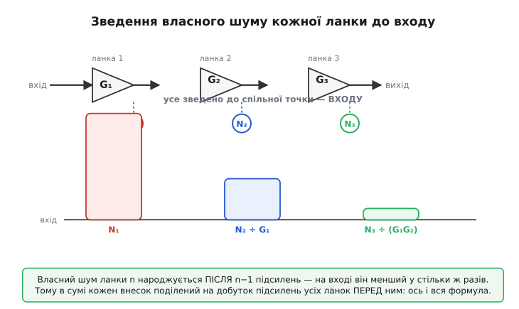
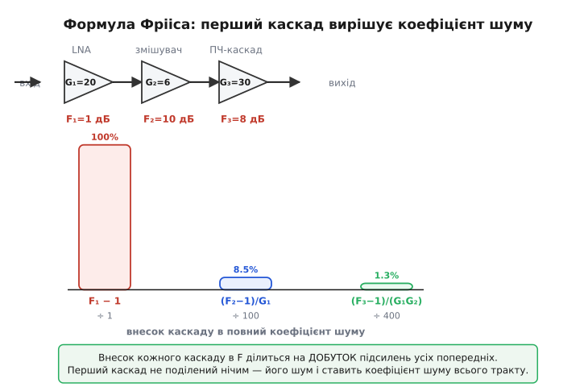
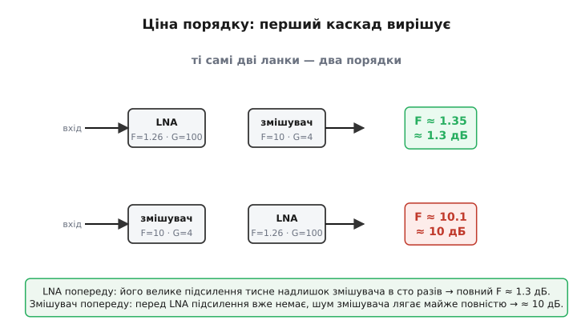

# 🧮 Виведення формули Фрііса: чому перша ланка вирішує

Формула, що задає повний коефіцієнт шуму ланцюга, виглядає так, ніби її просто оголосили:

```
F = F₁ + (F₂ − 1)/G₁ + (F₃ − 1)/(G₁·G₂) + (F₄ − 1)/(G₁·G₂·G₃) + …
```

Дивишся й маєш купу питань. Чому друга ланка входить як **(F₂ − 1)**, а не просто F₂ — звідки взялася ця віднята одиниця? Чому надлишок ділиться саме на **G₁** — на підсилення тільки першої ланки, а не, скажімо, на її коефіцієнт шуму? Чому третя ланка ділиться на **добуток** G₁·G₂, а не на їхню суму чи на щось іще? І головне — чому з цього всього випливає, що перша ланка важить непомірно більше за решту?

Жодне з цих питань не закрити, дивлячись на готову формулу: вона лише підсумок. Тож збудуймо її з нуля — з одного-єдиного прийому, який рятує **будь-який** шумовий розрахунок у каскадному тракті. Прийом зветься **зведенням до входу** (англ. *input-referral*), і коли ти його раз побачиш, формула Фрііса перестане бути набором символів і стане очевидністю, яку інакше й бути не могло.

> Усе нижче спирається на саме означення коефіцієнта шуму — F = SNR_вх/SNR_вих, а зведене до власного шуму елемента F = 1 + N_власний/(G·N_вх), де N_вх — теплова підлога джерела kT₀ при 290 К. Якщо ця рівність ще не лежить у голові твердо, її виводять у статті [коефіцієнт шуму](topic:hw-analog/noise-figure). Тут вона — наша відправна точка, з неї все й розкрутиться.

## Спершу — мова, якою ми будемо рахувати

Щоб щось скласти, треба домовитися, **що** саме ми складаємо, і робити це в однакових одиницях. Шум елемента можна задавати трьома способами, і всі три ми задіємо, тож закріпімо їх відразу, без плутанини.

Перший спосіб — **потужність шуму** N у ватах (точніше — спектральна густина у ватах на герц, бо коефіцієнт шуму нормований на один герц смуги). Це найфізичніший спосіб: скільки реальної шумової потужності тече в даній точці тракту. Саме потужності складаються, коли незалежні джерела шуму сходяться в одній точці, — це ключ до всього розрахунку.

> 🔧 **Навіщо це.** Складати треба саме потужності, а не напруги, і це не дрібниця. Два незалежні джерела шуму з середньоквадратичними напругами u₁ і u₂ дають разом не u₁ + u₂, а √(u₁² + u₂²) — бо некорельовані сигнали складаються «по теоремі Піфагора», їхні **квадрати** (тобто потужності) додаються лінійно, а самі напруги — ні. Тому весь шумовий облік ведуть у потужностях: там додавання просте, а наприкінці, як треба, переходять назад до напруги через корінь.

Другий спосіб — **коефіцієнт шуму** F, безрозмірне число в разах. За означенням F = 1 + N_власний/(G·kT₀): одиниця плюс власний шум елемента, зведений до входу й поділений на теплову підлогу джерела. Цей запис уже містить у собі ідею зведення до входу — придивись: N_власний поділено на G, тобто власний шум, що народився **всередині** елемента, перенесено на його **вхід**. Це не випадковість; це та сама операція, яку ми зараз масштабуємо на цілий ланцюг.

Третій спосіб — **еквівалентна шумова температура** Te в кельвінах, через Te = (F − 1)·T₀. Він знадобиться наприкінці, бо в мові температур формула Фрііса стає ще прозорішою — там не доводиться тягати за собою віднятих одиниць. Але почнемо з потужностей і коефіцієнтів, а до температур доростемо, коли механізм уже стоятиме.

І ще одна домовленість про підсилення. G — це підсилення **за потужністю** в разах (не за напругою!). Коли сигнал проходить ланку з підсиленням G, його потужність множиться на G; так само множиться й потужність будь-якого шуму, що зайшов на вхід цієї ланки. Це теж не дрібниця: підсилювач не розрізняє, де сигнал, а де шум, — він однаково множить на G усе, що приходить йому на вхід. Саме на цій байдужості підсилення до природи сигналу й тримається вся подальша логіка.

## Дві ланки: уся суть формули вже тут

Найкоротший шлях до істини — взяти **дві** ланки й чесно простежити кожну порцію шуму від народження до виходу. Три, чотири, сто ланок потім додадуться самі собою; механізм цілком видно вже на двох.

Маємо ланцюг: сигнал заходить, проходить першу ланку (підсилення G₁, власний шум якоїсь величини), тоді другу (підсилення G₂, свій власний шум) — і виходить. Запитання: який повний коефіцієнт шуму цієї пари?

Поставмо в тракт три величини й простежмо їх до самого виходу.

**Сигнал.** На вхід приходить корисна потужність S. Перша ланка множить її на G₁, друга — ще на G₂. На виході сигнал має потужність:

```
S_вих = S · G₁ · G₂
```

Просто: сигнал лише множиться, нічого з ним більше не діється.

**Шум, що зайшов із джерела.** Разом із сигналом на вхід приходить теплова підлога джерела — потужність N₀ = kT₀ (на герц). Вона для підсилювача невідрізненна від сигналу: теж множиться на G₁, тоді на G₂. На виході цей «вхідний» шум має потужність:

```
N₀_вих = N₀ · G₁ · G₂ = kT₀ · G₁ · G₂
```

**Власний шум першої ланки.** Усередині першої ланки народжується її власний шум. Зручно описувати його так, ніби він **зайшов на вхід** цієї ланки додатковою потужністю Na₁ (індекс a — від *added*, доданий), а далі ланка чесно підсилила і його. Чому так зручно — бо тоді власний шум стоїть поряд із вхідним сигналом, в одній точці, і їх легко порівнювати; саме ця домовленість і ховається в означенні F₁ = 1 + Na₁/(kT₀). Звідси Na₁ = (F₁ − 1)·kT₀ — і ось уже з'явилася та сама **віднята одиниця**, та поки що тільки в першій ланці. Цей власний шум, зайшовши на вхід першої ланки, проходить **обидва** підсилення:

```
Na₁_вих = Na₁ · G₁ · G₂ = (F₁ − 1)·kT₀ · G₁ · G₂
```

**Власний шум другої ланки — ось де вся сіль.** Усередині другої ланки народжується **її** власний шум. Опишемо його так само — ніби він зайшов на вхід **другої** ланки потужністю Na₂ = (F₂ − 1)·kT₀. Але вдумайся, **де** саме він заходить: на вході другої ланки, тобто **після** першого підсилення. Перед ним стоїть лише G₂ — друге підсилення, — а G₁ він уже **проґавив**, бо народився за ним. На виході власний шум другої ланки має потужність:

```
Na₂_вих = Na₂ · G₂ = (F₂ − 1)·kT₀ · G₂
```

Зверни увагу — тут множник лише **G₂**, без G₁. Це й є фізичне коріння всієї асиметрії: власний шум другої ланки народжується вже за першим підсилювачем і тому не отримує його підсилення. А сигнал — отримує. Ось чому вони на виході опиняться в різних масштабах, і ось чому друга ланка зрештою важитиме менше.

Тепер зберімо вихідний шум докупи. Усі три шумові внески незалежні (теплова підлога, шум першої ланки, шум другої — нічого спільного), тож їхні потужності на виході **складаються**:

```
N_вих = N₀_вих + Na₁_вих + Na₂_вих
      = kT₀·G₁·G₂ + (F₁−1)·kT₀·G₁·G₂ + (F₂−1)·kT₀·G₂
```

І застосуймо означення коефіцієнта шуму до всієї пари. F пари — це у скільки разів вихідний шум перевищує те, що дала б сама теплова підлога, пройшовши все підсилення:

```
        N_вих            kT₀·G₁·G₂ + (F₁−1)·kT₀·G₁·G₂ + (F₂−1)·kT₀·G₂
F = ─────────────── = ──────────────────────────────────────────────────
     kT₀ · G₁ · G₂                    kT₀ · G₁ · G₂
```

У знаменнику — повний коефіцієнт підсилення тракту на тепловій підлозі: те, що було б на виході, якби обидві ланки були ідеальні. Поділімо чисельник на знаменник почленно. Спільний множник kT₀ скорочується скрізь:

```
     kT₀·G₁·G₂       (F₁−1)·kT₀·G₁·G₂       (F₂−1)·kT₀·G₂
F = ───────────  +  ──────────────────  +  ─────────────────
     kT₀·G₁·G₂          kT₀·G₁·G₂             kT₀·G₁·G₂

  =      1        +       (F₁ − 1)       +      (F₂ − 1)/G₁

  =  1 + (F₁ − 1) + (F₂ − 1)/G₁

  =  F₁ + (F₂ − 1)/G₁
```

Ось вона. Перший доданок дав одиницю; перший власний шум дав (F₁ − 1) — і разом вони склалися назад у F₁, **цілий**, нічим не поділений. А другий — у третьому дробі G₁ і G₂ скоротилися з G₂ у чисельнику не повністю: лишилося ділення рівно на **G₁**. Власне, від цього скорочення й народилося ділення на підсилення першої ланки: у чисельнику внеску другої ланки стояло G₂ (одне підсилення), а в знаменнику-нормуванні — G₁·G₂ (обидва), тож після скорочення лишилося /G₁.

## Тепер видно відповіді на всі питання

Поглянь на щойно виведене F = F₁ + (F₂ − 1)/G₁ і збери, що кожен символ означає фізично.

**Чому перша ланка — цілий F₁, без поділу.** Бо її власний шум народжується на самому вході, перед усім підсиленням, рівно там, де й вхідний сигнал. Вони обоє проходять однакове підсилення — G₁·G₂, — тож їхнє відношення на виході таке самісіньке, як на вході. Перша ланка нічого не «виграє» від підсилення проти власного шуму: її шум іде ніздря в ніздрю з сигналом. Тому її коефіцієнт шуму лягає на тракт **у повну силу**, як є.

**Чому другий доданок — це надлишок (F₂ − 1), а не сам F₂.** Бо одиниця всередині F₂ — це не власний шум другої ланки. Згадай: F = 1 + (власне)/(теплове). Та одиниця — внесок **ідеальної** ланки, яка лише чесно пропустила крізь себе шум, що до неї дійшов. Але цей «пропущений» шум — теплову підлогу, помножену на G₁, — ми **вже порахували** окремо, у складнику N₀_вих: він зайшов на вхід усього тракту й пройшов обидва підсилення. Якби ми взяли весь F₂, ми б **удруге** долічили ту саму теплову підлогу — раз як вхідну, що пройшла все, і вдруге як «одиницю» в F₂. Подвійний облік. Тому від F₂ віднімаємо одиницю: лишається тільки те, що друга ланка **додала свого** — її надлишок над ідеалом. Складають саме надлишки; теплову підлогу враховують один-єдиний раз, бо вона в тракті одна.

**Чому ділення на G₁ — на підсилення першої ланки.** Бо власний шум другої ланки народився **після** першого підсилювача, а сигнал — **до** нього. Сигнал на цій ділянці вже підрослий у G₁ разів, а шум другої ланки — ще ні. Отже, проти підрослого сигналу власний шум другої ланки виглядає у G₁ разів дрібнішим, ніж виглядав би на самому вході. Поділити на G₁ — це і є «перенести шум другої ланки на спільний вхід», зробити його порівнянним із вхідним сигналом. Що більше G₁, то глибше топиться внесок другої ланки. Велике підсилення першої ланки — це парасоля, під якою ховається весь шум, що йде позаду.

Три питання — три відповіді, і всі три з одного кореня: **усе зводимо до однієї точки, до входу**. Сигнал там стоїть як є; кожен шум переносимо туди, ділячи на все підсилення, що між його народженням і входом. Перша ланка ні на що не ділиться (між нею і входом немає підсилення), друга ділиться на G₁ (одне підсилення позаду), і так далі.


*Угорі — ланцюг ланок; власний шум N₁, N₂, N₃ народжується на виході кожної, у різних точках. Унизу — ті самі внески, зведені до спільного входу: N₁ як є, N₂ поділений на G₁, N₃ — на добуток G₁·G₂. Що далі ланка по тракту, то глибше топиться її шум, бо тим більше підсилення стоїть між ним і входом.*

## Третя ланка й уся решта: добуток, а не сума

Тепер дописати формулу до будь-якої кількості ланок — справа механічна, бо логіка вже стоїть. Власний шум **n**-ї ланки народжується після того, як сигнал пройшов **усі** ланки перед нею — першу, другу, …, (n−1)-у. Сигнал на тій ділянці вже підрослий у G₁·G₂·…·G_{n−1} разів. А шум n-ї ланки — ще ні. Отже, зведений до входу, він менший проти сигналу рівно в **добуток** усіх цих підсилень:

```
F = F₁ + (F₂ − 1)/G₁ + (F₃ − 1)/(G₁·G₂) + (F₄ − 1)/(G₁·G₂·G₃) + …
```

Чому саме **добуток**, а не сума підсилень — це питання варте зупинки, бо тут легко піддатися хибній інтуїції. Підсилення в каскаді **множаться**: сигнал, пройшовши G₁, тоді G₂, тоді G₃, виходить підрослим у G₁·G₂·G₃ разів — це множення, бо кожна ланка бере вже підрослий вхід і піднімає його ще раз. Власний шум четвертої ланки стоїть перед однією-єдиною річчю — добутком підсилень усіх трьох ланок попереду, бо саме на стільки сигнал випередив його у зростанні. У децибелах підсилення **додаються** (бо логарифм добутку — сума логарифмів), і там справді бачимо суму; але в разах, де живе формула Фрііса, це добуток. Сплутати суму з добутком тут — типова й дорога помилка: при підсиленнях у десятки разів різниця між сумою і добутком — кілька порядків.

> 🔧 **Навіщо це.** Добуток у знаменнику пояснює, чому глибокі ланки тракту майже не впливають на шум, хай яка в них якість. Уяви приймач, де перші три ланки разом дають підсилення 60 дБ — це мільйон разів за потужністю. Власний шум **четвертої** ланки ділиться на цей мільйон: навіть якщо вона шумить, як відро (NF = 20 дБ, F = 100), її внесок у повний F — це (100 − 1)/1 000 000 ≈ 0.0001, тобто нуль для практики. Тому інженер, шукаючи, де в тракті битися за тишу, дивиться лише на перші одну-дві ланки; усе глибше шуміти може майже як завгодно, добуток підсилень його сховає. Гроші й зусилля йдуть туди, де вони дають віддачу, — на вхід.


*Перший каскад входить у повний F цілим, нічим не поділеним; внесок другого вже поділений на підсилення першого, третього — на добуток перших двох. Стовпчики тануть на очах: при типових підсиленнях перша ланка дає майже весь коефіцієнт шуму, решта тоне в добутку підсилень попереду.*

## Те саме мовою температур: складання без віднятих одиниць

Тепер обіцяний другий погляд — через шумову температуру. Він не просто гарніший; він показує, що формула Фрііса в глибині — про звичайне **складання**, тільки складають у ній зведені до входу шуми, а віднята одиниця була лише наслідком того, що ми міряли в разах від теплової підлоги.

Згадаймо зв'язок: будь-який власний шум елемента можна вдати тепловим шумом уявного резистора на вході, нагрітого до температури Te = (F − 1)·T₀. Te каже прямо: скільки кельвінів шуму **додає** цей елемент, зведено до входу. Жодних одиниць віднімати не треба — Te і є чистий надлишок, бо ідеальний елемент має Te = 0.

Підставмо F = 1 + Te/T₀ для кожної ланки у формулу Фрііса. Перша ланка: F₁ = 1 + Te₁/T₀. Надлишок другої: F₂ − 1 = Te₂/T₀. Надлишок третьої: F₃ − 1 = Te₃/T₀. Тоді:

```
F = (1 + Te₁/T₀) + (Te₂/T₀)/G₁ + (Te₃/T₀)/(G₁·G₂) + …
```

Тепер сама температура всього тракту: Te = (F − 1)·T₀. Віднімаємо одиницю (вона якраз з'їдає ту першу одиницю в дужках) і множимо все на T₀ — кожен T₀ у знаменниках скорочується:

```
Te = Te₁ + Te₂/G₁ + Te₃/(G₁·G₂) + Te₄/(G₁·G₂·G₃) + …
```

Ось чистота, заради якої радіоастрономи й супутникові інженери живуть у температурах. Тут **нема** жодної віднятої одиниці — самі шумові температури складаються прямо, кожна поділена на добуток підсилень попередніх ланок. Чому одиниці зникли: вони були артефактом мови коефіцієнтів шуму, де кожен F містив «одиницю ідеального пропускання» теплової підлоги; коли ми перейшли до температур, теплова підлога T₀ стала просто опорою нормування й винеслась за дужки, а складати лишилося чисті надлишки Te. Та сама фізика, мова чесніша до того, що насправді відбувається: кожна ланка **доливає** свою порцію шумової температури, зведену до входу, і вони просто сумуються.

> 🔧 **Навіщо це.** У темпах температур одразу видно бюджет шуму системи. Маєш приймач супутникового зв'язку: антена дивиться в небо й приносить, скажімо, 50 К шуму від неба й землі; за нею малошумний підсилювач із Te₁ = 30 К і підсиленням 100; за ним усе інше з сумарною Te₂ = 400 К. Системна шумова температура: Te_сис = 50 + 30 + 400/100 = 50 + 30 + 4 = 84 К. «Усе інше» з його 400 К дало лиш 4 К — підсилення LNA на 100 поділило його внесок. Тепер видно, де битися: антена й перший підсилювач дають 80 з 84 К; решта тракту байдужа. У децибелах це було б видно гірше — а тут бюджет читається як стовпчик чисел, що прямо складаються.

## Чому порядок ланок коштує дорожче за їхню якість

Звідси випливає висновок, який щодня вирішує, як будувати приймач: **порядок ланок у тракті важить більше, ніж якість кожної окремо**. Покажімо це на двох ланках, переставивши їх місцями, — і нехай числа самі скажуть.

Беремо малошумний підсилювач (LNA) і змішувач:
- LNA: F₁ = 1.26 (NF = 1 дБ), велике підсилення G = 100 (20 дБ);
- змішувач: F = 10 (NF = 10 дБ), мале підсилення G = 4 (6 дБ).

**Спершу LNA, тоді змішувач** — правильний порядок:

```
F = F_LNA + (F_зміш − 1)/G_LNA = 1.26 + (10 − 1)/100 = 1.26 + 0.09 = 1.35
NF = 10·log₁₀(1.35) ≈ 1.3 дБ
```

**Тепер навпаки — змішувач попереду, LNA за ним:**

```
F = F_зміш + (F_LNA − 1)/G_зміш = 10 + (1.26 − 1)/4 = 10 + 0.065 = 10.065
NF = 10·log₁₀(10.065) ≈ 10.0 дБ
```

Ті самі дві деталі, той самий гарний LNA, той самий шумний змішувач — а повний коефіцієнт шуму стрибнув з **1.3 дБ** до **10 дБ**. Майже на цілий порядок гірше за потужністю, і все через черговість. Чому так — формула вже все пояснила: у правильному порядку велике підсилення LNA (×100) ділить надлишок змішувача на сто, топить його в нуль; у неправильному — змішувач стоїть першим, його повний шум лягає на тракт цілим (перша ланка нічим не ділиться!), а підсилення LNA вже нікого не рятує, бо стоїть **за** головним джерелом шуму.


*Угорі — правильний порядок: LNA з великим підсиленням попереду тисне надлишок змішувача в сто разів, повний F ≈ 1.3 дБ. Унизу — той самий набір ланок навпаки: змішувач попереду, його шум лягає майже цілком, ще й LNA нема чим рятувати, бо він уже позаду. Повний F ≈ 10 дБ — на порядок гірше, тільки від перестановки.*

Звідси — золоте правило компонування приймача: **на самому вході ставимо ланку з малим коефіцієнтом шуму й великим підсиленням** (це і є LNA — low-noise amplifier). Малим NF вона не псує вхід; великим підсиленням підіймає сигнал так високо, що шум усіх наступних ланок, поділений на її G, тоне під сигналом. Усе шумне (змішувачі, фільтри з втратами, підсилювачі проміжної частоти) ставлять **після** LNA, де добуток підсилень попереду ховає їхній шум. А все, що з втратами, — кабель від антени, фільтри, роз'єми — або заганяють за LNA, або зводять до мінімуму перед ним, бо втрати **перед** першим підсиленням працюють як від'ємне підсилення в знаменнику: вони не топлять наступний шум, а навпаки, роздмухують його.

> Чому пасивна втрата перед першою ланкою така руйнівна — її коефіцієнт шуму дорівнює самій втраті, а в каскаді вона ще й дробить підсилення, що мало б топити дальший шум; докладно це в самій статті [коефіцієнт шуму](topic:hw-analog/noise-figure). Тут досить пам'ятати: дріб (F − 1)/G працює на тебе, лише поки G > 1; щойно перед ланкою з'являється втрата (G < 1), знаменник менший за одиницю — і він не зменшує, а **збільшує** внесок усього, що йде далі.

## Робочий розрахунок: повний NF багатокаскадного приймача в C

Звівши все докупи, напишімо функцію, що рахує повний коефіцієнт шуму справжнього приймального тракту з будь-якого числа каскадів. Це рівно та арифметика, що крутиться в голові радіоінженера, коли він прикидає бюджет шуму, — тільки тепер на мові прошивки, придатній лягти в калькулятор бюджету лінії чи в самоперевірку приймача.

Ключова пастка, через яку формулу Фрііса найчастіше рахують неправильно: вона працює **в разах, не в децибелах**. Даташити подають NF і підсилення в децибелах; перш ніж складати за Фріісом, кожне число треба перевести в рази, скласти, і аж тоді результат повернути в децибели. Спробуєш скласти децибели прямо — дістанеш дурницю.

:::tabs
```c
#include <math.h>
#include <stddef.h>

// дБ → рази (за потужністю)
static float db2lin(float db) { return powf(10.0f, db / 10.0f); }
// рази → дБ
static float lin2db(float x)  { return 10.0f * log10f(x); }

// Повний коефіцієнт шуму ланцюга за формулою Фрііса.
// nf_db[i], gain_db[i] — коефіцієнт шуму й підсилення i-ї ланки В ДЕЦИБЕЛАХ.
// n — число ланок. Повертає повний NF тракту в дБ.
float cascade_nf_db(const float *nf_db, const float *gain_db, size_t n)
{
    if (n == 0) return 0.0f;

    float F_total    = db2lin(nf_db[0]);   // перша ланка входить ЦІЛОЮ, без поділу
    float gain_accum = db2lin(gain_db[0]); // добуток підсилень УСІХ ланок перед наступною

    for (size_t i = 1; i < n; ++i) {
        float Fi = db2lin(nf_db[i]);
        // надлишок (Fᵢ − 1), поділений на добуток підсилень усіх попередніх
        F_total   += (Fi - 1.0f) / gain_accum;
        gain_accum *= db2lin(gain_db[i]);   // долучаємо підсилення цієї ланки до добутку
    }
    return lin2db(F_total);
}
```
```python
import math

# дБ → рази (за потужністю)
def db2lin(db):
    return 10.0 ** (db / 10.0)

# рази → дБ
def lin2db(x):
    return 10.0 * math.log10(x)

# Повний коефіцієнт шуму ланцюга за формулою Фрііса.
# nf_db[i], gain_db[i] — коефіцієнт шуму й підсилення i-ї ланки В ДЕЦИБЕЛАХ.
# Повертає повний NF тракту в дБ.
def cascade_nf_db(nf_db, gain_db):
    if not nf_db:
        return 0.0

    F_total    = db2lin(nf_db[0])    # перша ланка входить ЦІЛОЮ, без поділу
    gain_accum = db2lin(gain_db[0])  # добуток підсилень УСІХ ланок перед наступною

    for i in range(1, len(nf_db)):
        Fi = db2lin(nf_db[i])
        # надлишок (Fᵢ − 1), поділений на добуток підсилень усіх попередніх
        F_total    += (Fi - 1.0) / gain_accum
        gain_accum *= db2lin(gain_db[i])   # долучаємо підсилення цієї ланки до добутку
    return lin2db(F_total)
```
:::

Випробуймо на реальному тракті — антена через кабель, LNA, змішувач, підсилювач проміжної частоти:

**Тракт: кабель −2 дБ → LNA (NF 1 дБ, G 20 дБ) → змішувач (NF 8 дБ, G 6 дБ) → ПЧ-підсилювач (NF 5 дБ, G 30 дБ).** Який повний коефіцієнт шуму?

:::tabs
```c
#include <stdio.h>

int main(void)
{
    // кабель: пасивна втрата 2 дБ → NF = 2 дБ, підсилення = −2 дБ (від'ємне!)
    float nf_db[]   = {  2.0f,  1.0f,  8.0f,  5.0f };
    float gain_db[] = { -2.0f, 20.0f,  6.0f, 30.0f };

    float total = cascade_nf_db(nf_db, gain_db, 4);
    printf("повний NF = %.2f дБ\n", total);   // ≈ 3.20 дБ
    return 0;
}
```
```python
# кабель: пасивна втрата 2 дБ → NF = 2 дБ, підсилення = −2 дБ (від'ємне!)
nf_db   = [ 2.0,  1.0,  8.0,  5.0]
gain_db = [-2.0, 20.0,  6.0, 30.0]

total = cascade_nf_db(nf_db, gain_db)
print(f"повний NF = {total:.2f} дБ")   # ≈ 3.20 дБ
```
:::

Покрокова перевірка, що рахує машина (у разах):

```
ланка 1 (кабель):  F₁ = 10^(2/10)  = 1.585          G₁ = 10^(−2/10) = 0.631
ланка 2 (LNA):     F₂ = 10^(1/10)  = 1.259          G₂ = 10^(20/10) = 100
ланка 3 (зміш.):   F₃ = 10^(8/10)  = 6.310          G₃ = 10^(6/10)  = 3.981
ланка 4 (ПЧ):      F₄ = 10^(5/10)  = 3.162

F = F₁ + (F₂−1)/G₁ + (F₃−1)/(G₁·G₂) + (F₄−1)/(G₁·G₂·G₃)
  = 1.585 + 0.259/0.631 + 5.310/(0.631·100) + 2.162/(0.631·100·3.981)
  = 1.585 + 0.410  + 0.0842        + 0.0086
  = 2.088

NF = 10·log₁₀(2.088) ≈ 3.20 дБ
```

Прочитаймо цей стовпчик, бо він — уся практика теми в чотирьох числах. Кабель сам додав 1.585 (його повний F, бо він перша ланка — лягає цілим). LNA додав 0.411 — і зверни увагу: його надлишок (1.259 − 1 = 0.259) ще й **поділений на 0.631**, тобто **збільшений** утратами кабелю перед ним; якби кабелю не було, LNA вніс би лише 0.259. Змішувач зі своїм чималим F = 6.31 додав усього 0.084, бо ділиться на підсилення кабелю й LNA (0.631 · 100 ≈ 63). А ПЧ-підсилювач — мізерні 0.0086, бо за ним уже добуток ×251. Перші **дві** ланки дали майже весь коефіцієнт шуму; усе глибше — пил.

І останній урок з цього самого прикладу: прибери кабель із входу — і повний NF впаде приблизно з 3.2 до 1.2 дБ. Два децибели кабельної втрати на вході коштували майже два децибели повного коефіцієнта шуму — рівно тому, що пасивна втрата **перед** першим підсиленням б'є двічі: своїм власним NF, рівним утраті, і тим, що її G < 1 роздуває внесок усього, що йде позаду. Саме звідси береться правило «LNA — якнайближче до антени, кабель — після нього»: формула Фрііса не просто описує тракт, вона диктує, як його складати.
