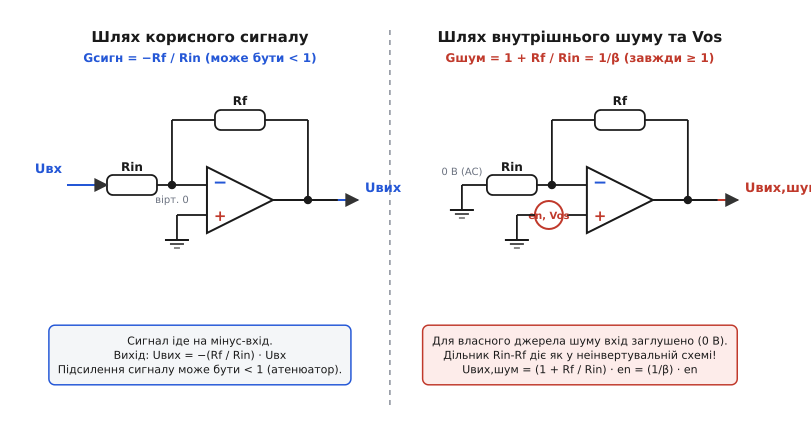
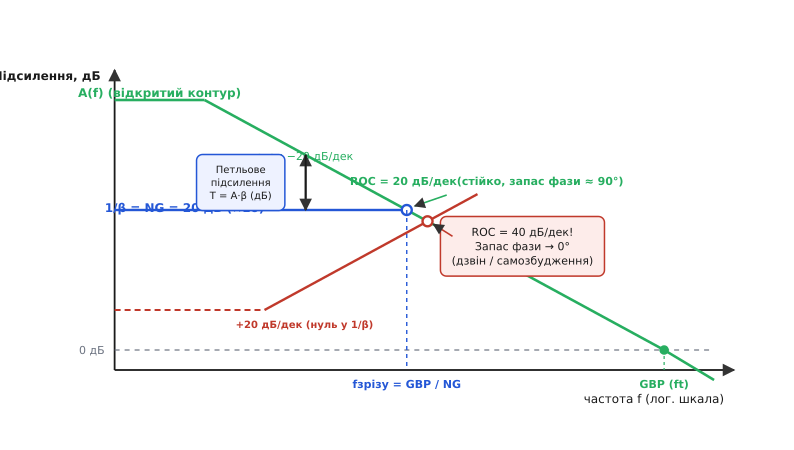
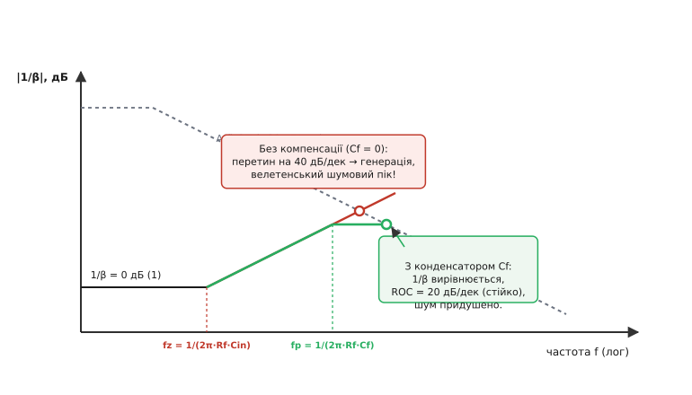
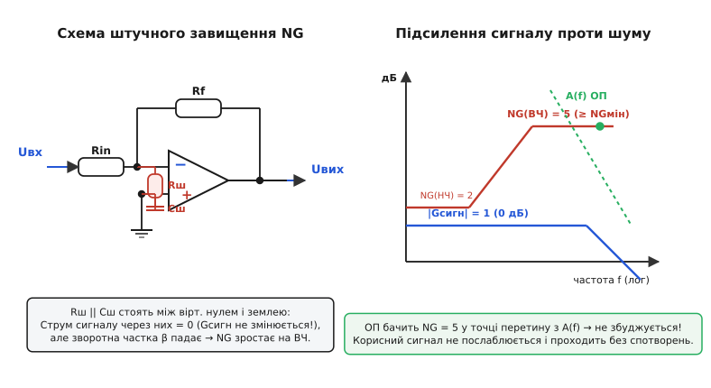

# Шумове підсилення (noise gain)

<preknowlist>
- [Оппідсилювач](topic:hw-analog/opamp) — диференційний вхід, велетенське власне підсилення та використання від'ємного зворотного зв'язку.
- [Від'ємний зворотний зв'язок](topic:hw-analog/negative-feedback) — як повернення частини сигналу на інвертувальний вхід стабілізує схему.
- [Підсилення в контурі](topic:hw-analog/loop-gain) — добуток прямого підсилення на коефіцієнт зворотного зв'язку T = A·β.
- [Інвертувальний та неінвертувальний підсилювачі](topic:hw-analog/inverting-noninverting) — базові топології ввімкнення ОП і формули коефіцієнтів підсилення сигналу.
- [Діаграма Боде](topic:hw-analog/bode-plot) — амплітудно-частотні й фазо-частотні характеристики кіл у логарифмічному масштабі.
- [Добуток підсилення на смугу](topic:hw-analog/gain-bandwidth-product) — постійність добутку підсилення на частоту зрізу в ОП з домінуючим полюсом.
</preknowlist>

Інженер збирає прецизійний атенюатор для входу високовольтного АЦП: потрібно послабити сигнал у 10 разів (`G = −0.1`). Використано інвертувальну схему на операційному підсилювачі з резисторами `R_in = 100 кОм` та `R_f = 10 кОм`. Обрано мікросхему з добутком підсилення на смугу пропускання `GBP = 10 МГц`, вхідною напругою зміщення `Vos = 1 мВ` і спектральною густиною власного шуму `en = 10 нВ/√Гц`. За інтуїтивним очікуванням на виході має бути напруга зміщення `0.1 · 1 мВ = 0.1 мВ`, шум `0.1 · 10 нВ = 1 нВ/√Гц`, а частота зрізу смуги пропускання за формулою `GBP / |G|` мала б сягнути `10 МГц / 0.1 = 100 МГц`. Проте вимірювання на стенді показують геть іншу картину: вихідне зміщення становить `1.1 мВ` (у 11 разів більше за очікуване), власний шум ОП на виході дорівнює `11 нВ/√Гц` (у 11 разів вище), а смуга пропускання завалюється вже на частоті `9.09 МГц` замість очікуваних сотні мегагерців.

Ця розбіжність не є дефектом мікросхеми чи похибкою монтажу. Вона випливає з фундаментального закону зворотного зв'язку: операційний підсилювач підсилює зовнішній вхідний сигнал за одним коефіцієнтом (**signal gain**), але всі свої внутрішні похибки, напругу зміщення, власний шум і саму петлю стабільності він бачить через зовсім інший множник — **шумове підсилення** (англ. *noise gain*, скорочено `NG`). Для цього атенюатора шумове підсилення становить не `0.1`, а `1.1`. Усі внутрішні джерела та частотні обмеження підсилювача підпорядковуються саме шумовому підсиленню, і нерозуміння різниці між цими двома величинами є найчастішою причиною самозбудження високошвидкісних схем, несподівано високого шуму датчиків та провалу за смугою пропускання.

### Чому підсилювач бачить світ інакше, ніж вхідний сигнал

Щоб зрозуміти першопричину розриву між сигнальним і шумовим підсиленням, поглянемо на операційний підсилювач із позиції його власних вхідних каскадів.

Операційний підсилювач (лат. *operari* — діяти) є пристроєм, що реагує виключно на різницю потенціалів між своїм неінвертувальним (`V+`) та інвертувальним (`V−`) входами:

```
Uвих = A · (V+ − V−)
```

де `A` — власне підсилення підсилювача без зворотного зв'язку (англ. *open-loop gain*), яке на постійному струмі сягає значень `100 000` і вище.

Коли ми подаємо корисний сигнал `Uвх` на інвертувальний вхід через резистор `Rin`, сигнал заходить ззовні. Струм сигналу створює спад напруги на `Rin`, а вихід ОП через резистор зворотного зв'язку `Rf` компенсує цей струм, утримуючи інвертувальний вхід на рівні «віртуального нуля» (`V− ≈ 0`). Відношення виходу до входу визначається пропорцією двох резисторів: `Uвих / Uвх = −Rf / Rin`. Якщо ми візьмемо `Rf < Rin`, сигнал буде ослаблено: коефіцієнт підсилення сигналу стає меншим за одиницю.


*Зліва — шлях зовнішнього сигналу в інвертувальній топології (Gсигн = −Rf/Rin). Справа — еквівалентна схема для внутрішнього шуму та напруги зміщення Vos: зовнішнє джерело сигналу заземлене, а дільник зворотного зв'язку діє як у неінвертувальному підсилювачі (Gшум = 1 + Rf/Rin).*

Але де розташовані внутрішні недоліки підсилювача — вхідна напруга зміщення `Vos`, низькочастотний флікер-шум `1/f`, широкосмуговий тепловий шум вхідної диференційної пари `en`? Усі ці явища фізично виникають усередині кремнієвого кристала безпосередньо між базами або затворами вхідних транзисторів. На еквівалентній схемі їх завжди зображають як зосереджене джерело напруги помилки `e_error`, увімкнене послідовно з одним із входів ОП (найчастіше — з неінвертувальним входом `V+`).

Тепер виконаємо класичний аналіз лінійного кола методом суперпозиції: знайдемо реакцію виходу на це внутрішнє джерело помилки `e_error`. Щоб знайти передачу від внутрішнього джерела, ми зобов'язані занулити (заземлити для змінного струму) всі зовнішні джерела сигналу (`Uвх = 0`).

Подивіться, що стається зі схемою інвертувального підсилювача, коли його вхідний термінал `Uвх` з'єднано із землею:
1. Резистор `Rin` тепер увімкнений одним кінцем до інвертувального входу ОП, а другим — безпосередньо до землі.
2. Резистор `Rf` увімкнений між виходом ОП та тим самим інвертувальним входом.
3. Разом `Rf` та `Rin` утворюють звичайний дільник напруги від виходу `Uвих` до мінус-входу `V−`.
4. Джерело помилки `e_error` прикладене прямо до плюс-входу `V+`.

Це ж класична топологія **неінвертувального підсилювача**! Для свого власного внутрішнього шуму та напруги зміщення абсолютно будь-який підсилювач зі зворотним зв'язком — інвертувальний, суматор, інтегратор чи атенюатор — завжди працює як неінвертувальний підсилювач.

Виведемо математично вихідну напругу, створену внутрішньою помилкою `e_error`:

```
V+ = e_error                         [джерело помилки на плюс-вході]
V− = Uвих · [ Rin / (Rin + Rf) ]     [дільник зворотного зв'язку з виходу]
Uвих = A · (V+ − V−)                 [рівняння операційного підсилювача]
```

Підставимо `V+` та `V−` у рівняння ОП:

```
Uвих = A · ( e_error − Uвих · [ Rin / (Rin + Rf) ] )
Uвих · [ 1 + A · (Rin / (Rin + Rf)) ] = A · e_error
```

Позначимо коефіцієнт передачі дільника зворотного зв'язку грецькою літерою `β` (бета):

```
β = Rin / (Rin + Rf)                 [частка вихідної напруги, що повертається на вхід]
```

Тоді вихідна напруга дорівнює:

```
Uвих = e_error · [ A / (1 + A · β) ]
```

При великому власному підсиленні ОП (`A · β ≫ 1`), одиницею в знаменнику нехтуємо, і підсилення `A` скорочується:

```
Uвих
= e_error · [ A / (A · β) ]          [наближення нескінченного петльового підсилення]
= e_error · (1 / β)                  [скоротили власне підсилення A]
= e_error · [ (Rin + Rf) / Rin ]     [підставили вираз для β]
= e_error · [ 1 + (Rf / Rin) ]       [почленно поділили чисельник на Rin]
```

Ось він — фундаментальний результат:

```
Gшум = 1 / β = 1 + (Rf / Rin)
```

Множник `1/β` називають **шумовим підсиленням** (англ. *Noise Gain*). Воно дорівнює одиниці, поділеній на коефіцієнт зворотного зв'язку `β`.

Звідси випливає залізне правило аналогової схемотехніки: **шумове підсилення схеми на пасивних резисторах ніколи не може бути меншим за одиницю (`NG ≥ 1`)**. Корисний сигнал ми можемо послабити в 10, 100 або 1000 разів, але внутрішній шум підсилювача і його напруга зміщення завжди вийдуть на вихід із підсиленням щонайменше `×1`, а в інвертувальній схемі — завжди щонайменше `1 + |G_сигн|`.

### Порівняльна таблиця: сигнал проти шуму для базових топологій

Розглянемо, як співвідносяться коефіцієнт підсилення сигналу `G_сигн` та шумове підсилення `NG` у типових конфігураціях:

| Топологія схеми | Сигнальне підсилення `G_сигн` | Зворотна частка `β` | Шумове підсилення `NG = 1/β` | Співвідношення `NG` до `|G_сигн|` |
| :--- | :--- | :--- | :--- | :--- |
| **Неінвертувальний підсилювач** | `1 + Rf / Rin` | `Rin / (Rin + Rf)` | `1 + Rf / Rin` | `NG = G_сигн` (єдиний випадок збігу) |
| **Повторювач напруги (буфер)** | `+1` | `1` | `1` | `NG = G_сигн = 1` |
| **Інвертувальний підсилювач (підсилення)** | `−Rf / Rin` (наприклад, `−10`) | `Rin / (Rin + Rf)` | `1 + Rf / Rin` (`11`) | `NG = 1 + \|G_сигн\|` |
| **Інвертувальний інвертор (одиничний)** | `−1` | `1/2` | `2` | `NG = 2 · \|G_сигн\|` (удвічі більше!) |
| **Інвертувальний атенюатор** | `−Rf / Rin` (наприклад, `−0.1`) | `Rin / (Rin + Rf)` | `1 + Rf / Rin` (`1.1`) | `NG = 11 · \|G_сигн\|` (в 11 разів більше!) |
| **Суматор на N входів** (одиничний) | `−1` (для кожного каналу) | `1 / (1 + N)` | `1 + N` | `NG = (1 + N) · \|G_сигн\|` |
| **Трансімпедансний підсилювач (TIA)** | `−Rf` (В/А) | `1` (на постійному струмі) | `1` (на DC, зростає на AC) | На високих частотах `NG ≫ 1` |
| **Диференційний підсилювач (4 резистори)** | `R2 / R1` | `R1 / (R1 + R2)` | `1 + R2 / R1` | `NG = 1 + G_сигн` |

З таблиці видно три ключові наслідки:
1. **Єдина топологія, де шумове підсилення дорівнює сигнальному**, — це звичайний неінвертувальний підсилювач. Тільки в ньому сигнал подається на той самий вхід, до якого приведено джерело власного шуму.
2. **В інвертувальному підсилювачі шумове підсилення завжди на одиницю більше за модуль сигнального**: `NG = 1 + |G_сигн|`. Навіть для «одиничного» інвертора (`G = −1`) шумове підсилення дорівнює `2`. Це означає, що інвертор підсилює шум мікросхеми у 2 рази сильніше, ніж повторювач.
3. **У багатоканальних суматорах шумове підсилення катастрофічно зростає з кожним новим входом**, навіть якщо підсилення кожного окремого сигналу залишається малим.

### Прихована ціна багатоканального суматора

Розберемо детальніше інвертувальний суматор на 8 аудіоканалів. Кожен канал має вхідний резистор `R₁ = R₂ = ... = R₈ = 10 кОм`, а в колі зворотного зв'язку встановлено `Rf = 10 кОм`. Для кожного окремого входу коефіцієнт підсилення дорівнює `−Rf / Rk = −1`. Здається, що схема працює в одиничному масштабі.

Але чому дорівнює коефіцієнт зворотного зв'язку `β`? Коли ми шукаємо `β`, усі 8 зовнішніх сигнальних входів заземлюються. Вісім резисторів по `10 кОм` опиняються з'єднаними паралельно між інвертувальним входом і землею. Їхній еквівалентний опір становить:

```
R_in,eq = 10 кОм / 8 = 1.25 кОм
```

Тепер обчислимо зворотну частку `β` та шумове підсилення:

```
β = 1.25 кОм / (1.25 кОм + 10 кОм) = 1.25 / 11.25 = 1/9
NG = 1 / β = 9
```

Шумове підсилення суматора дорівнює **9**!
Це має два відчутні наслідки:
- Власний шум напруги ОП та напруга зміщення `Vos` підсилюються на виході в 9 разів. Якщо ОП мав зміщення `2 мВ`, на виході суматора з'явиться постійна напруга `18 мВ`, хоча жоден із входів не підсилює постійну напругу більше ніж у 1 раз.
- Смуга пропускання суматора для всіх каналів звужується рівно в 9 разів порівняно з частотою одиничного підсилення мікросхеми: `f_зрізу = GBP / 9`. Якщо взяти ОП із `GBP = 9 МГц`, реальна смуга суматора складе лише `1 МГц`.

Строге математичне виведення деградації відношення сигнал/шум у багатоканальних суматорах та матрицях мікшування подано у вставці [виведення частотної компенсації та шумової смуги для ємнісного навантаження](topic:hw-analog/noise-gain/math-noise-summing.md).

---

### Неінвертувальні атенюатори та підсилювачі зі змінним коефіцієнтом (VGA)

Розглянемо ще дві поширені структури, де розрив між сигнальним і шумовим підсиленням створює неочевидні інженерні пастки.

#### 1. Неінвертувальний атенюатор
Неможливо створити неінвертувальний атенюатор на одному ОП лише вибором резисторів у петлі зворотного зв'язку, оскільки формула `1 + Rf/Rin` принципово не може бути меншою за одиницю. Тому інженери ставлять пасивний резистивний дільник `R₁–R₂` перед неінвертувальним входом ОП (`K_div = R₂ / (R₁ + R₂)`), а сам ОП вмикають як неінвертувальний підсилювач із підсиленням `G_amp = 1 + Rf / Rg`.

Загальне підсилення сигналу становить:

```
G_сигн = K_div · G_amp = [ R₂ / (R₁ + R₂) ] · [ 1 + Rf / Rg ]
```

Якщо нам потрібне загальне підсилення `G_сигн = 0.2`, ми можемо поділити вхідний сигнал у 10 разів (`K_div = 0.1`), а підсилювач налаштувати на підсилення `G_amp = 2`.
Але чому дорівнює шумове підсилення самого операційного підсилювача?
Шумове підсилення `NG = 1 + Rf / Rg = 2.0`. Вхідний дільник послаблює корисний сигнал у 10 разів, але він **не послаблює власний шум напруги ОП та напругу зміщення `Vos`**! Вони проходять на вихід із повним підсиленням `×2`. Відношення сигнал/шум на виході такого атенюатора погіршується рівно в 10 разів порівняно з вхідним сигналом.

#### 2. Підсилювачі зі змінним підсиленням (VGA та цифрові потенціометри)
Коли коефіцієнт підсилення регулюється електронно — за допомогою цифрового потенціометра або матриці комутації резисторів (англ. *Programmable Gain Amplifier*, PGA), — положення регулятора визначає динамічну зміну шумового підсилення.

Якщо змінний опір встановлено в ланцюзі зворотного зв'язку `Rf`:
- При збільшенні підсилення від `×1` до `×100` шумове підсилення зростає від `1` до `100`.
- Смуга пропускання схеми динамічно звужується у 100 разів: від `GBP` до `GBP / 100`.
- Паразитна ємність повзунка цифрового потенціометра (зазвичай `10–25 пФ`), під'єднана до інвертувального входу ОП, створює частотно-залежний нуль у `1/β(s)`, який може викликати дзвін і втрату стійкості на певних проміжних кодах регулювання.

---

### Чому шумове підсилення визначає смугу та стабільність: діаграми Боде

У більшості підручників зі схемотехніки наводиться спрощена формула для смуги пропускання замкненого кола підсилювача: `BW = GBP / |G|`, де `|G|` — коефіцієнт підсилення схеми. Це одне з найшкідливіших спрощень, яке призводить до помилок розрахунку в усіх схемах, окрім неінвертувальних.

**Справжня смуга пропускання замкненого контуру визначається виключно шумовим підсиленням:**

```
f_cl = GBP / NG = GBP · β
```

Чому це так, стає очевидно з аналізу петльового підсилення на діаграмі Боде.

Петльове підсилення `T(f)` (англ. *loop gain*) — це добуток прямого коефіцієнта підсилення ОП без зворотного зв'язку `A(f)` на коефіцієнт ланки зворотного зв'язку `β(f)`:

```
T(f) = A(f) · β(f) = A(f) / (1 / β(f)) = A(f) / NG(f)
```

У логарифмічному масштабі децибелів множення і ділення перетворюються на додавання та віднімання:

```
20·log|T(f)| = 20·log|A(f)| − 20·log|NG(f)|
```

Петльове підсилення на графіку Боде — це точна геометрична **відстань між кривою власного підсилення ОП `A(f)` та кривою шумового підсилення `1/β(f)`**.


*Діаграма Боде для відкритого підсилення A(f) та шумового підсилення 1/β. Частота зрізу замкненого кола f_cl визначається точкою перетину цих кривих, де петльове підсилення падає до 0 дБ (T=1). Швидкість зближення (ROC) у 20 дБ/дек гарантує стабільність; підйом кривої 1/β збільшує ROC до 40 дБ/дек і викликає генерацію.*

У типового операційного підсилювача з внутрішньою корекцією характеристика `A(f)` має домінуючий полюс на низькій частоті (одиниці або десятки герців), після якого підсилення спадає зі швидкістю **−20 дБ на декаду** (у 10 разів за кожне десятикратне зростання частоти).

Зворотний зв'язок працює і утримує задані параметри схеми доти, доки `|T(f)| > 1`, тобто поки крива `A(f)` лежить вище за криву `1/β(f)`. На частоті, де крива `A(f)` перетинається з кривою `1/β(f)`, петльове підсилення падає до одиниці (`|T| = 1`, тобто `0 дБ`). Зворотний зв'язок вичерпує свій запас підсилення, і вихідна характеристика схеми починає спадати.

Частота цієї точки перетину `f_cross` і є граничною частотою зрізу замкненого кола:

```
A(f_cross) = NG
(GBP / f_cross) = NG
f_cross = GBP / NG
```

Повернімося до нашого вступного прикладу: інвертувальний атенюатор з `G_сигн = −0.1` на ОП з `GBP = 10 МГц`.
- Якщо помилково підставити сигнальне підсилення `|G| = 0.1`, отримаємо `10 МГц / 0.1 = 100 МГц`.
- Справжнє шумове підсилення становить `NG = 1 + 10к/100к = 1.1`.
- Справжня смуга схеми: `f_cl = 10 МГц / 1.1 = 9.09 МГц`.

Смуга інвертувального атенюатора ніколи не може перевищити власний `GBP` мікросхеми, тому що його шумове підсилення ніколи не опускається нижче одиниці!

### Критерій стійкості: швидкість зближення (Rate of Closure)

Діаграма Боде для `1/β` дає не лише смугу пропускання, а й універсальний інструмент перевірки **стійкості схеми проти самозбудження** — швидкість зближення (англ. *Rate of Closure*, скорочено `ROC`).

Швидкість зближення `ROC` — це різниця нахилів між кривою відкритого підсилення ОП `A(f)` та кривою шумового підсилення `1/β(f)` у точці їхнього перетину:

```
ROC = | Нахил A(f) − Нахил (1/β(f)) |
```

За теоремою Боде кожен нахил амплітудної характеристики у 20 дБ/декаду пов'язаний із фазовим зсувом приблизно на `90°`:
- Якщо `A(f)` спадає зі швидкістю **−20 дБ/дек** (один полюс, фазовий зсув −90°), а крива `1/β` є пласкою (**0 дБ/дек**, суто резистивний зворотний зв'язок), то швидкість зближення становить **20 дБ/декаду**. Фазовий зсув у петлі дорівнює −90°, що залишає **запас фази (phase margin) близько 90°**. Схема абсолютно стійка, перехідна характеристика не має викидів і коливань.
- Якщо ж у колі зворотного зв'язку чи на вході з'являється реактивний елемент, через який крива `1/β` підіймається зі швидкістю **+20 дБ/дек**, то в точці перетину нахили віднімаються: `(−20 дБ/дек) − (+20 дБ/дек) = −40 дБ/дек`. Швидкість зближення стає рівною **40 дБ/декаду**.
- Швидкість зближення `40 дБ/дек` означає, що сумарний фазовий зсув у петлі наближається до `−180°`. Запас за фазою падає практично до `0°`. Від'ємний зворотний зв'язок на цій частоті перетворюється на додатний: схема починає генерувати незатухаючі коливання (зривається в автогенерацію) або дає тривалий «дзвін» на фронтах імпульсів із велетенським резонансним викидом на АЧХ.

Золоте правило стабільності Боде: **для збереження стійкості та запасу фази не менше 45° швидкість зближення ROC у точці перетину A(f) та 1/β не повинна перевищувати 20 дБ/декаду.**

---

### Вплив вихідного опору ОП та ємнісного навантаження

Реальний операційний підсилювач має ненульовий власний вихідний опір у розімкненому контурі `Ro` (зазвичай `20–100 Ом`).
Коли до виходу підсилювача під'єднують ємнісне навантаження `Cload` (кабель, фільтр або вхід АЦП), вихідний опір `Ro` разом із `Cload` формує додатковий високочастотний полюс прямого тракту передачі:

```
fp2 = 1 / (2 · π · Ro · Cload)
```

Вище частоти `fp2` нахил кривої власного підсилення ОП `A(f)` змінюється з −20 дБ/дек на **−40 дБ/дек**.
Якщо перетин із прямою `1/β` відбувається на ділянці подвійного нахилу, швидкість зближення знову стає рівною `ROC = 40 дБ/дек`, і підсилювач самозбуджується навіть за ідеально резистивної петлі зворотного зв'язку!

Для відновлення стійкості застосовують метод подвійного зворотного зв'язку: послідовно з виходом ставлять ізолюючий резистор `Riso`, а високочастотний зворотний зв'язок замикають через конденсатор `Cf` безпосередньо з виходу мікросхеми до навантаження.

---

### Ємнісна пастка на вході: чому фотодіоди та TIA збуджуються

Найчастіша аварійна ситуація в аналогових трактах виникає, коли до інвертувального входу під'єднують джерело зі значною власною ємністю. Класичний приклад — трансімпедансний підсилювач (англ. *Transimpedance Amplifier*, TIA), що перетворює мікроамперний струм фотодіода на напругу за допомогою одного великого резистора `Rf = 1 МОм`.

Фотодіод має власну бар'єрну ємність p-n переходу `Cd` (від одиниць до сотень пікофарад). До неї додається синфазна та диференційна вхідна ємність самого операційного підсилювача `Cin,op` та паразитна ємність доріжок друкованої плати `Cpcb`. Сумарна ємність на інвертувальному вузлі становить `Cin = Cd + Cin,op + Cpcb`.


*Вхідна ємність Cin створює нуль у характеристиці 1/β на частоті fz. Без компенсації крива 1/β зростає з нахилом +20 дБ/дек і перетинає A(f) зі швидкістю ROC = 40 дБ/дек, що призводить до генерації. Введення конденсатора Cf формує полюс fp, вирівнює 1/β до перетину і відновлює запас фази.*

Подивимось, що відбувається з коефіцієнтом зворотного зв'язку `β` на змінному струмі. Вхідний імпеданс утворений ємністю `Cin`: `Zin = 1 / (j·ω·Cin)`.

Коефіцієнт зворотного зв'язку `β(s)`:

```
β(s) = Zin / (Zin + Rf) = 1 / (1 + s · Rf · Cin)
```

Знайдемо шумове підсилення `NG(s) = 1 / β(s)`:

```
NG(s) = 1 / β(s) = 1 + s · Rf · Cin
```

У характеристиці шумового підсилення з'явився **нуль** на частоті:

```
fz = 1 / (2 · π · Rf · Cin)
```

На низьких частотах (`f < fz`) ємність `Cin` розімкнена: `1/β = 1` (0 дБ). Але як тільки частота перевищує `fz`, шумове підсилення починає стрімко **зростати з нахилом +20 дБ на декаду**.
Для значень `Rf = 1 МОм` та `Cin = 50 пФ`:

```
fz = 1 / (2 · π · 10⁶ · 50·10⁻¹²) ≈ 3.18 кГц
```

Уже вище `3.18 кГц` шумове підсилення починає лізти вгору: на частоті 30 кГц воно становить `×10` (20 дБ), на 300 кГц — `×100` (40 дБ), на 3 МГц — `×1000` (60 дБ).

Що це означає на практиці:
1. **Катастрофічний шумовий сплеск (Noise Gain Peaking)**: власний шум напруги ОП `en` (наприклад, 5 нВ/√Гц), який на низьких частотах був непомітним, на частоті 1 МГц підсилюється у сотні разів і перетворюється на виході на велетенський високочастотний шум у мікровольти на корінь із герца.
2. **Втрата стійкості**: висхідна гілка `1/β` (+20 дБ/дек) зустрічається зі спадною гілкою `A(f)` (−20 дБ/дек). Швидкість зближення становить **40 дБ/декаду**. Підсилювач перетворюється на високочастотний автогенератор і видає на виході синусоїду з розмахом від шини до шини живлення.

### Порятунок: частотна корекція ємністю зворотного зв'язку Cf

Щоб зупинити неконтрольоване зростання `1/β` і ліквідувати загрозу генерації, паралельно до резистора зворотного зв'язку `Rf` підключають невеликий компенсаційний конденсатор `Cf`.

Тепер імпеданс ланки зворотного зв'язку стає комплексною величиною: `Zf = Rf ∥ (1 / s·Cf) = Rf / (1 + s·Rf·Cf)`.

Комплексне шумове підсилення набуває вигляду:

```
NG(s) = ( 1 + s · Rf · (Cin + Cf) ) / ( 1 + s · Rf · Cf )
```

Конденсатор `Cf` додає в характеристику шумового підсилення **полюс** на частоті:

```
fp = 1 / (2 · π · Rf · Cf)
```

На частоті `fp` зростання кривої `1/β` припиняється, і вона переходить у горизонтальну поличку з максимальним значенням `NG_max = 1 + Cin / Cf`.

Якщо підібрати `Cf` так, щоб точка перелому `fp` лежала нижче за частоту перетину з кривою `A(f)`, то в самій точці перетину крива `1/β` вже буде плоскою (0 дБ/дек). Швидкість зближення знову стане рівною безпечним **20 дБ/декаду**, а схема набуде абсолютної стійкості.

Як розрахувати точне оптимальне значення `Cf`? Якщо взяти `Cf` занадто малим — схема дзвенітиме; якщо занадто великим — звузиться корисна смуга пропускання сигналу `f_sig = 1 / (2·π·Rf·Cf)`.

Оптимальне значення для максимально пласкої характеристики Баттерворта (коефіцієнт демпфування `ζ = 0.707`, запас фази `65.5°`):

```
Cf = √( Cin / (2 · π · Rf · GBP) )
```

**Чисельний приклад розрахунку TIA:**
- Опір зворотного зв'язку: `Rf = 500 кОм`.
- Сумарна ємність входу: `Cin = 40 пФ`.
- Підсилювач: `GBP = 20 МГц`.

Обчислимо необхідну ємність `Cf`:

```
Cf
= √( 40·10⁻¹² / (2 · π · 500·10³ · 20·10⁶) )  [підставили Cin = 40 пФ, Rf = 500 кОм, GBP = 20 МГц]
= √( 40·10⁻¹² / 6.283·10¹³ )                  [перемножили співмножники у знаменнику]
= √( 6.366·10⁻²⁵ )                            [поділили чисельник на знаменник]
≈ 0.80 пФ                                     [добули квадратний корінь]
```

Усього лише конденсатор ємністю `0.8 пФ` (або `1 пФ` із найближчого стандартного ряду) повністю придушує паразитно-високочастотний пік шуму, усуває генерацію і забезпечує стабільну смугу пропускання сигналу:

```
f_3dB
= √( GBP / (2 · π · Rf · Cin) )               [формула смуги скомпемсованого TIA]
= √( 20·10⁶ / (2 · π · 500·10³ · 40·10⁻¹²) )  [підставили чисельні параметри кола]
= √( 20·10⁶ / 1.257·10⁻⁴ )                    [обчислили знаменник під коренем]
= √( 1.591·10¹¹ )                             [виконали ділення]
≈ 399 кГц                                     [добули квадратний корінь]
```

---

### Декомпенсовані операційні підсилювачі та штучне маніпулювання NG

Серед високошвидкісних операційних підсилювачів існує окремий спеціалізований клас — **декомпенсовані (або неповно скориговані) підсилювачі** (англ. *decompensated op-amps*).

Звичайний підсилювач із повною корекцією скоригований виробником так, щоб залишатися стійким при одиничному підсиленні (`NG = 1`, увімкнення повторювачем). За це платять швидкодією: вбудований мікросхемний конденсатор Міллера звужує відкриту смугу і обмежує швидкість наростання вихідної напруги (англ. *slew rate*).

У декомпенсованих мікросхемах ємність внутрішньої корекції зменшують у 5–10 разів. Завдяки цьому при тому самому струмі споживання підсилювач отримує в рази вищий добуток `GBP` і швидкість наростання: наприклад, 1.5 ГГц замість 150 МГц. Але за це є ціна: такий ОП є стійким лише за умови, що його шумове підсилення в схемі не опускається нижче певного мінімуму, зазначеного в даташиті: наприклад, **`NG ≥ 5`** або **`NG ≥ 10`**.

Якщо увімкнути такий підсилювач звичайним повторювачем (`NG = 1`) або одиничним інвертором (`NG = 2`), він миттєво самозбудиться.

Що робити, якщо нам потрібна колосальна швидкість наростання декомпенсованого ОП, але корисний сигнал потрібно підсилити лише в 1 раз (`G_сигн = −1`) або взагалі послабити (`G_сигн = −0.5`)?

Рішенням є елегантний прийом — **штучне завищення шумового підсилення** (англ. *Noise Gain Manipulation*).


*Принцип маніпулювання шумовим підсиленням: між входами ОП встановлено послідовний ланцюг Rш–Cш. Оскільки інвертувальний вхід є віртуальним нулем, струм корисного сигналу крізь цей ланцюг не тече (Gсигн залишається незмінним). Але для ланки зворотного зв'язку опір падає, що штучно підіймає NG до безпечного рівня NG_min на високих частотах.*

Між інвертувальним і неінвертувальним входами операційного підсилювача встановлюють додатковий шунтувальний резистор `R_dummy` (або послідовний ланцюг `R_dummy` та конденсатора `C_dummy`).

Подивимось, як це впливає на корисний сигнал:
- Інвертувальний вхід підтримується на рівні віртуального нуля (`V− ≈ 0 В`), а неінвертувальний заземлений (`V+ = 0 В`).
- Різниця напруг на виводах `R_dummy` дорівнює нулю (`V+ − V− = 0`).
- Струм через `R_dummy` від корисного сигналу не тече: `I_dummy = 0 / R_dummy = 0`.
- Коефіцієнт підсилення вхідного сигналу **не змінюється взагалі**: `Uвих / Uвх = −Rf / Rin`!

Але як виглядає схема для петлі зворотного зв'язку при визначенні `β`?
- Вхід `Uвх` заземлений.
- Тепер резистор `R_dummy` опиняється увімкненим паралельно до вхідного резистора `Rin`!
- Еквівалентний опір нижнього плеча дільника падає: `Req = Rin ∥ R_dummy`.

Шумове підсилення схеми стрибає вгору:

```
NG = 1 + Rf / (Rin ∥ R_dummy) = 1 + (Rf / Rin) + (Rf / R_dummy)
```

Підбираючи номінал `R_dummy`, інженер може штучно виставити будь-яке потрібне шумове підсилення (наприклад, `NG = 7`), забезпечивши ідеальну стійкість декомпенсованого підсилювача без жодного впливу на передачу сигналу!

А щоб це підвищене шумове підсилення не роздувало напругу зміщення `Vos` на постійному струмі, послідовно з `R_dummy` ставлять конденсатор `C_dummy`. На низьких частотах конденсатор розриває коло (шумове підсилення низьке, дрейф малий), а на високих частотах біля точки перетину з `A(f)` конденсатор замикається і підіймає `NG` до безпечного порогу стійкості.

Повний алгоритм розрахунку номіналів `R_dummy` та `C_dummy` з готовим програмним модулем наведено у вставці [інженерний розрахунок шумового бюджету та стабілізації декомпенсованих ОП](topic:hw-analog/noise-gain/proj-noise-gain-compensation.md).

---

### Топологія друкованої плати: захисні кільця та паразитна ємність

На високих частотах фізична реалізація вузла інвертувального входу є критичною для збереження розрахункового шумового підсилення.
Інвертувальний вхід — це високоомний сумуючий вузол із найменшою ємнісною толерантністю на платі.

Основні правила проектування топології високошвидкісних схем:
1. **Вирізання земляного полігону під інвертувальним вузлом (Ground Cutout)**:
   Мідний екран на внутрішніх шарах під виводом мінус-входу ОП та контактними майданчиками резисторів `Rin` і `Rf` створює паразитну ємність на землю близько `1–3 пФ`. На частотах у сотні мегагерців ця паразитна ємність створює передчасний нуль `fz`, що підіймає шумове підсилення та викликає автогенерацію. Полігон землі безпосередньо під чутливими доріжками повністю видаляють на всіх шарах друкованої плати.
2. **Захисні кільця (Guard Rings)**:
   Для запобігання струмам витоку по поверхні діелектрика інвертувальний вхід оточують провідною доріжкою, з'єднаною з точкою з таким самим потенціалом (для інвертувальної схеми — із заземленим неінвертувальним входом).

---

### Повний розрахунок вихідного шуму: інтегральний бюджет схеми

Щоб повністю розрахувати рівень шумів реального аналогового каскаду, необхідно врахувати всі незалежні фізичні джерела шумів, помноживши кожне з них на його власний коефіцієнт передачі на вихід.

У довільному підсилювальному каскаді діють п'ять головних джерел шуму:
1. **Власний шум напруги ОП `en`** (нВ/√Гц) — діє на вхід і множиться на **шумове підсилення `NG`**:
   `e_out,en = en · NG`
2. **Власний шум струму інвертувального входу `in−`** (пА/√Гц) — протікає через опір зворотного зв'язку `Rf` і створює спад напруги:
   `e_out,in− = in− · Rf`
3. **Власний шум струму неінвертувального входу `in+`** (пА/√Гц) — протікає через еквівалентний опір на плюс-вході `R+` і множиться на шумове підсилення:
   `e_out,in+ = in+ · R+ · NG`
4. **Тепловий шум Джонсона резистора зворотного зв'язку `Rf`**:
   `e_out,Rf = √(4 · k · T · Rf)`
5. **Тепловий шум Джонсона вхідного резистора `Rin`** — підсилюється на вихід із коефіцієнтом **сигнального підсилення `Rf/Rin`**:
   `e_out,Rin = √(4 · k · T · Rin) · (Rf / Rin)`

Оскільки всі п'ять джерел шуму є статистично незалежними (некорельованими) випадковими процесами, їхні потужності додаються. Сумарна спектральна густина напруги шуму на виході обчислюється як корінь із суми квадратів:

```
e_out,total = √[ (en · NG)² + (in− · Rf)² + (in+ · R+ · NG)² + 4·k·T·Rf + 4·k·T·Rin·(Rf/Rin)² ]
```

Зверніть увагу: тепловий шум вхідного резистора `Rin` приходить на вихід через сигнальне підсилення `Rf/Rin`, тоді як власний шум напруги мікросхеми `en` множиться на повне шумове підсилення `NG = 1 + Rf/Rin`.

Для отримання повного середньоквадратичного значення напруги шуму (RMS) у робочій смузі `f_cl` спектральну густину множать на корінь з **еквівалентної шумової смуги** (англ. *Equivalent Noise Bandwidth*, `ENBW`). Для стандартного однополюсного спаду частотної характеристики `ENBW = (π / 2) · f_cl ≈ 1.57 · f_cl`:

```
V_noise,rms = e_out,total · √( 1.57 · f_cl )
```

---

### Практичний розрахунок: прецизійний атенюатор проти підсилювача

Проведемо повний наскрізний чисельний розрахунок двох каскадів на однаковому прецизійному операційному підсилювачі OPA211 (`GBP = 80 МГц`, `en = 1.1 нВ/√Гц`, `in = 1.7 пА/√Гц`, `Vos = 50 мкВ`, `T = 298.15 К`, `4·k·T = 1.646·10⁻²⁰ Дж`).

**Схема А: Неінвертувальний підсилювач (`G = +10`)**
- Номінали: `Rin = 1 кОм`, `Rf = 9 кОм`.
- Сигнальне підсилення: `G_сигн = 1 + 9к/1к = 10`.
- Шумове підсилення: `NG = 1 + 9к/1к = 10`.
- Смуга пропускання: `f_cl = 80 МГц / 10 = 8.0 МГц`.
- Вихідна напруга зміщення: `Vos,out = 50 мкВ · 10 = 500 мкВ`.
- Внесок `en` ОП: `1.1 нВ/√Гц · 10 = 11.0 нВ/√Гц`.
- Шум `Rf`: `√(1.646·10⁻²⁰ · 9000) ≈ 12.17 нВ/√Гц`.
- Шум `Rin` на виході: `√(1.646·10⁻²⁰ · 1000) · (9к/1к) = 4.06 · 9 = 36.54 нВ/√Гц`.
- Шум `in`: `1.7·10⁻¹² · 9000 ≈ 0.015 нВ/√Гц` (знехтовно малий).
- Сумарна густина шуму на виході:
  `e_total = √( 11.0² + 12.17² + 36.54² ) = √( 121 + 148.1 + 1335.2 ) ≈ 39.9 нВ/√Гц`.
- Інтегральний RMS шум у смузі `1.57 · 8 МГц = 12.56 МГц`:
  `V_rms = 39.9·10⁻⁹ · √(12.56·10⁶) ≈ 141.4 мкВ`.

**Схема Б: Інвертувальний атенюатор (`G = −0.1`)**
- Номінали: `Rin = 10 кОм`, `Rf = 1 кОм`.
- Сигнальне підсилення: `G_сигн = −1к/10к = −0.1`.
- Шумове підсилення: `NG = 1 + 1к/10к = 1.1`.
- Смуга пропускання: `f_cl = 80 МГц / 1.1 = 72.7 МГц` (у 9 разів ширша, ніж у підсилювача!).
- Вихідна напруга зміщення: `Vos,out = 50 мкВ · 1.1 = 55 мкВ`.
- Внесок `en` ОП: `1.1 нВ/√Гц · 1.1 = 1.21 нВ/√Гц`.
- Шум `Rf`: `√(1.646·10⁻²⁰ · 1000) ≈ 4.06 нВ/√Гц`.
- Шум `Rin` на виході: `√(1.646·10⁻²⁰ · 10000) · 0.1 = 12.83 · 0.1 = 1.28 нВ/√Гц`.
- Сумарна густина шуму на виході:
  `e_total = √( 1.21² + 4.06² + 1.28² ) = √( 1.46 + 16.48 + 1.64 ) ≈ 4.43 нВ/√Гц`.
- Інтегральний RMS шум у смузі `1.57 · 72.7 МГц = 114.1 МГц`:
  `V_rms = 4.43·10⁻⁹ · √(114.1·10⁶) ≈ 47.3 мкВ`.

Порівняння показує неочевидний результат: хоча спектральна густина шуму в атенюаторі низька (`4.43 нВ/√Гц`), через мале шумове підсилення (`NG = 1.1`) його смуга пропускання розширилася майже до `73 МГц`. Якщо після такого атенюатора не встановити обмежувальний фільтр низьких частот, надширока смуга пропустить на вхід АЦП інтегральний високочастотний шум, який знівелює всю точність вимірювального тракту.

---

### Програмний розрахунок шумового підсилення та смуги

Нижче наведено модуль розрахунку ключових параметрів замкненого кола (сигнального та шумового підсилення, смуги, напруги зміщення та шуму) мовами C та C++:

:::tabs
```c
#include <stdio.h>
#include <math.h>

typedef struct {
    double gbp_hz;       // Добуток підсилення на смугу ОП (Гц)
    double en_nv_rt_hz;  // Власний шум напруги ОП (нВ/√Гц)
    double vos_uv;       // Вхідна напруга зміщення ОП (мкВ)
    double rin_ohm;      // Вхідний резистор (Ом)
    double rf_ohm;       // Резистор зворотного зв'язку (Ом)
    int is_inverting;    // 1 — інвертувальний, 0 — неінвертувальний
} OpAmpCircuit;

typedef struct {
    double signal_gain;      // Підсилення сигналу
    double noise_gain;       // Шумове підсилення NG = 1/beta
    double bandwidth_hz;     // Реальна смуга замкненого кола (Гц)
    double vos_out_uv;       // Вихідне зміщення напруги (мкВ)
    double en_out_nv_rt_hz;  // Вихідна густина шуму від ОП (нВ/√Гц)
} CircuitReport;

CircuitReport calculate_opamp_circuit(const OpAmpCircuit *c) {
    CircuitReport r;
    double ratio = c->rf_ohm / c->rin_ohm;
    
    // Сигнальне підсилення залежить від топології
    if (c->is_inverting) {
        r.signal_gain = -ratio;
    } else {
        r.signal_gain = 1.0 + ratio;
    }
    
    // Шумове підсилення ЗАВЖДИ однакове: 1 + Rf/Rin
    r.noise_gain = 1.0 + ratio;
    
    // Смуга пропускання визначається виключно шумовим підсиленням!
    r.bandwidth_hz = c->gbp_hz / r.noise_gain;
    
    // Вихідна напруга зміщення множиться на шумове підсилення
    r.vos_out_uv = c->vos_uv * r.noise_gain;
    
    // Власний шум напруги ОП множиться на шумове підсилення
    r.en_out_nv_rt_hz = c->en_nv_rt_hz * r.noise_gain;
    
    return r;
}

int main(void) {
    OpAmpCircuit attenuator = {
        .gbp_hz = 10.0e6,     // 10 МГц GBP
        .en_nv_rt_hz = 10.0,  // 10 нВ/√Гц
        .vos_uv = 1000.0,     // 1 мВ (1000 мкВ)
        .rin_ohm = 100000.0,  // 100 кОм
        .rf_ohm = 10000.0,    // 10 кОм
        .is_inverting = 1     // Інвертувальний атенюатор
    };
    
    CircuitReport rep = calculate_opamp_circuit(&attenuator);
    
    printf("Сигнальне підсилення G_сигн : %.2f\n", rep.signal_gain);
    printf("Шумове підсилення NG       : %.2f\n", rep.noise_gain);
    printf("Реальна смуга f_cl         : %.2f кГц\n", rep.bandwidth_hz / 1e3);
    printf("Вихідне зміщення Vos,out   : %.2f мкВ\n", rep.vos_out_uv);
    printf("Вихідний шум ОП en,out     : %.2f нВ/√Гц\n", rep.en_out_nv_rt_hz);
    
    return 0;
}
```
```cpp
#include <iostream>
#include <iomanip>
#include <string_view>

enum class CircuitTopology {
    Inverting,
    NonInverting
};

struct OpAmpCircuit {
    double gbp_hz{10.0e6};       // Добуток підсилення на смугу ОП (Гц)
    double en_nv_rt_hz{10.0};    // Власний шум напруги ОП (нВ/√Гц)
    double vos_uv{1000.0};       // Вхідна напруга зміщення ОП (мкВ)
    double rin_ohm{100000.0};    // Вхідний резистор (Ом)
    double rf_ohm{10000.0};      // Резистор зворотного зв'язку (Ом)
    CircuitTopology topology{CircuitTopology::Inverting};
};

struct CircuitReport {
    double signal_gain{0.0};
    double noise_gain{0.0};
    double bandwidth_hz{0.0};
    double vos_out_uv{0.0};
    double en_out_nv_rt_hz{0.0};
};

class CircuitCalculator {
public:
    [[nodiscard]] static constexpr CircuitReport evaluate(const OpAmpCircuit& c) noexcept {
        const double ratio = c.rf_ohm / c.rin_ohm;
        
        CircuitReport report{};
        if (c.topology == CircuitTopology::Inverting) {
            report.signal_gain = -ratio;
        } else {
            report.signal_gain = 1.0 + ratio;
        }
        
        // Шумове підсилення завжди 1 + Rf/Rin
        report.noise_gain = 1.0 + ratio;
        
        // Смуга пропускання замкненого контуру: GBP / NG
        report.bandwidth_hz = c.gbp_hz / report.noise_gain;
        
        // Похибки зміщення та шуму множаться на шумове підсилення
        report.vos_out_uv = c.vos_uv * report.noise_gain;
        report.en_out_nv_rt_hz = c.en_nv_rt_hz * report.noise_gain;
        
        return report;
    }
};

int main() {
    constexpr OpAmpCircuit attenuator{
        .gbp_hz = 10.0e6,
        .en_nv_rt_hz = 10.0,
        .vos_uv = 1000.0,
        .rin_ohm = 100000.0,
        .rf_ohm = 10000.0,
        .topology = CircuitTopology::Inverting
    };
    
    constexpr auto rep = CircuitCalculator::evaluate(attenuator);
    
    std::cout << std::fixed << std::setprecision(2);
    std::cout << "Сигнальне підсилення G_сигн : " << rep.signal_gain << '\n';
    std::cout << "Шумове підсилення NG       : " << rep.noise_gain << '\n';
    std::cout << "Реальна смуга f_cl         : " << (rep.bandwidth_hz / 1e3) << " кГц\n";
    std::cout << "Вихідне зміщення Vos,out   : " << rep.vos_out_uv << " мкВ\n";
    std::cout << "Вихідний шум ОП en,out     : " << rep.en_out_nv_rt_hz << " нВ/√Гц\n";
    
    return 0;
}
```
:::

---

### Підсумковий висновок

Шумове підсилення `NG = 1/β` є справжньою внутрішньою мірою того, як операційний підсилювач взаємодіє зі своєю петлею від'ємного зворотного зв'язку. Сигнальне підсилення `G_сигн` задає лише масштаб проходження зовнішньої інформації від входу до виходу, тоді як шумове підсилення `NG` одноосібно диктує поведінку всієї фізичної системи: смугу пропускання замкненого контуру `GBP / NG`, вихідну напругу зміщення `Vos · NG`, підсилення власного шуму напруги `en · NG` та динамічну стійкість проти самозбудження за швидкістю зближення графіків Боде `ROC`.
