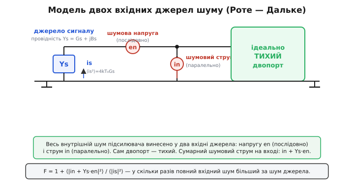
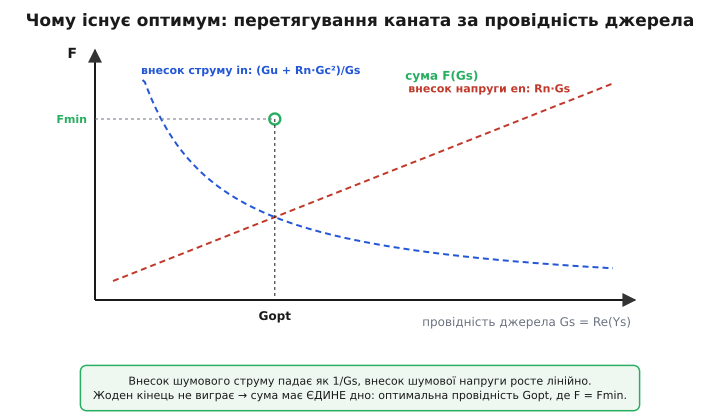

# 🧮 Звідки береться чаша F(Ys) = Fmin + (Rn/Gs)·|Ys − Yopt|²

Чотири числа — Fmin, Rn, Gopt, Bopt — описують увесь шум підсилювача й стягуються в одну коротку формулу. У статті ми взяли її готовою. Тут розберемо, **звідки вона береться** — не приймемо на віру, а виведемо з єдиного фізичного припущення: весь шум двопорту зводиться до двох джерел на вході. По дорозі стане видно те, чого з готової формули не побачиш: **чому штраф квадратичний**, **чому мінімум узагалі існує** і **звідки в ньому береться оптимальна фаза**, за якої два внутрішні шуми частково гасять одне одного. А наприкінці — короткий код на C, що з трьох виміряних чисел (en, in, кореляція) рахує всі чотири параметри даташита.

Виведення варте уваги не лише як вправа. Хто бачив, як саме Fmin, Rn і Yopt виростають із en, in та їхньої кореляції, той **читає рядок даташита як фізику, а не як магію**: розуміє, чому в одних транзисторів чаша гостра, а в інших полога; чому Gopt сидить там, де сидить; і що насправді означає «оптимальна провідність» — не якесь абстрактне число з вимірювань, а точку рівноваги двох конкретних шумових механізмів усередині кристала.

## Одне припущення: весь шум — на вході

Почнемо з фізичного факту, на якому стоїть усе подальше. Реальний підсилювач шумить зсередини: теплове борсання носіїв у каналі, дробовий шум на переходах, наведений шум на затворі. Джерел багато, вони розкидані по схемі — працювати з ними поодинці незручно й непотрібно. Є теорема (її довели [Ганс Роте й Вольфґанг Дальке 1956 року](topic:hw-analog/noise-matching/hist-noise-parameters.md)), що **будь-який лінійний шумливий двопорт точно еквівалентний тому самому двопорту, але ідеально тихому, з двома доданими джерелами шуму на вході**: однією шумовою напругою en послідовно з входом і одним шумовим струмом in паралельно йому.

> 🔧 **Навіщо це.** Без цього зведення кожен транзистор треба було б описувати власною купою внутрішніх джерел — непридатно ні для даташита, ні для розрахунку. Два вхідні джерела — це універсальна, вимірна модель: який завгодно складний усередині підсилювач зовні виглядає як «тиха коробка плюс en та in на вході». Саме тому шумова техніка взагалі може існувати у вигляді чотирьох чисел у таблиці, а не схеми з десятком шумових елементів.

Чому саме **два** джерела і саме напруга та струм? Бо двопорт лінійний, а лінійна система має рівно два незалежні способи внести збурення на вхід: послідовно (джерело напруги) і паралельно (джерело струму). Одного джерела замало — воно не передало б, як шум залежить від опору джерела (а він залежить, і сильно). Трьох забагато — третє виражалося б через перші два. Два — рівно стільки, скільки треба.

Тепер картина схеми. На вході сидить джерело сигналу з провідністю Ys = Gs + jBs. Воно саме шумить тепловим шумом — це фізично неминуче для будь-якої провідності за температури вище нуля (механізм — у статті [тепловий шум](topic:hw-analog/resistor-noise)). Поряд з ним — наші два джерела підсилювача, en і in. Усе це бачить вхід ідеально тихого двопорту.


*Весь внутрішній шум підсилювача винесено в два джерела на вході: напругу en (послідовно) і струм in (паралельно). Сам двопорт після цього — ідеально тихий. Джерело сигналу з провідністю Ys теж шумить власним тепловим струмом is. Коефіцієнт шуму — це відношення всього шуму на вході до шуму самого джерела.*

## Що таке коефіцієнт шуму в цій моделі

Коефіцієнт шуму (точніше — **шумовий множник** F, без децибел) за означенням — у скільки разів відношення сигнал/шум на виході гірше, ніж на вході. Для лінійного двопорту, де і сигнал, і шум проходять той самий шлях із тим самим підсиленням, це відношення зводиться до простішого: **у скільки разів повна шумова потужність на вході більша за шумову потужність самого джерела**.

Чому так? Сигнал і весь шум стоять на вході пліч-о-пліч і множаться далі на той самий коефіцієнт передачі. Підсилення скорочується чисельником і знаменником у відношенні SNR. Лишається голе порівняння потужностей на вході:

```
       повна шумова потужність на вході
F  =  ──────────────────────────────────
        шумова потужність від джерела
```

Тепер зведімо всі джерела до однієї точки — до входу тихого двопорту, як струми, що туди втікають. Так зручно, бо тоді все додається за потужністю (точніше — за спектральними густинами потужності, бо джерела на різних частотах і випадкові). Що туди втікає?

- Від **джерела сигналу** — його тепловий струм is. Його потужність (спектральна густина) для провідності Gs дорівнює ⟨|is|²⟩ = 4kT₀·Gs за одиницю смуги — це формула Найквіста для теплового шуму провідності, де T₀ = 290 К — узгоджена опорна температура шумових вимірювань.
- Від **шумового струму підсилювача** in — він уже паралельний входу, тож утікає як є: внесок ⟨|in|²⟩.
- Від **шумової напруги підсилювача** en — вона послідовна, але джерело має провідність Ys, тож напруга en жене через цю провідність струм Ys·en, який теж утікає у вхід.

Останній пункт — ключ до всього. **Шумова напруга en важить рівно настільки, наскільки провідність джерела Ys перетворює її на струм.** Велика Ys — en дає великий паразитний струм; мала Ys — en майже не чути. Ось де народжується залежність шуму від джерела.

Складемо два струми підсилювача в один сумарний шумовий струм на вході:

```
i_amp = in + Ys·en
```

Тоді відношення потужностей:

```
        ⟨|is|²⟩ + ⟨|in + Ys·en|²⟩            ⟨|in + Ys·en|²⟩
F  =  ──────────────────────────────  =  1 + ─────────────────
                ⟨|is|²⟩                          4kT₀·Gs
```

Одиниця — це внесок самого джерела (ідеальний тихий підсилювач дав би рівно F = 1). Дріб — усе, що додав підсилювач. Уся подальша робота — розкрити чисельник ⟨|in + Ys·en|²⟩ і побачити, що з нього виходить.

## Кореляція: чому in і en — не два чужі шуми

Тут є тонкість, без якої не зрозуміти ні мінімуму, ні оптимальної фази. **Струм in і напруга en не незалежні.** Вони народилися з тих самих фізичних процесів усередині кристала — одне й те саме теплове борсання тих самих носіїв дає внесок і в напругу, і в струм. Тому вони частково **скорельовані**: знаючи миттєве значення en, можна дещо сказати про in.

Розкривати ⟨|in + Ys·en|²⟩ «в лоб» при корельованих доданках незручно — лишається перехресний член ⟨in·en*⟩, який нікуди не дівається. Зробимо стандартний хід Роте — Дальке: **розщепимо in на дві частини — ту, що корелює з en, і ту, що ні**. Корельовану частину завжди можна записати як деяку комплексну провідність, помножену на en (бо це лінійна залежність від en), а решту — як незалежний залишок:

```
in = ic + Yc·en
```

де Yc = Gc + jBc — **провідність кореляції** (вона ловить весь зв'язок in з en), а ic — **некорельований залишок**, що з en уже нічого спільного не має: ⟨ic·en*⟩ = 0. Це не наближення — будь-який in так розкладається однозначно, бо Yc підібрано саме так, щоб виїсти всю кореляцію: Yc = ⟨in·en*⟩ / ⟨|en|²⟩.

> 🔧 **Навіщо це.** Розщеплення на корельоване й незалежне — універсальний прийом усюди, де два випадкові сигнали частково пов'язані (від шуму до обробки сигналів). Тут воно перетворює незручний перехресний член на чисту суму незалежних потужностей, яку вже можна спокійно розкривати. Без нього формула чотирьох параметрів не складається в охайний вигляд — лишається «хвіст» кореляції, який нікуди подіти.

Підставимо й згрупуємо. Сумарний струм підсилювача:

```
i_amp = in + Ys·en = ic + Yc·en + Ys·en = ic + (Ys + Yc)·en
```

Тепер ic і en **незалежні**, тож при піднесенні до квадрата й усередненні перехресний член зникає (середнє від добутку незалежних нулів — нуль), і лишається чиста сума двох потужностей:

```
⟨|i_amp|²⟩ = ⟨|ic|²⟩ + |Ys + Yc|²·⟨|en|²⟩
```

Це й була мета розщеплення: **жодних перехресних членів, дві незалежні потужності**. Перша — потужність некорельованого струму ic. Друга — потужність напруги en, перетворена на струм сумарною провідністю (Ys + Yc).

## Дві провідності-маски: Rn і Gu

Перш ніж рухатися далі, дамо двом потужностям-джерелам зручні імена — такі, щоб вони мали розмірність опору й провідності й читалися як «еквівалентні» величини. Це і є означення двох із чотирьох параметрів.

**Шумовий опір Rn.** Потужність шумової напруги en зручно виразити через опір, який давав би таку саму теплову напругу:

```
⟨|en|²⟩ = 4kT₀·Rn        ⟹    Rn = ⟨|en|²⟩ / (4kT₀)
```

Rn — це **уявний резистор, чий тепловий шум дорівнював би шумовій напрузі підсилювача**. Він не сидить ніде в схемі фізично; це міра «скільки шумової напруги» в зручних одиницях опору. Чим більший Rn, тим більша en.

**Шумова провідність Gu.** Так само потужність некорельованого струму ic виразимо через провідність:

```
⟨|ic|²⟩ = 4kT₀·Gu        ⟹    Gu = ⟨|ic|²⟩ / (4kT₀)
```

Gu — **уявна провідність, чий тепловий шум дорівнював би некорельованій частині шумового струму** (індекс u — від англ. *uncorrelated*). Це той шум, що лишається, навіть коли провідність джерела ідеально «бореться» з en.

Підставимо обидва означення в чисельник і поділимо на знаменник 4kT₀·Gs з формули для F. Множник 4kT₀ скрізь скорочується — і це не випадковість: коефіцієнт шуму безрозмірний, тож абсолютна шкала температури з нього зобов'язана зникнути, лишивши тільки **співвідношення** провідностей. Маємо:

```
        ⟨|ic|²⟩ + |Ys + Yc|²·⟨|en|²⟩       4kT₀·Gu + |Ys + Yc|²·4kT₀·Rn
F  =  1 + ─────────────────────────────  =  1 + ─────────────────────────────
                  4kT₀·Gs                                  4kT₀·Gs
```

```
                Gu + Rn·|Ys + Yc|²
F(Ys)  =  1  +  ──────────────────────
                       Gs
```

Це **повна формула коефіцієнта шуму через джерела** — у термінах en, in, їхньої кореляції (Rn, Gu, Yc). Уже з неї видно все фізично важливе; залишилось переписати її в «даташитному» вигляді з Fmin і Yopt. Розпишемо квадрат модуля, пам'ятаючи Ys = Gs + jBs та Yc = Gc + jBc:

```
|Ys + Yc|² = (Gs + Gc)² + (Bs + Bc)²
```

```
                Gu + Rn·[(Gs + Gc)² + (Bs + Bc)²]
F(Gs, Bs)  =  1 + ─────────────────────────────────────
                              Gs
```

## Чому мінімум існує: перетягування каната за Gs

Тепер найцікавіше — **подивитися на цю формулу як на фізику й знайти, де вона мінімальна**. Це і є «узгодження за шумом»: яку провідність джерела поставити, щоб F був найменший.

Спершу — уявна частина. Bs (реактивна провідність джерела) входить лише в один доданок — (Bs + Bc)², і входить **у квадраті, з плюсом**. Квадрат невід'ємний, найменший — нуль. Тож F найменший, коли цей доданок занулити:

```
Bs + Bc = 0     ⟹     Bopt = −Bc
```

Це фізично прозоро: реактивна провідність джерела має **скомпенсувати** реактивну частину провідності кореляції. Bc — це та частина шумового струму in, що йде в фазі з похідною напруги en (реактивний зв'язок); поставивши Bs = −Bc, ми зводимо реактивний внесок en у нуль. **Перша половина оптимальної точки — це налаштування фази, за якого корельований шум гаситься.** Ось куди поділася кореляція: вона задає, на яку реактивну провідність треба вийти.

Тепер дійсна частина — і тут народжується сам мінімум. Підставимо Bs = −Bc (уже оптимальне) і дивимось на залежність від Gs:

```
              Gu + Rn·(Gs + Gc)²
F(Gs)  =  1 + ─────────────────────
                     Gs
```

Розкриємо чисельник і поділимо почленно на Gs, щоб побачити структуру:

```
              Gu + Rn·Gc²
F(Gs)  =  1 + ───────────── + Rn·Gc·2 + Rn·Gs
                   Gs
              \_____________/            \______/
               падає як 1/Gs            росте лінійно
```

Ось воно — **перетягування каната**. F(Gs) має два доданки, що тягнуть у різні боки:

- Член **(Gu + Rn·Gc²)/Gs** — **падає** з ростом Gs. Це внесок струмових джерел (некорельованого ic і корельованої частини): струм тече в провідність джерела й тим менше шкодить, чим вона більша. Малий Gs — цей член величезний.
- Член **Rn·Gs** — **росте** з Gs лінійно. Це внесок шумової напруги en: вона перетворюється на струм через Ys, і чим більша Gs, тим більший паразитний струм. Великий Gs — цей член величезний.

```
F
│ \                              ╱
│  \  внесок струму            ╱  внесок напруги en
│   \  (Gu+RnGc²)/Gs         ╱    Rn·Gs
│    \                     ╱
│     \                 ╱
│      \    сума F   ╱
│       \._______.╱
│        ‾‾‾● Fmin
│         Gopt
└──────────────────────────── Gs
```

Один член женеться донизу зі зменшенням Gs, другий — догори зі збільшенням. Сума не може бути малою на жодному з кінців: при Gs → 0 перший доданок вибухає, при Gs → ∞ — другий. Десь посередині — **єдиний мінімум**. Це не випадковість і не особливість конкретного транзистора: щойно є і шумова напруга (Rn > 0), і шумовий струм (Gu > 0), мінімум зобов'язаний існувати. **Ось чому в кожного підсилювача є оптимальна провідність джерела за шумом** — це точка рівноваги двох протилежних механізмів.


*Шум напруги en росте з провідністю джерела (паразитний струм Ys·en), шум струму in — навпаки, падає (тече у більшу провідність). Жоден кінець не виграє: на малому Gs вибухає струмовий член, на великому — напруговий. Сума має єдине дно — оптимальну провідність Gopt.*

Знайдемо це дно строго. Сума виду a/Gs + b·Gs (де a = Gu + Rn·Gc², b = Rn) — класична: похідна −a/Gs² + b, нуль при Gs² = a/b. Звідси:

```
            ┌──────────────
Gopt  =  ╲╱  Gc²  +  Gu/Rn
```

Це і є **оптимальна дійсна провідність**. Подивіться на її будову: під коренем — два доданки. Gc² — внесок кореляції (де сидить корельований шум). Gu/Rn — змагання некорельованого струму (Gu) проти напруги (Rn): чим тихіша напруга en (менший Rn), тим далі праворуч відсувається оптимум, бо за тиху напругу можна дозволити собі більшу провідність. Оптимальна провідність — це **геометричне серединне між двома шумовими механізмами**.

## Збираємо в даташитну форму

Маємо обидві координати оптимуму: Bopt = −Bc, Gopt = √(Gc² + Gu/Rn). Підставимо їх назад у F(Gs), щоб дістати саме дно — мінімальний коефіцієнт шуму. У точці мінімуму a/Gs + b·Gs = 2√(ab) (відоме: сума досягає 2√(ab)), плюс лінійний хвіст 2·Rn·Gc:

```
Fmin = 1 + 2·Rn·Gc + 2·√(Rn·(Gu + Rn·Gc²))
     = 1 + 2·Rn·Gc + 2·Rn·√(Gc² + Gu/Rn)
     = 1 + 2·Rn·(Gc + Gopt)
```

Ось три з чотирьох параметрів, виражені через фізичні джерела:

```
Bopt = −Bc
Gopt = √(Gc² + Gu/Rn)
Fmin = 1 + 2·Rn·(Gopt + Gc)
```

а четвертий, Rn, ми вже маємо прямо з en. Лишається останній крок — показати, що повна формула F(Ys) тепер **точно** переписується в коротку даташитну. Це не нове припущення, а алгебраїчне тотожне перетворення: ми покажемо, що

```
        Gu + Rn·|Ys + Yc|²              Rn
F(Ys) = 1 + ──────────────────  ≡  Fmin + ──·|Ys − Yopt|²
                  Gs                       Gs
```

Доведення — підстановка. Розпишемо праву частину, пам'ятаючи Yopt = Gopt − jBc (бо Bopt = −Bc):

```
|Ys − Yopt|² = (Gs − Gopt)² + (Bs + Bc)²
```

Тоді права частина:

```
Fmin + (Rn/Gs)·[(Gs − Gopt)² + (Bs + Bc)²]
```

Розкриємо (Gs − Gopt)² = Gs² − 2·Gs·Gopt + Gopt² і згадаємо Gopt² = Gc² + Gu/Rn (з означення Gopt), а також Fmin = 1 + 2Rn(Gopt + Gc):

```
Fmin + (Rn/Gs)·(Gs² − 2 Gs Gopt + Gopt²) + (Rn/Gs)(Bs+Bc)²
= [1 + 2Rn Gopt + 2Rn Gc] + Rn·Gs − 2Rn·Gopt + (Rn/Gs)(Gc² + Gu/Rn) + (Rn/Gs)(Bs+Bc)²
```

Член −2Rn·Gopt скорочується з +2Rn·Gopt усередині Fmin. Лишається:

```
= 1 + 2Rn·Gc + Rn·Gs + (Rn·Gc² + Gu)/Gs + (Rn/Gs)(Bs+Bc)²
```

А це — рівно ліва частина, якщо її розкрити так само:

```
1 + [Gu + Rn((Gs+Gc)² + (Bs+Bc)²)]/Gs
= 1 + Gu/Gs + (Rn/Gs)(Gs+Gc)² + (Rn/Gs)(Bs+Bc)²
= 1 + Gu/Gs + (Rn/Gs)(Gs² + 2GsGc + Gc²) + (Rn/Gs)(Bs+Bc)²
= 1 + Gu/Gs + Rn·Gs + 2Rn·Gc + Rn·Gc²/Gs + (Rn/Gs)(Bs+Bc)²
```

Член у член збігається. **Тотожність доведено.** Дві формули — це одне й те саме, записане в різних координатах: ліва — через фізичні джерела (Gu, Rn, Yc), права — через геометрію оптимуму (Fmin, Rn, Yopt). Друга зручніша інженерові (зразу видно дно й відстань до нього), перша ближча до фізики кристала.

```
                    Rn
F(Ys) = Fmin  +  ─────── · |Ys − Yopt|²
                    Gs
```

## Чому штраф саме квадратичний

Тепер видно відповідь на питання, з якого почали. Штраф пропорційний **квадрату** відстані |Ys − Yopt| не тому, що так гарніше, а тому, що **повна шумова потужність на вході — квадратична функція джерела за побудовою**. Усе почалося з ⟨|in + Ys·en|²⟩ — а квадрат модуля лінійної функції від Ys є квадратичною формою від (Gs, Bs). Інакше й бути не могло: потужність — це завжди квадрат амплітуди, а сумарний шумовий струм лінійно залежить від Ys через член Ys·en. Квадрат лінійного — квадратичне.

Геометрично квадратична форма над площиною (Gs, Bs) — це параболоїд, «чаша». У неї єдине дно (Fmin при Yopt), а лінії сталого рівня — кола (точніше — кола після нормування на Gs). Біля дна чаша полога: маленький крок убік дає штраф ~(крок)², тобто майже нуль. Далі стінки круто йдуть угору. **Звідси й практичний висновок:** невелика похибка узгодження майже безкоштовна, а от груба — карається квадратично жорстко. Множник Rn/Gs задає крутість стінок: великий шумовий опір Rn робить чашу гострою (кожен мілісименс відходу дорогий), малий — пологою (узгодження некритичне). Поділ на Gs трохи деформує кола в напрямі провідності — але суть та сама: квадратичне дно.

## Worked-приклад: три виміри → чотири параметри

Покажемо весь шлях у коді: з трьох вимірюваних величин — шумової напруги en, шумового струму in і комплексного коефіцієнта кореляції c між ними — порахуємо чотири параметри даташита. Саме це робить установка для вимірювання шумових параметрів усередині; пройдемо ту саму арифметику руками й на C.

Коефіцієнт кореляції c — це нормований перехресний добуток, |c| ≤ 1: c = ⟨in·en*⟩ / √(⟨|in|²⟩·⟨|en|²⟩). З нього провідність кореляції Yc = c·(in/en) (модулі), а некорельована частка струму — частка (1 − |c|²) повної потужності in.

**Параметри LNA з виміряних джерел.** Виміряно: en = 0.45 нВ/√Гц, in = 4.0 пА/√Гц, коефіцієнт кореляції c = 0.2 + j·0.3 (|c| ≈ 0.36). Опорна температура T₀ = 290 К. Знайти Rn, Gu, Yopt, Fmin.

:::tabs
```cpp
#include <cmath>
#include <complex>

using cplx = std::complex<double>;

constexpr double K_BOLTZ = 1.380649e-23;
constexpr double T0      = 290.0;
constexpr double FOUR_KT = 4.0 * K_BOLTZ * T0;   // 4kT₀ ≈ 1.6e-20

struct NoiseParams { double Fmin, Rn, Gopt, Bopt; };

// З двох вхідних джерел (en, in) та їх кореляції c — чотири шумові параметри.
// en у В/√Гц, in у А/√Гц, c безрозмірний комплексний (|c| ≤ 1).
NoiseParams noise_params(double en, double in_, cplx c) {
    double en2 = en * en;                 // ⟨|en|²⟩  (густина потужності напруги)
    double in2 = in_ * in_;               // ⟨|in|²⟩  (густина потужності струму)

    double Rn = en2 / FOUR_KT;            // шумовий опір з напруги

    // провідність кореляції: Yc = c · (in/en)  (відношення модулів × фаза c)
    cplx Yc = c * (in_ / en);
    double Gc = Yc.real(), Bc = Yc.imag();

    // некорельована частка струму: потужність × (1 − |c|²) → провідність Gu
    double in2_uncorr = in2 * (1.0 - std::norm(c));
    double Gu = in2_uncorr / FOUR_KT;

    NoiseParams p;
    p.Bopt = -Bc;                                 // компенсуємо реактивну кореляцію
    p.Gopt = std::sqrt(Gc*Gc + Gu / Rn);          // геометричне серединне двох механізмів
    p.Fmin = 1.0 + 2.0 * Rn * (p.Gopt + Gc);      // дно чаші (у разах)
    p.Rn   = Rn;
    return p;
}

// виклик:
double en = 0.45e-9;                      // 0.45 нВ/√Гц
double in_ = 4.0e-12;                     // 4.0 пА/√Гц
cplx c{0.2, 0.3};                         // кореляція
NoiseParams p = noise_params(en, in_, c);
// p.Rn ≈ 12.6 Ом
// p.Gopt ≈ 8.48 мСм,  p.Bopt ≈ −2.67 мСм   →  Yopt ≈ (8.48 − j2.67) мСм
// p.Fmin ≈ 1.259 разів  →  10·log10 ≈ 1.00 дБ
```
```python
import cmath
from dataclasses import dataclass

K_BOLTZ = 1.380649e-23
T0      = 290.0
FOUR_KT = 4.0 * K_BOLTZ * T0             # 4kT₀ ≈ 1.6e-20

@dataclass
class NoiseParams:
    Fmin: float
    Rn:   float
    Gopt: float
    Bopt: float

# З двох вхідних джерел (en, in) та їх кореляції c — чотири шумові параметри.
# en у В/√Гц, in у А/√Гц, c безрозмірний комплексний (|c| ≤ 1).
def noise_params(en: float, i_n: float, c: complex) -> NoiseParams:
    en2 = en * en                        # ⟨|en|²⟩  (густина потужності напруги)
    in2 = i_n * i_n                      # ⟨|in|²⟩  (густина потужності струму)

    Rn = en2 / FOUR_KT                   # шумовий опір з напруги

    # провідність кореляції: Yc = c · (in/en)  (відношення модулів × фаза c)
    Yc = c * (i_n / en)
    Gc, Bc = Yc.real, Yc.imag

    # некорельована частка струму: потужність × (1 − |c|²) → провідність Gu
    in2_uncorr = in2 * (1.0 - abs(c)**2)
    Gu = in2_uncorr / FOUR_KT

    Bopt = -Bc                                   # компенсуємо реактивну кореляцію
    Gopt = cmath.sqrt(Gc*Gc + Gu / Rn).real      # геометричне серединне двох механізмів
    Fmin = 1.0 + 2.0 * Rn * (Gopt + Gc)          # дно чаші (у разах)
    return NoiseParams(Fmin, Rn, Gopt, Bopt)

# виклик:
en  = 0.45e-9                            # 0.45 нВ/√Гц
i_n = 4.0e-12                            # 4.0 пА/√Гц
c   = 0.2 + 0.3j                         # кореляція
p = noise_params(en, i_n, c)
# p.Rn ≈ 12.6 Ом
# p.Gopt ≈ 8.48 мСм,  p.Bopt ≈ −2.67 мСм   →  Yopt ≈ (8.48 − j2.67) мСм
# p.Fmin ≈ 1.259 разів  →  10·log10 ≈ 1.00 дБ
```
:::

Пройдемо ту саму арифметику руками — щоб видно було, як кожне число виростає з фізики, а не з виклику функції:

```
4kT₀ = 4 · 1.380649×10⁻²³ · 290 = 1.6015×10⁻²⁰

шумовий опір:
  ⟨|en|²⟩ = (0.45×10⁻⁹)² = 2.025×10⁻¹⁹ В²/Гц
  Rn = 2.025×10⁻¹⁹ / 1.6015×10⁻²⁰ = 12.64 Ом

провідність кореляції (Yc = c·in/en):
  in/en = 4.0×10⁻¹² / 0.45×10⁻⁹ = 8.889×10⁻³ См
  Yc = (0.2 + j0.3)·8.889×10⁻³ = (1.778 + j2.667)×10⁻³ См
  Gc = 1.778 мСм,  Bc = 2.667 мСм

некорельована провідність струму:
  |c|² = 0.2² + 0.3² = 0.13
  ⟨|ic|²⟩ = (4.0×10⁻¹²)²·(1 − 0.13) = 1.6×10⁻²³·0.87 = 1.392×10⁻²³ А²/Гц
  Gu = 1.392×10⁻²³ / 1.6015×10⁻²⁰ = 0.869×10⁻³ См = 0.869 мСм

оптимальна провідність:
  Gopt = √(Gc² + Gu/Rn)
       = √((1.778×10⁻³)² + 0.869×10⁻³/12.64)
       = √(3.162×10⁻⁶ + 68.75×10⁻⁶)
       = √(71.91×10⁻⁶) = 8.480×10⁻³ См = 8.48 мСм
  Bopt = −Bc = −2.667 мСм
  Yopt = (8.48 − j2.67) мСм      →  Zopt = 1/Yopt ≈ (107 + j34) Ом

мінімальний коефіцієнт шуму:
  Fmin = 1 + 2·12.64·(8.480×10⁻³ + 1.778×10⁻³)
       = 1 + 25.28·10.258×10⁻³
       = 1 + 0.2593 = 1.2593   ... у разах
  Fmin[дБ] = 10·log₁₀(1.2593) = 1.00 дБ
```

Подивіться, що сказали числа. Шумовий опір Rn ≈ 12.6 Ом — помірний, чаша не надто гостра. Оптимальна провідність Gopt ≈ 8.5 мСм відповідає опору Zopt ≈ 107 Ом — тобто найтихіше джерело для цього транзистора **не** 50-омне, а ближче до сотні ом, та ще й з невеликою реактивною частиною (Bopt ≈ −2.7 мСм компенсує реактивну кореляцію). Якби ми за рефлексом узгодили вхід на 50 Ом за потужністю — промахнулися б повз Yopt і доплатили шумом рівно стільки, скільки дає формула F(Ys) = Fmin + (Rn/Gs)·|Ys − Yopt|². А Fmin ≈ 1.0 дБ — це фізична межа цього кристала в цьому режимі: дно чаші, нижче якого жодним узгодженням не опустишся.

Зворотний хід — від чотирьох параметрів даташита назад до F при будь-якому джерелі — тривіальний і вже стоїть у статті-власнику: підставив Ys у F(Ys), дістав коефіцієнт шуму. Цей же приклад показав інший, рідше згаданий бік: **звідки самі чотири параметри беруться** — з трьох фізичних чисел про два внутрішні джерела шуму та їхню спільну природу.

## Що варто винести

Формула F(Ys) = Fmin + (Rn/Gs)·|Ys − Yopt|² — не аксіома, а наслідок одного припущення: весь шум двопорту зводиться до двох вхідних джерел, напруги en і струму in. Розклавши струм на корельовану з en частину (через провідність кореляції Yc) і незалежний залишок, повну шумову потужність на вході вдається записати чистою сумою без перехресних членів — і вона виявляється **квадратичною функцією провідності джерела**, бо потужність є квадрат амплітуди, а сумарний шумовий струм лінійно залежить від Ys. Звідси неминуче: штраф ∝ |Ys − Yopt|² (квадрат — від квадрата амплітуди), мінімум існує (перетягування каната між внеском en, що росте з Gs, і внеском струму, що падає як 1/Gs), а оптимальна фаза Bopt = −Bc гасить реактивну кореляцію. Чотири параметри даташита — це лише зручні імена фізичних величин: Rn = ⟨|en|²⟩/4kT₀ (скільки шумової напруги), Gopt = √(Gc² + Gu/Rn) (рівновага двох механізмів), Bopt = −Bc (компенсація кореляції), Fmin = 1 + 2Rn(Gopt + Gc) (дно). Хто пройшов це виведення, той бачить за рядком даташита не магічні числа, а два конкретні джерела шуму в кристалі та їхній спільний корінь.
